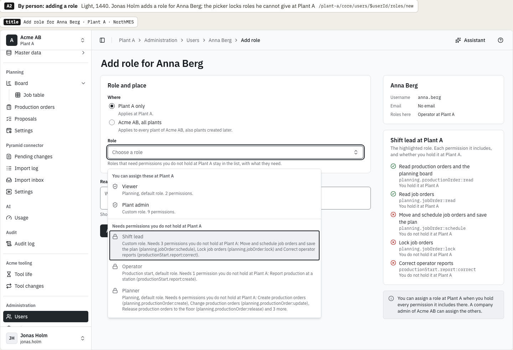
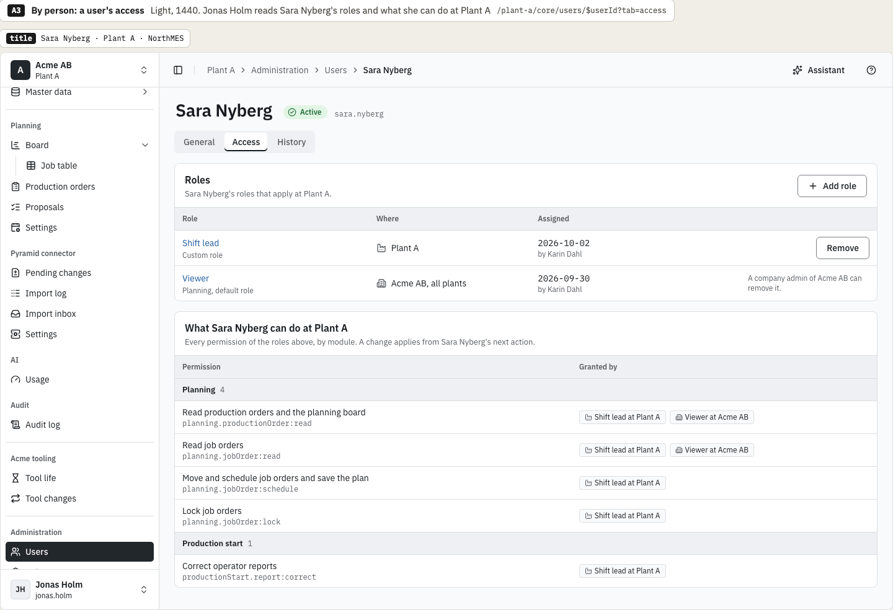
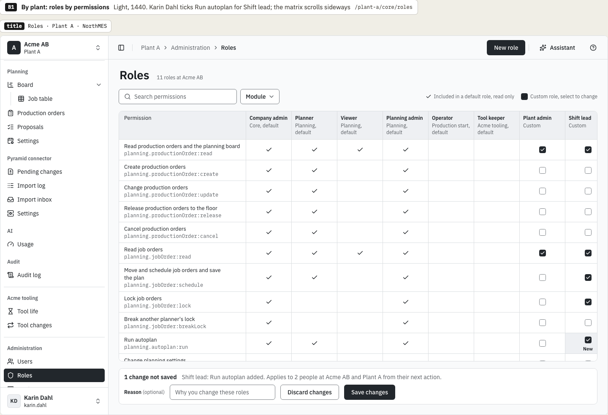
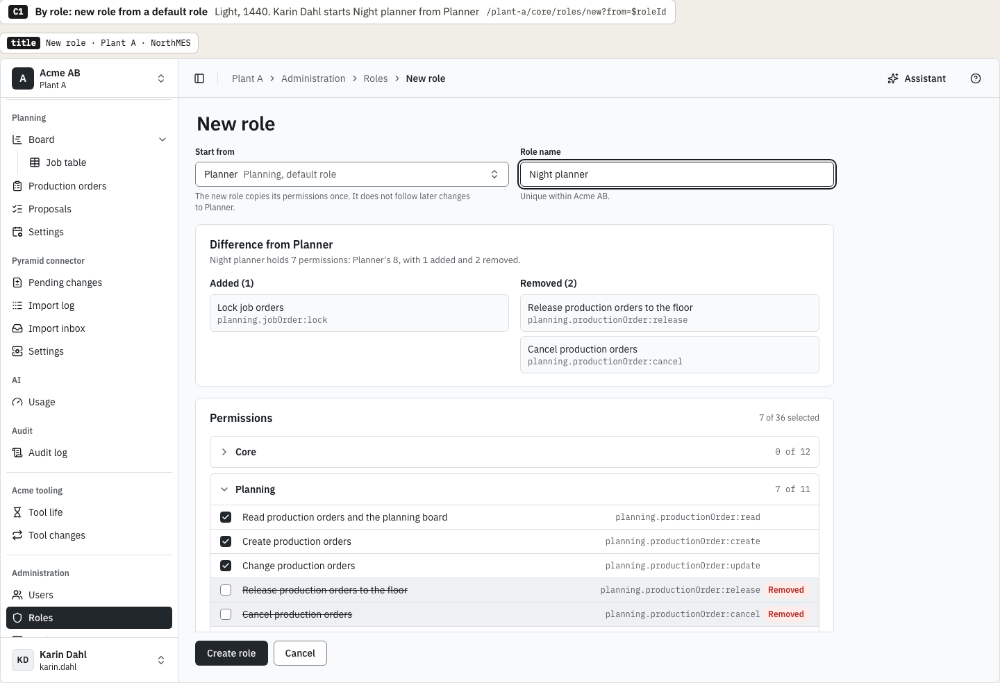
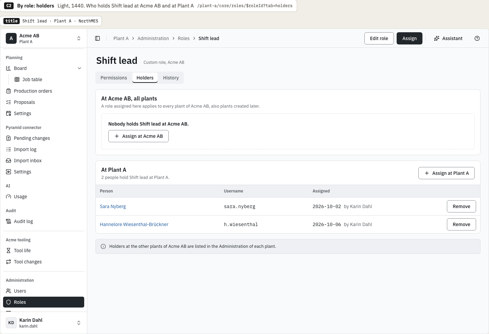
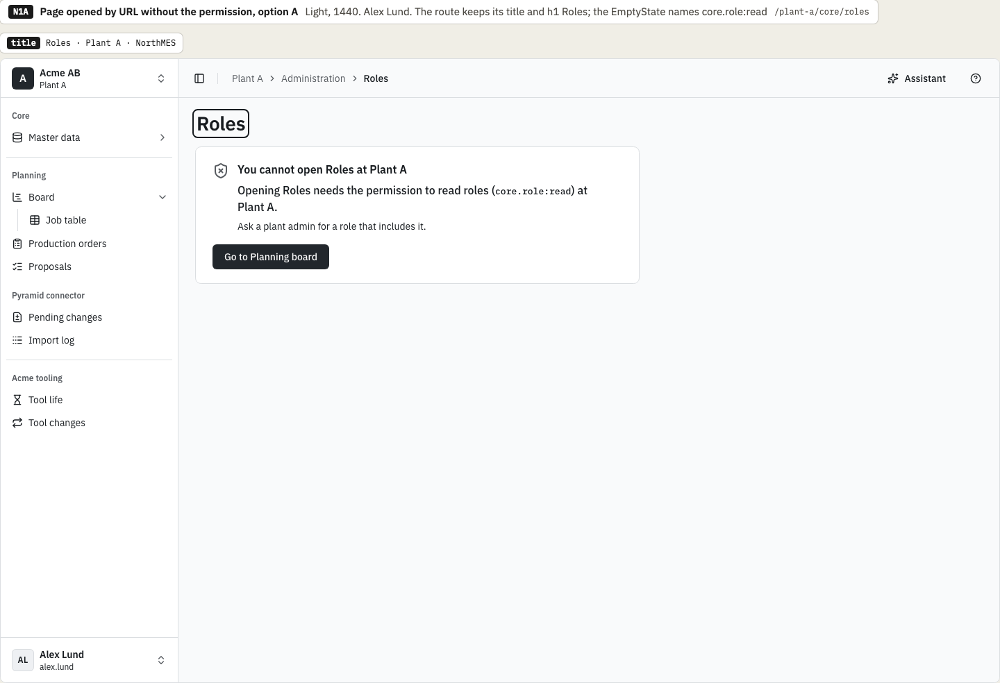
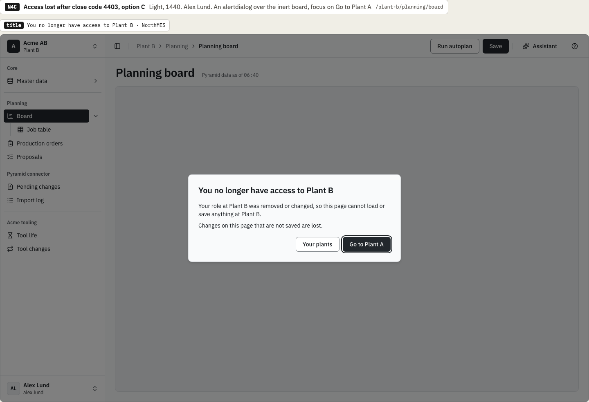
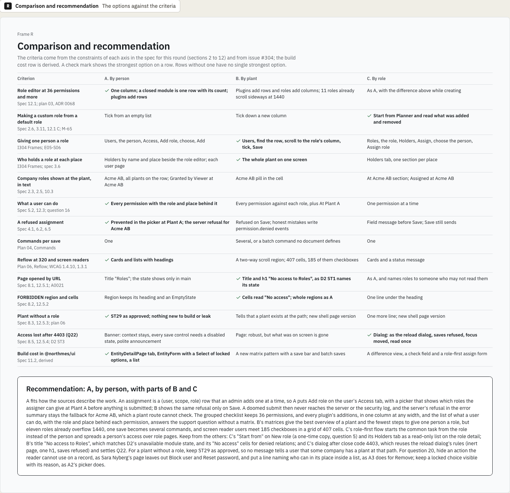

# Access management variations: chosen direction

This is the decision record of the variations round for access management and the no-access states, issue [northMES/northmes#304](https://github.com/northMES/northmes/issues/304), for story E05-S06 ([northMES/northmes#54](https://github.com/northMES/northmes/issues/54)). The variations page is [core/core-304-access-variations.dc.html](https://claude.ai/design/p/dba068e0-37df-46e5-adcf-4439b6c4c0ad?file=core%2Fcore-304-access-variations.dc.html) in the Claude Design project. It is not an approved page; the spec page that issue #304 names, `core/core-304-access.dc.html`, follows the chosen direction and is approved on its own.

The round drew three ways to organize access management inside the D2 shell, on the roles and people of Acme AB at Plant A: A, by person; B, by plant; C, by role. Each option also drew its version of four no-access states: a page opened by URL without the permission (N1), a region whose data is FORBIDDEN (N2), a plant without a role (N3), and the message after access is lost with close code 4403 (N4).

## Decision

Krister Johansson chose on 2026-10-08:

- Option A, by person. Roles are added to and removed from the user: Add role sits on the user's Access tab, with a picker that shows which roles the assigner can give at Plant A, and Remove opens a ConfirmDialog with the reason, the permissions lost and the role that still applies. The role editor lists the permissions grouped by module, each in plain words, and a closed module is one row with its count. What the user can do at a plant is a list with the role and place behind each permission.
- From option C, three parts:
  - The "Start from" choice on New role. The new role copies the permissions of a default role such as Planner once and does not follow later changes to it, since `core.role` stores no base role (question 5).
  - A Holders tab on a role, read only: who holds the role, one section per place, Acme AB first. In C the tab also offered Assign and Remove; in A, roles are given and taken on the user.
  - A dialog after access is lost mid-session (close code 4403), which settles question Q22 of the [D2 record](../shell/shell-190-navigation.md). It follows the reload dialog's rules: an alertdialog over an inert page, its heading the only h1, focus on Go to Plant A, and saves refused. Its title is "You no longer have access to Plant B · NorthMES".
- From option B, two parts:
  - The page title "No access to Roles" for the Roles page opened by URL without the permission, which matches D2's name for its unavailable module state. In B the full title reads "No access to Roles · Plant A · NorthMES".
  - The "No access" cells in the effective permissions view. B drew such cells with a lock icon, and the column header's tooltip names the missing permission (N2 B).

The comparison frame recommends this combination. An assignment is a (user, scope, role) row that an admin adds one at a time, so A puts Add role on the user's Access tab, and its picker shows which roles the assigner can give at Plant A before anything is submitted. A doomed submit then never reaches the server or the security log, and the server's refusal in the error summary stays the fallback for Acme AB, which a plant route cannot check. The grouped checklist keeps 36 permissions, and every plugin's additions, in one column at any width. The list of what a user can do, with the role and place behind each permission, answers the support question without a matrix.

The recommendation also keeps ST29 as approved for a plant without a role, as A does, so no message tells a user that some company has a plant at that path. For question 20 it proposes to hide an action the reader cannot use on a record, as Sara Nyberg's page leaves out Block user and Reset password, to put a line naming who can in its place inside a list, as A3 does for Remove, and to keep a locked choice visible with its reason, as A2's picker does.

The notes under each option list what the chosen parts still cost:

- A has no overview of a plant: a person's access is on their own user page.
- A's picker can check only Plant A. With Acme AB, all plants chosen, every role is selectable under the line "Checked when you add it: you need every permission of the role at Acme AB.", and a refusal appears in the error summary.
- The list of what a user can do needs a new core read field for another user's permissions (question 16).
- C's dialog hides the page behind it, and Escape does nothing, which repeats question K8 of the D2 record.

## Options not chosen

The comparison frame and the notes under each option give these reasons.

Option B as a whole, by plant, was not chosen:

- Eleven roles already overflow 1440, so B1 scrolls sideways; one-permission custom roles and plugins add columns, and 1280 shows fewer. At 320 the matrix is a region that scrolls in two directions (B5).
- A save with changes in several roles or for several people is several commands, or a batch command that no document defines.
- Refused on Save, a doomed change reaches the server and writes `permission.denied` events for honest mistakes.
- Screen reader users meet a grid of 407 cells, 185 of them checkboxes.
- Its 403 page for a plant without a role, apart from Page not found, tells a user that some company has a plant at that path, and it changes an approved shell state.
- Its access-lost page drops what was on screen and any typed values.

B gave the best overview of a plant and the fewest steps to give one person a role: Users, find the row, scroll to the role's column, tick, Save.

Option C as a whole, by role, was not chosen:

- Giving one person a role means finding the role first (Roles, the role, Holders, Assign, choose the person, Assign role), and a person's roles are spread over role pages.
- A user's access is a yes or no check that shows one permission at a time; an overview still needs the full list.
- Naming the roles that include a missing permission shows role names to people who cannot open Roles (question 3).
- ST29 with one more line changes an approved shell state, which needs a new shell page version.

## Frames

Option A at 1440, light: Jonas Holm adds a role for Anna Berg, and the picker locks the roles he cannot give at Plant A:

Option A at 1440, light: Jonas Holm reads Sara Nyberg's roles and what she can do at Plant A:

Option B at 1440, light: Karin Dahl ticks Run autoplan for Shift lead in the roles by permissions matrix, which scrolls sideways:

Option C at 1440, light, for the "Start from" choice: Karin Dahl starts Night planner from Planner:

Option C at 1440, light, for the Holders tab: who holds Shift lead at Acme AB and at Plant A. The chosen tab is read only:

Option A at 1440, light: Alex Lund opens Roles by URL without the permission, and the EmptyState names `core.role:read`. The chosen page title is "No access to Roles", the wording of option B; this frame shows A's title "Roles":

Option C at 1440, light: the dialog after close code 4403, an alertdialog over the inert planning board at Plant B with focus on Go to Plant A:

The comparison and recommendation frame:

