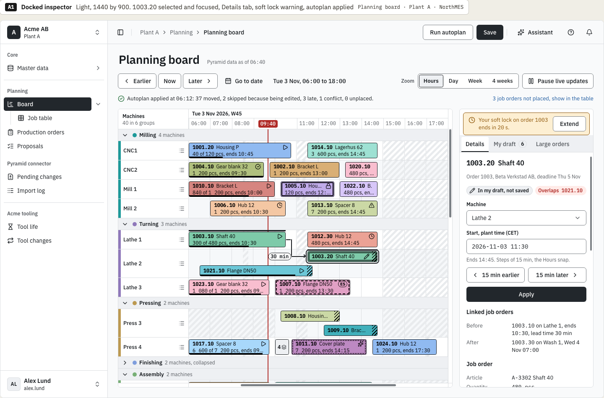
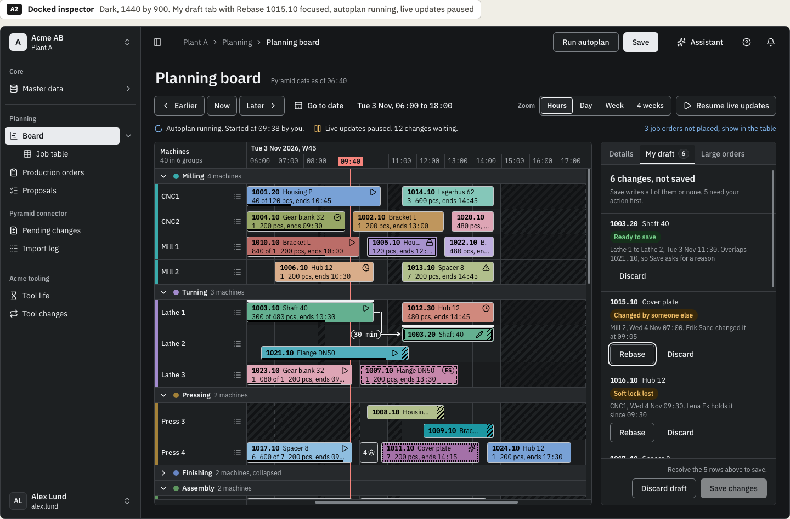
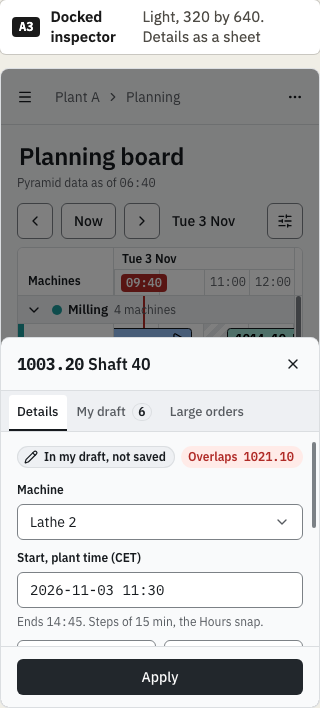
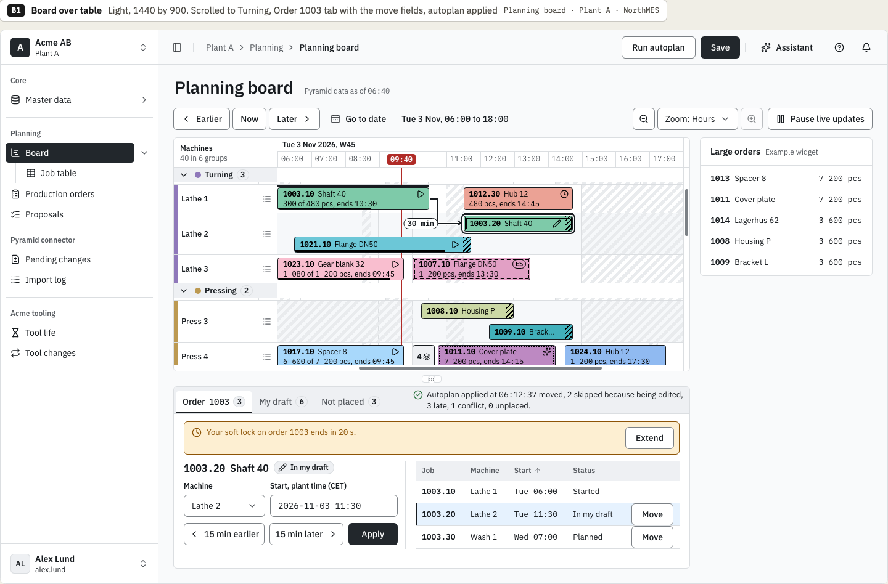
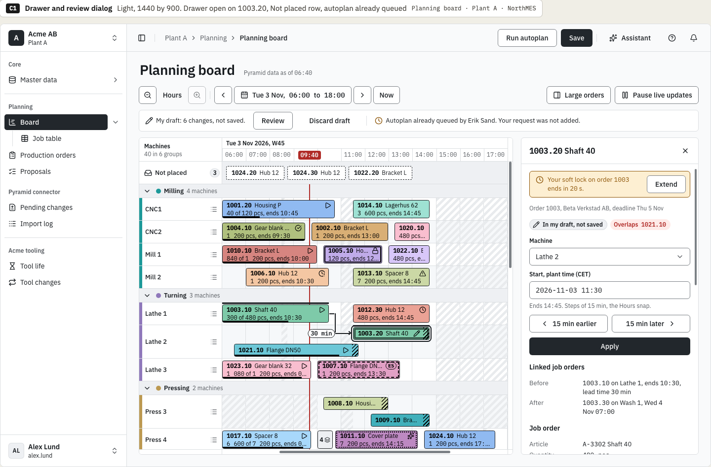
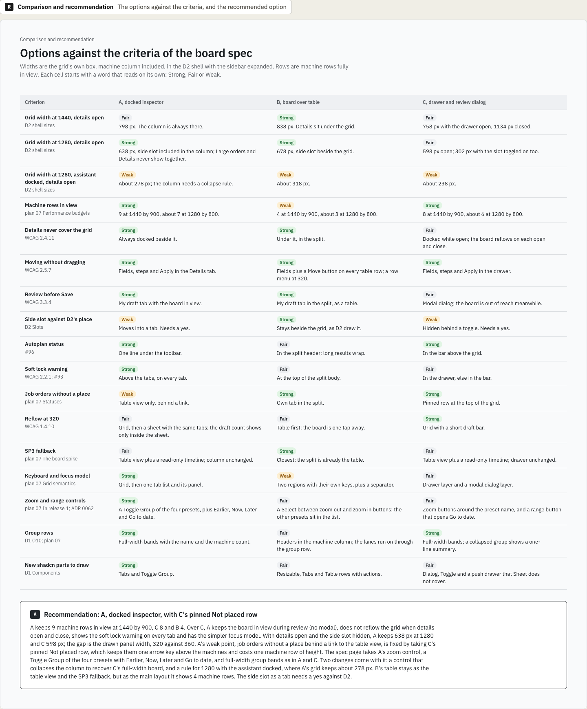

# D3 variations: chosen direction

This is the decision record of the variations round for design task D3, issue [northMES/northmes#221](https://github.com/northMES/northmes/issues/221), for story E08-S01 ([northMES/northmes#88](https://github.com/northMES/northmes/issues/88)). The variations page is [planning/planning-221-board-variations.dc.html](https://claude.ai/design/p/dba068e0-37df-46e5-adcf-4439b6c4c0ad?file=planning%2Fplanning-221-board-variations.dc.html) in the Claude Design project. It is not an approved page; the D3 spec page `planning/planning-221-board.dc.html` follows the chosen direction and is approved on its own.

The round drew three page layouts of the planning board inside the D2 shell, each with the same plan: A, docked inspector; B, board over table; C, drawer and review dialog.

## Decision

Krister Johansson chose on 2026-10-07:

- Option A, the docked inspector: a 320 px column beside the grid with the tabs Details, My draft and Large orders. It docks and narrows the grid and never covers it. Save in the top bar opens the My draft tab, where every row shows its status before Save changes commits.
- From option C, the pinned "Not placed" row at the top of the grid. It keeps the job orders without a place one arrow key above the machines and costs one machine row of height. In option A alone they showed only in the table view, behind a link in the status line.
- The board side slot `planning/board/side/v1` becomes a tab of the inspector (the Large orders tab in the frames) instead of D2's separate 280 px column beside the grid. This changes D2's placement of the slot; the D3 spec page records the change.

The recommendation in the comparison frame also lists what the spec page takes from the round: A's zoom control, a Toggle Group of the four presets with Earlier, Now, Later and Go to date, and full-width group bands as in A and C. It names two changes that come with A: a control that collapses the inspector to recover a full-width board, and a rule for 1280 with the assistant docked, where A's grid keeps about 278 px.

## Options not chosen

The comparison frame and the notes under each option give these reasons.

Option B, board over table, was not chosen:

- It shows 4 machine rows at 1440 by 900 and about 3 at 1280 by 800, against about 40 machines.
- The grid and the table are two regions with their own keyboard models, plus a resize separator.
- The split header holds the tabs and the autoplan status, so a long result wraps to two lines.
- At 320 the board is a second step, because the table opens first.

B kept the side slot where D2 put it and was the closest to the fallback if the board spike SP3 fails. Its table stays as the table view and that fallback.

Option C as a whole, drawer and review dialog, was not chosen:

- The 360 px drawer narrows the grid to 758 px at 1440 and reflows the board on every open and close. With details open at 1280, C keeps 598 px for the grid and A keeps 638 px.
- The review dialog is modal, so the board is out of reach while the planner resolves rows.
- The side slot hides behind a toggle, out of view by default.
- The bar and the pinned row take about 100 px of height, so C shows 8 machine rows at 1440 by 900 where A shows 9.

## Frames

Option A at 1440 by 900, light, with 1003.20 selected, the Details tab, the soft lock warning and autoplan applied:

Option A at 1440 by 900, dark, with the My draft tab, autoplan running and live updates paused:

Option A at 320 by 640, light, with the details as a sheet:

Option B at 1440 by 900, light, with the order's move fields in the split under the board:

Option C at 1440 by 900, light, for the pinned "Not placed" row:

The comparison and recommendation frame:

