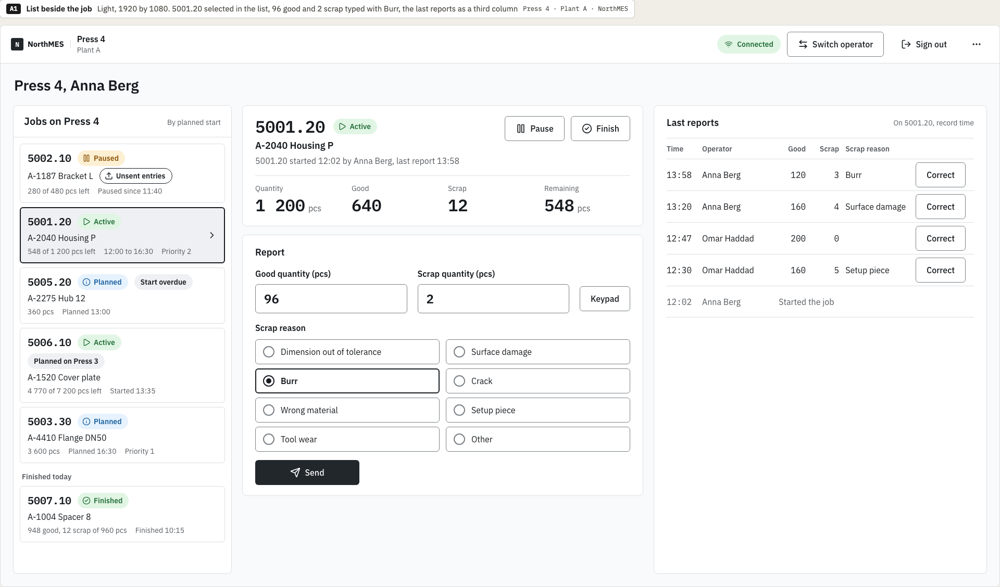
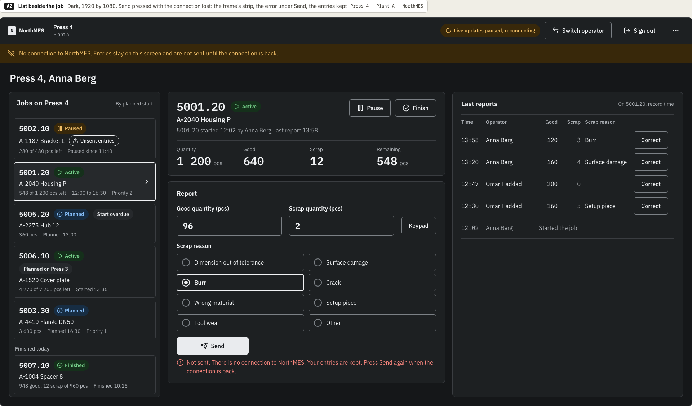
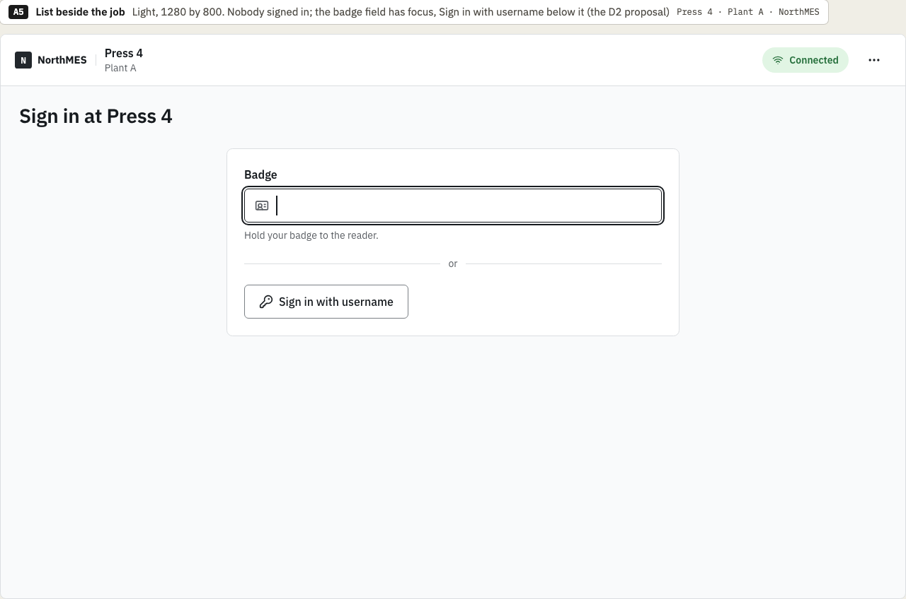
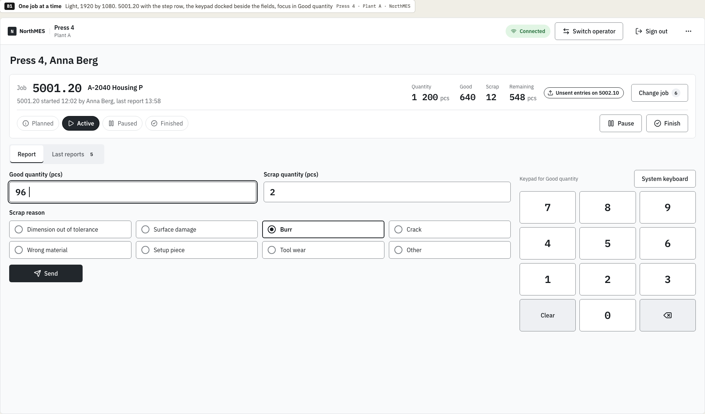
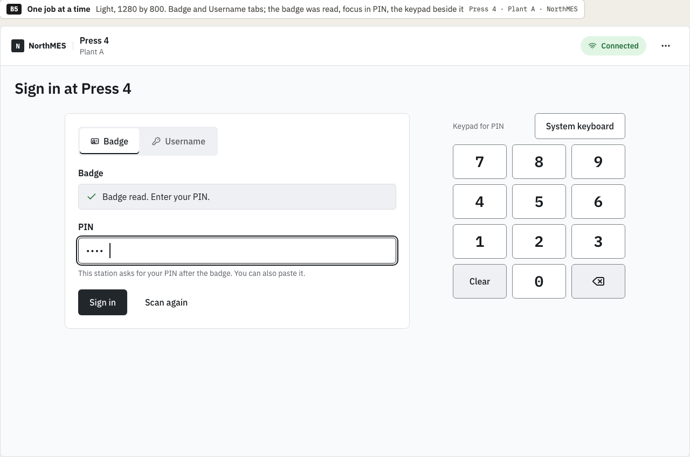
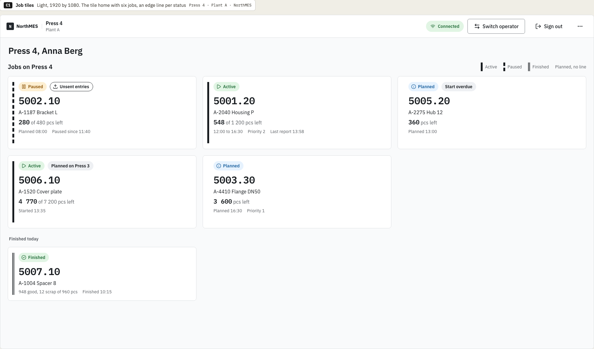
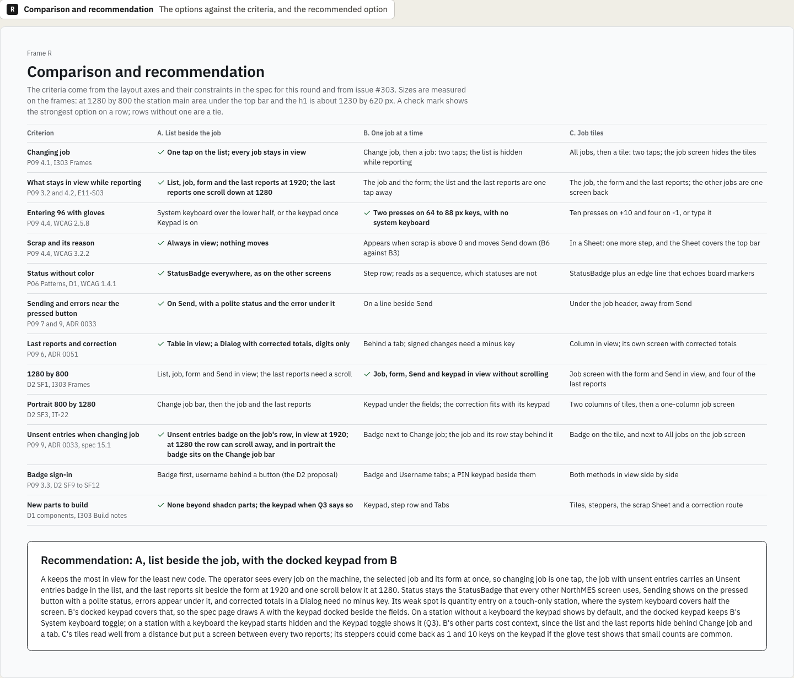

# D4 operator station variations: chosen direction

This is the decision record of the variations round for design task D4, the operator station, issue [northMES/northmes#303](https://github.com/northMES/northmes/issues/303), for story E11-S01 ([northMES/northmes#115](https://github.com/northMES/northmes/issues/115)). The variations page is [production-start/production-start-303-station-variations.dc.html](https://claude.ai/design/p/dba068e0-37df-46e5-adcf-4439b6c4c0ad?file=production-start%2Fproduction-start-303-station-variations.dc.html) in the Claude Design project. It is not an approved page; the spec page that issue #303 names, `production-start/production-start-303-station.dc.html`, follows the chosen direction and is approved on its own.

The round drew three layouts of the station screen inside the D2 station frame, each with the same jobs on Press 4 at Plant A: A, list beside the job; B, one job at a time; C, job tiles. Each option has frames at 1920 by 1080 in light and dark, at 1280 by 800, in portrait at 800 by 1280, and a sign-in frame.

## Decision

Krister Johansson chose on 2026-10-08:

- Option A, list beside the job. The job list sits beside the selected job and its report form. At 1920 the last reports are a third column; at 1280 they sit one scroll below the form.
- From option B, the docked keypad. On a station without a keyboard the keypad shows by default, with B's System keyboard toggle, which brings the device keyboard back. On a station with a keyboard the keypad starts hidden behind a Keypad toggle. Whether stations have a keyboard stays open as question Q3 of the variations page, which asks whether the station hardware is touch only or has a keyboard.

The comparison frame recommends this combination. A keeps the most in view for the least new code: the operator sees every job on the machine, the selected job and its form at once, so changing job is one tap, and a job with unsent entries carries an Unsent entries badge on its row. Status stays the StatusBadge that the other NorthMES screens use, Sending shows on the pressed button with a polite status, errors appear under it, and corrected totals in a Dialog need no minus key. A is built from shadcn parts the station needs anyway: Button, Badge, Field, Input, Radio Group, Table and Dialog.

A's weak spot is quantity entry on a touch-only station, where the system keyboard covers the lower half of the screen. B's docked keypad covers that. B's notes give the keypad's rules: its keys are 64 to 88 px for gloves, it adds digits to the focused field only, the field has inputmode none while the keypad shows, and it has no decimal key for pcs.

A's notes list what it still costs:

- At 1280 by 800 the list takes 320 px and the form fills the rest, so the last reports need a scroll. The list scrolls too, so the row with the Unsent entries badge can leave the view.
- The correction Dialog covers the list and the form while it is open.
- In portrait the list becomes a Change job bar, so A works like B there, and the Unsent entries badge moves onto the bar.

## Options not chosen

The comparison frame and the notes under each option give these reasons.

Option B as a whole, one job at a time, was not chosen:

- Changing job takes two taps, Change job and then a job, and the other jobs are hidden while the operator reports.
- The last reports sit behind a tab, so the operator does not see the previous report while typing the next one.
- The reason group appears when scrap goes above 0 and moves Send down under the finger (WCAG 3.2.2); frames B6 and B3 show the two states.
- Signed changes in a correction need a minus key, and the operator has to read "-2" right.
- The step row reads as a sequence, which statuses are not, since a job goes back from paused to active. It also takes a row of height.
- At 1920 the space below the form stays empty.
- It adds three new parts: the keypad, the step row and Tabs.

B was the strongest option on entering 96 with gloves, two presses on 64 to 88 px keys with no system keyboard, and at 1280 by 800, where the job, the form, Send and the keypad fit without scrolling.

Option C, job tiles, was not chosen:

- Every report starts from the tiles: switching job takes two taps, and the job screen hides the other jobs.
- Steppers are slow for counts like 96 or 160 (96 takes ten presses on +10 and four on -1), so typed entry has to stay, which gives two ways to enter one value.
- Scrap and its reason move to a Sheet: one more step for every report with scrap, and the Sheet covers the top bar with Switch operator while it is open.
- Sending and errors show under the job header, away from Send.
- The edge lines echo the board's markers (double for a draft, dashed for held, solid for hard-locked) with another meaning here.
- The tiles, the steppers, the scrap Sheet and the correction screen are four new pieces to build and test.

C's tiles read well from a distance. The comparison notes that its steppers could come back as 1 and 10 keys on the keypad if the glove test shows that small counts are common.

## Frames

Option A at 1920 by 1080, light, with 5001.20 selected in the list, 96 good and 2 scrap typed with the reason Burr, and the last reports as a third column:

Option A at 1920 by 1080, dark, after Send with the connection lost: the frame's strip, the error under Send and the entries kept:

Option A at 1280 by 800 with nobody signed in: the badge field has focus, with Sign in with username below it (the D2 proposal):

Option B at 1920 by 1080, light, for the docked keypad and its System keyboard toggle: 5001.20 with the step row and focus in Good quantity:

Option B at 1280 by 800, sign-in with Badge and Username tabs: the badge was read, focus is in PIN and the keypad sits beside it:

Option C at 1920 by 1080, light: the tile home with six jobs and an edge line per status:

The comparison and recommendation frame:

