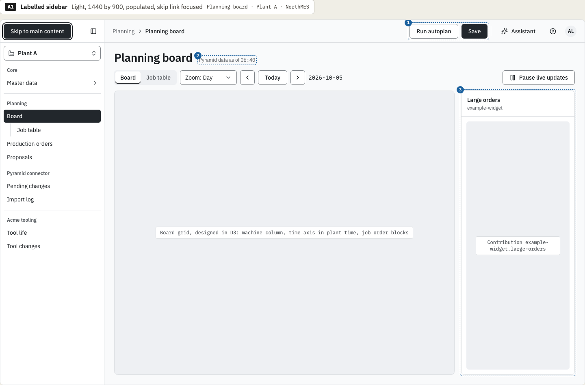
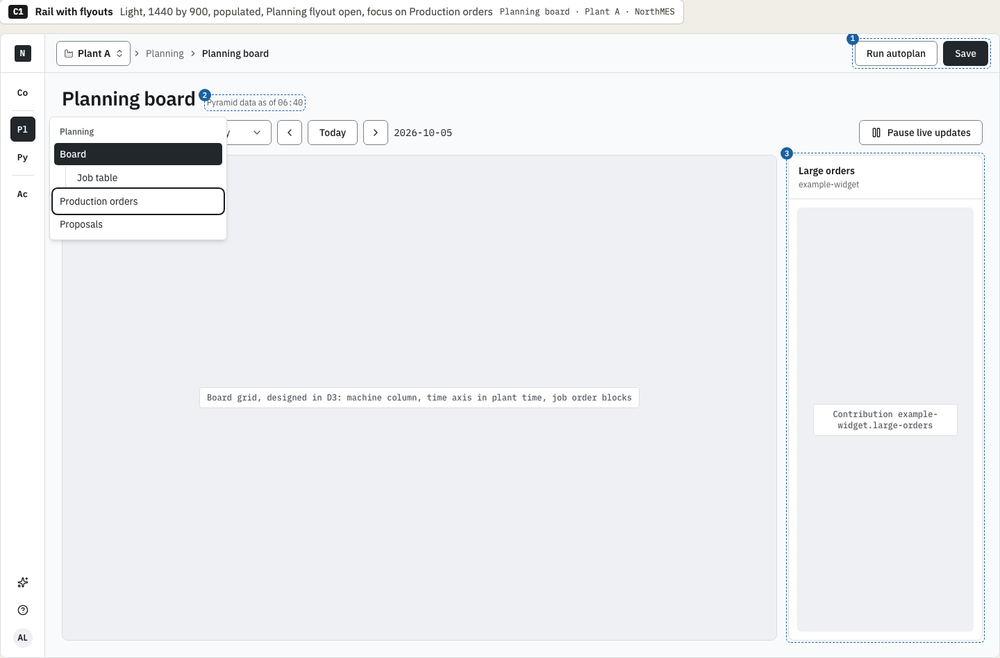
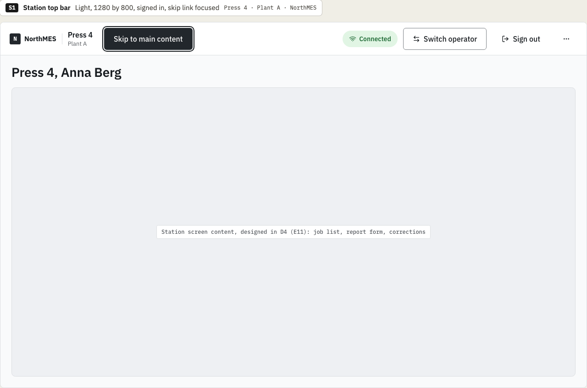
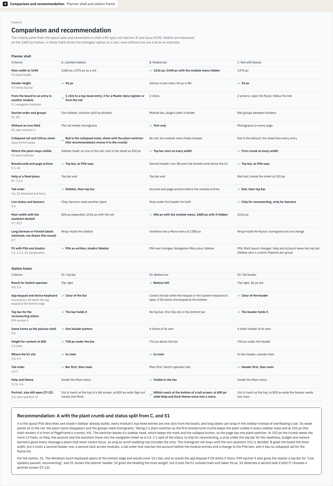

# D2 variations: chosen direction

This is the decision record of the variations round for design task D2, issue [northMES/northmes#190](https://github.com/northMES/northmes/issues/190), for story E04-S02 ([northMES/northmes#40](https://github.com/northMES/northmes/issues/40)). The variations page is [shell/shell-190-variations.dc.html](https://claude.ai/design/p/dba068e0-37df-46e5-adcf-4439b6c4c0ad?file=shell%2Fshell-190-variations.dc.html) in the Claude Design project. It is not an approved page; the D2 spec page `shell/shell-190-navigation.dc.html` is built on the chosen direction and approved on its own.

## Decision

Krister Johansson chose on 2026-10-05:

- Planner shell: option A, the labelled sidebar that collapses to a rail, with two parts from option C. The plant switcher is the first breadcrumb crumb, so the plant stays visible in every sidebar state and at 320 px. Live status splits into a chip for "reconnecting" and a strip under the top bar for banners.
- Station frame: S1, a top bar with the same header pattern as the planner shell.

Options B (module bar), C as a whole (rail with flyouts), S2 (bottom bar) and S3 (tall header) were not chosen. The comparison frame gives the reasons.

## Frames

Option A at 1440 px, light:

Option C at 1440 px, light, for the plant crumb:

Station frame S1 at 1280 by 800, light:

The comparison and recommendation frame:

