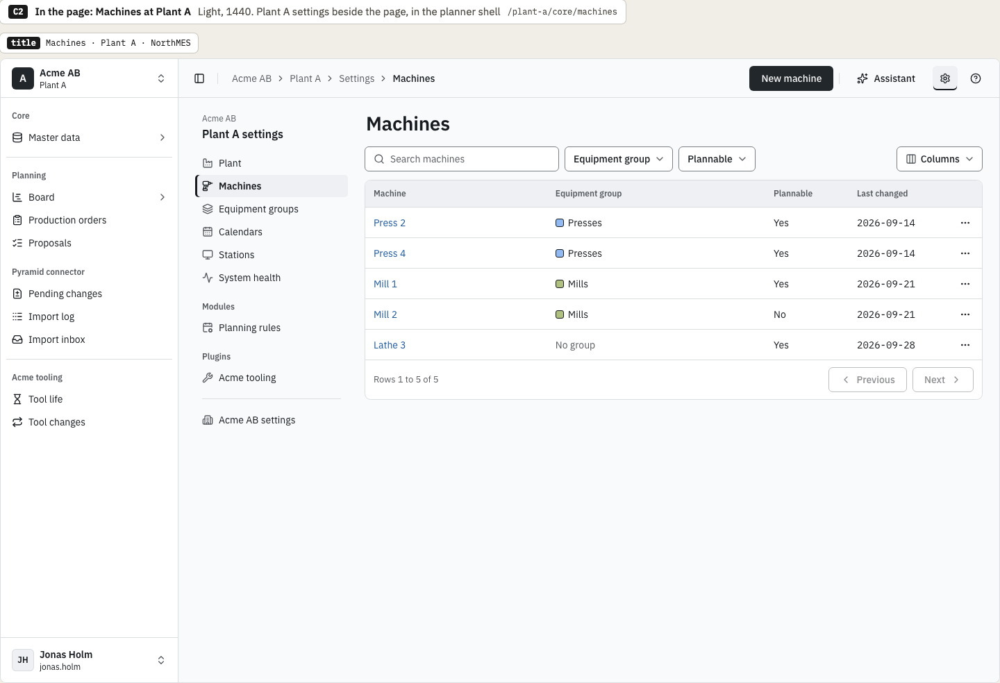
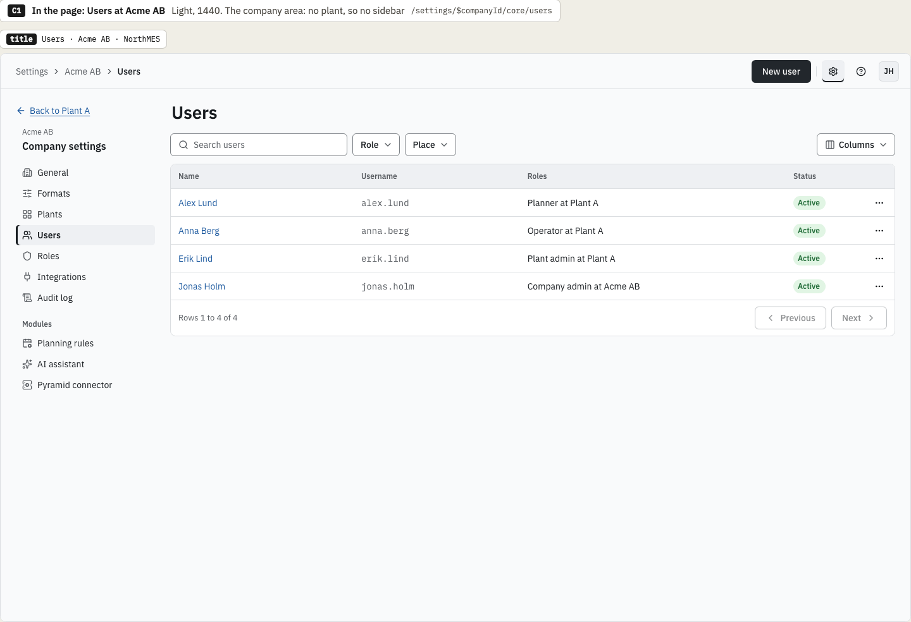
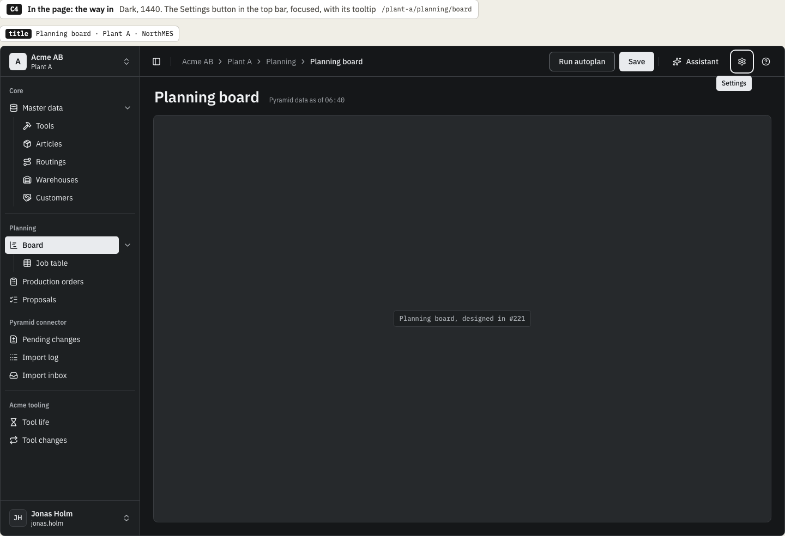
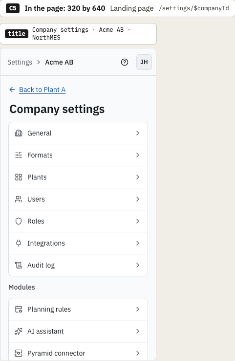
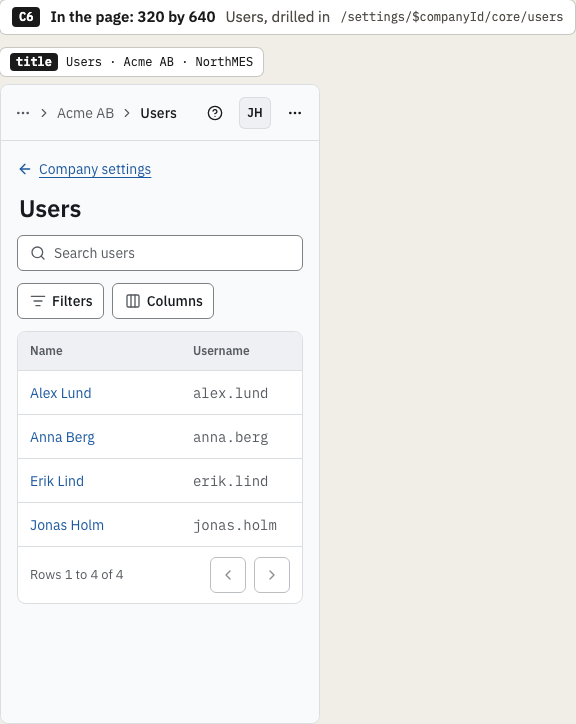
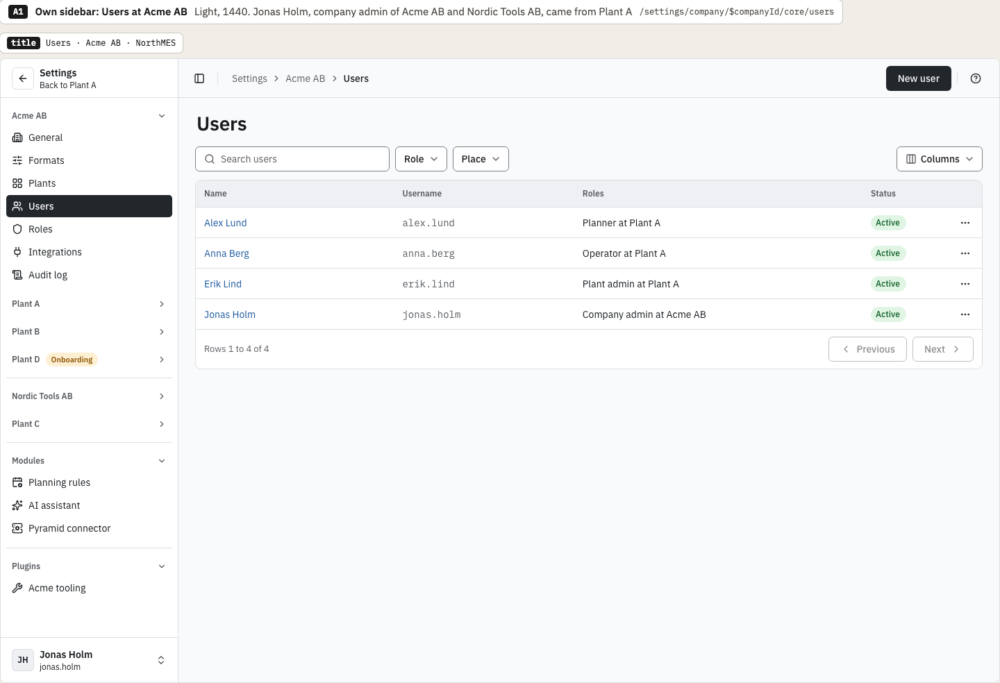
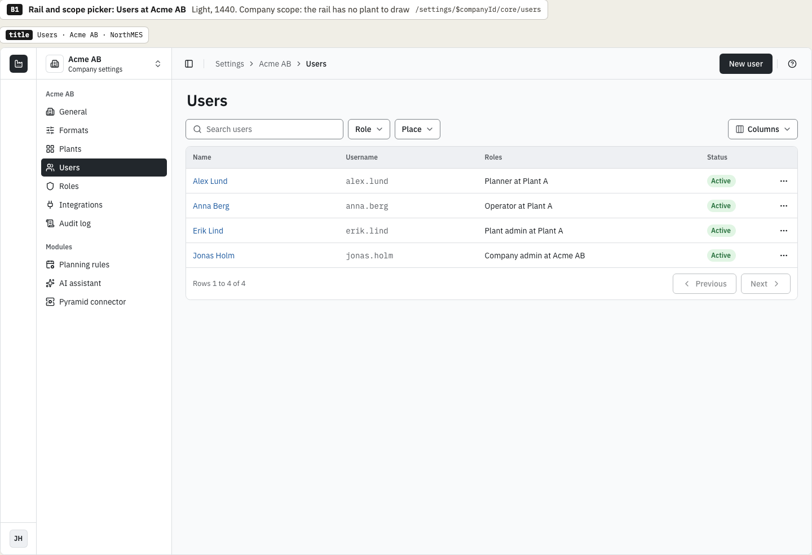
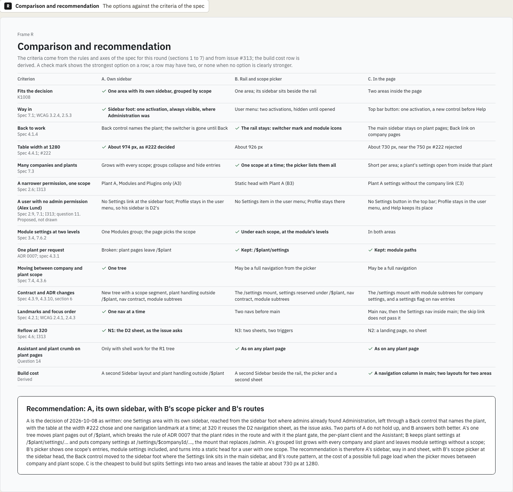

# Settings area variations: chosen direction

This is the decision record of the variations round for the settings area, issue [northMES/northmes#313](https://github.com/northMES/northmes/issues/313), for story E04-S02 ([northMES/northmes#40](https://github.com/northMES/northmes/issues/40)). The variations page is [shell/shell-313-settings-variations.dc.html](https://claude.ai/design/p/dba068e0-37df-46e5-adcf-4439b6c4c0ad?file=shell%2Fshell-313-settings-variations.dc.html) in the Claude Design project. It is not an approved page; the spec page `shell/shell-313-settings.dc.html` follows the chosen direction and is approved on its own.

The round started from Krister Johansson's decision of 2026-10-08 in the issue: one Settings area with its own secondary sidebar holds the administration, grouped by scope, and replaces both the `/admin` mount of [ADR 0066](../../adr/0066-companies-created-by-the-cli-plant-slugs-unique-per-installation-company-settings-at-settings-and-an-onboarding-wizard-before-a-plant-opens.md) and the Administration section at the foot of the plant sidebar that D2 drew. Master data that people use in daily work (articles, routings, customers, production orders) stays in the main sidebar. The round drew three arrangements of that area inside the D2 shell, for Jonas Holm, company admin of Acme AB and Nordic Tools AB: A, own sidebar; B, rail and scope picker; C, in the page.

## Decision

Krister Johansson chose option C, settings in the page, on 2026-10-08, from frame C2 (Machines at Plant A, 1440 in light):

- A Settings button in the top bar, before Help. On a plant page it opens the settings of that plant.
- Two settings areas, company settings and plant settings, each with its own settings navigation inside `main`, beside the page content.
- Company settings live at `/settings/$companyId/...`, with the company landing at `/settings/$companyId`. A company page has no plant, so C draws it without the main sidebar, with "Back to Plant A" above the company settings navigation (C1).
- Plant settings keep their module paths under `/$plant`, for example `/plant-a/core/machines`, with a Settings crumb: Acme AB > Plant A > Settings > Machines (C2). The plant check, the per-plant client, the Assistant and the plant crumb work there as on any plant page.
- At 320 a landing page lists the entries and an entry drills in, with a link back to the landing above its h1 (C5, C6).
- The Administration section of the plant sidebar goes. The machines, equipment groups and calendars registers move to plant settings; articles, routings, customers and production orders stay in the main sidebar.

On the same day he added that the main sidebar collapses on its own when a page with a settings navigation opens, to D2's collapsed state, the 64 px rail of icons, so the page gets more space. The spec page draws every settings page with the main sidebar collapsed, at every width.

## Costs the spec page resolves

The comparison frame recorded three costs of C. The spec page resolves them instead of carrying them over.

- Table width. Beside the 256 px main sidebar and the 220 px settings navigation, the table in C is about 730 px at 1280 and 892 px at 1440, close to the 750 px at which the #222 round rejected its option B because dates wrapped. The collapse to the 64 px rail gives the page 192 px back, so the table is about 920 px at 1280 (derived from the comparison's measures).
- Skip link. In C the skip link lands at `main`, before the settings navigation, so it passes only the main navigation (spec 4.5 of the round, WCAG 2.4.1). The spec page makes it pass the settings navigation as well.
- Two areas. The decision in the issue asked for one Settings area, and C splits it into company settings and plant settings, which look different: company settings have no main sidebar and an account button in the top bar (C1), and plant settings sit in the planner shell (C2). The spec page gives a clear way between them. C2 has an "Acme AB settings" link at the foot of the plant settings navigation and C1 has "Back to Plant A"; a plant admin without a company permission, Erik Lind in frame C3, sees no company link.

The spec page states these assumptions, each proposed:

- When the user leaves settings, the main sidebar returns to the user's own choice. D2 question Q19 decides whether that choice persists per browser.
- A user who opens the main sidebar on a settings page keeps it open for that visit.
- The collapse is announced to no one and moves no focus.
- At 320 the main sidebar is a sheet anyway, so nothing changes there; the split into two areas needs the same clear way between company and plant settings.

## Options not chosen

The comparison frame and the notes under each option give these reasons.

Option A, own sidebar, was not chosen:

- Its one route tree, `/settings/company/$companyId/...` and `/settings/plant/$plant/...`, takes plant pages out of `/$plant`. That breaks the rule of ADR 0007 that the plant rides in the route, and the plant gate, the per-plant Apollo client, `PresentationProvider` and the Assistant key on `/$plant`, so the tree needs its own plant handling. A draws no Assistant on plant settings pages.
- The grouped list grows with every company and plant: two companies and four plants already need collapsible groups, and a collapsed group hides its entries.
- Module settings sit in one Modules group with no scope, so each module page needs a scope field for its company value and plant overrides.
- While in Settings the plant switcher and the module entries are gone, and a deep link knows no plant to go back to.
- The shell needs a second Sidebar layout.

A was the strongest option on fitting the decision as written, on the way in (one activation at the sidebar foot, where admins found Administration in D2), on the table width (about 974 px at 1280, as #222 decided), on one navigation landmark at a time, on moving between company and plant scope in one tree, and on reflow at 320 through the D2 navigation sheet that the issue asks for.

Option B, rail and scope picker, was not chosen:

- Two navigation landmarks, Main and Settings, sit side by side before `main`, with more Tab stops before the page.
- The way in takes two activations and hides in the user menu, which Presentation settings and Admin leave.
- The table is about 926 px at 1280 and 1088 px at 1440; with the Assistant docked, `main` keeps 616 px at 1280.
- At company scope there is no plant, so the rail holds only the switcher mark and the avatar (B1).
- Other scopes are one menu away, and B's routes make `settings` a reserved module id under `/$plant`.
- A move in the picker between company and plant scope goes from `/settings/...` to `/$plant/...`, which may load another module set and be a full page load.
- At 320 two modal sheets share one page, each with its own trigger and focus return.

B was the strongest option on the way back to work (the rail keeps the switcher mark and the module icons), on many companies and plants (one scope at a time), and on module settings at each module's own levels, and it kept one plant per request.

The comparison frame recommended A's sidebar with B's scope picker and B's routes: A's way in, sidebar and 320 sheet, the scope picker at the sidebar head, the Back control moved to the sidebar foot, and plant settings at `/$plant/settings/...` beside company settings at `/settings/$companyId/...`, at the cost of a possible full page load when the picker moves between company and plant scope. Krister Johansson chose C instead. The comparison rated C the cheapest to build, with a navigation column in `main` and two layouts for two areas, where A needs a second Sidebar layout and B a second sidebar beside the rail, the picker and a second sheet.

## Routes

ADR 0066 and the plan documents name these routes. `$companyId` is the company's uuidv7, because companies have no slug.

| Page | Before (ADR 0066) | After |
|---|---|---|
| Company landing | `/admin`, which sent the user to `/admin/core` | `/settings/$companyId`, which lists the company settings entries |
| The user's companies and their onboarding state | `/admin/core` | The list at `/`, with a link to each company's settings (proposed; question 4 below) |
| Plants of a company, New plant | `/admin/core/plants` | `/settings/$companyId/core/plants` |
| Company wizard (E06-S14) | `/admin/core/onboarding/$companyId` | `/settings/$companyId/core/onboarding` |
| Company settings of a module | `/admin/<id>/...` from `adminRoutes` | `/settings/$companyId/<id>/...` from `settingsRoutes` (name proposed) |
| Plant settings, for example Machines | `/$plant/<id>/...`, listed in the main sidebar under Core > Master data or Administration | Unchanged module paths such as `/plant-a/core/machines` and `/plant-a/planning/settings`, in the plant settings navigation |
| Reserved plant slugs | `api`, `graphql`, `mcp`, `health`, `modules`, `assets`, `station`, `admin` | The same plus `settings`; `admin` stays reserved while question 3 is open |

Titles follow C: "Users · Acme AB · NorthMES" and "Company settings · Acme AB · NorthMES" on company pages (C1, C5), "Machines · Plant A · NorthMES" on plant settings pages (C2).

The approved D2 record, [shell-190-navigation.md](shell-190-navigation.md), stays as it is. The settings spec page records the change to D2: the Administration section (C7, PL30, NA15, KE32) and the admin frame at `/admin` (C9, PL44 to PL47) go, Admin in the switcher and user menus (PL32, PL42) gives way to the Settings button, and Core > Master data loses Machines, Equipment groups and Calendars.

## Open questions

The choice of C settles question 18 of the round's spec and the first part of question 14. Module settings appear in both areas, the company value in company settings and the plant override in plant settings. Plant settings pages show the Assistant and the plant crumb as any plant page does. C's frames head the areas "Company settings" and "Plant A settings", so the word Organization, which question 1 asks about, does not appear.

These stay open, and the spec page carries them:

- Tools and Warehouses (question 6) stay under Core > Master data in the main sidebar, as C4 draws them, until the question is answered.
- The import inbox and AI usage (question 9) stay in the main sidebar where D2 put them; C2 and C4 draw the import inbox there.
- Whether the company segment holds the company id or a company slug (question 2).
- Whether `admin` stays a reserved plant slug now that `/admin` goes (question 3).
- Where `/` sends a company admin of several companies, and whether company settings keep an overview of the companies like `/admin/core` (questions 4 and 10). The documents use the list at `/` as the working default.
- Whether Settings appears in the document title (question 5), the ERP connection as an Integrations card or a module entry (question 7), where System health sits (question 8), Profile and the user menu (question 11), the Formats icon (question 12), plant-free fields for company pages of users, roles, audit, the connector, planning and AI (question 13), presentation values on company pages (question 14, second part), the names Jonas Holm and Karin Dahl shared with #304 (question 15), the #306 error pages under `/admin` (question 16), company equipment groups (question 17) and the Audit log at plant scope (question 19).

## Frames

Option C at 1440 in light, the frame Krister picked: Plant A settings beside the Machines list in the planner shell, with the Settings crumb and the "Acme AB settings" link at the foot. C2 draws the main sidebar expanded; the spec page draws it collapsed to the rail:

Option C, company settings at 1440 in light: Users at Acme AB at `/settings/$companyId/core/users`, without the main sidebar, with Back to Plant A:

Option C, the way in at 1440 in dark: the Settings button in the top bar, focused, with its tooltip:

Option C at 320 by 640, the company landing at `/settings/$companyId`:

Option C at 320 by 640, Users drilled in, with the Company settings link above the h1:

Option A at 1440 in light: the settings sidebar in place of the main sidebar, grouped by company and plant, with Back to Plant A at its head:

Option B at 1440 in light: the rail beside the settings navigation, with the scope picker at its head; at company scope the rail holds only the switcher mark and the avatar:

The comparison and recommendation frame:

