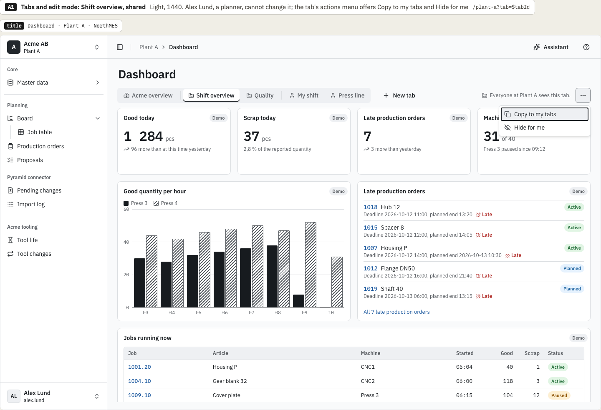
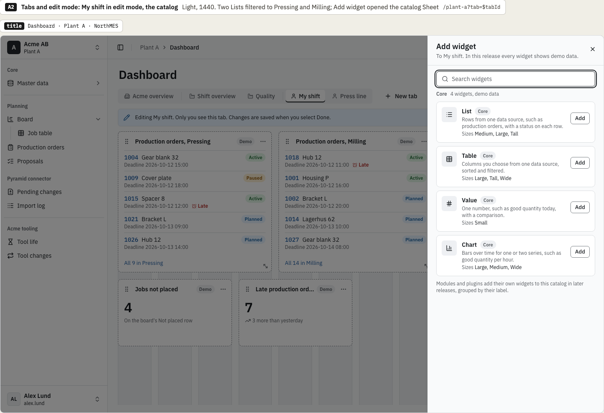
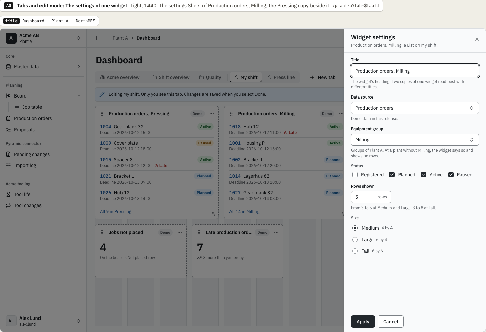
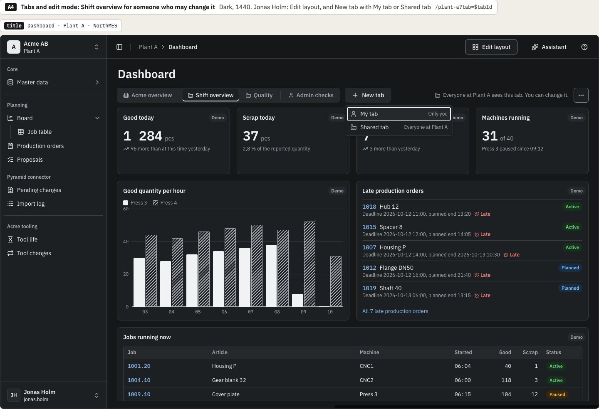
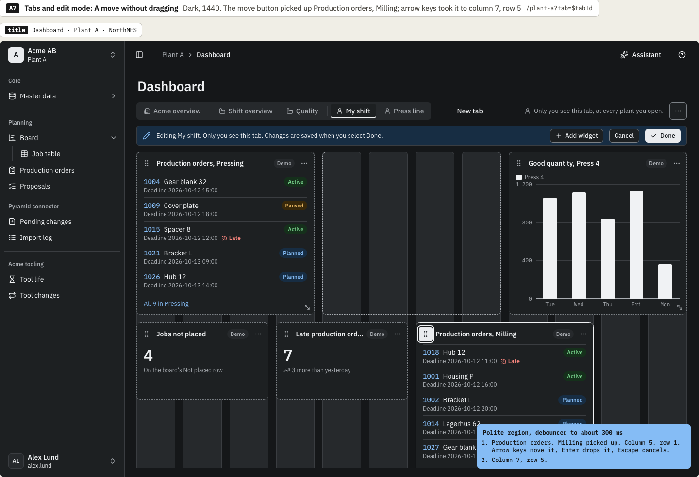
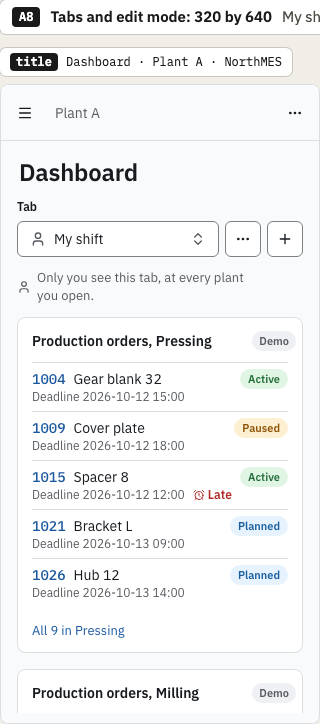
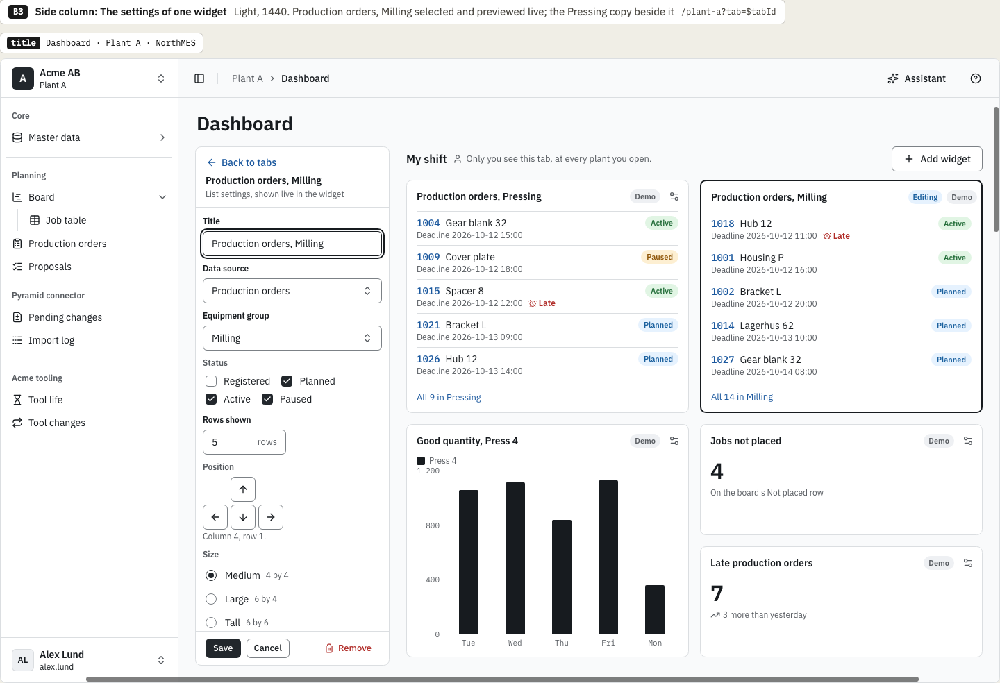
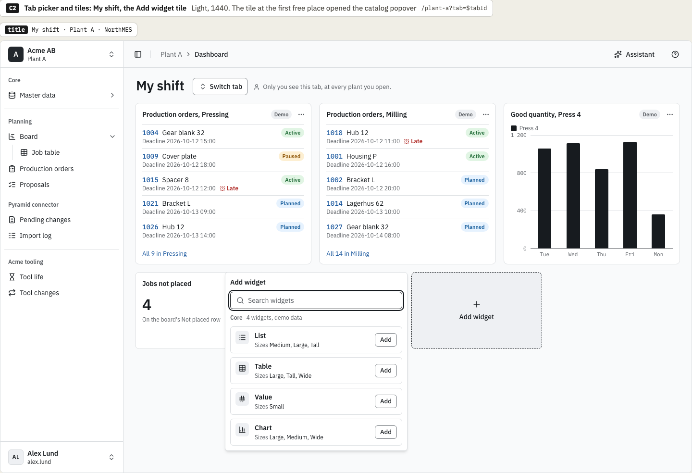
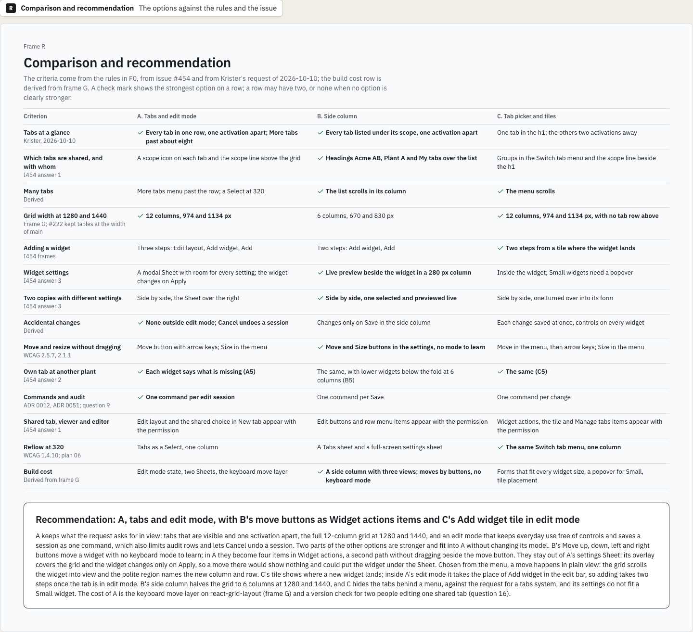

# Dashboard variations: chosen direction

This is the decision record of the variations round for the dashboard, issue [northMES/northmes#454](https://github.com/northMES/northmes/issues/454). No story is linked to the issue yet; the build task for the dashboard gets the Design section. The variations page is [shell/shell-454-dashboard-variations.dc.html](https://claude.ai/design/p/dba068e0-37df-46e5-adcf-4439b6c4c0ad?file=shell%2Fshell-454-dashboard-variations.dc.html) in the Claude Design project. It is not an approved page; the spec page `shell/shell-454-dashboard.dc.html` follows the chosen direction and is approved on its own.

The round started from Krister Johansson's answers of 2026-10-10 in the issue. Shared tabs exist at the company scope and at the plant scope, and changing one needs a permission whose role is decided later. A user's own tabs follow the user to every plant the user opens. Release 1 ships four demo widget types, List, Table, Value and Chart, each with its own settings, so two copies of one type show different information.

The round drew three whole options for the dashboard at Plant A of Acme AB inside the D2 shell: A, tabs and edit mode; B, side column; C, tab picker and tiles. Each option has nine frames at 1440, 1280 and 320, in light and dark. Frame G holds the grid library, the widget sizes in grid units and draft build notes, and frame R compares the options.

## Decision

Krister Johansson chose on 2026-10-10:

- Option A, tabs and edit mode. The tabs sit in a row under the h1 Dashboard: the company's tabs, then the plant's, then the user's own, each with its scope icon, and a scope line above the grid says who sees the open tab. Arrow keys move focus along the tablist, and Enter or Space opens a tab. Edit layout in the page actions puts the open tab into edit mode: column guides show, and each widget gets a move button, a Widget actions menu and a resize handle. Changes wait until Done, which saves the session as one command; Cancel discards them. The catalog and the widget settings open in a Sheet from the right. The grid keeps the full width of `main`: 12 columns at 1280 (974 px) and at 1440 (1134 px). At 320 the tabs become a Select and the grid one column.
- From option B, the Position and Size controls, inside A's widget settings Sheet. B draws them in its settings column: Move up, Move down, Move left and Move right buttons with the widget's place under them ("Column 4, row 1."), and the Size radio group with each size the widget type allows in grid units, for a List Medium 4 by 4, Large 6 by 4 and Tall 6 by 6 (B3). Each press is announced in the polite region (B7).
- From option C, the Add widget tile at the first free place of the grid while the tab is in edit mode. The tile opens the catalog, and the new widget lands where the tile was (C2).

The open tab is in the URL as `/$plant?tab=$tabId`, as all three options proposed, and edit mode is not. The document title is "Dashboard · Plant A · NorthMES". Edit layout shows on the user's own tabs, and on a shared tab only with the proposed permission `core.dashboardTab:manage` (A1, A4).

Frame R recommended A with B's move buttons as Widget actions items and C's Add widget tile in edit mode. Krister's choice takes the tile as frame R proposed it, and puts B's controls in the settings Sheet.

A's notes list its costs. Adding a widget takes three steps: Edit layout, Add widget, Add. A row of tabs runs out of room at about eight tabs at 1440 and needs a More tabs menu. Edit mode is a state the user can forget, so leaving the page with unsaved changes needs a ConfirmDialog. Two people editing one shared tab can overwrite each other's session, so Done needs a version check (question 16). The keyboard move mode is NorthMES's own code on react-grid-layout's `moveElement` and `verticalCompactor`.

## What the two additions change

### Position and Size in the settings Sheet

A3 already draws the Size radio group in A's Sheet, and the draft build notes in frame G take it from option B. The new part is Position. Frame G's build notes leave it out of the Sheet: "No Position: the Sheet's overlay covers the grid, so moves stay with the move button and Widget actions." Frame R gives the reasons, and the spec page resolves them:

- The result of a press. A's Sheet is modal and covers the right of the grid, and the widget changes only on Apply (A3). In B the settings column sits beside the grid and previews live, so each press moves the widget in view (B7).
- Where the widget goes. A move can take the widget to the part of the grid under the Sheet.
- Reflow. At 320, B's full-screen settings sheet has only Move up and Move down (B9). Frame G shows only Move up and Move down in Widget actions at one column, and question 18 asks what they do at 6 columns and at one column.

A's own paths without dragging stay: the move button, where Enter picks the widget up, arrow keys move it, Enter drops it and Escape cancels (A7), and Move up, Move down and Size in Widget actions (A9).

### The Add widget tile in edit mode

Frame R puts the tile in A's edit mode in the place of Add widget in the edit bar, so adding takes two steps once the tab is in edit mode. Outside edit mode the tab shows no tile, so everyday use keeps a grid without controls. C's notes place the tile in the widgets' reading order, and at 320 after the last widget (C8). In C2 the tile opens the catalog as a popover; A's catalog is a Sheet (A2). Frame R does not say which of the two the tile opens.

## Options not chosen

The comparison frame and the notes under each option give these reasons.

Option B, side column, was not chosen:

- The column takes 304 px, so the grid has 6 columns at 1280 (670 px) and at 1440 (830 px), and 12 columns only from about 1510 px. Large and Wide widgets fill a whole row, and the Value widgets stack two by two (B1).
- While the column shows the catalog or the settings, the tab list is one Back away.
- Two navigation regions sit side by side at 1440: the main sidebar and the tab list.
- Every widget of a tab the user may change has an Edit button that is always visible.
- At 320 the tab list needs its own sheet and trigger (B8).
- Each Save is a command, so a session of moves writes several audit rows.
- At 6 columns, Press line at Plant B needs scrolling to reach its lower widgets (B5).

B was the strongest option on showing which tabs are shared and with whom, on many tabs, on settings previewed live beside the widget, on moving and resizing without dragging with no mode to learn, and on build cost.

Option C, tab picker and tiles, was not chosen:

- The h1 names the open tab and the other tabs sit in the Switch tab menu, so switching takes two activations, against the request for a tabs system.
- Settings open inside the widget and must fit its size. A Medium List shows three fields before the form scrolls, and a Small Value has no room, so it needs a popover (C3).
- Every widget of a tab the user may change has a Widget actions button, and each change is saved at once, with no Cancel for a session.
- The h1 changes on a tab switch without a path change, which the focus rule for the h1 does not cover.
- Manage tabs is one more dialog, for order, rename, hide and delete (C4).

C was the strongest option on many tabs, on adding a widget where it lands and on reflow at 320, and shared the strongest marks with A on grid width and on an own tab at another plant.

## Grid library

The grid library is react-grid-layout 2.2.4 (MIT), pinned exactly, as frame G recommends:

- Of the libraries compared, only react-grid-layout is written for React and in TypeScript, measures its container, takes a controlled JSON layout per breakpoint and enforces minimum, maximum and fixed sizes per item. It is MIT, and so are its six dependencies.
- None of the candidates moves or resizes grid items by keyboard with announcements, so NorthMES adds its own keyboard, single-pointer and announcement layer. With react-grid-layout the layout is a plain array in React state, and `react-grid-layout/core` exports `moveElement`, `collides` and `verticalCompactor`, so a keyboard step reuses the logic a drag uses.
- Version 2.2.4 was released on 2026-07-29. Version 2.3.0 came out on 2026-10-05 and stays inside the 14-day `minimumReleaseAge` until 2026-10-19, and its open issue #2303 reports that a dragged or resized item stops following the pointer between grid steps. The pin holds until #2303 is fixed and a 2.3.x release is 14 days old.
- It injects no style elements, so it works under `style-src 'self'` ([ADR 0020](../../adr/0020-frontend-libraries-tanstack-router-apollo-client-4-shadcn-ui-and-forms.md)). The styles of react-grid-layout and react-resizable go into the one Tailwind sheet, with their colors replaced by D1 tokens.
- The dependency comes in its own pull request, under the license gate of [ADR 0040](../../adr/0040-dependency-license-policy-ci-gate-and-sbom.md).

Frame G compared it with gridstack 14.0.0, dnd-kit with a grid of NorthMES's own, and Pragmatic drag and drop 4.0.0 with a grid of NorthMES's own. It set aside dockview 8.4.1, react-mosaic-component 7.2.1, muuri, packery 3.0.0 and react-dashboard-grid 1.0.4.

The layer NorthMES writes, from frame G:

- The move button is also the drag handle. Enter or Space picks the widget up, arrow keys move it one grid unit through `moveElement` and `verticalCompactor`, Enter drops it and Escape restores the layout from before the pickup (WCAG 2.1.1, 2.5.7).
- One polite region announces the pickup, each step, a size change, the drop and a cancel (WCAG 4.1.3).
- The widgets render sorted by y, then x, and are re-sorted after a drop, not on each step, with focus back on the move button (WCAG 2.4.3).
- The resize handle is hidden from assistive technology with a 24 px target (WCAG 2.5.8), or replaced through `resizeConfig.handleComponent`; on release it snaps to the nearest size the widget type allows.
- Below a 600 px container the grid is an ordered list in reading order without react-grid-layout, with heights that grow with content (WCAG 1.4.4, 1.4.10, 1.4.12).

### Breakpoints and sizes

The breakpoints are measured on the grid container, not on the viewport, because the 256 px sidebar, the 64 px rail and docked panels change the room. `rowHeight` is 72 px, `margin` is `[16, 16]` and `containerPadding` is `[0, 0]`, so a widget h rows tall is 72h + 16(h - 1) px.

| Name | Container width | Columns |
|---|---|---|
| lg | 900 px and wider | 12 |
| md | 600 to 899 px | 6 |
| sm | Below 600 px | 1, in reading order |

| Size | 12 columns | 6 columns | One column | Height |
|---|---|---|---|---|
| Small | 3 by 2 | 3 by 2 | Full width | 160 px |
| Medium | 4 by 4 | 3 by 4 | Full width | 336 px |
| Large | 6 by 4 | 6 by 4 | Full width | 336 px |
| Tall | 6 by 6 | 6 by 6 | Full width | 512 px |
| Wide | 12 by 4 | 6 by 4 | Full width | 336 px |

At one column the heights are minimums. The sizes per widget type, default first: Value, Small only, a fixed size; List, Medium, Large and Tall; Table, Large, Tall and Wide; Chart, Large, Medium and Wide.

Each tab stores `{ columns: 12, widgets: [{ id, type, size, x, y, settings }] }`. The width and height follow from the size, so a stored layout cannot hold a size its type does not allow, and two copies of one type differ only in their settings. The 6-column and one-column layouts come from a pure function of the 12-column one.

## Open questions

The choice of A settles question 9 of the round: an edit session is one command. It also settles question 12, the document title "Dashboard · Plant A · NorthMES", and the part of question 2 about the page title and the h1 Dashboard.

These stay open, and the spec page carries them:

- Which shell the page mounts: the approved `shell/Shell.dc.html`, or the settings frame of #313 (question 1).
- Who owns the dashboard, the shell in `apps/web` or core's web module, and whether the sidebar gets a Dashboard entry (question 2).
- Whether `core.dashboardTab:manage` is the right permission id and stays out of `companyPermissions`, so that Company admin and Plant admin both get it (question 3).
- Whether a user's own tabs follow the user across companies or only across the plants of one company (question 4).
- One setting for every plant with the Not at Plant B state, a setting per plant, or a tab limited to some plants (question 5).
- Whether a demo widget is a contribution to `core/dashboard/widgets/v1` or a built-in component, and how per-copy settings and grid sizes are typed in the contract (question 6).
- Chart colors, a chart library and chart tokens (question 7).
- Whether react-grid-layout passes `style-src 'self'` with the shell's one style sheet in a real build (question 8).
- The admin names shared with #304 and #313 (question 10), the glossary terms for dashboard, tab and widget (question 11), which tab opens first (question 13), hiding and copying a shared tab (question 14) and the Demo badge (question 15).
- Live updates of a shared tab and the version check on Done when two people edit it (question 16).
- Whether pointer resize exists (question 17) and what Move up and Move down do at 6 columns and at one column (question 18).

## Frames

Option A at 1440 in light: the shared tab Shift overview as Alex Lund, a planner, sees it, with the tab's actions menu open on Copy to my tabs and Hide for me:

Option A at 1440 in light: My shift in edit mode, with the catalog Sheet that Add widget opened:

Option A at 1440 in light: the settings Sheet of Production orders, Milling, with the Pressing copy beside it. The spec page adds B's Position control to this Sheet:

Option A at 1440 in dark: Shift overview for Jonas Holm, who may change it, with Edit layout and New tab offering My tab or Shared tab:

Option A at 1440 in dark: a move without dragging, with what the polite region says:

Option A at 320 by 640: My shift in one column, with the tabs as a Select:

Option B at 1440 in light, for the Position and Size controls in its settings column:

Option C at 1440 in light, for the Add widget tile at the first free place of the grid:

The comparison and recommendation frame:

