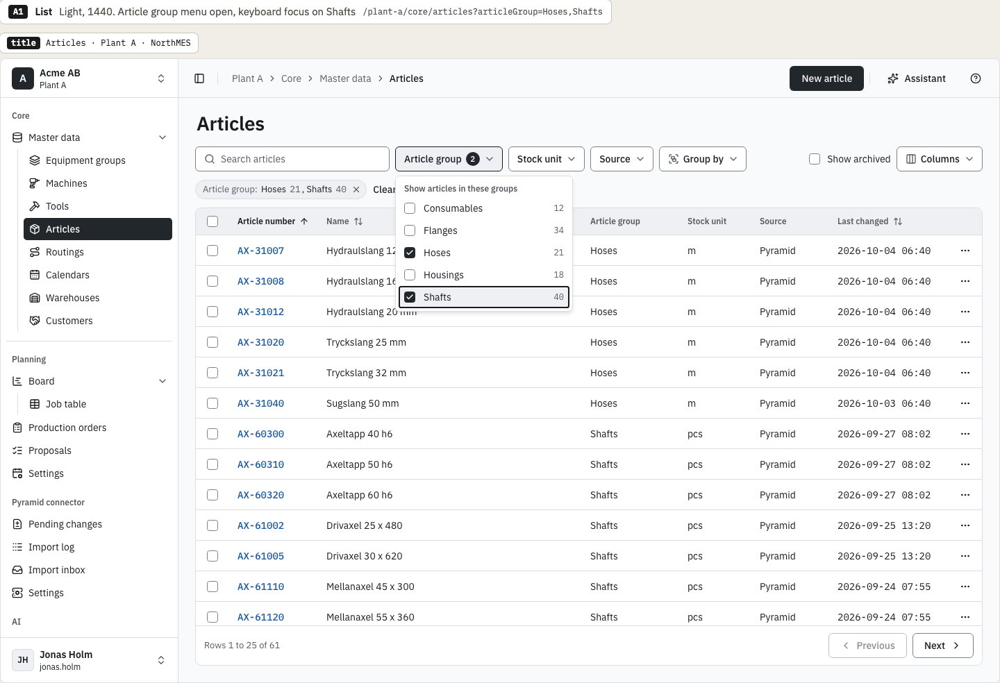
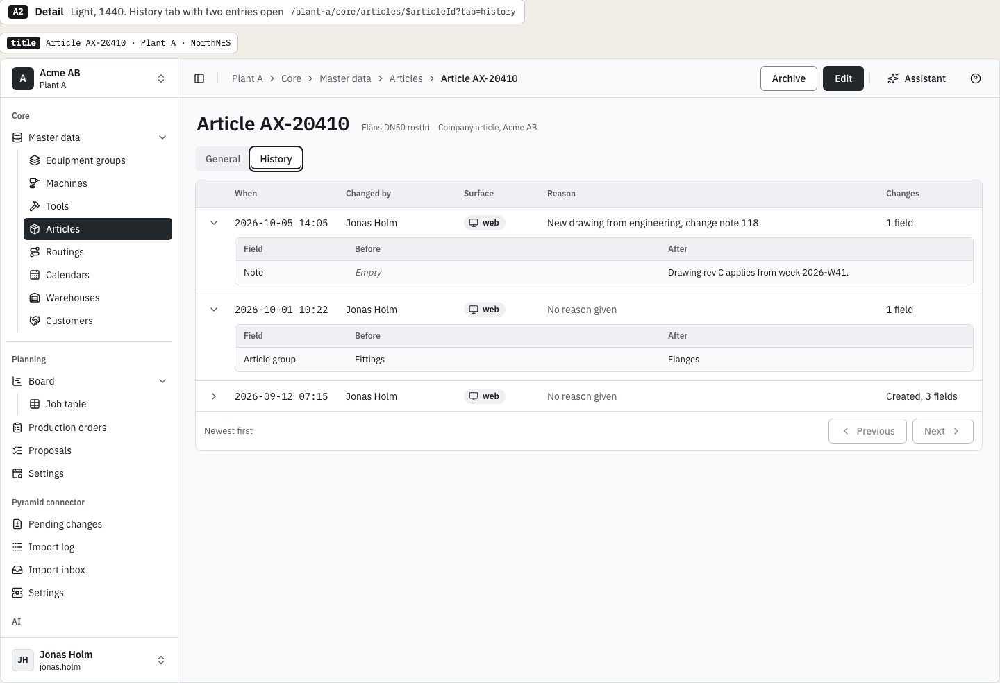
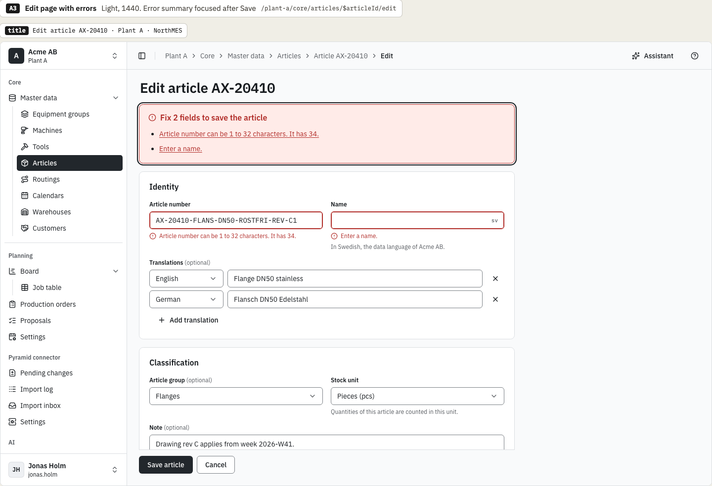
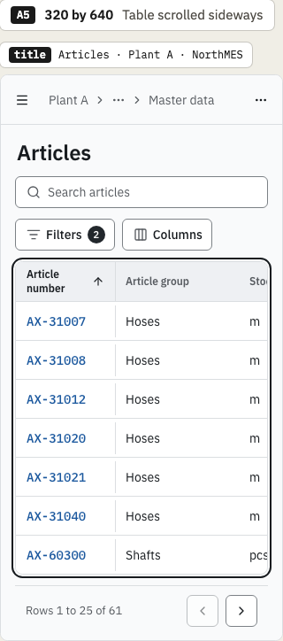
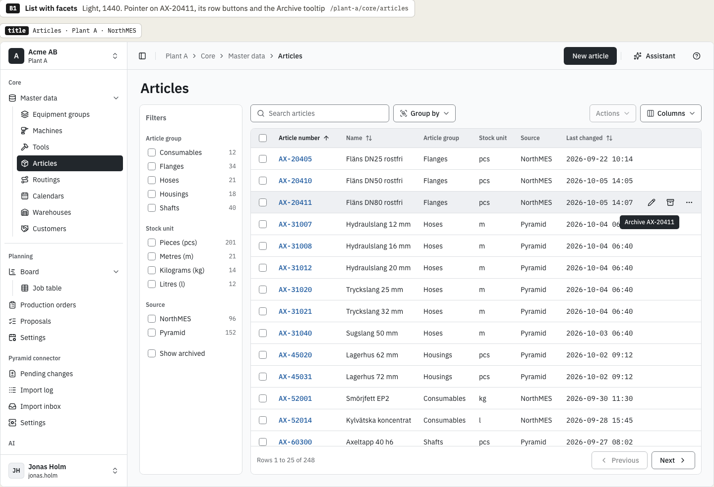
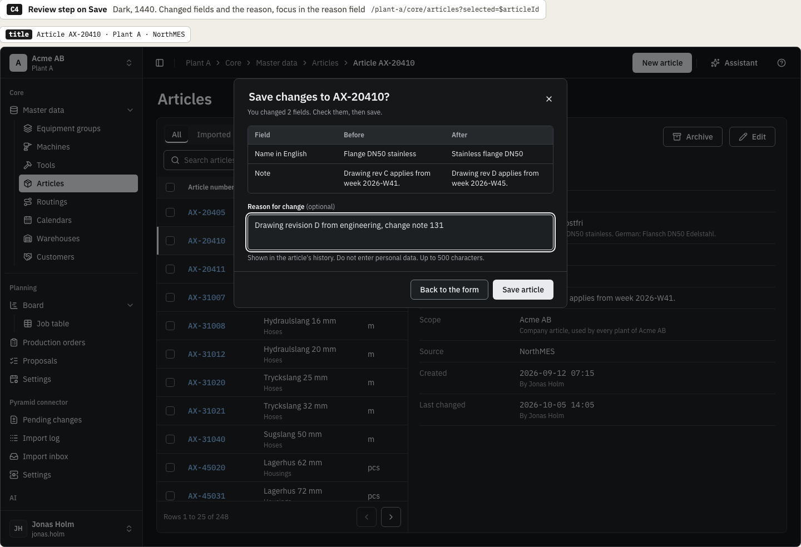
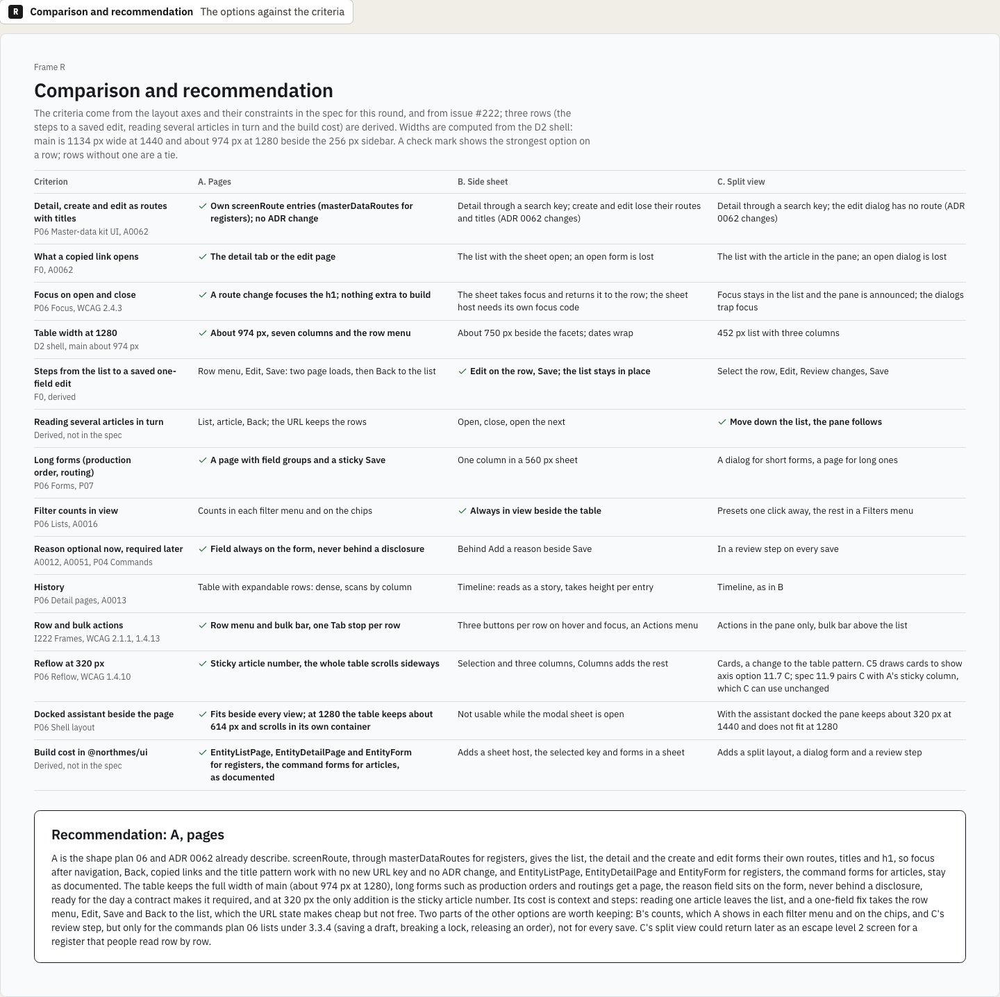

# Canonical list and form page variations: chosen direction

This is the decision record of the variations round for the canonical list and form page, issue [northMES/northmes#222](https://github.com/northMES/northmes/issues/222), for story E04-S07 ([northMES/northmes#45](https://github.com/northMES/northmes/issues/45)). The variations page is [ui/ui-222-list-form-variations.dc.html](https://claude.ai/design/p/dba068e0-37df-46e5-adcf-4439b6c4c0ad?file=ui%2Fui-222-list-form-variations.dc.html) in the Claude Design project. It is not an approved page; the spec page `ui/ui-222-list-form.dc.html` follows the chosen direction and is approved on its own.

The round drew three arrangements of a master data screen on the articles of Acme AB inside the D2 shell: A, pages; B, side sheet; C, split view.

## Decision

Krister Johansson chose on 2026-10-07:

- Option A, pages. The list, the detail and the create and edit forms are their own routes: core declares them with `screenRoute` for articles, and `masterDataRoutes` yields them for a register. The table keeps the full width of `main` (about 974 px at 1280 beside the 256 px sidebar), and the change reason is a field on the form, never behind a disclosure.
- From option B, the filter counts. A already shows them in each filter menu and on the chips.
- From option C, the review step on Save, but only for the commands plan 06 lists under WCAG 3.3.4: saving a draft, breaking a lock and releasing an order. Other saves have no review step.

Option A is the shape plan 06 and ADR 0062 already describe, so focus after navigation, Back, copied links and the title pattern work with no new URL key and no ADR change. Its cost is context and steps: reading one article leaves the list, and a one-field fix takes the row menu, Edit, Save and Back to the list.

## Options not chosen

The comparison frame gives these reasons.

Option B, side sheet, was not chosen:

- The detail opens through a search key, and create and edit lose their own routes and titles, so ADR 0062 changes, and `masterDataRoutes` with it for registers.
- A copied link opens the list with the sheet open, and an open form is lost.
- The facet column leaves the table about 750 px at 1280, so dates wrap.
- Long forms such as production orders and routings drop to one column in the 560 px sheet.
- The reason sits behind "Add a reason" beside Save.
- The docked assistant cannot be used while the modal sheet is open.
- Row buttons that appear on hover must also appear on focus (WCAG 2.1.1, keyboard) and be reachable on touch screens, which have no hover (a design requirement of its own), and three buttons per row add Tab stops.

B was the strongest option on the steps to a saved one-field edit and on filter counts in view.

Option C, split view, was not chosen:

- The detail opens through a search key and the edit dialog has no route, so ADR 0062 changes.
- The list is 452 px wide and shows three columns.
- With the assistant docked, the pane keeps about 320 px at 1440 and does not fit at 1280.
- The review step comes on every save, while plan 06 asks for a review only for the commands under WCAG 3.3.4, and a master data edit is already checked and reversible.
- Rows as cards at 320 px change the documented table pattern.
- Forms take two patterns: a dialog for short forms and a page for long ones.

C was the strongest option for reading several articles in turn. The comparison notes that C's split view could return later as an escape level 2 screen for a register that people read row by row.

## Frames

Option A, the list at 1440 in light, with the article group menu open and the counts beside each group:

Option A, the detail at 1440 in light, with the History tab and two entries open:

Option A, the edit page at 1440 in light, with the error summary focused after Save:

Option A at 320 by 640, with the table scrolled sideways and the article number sticky:

Option B, the list with the facet column at 1440 in light, for the filter counts:

Option C, the review step on Save at 1440 in dark, for the review step the WCAG 3.3.4 commands keep:

The comparison and recommendation frame:

