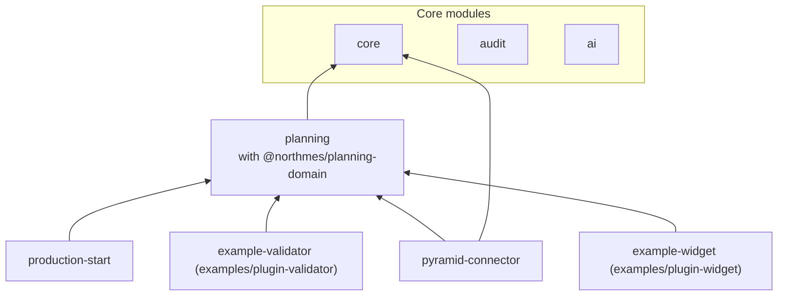

# Product and scope

NorthMES is an open source, developer-first manufacturing execution system. Production planning is its first module. The pilot customer runs the Pyramid ERP and will run NorthMES on one Linux server of its own. This document says what NorthMES is and which principles every module follows. It maps the modules, release 1 and later ones, and shows how later modules attach. It lists what release 1 contains under option B and what it leaves out, with the trigger that brings each item in. It also holds the draft pilot acceptance criteria, the scope rule and the conditions under which release 1 counts as done. The decisions live in the ADRs linked from each section. When this document and an ADR disagree, the ADR holds and this document gets fixed. Terms follow [GLOSSARY.md](../../GLOSSARY.md).

## What NorthMES is

- NorthMES plans production and follows it on the shop floor. Release 1 covers production orders and their operations, the job orders a planner places on machines, plant calendars, the planning board and a minimal operator station ([ADR 0026](../adr/0026-planning-domain-names-aligned-with-isa-95.md)).
- It is built first for manufacturers without an ERP. An ERP connects through its own connector module, and nothing in core depends on one ERP's files or field names ([ADR 0031](../adr/0031-erp-integration-connector-modules-field-ownership-and-pending-changes.md)).
- One monorepo holds every module with its server part, its web remote and its contracts package ([ADR 0002](../adr/0002-modular-monolith-with-module-owned-schemas-and-process-roles.md), [ADR 0003](../adr/0003-module-package-shape-and-the-definemodule-manifest.md), [ADR 0004](../adr/0004-monorepo-tooling-pnpm-turborepo-node-and-typescript-versions.md)).
- Production planning releases first. Later modules from the module map below must fit the same module contract without changes to core's rules.
- One installation serves one customer, on the customer's own server. The pilot runs on one Linux host with Docker Compose, one process in role `all` ([ADR 0044](../adr/0044-on-prem-deployment-with-docker-compose-and-mandatory-tls.md)).
- Core is licensed AGPL-3.0-or-later, and contributions come in under a contributor license agreement ([ADR 0039](../adr/0039-license-agpl-3-0-or-later-core-and-a-contributor-license-agreement.md)). The SDK and contracts packages are proposed as MIT ([ADR 0056](../adr/0056-mit-sdk-packages-the-extension-exception-and-the-trademark-policy.md)).
- One developer builds it with coding agents. Work runs as GitHub issues shaped into epics, stories and thin vertical-slice tasks ([ADR 0049](../adr/0049-delivery-workflow-handoff-thin-vertical-slices-and-claude-design-per-task.md)).

The people NorthMES serves are the personas in [README.md](README.md): Planner, Operator, Plant admin, Plugin developer, Maintainer and Hosting partner. Issues, issue forms and design frames use that list and no other.

## Principles

Each principle has a concrete consequence in code. A task that breaks one needs an ADR that says why.

| Principle | What it means in code | ADRs |
|---|---|---|
| Developer-first | A developer or a coding agent runs, tests and extends NorthMES without reading core code. `pnpm dev` starts the stack from one script with a Testcontainers Postgres. `pnpm check` is the one gate command. Each extension point ships with a recipe: the files to write, the commands to run, and the boot errors with their meaning. | [0058](../adr/0058-developer-environment-source-exports-one-stack-script-and-one-gate-command.md), [0022](../adr/0022-shared-building-blocks-packages-the-master-data-kit-settings-and-generators.md), [0048](../adr/0048-documentation-on-docs7-at-docs-northmes-dev.md) |
| Easy to change | Core modules, connectors and plugins use one `defineModule` contract. A new screen in an existing module takes four hand-edited files plus its test: its entry in the module's link manifest, the route with its title and nav entry, the screen component and its `.graphql` operations. A new validator on a command already declared validatable takes two files plus a test. | [0003](../adr/0003-module-package-shape-and-the-definemodule-manifest.md), [0037](../adr/0037-plugins-drop-in-packages-command-validators-and-ui-slots.md), [0062](../adr/0062-web-form-contracts-url-view-state-and-module-link-manifests.md) |
| Changes survive upgrades | A customer's changes live outside core. A plugin is a built package in `plugins/<id>/` or in a site image built `FROM` the NorthMES image, and core is never rebuilt for it. Site configuration lives in `compose.override.yaml`, `northmes.env` and a site Caddyfile snippet, which a release never overwrites. Extension points are versioned contracts: slot ids carry a version (`planning/board/side/v1`), validator payloads are MIT contract schemas, events carry `schema_version`, and API Extractor reports make every change to a public package visible in review. | [0037](../adr/0037-plugins-drop-in-packages-command-validators-and-ui-slots.md), [0038](../adr/0038-versions-and-releases-lockstep-0-x-release-please-api-reports.md), [0044](../adr/0044-on-prem-deployment-with-docker-compose-and-mandatory-tls.md) |
| ERP-agnostic core | Everything Pyramid-specific stays inside `modules/pyramid-connector`. Imports go through core and planning's import commands; write-back consumes planning's events. | [0031](../adr/0031-erp-integration-connector-modules-field-ownership-and-pending-changes.md), [0032](../adr/0032-pyramid-connector-polling-file-mode-and-shadow-write-back.md) |
| One write path | Every write is a command. The web, MCP, the in-app assistant, the station, the connector, jobs and the CLI all reach the same permission check, validators and audit row. Every GraphQL Mutation field maps to a registered command handler, and boot fails when one does not. | [0012](../adr/0012-commands-as-the-single-write-path.md), [0013](../adr/0013-audit-trail-written-in-the-command-transaction.md) |
| Rules sit in the database and at boot, and fail closed | Row-level security filters every module table by scope. An exclusion constraint keeps codes unique per scope. The audit trigger raises when no audit context is open. Boot exits on a catalog, composition or isolation error instead of starting half a system. | [0008](../adr/0008-row-level-security-with-transaction-local-scopes.md), [0009](../adr/0009-code-uniqueness-per-scope-with-an-exclusion-constraint.md), [0013](../adr/0013-audit-trail-written-in-the-command-transaction.md), [0002](../adr/0002-modular-monolith-with-module-owned-schemas-and-process-roles.md) |
| The customer keeps its data | NorthMES runs on the customer's server. AI features call models only through a provider the customer configures with its own credentials, so the NorthMES project never sees prompts and never pays for model calls. Error telemetry to the project is opt-in and off by default. Files stay inside the installation. | [0035](../adr/0035-ai-provider-port-with-customer-configured-providers.md), [0052](../adr/0052-error-telemetry-opt-in-and-deferred.md), [0054](../adr/0054-file-storage-port-with-a-postgres-driver.md) |
| A person commits | An AI agent writes only proposals. A planner accepts them into a draft and a Save commits them. AI features never score, rank or assign people. | [0036](../adr/0036-agent-proposals-as-planning-records-a-person-commits.md), [0035](../adr/0035-ai-provider-port-with-customer-configured-providers.md) |
| Shared before copied | Cross-cutting rules ship as shared packages from their first use. A composite such as `DataTable` moves into a shared package at its third copy, or at the second when both users ship in release 1. Domain logic is never shared by import between modules. | [0022](../adr/0022-shared-building-blocks-packages-the-master-data-kit-settings-and-generators.md) |
| Build what a release needs | See [the scope rule](#the-scope-rule). | [0055](../adr/0055-release-1-scope-under-option-b-and-the-scope-rule.md) |
| Accessible by default | The web app targets WCAG 2.2 AA. The token contrast test runs before the first component, and axe checks every route and state in Playwright. | [0021](../adr/0021-accessibility-target-wcag-2-2-aa.md) |
| Regulated-ready by default | The pilot is not regulated. Release 1 still adopts the no-regret rules, so a regulated customer later needs added work and no rewrite. | [0051](../adr/0051-regulated-readiness-no-regret-rules.md), [15-regulated-readiness.md](15-regulated-readiness.md) |
| Test first | Every change starts with a failing test. Integration and end-to-end tests run against Postgres from Testcontainers. AI is mocked unless a live run is asked for. | [0041](../adr/0041-test-strategy-tdd-vitest-projects-testcontainers-and-playwright.md), [0042](../adr/0042-ai-in-tests-mocked-by-default-opt-in-live-runs.md) |

## Module map

### Release 1 modules

| Module id | Folder | Owns | ADRs |
|---|---|---|---|
| `core` | `modules/core` | Companies, plants and the scope tree; identity, roles and permissions; master data (equipment groups, equipment, tools, articles, routings and operations, operation equipment, calendars, warehouses, customers); settings; the station identity; health | [0007](../adr/0007-tenancy-company-plants-and-the-scope-tree.md), [0010](../adr/0010-identity-with-better-auth-roles-and-permissions-in-core-tables.md), [0011](../adr/0011-principals-credentials-and-same-origin-rules.md), [0025](../adr/0025-plant-calendars-shift-patterns-and-the-production-day.md), [0043](../adr/0043-health-endpoints-graceful-shutdown-and-the-system-health-page.md) |
| `audit` | core module with its own `audit` schema | Command rows, field diffs, security events and export records, written in the command transaction | [0013](../adr/0013-audit-trail-written-in-the-command-transaction.md) |
| `ai` | `modules/ai` | The AI provider port's implementation, provider settings, alias bindings, usage metering and budgets, the assistant chat route | [0035](../adr/0035-ai-provider-port-with-customer-configured-providers.md) |
| `planning` | `modules/planning` | Customer orders, production orders and their operations, job orders, drafts, soft locks, the plan revision, autoplan, agent proposals, the planning board, the MCP planning tools. The pure scheduling domain is the package `@northmes/planning-domain` in `modules/planning/domain`. | [0026](../adr/0026-planning-domain-names-aligned-with-isa-95.md) to [0030](../adr/0030-a-planning-board-built-in-house.md), [0034](../adr/0034-mcp-surface-one-endpoint-a-read-mostly-planning-toolset.md), [0036](../adr/0036-agent-proposals-as-planning-records-a-person-commits.md), [0057](../adr/0057-scheduling-domain-as-a-pure-package-in-the-planning-module.md) |
| `production-start` | `modules/production-start` | The operator station at `/station/$stationId`: operator sessions, start, pause, finish, quantity reports and corrections | [0033](../adr/0033-online-operator-station-in-the-production-start-module.md) |
| `pyramid-connector` | `modules/pyramid-connector` | Polling and file mode, mapping, the import inbox, pending ERP changes, write-back, raw payloads | [0031](../adr/0031-erp-integration-connector-modules-field-ownership-and-pending-changes.md), [0032](../adr/0032-pyramid-connector-polling-file-mode-and-shadow-write-back.md) |
| `example-validator` | `examples/plugin-validator` | Example backend command validator on `planning.releaseProductionOrder` | [0037](../adr/0037-plugins-drop-in-packages-command-validators-and-ui-slots.md) |
| `example-widget` | `examples/plugin-widget` | Example frontend widget in the slot `planning/board/side/v1` | [0037](../adr/0037-plugins-drop-in-packages-command-validators-and-ui-slots.md) |

Release 1 builds web remotes for `core`, `planning` and `production-start`, plus one for the widget example ([ADR 0019](../adr/0019-web-shell-with-react-module-federation-remotes.md)). The shell in `apps/web` loads them at run time. The shared packages (`@northmes/contracts`, one `@northmes/<id>-contracts` per module, `@northmes/sdk`, `@northmes/web-sdk`, `@northmes/ui`, `@northmes/web-build`, `@northmes/testing`) are described in [03-modules-and-extensibility.md](03-modules-and-extensibility.md).

Dependencies point toward core. An arrow reads "depends on". Upstream modules never know downstream ones: `production-start` reports progress by calling planning's `reportOperationProgress`, and planning shows downstream data only through slots that the downstream module fills.

### Later modules

The module map follows the usual MES areas. Each later module is a `defineModule` package like the release 1 modules. The table records what each area adds and the connection points the release 1 design already holds for it. None of these is built in release 1.

| Area | What it adds | How it connects to release 1 | ADRs |
|---|---|---|---|
| Start of production, full | More than the minimal station: an outage queue for stations, measured retool time, machine-prefilled quantities | Extends `production-start`. Reports keep calling `planning.reportOperationProgress`. The prefill input `{ source, quantity, ref? }` is already reserved in the contracts package, and release 1 rejects source `machine`. | [0033](../adr/0033-online-operator-station-in-the-production-start-module.md) |
| Data collection | Machine signals | REST is the core default ingestion endpoint. MQTT and OPC UA arrive as adapter modules on the same ingestion port. Values pass through the unit catalog. Machine data is stored in plain Postgres behind the time-series storage port, without TimescaleDB. Rollups per minute, quarter hour, shift and production day are tables kept by NorthMES jobs, and compressing backends come as adapter plugins only when an installation needs them. | [0055](../adr/0055-release-1-scope-under-option-b-and-the-scope-rule.md), [0059](../adr/0059-time-series-storage-port-with-an-open-default-backend.md), [0005](../adr/0005-postgres-18-official-image-with-pgbackrest-timescaledb-deferred.md), [0023](../adr/0023-si-units-with-a-northmes-unit-catalog.md) |
| Process follow-up (OEE) | OEE per machine and shift | Uses the operation's OEE target. Each job order freezes its planned rates when placed, so OEE needs no migration of planning data. Shift figures are attributed by production day. Reports store device time, received time and a nullable effective time. | [0027](../adr/0027-planned-duration-formula-and-override-precedence.md), [0025](../adr/0025-plant-calendars-shift-patterns-and-the-production-day.md), [0033](../adr/0033-online-operator-station-in-the-production-start-module.md) |
| Quality monitoring | Scrap analysis | Reads scrap quantities and scrap reasons from station reports, which are append-only facts | [0033](../adr/0033-online-operator-station-in-the-production-start-module.md), [0051](../adr/0051-regulated-readiness-no-regret-rules.md) |
| Maintenance | Planned maintenance | Planned maintenance becomes calendar deviations per equipment through core's calendar commands, so autoplan and the board see it without changes | [0025](../adr/0025-plant-calendars-shift-patterns-and-the-production-day.md) |
| Traceability | Material lots per operation | Reports reference the production order operation and the equipment, not only the job order. Released orders record the source routing operation and its version. | [0051](../adr/0051-regulated-readiness-no-regret-rules.md), [0026](../adr/0026-planning-domain-names-aligned-with-isa-95.md) |
| Document control | Documents per article or operation, shown to operators | Uses the file storage port with its Postgres driver. Documents reach the station through a slot that the station screen owns. | [0054](../adr/0054-file-storage-port-with-a-postgres-driver.md), [0037](../adr/0037-plugins-drop-in-packages-command-validators-and-ui-slots.md) |
| Human resource planning | Who works which shift, crew rotation | Plant calendars hold shifts. AI features in this area must not score, rank or assign people. | [0025](../adr/0025-plant-calendars-shift-patterns-and-the-production-day.md), [0035](../adr/0035-ai-provider-port-with-customer-configured-providers.md) |
| Analyzing | Reports in Power BI and Excel | A documented `reporting` schema of `security_invoker` views with a read-only login role per company | none yet; see [04-data-and-platform.md](04-data-and-platform.md) |
| Notifications | Messages to people | A core module, decided as a principle and built when a release needs it | [0055](../adr/0055-release-1-scope-under-option-b-and-the-scope-rule.md) |
| Scheduling solvers | Optimizing schedulers | A `Scheduler` port leaves room for a CP-SAT or Timefold plugin next to the deterministic `plan()` | [0028](../adr/0028-autoplan-as-a-pure-deterministic-function.md) |
| Other ERPs | One connector module per ERP | Same contract as the Pyramid connector. A shared core import service waits for the second connector. | [0031](../adr/0031-erp-integration-connector-modules-field-ownership-and-pending-changes.md) |

### How a later module connects

A later module has exactly these ways in. Release 1 builds and tests all of them except the ingestion port and the file storage port in item 4, so a new module adds code and changes no core rule.

1. Synchronous calls to the owner's `<Id>ApiModule` for queries and commands. The API module holds plain providers and no resolvers ([ADR 0002](../adr/0002-modular-monolith-with-module-owned-schemas-and-process-roles.md)).
2. Events through the outbox, for side effects only. An event never replaces a command call. Events carry `entity_version` and `schema_version`, and consumers keep an inbox ([ADR 0014](../adr/0014-outbox-event-log-and-pg-boss-jobs.md)).
3. Data. A module owns one Postgres schema and never reads or changes another module's tables. A foreign key into another module exists only where the owner grants `references` on that table. In GraphQL, a module adds nullable fields to another module's types through Federation entity references ([ADR 0002](../adr/0002-modular-monolith-with-module-owned-schemas-and-process-roles.md), [ADR 0015](../adr/0015-graphql-federation-inside-one-process-with-an-embedded-hive-gateway.md)).
4. Ports with contract suites: the AI provider port, the `Scheduler` port, the ERP connector contract, and later the ingestion port and the file storage port. The contract suites live in `@northmes/testing` ([ADR 0035](../adr/0035-ai-provider-port-with-customer-configured-providers.md), [ADR 0028](../adr/0028-autoplan-as-a-pure-deterministic-function.md), [ADR 0041](../adr/0041-test-strategy-tdd-vitest-projects-testcontainers-and-playwright.md), [ADR 0054](../adr/0054-file-storage-port-with-a-postgres-driver.md)).
5. Command validators, only on commands the owner declares validatable and only from modules that depend on the owner ([ADR 0037](../adr/0037-plugins-drop-in-packages-command-validators-and-ui-slots.md)).
6. UI slots that the rendering module owns, typed and versioned ([ADR 0037](../adr/0037-plugins-drop-in-packages-command-validators-and-ui-slots.md), [ADR 0019](../adr/0019-web-shell-with-react-module-federation-remotes.md)).
7. GraphQL subscriptions fed by the event log, for live status on screens ([ADR 0018](../adr/0018-realtime-subscriptions-over-graphql-ws-fed-by-the-event-tail.md)).

## Release 1 scope under option B

Option B keeps the full release 1 scope and moves the pilot later ([ADR 0055](../adr/0055-release-1-scope-under-option-b-and-the-scope-rule.md)). The April 2027 pilot date is dropped. The rejected option A was an April 2027 planning pilot with five items moved to 0.x releases. Measured velocity sets the pilot date at the checkpoints in [14-roadmap.md](14-roadmap.md). An internal stress test of the design (internal research note 32) estimated the option B pilot window at 2027-08-24 to 2028-01-20 on its 2x line. It gave no 1x figure. On the 1x line, which is the basis of the estimates themselves, the window falls later.

Release 1 ships as a 0.x version. Every package, module, example plugin and the image carry one version and stay on 0.x through the pilot ([ADR 0038](../adr/0038-versions-and-releases-lockstep-0-x-release-please-api-reports.md)).

### In release 1

| Area | In release 1 | Limits inside release 1 | ADRs |
|---|---|---|---|
| Architecture | NestJS modular monolith with module-owned schemas; one image started in role `all`, `api` or `worker`; the `defineModule` manifest, catalog checks and the boot sequence | The pilot runs one `all` replica. There is no `web` and no `ingest` role. CI still runs the two-replica integration tests. | [0002](../adr/0002-modular-monolith-with-module-owned-schemas-and-process-roles.md), [0003](../adr/0003-module-package-shape-and-the-definemodule-manifest.md) |
| Repository and developer environment | pnpm, Turborepo, Biome, Node and TypeScript pins; source exports for tests; one stack script; one gate command | | [0004](../adr/0004-monorepo-tooling-pnpm-turborepo-node-and-typescript-versions.md), [0058](../adr/0058-developer-environment-source-exports-one-stack-script-and-one-gate-command.md) |
| Data | Official `postgres:18` image with pgBackRest; Kysely; SQL-first migrations, one owner role per module; row-level security; codes unique per scope; uuidv7 keys, `version` columns, archive instead of delete | No TimescaleDB feature, no PgBouncer | [0005](../adr/0005-postgres-18-official-image-with-pgbackrest-timescaledb-deferred.md), [0006](../adr/0006-kysely-sql-first-migrations-and-the-northmes-migration-runner.md), [0008](../adr/0008-row-level-security-with-transaction-local-scopes.md), [0009](../adr/0009-code-uniqueness-per-scope-with-an-exclusion-constraint.md) |
| Tenancy and identity | Company, plants and the scope tree; Better Auth sessions; roles per plant; custom roles from module permissions; operators as full users; first admin and recovery by CLI | A request carries exactly one plant. Company mode across plants, sign-up and single sign-on wait. | [0007](../adr/0007-tenancy-company-plants-and-the-scope-tree.md), [0010](../adr/0010-identity-with-better-auth-roles-and-permissions-in-core-tables.md), [0011](../adr/0011-principals-credentials-and-same-origin-rules.md) |
| Commands, audit, events and jobs | Command pipeline with Zod contracts; audit in the command transaction; outbox, event log and pg-boss jobs | Reads and page views are not audited | [0012](../adr/0012-commands-as-the-single-write-path.md), [0013](../adr/0013-audit-trail-written-in-the-command-transaction.md), [0014](../adr/0014-outbox-event-log-and-pg-boss-jobs.md), [0017](../adr/0017-zod-contracts-as-the-single-source-for-inputs.md) |
| GraphQL and realtime | One Federation subgraph per module and plugin, composed by an embedded Hive Gateway in the same process; Relay connections with filter, sort, search and group by; subscriptions over graphql-ws with SSE on the same endpoint | No integration REST API; no HTTP subgraph mode | [0015](../adr/0015-graphql-federation-inside-one-process-with-an-embedded-hive-gateway.md), [0016](../adr/0016-graphql-list-conventions-connections-relations-filter-sort-search-and-group-by.md), [0018](../adr/0018-realtime-subscriptions-over-graphql-ws-fed-by-the-event-tail.md) |
| Web | Shell with Module Federation remotes; TanStack Router, Apollo Client 4, shadcn/ui; WCAG 2.2 AA | UI in English only; translatable master data keeps a translations column from its first migration | [0019](../adr/0019-web-shell-with-react-module-federation-remotes.md), [0020](../adr/0020-frontend-libraries-tanstack-router-apollo-client-4-shadcn-ui-and-forms.md), [0021](../adr/0021-accessibility-target-wcag-2-2-aa.md), [0053](../adr/0053-translation-english-first-general-translation-later.md) |
| Shared building blocks | Shared packages, the master-data kit, the list kit, settings, `pnpm gen:migration` | The module, entity and command generators ship only with a golden test and are first on the cut order | [0022](../adr/0022-shared-building-blocks-packages-the-master-data-kit-settings-and-generators.md) |
| Units, time and presentation | Unit catalog with SI storage; UTC instants, the plant wall clock and Temporal; plant calendars and the production day; presentation settings for the date format, the clock and the number format, set per company with a plant override (story E06-S13); one set of formatters in `@northmes/contracts` with the pinned base locale `en-GB-u-ca-gregory-nu-latn` | About 14 units; cycle time end to end. Presentation settings change how values are shown and typed, never what is stored or sent. Weeks start on Monday and follow ISO 8601 numbering, with no setting for either. The time zone stays on the plant record and is not a presentation setting. | [0023](../adr/0023-si-units-with-a-northmes-unit-catalog.md), [0024](../adr/0024-time-utc-instants-plant-wall-clock-temporal-and-the-clamp-resolver.md), [0025](../adr/0025-plant-calendars-shift-patterns-and-the-production-day.md), [0061](../adr/0061-presentation-settings-for-dates-clocks-and-numbers-with-one-pinned-locale.md) |
| Planning | Production orders and job orders; the duration formula; autoplan as a pure deterministic function; per-planner drafts with soft locks and one plan revision per plant; the board built in house; the job order table view; material warnings | No solver. Imported child orders plan independently, and no BOM is exploded into child orders. Board cuts: resize, the compressed off-hours axis, multi-select and multi-drag, continuous zoom, undo beyond discarding the draft, the conflict navigator, the minimap. | [0026](../adr/0026-planning-domain-names-aligned-with-isa-95.md), [0027](../adr/0027-planned-duration-formula-and-override-precedence.md), [0028](../adr/0028-autoplan-as-a-pure-deterministic-function.md), [0029](../adr/0029-per-planner-drafts-soft-locks-and-the-plan-revision.md), [0030](../adr/0030-a-planning-board-built-in-house.md), [0057](../adr/0057-scheduling-domain-as-a-pure-package-in-the-planning-module.md) |
| Pyramid connector | Orders, operations, materials and stock imported by polling and by uploaded XML; write-back of planned times, lock, status and priority per operation row | Write-back runs in shadow mode until a write method is verified. Quantity and deadline join write-back only if a Pyramid method accepts them. No generic CSV or Excel import. | [0031](../adr/0031-erp-integration-connector-modules-field-ownership-and-pending-changes.md), [0032](../adr/0032-pyramid-connector-polling-file-mode-and-shadow-write-back.md) |
| Operator station | Online only: switch equipment; start, pause and finish a job; report good and scrap quantities with a scrap reason; sign in by badge or personal login | No OEE, no outage queue, no machine prefill. Unsent entries stay on the screen and are never sent without the operator pressing Send. | [0033](../adr/0033-online-operator-station-in-the-production-start-module.md) |
| AI provider port | Provider settings per company; alias bindings (`fast`, `reasoning`, `embedding`); usage metering, cost and budgets; Test connection | Providers: OpenRouter (default, with the customer's own key), Azure OpenAI and OpenAI-compatible servers. Whether Google Vertex and Gemini ship in release 1 waits for the maintainer's confirmation. No embeddings. | [0035](../adr/0035-ai-provider-port-with-customer-configured-providers.md) |
| Planning assistant | A read-only chat panel that answers planning questions through the planning tools | Each feature is off until a company admin enables it. With no provider configured the panel is hidden. | [0035](../adr/0035-ai-provider-port-with-customer-configured-providers.md) |
| Agent proposals | Proposals written by the assistant or an MCP client, reviewed and accepted into the planner's draft, committed by Save | Moves of existing job orders only (equipment and start), at most 50 items per proposal, no splits, no quantity changes | [0036](../adr/0036-agent-proposals-as-planning-records-a-person-commits.md) |
| MCP | One `/mcp` endpoint with eight read-mostly planning tools, `planning_propose_changes` included; sign-in by personal access token acting as the user | Off by default per installation and enabled through an audited setting. No OAuth sign-in, no MCP Apps views, no WebMCP. | [0034](../adr/0034-mcp-surface-one-endpoint-a-read-mostly-planning-toolset.md) |
| Plugins | The internal `defineModule` contract; drop-in install; command validators; UI slots; two example plugins | No public npm SDK. No third-party plugin runs on the pilot. | [0037](../adr/0037-plugins-drop-in-packages-command-validators-and-ui-slots.md) |
| Operations | Docker Compose with Caddy and mandatory TLS; secrets per service and the installation key; pgBackRest backups, restore drills, upgrades and rollback; health endpoints and the System health page; structured logs and host checks; the offline image bundle | No Helm chart and no Kubernetes. The host is the single point of failure, and the customer is told so. | [0043](../adr/0043-health-endpoints-graceful-shutdown-and-the-system-health-page.md), [0044](../adr/0044-on-prem-deployment-with-docker-compose-and-mandatory-tls.md), [0045](../adr/0045-backups-restore-drills-upgrades-and-rollback.md), [0046](../adr/0046-observability-structured-logs-host-checks-and-optional-opentelemetry.md), [0047](../adr/0047-secrets-and-the-installation-key.md), [0050](../adr/0050-github-organization-rulesets-ci-runners-and-supply-chain.md) |
| Quality | TDD; Vitest projects; Testcontainers; Playwright; AI mocked by default | Live model tests run only on request, budget-capped, never on pull requests | [0041](../adr/0041-test-strategy-tdd-vitest-projects-testcontainers-and-playwright.md), [0042](../adr/0042-ai-in-tests-mocked-by-default-opt-in-live-runs.md) |
| Releases, license and docs | Lockstep 0.x and release-please; AGPL core and the CLA; the dependency license gate and SBOMs; the docs site at docs.northmes.dev | Generated references in release 1: the configuration reference and the permissions and roles reference. Other references arrive with the surface they document. | [0038](../adr/0038-versions-and-releases-lockstep-0-x-release-please-api-reports.md), [0039](../adr/0039-license-agpl-3-0-or-later-core-and-a-contributor-license-agreement.md), [0040](../adr/0040-dependency-license-policy-ci-gate-and-sbom.md), [0048](../adr/0048-documentation-on-docs7-at-docs-northmes-dev.md), [0056](../adr/0056-mit-sdk-packages-the-extension-exception-and-the-trademark-policy.md) |
| Delivery | the maintainer's handoff workflow on GitHub issues in thin vertical slices (contributors use the issue forms and pull requests); designs per task; the GitHub organization, rulesets and CI runners | | [0001](../adr/0001-record-architecture-decisions-in-madr.md), [0049](../adr/0049-delivery-workflow-handoff-thin-vertical-slices-and-claude-design-per-task.md), [0050](../adr/0050-github-organization-rulesets-ci-runners-and-supply-chain.md) |
| Regulated readiness | The no-regret rules that release 1 implements | The compliance profile exists with only the standard profile. Signatures are reserved in the command pipeline and not built. | [0051](../adr/0051-regulated-readiness-no-regret-rules.md) |

### Out of release 1

Each item waits for its trigger. Where no trigger is named, the item waits for a later scope decision under ADR 0055.

| Item | Trigger | ADR |
|---|---|---|
| Integration REST API with scoped tokens | The first outside system that needs it | [0031](../adr/0031-erp-integration-connector-modules-field-ownership-and-pending-changes.md), [0055](../adr/0055-release-1-scope-under-option-b-and-the-scope-rule.md) |
| Events API, webhooks and actions | A consumer that needs them | [0055](../adr/0055-release-1-scope-under-option-b-and-the-scope-rule.md) |
| Integrations page beyond the AI and Pyramid cards, OAuth applications, machine-to-machine auth | None named | [0055](../adr/0055-release-1-scope-under-option-b-and-the-scope-rule.md) |
| Reporting schema for Power BI and Excel | A customer asks for BI access | none yet |
| CSV and Excel import for registers | The first customer without an ERP | [0055](../adr/0055-release-1-scope-under-option-b-and-the-scope-rule.md) |
| List export as an audited command | A pilot user asks | [0055](../adr/0055-release-1-scope-under-option-b-and-the-scope-rule.md) |
| Comments and mentions | A second entity type needs comments | [0055](../adr/0055-release-1-scope-under-option-b-and-the-scope-rule.md) |
| Command palette | None named | [0055](../adr/0055-release-1-scope-under-option-b-and-the-scope-rule.md) |
| Helm values and partner hosting docs | A hosting partner | [0055](../adr/0055-release-1-scope-under-option-b-and-the-scope-rule.md) |
| Public demo installation | Outreach | [0055](../adr/0055-release-1-scope-under-option-b-and-the-scope-rule.md) |
| Public npm SDK, `create-northmes-plugin`, the builder image | After the pilot | [0037](../adr/0037-plugins-drop-in-packages-command-validators-and-ui-slots.md) |
| App repository, `northmes upgrade`, codemods, override tracking | After 1.0 | [0055](../adr/0055-release-1-scope-under-option-b-and-the-scope-rule.md) |
| Per-organization plugin enablement | An installation with more than one company | [0037](../adr/0037-plugins-drop-in-packages-command-validators-and-ui-slots.md) |
| MCP sign-in through OAuth | After a spike on the plant network | [0034](../adr/0034-mcp-surface-one-endpoint-a-read-mostly-planning-toolset.md) |
| MCP Apps views and WebMCP | A client the customer uses can reach the server; WebMCP leaves its origin trial | [0034](../adr/0034-mcp-surface-one-endpoint-a-read-mostly-planning-toolset.md) |
| MCP autoplan, admin and import tools | None named | [0034](../adr/0034-mcp-surface-one-endpoint-a-read-mostly-planning-toolset.md) |
| AI providers Vertex, Gemini API, Bedrock, Anthropic, OpenAI and Mistral | Each ships in a 0.x release (Google pending the maintainer's answer for release 1) | [0035](../adr/0035-ai-provider-port-with-customer-configured-providers.md) |
| Embeddings and pgvector | A feature measures that Postgres full-text search is not enough | [0035](../adr/0035-ai-provider-port-with-customer-configured-providers.md) |
| Proposals with splits or quantity changes | None named | [0036](../adr/0036-agent-proposals-as-planning-records-a-person-commits.md) |
| Notifications module | A release needs it | [0055](../adr/0055-release-1-scope-under-option-b-and-the-scope-rule.md) |
| Error telemetry to the project | Later; release 1 keeps browser and server errors inside the installation | [0052](../adr/0052-error-telemetry-opt-in-and-deferred.md) |
| Ingestion endpoint, MQTT and OPC UA adapters, the time-series storage port | Data collection starts | [0055](../adr/0055-release-1-scope-under-option-b-and-the-scope-rule.md), [0059](../adr/0059-time-series-storage-port-with-an-open-default-backend.md) |
| File storage port | A release needs files | [0054](../adr/0054-file-storage-port-with-a-postgres-driver.md) |
| Station outage queue | A later release | [0033](../adr/0033-online-operator-station-in-the-production-start-module.md) |
| UI translation with General Translation | Later; the translations column ships now | [0053](../adr/0053-translation-english-first-general-translation-later.md) |
| Presentation settings for the first day of the week and week numbering | A plant in a region whose weeks start on Sunday or Saturday | [0061](../adr/0061-presentation-settings-for-dates-clocks-and-numbers-with-one-pinned-locale.md) |
| A preferred display unit per dimension | Data collection adds physical dimensions, or a pilot user asks for a column in another unit | [0061](../adr/0061-presentation-settings-for-dates-clocks-and-numbers-with-one-pinned-locale.md) |
| Company mode across plants | A multi-plant pilot | [0007](../adr/0007-tenancy-company-plants-and-the-scope-tree.md) |
| Single sign-on through Microsoft Entra ID | A customer asks | [0010](../adr/0010-identity-with-better-auth-roles-and-permissions-in-core-tables.md) |
| Pseudonymization command for erasure | The first erasure request | [0013](../adr/0013-audit-trail-written-in-the-command-transaction.md) |
| Regulated profile and electronic signatures | The first device or pharma customer signs | [0051](../adr/0051-regulated-readiness-no-regret-rules.md) |
| Solver plugins behind the `Scheduler` port; BOM explosion into child orders | None named | [0028](../adr/0028-autoplan-as-a-pure-deterministic-function.md) |
| Shared core import service | A second connector | [0031](../adr/0031-erp-integration-connector-modules-field-ownership-and-pending-changes.md) |
| Long-term support line | After 1.0, one minor per year gets 12 months of fixes | [0038](../adr/0038-versions-and-releases-lockstep-0-x-release-please-api-reports.md) |

### 0.x follow-ups during the pilot

Some work ships in 0.x releases while the pilot runs. Each such release adds to the product and takes nothing out of it.

- AI providers beyond the release 1 set, about 1 to 2 days each: configuration, auth, Test connection, docs and one live check ([ADR 0035](../adr/0035-ai-provider-port-with-customer-configured-providers.md)).
- The operator station, if the product owner answers that operators keep reporting in Pyramid. Statuses and quantities then arrive from Pyramid through `reportSourceProgress` ([ADR 0033](../adr/0033-online-operator-station-in-the-production-start-module.md)).
- Any item the maintainer takes out of release 1 through the cut order below.

### The cut order when velocity is low

Cuts are taken in this order. Items 3 to 7 change scope the maintainer decided, so each needs the maintainer's decision at a checkpoint. A cut moves the item to a 0.x release during the pilot. It does not remove it from the product.

1. Generator work, before any feature cut: `objectFromZod` (register types are then written by hand with `graphqlKit`), the module generator, the command generator, and the settings cascade below company and plant.
2. Small cuts inside kept features: click-to-place on the board (about 1.5 days, because the detail panel and the block menu already meet WCAG 2.5.7) and the ghost outlines of other planners' drafts.
3. The `/mcp` endpoint (8 to 13 days). The SDK tool definitions and the shared runner stay, because the in-app assistant uses them in process.
4. Live Pyramid write-back, if the write method is late. The pilot then runs shadow mode with the daily write-back report, if the product owner accepts double entry in Pyramid for a set period.
5. The operator station (5 to 7 days), cut together with its station API key configuration, the station principal and `core.badge_assignment`. This needs the product owner's answer that operators keep reporting in Pyramid.
6. Agent proposals (8 to 12 days), with the propose tool.
7. The read-only assistant (about 21 days with its chat panel and accessibility work). The provider port, provider settings and usage metering stay, so a later release only adds the feature. It comes last because the maintainer decided to keep AI in scope.
8. If the board spike fails twice: the job order table view with the shared Move dialog, plus a read-only timeline, carries the pilot ([ADR 0030](../adr/0030-a-planning-board-built-in-house.md)).

The pilot is not asked whether it wants the assistant. AI stays in scope by the maintainer's decision.

## Pilot acceptance criteria (draft)

This list is a draft. The maintainer and the product owner agree on three to six criteria at M0 (2026-10-30). At the same meeting the product owner says whether double entry in Pyramid during shadow mode is acceptable, and for how long. PA-1 to PA-4 cover the four areas the plan names. PA-5 and PA-6 are candidates the product owner may keep or drop. A product owner answer still missing on 2026-10-30 becomes a plant or connector setting whose default the relevant ADR records ([ADR 0027](../adr/0027-planned-duration-formula-and-override-precedence.md)).

| Id | Criterion | How the pilot shows it | ADRs |
|---|---|---|---|
| PA-1 | Import. Orders, operations, materials and stock from Pyramid import into the mapped plant by polling. The first import runs in file mode on a throwaway installation and is reviewed there. Rows that cannot be mapped land in the import inbox with a named reason, and an unchanged order writes nothing. | The import log and the inbox on the pilot installation; the board header shows "Pyramid data as of" a recent time | [0031](../adr/0031-erp-integration-connector-modules-field-ownership-and-pending-changes.md), [0032](../adr/0032-pyramid-connector-polling-file-mode-and-shadow-write-back.md) |
| PA-2 | Autoplan. A planner runs autoplan for the plant. The result applies through one command, flags late orders, reports conflicts instead of moving fixed rows, and leaves rows held in another planner's draft untouched. | The autoplan result on the board and in the run record; the nightly autoplan bench within the budget of ADR 0028 | [0028](../adr/0028-autoplan-as-a-pure-deterministic-function.md), [0027](../adr/0027-planned-duration-formula-and-override-precedence.md) |
| PA-3 | Move and lock on the board. A planner moves job orders in time and between allowed machines in a draft. A second planner sees the soft lock and can break it with a reason. Save commits the draft all or nothing. | Two planners on the pilot's planner PCs | [0029](../adr/0029-per-planner-drafts-soft-locks-and-the-plan-revision.md), [0030](../adr/0030-a-planning-board-built-in-house.md) |
| PA-4 | Write-back. Planned start and end, lock, status and priority per operation row reach Pyramid through live write-back. If the write method is not verified, shadow mode with the daily write-back report replaces it, provided the product owner accepted double entry. | Pyramid shows the committed plan, or the daily report matches what planners entered in Pyramid by hand | [0032](../adr/0032-pyramid-connector-polling-file-mode-and-shadow-write-back.md) |
| PA-5 (candidate) | Operator reporting. If operators report in NorthMES, start, pause, finish and good and scrap quantities with a reason reach the board while the planner watches. | A shift on the station hardware | [0033](../adr/0033-online-operator-station-in-the-production-start-module.md) |
| PA-6 (candidate) | Assistant and proposals. On the provider the customer configured, a planner asks the assistant which orders are late, then accepts an agent proposal into the draft and saves it. | A planning session with the assistant enabled | [0035](../adr/0035-ai-provider-port-with-customer-configured-providers.md), [0036](../adr/0036-agent-proposals-as-planning-records-a-person-commits.md) |

## The scope rule

NorthMES builds a platform feature only when a release needs it ([ADR 0055](../adr/0055-release-1-scope-under-option-b-and-the-scope-rule.md)). Everything else stays documented design with the trigger that brings it in. Principles decided without a build date are recorded with their trigger: error telemetry, notifications, ingestion adapters, file storage drivers, the Events API, webhooks and actions.

Three rules follow from it:

- No decorator, manifest key or flag ships without the code that reads it, in the same task ([ADR 0022](../adr/0022-shared-building-blocks-packages-the-master-data-kit-settings-and-generators.md)).
- A new item enters release 1 only by the maintainer's decision, recorded in ADR 0055. An item leaves release 1 only through the cut order above.
- A task links the ADRs it implements. It moves to Ready only when every linked ADR is accepted and has no open needs-confirmation ([ADR 0001](../adr/0001-record-architecture-decisions-in-madr.md)). Open questions and their owners are in [16-open-questions.md](16-open-questions.md).

## What done means for release 1

Release 1 is done, and ready for the pilot install, when every condition below holds. The pilot test then checks the acceptance criteria above. The task-level definition of done is in [13-delivery-and-github.md](13-delivery-and-github.md).

1. Every row of the "In release 1" table is built and merged, or the maintainer moved it to a 0.x release through the cut order.
2. Every ADR those rows link is accepted. Each needs-confirmation item has an answer, or became a setting whose default the ADR records.
3. On `main`, `pnpm check:full` passes, and so do the four required checks: `ci / gate` (which needs `ci / a11y` from the first board pull request), `license gate`, `dependency audit` and `CodeQL` ([ADR 0050](../adr/0050-github-organization-rulesets-ci-runners-and-supply-chain.md), [ADR 0021](../adr/0021-accessibility-target-wcag-2-2-aa.md)).
4. The nightly suites pass: the Compose stack; the ops tests (install, restore drill, WAL archive outage, upgrade from N-1 to N with a failing migration and rollback); the N-1 image test; the board performance spec; the autoplan bench within its budget; the reconnect-after-outage spec; and the time zone legs ([ADR 0041](../adr/0041-test-strategy-tdd-vitest-projects-testcontainers-and-playwright.md), [ADR 0045](../adr/0045-backups-restore-drills-upgrades-and-rollback.md), [ADR 0028](../adr/0028-autoplan-as-a-pure-deterministic-function.md)).
5. release-please has tagged a 0.x release with its images, the offline amd64 image bundle, SBOMs and attestations ([ADR 0038](../adr/0038-versions-and-releases-lockstep-0-x-release-please-api-reports.md), [ADR 0050](../adr/0050-github-organization-rulesets-ci-runners-and-supply-chain.md)).
6. `SECURITY.md` with the supported-versions table, the install guide, the configuration reference and the permissions and roles reference are published ([ADR 0051](../adr/0051-regulated-readiness-no-regret-rules.md), [ADR 0048](../adr/0048-documentation-on-docs7-at-docs-northmes-dev.md)).
7. On a pilot-like VM, Compose runs with pgBackRest and a timed restore, and an upgrade rehearsal from N to N+1 runs with a migration, the backup and a rollback ([ADR 0045](../adr/0045-backups-restore-drills-upgrades-and-rollback.md)).
8. The second NVDA pass on a planner-class Windows PC has run before the pilot install ([ADR 0021](../adr/0021-accessibility-target-wcag-2-2-aa.md)).
9. The go-live checklist is complete with the pilot's IT: TLS option, disk layout, escrow, a monitoring tool or SMTP relay for host alerts, station and planner browser versions, and time sync ([ADR 0044](../adr/0044-on-prem-deployment-with-docker-compose-and-mandatory-tls.md), [ADR 0045](../adr/0045-backups-restore-drills-upgrades-and-rollback.md), [ADR 0047](../adr/0047-secrets-and-the-installation-key.md), [ADR 0046](../adr/0046-observability-structured-logs-host-checks-and-optional-opentelemetry.md), [ADR 0019](../adr/0019-web-shell-with-react-module-federation-remotes.md), [ADR 0043](../adr/0043-health-endpoints-graceful-shutdown-and-the-system-health-page.md)).
10. The About page shows the running version, the license and the source link for that version ([ADR 0039](../adr/0039-license-agpl-3-0-or-later-core-and-a-contributor-license-agreement.md)).
11. NorthMES holds the OpenSSF Best Practices passing badge ([13-delivery-and-github.md](13-delivery-and-github.md#review-and-supply-chain-services)).

The maintainer sets the pilot install date at M4 (proposed for 2027-04-30), at least 4 weeks before the pilot test starts. Nobody installs or upgrades in the week of a daylight saving change (autumn 2027-10-31, spring 2028-03-26). The schedule and the checkpoints are in [14-roadmap.md](14-roadmap.md). The risks to this scope are in [17-risks.md](17-risks.md).
