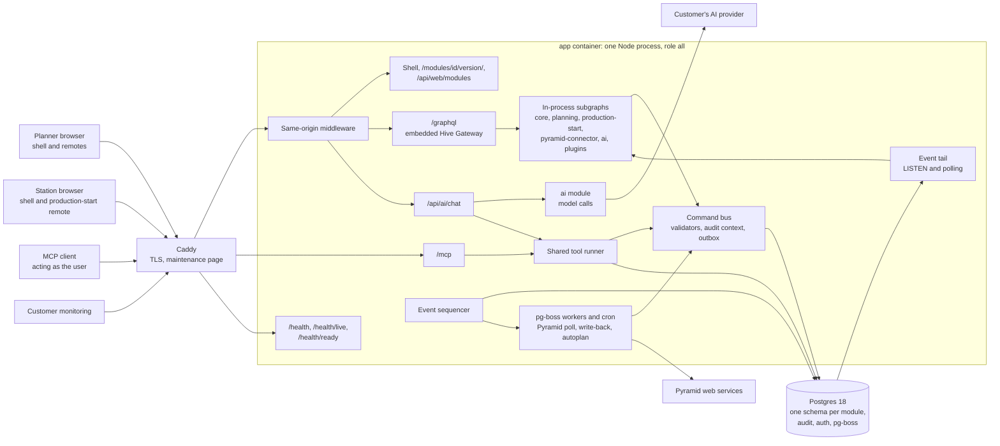
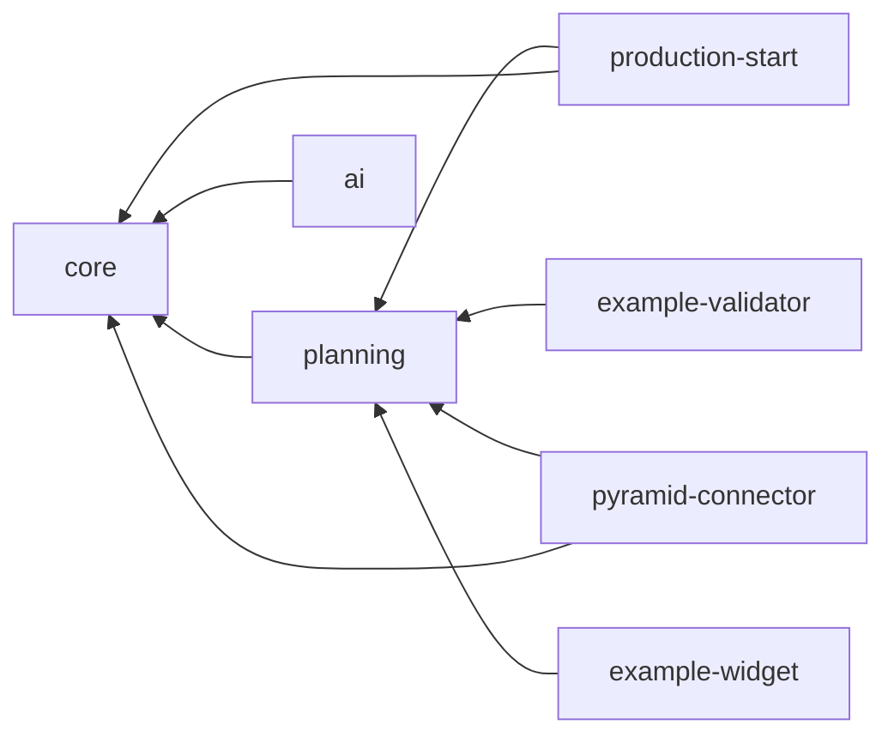
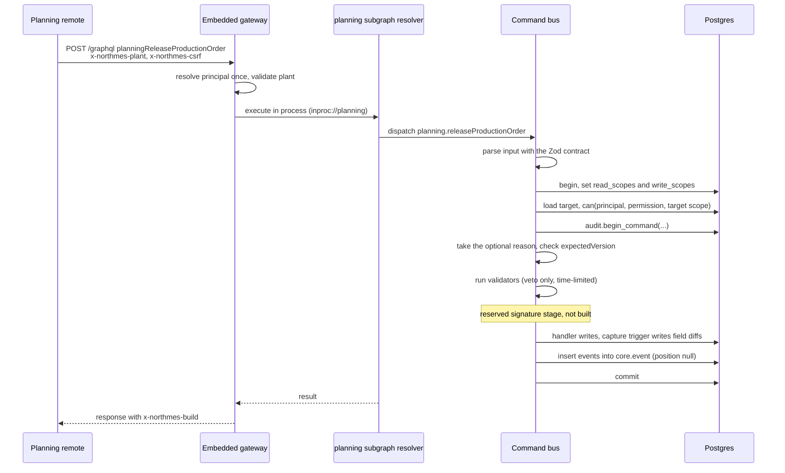
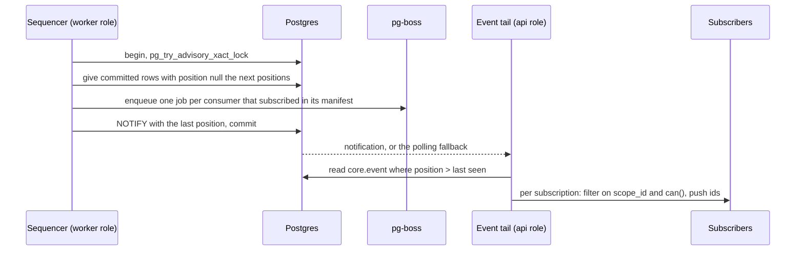
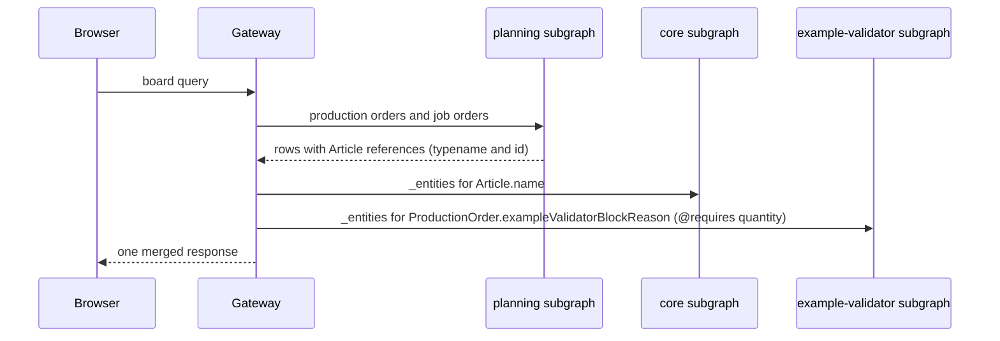
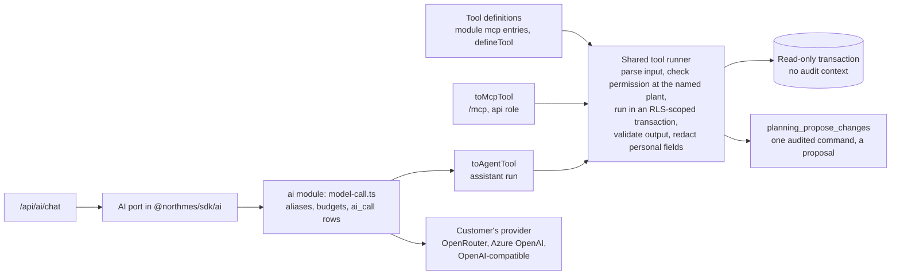
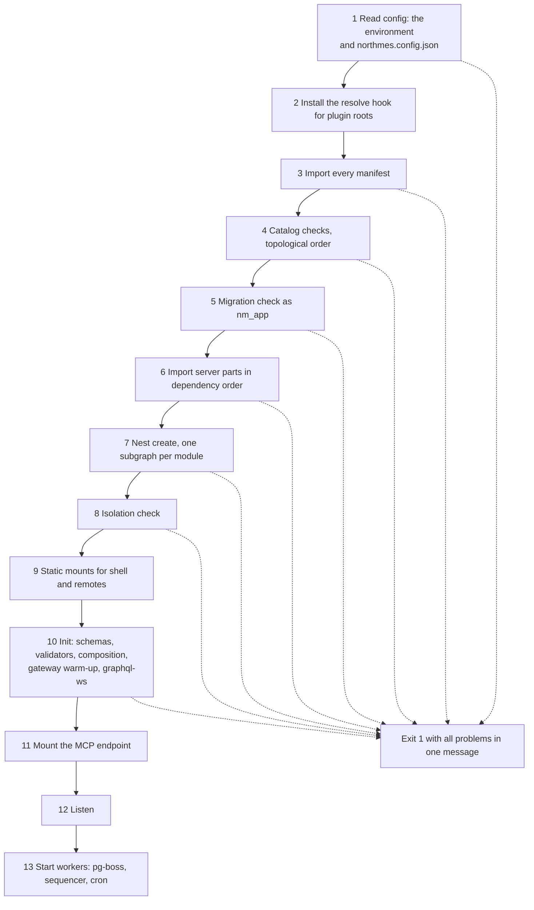

# Architecture

Release 1 of NorthMES is a modular monolith: one NestJS application in one Node process, started in role `all` on one Linux host, with one Postgres 18 database in which every module owns its own schema. Every module and plugin is a GraphQL Federation subgraph that the process builds in memory, composes at boot and serves through an embedded Hive Gateway on `/graphql`. The web app is a React shell that loads one Module Federation remote per module, and the same Nest process serves the shell, the remotes and the list of installed modules from one origin. Every write is a command that runs validators, writes the audit trail and stores outbox events in one transaction. A sequencer publishes those events to pg-boss jobs and to an event tail that feeds GraphQL subscriptions. This document describes the processes, the request and event paths, the boot and shutdown order, the rules that keep modules apart, and the traps found in an earlier attempt and in the integration spike, with the ADR behind each part. The module contract and the plugin model are in [03 modules and extensibility](03-modules-and-extensibility.md).

## Constraints

These facts shape every choice below.

- One developer builds NorthMES with coding agents. The pilot runs on-prem on one Linux host with Docker Compose and one `app` container in role `all` ([ADR 0044](../adr/0044-on-prem-deployment-with-docker-compose-and-mandatory-tls.md), [ADR 0055](../adr/0055-release-1-scope-under-option-b-and-the-scope-rule.md)).
- Production planning is the first module. Later modules (Data collection, OEE, Maintenance, Traceability and the rest of the module map) must fit the same module contract without changes to core's rules ([ADR 0002](../adr/0002-modular-monolith-with-module-owned-schemas-and-process-roles.md)).
- Every module and plugin exposes its own Federation subgraph, written NestJS code-first ([ADR 0015](../adr/0015-graphql-federation-inside-one-process-with-an-embedded-hive-gateway.md)). Every module with screens ships its own frontend remote, and a core shell loads them ([ADR 0019](../adr/0019-web-shell-with-react-module-federation-remotes.md)).
- Audit is written in the same transaction as the change it records ([ADR 0013](../adr/0013-audit-trail-written-in-the-command-transaction.md)).
- A platform feature is built only when a release needs it. Everything else stays documented design with the trigger that brings it in ([ADR 0055](../adr/0055-release-1-scope-under-option-b-and-the-scope-rule.md)).
- The pilot host is a single point of failure, and the operations docs say so. Recovery is a restart plus a restore. The code still follows the multi-replica rules in [Process roles](#process-roles), so a second replica needs no rewrite.

## System overview



The Compose bundle holds four services: `caddy`, `app` (role `all`), a one-off `migrate` service and `db` (the NorthMES Postgres image with pgBackRest). HTTPS is mandatory for every browser, planners and stations alike. Caddy serves a maintenance page with status 503 while `app` restarts. Deployment details are in [12 operations and security](12-operations-and-security.md) and [ADR 0044](../adr/0044-on-prem-deployment-with-docker-compose-and-mandatory-tls.md).

## Process roles

One image starts in one of three roles. There is no `web` role and no `ingest` role in release 1 ([ADR 0002](../adr/0002-modular-monolith-with-module-owned-schemas-and-process-roles.md)).

| Role | Runs | Does not run |
|---|---|---|
| `all` | everything in the two rows below, in one process; the pilot runs one `all` replica | |
| `api` | catalog and boot checks; every module's Nest module; the subgraphs and the embedded gateway on `/graphql` (HTTP, graphql-ws and SSE); `/mcp`; `/api/ai/chat`; the event tail; static files and `/api/web/modules`; the command bus with validators; pg-boss in send-only use | pg-boss workers, cron, the sequencer, connector polling |
| `worker` | catalog and boot checks; every module's Nest module; the command bus with validators; event handlers; pg-boss workers and cron; the sequencer; connector polling; a health endpoint | subgraph schemas, the gateway, static files, `/mcp` |

Every role loads the same configuration and every plugin, so a command that a worker runs (an ERP import, for example) passes the same validators as one from the UI. Each `api` replica composes its own supergraph at boot and reports its hash on readiness, so replicas with different configurations show up.

The pilot runs one replica, but the code follows the multi-replica rules from the start:

- Processes are stateless. Jobs are idempotent.
- Only transaction-level advisory locks are used. No session state survives a transaction, so the code stays safe behind PgBouncer in transaction mode even though the pilot runs none ([ADR 0014](../adr/0014-outbox-event-log-and-pg-boss-jobs.md)).
- `LISTEN` runs on one direct connection from `DATABASE_LISTEN_URL`.
- Schedules run through pg-boss cron and singleton jobs, never through an advisory-lock leader.
- Migrations run as a separate step (`northmes migrate` in the `migrate` container), never at app start.
- CI runs the two-replica integration tests.

With one replica, the permission cache is invalidated locally when a role transaction commits, with a 30 s TTL as a backstop, and `@nestjs/throttler` keeps its counters in memory. A Postgres throttler store is written when a second replica exists ([ADR 0010](../adr/0010-identity-with-better-auth-roles-and-permissions-in-core-tables.md), [ADR 0011](../adr/0011-principals-credentials-and-same-origin-rules.md)).

## Repository layout

One monorepo holds every module with its services and its frontend ([ADR 0004](../adr/0004-monorepo-tooling-pnpm-turborepo-node-and-typescript-versions.md)).

```text
apps/
  server/            AGPL host: config, catalog loader and checks, migration runner, embedded gateway,
                     command bus, tool runner, jobs wrapper, event sequencer and tail, web serving, health
  web/               AGPL shell: pure @module-federation/runtime host on Vite
  docs/              docs site for docs.northmes.dev
modules/
  core/              module package, web remote, contracts package (layout in 03)
  planning/          the same, plus domain/ (@northmes/planning-domain, the pure scheduling package)
  production-start/
  pyramid-connector/
  ai/
packages/
  contracts/         @northmes/contracts (MIT): shared value types and definition functions
  sdk/               @northmes/sdk (MIT): defineModule, server helpers, tool and AI port types
  web-sdk/           @northmes/web-sdk (MIT): web module contract, slots, Apollo client factory
  ui/                @northmes/ui (MIT): primitives, tokens, form engine
  web-build/         @northmes/web-build (MIT): remote build config and guards
  testing/           @northmes/testing (MIT): Testcontainers harness, app factory, contract suites
examples/
  plugin-validator/  example backend plugin (command validator)
  plugin-widget/     example frontend plugin (slot widget)
plugins/             drop-in directory for built plugin packages
schema/              committed api.graphql and supergraph.graphql, generated by pnpm gen
infra/pg-image.json  the one pinned Postgres image digest for Compose, Testcontainers and the bundle
e2e/                 Playwright specs, including skeleton.spec.ts
docs/plan/, docs/adr/ the public plan and the ADRs
docs/design/<area>/  approved designs (PNGs and build notes)
northmes.config.json installation config: the plugins to load
```

Where the `audit` module's code lives is an open item (see [Open items](#open-items)). Every command runs as a root pnpm script or with `pnpm --filter`, and `pnpm check` is the one gate command ([ADR 0058](../adr/0058-developer-environment-source-exports-one-stack-script-and-one-gate-command.md)).

## Modules and data ownership

A module is one folder with a `defineModule` manifest, a server part, an optional web remote, an MIT contracts package and SQL migrations. [03 modules and extensibility](03-modules-and-extensibility.md) defines the manifest and the package shape. The rules below decide how modules talk to each other ([ADR 0002](../adr/0002-modular-monolith-with-module-owned-schemas-and-process-roles.md)).



Arrows point from a module to the modules it depends on. Dependencies point toward core. Upstream modules never know downstream ones: production-start reports progress by calling planning's `reportOperationProgress`, so planning has no dependency on production-start, and planning shows downstream data only through slots that the downstream module fills. Master data lives in core: plant, scope tree, equipment groups, equipment, tools, articles, routings and operations, operation equipment, calendars, warehouses and customers.

| Rule | Enforced by |
|---|---|
| 1. A module never reads or changes another module's tables. | Each module and plugin migrates as its own NOLOGIN owner role `nm_mod_<sql name>` that owns only its schema, so Postgres refuses a migration that alters, selects from or creates in another schema. At run time one `nm_app` role serves all modules, so per-module generated Kysely `DB` types, Biome `noRestrictedImports` and a raw-SQL pattern check keep queries inside the module's schema. |
| 2. A foreign key into another module exists only where the owner allows it. | The owner's migration runs `grant references (id) on <table> to nm_ext`, and every owner role is a member of `nm_ext`. The migration runner records inbound foreign keys before a module's pending files and raises when one disappears. |
| 3. Queries and commands across modules are synchronous in-process calls to the owner's `<Id>ApiModule`. | The API module holds plain providers and no resolvers. The isolation boot check fails when a resolver-bearing Nest module is reachable from a second subgraph root. |
| 4. Events go through the outbox only for side effects (ERP write-back, subscription fan-out, later notifications). An event never replaces a command call to another module. | Review rule, plus contract tests on consumers: the Pyramid connector subscribes to no `planning.draft.*` and no `*.soft_lock_changed` event, so a soft lock enqueues zero write-back jobs. |
| 5. GraphQL crosses modules only through entity references by `@key`. A module that adds a field to another module's type adds a nullable field with its own prefix. | Composition rules at boot (see [GraphQL](#graphql-the-embedded-gateway-and-in-process-subgraphs)). |
| 6. Command validators attach only to commands the owner declares validatable, and only from modules that depend on the owner. | Boot catalog check. |
| 7. Cross-module UI goes only through slots that the rendering module owns, and a contributor must depend on the owner. | Boot catalog check and the shell's check against the module list. |
| 8. A remote queries only fields of its own module and of its `dependsOn` closure. | GraphQL codegen per web package against a closure schema. |
| 9. Domain logic is never shared by import between modules. | The scheduling domain is `@northmes/planning-domain`, pure TypeScript with no Nest, Kysely, pg or `process.env` imports (a lint test). Planning server and planning web import it; other modules reach its results through planning's API module ([ADR 0057](../adr/0057-scheduling-domain-as-a-pure-package-in-the-planning-module.md)). |

Shared code goes into the MIT packages under `packages/` by the rules in [ADR 0022](../adr/0022-shared-building-blocks-packages-the-master-data-kit-settings-and-generators.md): cross-cutting rules are shared from their first use, mechanical glue has zero copies in modules, and a composite with a judgement is promoted at its third use (or the second when both users ship in release 1).

### Database layout

| Schema or object | Owner or writer | Content |
|---|---|---|
| `core`, `planning`, `production_start`, `pyramid_connector`, `ai` | the module's `nm_mod_<sql>` role | the module's tables, each with row-level security |
| `audit` | the audit module's NOLOGIN role | command, change and security event tables, monthly partitions, capture and definer functions |
| `auth` | created by core's migrations; `nm_auth` has rights on it only | Better Auth's tables |
| pg-boss tables | created by `northmes migrate` | jobs and queues |
| `northmes_meta` | the migration runner | applied migrations and the schema compatibility number |
| plugin schemas | the plugin's `nm_mod_<sql>` role | the plugin's own tables |

`nm_owner` creates the roles; `nm_app` is the runtime role with SELECT, INSERT, UPDATE and DELETE only, no ownership, no BYPASSRLS and no TRUNCATE. Only the `migrate` login may switch to module owner roles, and the `app` container never receives the owner password ([ADR 0006](../adr/0006-kysely-sql-first-migrations-and-the-northmes-migration-runner.md), [ADR 0047](../adr/0047-secrets-and-the-installation-key.md)). Row-level security uses transaction-local `read_scopes` and `write_scopes`, split policies per command type, and no `FORCE ROW LEVEL SECURITY` in release 1 ([ADR 0008](../adr/0008-row-level-security-with-transaction-local-scopes.md)). The data model is in [04 data and platform](04-data-and-platform.md).

## The write path: commands

Every write is a command, and every GraphQL Mutation field maps to a registered command handler. The boot fails when a Mutation field has no handler ([ADR 0012](../adr/0012-commands-as-the-single-write-path.md)).



- One transaction is one audit command. The capture trigger on every module and plugin table raises when no valid audit context is open.
- Every mutable row has a `version` column; commands take `expectedVersion` and fail with `core.version_conflict`.
- Create-type commands take a client-generated uuidv7 id with `insert ... on conflict do nothing`, so a retry after a restart is harmless.
- A validator rejection returns `core.command_rejected` with `rejectedBy`. Errors are `DomainError` codes from each module's catalog; unknown errors reach the client as "Unexpected error." with a correlation id.
- Security events (sign-ins, permission denials) are written on a separate connection after the business transaction ends, so a rollback keeps them.
- Read tools from MCP and the in-app assistant run in `SET TRANSACTION READ ONLY` with no audit context. Only the propose tool opens one, and it writes exactly one command.
- Seeds and test fixtures write through `db.command({ principal, scopes, reason }, fn)` with surface `cli`.

Input schemas are Zod definitions in the module's MIT contracts package and are the single source for GraphQL inputs, validator payloads, settings, event payloads and tool schemas ([ADR 0017](../adr/0017-zod-contracts-as-the-single-source-for-inputs.md)).

## Outbox, event log and jobs

`core.event` is one plain table that is both the outbox and the event log. A row with `position` null has not been published yet ([ADR 0014](../adr/0014-outbox-event-log-and-pg-boss-jobs.md)).



- One sequencer holds a transaction-level advisory lock and assigns commit-ordered positions in batches. `position` is the cursor everywhere.
- Events carry `entity_version` and `schema_version`. An event's causation id is the audit command id.
- The sequencer enqueues consumer jobs in its own transaction and sends one `NOTIFY` per batch carrying only a position, so business commits never take the notification lock.
- Consumers keep an inbox: a handler first inserts `(consumer, event_id)` with `on conflict do nothing` and skips the work when no row was inserted.
- Every job payload carries `schema_version`. A handler parks an unknown version in a dead-letter state instead of retrying.
- pg-boss is pinned exactly and sits behind the SDK's `jobs` API. Every role starts it with `migrate: false`; its schema migration and queue creation run inside `northmes migrate`, and no queue uses `partition: true`. pg-boss start retries with backoff like the database pool.
- ERP write-back is state transfer on a `stately` queue keyed by production order: the handler reads current committed state and sends what differs, so ten quick moves become one or two calls ([08 Pyramid connector](08-pyramid-connector.md)).
- Notifications, the Events API, webhooks, actions and Redis or Valkey are deferred.

The event catalog for release 1 is in [04 data and platform](04-data-and-platform.md) and [07 production planning](07-production-planning.md).

## Realtime: the event tail and subscriptions

Screens show live status through GraphQL subscriptions with prefixed root fields (for example `planningBoardChanged`) over graphql-ws, with SSE on the same endpoint for a site that blocks WebSockets ([ADR 0018](../adr/0018-realtime-subscriptions-over-graphql-ws-fed-by-the-event-tail.md)).

- Every `api` replica tails `core.event` with one direct `LISTEN` connection plus a polling fallback. No third-party Postgres pub/sub library is used.
- A subscription resolves its principal and scopes from its `plantId` argument and checks membership and permission at start. Each event passes only when `event.scope_id` is in the subscriber's read scopes and `can()` allows the subscription's permission through the permission cache. DataLoaders are built per event.
- The WebSocket principal comes only from the handshake cookie. graphql-ws closes with 4401 without a session and 4403 on lost plant membership, and sockets close when the session is revoked.
- The board subscription carries changed ids, and the client refetches the visible range. One `planning.plan.revised` event per apply carries at most 200 changed job order ids, or null meaning "refetch the range".
- The client retries without a limit (wait capped at 10 s with jitter), stops on 4400, 4401 and 4403, refetches every active query after a reconnect and compares module versions.
- The gateway adds `x-northmes-build: <version>+<supergraphHash>` to every `/graphql` response and to the graphql-ws `connection_ack`. A mutation whose `x-northmes-client-build` differs fails with `core.client_outdated`, and the shell asks the user to reload.

## GraphQL: the embedded gateway and in-process subgraphs

Each module and plugin builds one Federation subgraph through the SDK's `defineSubgraph`, which uses a custom `InProcessSubgraphDriver` that builds the schema and starts no server. Module authors never configure `GraphQLModule`. `@graphql-hive/gateway-runtime` runs as Nest middleware on `/graphql` and reaches the subgraphs through an in-process transport (`inproc://<subgraph>`), with graphql-ws on a `noServer` WebSocket server and SSE on the same path ([ADR 0015](../adr/0015-graphql-federation-inside-one-process-with-an-embedded-hive-gateway.md)).



The supergraph is composed at boot from the enabled modules with `@theguild/federation-composition` plus the NorthMES rules:

- Every root field (query, mutation, subscription) carries its module prefix, for example `planningReleaseProductionOrder`.
- Each type and enum has one owner. Contributed fields are nullable. `@external` types match exactly.
- Shared types (`PageInfo`, the time scalars, list operator inputs and enums, unit enums) sit on an allowlist with a drift rule.
- A composition error exits the process. The supergraph hash appears in the boot log, on readiness and on the System health page.

The gateway runs with `maskedErrors`, a depth limit of 12 and a token limit of 2 000 through graphql-armor plugins, and Hive `demandControl` with `@listSize` on every connection field and a `maxCost` that starts at 20 000. Field suggestions are blocked, and introspection is refused for unauthenticated requests. Guards run on every field through `fieldResolverEnhancers` and a global permission guard with an explicit `@Public()` opt-out; a resolver field with neither permission nor `@Public` metadata makes the boot exit naming `Type.field`. The principal is resolved once per request and passed in process.

The federation link is pinned at v2.9. `@nestjs/graphql`, `@apollo/subgraph`, `@theguild/federation-composition`, `@graphql-hive/gateway-runtime`, `@graphql-mesh/transport-common` and `graphql` 16 are pinned exactly and upgraded together. `@apollo/gateway` and `@graphql-yoga/nestjs-federation` are never installed. There is no `apps/gateway`, and HTTP subgraph mode is not shipped.

The committed snapshot (`schema/api.graphql`, `schema/supergraph.graphql` and each module's `schema.graphql`) is built only from in-repo modules by `northmes schema print`, which runs with `DATABASE_URL` unset. It serves codegen, schema diffs and `plugin check`; the running supergraph always comes from boot composition. List conventions (Relay connections, filter, orderBy, search, group by) are in [05 GraphQL and APIs](05-graphql-and-apis.md) and [ADR 0016](../adr/0016-graphql-list-conventions-connections-relations-filter-sort-search-and-group-by.md).

## Web: the shell and remotes served by Nest

`apps/web` is a pure `@module-federation/runtime` host on Vite, with no federation build plugin ([ADR 0019](../adr/0019-web-shell-with-react-module-federation-remotes.md)). It boots in this order:

1. Fetch `GET /api/web/modules`, which lists the remotes that are installed, enabled, compatible and permitted for the user at the plant, each with a SHA-384 hash of its manifest.
2. Register the remotes and load them in parallel with a timeout (planner 10 s, station 30 s), a per-remote indicator after 2 s and retries.
3. Validate each module object with `validateWebModule`.
4. Call `routes(plantRoute)` on each remote, and add a placeholder route plus an "(unavailable)" menu entry in its usual position for each remote that failed.
5. Create the TanStack Router route tree once and render.

Each remote exposes `./module = defineWebModule({ id, version, northmesRange, permissions, routes(plantRoute), nav, widgets })` and is built with Vite and an exactly pinned `@module-federation/vite` through `defineRemoteConfig` in `@northmes/web-build`. The shared singletons are react, react-dom, react/jsx-runtime, @tanstack/react-router, @apollo/client, @apollo/client/react, @northmes/web-sdk and @northmes/ui, all with `import: false` and `requiredVersion: false`. Mount points are `/$plant` and `/station/$stationId`.

Nest serves each installed remote at `/modules/<id>/<version>/` with immutable caching for hashed files and `no-cache` with an ETag for `mf-manifest.json` and `remoteEntry.js`. At boot the server checks the files each `mf-manifest.json` lists and marks a module degraded with `integrity: null` when one is missing. Shell, `/graphql`, `/api` and every remote share one origin, so there is no CORS and the session cookie works everywhere. The CSP is strict `'self'`, and the SPA makes no CDN calls.

In-repo remotes ship no CSS; the shell builds one Tailwind sheet from generated `@source` lines over each remote's workspace dependency closure. Remotes built through the plugin path ship a prefixed sheet without preflight. TanStack Start, SSR and a `web` role are not used. If the Vite federation plugin fails, the remotes move to an Rsbuild build, a path the web spike tested (internal research note 19); this stays inside the Module Federation decision. UI details are in [06 web and UX](06-web-and-ux.md).

## HTTP endpoints and credentials

REST in release 1 is limited to the endpoints below plus Better Auth's handler. There is no integration REST API until an outside system needs one ([ADR 0031](../adr/0031-erp-integration-connector-modules-field-ownership-and-pending-changes.md)).

| Path | Purpose | Accepts |
|---|---|---|
| `/`, `/assets/*` | shell `index.html` (`no-cache`, CSP header) and hashed shell assets | no credential |
| `/modules/<id>/<version>/*` | remote files; remotes hold no data | no credential |
| `/api/web/modules` | module list for the shell | session or station cookie; 401 without one, 403 for an unauthorized plant |
| `/graphql` (HTTP, graphql-ws, SSE) | the supergraph | session or station cookie; HTTP requests carry `x-northmes-csrf`; every request carries `x-northmes-plant` |
| `/api/web/client-errors` | browser errors to a core table, grouped by fingerprint | session or station cookie; same-origin; rate-limited; 8 kB body cap |
| `/api/ai/chat` | streaming assistant chat | session cookie; same-origin |
| `/api/station` | operator sign-in and sign-out at a station (`core.stationOperatorSignIn`, `core.stationOperatorSignOut`) | station cookie `__Host-nm_station`; same-origin |
| Pyramid XML upload | file-mode import | session with the connector's upload permission at company scope (admins only by default); one file of at most 25 MB |
| `/mcp` | MCP toolset | bearer only: a personal access token with prefix `nms_mcp_` or a JWT whose `aud` is the public origin plus `/mcp`; cookies are ignored |
| `/health`, `/health/live`, `/health/ready` | health and probes | no credential; polled by the Compose healthcheck and the customer's monitoring |

A global middleware mounted before the gateway and every cookie-authenticated controller rejects unsafe methods unless `Origin` equals `NORTHMES_PUBLIC_ORIGIN` (or `Sec-Fetch-Site` is `same-origin` when `Origin` is absent) and writes a security event. The WebSocket upgrade listener runs the same check. The GraphQL guard rejects MCP tokens, so an agent that holds its MCP token cannot call a mutation as the user. `/mcp` checks `Origin` and `Host` itself. One `PrincipalResolver(request, plant)` in the SDK serves the gateway, REST controllers, the chat route and MCP, and a test fails on any route that neither uses it nor is marked `@Public` ([ADR 0011](../adr/0011-principals-credentials-and-same-origin-rules.md), [ADR 0010](../adr/0010-identity-with-better-auth-roles-and-permissions-in-core-tables.md)).

## MCP endpoint and the AI module

Tools are defined once in the MIT SDK as plain data (`defineTool`: Zod input and output schemas, handler, annotations, permission), independent of the MCP SDK. One shared runner serves two thin adapters, so the in-app assistant never calls `/mcp` over HTTP ([ADR 0034](../adr/0034-mcp-surface-one-endpoint-a-read-mostly-planning-toolset.md), [ADR 0035](../adr/0035-ai-provider-port-with-customer-configured-providers.md)).



- `/mcp` runs inside the Nest app in the `api` role on `@modelcontextprotocol/server` v2 with `legacy: "stateless"`. The release 1 toolset has eight planning tools, each with an explicit `plant` argument. `/mcp` is disabled per installation by default and enabled through an audited setting; `POST /mcp` returns 404 while it is off. Sign-in in release 1 is a personal access token that acts as the user with the user's roles. MCP reads are not audited and go to the structured log.
- The SDK holds a types-only AI port with no AI SDK types in its public API. The AGPL `ai` module implements it with the Vercel AI SDK 7. `modules/ai/server/model-call.ts` is the only caller of `streamText`, `generateText` and `embed`; a lint rule forbids importing them anywhere else, and every call passes `telemetry: { isEnabled: false }`.
- Modules ask for aliases (`fast`, `reasoning`, `embedding`), never models. Each company binds aliases to a provider configuration it owns, with write-only secrets encrypted by the installation key. With no provider configured, the feature is off and the panel hides.
- Every model call writes one `ai.ai_call` row per step with tokens and cost and never the prompt or completion text. Budgets are checked before each step.
- AI never commits a change. Agent writes are proposals in a planner's draft that a person commits ([ADR 0036](../adr/0036-agent-proposals-as-planning-records-a-person-commits.md)).

Details are in [10 AI and agents](10-ai-and-agents.md).

## Health endpoints

Every web endpoint and service exposes `/health` with status, version and dependency state, plus `/health/live` and `/health/ready`. In release 1 the one `app` process serves them; a `worker` replica serves its own ([ADR 0043](../adr/0043-health-endpoints-graceful-shutdown-and-the-system-health-page.md)).

| Endpoint | Checks |
|---|---|
| `/health/live` | the process only |
| `/health/ready` | `select 1`; schema compatibility; the `LISTEN` connection; pg-boss started. Returns 503 during shutdown. JSON body with the supergraph hash and a degraded list. |
| `/health` | status, version and dependency state (database connected and similar) |

Degraded entries keep readiness true: Pyramid unreachable, a backup older than 26 hours, audit partitions fewer than 3 months ahead, a stale host check file, a failing WAL archive or a PITR gap, certificate expiry within 30 days, clock skew. Readiness fails when audit partitions are fewer than 1 month ahead, because a missing partition makes every write fail. Checks are custom `@nestjs/terminus` indicators with timeouts. An in-process watchdog exits with code 1 when readiness stays false more than 120 s after its first success or 300 s after start, so the restart policy recovers the process. The System health page and the host check are described in [12 operations and security](12-operations-and-security.md).

## Configuration and secrets

Behaviour-affecting configuration lives in audited database tables as Zod-defined settings at company and plant scope. Environment variables hold only infrastructure settings and the paths of secret files. Switches that look like infrastructure but change behaviour, such as enabling `/mcp` or a connector's shadow or live mode, are audited settings commands ([ADR 0022](../adr/0022-shared-building-blocks-packages-the-master-data-kit-settings-and-generators.md)). `northmes.config.json` lists the plugins to load; the in-repo module list ships inside the image, and the NorthMES version comes from the image's `package.json`. The installed catalog (module ids, versions, manifest hashes, supergraph hash) is folded into the configuration revision, and one boot command is written only when the catalog changes ([ADR 0013](../adr/0013-audit-trail-written-in-the-command-transaction.md)). The `app` service receives only its own secrets as Compose secrets ([ADR 0047](../adr/0047-secrets-and-the-installation-key.md)).

## Boot sequence

Role `all` boots in a fixed order. Any hard failure exits with code 1 and lists every problem it found in one message ([ADR 0002](../adr/0002-modular-monolith-with-module-owned-schemas-and-process-roles.md)). Step 1 parses the environment against the Zod configuration schema through `@nestjs/config` and reads the secret files; a bad value stops boot before any manifest is imported ([ADR 0060](../adr/0060-configuration-with-nestjs-config-one-zod-environment-schema-and-secret-files.md)).



| Step | What happens | Fails hard on |
|---|---|---|
| 1. Config | parse the environment against `serverEnvSchema`, read the secret files and read `northmes.config.json` ([ADR 0060](../adr/0060-configuration-with-nestjs-config-one-zod-environment-schema-and-secret-files.md)) | an invalid or missing environment key; a missing, empty or other-readable secret file; an unreadable config file; a version field that differs from the image |
| 2. Resolve hook | `module.registerHooks` maps host-provided packages imported from any plugin root to the host's copy | |
| 3. Manifests | import every manifest; manifests import only `defineModule`, so no Nest code loads | missing `exports["./manifest"]`, import error, invalid id |
| 4. Catalog checks | duplicate ids, derived-name collisions, `dependsOn` present, no cycles, no core module depending on a plugin, `northmes` range, key prefixes, slot ownership; topological order with core first | any of these |
| 5. Migration check | as `nm_app`, compare applied migrations with the files of every installed module | pending files; a database whose schema compatibility number exceeds what the image accepts |
| 6. Server imports | `await manifest.server()` in dependency order | import error, missing default export, a configured plugin that fails to load |
| 7. Nest create | instantiate modules; one subgraph per module through `defineSubgraph` | dependency injection errors |
| 8. Isolation check | compute, the way Nest does, which resolver classes each subgraph root reaches | a resolver-bearing module reachable from two subgraph roots or through a global module; the message prints both import paths |
| 9. Static mounts | shell assets and `/modules/<id>/<version>/` per installed remote | |
| 10. Init | build subgraph schemas, discover and check validators, compose with the NorthMES rules, warm the gateway with `getSchema()`, start graphql-ws on `noServer`; check that every Mutation field maps to a command handler and every resolver field has permission or `@Public` metadata | schema build error (the message names the subgraph and its config entry), composition error, validator registration error, unmapped mutation, unguarded field |
| 11. MCP | mount `/mcp` with tools from the modules' `mcp` entries | |
| 12. Listen | HTTP and WebSocket on one port | port in use (the message names `PORT`) |
| 13. Workers | pg-boss start with `migrate: false`, the sequencer, cron | |

Boot also asserts these facts; the step that runs each is fixed by its task:

- `resolveWallClock('Europe/Stockholm', 2027-03-28, 02:30)` resolves to 01:00Z, and the log records whether Temporal is native or the polyfill plus the Node and Postgres tzdata versions ([ADR 0024](../adr/0024-time-utc-instants-plant-wall-clock-temporal-and-the-clamp-resolver.md));
- every table in every installed module and plugin schema has the audit capture trigger enabled with arguments that match the manifest, or an allowlist entry with a reason ([ADR 0013](../adr/0013-audit-trail-written-in-the-command-transaction.md));
- `BETTER_AUTH_TELEMETRY` is not set, `enableSessionForAPIKeys` is false and the api-key client endpoints are disabled ([ADR 0011](../adr/0011-principals-credentials-and-same-origin-rules.md)).

These states degrade instead of stopping the process:

| State | Behaviour |
|---|---|
| a module's remote files are missing, or a manifest hash does not match | `/api/web/modules` lists it with `integrity: null`; the shell shows a placeholder route and an "(unavailable)" menu entry |
| a remote fails in the browser, or a slot contribution throws | the route error component, or the per-contribution error boundary in `<Slot>` |
| a web-only plugin targets a slot that no longer exists | status `incompatible`; boot continues (pending confirmation, see [03](03-modules-and-extensibility.md)) |
| a validator times out or throws at run time | that command is rejected; everything else works |
| the database is unreachable at start | retry with backoff; readiness stays false; the watchdog limits the wait |
| Pyramid unreachable, listener connection lost, backup old | readiness degraded; System health shows it |

A configured plugin with a server part that fails to load stops the boot. It is never skipped, because a skipped validator removes a business rule without anyone noticing and a skipped subgraph changes the API under every client.

`northmes migrate --check` runs steps 1 to 10 without listening and stops before the first migration file, and plain `northmes migrate` runs the same steps first. In this mode the migration check of step 5 lists pending files instead of failing on them. `upgrade.sh` runs `migrate --check` from the new image with the site's config and plugins before it stops `app`, so a plugin that no longer composes fails before any migration is applied ([ADR 0045](../adr/0045-backups-restore-drills-upgrades-and-rollback.md)).

The integration spike measured this sequence with core, planning and both example plugins on Node 24: boot after the entry module's imports took 113 to 146 ms, of which composition took 14 to 23 ms; wall time from start to exit after boot was 529 to 605 ms; RSS was 210 to 215 MB; the two plugins added no measurable boot time (internal research note 20).

## Shutdown sequence

Role `all` shuts down in this order ([ADR 0043](../adr/0043-health-endpoints-graceful-shutdown-and-the-system-health-page.md)):

1. Readiness returns 503. Running assistant chats are aborted with reason `server-restarting` and get up to 5 s to settle their `ai_call` rows; the propose tool checks the abort signal before its commit.
2. graphql-ws is disposed in `beforeApplicationShutdown`. Disposing it later deadlocks, because `server.close()` waits for upgraded sockets.
3. pg-boss `stop()` drains the workers.
4. Nest closes HTTP.
5. The gateway runtime is disposed in `onApplicationShutdown`.
6. The listener connection and the pools close last.

`app.enableShutdownHooks(["SIGTERM", "SIGINT"])` is mandatory, because the embedded gateway registers SIGTERM and SIGINT listeners that stop Node's default exit. `forceCloseConnections` stays off and `return503OnClosing` is on, which also stops a mutation from enqueueing a job on a stopped pg-boss. Compose gives `app` a `stop_grace_period` of 45 s, above the pg-boss drain timeout.

## Traps and how each is prevented

### From the earlier attempt

An earlier attempt at the same product ran fourteen services, eleven module subgraphs plus platform subgraphs behind a separate router, eleven web remotes, a hosted identity provider and a cloud message bus (internal research note 16). Code volume was not its constraint; architecture weight, coordination across services and breadth were. Each trap below has a counter-measure in this design.

| Trap | Prevention in NorthMES | Where |
|---|---|---|
| Entity ownership split across services (articles, machines, calendars and operators in different services), so the scheduling service copied about 20 columns of planning data | One process; master data in core; synchronous calls through API modules; no mirror tables or projections | Rules 1 to 4 above, [ADR 0002](../adr/0002-modular-monolith-with-module-owned-schemas-and-process-roles.md) |
| Guards did not run on fields reached through `_entities`; a duplicate enum broke composition; a minor `@apollo/subgraph` release broke boot | Guards on every field through `fieldResolverEnhancers` plus the boot check for unguarded fields; one owner per type and enum; owners throw a typed NOT_FOUND for a hidden referenced row; federation packages pinned exactly and upgraded together | [ADR 0015](../adr/0015-graphql-federation-inside-one-process-with-an-embedded-hive-gateway.md), [ADR 0016](../adr/0016-graphql-list-conventions-connections-relations-filter-sort-search-and-group-by.md) |
| An `export *` barrel broke shared singletons (a white page); every barrel change needed a shell restart; React contexts did not cross remote bundles; each remote entry was named twice in its build config | Explicit exports only in shared web packages (`noReExportAll`); `@northmes/web-sdk` and `@northmes/ui` are singletons, so contexts cross remotes; one `defineRemoteConfig` factory; four or five remotes and one Nest watcher in dev | [ADR 0019](../adr/0019-web-shell-with-react-module-federation-remotes.md), [ADR 0022](../adr/0022-shared-building-blocks-packages-the-master-data-kit-settings-and-generators.md) |
| A hosted identity provider with no local login, stub modes in tests and one provider user per station | Better Auth inside the process with roles in core tables; e2e signs in with seeded users; a station is an API-key credential plus an operator session | [ADR 0010](../adr/0010-identity-with-better-auth-roles-and-permissions-in-core-tables.md), [ADR 0033](../adr/0033-online-operator-station-in-the-production-start-module.md) |
| A message bus that needed an emulator and an in-process fallback, so the default test run never crossed services | Outbox, sequencer and pg-boss in the same Postgres; no broker | [ADR 0014](../adr/0014-outbox-event-log-and-pg-boss-jobs.md) |
| Event choreography gaps: payloads thinner than consumers needed, corrections fanning out to six modules, no replay, consumers falling behind silently between restarts | Commands are synchronous; events only for side effects; commit-ordered positions; inbox per consumer; `schema_version` on events and jobs; readiness checks the listener and pg-boss; System health lists failed and retrying jobs | [ADR 0014](../adr/0014-outbox-event-log-and-pg-boss-jobs.md), [ADR 0043](../adr/0043-health-endpoints-graceful-shutdown-and-the-system-health-page.md) |
| Tests that could not prove the product: e2e mostly in stub mode, stubbed cross-service reads, no test under a non-UTC time zone | Testcontainers Postgres for integration and e2e; e2e on the built `all` process; a Europe/Stockholm leg in `pnpm check:full`; AI mocked only at the provider boundary | [ADR 0041](../adr/0041-test-strategy-tdd-vitest-projects-testcontainers-and-playwright.md), [11 quality and testing](11-quality-and-testing.md) |
| Breadth: research for eleven modules and about twelve obligations per task | The scope rule; release 1 builds the platform pieces planning needs; a short definition of done | [ADR 0055](../adr/0055-release-1-scope-under-option-b-and-the-scope-rule.md), [13 delivery and GitHub](13-delivery-and-github.md) |
| Documentation drift under parallel sessions, including two ADRs with the same number | ADR numbers from a script or CI check; `test/meta/doc-links.test.ts` fails on a relative Markdown link in `docs/plan`, `docs/adr`, `docs/agents` or `GLOSSARY.md` whose target `git ls-files` does not list, on any Markdown link into the gitignored `docs/research` folder, and on a backticked repository path in `AGENTS.md`, `CLAUDE.md` or `docs/agents` that `git ls-files` does not list and that the test's list of planned paths does not hold (each planned path names the task that creates it; backticked paths in `docs/plan` and `docs/adr` name files that later tasks create and are not checked) | [ADR 0049](../adr/0049-delivery-workflow-handoff-thin-vertical-slices-and-claude-design-per-task.md) |
| Names stored on rows (a lock holder's name) | Rows store person ids only; names live on the user table | [ADR 0006](../adr/0006-kysely-sql-first-migrations-and-the-northmes-migration-runner.md) |
| A date library whose choice between the two instants of a repeated autumn time is undefined | Temporal with one clamp resolver, `resolveWallClock` | [ADR 0024](../adr/0024-time-utc-instants-plant-wall-clock-temporal-and-the-clamp-resolver.md) |

### From the integration spike

The integration spike combined the backend and web federation designs in one process and found four traps that neither earlier spike hit (internal research note 20). A fifth came from the stress test of the upgrade path.

| Trap | What happened | Prevention |
|---|---|---|
| Resolver leak through imports | `@nestjs/graphql` builds a subgraph from its `include` module plus everything that module imports, and Nest adds every global module to every module's imports. Importing another module's resolver module, or a global host module, leaked resolvers into the wrong subgraph and failed with "Cannot determine a GraphQL output type". | The `<Id>ApiModule` and `<Id>Module` split; global Nest modules never import module packages; the isolation boot check (step 8) prints both import paths. |
| Second copies of host packages in a plugin | A plugin that bundled Nest, `graphql` or the SDK, or shipped its own `node_modules` copy, broke the schema with misleading errors; a plugin outside the host tree could not find `@northmes/sdk`. | `HOST_PROVIDED` externals in the plugin build and the resolve hook for every plugin root (step 2); plugin projects install the SDK as a package, never through `link:`. |
| SIGTERM ignored | The gateway runtime registers SIGTERM and SIGINT listeners that stop Node's default exit; the process was still running 5 s after SIGTERM. | `enableShutdownHooks(["SIGTERM", "SIGINT"])`; the process exited 6 ms after SIGTERM in the spike. |
| Shutdown deadlock with subscribers | Nest closes HTTP before `onApplicationShutdown`, and `server.close()` waits for upgraded WebSocket sockets, so a connected subscriber kept the process alive. | Dispose graphql-ws in `beforeApplicationShutdown`; the client got close code 1001 after 5 ms and the process exited after 13 ms. |
| Composition break found only after migrating | A plugin `@requires` break surfaced at boot step 10 after the migrations had run, and `app` restarted in a loop behind a 502. | `northmes migrate --check` runs boot steps 1 to 10 before any file; `upgrade.sh` runs it from the new image first. |

## Checks that guard this architecture

Each check below is a test or CI job that a task carries.

- Isolation contract suite with five fixtures (a sub-module of another module, an untyped `@Resolver()`, a global host module, an API module importing its own resolver module, a typed control): each fails boot with the named import path.
- The four host-provided boot tests and the resolve-hook test; `runtime.test.ts` asserts that `module.registerHooks` is a function.
- SIGTERM test: the `all` process with the embedded gateway exits after SIGTERM. Subscriber test: a graphql-ws client receives 1001 and the process exits.
- Shutdown mutation test: a 1.5 s mutation with `app.close()` after 300 ms returns 200 and leaves one `audit.command` row.
- Boot guard tests: a resolver field without permission or `@Public` metadata makes boot exit naming `Type.field`; anonymous introspection returns UNAUTHENTICATED; a 13-level query returns a depth error.
- `migrate --check` test: a planning fixture with `quantity: Float!` plus the example validator build (`@external quantity: Int!`) exits 1 naming `example-validator`, `EXTERNAL_TYPE_MISMATCH` and `ProductionOrder.quantity`, and the migration table is unchanged.
- `migrate-guards.test.ts`: a `drop table ... cascade` that would remove a plugin's foreign key raises a migration error naming the key.
- Route list test: every REST route uses `PrincipalResolver` or is marked `@Public`.
- Connector contract test: the Pyramid connector subscribes to no `planning.draft.*` and no `*.soft_lock_changed` event.
- Readiness test: with the database paused at start and resumed after 40 s, `/health/ready` returns 200 within 60 s; with `LISTEN` reconnects blocked for 150 s, the process exits non-zero and a restarted process becomes ready.
- Two-replica integration tests in CI.
- `e2e/skeleton.spec.ts`: Playwright on the built `all` process with Testcontainers Postgres, the backend validator plugin and one remote; required in `ci / gate` from milestone M1 (2026-11-20) ([ADR 0058](../adr/0058-developer-environment-source-exports-one-stack-script-and-one-gate-command.md)).

## Decisions in this document

| ADR | Covers here |
|---|---|
| [0002](../adr/0002-modular-monolith-with-module-owned-schemas-and-process-roles.md) | modular monolith, process roles, boot order, module ownership |
| [0003](../adr/0003-module-package-shape-and-the-definemodule-manifest.md) | module package shape and manifest (detail in 03) |
| [0004](../adr/0004-monorepo-tooling-pnpm-turborepo-node-and-typescript-versions.md) | monorepo tooling, Node and TypeScript pins |
| [0005](../adr/0005-postgres-18-official-image-with-pgbackrest-timescaledb-deferred.md) | the database image |
| [0006](../adr/0006-kysely-sql-first-migrations-and-the-northmes-migration-runner.md) | migrations, database roles, keys and versions |
| [0008](../adr/0008-row-level-security-with-transaction-local-scopes.md) | row-level security |
| [0010](../adr/0010-identity-with-better-auth-roles-and-permissions-in-core-tables.md), [0011](../adr/0011-principals-credentials-and-same-origin-rules.md) | identity, principals, credentials per endpoint, same-origin rules |
| [0012](../adr/0012-commands-as-the-single-write-path.md), [0017](../adr/0017-zod-contracts-as-the-single-source-for-inputs.md) | the command pipeline and Zod contracts |
| [0013](../adr/0013-audit-trail-written-in-the-command-transaction.md) | audit in the command transaction |
| [0014](../adr/0014-outbox-event-log-and-pg-boss-jobs.md) | outbox, sequencer, jobs |
| [0015](../adr/0015-graphql-federation-inside-one-process-with-an-embedded-hive-gateway.md), [0016](../adr/0016-graphql-list-conventions-connections-relations-filter-sort-search-and-group-by.md) | embedded gateway, composition rules, list conventions |
| [0018](../adr/0018-realtime-subscriptions-over-graphql-ws-fed-by-the-event-tail.md) | event tail, subscriptions, stale clients |
| [0019](../adr/0019-web-shell-with-react-module-federation-remotes.md) | shell and remotes |
| [0022](../adr/0022-shared-building-blocks-packages-the-master-data-kit-settings-and-generators.md) | shared packages and settings |
| [0024](../adr/0024-time-utc-instants-plant-wall-clock-temporal-and-the-clamp-resolver.md) | time handling checked at boot |
| [0034](../adr/0034-mcp-surface-one-endpoint-a-read-mostly-planning-toolset.md), [0035](../adr/0035-ai-provider-port-with-customer-configured-providers.md), [0036](../adr/0036-agent-proposals-as-planning-records-a-person-commits.md) | MCP, the AI module, agent proposals |
| [0043](../adr/0043-health-endpoints-graceful-shutdown-and-the-system-health-page.md) | health endpoints and shutdown |
| [0044](../adr/0044-on-prem-deployment-with-docker-compose-and-mandatory-tls.md), [0045](../adr/0045-backups-restore-drills-upgrades-and-rollback.md), [0047](../adr/0047-secrets-and-the-installation-key.md) | deployment, upgrades, secrets |
| [0055](../adr/0055-release-1-scope-under-option-b-and-the-scope-rule.md) | release 1 scope and the scope rule |
| [0057](../adr/0057-scheduling-domain-as-a-pure-package-in-the-planning-module.md) | the pure scheduling package |
| [0058](../adr/0058-developer-environment-source-exports-one-stack-script-and-one-gate-command.md) | developer environment and the skeleton gate |
| [0060](../adr/0060-configuration-with-nestjs-config-one-zod-environment-schema-and-secret-files.md) | configuration, the environment schema and secret files at boot step 1 |

## Open items

These points are not decided. Each is tracked in [16 open questions](16-open-questions.md).

- The Node pin. Node 26 LTS on a Debian-based image is the target, gated by the week-1 tests of the resolve hook, the host-provided boot tests, the time zone suite and two benchmarks; Node 24 LTS (24.13.1 or later) is the recorded fallback ([ADR 0004](../adr/0004-monorepo-tooling-pnpm-turborepo-node-and-typescript-versions.md), needs the maintainer's confirmation).
- Where the `audit` module lives. The decisions give the `audit` schema its own owner role and run the audit writer in the host's command pipeline, but do not say whether `audit` is its own module folder or a second schema inside `modules/core`. Its migrations must run before any module whose tables carry the capture trigger, which the catalog's "core first" order has to account for.
- Which modules ship a web remote. The decisions name remotes for core, planning, production-start and the widget example. The Pyramid connector (import log, inbox, file upload) and the `ai` module (provider settings, usage, budgets) also have screens, and rule 8 lets a remote query only its own module's closure, so each of them needs its own remote or a slot in a module it depends on. The audit screens (History tab, admin audit list) have the same open question.
