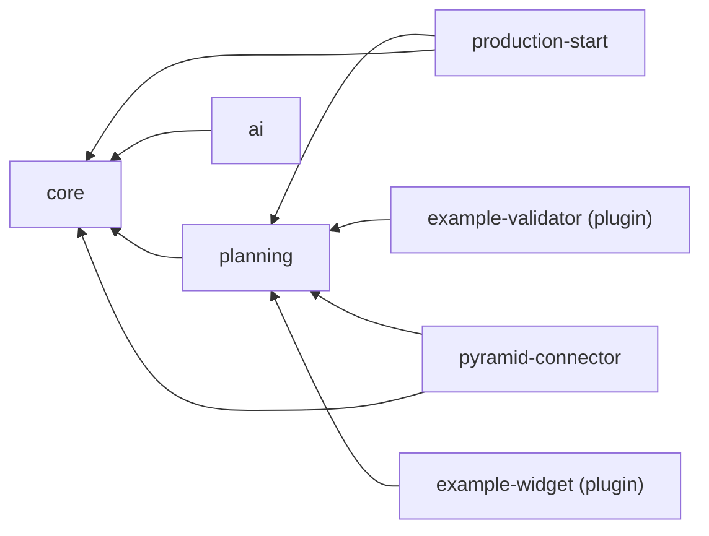
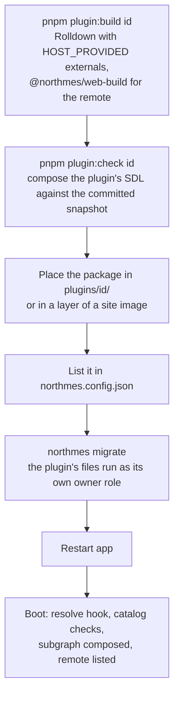
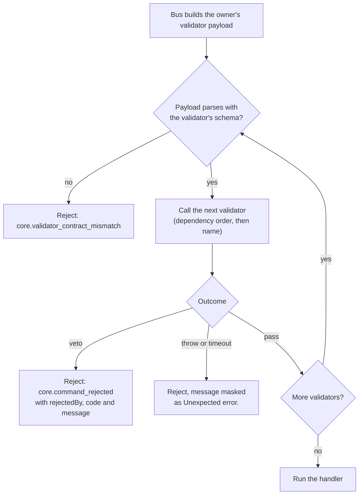

# Modules and extensibility

Every part of NorthMES that owns data or screens is a module built on one contract: a `defineModule` manifest, a server part, an optional web remote, an MIT contracts package and SQL migrations. Core modules, the Pyramid connector and plugins all use that contract; plugins get a narrower view of it, because they may import only the MIT packages. Release 1 ships the contract as an internal API together with two example plugins, a backend command validator and a frontend widget, both built through the plugin path and loaded from `plugins/` in CI. A plugin installs by dropping a built package into the installation, listing it in the config, migrating and restarting; core is never rebuilt. This document defines the manifest, the release 1 module list, the plugin model, command validators, UI slots, the compatibility checks and the line between MIT and AGPL packages, and it lists what waits until after the pilot. The process and request architecture is in [02 architecture](02-architecture.md).

## Terms

- Module: a unit with one id, one Postgres schema, one GraphQL subgraph and at most one web remote, declared by a `defineModule` manifest.
- In-repo module: a module that lives under `modules/` and ships inside the NorthMES image. In-repo modules may import other modules' AGPL API modules.
- Plugin: a module built outside the core image and dropped into an installation. A plugin imports only MIT packages. Release 1 plugins are the two examples under `examples/`.
- Extension point: a place that its owning module declares and versions, where another module or a plugin can extend NorthMES: a validatable command, an event or a keyed entity type on the server, a slot on the web. Anything else is internal ([ADR 0068](../adr/0068-extension-points-declared-by-their-owners-contributions-as-manifest-data-with-code-by-id-and-a-plugin-inventory.md)).
- Slot: a named place in a screen that the owning module renders and other modules fill with contributions. Its owner declares its kind: route, region, tab, field, item, banner or action.
- Contribution: one module's entry at an extension point, as manifest data (id, slot or point, label, order, permission) plus code that the server part or the remote supplies under the same id.
- Command validator: a veto-only check that a dependent module attaches to a command the owner declares validatable. Earlier drafts called these "command interceptors"; the name changed so it does not clash with Nest's interceptors.

[GLOSSARY.md](../../GLOSSARY.md) holds the domain terms.

## One id and the names derived from it

Every module and plugin has one kebab-case id matching `[a-z][a-z0-9]*(-[a-z0-9]+)*`. The SDK function `moduleNames` derives every other name, so a module cannot disagree with itself. The host refuses two modules whose derived names collide ([ADR 0003](../adr/0003-module-package-shape-and-the-definemodule-manifest.md)).

| Name | `production-start` | `example-validator` | Used for |
|---|---|---|---|
| id | `production-start` | `example-validator` | manifest, config, URL segment, static path `/modules/<id>/<version>/`, REST path segment `/api/v<major>/<id>/` |
| GraphQL name | `productionStart` | `exampleValidator` | subgraph name, root field prefix (`productionStartReportQuantity`), permission and command prefix (`productionStart.report:create`) |
| SQL name | `production_start` | `example_validator` | Postgres schema, owner role `nm_mod_production_start`, event prefix (`production_start.report.created`) |
| remote name | `productionStart` | `exampleValidator` | Module Federation remote name, which allows no hyphen |

## Package shape

Each module folder holds three workspace packages, each with its own `license` field ([ADR 0003](../adr/0003-module-package-shape-and-the-definemodule-manifest.md)).

| Package | License | Contents |
|---|---|---|
| `@northmes/module-<id>` | AGPL-3.0-or-later | manifest, `server/`, `migrations/`, `schema.graphql`, docs, tests |
| `@northmes/<id>-web` | AGPL-3.0-or-later | the Vite remote, built with `@northmes/web-build` |
| `@northmes/<id>-contracts` | MIT | Zod inputs of public and validatable commands, validator payload schemas, event payloads, the settings schema, error codes, master-data definitions, slot prop types and the module's link manifest (`defineModuleLinks`) |

The planning module adds a fourth package, `@northmes/planning-domain` (AGPL) in `modules/planning/domain`: the pure scheduling domain (duration and release functions, `plan()`, `validate()`, `judgeMove`, snapping, `projectMaterial`) with no Nest, Kysely, pg or `process.env` imports ([ADR 0057](../adr/0057-scheduling-domain-as-a-pure-package-in-the-planning-module.md)).

```text
modules/<id>/
  package.json            @northmes/module-<id>; exports ./manifest and ./api
  northmes.module.ts      the defineModule manifest
  server/
    <id>.module.ts        <Id>Module: resolvers, command handlers, jobs, event handlers (the manifest's server entry)
    api/                  <Id>ApiModule: plain providers, no resolvers; the only part other modules import
    domain/               pure rules: no Nest, no SQL; they throw domain errors, not Nest exceptions
    graphql/              object types, entity references, field resolvers
    commands/             one handler per command
    rest/                 REST controllers declared with ApiController; public ones later under rest/v<major>/
    infrastructure/       Kysely queries on this module's schema only, generated DB types
    mcp/                  tool definitions (defineTool)
  contracts/              @northmes/<id>-contracts (MIT)
  web/                    @northmes/<id>-web (AGPL)
  migrations/             <UTC yyyymmddHHMMss>_<slug>.sql, run as nm_mod_<sql name>
  schema.graphql          subgraph SDL written by `northmes schema print`
  docs/
  test/
```

The split between `<Id>ApiModule` and `<Id>Module` is a hard rule. `@nestjs/graphql` builds a subgraph from its root module plus everything that module imports, so importing another module's resolver-bearing Nest module leaks its resolvers into the wrong subgraph. Global Nest modules never import module packages, and the isolation boot check fails with both import paths when a resolver-bearing module is reachable from two subgraph roots or through a global module (see [02 architecture](02-architecture.md#boot-sequence)).

A module author never writes `GraphQLModule` configuration, federation directives beyond `@key`, `@requires` and `@external` (the SDK's `graphqlKit` and `entityRef` produce them), route registration in the shell, menu wiring, migration ordering or the remote's federation config (`defineRemoteConfig` does that).

## The defineModule manifest

The manifest is a small ES module that imports only `defineModule` from `@northmes/sdk`, so the host reads every manifest before any Nest code loads. Server and MCP entries are lazy imports ([ADR 0003](../adr/0003-module-package-shape-and-the-definemodule-manifest.md)). The example below shows the shape; ADR 0003 and the SDK's API report fix the exact key names.

```ts
// modules/planning/northmes.module.ts (illustrative)
import { defineModule } from "@northmes/sdk";
import { planningSettings } from "@northmes/planning-contracts";
import pkg from "./package.json" with { type: "json" };

export default defineModule({
  id: "planning",
  version: pkg.version,
  northmes: ">=0.1.0-0 <0.2.0-0",
  dependsOn: ["core"],
  permissions: {
    "planning.productionOrder": ["read", "release"],
    "planning.jobOrder": ["read", "schedule"],
  },
  roles: {
    planner: ["planning.productionOrder:read", "planning.productionOrder:release", "planning.jobOrder:schedule"],
    viewer: ["planning.productionOrder:read", "planning.jobOrder:read"],
  },
  settings: planningSettings,
  events: { "planning.plan.revised": { version: 1 } },
  commands: {
    "planning.releaseProductionOrder": { validatable: true },
    "planning.commitScheduleChanges": { validatable: true },
  },
  personalData: [],
  web: {
    label: "Planning",
    permission: "planning.productionOrder:read",
    order: 20,
    slots: {
      "planning/board/side/v1": { kind: "region" },
      "planning/order/panels/v1": { kind: "region" },
      "planning/board/block-fields/v1": { kind: "field" },
    },
  },
  ai: { features: { "planning.assistant": { aliases: ["fast"], toolsets: ["planning"], defaultEnabled: false } } },
  server: () => import("./server/planning.module.js"),
  mcp: () => import("./server/mcp/planning.tools.js"),
});
```

| Field | Content | Checked by |
|---|---|---|
| `id` | the kebab-case id | catalog: pattern, reserved ids, duplicates, derived-name collisions |
| `version` | imported from the package's `package.json`, never typed by hand | CI: every in-repo manifest version equals the root `package.json` version |
| `northmes` | the NorthMES range the module accepts, written by release automation as `>=X.Y.0-0 <X.(Y+1).0-0`; for a plugin, `northmes plugin build` writes it from `peerDependencies['@northmes/sdk']` | boot: `semver.satisfies` with `includePrerelease`; boot refuses a plugin whose range and peer dependency differ |
| `dependsOn` | ids of the modules this module calls, references or extends | catalog: present, no cycles, no core module depending on a plugin; sets the topological order (core first) for migrations, server imports and validators |
| `permissions` | entity to actions; ids read `<module>.<entity>:<action>` | key prefix check; `northmes migrate` syncs the permission catalog into core tables |
| `roles` | default roles as lists of permission ids | synced by `northmes migrate`; company admins build custom roles from module permissions ([ADR 0010](../adr/0010-identity-with-better-auth-roles-and-permissions-in-core-tables.md)) |
| `settings` | a Zod schema from `defineSettings` in the contracts package | rendered by `SettingsForm`; values live in audited tables at company and plant scope |
| `events` | the events the module publishes, each with a version | key prefix check; event JSON Schemas are diffed in CI |
| `consumes` | the events the module consumes, as `{ event, version }`; the sequencer enqueues one job per consumer from it ([ADR 0068](../adr/0068-extension-points-declared-by-their-owners-contributions-as-manifest-data-with-code-by-id-and-a-plugin-inventory.md)) | catalog: the event and version exist; boot: each entry has a registered consumer and each registered consumer has an entry |
| `commands` | the commands the module owns, each with a `validatable` flag; a validatable command also declares the longest time limit it accepts from a validator | a validator on an undeclared command is a boot error |
| `validates` | the module's validators, as `{ id, command, payload }`, where `payload` is the owner's payload version ([ADR 0068](../adr/0068-extension-points-declared-by-their-owners-contributions-as-manifest-data-with-code-by-id-and-a-plugin-inventory.md)) | catalog: the command is validatable and its owner serves the payload version; boot: each entry has a registered validator, each registered validator has an entry, and no validator's `timeoutMs` exceeds the owner's limit |
| `personalData` | fields that hold personal data | feeds the personal-data register in the docs and the tool output redactor |
| table lifecycle classes and audit field declarations | per table one class (`record`, `working`, `operational`, `reference`); fields declared secret, personal or free text, which set the capture trigger's skip and redact arguments | `northmes migrate` and boot compare every trigger's arguments with the manifest ([ADR 0013](../adr/0013-audit-trail-written-in-the-command-transaction.md)) |
| `web` | static data: `label`, `permission`, `order` (required), owned `slots` as a record of slot id to `{ kind }`, and `contributes` as a list of `{ id, slot, label, order, permission }` ([ADR 0068](../adr/0068-extension-points-declared-by-their-owners-contributions-as-manifest-data-with-code-by-id-and-a-plugin-inventory.md)) | catalog: slot ownership; a contributor must depend on the slot's owner; a contribution has a label, a permission the module declares and an id with the module's prefix; the remote build check and `validateWebModule` match `contributes` with the remote's `contributions` |
| `subscriptions` | the module's subscription declaration; its shape is fixed in ADR 0003 | |
| `ai.features` | AI features with their aliases and toolsets, off by default, enabled by a company admin ([ADR 0035](../adr/0035-ai-provider-port-with-customer-configured-providers.md)) | |
| `signature` | reserved for electronic signatures; not built in release 1 ([ADR 0051](../adr/0051-regulated-readiness-no-regret-rules.md)) | |
| `server` | lazy import whose default export is `<Id>Module` | imported in dependency order at boot step 6 |
| `mcp` | lazy import of the module's tool definitions | |

Migrations are not a manifest field. The host finds `migrations/*.sql` next to the manifest and refuses two files with the same timestamp prefix in one module ([ADR 0006](../adr/0006-kysely-sql-first-migrations-and-the-northmes-migration-runner.md)).

Key prefixes follow the derived names: permission and command ids start with the GraphQL name (`productionStart.report:create`, `planning.releaseProductionOrder`), and event names start with the SQL name (`production_start.report.created`). The catalog check rejects a key with another module's prefix.

### The web module contract

Each remote exposes one entry, `./module`, whose default export is checked by the shell at load time:

```ts
// @northmes/web-sdk (MIT)
defineWebModule({
  id, version, northmesRange, permissions,
  routes(plantRoute),          // code-based route subtree under /$plant/<id>; core's is pathless, at /$plant (ADR 0074)
  stationRoutes(stationRoute), // optional; production-start's operator screen under /station/$stationId
  contributions,               // implementations keyed by the ids in the manifest's web.contributes, built with the kind helpers
  help,                        // optional; entries in the shell's help menu, grouped by module
  typePolicies,                // optional; merged into each per-plant Apollo client
});
```

`defineWebModule` has no nav field. A route declares its own sidebar entry through the `nav` option of `screenRoute`, and the shell builds the module's nav entries from the routes that `routes(plantRoute)` returns. Each route takes its path segment and search definition from its entry in the module's link manifest (`defineModuleLinks` in the module's MIT contracts package), so a path is written once; station routes sit in the manifest's separate `station` section ([06 web and UX](06-web-and-ux.md#routes-and-typed-links), [ADR 0062](../adr/0062-web-form-contracts-url-view-state-and-module-link-manifests.md)).

A build check compares `id`, `version` and `northmesRange` with the backend manifest. The shell checks only that `id` and `version` equal the server's entry in `/api/v1/web/modules`, because the server already filtered on the range. A module owns `/$plant/<id>/*` and nothing else; the shell rejects a route tree whose path differs from the id ([ADR 0019](../adr/0019-web-shell-with-react-module-federation-remotes.md)). Core is the exception: its pages sit at the plant root and at the company settings root without its id, its link manifest comes from `defineCoreLinks`, and no module may take the id of one of core's or the shell's top-level web path segments ([ADR 0074](../adr/0074-core-pages-at-the-plant-root-and-the-company-settings-root.md)).

## Catalog checks at boot

Boot step 4 reads every manifest and runs these checks before any Nest code loads. All problems go into one message, and the process exits with code 1 ([ADR 0002](../adr/0002-modular-monolith-with-module-owned-schemas-and-process-roles.md)):

- duplicate ids and derived-name collisions;
- no module or plugin uses a reserved id: `web` and `station` are the path segments of the host's first-party routes and `auth` is Better Auth's, all under `/api/v1` ([ADR 0064](../adr/0064-rest-routes-under-api-v1-and-openapi-from-zod-contracts.md));
- every `dependsOn` entry is installed; no cycles; no core module depends on a plugin;
- every `northmes` range accepts the image version, and a plugin's range equals the one derived from its SDK peer dependency;
- every permission, command and event key carries the module's prefix;
- every owned slot belongs to one module, and every contribution targets a slot whose owner is in the contributor's `dependsOn` closure;
- every `validates` entry targets a command its owner declares validatable and a payload version the owner serves, from a module that depends on that owner;
- every `consumes` entry names an event and version that an installed module publishes;
- the topological order puts core first.

Later boot steps add the migration check, the isolation check, the Mutation-to-command check, composition and the route check; [02 architecture](02-architecture.md#boot-sequence) lists them all. When the server parts load, boot also stops on a registered validator or consumer without its manifest entry, an entry without a registration, and a validator whose `timeoutMs` exceeds the owner's limit ([ADR 0068](../adr/0068-extension-points-declared-by-their-owners-contributions-as-manifest-data-with-code-by-id-and-a-plugin-inventory.md)).

## REST controllers

A module's REST controllers live in `server/rest/` and belong to its `<Id>Module`, the manifest's `server` entry, so REST adds no manifest key. Each controller is declared with `ApiController({ module, family })` from `@northmes/sdk/rest`, which builds its path under `/api/v<major>/<module-id>/`; the server sets no Nest global prefix and uses no Nest URI versioning. The family is first-party for a route that only the shell, the remotes and the stations from the same image call, such as `/api/v1/ai/chat` and `/api/v1/pyramid-connector/import-file`, and public for a route that outside callers use. Release 1 has no public route. When the public API arrives, a public controller goes under `server/rest/v<major>/`, and its request and response schemas go in the module's MIT contracts package under `contracts/src/rest/v<major>/` ([ADR 0064](../adr/0064-rest-routes-under-api-v1-and-openapi-from-zod-contracts.md)).

At boot the reachability walk of the isolation check assigns each controller to the module root that reaches it, or to the host. The route check then exits 1 naming the controller when its path does not start with `api/v<major>/` and is not on the root allowlist, when a controller off the root allowlist was not declared through `ApiController`, when two controllers register the same method and path, when a public controller's module segment differs from its owner's id, or when a plugin root reaches a controller (see [REST routes and plugins](#rest-routes-and-plugins)). The route families and the reserved path segments are in [05 GraphQL and APIs](05-graphql-and-apis.md#route-families-and-reserved-path-segments).

## Release 1 modules

| id | GraphQL / SQL name | dependsOn | Owns | Web remote |
|---|---|---|---|---|
| `core` | `core` / `core` | none | plant, scope tree, equipment groups, equipment, tools, articles, routings and operations, operation equipment, calendars, warehouses, customers; roles, role assignments, the permission catalog, credential bindings, badge assignments, station operator sessions; settings and the configuration revision; `core.event`; the Better Auth `auth` schema | yes: master data, settings, System health |
| `audit` | `audit` / `audit` | see [Open items](#open-items) | command, change and security event tables with monthly partitions; `begin_command`, the capture trigger, partition and security event functions | not decided |
| `ai` | `ai` / `ai` | `core` | provider configurations, alias bindings, budgets and budget state, `ai_call`, `provider_health`; the AI port implementation; `/api/v1/ai/chat` | not decided (provider settings, usage) |
| `planning` | `planning` / `planning` | `core` | production orders, production order operations, job orders, production order demand, per-planner drafts, soft locks, the plan revision, agent proposals, autoplan; owns slots `planning/board/side/v1`, `planning/order/panels/v1`, `planning/board/block-fields/v1` and `planning/board/header/v1` | yes: planning board, orders |
| `production-start` | `productionStart` / `production_start` | `core`, `planning` | station reports; reports progress through planning's `reportOperationProgress` | yes: `/station/$stationId`, and a panel in `planning/order/panels/v1` |
| `pyramid-connector` | `pyramidConnector` / `pyramid_connector` | `core`, `planning` | run log, raw payloads, import inbox, pending changes, external links, last-seen and last-sent values, write-back state; the poll cron and the write-back consumer | not decided (import log, inbox, file upload) |

The two example plugins, `example-validator` and `example-widget`, both depend on `planning` (see [The two example plugins](#the-two-example-plugins)).



Planning reaches AI through the port types in `@northmes/sdk/ai`, not by importing the `ai` module. Production-start calls planning; planning never calls production-start. Details per module are in [07 production planning](07-production-planning.md), [08 Pyramid connector](08-pyramid-connector.md), [09 operator station](09-operator-station.md) and [10 AI and agents](10-ai-and-agents.md). The rules for talking across modules (no cross-module table reads, synchronous calls through API modules, events only for side effects) are in [02 architecture](02-architecture.md#modules-and-data-ownership).

Later modules from the module map (Data collection, OEE, Maintenance, Traceability and others) use the same contract. Notifications are a core module decided as a principle and built only when a release needs them. Ingestion arrives with Data collection as a REST endpoint in core plus MQTT and OPC UA adapter modules ([ADR 0055](../adr/0055-release-1-scope-under-option-b-and-the-scope-rule.md), [14 roadmap](14-roadmap.md)).

## Plugins

A plugin uses the same `defineModule` contract in the plugin tier: it imports only the MIT packages, it runs in its own schema under its own owner role, and it is installed into an existing image ([ADR 0037](../adr/0037-plugins-drop-in-packages-command-validators-and-ui-slots.md)).

### Install without rebuilding core



Enabling or removing a plugin always means a restart, because Nest cannot add resolver modules after the schema is built. For the pilot the supported path is a site image `FROM ghcr.io/northmes/northmes:<version>` that adds `COPY plugins/` and the config, tagged per upgrade, so a rollback returns to the previous site image tag. Every installed catalog change (module ids, versions, manifest hashes, supergraph hash) is folded into the configuration revision and writes one boot command to the audit trail ([ADR 0013](../adr/0013-audit-trail-written-in-the-command-transaction.md)).

### What a plugin package contains

```text
<plugin>/
  package.json        name, version, license, exports["./manifest"], peerDependencies on @northmes/sdk
  dist/manifest.js    defineModule data with a lazy server entry
  dist/server.js      Nest module; host-provided packages external, everything else bundled
  migrations/*.sql    the plugin's own schema only
  web/dist/           mf-manifest.json, remoteEntry.js, assets/ (a prefixed stylesheet or no CSS)
```

### Host-provided packages and the resolve hook

A plugin must use the host's single copy of `@nestjs/*`, `@nestjs/graphql`, `@apollo/subgraph`, `graphql`, `reflect-metadata`, `rxjs`, `zod`, `@northmes/sdk` and `temporal-polyfill`. The SDK exports this list as `HOST_PROVIDED`; the plugin build marks every entry external. At boot step 2 the host installs a `module.registerHooks` resolve hook that maps a host-provided specifier imported from any plugin root, inside or outside the host's tree, to the host's copy. In the integration spike a plugin that bundled its own Nest, `graphql` and SDK grew from 7 kB to 5.9 MB and broke the schema; a plugin with its own `node_modules` copy of `@nestjs/graphql` failed until the hook was on (internal research note 20).

On the web side the shared singletons (react, react-dom, react/jsx-runtime, @tanstack/react-router, @apollo/client, @apollo/client/react, @northmes/web-sdk, @northmes/ui) play the same role. `@northmes/web-build` declares its own build dependencies, so a plugin builds its remote from outside the workspace.

These changes still need a new image: a plugin that needs another version of a host-provided package or shared singleton, a new shared singleton across plugins, a native addon for another platform than the image, and any change to core, the shell or an in-repo module.

### Database rules for plugins

- Each plugin migrates as its own NOLOGIN owner role `nm_mod_<sql name>` that owns only its schema. Postgres refuses a plugin migration that alters a core table, selects from a planning table or creates a table in another schema.
- A foreign key into another module exists only where the owner granted `references (id)` to `nm_ext`. A refused reference fails with a message that names the fix, for example "core does not allow references to core.customer; store the id without a foreign key or ask core to declare it".
- Plugin foreign keys to other modules use ON DELETE CASCADE or SET NULL as the owner's grant policy says.
- A plugin removed from the config leaves its schema. System health lists leftover schemas of modules no longer installed; `northmes plugin purge <id>` comes later.
- Release 1 has no plugin database API for writing a plugin's own tables at run time. Whether the example validator keeps a table of its own is open ([Open items](#open-items)).

### REST routes and plugins

A plugin adds no REST controller until the public API exists. CI never sees a plugin's routes and the route inventory test cannot list them, so the boot route check is the only place to check them, and it stops boot when a plugin root reaches a controller. A plugin exposes its own data through its subgraph. Once the public API exists, a plugin may add public routes under `/api/v<major>/<plugin-id>/` only; a first-party route or a route under another id still stops boot ([ADR 0064](../adr/0064-rest-routes-under-api-v1-and-openapi-from-zod-contracts.md)).

### Configuration for plugins

A plugin reads no environment variables. `pnpm plugin:check` refuses an import of `@nestjs/config` or `@northmes/sdk/config`, and Biome's `style/noProcessEnv` covers the in-repo example plugins. A plugin's behaviour comes from its settings, which are audited ([ADR 0022](../adr/0022-shared-building-blocks-packages-the-master-data-kit-settings-and-generators.md), [ADR 0060](../adr/0060-configuration-with-nestjs-config-one-zod-environment-schema-and-secret-files.md)).

### Fail hard or degrade

| Situation | Result |
|---|---|
| a configured plugin with a server part fails to load, has an invalid manifest or fails composition | boot stops; the plugin is never skipped, because a skipped validator removes a business rule without anyone noticing |
| a plugin's Nest module reaches a REST controller | boot stops, and the route check names the plugin id |
| a web-only plugin (no server part, no migrations) contributes to a slot that no longer exists | status `incompatible`; boot continues (needs the maintainer's confirmation) |
| a validator throws or times out at run time | that command is rejected; everything else works |
| a plugin's remote files are missing or its manifest hash differs | the module list marks it with `integrity: null`; the shell shows the placeholder |

System health shows a "Modules and plugins" table with id, version, range, status and reason.

### Installed versus enabled, and trust

Release 1 knows only "installed": a plugin in the config is in the supergraph and in the module list after a restart. Per-organization enablement waits for an installation with more than one company; it will be a run-time check in the permission guard, the command bus and `/api/v1/web/modules`.

Plugins run with full access in the server process and in the page, and the docs say so. No third-party plugin runs on the pilot installation (needs the maintainer's confirmation).

## Command validators

A command validator lets a module that depends on the owner veto a command inside its transaction ([ADR 0037](../adr/0037-plugins-drop-in-packages-command-validators-and-ui-slots.md)).

- Validators are veto-only. They cannot change the input.
- A validator attaches only to a command that its owner declares `validatable: true`, and only from a module that depends on the owner. Both are boot errors otherwise.
- The owner builds a validator payload for each validatable command and declares its Zod schema, with a payload version, in its MIT contracts package (for example `productionOrderId`, `plantId`, `articleId`, `quantity` and the demand's customer references). The module lists each validator in its manifest's `validates`, and `defineValidator({ id, payload, timeoutMs, check })` takes the schema from the contracts copy the plugin bundled; the bus parses the payload against it before calling the validator. Within a payload version the owner adds a field only as a required field in a minor release; any other change adds a payload version ([ADR 0068](../adr/0068-extension-points-declared-by-their-owners-contributions-as-manifest-data-with-code-by-id-and-a-plugin-inventory.md)).
- Validators run in a deterministic order: dependency order, then name.
- Each validator has a time limit, no longer than the limit the owner declares for the command. A throw, a timeout or a malformed verdict rejects the command (fail closed), and the thrown message reaches the client as "Unexpected error.".
- A veto returns `core.command_rejected` whose `details` carry `rejectedBy`, the validator's error code, its details and the message the server renders from the validator module's `defineErrors`, so the screen that ran the command shows it without importing the validator module's contracts. The verdict `ask` is reserved for later.
- In the pipeline, validators run after the permission check, the audit context and the `expectedVersion` check, and before the reserved signature stage and the handler ([02 architecture](02-architecture.md#the-write-path-commands)).



Validatable commands in release 1 are planner commands: `planning.releaseProductionOrder` and `planning.commitScheduleChanges`. Fact commands (start, pause, finish, report quantity and correct report at the station) are not validatable; later extension points on them are advisory only, because a report records something that already happened ([ADR 0033](../adr/0033-online-operator-station-in-the-production-start-module.md)). A command that a worker runs, such as an ERP import, passes the same validators as one from the UI when its owner declares it validatable.

## UI slots

Cross-module UI goes only through slots the rendering module owns ([ADR 0037](../adr/0037-plugins-drop-in-packages-command-validators-and-ui-slots.md)).

- Slot ids are typed and versioned, for example `planning/board/side/v1`: the owning module's id first and a version suffix last.
- Every slot declares a kind in its owner's `web.slots`: route, region, tab, field, item, banner or action. The kind fixes what a contribution provides and what the host draws; in the dense kinds (field, item, banner, action) the contribution returns data and the host draws it ([ADR 0068](../adr/0068-extension-points-declared-by-their-owners-contributions-as-manifest-data-with-code-by-id-and-a-plugin-inventory.md)).
- A contribution's id, slot, required `label`, numeric `order` and permission are static data in the manifest's `web.contributes`, and the remote supplies the implementation under the same id in `contributions`. The catalog checks the label, and the remote build check and `validateWebModule` check that both sides match and that each implementation's kind equals its slot's kind.
- A contributor must depend on the slot's owner. The boot catalog checks this, and the shell accepts a contribution only when the module list says the owner is in the contributor's `dependsOn` closure.
- `<Slot>` renders by kind. A `region` contribution renders in `WidgetFrame` as a section with `aria-labelledby`, inside its own error boundary keyed by contribution id, with reset keys from the selected entity, and only for the selected item, never per row or block. When focus was inside a failing contribution, it moves to the fallback.
- A `field` contribution returns a value per item that the owner draws: `useValues` loads the values once per slot instance, a synchronous `render` returns text, an optional icon and `accessibleText`, and an optional hover renderer may fetch. `planning/board/block-fields/v1` and `planning/board/header/v1` are `field` slots.
- Changing a slot's props means adding `v2` and keeping `v1` for one deprecation window; an owner may add optional props within a version. A CI check fails when a slot id from the previous release's snapshot disappears, and the snapshot records each slot's kind.
- Slot prop types live in `@northmes/web-sdk` in release 1, in one `SlotProps` map that also holds each slot's kind, so a wrong slot id or kind fails to compile.
- The accessibility route suite runs with the example plugins enabled.

Release 1 slots: `planning/board/side/v1` (region, filled by the example widget), `planning/order/panels/v1` (region, filled by production-start), `planning/board/block-fields/v1` (field, on every board block, filled by core, the Pyramid connector and plugins), `planning/board/header/v1` (field, the board header, where the Pyramid connector shows "Pyramid data as of {time}"), and `core/shell/aside/v1` (region, at most one docked), the shell aside that holds the AI chat panel so it survives route changes ([ADR 0035](../adr/0035-ai-provider-port-with-customer-configured-providers.md)). The later slots and kinds, each with the trigger that brings it in, are in [ADR 0068](../adr/0068-extension-points-declared-by-their-owners-contributions-as-manifest-data-with-code-by-id-and-a-plugin-inventory.md). The ids of the two board slots are proposed; the maintainer confirms them ([ADR 0037](../adr/0037-plugins-drop-in-packages-command-validators-and-ui-slots.md)).

Styling: in-repo remotes ship no CSS and use classes the shell's Tailwind sheet already scans. A remote built through the plugin path either ships no CSS and uses only `@northmes/ui` components, or ships a stylesheet whose utility selectors all carry the plugin's prefix, without preflight; a build check enforces the prefix ([ADR 0019](../adr/0019-web-shell-with-react-module-federation-remotes.md)).

## The two example plugins

Both examples are built through the plugin path, never imported as workspace source, and CI boots the `all` process with them loaded from `plugins/` ([ADR 0037](../adr/0037-plugins-drop-in-packages-command-validators-and-ui-slots.md)).

| | `example-validator` | `example-widget` |
|---|---|---|
| Folder | `examples/plugin-validator` | `examples/plugin-widget` |
| Parts | manifest and server part | manifest and web remote only (no server part, no migrations) |
| `dependsOn` | `planning` | `planning` |
| Shows that a plugin can | veto `planning.releaseProductionOrder`, listed in its manifest's `validates`, with a typed error (`core.command_rejected`, `rejectedBy: "example-validator"`, its code and the rendered message); add a nullable field to planning's `ProductionOrder` through `@requires` (the spike's field was `exampleValidatorBlockReason`, computed from `quantity`); be checked offline against the committed schema snapshot | fill `planning/board/side/v1` with a `region` contribution listed in its manifest's `web.contributes`; run its own query against planning fields; style itself with a prefixed stylesheet without touching the shell's sheet |
| Does not show | the public npm SDK, the app repo, upgrades across versions, per-organization enablement | the same |

- The examples are workspace members with the host packages as `peerDependencies` plus catalog `devDependencies`, like `modules/*`. `pnpm plugin:build <id>` builds them; `pnpm plugin:check <id>` prints the plugin's SDL without loading AGPL code, composes it against the committed snapshot and prints the plugin's inventory: the slots it fills, the commands it vetoes, the events it consumes, the fields it adds, and its permissions, roles, settings and tables ([ADR 0068](../adr/0068-extension-points-declared-by-their-owners-contributions-as-manifest-data-with-code-by-id-and-a-plugin-inventory.md)).
- The examples stay out of the committed schema snapshot, which holds in-repo modules only.
- One CI job, `plugin-outside`, packs the MIT packages, installs an example from those tarballs in a temporary directory outside the repository, builds it, drops it into a plugins directory, boots and runs the example e2e spec. It asserts the validator veto and the widget inside its slot.
- Tests that load built plugins boot the built server in a child process. `createTestApp` from `@northmes/testing` takes in-repo modules only, because Vitest's module runner does not apply the resolve hook.
- The validator plugin is part of the walking skeleton's exit (target 2026-11-13). The widget plugin, `plugin check` and building a remote from outside the workspace move to milestone M2 (2027-01-22) ([ADR 0058](../adr/0058-developer-environment-source-exports-one-stack-script-and-one-gate-command.md), [14 roadmap](14-roadmap.md)).

## Versions and compatibility checks

Every `@northmes/*` package, every module package, the example plugins and the image carry one version, bumped together, and stay on 0.x through the pilot. A breaking change bumps the minor. Releases use release-please with one root component ([ADR 0038](../adr/0038-versions-and-releases-lockstep-0-x-release-please-api-reports.md), [13 delivery and GitHub](13-delivery-and-github.md)).

| Check | Where | Fails when |
|---|---|---|
| version source | boot | the config names a version other than the image's `package.json` |
| module range | boot catalog | `semver.satisfies(imageVersion, range, { includePrerelease: true })` is false |
| plugin range against its peer dependency | boot catalog | the manifest range differs from the range derived from `peerDependencies['@northmes/sdk']` |
| in-repo versions | CI | an in-repo manifest version differs from the root version, or an example range excludes it |
| remote against manifest | remote build | `defineWebModule` id, version or range differ from the backend manifest |
| remote against server entry | shell | id or version differ from the `/api/v1/web/modules` entry |
| shared web versions | `/api/v1/web/modules` | react is another major or newer than the shell's; router or Apollo is another minor; `@northmes/web-sdk` or `@northmes/ui` is another 0.minor |
| N-1 widget | Playwright on pull requests that touch the singleton list or the federation packages | the previous release's committed widget build fails to render, logs an error or violates the CSP |
| plugin composition | `pnpm plugin:check <id>` | the plugin's SDL does not compose against the committed snapshot |
| composition corpus | CI | the in-repo examples, `test/plugin-corpus` SDL and the built package of any plugin the pilot runs do not compose with a changed module |
| GraphQL schema diff | CI | report only in 0.x (the entity-field diff goes into the release notes); a gate at 1.0 |
| slot ids | CI | a slot id from the previous release's snapshot disappears |
| link patterns | CI | a link pattern or search key from the previous release's snapshot disappears without a `moved` entry |
| MIT API reports | CI | an API Extractor report changed without being committed; tags are `@internal` by default, `@beta` for what the examples use, `@public` only at 1.0 |
| event schemas | CI | an event JSON Schema changed; an added field counts as breaking |
| upgrade composition | `upgrade.sh` | `northmes migrate --check` from the new image with the site's config and plugins fails |

There is no audited range override (`acceptNorthmes`) in release 1 (needs the maintainer's confirmation).

## Shared packages and the license boundary

Core is AGPL-3.0-or-later. The packages a plugin needs are MIT, so a plugin's own code imports no AGPL package ([ADR 0039](../adr/0039-license-agpl-3-0-or-later-core-and-a-contributor-license-agreement.md), [ADR 0056](../adr/0056-mit-sdk-packages-the-extension-exception-and-the-trademark-policy.md), [ADR 0022](../adr/0022-shared-building-blocks-packages-the-master-data-kit-settings-and-generators.md)).

| Package | License | Holds |
|---|---|---|
| `@northmes/contracts` | MIT | shared value types (`code`, `quantity`, `money`, `externalRef`, `plantLocalDateTime`, `instant`, `localizedText`, `paletteColor` and `textColorFor`, `scopeLevel`, `version`), wire shapes, the definition functions (`defineCommandContract`, `defineMasterData`, `defineErrors`, `defineEvent`, `defineSettings`, `defineList`, `listSearch`, `defineSearch` and the `searchKey` helpers, `urlSearch`, `defineModuleLinks`, `measured`), the unit catalog, `resolveWallClock` and the millisecond window functions, the value enums of `dateFormat`, `hourCycle` and `numberFormat`, the `Presentation` type, `DEFAULT_PRESENTATION`, the pure formatters and parsers on the subpath `format` ([ADR 0061](../adr/0061-presentation-settings-for-dates-clocks-and-numbers-with-one-pinned-locale.md)), and the API major and `apiPath` ([ADR 0064](../adr/0064-rest-routes-under-api-v1-and-openapi-from-zod-contracts.md)) |
| `@northmes/<id>-contracts` | MIT | one per module; listed under [Package shape](#package-shape) |
| `@northmes/sdk` | MIT | `defineModule`, `moduleNames`, `HOST_PROVIDED`, `defineSubgraph`, `graphqlKit`, `entityRef`, guards and decorators, `defineValidator`, `defineTool`, the AI port types; subpaths `/commands`, `/data`, `/graphql`, `/jobs`, `/mcp`, `/ai`, `/health`, `/settings`, `/master-data`, `/units`, `/rest` (`ApiController`), and the server-only `/errors` and `/config`, which plugins may not import |
| `@northmes/web-sdk` | MIT, shared singleton | the web module contract, the shell provider (which fills the presentation context from `/api/v1/web/modules`), the Apollo client factory, data hooks, `useViewState`, `useBreadcrumbs`, `ModuleLink`, `movedRoutes`, `usePlantTime()`, `useCommandForm`, `<Slot>`, the slot kind helpers, `useHost` and the `SlotProps` map, `announce()` |
| `@northmes/ui` | MIT, shared singleton | primitives on one locked base, tokens, presentational patterns, `LinkProvider`, `PresentationProvider` and `usePresentation()`, `DateTimeText` and `MeasureText`, the form engine `useZodForm` and the named react-hook-form exports; no Apollo, TanStack Router or GraphQL imports |
| `@northmes/web-build` | MIT | `defineRemoteConfig`, the shared list, build guards, `sources.gen.css` |
| `@northmes/testing` | MIT | the Testcontainers harness, the app factory, `given` factories, clients, contract suites, the AI mock, accessibility helpers, the catalog lint |
| the generator package | MIT | module, entity and command generators (see below) |
| `apps/server`, `apps/web` | AGPL-3.0-or-later | the host and the shell |
| `@northmes/module-<id>`, `@northmes/<id>-web`, `@northmes/planning-domain` | AGPL-3.0-or-later | module server parts, remotes and the scheduling domain |
| example plugins | set in each package's `license` field | not fixed yet |

Rules:

- Dependencies point down from `@northmes/contracts`. No MIT package imports an AGPL one; a CI check fails on such an import.
- Plugins import only MIT packages. In-repo modules may also import other modules' AGPL API modules.
- The SDK declares; the AGPL host runs. The command bus, the audit writer, the gateway, the job runner, the MCP tool runner and the `ai` module are AGPL code behind MIT declarations.
- Every workspace package sets its `license` field, and the dependency license gate runs per package from the first commit ([ADR 0040](../adr/0040-dependency-license-policy-ci-gate-and-sbom.md)).
- Moving a helper from an AGPL package to an MIT one later is a relicensing step under the contributor license agreement.
- The MIT package set and the extension exception in `LICENSE` are proposed and not final ([ADR 0056](../adr/0056-mit-sdk-packages-the-extension-exception-and-the-trademark-policy.md)).

### Shared code, recipes and generators

Code repeated between modules becomes shared packages, patterns and generators ([ADR 0022](../adr/0022-shared-building-blocks-packages-the-master-data-kit-settings-and-generators.md)):

- Cross-cutting rules (command pipeline, scoped transactions, error mapping, field guards, provenance, archive semantics, plant time, date and number display) are shared from their first use and ship with their runtime and a fail-closed check in the same task. No decorator, manifest key or flag ships without the code that reads it.
- A composite with a judgement (`DataTable`, `EntityForm`) is promoted at its third use, or at the second when both users ship in release 1. The second copy carries `// shared-candidate: #<issue>`, and a copy detector over `modules/*` fails on a third copy.
- A change to a shared package is its own task and pull request, ordered before the module tasks that use it.
- The master-data kit turns one `defineMasterData` definition into the table template, GraphQL types and list, form, picker and lookup for one register.
- The task that builds an extension point (validator, slot widget, screen, contributed field, migration) also writes its recipe: a table of hand-written and generated files, the exact pnpm commands, and each boot or composition error with its meaning.
- `pnpm gen:migration <module> <slug>` exists from the skeleton. The module, entity and command generators ship in release 1 only with a golden test that generates into a temporary workspace and runs typecheck, migrations, the kit contract suite and the remote build. They are the first items on the cut list if velocity is low.

## What waits until after the pilot

| Item | When |
|---|---|
| the public npm SDK and `create-northmes-plugin` | after the pilot |
| the app repo, `northmes upgrade`, codemods and override tracking | after 1.0 ([ADR 0055](../adr/0055-release-1-scope-under-option-b-and-the-scope-rule.md)) |
| component overrides (wrap and eject) | none before 1.0 |
| `@public` API tags and GraphQL schema diffs as a gate | at 1.0 |
| the plugin generator and the screen generator | later |
| per-organization plugin enablement | an installation with more than one company |
| an audited range override during 0.x | not planned (needs the maintainer's confirmation) |
| a plugin database API and an SDK jobs API with a system principal for plugins | a pilot need |
| public API routes from plugins, under `/api/v<major>/<plugin-id>/` | the first public route, which arrives with the first outside system or Data collection's ingestion endpoint ([ADR 0064](../adr/0064-rest-routes-under-api-v1-and-openapi-from-zod-contracts.md)) |
| MIT service interfaces so plugins can call core services in process | later; release 1 plugins use GraphQL references, validators, slots and events |
| slot prop types in each module's contracts package through declaration merging | later |
| the later slot kinds and slots, `ValidatorContext`, plugin consumers, answer points and the `ask` verdict | each with its trigger in [ADR 0068](../adr/0068-extension-points-declared-by-their-owners-contributions-as-manifest-data-with-code-by-id-and-a-plugin-inventory.md) |
| enabling a remote without a page reload | later |
| a separate gateway role and HTTP subgraphs | later |
| `northmes plugin purge <id>` | later |
| replaceable ports beyond the ERP connector boundary (autoplan strategy, number series, color palette) | later |
| plugin-defined AI provider kinds | later; until then a provider is OpenAI-compatible configuration or part of core |
| validating remote documents against the composed API schema | after the pilot |
| third-party plugins on the pilot installation | not allowed (needs the maintainer's confirmation) |

## Tests and checks

- `catalog.test.ts`: a bad range, a missing dependency, a cycle, a wrong key prefix, a contribution without a dependency on the slot owner, an unknown validator target and a validator without `dependsOn` each exit 1 with a named message, and several problems are listed together. The module ids `auth`, `web` and `station` are refused as reserved. Config 0.3.0 with image 0.4.0 throws naming both; image 0.4.0-rc.1 with range `>=0.3.0 <0.5.0` passes; peer `^0.3.0` against manifest range `>=0.3.0 <0.5.0` fails.
- Command bus unit test: input `{ quantity: { value: 1500, unit: "pcs" } }` against a payload schema `z.object({ quantity: z.number() })` is rejected with `core.validator_contract_mismatch`, and the handler spy is not called. A contract test validates planning's built payload against its MIT schema.
- Validator limit tests: a validator slower than its limit rejects the command; a throwing validator is masked and the command does not run.
- Slot tests: a web-only widget on a removed slot gets status `incompatible` and boot succeeds; a plugin with a server part on an unknown slot still fails boot.
- Extension point tests: the confirmation items of [ADR 0068](../adr/0068-extension-points-declared-by-their-owners-contributions-as-manifest-data-with-code-by-id-and-a-plugin-inventory.md), among them a `validates` entry without a registered validator, an implementation whose kind differs from its slot's kind, and a veto whose `details` carry the rendered message.
- Shared-version test: a remote built with a newer react major than the shell's is marked incompatible; the frozen N-1 widget renders with no console error and no CSP violation.
- Lockfile test: `pnpm-lock.yaml` holds one `@nestjs/core` and one `@nestjs/graphql` resolution, each with a single peer suffix, examples included.
- Plugin migration tests on Testcontainers Postgres: a plugin's `ALTER TABLE core.<table>`, a `CREATE TABLE ... AS SELECT` from planning and a `CREATE TABLE` in the core schema are refused and change nothing; checksum drift is caught; two concurrent `northmes migrate` runs apply each file once.
- `migrate-guards.test.ts`: a module migration that would drop a plugin's foreign key raises an error naming the key; health lists the schema of a plugin removed from the config.
- Route check tests: in `apps/server/test/boot/routes.int.test.ts`, two controllers on `POST /api/v1/web/client-errors` make boot exit 1 naming both classes. `apps/server/test/boot/plugin-controller.int.test.ts` boots the built server in a child process, and a fixture plugin whose Nest module reaches a controller makes boot exit 1 naming the plugin id.
- Composition corpus test: a pull request fixture with a breaking planning change fails when composed with a corpus SDL.
- `plugin-outside` CI job, described above.
- Nightly Compose test with `example-validator` in a site image: `northmes migrate` applies its migration and `app` reaches ready.
- Build checks: an in-repo remote that emits CSS bytes fails; a plugin stylesheet with an unprefixed utility selector fails; an MIT package that imports an AGPL one fails.
- Link checks: `modules/planning/web/test/routes.links.test.tsx` (every `planningLinks` entry matches a route `fullPath`); `modules/planning/web/test/routes.moved.test.tsx` (`/plant-a/planning/orders/1?tab=history` redirects to `/plant-a/planning/production-orders/1?tab=history` with replace); the link snapshot check test (a removed pattern without a `moved` entry fails and names the pattern).

## Decisions in this document

| ADR | Covers here |
|---|---|
| [0002](../adr/0002-modular-monolith-with-module-owned-schemas-and-process-roles.md) | module ownership, boot order, fail-hard rules |
| [0003](../adr/0003-module-package-shape-and-the-definemodule-manifest.md) | id and derived names, package shape, `defineModule` and its fields |
| [0006](../adr/0006-kysely-sql-first-migrations-and-the-northmes-migration-runner.md) | migrations and owner roles |
| [0013](../adr/0013-audit-trail-written-in-the-command-transaction.md) | lifecycle classes, audit declarations, catalog changes in the configuration revision |
| [0019](../adr/0019-web-shell-with-react-module-federation-remotes.md) | web module contract, shared singletons, plugin CSS |
| [0022](../adr/0022-shared-building-blocks-packages-the-master-data-kit-settings-and-generators.md) | shared packages, recipes, generators |
| [0037](../adr/0037-plugins-drop-in-packages-command-validators-and-ui-slots.md) | drop-in plugins, command validators, UI slots, the example plugins |
| [0038](../adr/0038-versions-and-releases-lockstep-0-x-release-please-api-reports.md) | lockstep 0.x versions, ranges, API reports |
| [0039](../adr/0039-license-agpl-3-0-or-later-core-and-a-contributor-license-agreement.md), [0040](../adr/0040-dependency-license-policy-ci-gate-and-sbom.md), [0056](../adr/0056-mit-sdk-packages-the-extension-exception-and-the-trademark-policy.md) | licenses, the dependency gate, the MIT package set |
| [0057](../adr/0057-scheduling-domain-as-a-pure-package-in-the-planning-module.md) | the scheduling domain package |
| [0058](../adr/0058-developer-environment-source-exports-one-stack-script-and-one-gate-command.md) | the skeleton and when the examples land |
| [0060](../adr/0060-configuration-with-nestjs-config-one-zod-environment-schema-and-secret-files.md) | plugins read no environment variables |
| [0061](../adr/0061-presentation-settings-for-dates-clocks-and-numbers-with-one-pinned-locale.md) | the formatters in `@northmes/contracts`, the presentation context in `@northmes/ui` |
| [0062](../adr/0062-web-form-contracts-url-view-state-and-module-link-manifests.md) | link manifests, nav entries from routes, the search helpers in `@northmes/contracts`, the link pattern check |
| [0064](../adr/0064-rest-routes-under-api-v1-and-openapi-from-zod-contracts.md) | reserved module ids, REST controllers and `ApiController`, the route check, no REST controllers in plugins until the public API exists |
| [0068](../adr/0068-extension-points-declared-by-their-owners-contributions-as-manifest-data-with-code-by-id-and-a-plugin-inventory.md) (proposed) | extension points, slot kinds, `validates` and `consumes`, contributions as manifest data with code by id, the veto details, the plugin inventory |

## Open items

Each item is tracked in [16 open questions](16-open-questions.md).

- The maintainer confirms that web-only plugins degrade to `incompatible` instead of failing boot, that no third-party plugin runs on the pilot and that 0.x has no range override ([ADR 0037](../adr/0037-plugins-drop-in-packages-command-validators-and-ui-slots.md), [ADR 0038](../adr/0038-versions-and-releases-lockstep-0-x-release-please-api-reports.md)).
- The product owner says whether a validator that blocks the release of orders for customers with unpaid invoices is wanted at all; earlier drafts used it as the example ([ADR 0037](../adr/0037-plugins-drop-in-packages-command-validators-and-ui-slots.md)).
- The example validator either drops its own table or the docs state that plugin tables need the later plugin database API.
- Whether `audit` is its own module folder or a second schema inside core, and how its migrations run before every module whose tables carry the capture trigger.
- Which modules ship a web remote. The decisions name core, planning, production-start and the widget example. The Pyramid connector and the `ai` module have screens, and a remote may query only its own module's `dependsOn` closure, so each needs its own remote or a slot in a module it depends on; the same question applies to the audit screens.
- The exact key names in the manifest for table lifecycle classes, audit field declarations and `subscriptions` are fixed in ADR 0003.
