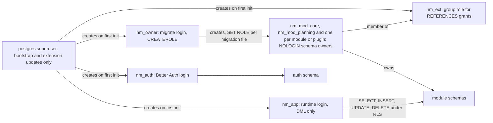
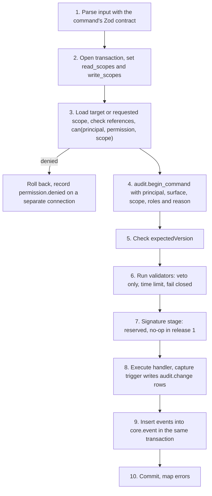
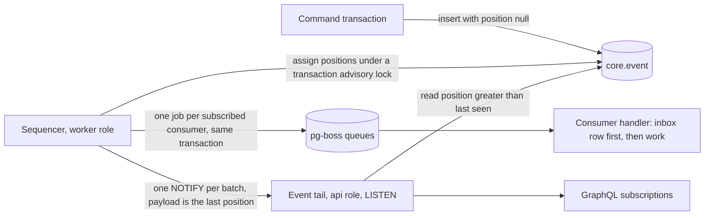

# Data and platform

This document describes the platform layer that every NorthMES module builds on: the database and its roles, data access and migrations, tenancy and row-level security, the command pipeline that every write passes through, identity and principals, the audit trail, events and jobs, settings, secrets, units, file storage and the health checks each module contributes. It states the rules a coding agent follows when it adds a table, a command or a job, the tests that prove each rule, and the questions that are still open. Each decision links to its ADR in [docs/adr](../adr/README.md), and the terms come from [GLOSSARY.md](../../GLOSSARY.md).

## Decisions in this document

| Topic | ADR | Status | Still to confirm |
|---|---|---|---|
| Module-owned schemas, process roles | [0002](../adr/0002-modular-monolith-with-module-owned-schemas-and-process-roles.md) | accepted | none |
| Database image | [0005](../adr/0005-postgres-18-official-image-with-pgbackrest-timescaledb-deferred.md) | accepted | maintainer (the pgBackRest source fallback until PGDG publishes 2.59.3) |
| Kysely, migrations, roles, keys and versions | [0006](../adr/0006-kysely-sql-first-migrations-and-the-northmes-migration-runner.md) | proposed | none |
| Tenancy and the scope tree | [0007](../adr/0007-tenancy-company-plants-and-the-scope-tree.md) | accepted | product owner (customer order line scope); maintainer (one plant at a time) |
| Row-level security | [0008](../adr/0008-row-level-security-with-transaction-local-scopes.md) | proposed | none |
| Code uniqueness and cross-scope references | [0009](../adr/0009-code-uniqueness-per-scope-with-an-exclusion-constraint.md) | proposed | product owner (case-insensitive codes, archived codes, level of operation tools) |
| Identity, roles and permissions | [0010](../adr/0010-identity-with-better-auth-roles-and-permissions-in-core-tables.md) | accepted | product owner (who edits and assigns roles); maintainer (operator placeholder email) |
| Companies created by the CLI, plant creation and setup, plant slugs unique per installation | [0066](../adr/0066-companies-created-by-the-cli-plant-slugs-unique-per-installation-admin-pages-at-admin-and-a-setup-wizard-before-a-plant-opens.md) | proposed | maintainer (the /admin path; the ledger estimate; installation settings by CLI; the company admin role holding every installed permission) |
| Principals, credentials, same-origin rules | [0011](../adr/0011-principals-credentials-and-same-origin-rules.md) | proposed | none |
| Commands as the single write path | [0012](../adr/0012-commands-as-the-single-write-path.md) | proposed | none |
| Audit trail | [0013](../adr/0013-audit-trail-written-in-the-command-transaction.md) | accepted | maintainer (lifecycle classes; tool results as exports); lawyer (retention, erasure) |
| Outbox, event log and jobs | [0014](../adr/0014-outbox-event-log-and-pg-boss-jobs.md) | proposed | none |
| Zod contracts for inputs | [0017](../adr/0017-zod-contracts-as-the-single-source-for-inputs.md) | proposed | none |
| Settings, master-data kit, generators | [0022](../adr/0022-shared-building-blocks-packages-the-master-data-kit-settings-and-generators.md) | accepted | none |
| SI units and the unit catalog | [0023](../adr/0023-si-units-with-a-northmes-unit-catalog.md) | accepted | product owner (pieces per hour) |
| Time storage and driver parsers | [0024](../adr/0024-time-utc-instants-plant-wall-clock-temporal-and-the-clamp-resolver.md) | proposed | none |
| Health endpoints | [0043](../adr/0043-health-endpoints-graceful-shutdown-and-the-system-health-page.md) | accepted | none |
| Secrets and the installation key | [0047](../adr/0047-secrets-and-the-installation-key.md) | proposed | pilot IT (escrow location) |
| Regulated readiness rules | [0051](../adr/0051-regulated-readiness-no-regret-rules.md) | accepted | lawyer (signature path, CRA role); product owner (regulated profile switch) |
| Translations column | [0053](../adr/0053-translation-english-first-general-translation-later.md) | accepted | none |
| File storage port (later) | [0054](../adr/0054-file-storage-port-with-a-postgres-driver.md) | proposed | none |
| Time-series storage port (later) | [0059](../adr/0059-time-series-storage-port-with-an-open-default-backend.md) | proposed | maintainer (no TimescaleDB backend from the project); product owner (raw pulse retention) |
| Presentation settings, formatters, machine-readable output | [0061](../adr/0061-presentation-settings-for-dates-clocks-and-numbers-with-one-pinned-locale.md) | accepted | none |
| Measured input limits after the contract parse | [0062](../adr/0062-web-form-contracts-url-view-state-and-module-link-manifests.md) | accepted | none |

Related plan documents: [02-architecture.md](02-architecture.md) (process roles and boot), [03-modules-and-extensibility.md](03-modules-and-extensibility.md) (module packages and manifests), [05-graphql-and-apis.md](05-graphql-and-apis.md) (error model, lists, subscriptions), [11-quality-and-testing.md](11-quality-and-testing.md) (test harness), [12-operations-and-security.md](12-operations-and-security.md) (Compose, backups, upgrades), [15-regulated-readiness.md](15-regulated-readiness.md).

## Database server and image

NorthMES runs on PostgreSQL 18. The pilot image is built from the official Debian-based `postgres:18` image, pinned by digest, with pgBackRest 2.59.3 or later from the PGDG repository added. It is published as `ghcr.io/northmes/postgres`. See [ADR 0005](../adr/0005-postgres-18-official-image-with-pgbackrest-timescaledb-deferred.md). On 2026-10-05 PGDG carried pgBackRest 2.59.2 at most; until it publishes 2.59.3, the image builds 2.59.3 from the upstream release tag, as ADR 0005 states, and never ships an older version.

| Item | Rule |
|---|---|
| Image digest | One file, `infra/pg-image.json`, holds the digest. Compose, Testcontainers and the offline bundle job read it. A repository lint fails when a Compose file, Dockerfile or test names any other Postgres image. |
| TimescaleDB | Not part of the plan. Release 1 uses no TimescaleDB feature, and Data collection stores machine data in plain Postgres behind the time-series storage port ([ADR 0059](../adr/0059-time-series-storage-port-with-an-open-default-backend.md)). The official `PGDATA` path and uid stay unchanged for the reasons ADR 0005 gives. |
| Locale | The first init sets `POSTGRES_INITDB_ARGS='--locale-provider=builtin --builtin-locale=C.UTF-8'`. Text indexes then never depend on libc or ICU versions. Screens that sort names for people use an explicit ICU collation. |
| Server options | The db command adds `-c wal_compression=zstd`. The db service has a `mem_limit`. |
| PgBouncer | Not used in the pilot. Code stays PgBouncer-safe (see [PgBouncer-safe rules](#pgbouncer-safe-rules)). |

Required image tests:

- The `timescaledb` extension does not exist.
- `pg_database.datlocprovider` is `b` for the NorthMES database.
- `pgbackrest version` reports 2.59.3 or later, and `pgbackrest check` passes after install.
- `pg_stat_archiver.failed_count` is 0 after `pg_switch_wal()`.
- The test records the uid the db process runs as (install uses it for secret file ownership).

### Postgres 18 behaviour that table authors must know

- `uuidv7()` is built in. Primary keys default to it.
- Generated columns are virtual by default in Postgres 18, and a virtual generated column cannot be indexed. Every generated column used in an index or a constraint says `STORED` (for example `code_key`).
- `RETURNING` can read `OLD` and `NEW`, which version checks can use.
- MD5 password authentication is deprecated. Roles use SCRAM, the default.

## Database roles and bootstrap

Each module owns one Postgres schema and never reads or writes another module's tables ([ADR 0002](../adr/0002-modular-monolith-with-module-owned-schemas-and-process-roles.md)). The database roles enforce that ownership at migration time, and row-level security enforces scope at run time. See [ADR 0006](../adr/0006-kysely-sql-first-migrations-and-the-northmes-migration-runner.md).



| Role | Login | Rights | Used by |
|---|---|---|---|
| `postgres` (superuser) | yes, own secret `POSTGRES_PASSWORD_FILE` | everything | First init, `northmes db bootstrap`, extension updates in `upgrade.sh` over the local socket. Never by the app. |
| `nm_owner` | yes | `CREATEROLE`, `CREATE` on the database. Creates the module owner roles and grants itself `SET TRUE, INHERIT FALSE` on each. | The one-off `migrate` service only. It is the only login that may `SET ROLE` to a module owner role. |
| `nm_mod_<sql name>` | no | Owns exactly one schema. Member of `nm_ext`. | Each module's and plugin's migration files, through `SET LOCAL ROLE`. The name derives from the module id: `production-start` gives `production_start` and `nm_mod_production_start`. |
| `nm_ext` | no | Receives `grant references (id) on <table> to nm_ext` from owners that allow foreign keys into their tables. Has `USAGE` on module schemas. | Cross-module foreign keys. |
| `nm_app` | yes | `SELECT`, `INSERT`, `UPDATE`, `DELETE` only. No ownership, no `BYPASSRLS`, no `TRUNCATE`. | Every `api`, `worker` and `all` process. |
| `nm_auth` | yes | Rights on the `auth` schema only. | Better Auth's own pool. |
| Audit module owner role | no | Owns the `audit` schema and the definer functions there. | Audit migrations, partition and retention functions. |

Rules:

- A lint fails on any `TRUNCATE` grant in a migration.
- `nm_app` reads user names only through the `security_invoker` view `core.user_directory(id, name, username, banned)`. It has no access to `auth.account` or `auth.session`, so SQL injection as `nm_app` cannot read password hashes or sessions.
- Every role gets `ALTER ROLE ... SET timezone = 'UTC'`. The zone is pinned per role, not with `ALTER DATABASE`, because a database cloned from a template loses database-level settings.
- `nm_app` gets role-level `statement_timeout`, `idle_in_transaction_session_timeout` and `transaction_timeout` through `ALTER ROLE`, never through session `SET`. The values are not decided.
- `northmes migrate` grants `MAINTAIN` on the pg-boss tables to `nm_app` (pg-boss runs `REINDEX` in maintenance), or pg-boss runs with `reindex: false`. Queues are created inside `northmes migrate`, never at run time and never with `partition: true`, which runs DDL.
- The audit schema is owned by the audit module's NOLOGIN owner role, not by `nm_owner`, so the everyday migration path cannot alter audit tables.

### Bootstrap

An init script in `/docker-entrypoint-initdb.d` creates `nm_owner`, `nm_app`, `nm_auth` and `nm_ext` on first init, reading passwords from `_FILE` secrets. On a database server that already exists, `northmes db bootstrap` does the same once as the superuser. `btree_gist` is a trusted extension, so `nm_owner` creates it without a superuser.

`install.sh` runs in this order:

1. Write the secret files with `install -m 0440`, owned by root and by the group of the uid the db and app processes run as.
2. Chown the backup and spool directories to the db uid.
3. Start db.
4. `pgbackrest stanza-create`, then `pgbackrest check`, then a full backup.
5. Run migrate, then start the app.

`upgrade.sh` runs extension updates as `docker compose exec -T db psql -U postgres` for every extension whose `extversion` is older than its `default_version`. The full upgrade and rollback order is in [12-operations-and-security.md](12-operations-and-security.md) and [ADR 0045](../adr/0045-backups-restore-drills-upgrades-and-rollback.md).

### Secrets per Compose service

| Service | Secrets it receives |
|---|---|
| `app` | `db_app_password`, `db_auth_password`, `auth_secret`, `installation_key`, `customer_ca` |
| `migrate` | `db_owner_password` |
| `db` | the superuser password |

In role `all`, every plugin's server code runs in the app process. Keeping `db_owner_password` out of the app container means a plugin bug or a remote code execution cannot connect as the owner and drop audit partitions. A contract test parses `docker compose config --format json` and asserts that the `app` service has no `db_owner_password`; the nightly Compose job asserts that `/run/secrets/db_owner_password` does not exist inside `app`. See [ADR 0047](../adr/0047-secrets-and-the-installation-key.md).

Required tests:

- As `nm_app`, `SET ROLE` to the audit owner role fails.
- As `nm_app`, `DROP TABLE` of an audit partition fails with "must be owner".
- As `nm_app`, `select` from `auth.account` fails, and `select` from `core.user_directory` works.
- A plugin migration running as its owner role that tries `ALTER TABLE core.article` fails with "must be owner"; `CREATE TABLE core.x` fails with "permission denied for schema core".

## Data access with Kysely

NorthMES uses Kysely 0.29 with the `pg` 8.23 driver. Drizzle and Prisma are not used. Migrations are SQL files, and TypeScript types are generated from the migrated database, so the database is the single source of schema truth: row-level security policies, exclusion constraints, stored generated columns, grants and triggers are all plain SQL that a reviewer can read. See [ADR 0006](../adr/0006-kysely-sql-first-migrations-and-the-northmes-migration-runner.md).

### Generated types

- `kysely-codegen` generates one `DB` type per module (`--include-pattern "planning.*"`). A module's code imports only its own `DB` type, so reading another module's table is a type error.
- `pnpm db:types` starts a Testcontainers database from the pinned image, migrates it and runs the generator. `pnpm db:types --verify` fails on drift and on any generated `Date` type.
- `pnpm gen` regenerates database types only when the hash of the migration files changed, because the generator needs a migrated database.

### Driver parsers and value handling

| Postgres type | OID (array OID) | Arrives as | Generated type | Repository converts to |
|---|---|---|---|---|
| `timestamptz` | 1184 (1185) | string | `InstantString` | `Temporal.Instant` |
| `timestamp` | 1114 (1115) | string | `PlainDateTimeString` | `Temporal.PlainDateTime` |
| `date` | 1082 (1182) | string | `PlainDateString` | `Temporal.PlainDate` |
| `time` | 1083 | string (pg default) | `PlainTimeString` | `Temporal.PlainTime` |
| `numeric` | 1700 | string | string | a decimal type; never `parseFloat` before arithmetic |
| `int8` | 20 | string | string | per use |

Rules:

- String parsers are registered for OIDs 1082, 1114 and 1184 and their arrays 1115, 1182 and 1185. OIDs 1083, 1266 and 1270 are left alone. Range types stay text.
- One Kysely plugin, active in every environment, serializes Temporal parameters with `toString()` and throws on `Date` parameters.
- Queries never select `numeric[]`: the driver's array parser turns it into floats and loses digits. Aggregate in SQL, or use `array_agg(x::text)`.
- Time-of-day columns carry `CHECK (end_time < '24:00')`. `timestamptz` columns carry `CHECK (isfinite(col))`.
- The server decimal library is not chosen yet (see [open questions](#open-questions)).

### Query rules

- A lint bans `sql.raw`, `sql.lit`, and `sql.ref` or `sql.id` with non-literal input. SQL running as `nm_app` can call `set_config` and widen its own scope, so row-level security is not a defence against SQL injection; the lint is.
- Every scoped query runs inside a transaction that starts with the scope `set_config` calls (see [Row-level security](#row-level-security)). A query outside such a transaction reads zero rows and cannot insert.
- Normalized search keys are `STORED` generated columns with a plain index (for example `code_key = lower(code)`). Under row-level security, only leakproof functions can run before the policy filter. `lower()`, `LIKE`, `ILIKE`, enum equality, `jsonb` containment and array overlap are not leakproof, so a filter on `lower(code)` ignores its expression index and scans every visible row.
- Status columns are `text` with a `CHECK` constraint or a lookup table, not Postgres enums (enum equality is not leakproof).
- Every scoped table has an index that leads with `scope_id`.
- Views are created `with (security_invoker = true)`. A view without it runs as its owner and bypasses row-level security. Materialized views have no row-level security and are not used for scoped data.
- `SECURITY DEFINER` functions are allowed only on an allowlist, each with a pinned `search_path`. Each one is an RLS bypass and gets a review.

The SDK's `/data` helpers (`@northmes/sdk/data`) wrap these rules: `get`, `getMany` through a request loader, `list` with keyset paging, search and declared filters, `update` with the version check, `archive`, `restore` and `scopeOf`. Database errors map through the SDK's `toDomainError`, which the pipeline's error step calls (see [Commands](#commands-the-single-write-path)).

### Connections

| Connection | Role | Purpose |
|---|---|---|
| Application pool (about 20 connections in role `all`) | `nm_app` | Requests, commands, jobs |
| Better Auth pool | `nm_auth` | Better Auth's own queries, `schemaName: "auth"` |
| Listener (`DATABASE_LISTEN_URL`) | `nm_app` | One direct connection per process for `LISTEN` |
| Migration connection | `nm_owner` | `northmes migrate`, holding the migration advisory lock |

### PgBouncer-safe rules

The pilot runs no PgBouncer, but code follows these rules from the start so that a later split into `api` and `worker` replicas behind PgBouncer needs no rewrite. See [ADR 0014](../adr/0014-outbox-event-log-and-pg-boss-jobs.md).

1. Every scoped query runs inside a transaction that starts with `set_config(..., true)`.
2. No session `SET`. Names are schema-qualified. Role defaults come from `ALTER ROLE`.
3. Request and job code uses only transaction-level advisory locks (`pg_advisory_xact_lock`, `pg_try_advisory_xact_lock`) keyed with `hashtextextended()`. Session advisory locks appear only in the migration runner, on its direct connection.
4. `LISTEN` uses one direct connection per process. `NOTIFY` works through any connection.
5. Cluster-wide schedules use pg-boss cron and singleton jobs, never an advisory-lock leader.
6. Long computations (autoplan) run outside a transaction and apply in one short transaction with version checks.
7. `NOTIFY` stays out of business transactions; only the event sequencer sends it, once per batch.

## Migrations and the migration runner

### Files

- Each module keeps its migrations in `migrations/` next to its manifest. File names are `migrations/<UTC yyyymmddHHMMss>_<slug>.sql`.
- Migrations are forward-only. Each file carries an `expand` or `contract` marker. The marker drives the migration lint, and any contract migration bumps the release's schema compatibility number (see [Upgrades](#upgrade-compatibility)).
- Better Auth's tables are SQL that Better Auth's generator produces, committed into core's migrations and applied by `northmes migrate`. `auth migrate` never runs in production. A Testcontainers drift test applies all migrations and asserts that Better Auth's migration check finds nothing left to create.
- The template writes row-level security policies and triggers as inline SQL in each file. It never calls a shared SQL helper function: a helper replaced in a later core migration would make a fresh database and an upgraded one differ, because the runner applies core first. The catalog lint checks that the inline SQL has the expected shape.

### `pnpm gen:migration`

`pnpm gen:migration <module> <slug>` exists from the walking skeleton. It writes a new file from the table template:

- a schema-qualified table with `id uuid primary key default uuidv7()`, `scope_id`, `version`, and, for registers, `company_id`, `scope_span`, `code`, `code_key`, `archived_at` and the provenance columns;
- `enable row level security` and the four split policies (no `FOR ALL`, no `FORCE`);
- grants of `SELECT, INSERT, UPDATE, DELETE` to `nm_app` (or fewer for record-class tables, see [Lifecycle classes](#lifecycle-classes));
- the version and provenance trigger;
- the audit capture trigger with its skip and redact arguments, set `ENABLE ALWAYS`.

A plugin foreign key that fails with SQLSTATE 42501 on `REFERENCES` gets the message: "core does not allow references to core.customer; store the id without a foreign key or ask core to declare it". The other generators (module, entity, command) are described in [03-modules-and-extensibility.md](03-modules-and-extensibility.md) and [ADR 0022](../adr/0022-shared-building-blocks-packages-the-master-data-kit-settings-and-generators.md).

### What `northmes migrate` does

1. Runs boot steps 1 to 10 of the boot sequence in [02-architecture.md](02-architecture.md) (config, the resolve hook, manifests, catalog checks, the migration check, server imports, Nest create, the isolation check, static mounts, init) without listening. In this mode the migration check of step 5 lists pending files instead of failing on them. `migrate --check` stops here, before the first file. Plain `migrate` runs the same steps first.
2. Takes `pg_advisory_lock` on a dedicated direct connection with a `lock_timeout`.
3. Orders modules topologically by `dependsOn`, core first.
4. For each module, reads `migrations/*.sql` in lexical order. It refuses two files with the same timestamp prefix in one module.
5. Fails on a changed checksum of an applied file. Applied files are tracked in `northmes_meta.migration(module, name, sha256, applied_at)` with primary key `(module, name)`.
6. Before a module's pending files, records the foreign keys that point into that module's schema from other schemas (disabled plugins included). After each file it compares and raises when one has disappeared.
7. Runs each file in its own transaction with `SET LOCAL ROLE nm_mod_<sql name>`.
8. Re-applies repeatable files (views, SQL functions) whose hash changed, after the versioned files.
9. Runs pg-boss's schema migration and creates the queues. Every role starts pg-boss with `migrate: false`.
10. Runs the permission catalog and default-role sync from the manifests (not at every boot).
11. Calls `audit.ensure_partitions(...)`.
12. Checks every module and plugin table for the audit capture trigger and its arguments, and runs the column classification check (see [Checks at migrate and boot](#checks-at-migrate-and-boot)). Offenders are listed in one message, and migrate exits 1.

`northmes migrate` opens its own audit context for data migrations and for the permission sync. Which surface value that context records (`cli` or a separate migration value) is not decided.

### Migration lint

The lint rejects these in a file without the `contract` marker: `cascade`, `drop table`, dropping a constraint on a table that other schemas reference, and changing a key column's type. Plugin foreign keys into other modules use `ON DELETE CASCADE` or `ON DELETE SET NULL`, as the owner's grant policy states, so a removed plugin cannot block deletes in the owner's tables. System health lists leftover schemas of modules that are no longer installed. `northmes plugin purge <id>` comes later.

### Upgrade compatibility

Each release carries one schema compatibility number in `northmes_meta`. A contract migration, a pg-boss schema change, a Better Auth schema change or an extension update bumps it. Boot and readiness accept a database that is newer than the image as long as the number does not exceed the image's maximum; System health then shows "schema ahead by N expand migrations". An older image's `migrate` applies nothing and exits 0 with a warning when the database is compatible. The full upgrade and rollback procedure is in [12-operations-and-security.md](12-operations-and-security.md).

Required tests:

- Two files with the same timestamp prefix in one module make `migrate` exit 1.
- Editing an applied file makes `migrate` exit 1 naming the file.
- A module migration that drops a table referenced by a plugin, without the contract marker, fails the lint; with the marker, the runner raises when the plugin's foreign key disappears.
- `migrate --check` with `DATABASE_URL` pointing at a migrated database exits 0 and applies nothing.

## Tenancy and the scope tree

A Better Auth organization is a company. Plants live in `core.plant`, and each plant's id equals its node id in `core.scope`, the scope tree. The tree has the company as root and plants as children; areas and lines can join later below plants. One installation serves one customer, which may hold several companies. The installation is not a node in the tree, and no role is held at it: the people who run the host create companies with the CLI (see [Companies, plants and setup](#companies-plants-and-setup)). See [ADR 0007](../adr/0007-tenancy-company-plants-and-the-scope-tree.md) and [ADR 0066](../adr/0066-companies-created-by-the-cli-plant-slugs-unique-per-installation-admin-pages-at-admin-and-a-setup-wizard-before-a-plant-opens.md).

```sql
-- core.scope (shape; the core migration is the source)
create table core.scope (
  id         uuid primary key default uuidv7(),
  company_id uuid not null,
  parent_id  uuid references core.scope (id),
  kind       text not null check (kind in ('company', 'plant')),
  span       int8range not null,
  unique (id, company_id, span)
);
```

Each scope node has an integer range, its span. The company's span is unbounded `(,)`. Plant number k gets `[k << 32, (k + 1) << 32)`, which leaves room for areas and lines inside a plant. Spans drive the code uniqueness constraint and the cross-scope reference check below.

### Where rows live

Each entity type declares the scope levels it allows.

| Entity | Scope level |
|---|---|
| Equipment | plant |
| Equipment groups | company or plant |
| Tools | company or plant (the level of operation tools is open) |
| Articles, routings | company |
| Customers | company |
| Customer order header | company |
| Customer order line | the delivering plant when known, otherwise the company |
| Production orders and their operations and job orders | plant |
| Production order demand (link from a production order to a customer order line) | the production order's plant |

Customer order lines follow the working proposal in [ADR 0007](../adr/0007-tenancy-company-plants-and-the-scope-tree.md), which the product owner confirms before the customer order migration: setting or changing a line's delivering plant is its own command and needs permission at company scope; production order demand may reference only same-plant or company lines; supplying another plant's line is rejected in release 1. A child production order is always created in its parent's plant.

### One plant per request

In release 1 every request from a plant route carries exactly one plant: the route `/$plant/...` and the `x-northmes-plant` header that the Apollo link sends. The plant is never stored on the session, so a planner can keep two plants open in two browser tabs. The URL carries a plant slug that is unique per installation, so a user with plants in several companies keeps `/$plant` URLs, and the server never reads Better Auth's active organization on the session. An unknown slug is `NOT_FOUND`, never a fallback to a default plant. Requests from `/admin` carry no plant; the gateway serves them only when every root field in the operation is one of core's plant-free admin fields ([ADR 0066](../adr/0066-companies-created-by-the-cli-plant-slugs-unique-per-installation-admin-pages-at-admin-and-a-setup-wizard-before-a-plant-opens.md)).

Company mode (`x-northmes-plant: *`, `/_company/<id>/*`) and `core.code_holders` wait for a customer with several plants in use.

The gateway validates `x-northmes-plant` against `core.role_assignment` with the ancestor walk. An unknown or unauthorized plant fails with `FORBIDDEN`, `errorCode` `core.plant_forbidden`, and writes one `permission.denied` security event. A plant whose setup is not complete admits only holders of `core.setup:manage`; any other principal with a role there gets `FORBIDDEN` with `core.plant_not_ready` and no security event (see [Companies, plants and setup](#companies-plants-and-setup)).

### Companies, plants and setup

The installation is one NorthMES deployment: one database, one image version and one customer. It has no node in the scope tree and no roles, so the tree, spans and the code constraint stay as they are. Users get permissions only through roles ([ADR 0066](../adr/0066-companies-created-by-the-cli-plant-slugs-unique-per-installation-admin-pages-at-admin-and-a-setup-wizard-before-a-plant-opens.md)).

- Companies are created only by the CLI on the host, in the one-off migrate container: `northmes company create --name <text> --admin-username <username> [--id <uuidv7>] [--admin-name <text>] [--admin-email <address>] --reason <text> [--json]`. In one command it creates the Better Auth organization on the server (its slug is the company id, and the first admin is its owner member), the company node, the company's `core.setup` row and the first admin's assignment of core's company admin role. A new user gets a temporary password, printed once.
- `northmes company add-admin --company <id> --username <username> ... --reason <text>` gives an existing company another company admin. It is the recovery path when a company has lost every company admin. `northmes company list` prints companies, setup state, plant counts and admin usernames. `northmes admin reset-password` stays. `northmes admin create` is removed.
- The commands never prompt, take no password as a flag, print one JSON object with `--json`, and exit 0 (done), 1 (unexpected error), 2 (usage), 3 (refused) or 4 (company not found). A replay with the same `--id` and the same input creates nothing. A temporary password appears only on standard output, never in a command row, a security event or a log line. Each write is a command with principal type `system`, the seeded system principal `core.cli`, surface `cli`, the company node as scope and the required `--reason`, plus one security event.
- Core's manifest ships the company admin role. The permission sync gives it every installed permission, those of plugins included, so its holder can assign any role and do every setup step (M-61).
- `core.createPlant({ id, companyId, name, slug, timeZone, productionDayStart })` needs `core.plant:create` at the company node. It creates the plant node, the `core.plant` row and the plant's `core.setup` row. A slug that another plant of the installation uses returns `fieldErrors` on `slug` with `core.plant_slug_taken`, and the message names no company. The zone and the production day start can change during setup until the plant's first calendar version exists.
- `core.setup (scope_id, kind, started_at, started_by, completed_at, completed_by, version)` holds one row per company and per plant; `core.setup_step (scope_id, step_key, status, recorded_by, recorded_at, reason, version)` records confirmed and skipped steps. Modules declare their wizard steps in the manifest's `setup` key and register a check `isComplete(scopeId)`. `core.completeSetup` re-runs every required check and opens the plant; for the first plant it also completes the company's row. Both tables bump `core.config_revision`.
- A plant is open when its `core.setup` row has `completed_at`. Until then the plant check admits only holders of `core.setup:manage`, and an open plant never closes again. Connector jobs run outside the plant check, so an import during setup works.
- Installation-wide settings live in `core.installation_setting` and are set only by `northmes installation set <key> <value> --reason <text>` on the host, audited the same way (M-60). Each key arrives with the code that reads it: `outbound.allowedHosts`, `mcp.enabled` and `audit.securityEventRetentionDays` (E05-S13) in release 1, `events.retentionDays` with the event retention cron. The table carries the audit capture trigger.
- The principal resolver and the plant check read `core.plant`, `core.scope`, `core.role_assignment` and `core.setup` before a request has scopes, and every request reads `core.installation_setting`. The task that builds these tables records how row-level security covers each one, with policies on the node id or an allowlist entry with a reason.

## Row-level security

Every module and plugin table has row-level security. The policies read two transaction-local settings that the SDK's transaction helper sets as its first statement. See [ADR 0008](../adr/0008-row-level-security-with-transaction-local-scopes.md).

```sql
select set_config('northmes.read_scopes',  $1, true),
       set_config('northmes.write_scopes', $2, true);
```

### The write set is a subset of the read set

- `read_scopes` holds the company node and the request's plant.
- `write_scopes` is `read_scopes` intersected with the scopes where the ancestor walk finds a role with any write permission. A company-level role therefore yields `{company, active plant}`; a plant planner yields `{active plant}` and can read company rows but not write them.
- `write_scopes` is never derived from a per-command scope in the manifest, because the Pyramid connector writes company rows and plant rows in one transaction.
- Permission per action is still checked in the command pipeline with `can()` at the row's scope. Row-level security is the second line.

### Policy shape

The migration template generates one `FOR SELECT` policy on `read_scopes` and separate `FOR INSERT`, `FOR UPDATE` and `FOR DELETE` policies on `write_scopes`. It never generates `FOR ALL`.

```sql
alter table core.equipment_group enable row level security;

create policy scope_select on core.equipment_group for select to nm_app
  using (scope_id = any ((select nullif(current_setting('northmes.read_scopes', true), ''))::uuid[]));

create policy scope_insert on core.equipment_group for insert to nm_app
  with check (scope_id = any ((select nullif(current_setting('northmes.write_scopes', true), ''))::uuid[]));

create policy scope_update on core.equipment_group for update to nm_app
  using      (scope_id = any ((select nullif(current_setting('northmes.write_scopes', true), ''))::uuid[]))
  with check (scope_id = any ((select nullif(current_setting('northmes.write_scopes', true), ''))::uuid[]));

create policy scope_delete on core.equipment_group for delete to nm_app
  using (scope_id = any ((select nullif(current_setting('northmes.write_scopes', true), ''))::uuid[]));
```

Why each detail is there:

- `FOR ALL` also applies to `SELECT`, and permissive policies are OR-ed. A `FOR ALL` policy on `write_scopes` makes rows in the write set readable whatever the read set says. On Postgres 18.4 this let a user who read at plant A and held a write role at plant B read and update B's rows under a plant A request.
- `nullif(..., '')` is needed because, after a transaction that set the variable commits, `current_setting(..., true)` returns an empty string on that pooled connection, not NULL.
- The cast to `uuid[]` sits outside the scalar subquery. Inside, Postgres reads `any (subquery)` and fails with `operator does not exist: uuid = uuid[]`.
- The scalar subquery makes Postgres read the setting once per statement (an `InitPlan`), and the `scope_id` index stays usable.
- With no scope set, reads return zero rows and inserts fail. Code that forgets the transaction helper fails closed.

### Other rules

- Child tables carry `scope_id` copied from their parent. A plugin table keyed only by `production_order_id` would otherwise return plant B's rows to a plant A reader.
- Every partition of a partitioned table gets `ENABLE ROW LEVEL SECURITY` and its parent's policies in the transaction that creates it, and no grants to `nm_app` or a BI login role. Postgres carries neither over from the parent, and a query that names a partition applies only that partition's own policies. Queries go through the parent, which applies the parent's policies to every partition's rows.
- The table owner is the module's `nm_mod_<sql name>` role. Release 1 does not set `FORCE ROW LEVEL SECURITY`. With `FORCE`, data migrations running as the owner role would see zero rows unless they set scopes. The owner password never reaches the app container, so the owner bypass is limited to migrations.
- Foreign-key and unique checks bypass row-level security by design. The code uniqueness error hides the other plant's key (see below).
- Tables without a business scope (pg-boss tables, Better Auth's `auth` schema) are outside module schemas. Inside module schemas, a table without policies needs an allowlist entry with a reason. Whether `core.event` and `core.inbox`, which the sequencer and the event tail read across all scopes, carry policies or an allowlist entry is decided in the outbox task.

### Catalog lint

The catalog lint runs as an integration test from `@northmes/testing` against a migrated database, and the same checks run at the end of `northmes migrate` and at boot. It fails when:

- any `pg_policies` row in a module or plugin schema has `cmd = 'ALL'`;
- a table in a module or plugin schema lacks `relrowsecurity` or has no policy, and has no allowlist entry with a reason; partitioned parents and partitions count as tables;
- a partition's policies differ from its parent's, a partition grants any privilege to `nm_app` or a BI login role, or a schema that holds partitions grants those roles `USAGE`;
- a view lacks `security_invoker = true` and is not allowlisted;
- a `SECURITY DEFINER` function is not on the definer allowlist or has no pinned `search_path`;
- `nm_app` owns anything or has `BYPASSRLS`.

Required tests (as `nm_app`, rows at plant A and plant B):

- A viewer at A who is an operator at B, with header A, gets `null` for B's job order by id, and the list returns only A rows.
- A planner at A who is an operator at B tries to move B's job order: `NOT_FOUND`, and the row keeps its equipment and version.
- A company planner reads at A and at B; a planner with a role only at A never sees a B `scope_id`.
- A migration that creates a `FOR ALL` policy fails the lint, naming the table.
- A plugin table without `scope_id` and without an allowlist entry fails the lint.
- A new partition without row-level security, or without one of its parent's policies, fails the lint and names the partition.
- A query run outside the transaction helper returns zero rows, and an insert fails.

## Code uniqueness per scope

Codes are unique per scope. Two plants may both have tool `T-100`. The constraint refuses a plant code that a company row already uses, a company code that a plant row already uses, and a move of a plant row to company level while another plant holds the code. The rule is an exclusion constraint over scope spans, generated by the register migration template. The trigger with an advisory lock from earlier designs is not used. See [ADR 0009](../adr/0009-code-uniqueness-per-scope-with-an-exclusion-constraint.md).

```sql
create table core.equipment_group (
  id         uuid primary key default uuidv7(),
  company_id uuid not null,
  scope_id   uuid not null,
  scope_span int8range not null,
  code       text not null check (code = btrim(code) and length(code) between 1 and 32),
  code_key   text generated always as (lower(code)) stored,
  -- ... fields, version, archived_at, provenance
  foreign key (scope_id, company_id, scope_span)
    references core.scope (id, company_id, span) on update cascade,
  constraint equipment_group_code_excl
    exclude using gist (company_id with =, code_key with =, scope_span with &&)
);
create index equipment_group_scope_code_idx on core.equipment_group (scope_id, code_key);
```

- The company span overlaps every plant span, and sibling plants never overlap, so the `&&` operator expresses the whole rule. The composite foreign key rejects a wrong span for a scope.
- Under row-level security, the constraint error detail hides the conflicting key, so nothing about plant B leaks to a plant A user.
- SQLSTATE 23P01 maps to the code-clash error `core.code_taken`.
- No advisory lock, no trigger and no RLS bypass is involved. Two concurrent inserts serialize on the constraint: the second waits for the first and then fails.

Working defaults until the product owner answers:

- Codes compare case-insensitively through the stored `code_key`.
- An archived row keeps its code, so the constraint covers archived rows.
- Areas and lines, when they arrive, follow the same ancestor and descendant rule; siblings do not clash.

### References only to the same scope or an ancestor

A row may reference a row at its own scope or at an ancestor scope, never at a sibling or a descendant. The SDK reference resolver checks this in the command pipeline. Tables that can hold cross-level references also get a declarative check:

| Table | Declarative span check |
|---|---|
| Operation tools | yes |
| Operation equipment | yes |
| Job order equipment | yes |
| Production order demand | yes |

The check adds a `ref_span` column, a composite foreign key `(ref_id, ref_span)` with `ON UPDATE CASCADE`, and `CHECK (scope_span <@ ref_span)`. The owner of the referenced table adds `unique (id, scope_span)` and grants references on it to `nm_ext`. SQLSTATE 23514 on these constraints maps to `core.crossScopeReference`.

Required tests (insert matrix on the four tables): company row to plant row fails with 23514; plant to sibling plant fails; plant to same plant passes; plant to company passes; moving a company tool to plant A while plant B references it fails; moving a job order onto equipment of another plant returns `core.crossScopeReference`.

## Keys, versions, archive and provenance

See [ADR 0006](../adr/0006-kysely-sql-first-migrations-and-the-northmes-migration-runner.md).

| Concern | Rule |
|---|---|
| Primary keys | `uuid primary key default uuidv7()`. Ids are never reused. Every audited table has a uuid `id`, join tables included. |
| Client-generated ids | Create commands accept a client-generated uuidv7 and insert with `on conflict do nothing`, so a retry after a timeout or restart creates nothing twice. |
| Optimistic concurrency | Every mutable row has `version integer not null default 1`. A `BEFORE UPDATE` trigger bumps it, so SQL-level imports cannot forget it. Commands take `expectedVersion`. `xmin` is not used. |
| Version conflict | The update runs `... where id = $1 and version = $2`. Zero rows after the permission check means a version conflict (`core.version_conflict`) or a missing row (`core.not_found`). |
| Archive | Business records are archived (`archived_at`), never hard-deleted. Lists hide archived rows unless `includeArchived: true`. Reads by id still return them. Writes to an archived row fail with `core.archived`. Archive never cascades and never nulls a reference. |
| Provenance | Rows carry `created_by` and `updated_by` ids, never names. The row trigger from the template sets them from the transaction's principal: the person acted for when present, otherwise the principal. No handler writes them. |
| Business quantities | Article quantities (order, good, scrap, stock, bill of materials) are `numeric(18,6)` in the article's stock unit. |
| Translations | Translatable master data has a `translations jsonb not null default '[]'` column from its first migration ([ADR 0053](../adr/0053-translation-english-first-general-translation-later.md)). |
| ERP links | Importable rows carry `source`, `external_ref`, `external_data` and `do_not_update`. |
| Imports | Imports update only rows whose own columns differ (`update ... where (columns) is distinct from (new values)`). An ERP note or a material line then does not bump every job order's version, and unchanged rows write no audit diffs. |

Required tests: the version trigger bumps `version` on a plain SQL update; a stale `expectedVersion` returns `core.version_conflict` and leaves the row unchanged; a create retried with the same client id returns the first row and writes one audit command; an import of an unchanged order writes no row update.

## Commands: the single write path

Every write is a command. Every GraphQL Mutation field maps to a registered command handler, and boot exits when one does not. Jobs, the Pyramid connector, the operator station, MCP proposal tools and the CLI all run commands through the same pipeline. A command's static facts (Zod input schema, permission, `validatable` flag, reason and signature requirements, error codes) live in the module's MIT contracts package; the handler lives in the module's server code. See [ADR 0012](../adr/0012-commands-as-the-single-write-path.md) and [ADR 0017](../adr/0017-zod-contracts-as-the-single-source-for-inputs.md).



| Step | Rule |
|---|---|
| 1. Parse | A parse failure is `BAD_USER_INPUT` with `fieldErrors`. Measured values arrive as `{ value, unit }`, and the contract validates them in the unit the person typed. After the parse, the pipeline converts them to canonical SI and then checks their limits, so limits compare canonical values (see [Units](#units-and-the-unit-catalog)). |
| 2. Scopes | The transaction helper sets both scope settings as its first statement. |
| 3. Permission | The pipeline loads the target and calls `can(principal, permission, target.scope_id)`, or uses the requested scope for creates. The reference resolver checks that every referenced row is at the same scope or an ancestor. The field guard on the GraphQL type stays a coarse gate. |
| 4. Audit context | One transaction is one audit command. Nested commands share the outer command's audit id. |
| Reason | Every mutation takes one shared optional reason input, so the GraphQL contract stays fixed when a later compliance profile makes reasons required. Release 1 requires a reason only where a contract says so (lock breaks, changed prefilled quantities). |
| 5. Version | A stale version fails with `core.version_conflict`. |
| 6. Validators | Validators from dependent modules and plugins run only on commands declared `validatable`, in dependency order then by name. They can only veto; a veto returns `core.command_rejected`. A validator that times out or throws also rejects the command, and a throw is masked as an unexpected error. |
| 7. Signature | The stage and the `signature` manifest key are reserved so that a later re-authentication binds to one command id. Nothing is built in release 1. |
| 8. Execute | Writes go through the `/data` helpers. |
| 9. Events | Events carry the entity's new version and the audit command id as causation id. |
| 10. Errors | `DomainError` codes pass through. `toDomainError` from the SDK maps SQLSTATE 42501 to `FORBIDDEN`, 23P01 and 23505 on a code to `core.code_taken` and 23514 on a span check to `core.crossScopeReference`; the jobs wrapper, the tool runner and the exception filter call the same function. Unknown errors are masked as "Unexpected error." with a correlation id. The full error model is in [05-graphql-and-apis.md](05-graphql-and-apis.md). |

A denied command rolls back, so its command row disappears; the denial is a security event. Validation errors are not audited.

Seeds and test fixtures write through `db.command({ principal, scopes, reason }, fn)` from `@northmes/testing` with surface `cli`. A raw insert outside a command fails, and the trigger message names the fix: "in tests use db.command(...), in code use the command pipeline".

Required tests (contract suite for the pipeline in `@northmes/testing`): a Mutation field without a handler makes boot exit naming it; a command denied at the target's scope leaves no command row and one security event; a validator that sleeps past its limit rejects the command and the handler does not run; a successful command writes exactly one `audit.command` row whose id equals the `causation_id` of its events.

## Identity, roles and permissions

Better Auth handles identity and sessions. NorthMES core tables hold roles, assignments, the permission catalog and credential bindings, because Better Auth has no scope below the organization. See [ADR 0010](../adr/0010-identity-with-better-auth-roles-and-permissions-in-core-tables.md).

### Better Auth configuration

- `better-auth` 1.7.x, pinned exactly. Upgrades are deliberate: read the release notes, generate the schema migration, run the drift test.
- Better Auth keeps users, accounts, sessions, organization membership (`member.role` is only `owner` or `member`) and API key secrets.
- Enabled plugins: username (email or username plus password), organization and admin (both only for server-side `auth.api` calls from NorthMES commands and the CLI; every `/organization/*` and `/admin/*` HTTP path is in `disabledPaths`, so no signed-in user creates an organization over HTTP, [ADR 0066](../adr/0066-companies-created-by-the-cli-plant-slugs-unique-per-installation-admin-pages-at-admin-and-a-setup-wizard-before-a-plant-opens.md)) and api-key (station keys and MCP personal access tokens). Dynamic access control and teams are off. Any other plugin is reviewed against its advisory history before it is enabled.
- Built-in Kysely adapter with its own pool as `nm_auth` and `schemaName: "auth"`. Ids are uuids (`advanced.database.generateId: "uuid"`).
- Database sessions with a cookie cache whose `maxAge` is at most 60 seconds. Rate-limit storage in the database. Sign-up disabled. `immutableUsername: true`. Session cookie `SameSite=Strict`.
- Boot refuses to start when `BETTER_AUTH_TELEMETRY` is set. The `testUtils` entry point is not in the production image.
- Single sign-on through Microsoft Entra ID waits for a customer that asks.

### Core tables

| Table | Holds |
|---|---|
| `core.scope` | The scope tree |
| `core.plant` | Plants; `id` equals the scope node id; `slug` is unique per installation |
| `core.permission` | The permission catalog from installed manifests: key, module id, installed flag |
| `core.role` | Organization, key, name, permissions, origin (`module` default role or `custom`), module id |
| `core.role_assignment` | `(user, scope node, role)` |
| `core.setup`, `core.setup_step` | Setup state per company and plant node, and the confirmed and skipped wizard steps ([ADR 0066](../adr/0066-companies-created-by-the-cli-plant-slugs-unique-per-installation-admin-pages-at-admin-and-a-setup-wizard-before-a-plant-opens.md)) |
| `core.installation_setting` | `(key, value, version)`: installation-wide settings that only `northmes installation set` writes ([ADR 0066](../adr/0066-companies-created-by-the-cli-plant-slugs-unique-per-installation-admin-pages-at-admin-and-a-setup-wizard-before-a-plant-opens.md)) |
| `core.credential` | Credential bindings: kind, Better Auth key or client id, scope, created by, revoked at. Audit rows reference this table, not the Better Auth key row, because expired keys are deleted |
| `core.badge_assignment` | `(user_id, badge_hmac, valid_from, valid_to)`; `badge_hmac` declared redact, computed with the `badge-v1` purpose key, key version stored |
| `core.retired_username` | HMAC of each retired username; user creation checks it |
| `core.system_principal` | `(id, module_id, key, display_name)`, seeded by migration per connector, per system job and once for the CLI (`core.cli`) |

### Permissions and `can()`

- Permission ids follow `<module>.<entity>:<action>`, for example `planning.productionOrder:release`.
- `can(principal, permission, scopeId)` walks from the scope to the root and checks the principal's assignments on the way. A company role is an assignment at the root node and applies to every plant.
- A user gets permissions only through roles; direct permission grants are not built.
- Modules ship default roles in their manifests. Company admins create custom roles from module permissions. Core's company admin role holds every installed permission (see [Companies, plants and setup](#companies-plants-and-setup)).
- Editing roles needs `core.role:manage` at company scope. Assigning a role at scope S needs the assignment permission plus every permission of that role at S. Who may edit and assign roles at which scope is confirmed by the product owner.
- The permission catalog and default-role sync run inside `northmes migrate`.
- The principal is resolved once per request in one indexed query.

Permission cache rules (one replica in the pilot):

- The cache is invalidated locally when a role transaction commits, with a 30-second TTL as backstop. A cache is optional; the indexed query is the fallback.
- A change to a user's role assignment invalidates all of that user's scopes. A change to `core.role` invalidates every user of the organization.
- Subscriptions re-check `can()` per event through the same cache. Sockets close when the session is revoked.
- There is no authorization epoch table.

### Users

- Every operator is a NorthMES user with a username from the first migration, even when release 1 signs operators in by badge only. Badge and PIN are sign-in methods.
- Better Auth needs a unique email on every user. Operators without one get a placeholder address. The working proposal is an address under the reserved `.invalid` domain; the scheme is decided before the first migration.
- A password an administrator sets is temporary and must be changed at the next sign-in.
- A username is never reassigned.
- Foreign keys from core to `auth.user` are `ON DELETE RESTRICT`. The person id is `auth.user.id` everywhere, `acting_for` included.
- User management (create, ban, reset password, assign roles) runs as NorthMES commands that check `can()` at the target user's assignment scopes, write command rows and call `auth.api` on the server. No user gets a Better Auth admin role. The guard refuses sessions with `impersonatedBy` set.
- No web setup route exists. `northmes company create`, `northmes company add-admin` and `northmes admin reset-password` run in the one-off migrate container, open an audit context with surface `cli` under the system principal `core.cli`, write a security event and print a temporary password once for a new user or a reset. `company create` creates a company together with its first company admin, and `company add-admin` restores a company that has lost every company admin ([ADR 0066](../adr/0066-companies-created-by-the-cli-plant-slugs-unique-per-installation-admin-pages-at-admin-and-a-setup-wizard-before-a-plant-opens.md)).

Required tests: a planner whose role is removed gets `FORBIDDEN` on the next move without waiting for the TTL; a banned user's next request with a cached cookie is `UNAUTHENTICATED` within 60 seconds; a plant A admin who edits a company role gets `FORBIDDEN`; `POST /api/v1/auth/admin/impersonate-user` returns 404; creating a user with a retired username fails; deleting `auth.user` directly fails with a foreign key violation.

## Principals and credentials

A principal is whoever runs a command or a query. Every request resolves exactly one principal through one SDK function, `PrincipalResolver(request, plant)`, which serves the gateway, REST controllers (exports included), the server-sent events chat route and MCP. A test lists every route and fails on one that neither uses the resolver nor is marked `@Public`. See [ADR 0011](../adr/0011-principals-credentials-and-same-origin-rules.md).

| Principal type | Who | Credential | Surface | `acting_for` |
|---|---|---|---|---|
| `user` | A signed-in person | Session cookie | `web` | none |
| `user` | A person through an MCP client | Personal access token (`nms_mcp_` prefix) | `mcp` | none |
| `agent` | The in-app planning assistant, one fixed system principal per feature (`planning.assistant`) | The user's session credential | `assistant` | the user |
| `station` | A registered operator station | Station key in the `__Host-nm_station` cookie | `station` | the signed-in operator |
| `system` | A connector run, a registered system job or a CLI command (`core.cli`), from `core.system_principal` | none | `connector`, `job` or `cli` | none |
| `user` | The person who started a job (autoplan from the board) | not specified | `job` | none |
| `user` | A support engineer fixing data by hand | not specified | `sql` | none |

Rules:

- Principal type `agent` and surface `assistant` exist from the first audit migration, before the partitioned audit tables hold data.
- Only job names a manifest registers as system jobs may run as a system principal. A job a user started (autoplan from the board) runs as that user with surface `job`.
- `audit.begin_command` with surface `sql` requires an active support user and a reason.
- Each credential works only on its surfaces. `/graphql` and `/api/v1/web` accept session and station cookies only. `/mcp` accepts only a bearer JWT whose `aud` is the public origin plus `/mcp`, or a personal access token of api-key `configId` `mcp`; it ignores cookies. The GraphQL guard rejects `mcp` tokens, so an agent that can read its token cannot call the commit mutation as the user.
- Personal access tokens expire within 90 days. Each call's rights are the token's scopes intersected with a live `can()`.
- Boot asserts that `enableSessionForAPIKeys` is false and that `disabledPaths` contains the api-key client endpoints and `/token`.
- A station key alone grants only `core.station:signIn` and reading its own station record. Operator sign-in and sign-out at a station are the commands `core.stationOperatorSignIn` and `core.stationOperatorSignOut`. The station design is in [09-operator-station.md](09-operator-station.md) and [ADR 0033](../adr/0033-online-operator-station-in-the-production-start-module.md).

Same-origin enforcement on HTTP and WebSocket, the CSRF header and rate limiting are described in [12-operations-and-security.md](12-operations-and-security.md) and [05-graphql-and-apis.md](05-graphql-and-apis.md).

## Audit trail

Audit is a core module written inside the command transaction. An event-fed audit service was rejected: its trail lags behind the save, events carry no old values, and writes that emit no event never reach it. Changes, security events and exports are audited; reads and page views are not. See [ADR 0013](../adr/0013-audit-trail-written-in-the-command-transaction.md).

### Tables

`audit.command`, one row per command (partitioned by `occurred_at`):

| Column | Content |
|---|---|
| `id` | uuidv7; the transaction's audit id; the `causation_id` of the command's events |
| `occurred_at` | `now()`, the transaction start, so a command and its changes share a partition |
| `tx` | `pg_current_xact_id()` |
| `company_id`, `scope_id` | The company and the target entity's scope; a role-assignment command is recorded at the assignment's scope |
| `principal_type`, `principal_id` | `user`, `system`, `station` or `agent`, and its id |
| `acting_for` | The person the principal acts for |
| `credential_id` | References `core.credential` |
| `roles` | Roles the principal held at `scope_id` |
| `surface` | `web`, `mcp`, `assistant`, `station`, `connector`, `job`, `cli` or `sql` |
| `command`, `entity_type`, `entity_id` | For example `planning.releaseProductionOrder`, the root entity and its id |
| `reason` | From the shared reason input |
| `proposal_id` | The agent proposal a command commits |
| `correlation_id`, `causation_id` | Shared with `core.event`, logs and traces |
| `input_digest` | SHA-256 of the canonical command input |
| NorthMES version, image digest, configuration revision | Three columns; their names are fixed in the audit migration task |
| `client` | Non-personal client facts: for the agent, feature, run id, provider config and model; for stations, device time. Never IP addresses or user agents |
| `detail` | Export filters, row count and format version; connector run payload hash and counts |

`audit.change`, one row per changed table row: `seq`, `command_id`, `occurred_at`, `tx`, `table_name`, `row_id`, `entity_type`, `entity_id` (the root entity from the manifest, for the History tab), `scope_id` (copied from the row), `op` (`I`, `U`, `D`) and `diff` (`U`: `{column: [old, new]}`; `I`: `{column: new}`; `D`: `{column: old}`).

`audit.security_event`: `id`, `occurred_at`, `company_id`, `scope_id`, `kind`, `principal_type`, `principal_id`, `subject_key` (a keyed hash of a typed identifier that matched no user), `client` (IP address and user agent, stored only here), `detail`, `correlation_id`.

There are no foreign keys from `audit.change` to `audit.command` or to business tables, so history survives archive, pseudonymization and schema changes. Proposed indexes: entity history on both tables `(entity_type, entity_id, occurred_at desc)`; row history `(table_name, row_id, occurred_at desc)`; `(principal_id, occurred_at desc)`; a partial index on `(acting_for, occurred_at desc)`; `audit.change (command_id)`; `audit.command (correlation_id)`.

### Write path

- `audit.begin_command(...)` is `SECURITY DEFINER` with a pinned `search_path`. It refuses a second call in the same transaction, sets the transaction-local audit id and inserts the command row. `nm_app` has `EXECUTE` on it and no write grant on any audit table.
- A generic `AFTER` row trigger, `audit.capture_row`, on every module and plugin table writes the field diff. It raises when no audit context is open.
- The context is valid only when a command row exists with that id, `occurred_at = now()` and `tx = pg_current_xact_id()`. A forged id set with `set_config`, or an id replayed from an earlier transaction, fails. The check costs about 6 microseconds per row.
- A grep lint fails on the setting name `northmes.audit_id` outside the audit module and its SQL.
- No-op updates write nothing: the trigger skips an update where no non-skipped column changed. `updated_at`, `updated_by` and `version` are skipped by default.
- The capture and require-context functions declare `set timezone = 'UTC'`, so diff text never depends on the session zone.
- `UPDATE`, `DELETE` and `TRUNCATE` on audit tables are blocked by triggers set `ENABLE ALWAYS`, which keep firing under `session_replication_role = replica`.
- Rows hold ids, not names. Manifests declare secret, personal and free-text fields per table: secret fields are written as "redacted", redact fields record that they changed but not the value, free-text fields are kept and found by the erasure search.

Measured cost on Postgres 18: a 500-row autoplan apply writes one command row and 500 change rows of about 166 bytes each, and takes about 18 ms longer than without audit.

### Partitions

- `audit.command`, `audit.change` and `audit.security_event` have monthly partitions with bounds written as explicit UTC values. There is no default partition, so a missing partition fails loudly.
- `audit.ensure_partitions(months_ahead int)` is `SECURITY DEFINER`, owned by the audit schema's owner role, with a pinned `search_path`, on the definer allowlist, idempotent under a transaction advisory lock. `nm_app` cannot create partitions itself.
- Each new audit partition gets row-level security and its parent's policies in the same transaction, and no grants to `nm_app` ([ADR 0008](../adr/0008-row-level-security-with-transaction-local-scopes.md)).
- `northmes migrate` calls it on every run, a monthly pg-boss cron calls it, and install creates 24 months ahead.
- Health reports degraded below 3 months ahead, and readiness fails below 1 month, because a missing partition makes every write fail.
- The partition health check also asserts that bounds are contiguous.

### Lifecycle classes

Each manifest declares a lifecycle class per table. The class sets the audit treatment and the grants.

| Class | Examples | Audit treatment | Delete |
|---|---|---|---|
| `record` | Production orders, job orders, master data | Full field diffs | Archive replaces delete; `nm_app` has no `DELETE` on the table |
| `working` | Planner drafts, soft locks | Command row only, plus the context guard | Hard delete allowed |
| `operational` | Connector run log, echo state, write-back state, raw payloads, import inbox | Command row only | Allowed (retention) |
| `reference` | Stock snapshot | Command row only | Allowed |

The History tab reads only record tables. Draft tables appear under the entity `planning.draft`; soft locks and pending ERP changes appear under `planning.productionOrder`. Working default until the maintainer confirms: job orders are record class whether or not they carry reports, so autoplan never deletes or recreates them.

### Checks at migrate and boot

At the end of `northmes migrate` and at boot, the host checks every table in every installed module and plugin schema:

- The capture trigger exists and is set `ENABLE ALWAYS`, or the table has an allowlist entry with a reason.
- The trigger's arguments match the manifest's skip and redact declarations.
- Command-only and allowlisted tables have a statement-level `audit.require_context()` trigger for `INSERT`, `UPDATE` and `DELETE`.
- Every audited table has a uuid `id` column.
- Classification fails closed: any `bytea` column, and any column whose name contains `secret`, `ciphertext`, `password`, `token` or `key`, must be declared secret or allowed with a reason.

Offenders are listed in one message. The migration template grants owner roles `USAGE` on the audit schema and `EXECUTE` on the trigger functions.

Allowlisted tables include usage and presence logs with no business state: `ai.ai_call` and `ai.provider_health` (written with an explicit company write scope), the client error table, and station presence (written at most every 30 to 60 seconds).

### What is audited

| Kind | Audited | How |
|---|---|---|
| Changes through commands | yes | Command row and change rows |
| Security events | yes | `audit.security_event` |
| Exports | yes | A command whose `detail` holds filters, row count and format version, written before streaming |
| Reads and page views | no | |
| MCP read tools | no | Run in `SET TRANSACTION READ ONLY` with no audit context; logged to the structured log with the correlation id |
| Assistant read tools | no | Recorded in `ai.ai_call` (tool names, plant, row counts) |
| Proposal tools | yes | The propose tool opens an audit context and writes exactly one command |

Whether tool results sent to a model count as exports is open. Working default: they do not. If the maintainer decides they do, one command per run (`ai.toolResultsSent` with plant and entity counts) is written.

### Security events

- `audit.record_security_events(events jsonb)` is `SECURITY DEFINER` with a pinned `search_path`. It runs on a separate pool connection after the business transaction ends, so a rollback keeps the event.
- A request-scoped denial collector in the gateway, the MCP and assistant runner and the REST guard dedupes per request and writes one row per `(permission, scope)` with `detail.count`.
- Kinds include sign-in, failed sign-in, sign-out, `permission.denied`, `auth.station_sign_in`, `auth.station_sign_in_failed` (keyed hash of the scan, no plaintext), `auth.station_sign_out` with reason `explicit`, `idle_client`, `idle_server`, `replaced` or `revoked`, lockouts, restores, and the CLI events `cli.company_created`, `cli.company_admin_added`, `cli.password_reset` and `cli.installation_setting_changed` (names proposed), whose `detail` never holds a password.
- Every security event is also a JSON log line `{type: 'security_event', kind, principal, scope, correlationId}`, so the customer's log collector sees failed sign-ins.

### Connector runs

Each Pyramid poll opens a run command (surface `connector`, `detail` with the payload hash and counts) on the operational run-log table. Each changed order's transaction opens its own command with `correlation_id` set to the run id and `causation_id` set to the run command id. Unchanged orders and unchanged runs write no order commands. Details are in [08-pyramid-connector.md](08-pyramid-connector.md).

### Reading the trail

- Audit tables use the split policy shape. A command row is visible when its `scope_id` is in `read_scopes`, or when a visible change row shares its command id. History diffs are filtered by field permissions.
- `core.audit:read` at a scope grants the admin audit list there. The History tab follows read permission on the entity.
- The export format is JSON Lines plus a manifest with field labels, an id-to-label dictionary and plant zones. Instants carry their UTC offset and the plant's IANA zone. A migration that renames an audited column records the mapping.

### Configuration revision

`core.config_revision` is bumped by statement triggers on settings, roles, assignments, retention, installed-module, setup (`core.setup`, `core.setup_step`) and installation setting tables. The installed catalog (module ids, versions, manifest hashes, supergraph hash) is folded into it, and one boot command is written only when the catalog changes. The build identity sits in OCI labels and `/app/build.json`.

### Retention and personal data

- Security event partitions are dropped after a default period held in the installation setting `audit.securityEventRetentionDays`, through a definer drop function. A monthly partition holds the events of every company, so the period is one value for the installation. `ai.ai_call` has monthly partitions with a 13-month default. Audit command and change rows have no limit by default; the customer can set one. The periods per category are confirmed by the lawyer.
- Production records, reports and audit rows store a person id, never a name. Names, emails and badge HMACs live only on the user and badge tables. The `auth` schema has no capture trigger by design, which keeps old names out of the trail.
- Erasure means pseudonymization. A later `core.pseudonymizeUser` command, built when the first erasure request arrives, updates `auth.user`, deletes accounts and sessions, revokes credentials, ends role and badge assignments and writes `user.pseudonymized`. Each pseudonymization is also a log line kept outside the database, and the restore runbook replays erasures newer than the restore point.
- Raw ERP payloads, the import inbox and run logs are command-only, so whole payloads never enter the append-only trail.
- The erasure search scans `diff::text` and reasons in the background.
- Seals over per-field digests, `audit.redact` and an `audit.redaction` table come later. Redaction will be allowed with a reason in the standard profile and refused in a regulated one.
- Manifests declare personal-data fields, and the docs generate a register of what NorthMES stores and why.

Required tests:

- As `nm_app`, `set_config` of a random uuid followed by an insert raises "write to ... without audit context"; reusing a committed command id in a new transaction raises the same.
- `select audit.ensure_partitions(12)` as `nm_app` creates future partitions on all three tables and is a no-op when run twice.
- With a fixed clock and partitions up to month M, `/health/ready` reports degraded at M minus 3 and fails at M minus 1.
- Partition maintenance under `SET LOCAL TimeZone = 'Europe/Stockholm'`, then inserts at `2026-10-31T23:30Z` and `2026-11-01T00:30Z`, both succeed.
- A fixture plugin whose second migration disables its trigger makes `northmes migrate` exit 1 naming the table; a fixture with an undeclared `secret_ciphertext` column makes it exit 1 naming the column.
- An autoplan of 500 rows into a draft followed by a commit writes exactly 500 change rows for the job order table, none for draft and lock tables, and two command rows.
- A list of 500 rows with one forbidden field writes one `permission.denied` event with `detail.count` 500.
- A mocked assistant run that calls the propose tool writes exactly one command with principal type `agent`, surface `assistant` and `acting_for` the user; a three-step read-only run writes no audit rows; an MCP read call writes no command row.
- No `audit.change` diff contains a badge HMAC.

## Outbox, event log and jobs

One plain table, `core.event`, is both the transactional outbox and the event log. A single sequencer assigns commit-ordered positions, and `position` is the cursor everywhere. pg-boss runs background jobs behind an SDK `jobs` API. See [ADR 0014](../adr/0014-outbox-event-log-and-pg-boss-jobs.md).



### Tables

```sql
-- shape; the core migration is the source
create table core.event (
  seq            bigint generated always as identity, -- insertion order, internal
  id             uuid primary key,                    -- uuidv7, public event id
  event          text not null,                       -- 'planning.plan.revised'
  schema_version int not null default 1,
  entity_type    text not null,
  entity_id      uuid not null,
  entity_version bigint not null,                     -- the row's version after the change
  scope_id       uuid not null,                       -- company or plant node, for filtering
  data           jsonb not null,
  context        jsonb not null,                      -- actor, acting_for, correlation_id, causation_id
  created_at     timestamptz not null default now(),
  position       bigint                               -- null until the sequencer publishes it
);
create unique index event_position_uq on core.event (position) where position is not null;
create index event_outbox_idx on core.event (seq) where position is null;

create table core.event_sequencer (id boolean primary key default true check (id), last_position bigint not null);

create table core.inbox (
  consumer     text not null,
  event_id     uuid not null,
  processed_at timestamptz not null default now(),
  primary key (consumer, event_id)
);
```

`core.event` is a plain table, not a hypertable. `previous_scope_id` is added only together with a command that moves an order between plants.

### Rules

- A command inserts its events in its own transaction, after the row update that returned the new version. The SDK accepts only that returned version, so an entity's events are always inserted while its row lock is held, which keeps per-entity order. A rolled-back command publishes nothing.
- The causation id of every event is the audit command id.
- The sequencer runs in the `worker` role (and in `all`). Per batch of up to 500 rows it takes `pg_try_advisory_xact_lock`, assigns positions to rows with `position is null` in `seq` order, enqueues one pg-boss job per consumer that subscribed to the event type in its manifest, and sends one `NOTIFY` carrying only the last position. All of this is one transaction. Positions may have gaps after a failed batch but are never assigned out of commit order. The proposed idle poll interval is 100 to 250 ms.
- Each `api` process keeps one `LISTEN` connection, treats a notification as a wake-up, reads `core.event where position > last_seen`, and also polls as a fallback. Subscriptions filter each event on `scope_id` being in the subscriber's read scopes plus `can()` for the subscription's permission. Details are in [05-graphql-and-apis.md](05-graphql-and-apis.md) and [ADR 0018](../adr/0018-realtime-subscriptions-over-graphql-ws-fed-by-the-event-tail.md).
- Consumers keep an inbox: a handler that writes to Postgres inserts `(consumer, event_id)` into `core.inbox` with `on conflict do nothing` in its transaction and skips the work when no row was inserted. Calls to outside systems are made idempotent by state transfer instead.
- Ordering for write-back: a `stately` queue with `singletonKey` set to the production order id allows at most one queued and one active job per order; the handler reads the current state and writes it back, so ten quick moves become one or two calls.
- Every event carries `entity_version` and `schema_version`. Every job payload carries `schema_version`. A handler parks an unknown version in a dead-letter state instead of retrying.
- Retention: a nightly cron deletes events older than the installation setting `events.retentionDays` in batches, and inbox rows of the same age. The default period is not decided. pg-boss cleans its own tables.

### pg-boss

- pg-boss is pinned to an exact version (12.36.0 or the version current when the jobs task starts) and wrapped by `@northmes/sdk/jobs` (`defineJob`, `schedule`, `onEvent`, queue policies). pg-boss types never appear in the SDK's public API.
- Every role starts pg-boss with `migrate: false`. Role `api` only sends jobs (`supervise: false`, `schedule: false`, no workers). Roles `worker` and `all` run workers, supervision and cron.
- pg-boss start retries with backoff, like the database pool.
- A job opens commands through the same pipeline as any other surface. A job that writes without a command fails on the audit trigger.

### Release 1 events

| Event | Consumers |
|---|---|
| `planning.production_order.soft_lock_changed` | Board only |
| `planning.draft.changed` | Board only |
| `planning.job_order.lock_changed` | Pyramid write-back |
| `planning.job_order.scheduled` | Pyramid write-back |
| `planning.plan.revised` | Board; one per apply, `changedJobOrderIds` capped at 200, or null meaning "refetch the range" |
| `planning.autoplan.finished` | The requester's subscription |
| `core.calendar.availability_changed` | Board; payload `{ plantId, equipmentIds or all, fromLocal, toLocal }` |
| `core.credential.revoked` | Closes the credential's sockets |

A contract test asserts that the connector subscribes to no `planning.draft.*` event and no `*.soft_lock_changed` event, so a soft lock enqueues zero write-back jobs. A lint fails on the string `batch_row` in contracts packages, so earlier names do not become public contracts.

Deferred until a release needs them: the notifications module, the Events API (it will page on `position`), webhooks, actions, and Redis or Valkey.

Required tests: two transactions that commit out of insertion order are both delivered to a consumer in commit order; a rolled-back command leaves no event; a consumer handler run twice for the same event does its work once; with the listener connection blocked, the polling fallback still delivers events; a job payload with an unknown `schema_version` ends in the dead-letter state without retries.

## Settings and configuration

Settings are Zod definitions (`defineSettings`) in module contracts packages. Their values are stored in audited database tables at company and plant scope and rendered by the shared `SettingsForm`. Adding a module setting is one field in that module's settings schema. See [ADR 0022](../adr/0022-shared-building-blocks-packages-the-master-data-kit-settings-and-generators.md).

- Behaviour-affecting configuration never lives in environment variables. Environment variables hold only infrastructure settings and the paths of secret files ([ADR 0060](../adr/0060-configuration-with-nestjs-config-one-zod-environment-schema-and-secret-files.md)). This is one of the regulated readiness rules ([15-regulated-readiness.md](15-regulated-readiness.md)).
- Switches that look like infrastructure but change behaviour are audited commands. Examples: enabling `/mcp` for the installation with `northmes installation set mcp.enabled true` on the host, and a connector's shadow or live write-back mode as a settings command.
- A settings change bumps `core.config_revision` (see [Configuration revision](#configuration-revision)), and the next command row records the new revision.
- Settings fields without a label and a description are refused at boot.
- The settings reader resolves each field on its own: the plant value, then the company value, then the default. It returns each field's effective value with its source (`default`, `company` or `plant`), so a plant settings form shows the value the plant inherits.
- Core defines one presentation schema, `core.presentation`, with `dateFormat` (`iso`, `dmyDot`, `dmySlash`, `mdySlash`; default `iso`), `hourCycle` (`h23`, `h12`; default `h23`) and `numberFormat` (`spaceComma`, `commaPoint`, `pointComma`; default `spaceComma`), at company scope with a plant override. These settings change how values are shown and typed, never what is stored or sent. The schema has no time zone key and refuses one, because `core.plant.time_zone` is the only zone ([ADR 0061](../adr/0061-presentation-settings-for-dates-clocks-and-numbers-with-one-pinned-locale.md)).
- One installation policy object, the compliance profile, holds compliance-sensitive behaviour. Release 1 ships only the standard profile. Switching to a regulated profile is one-way and CLI-only ([ADR 0051](../adr/0051-regulated-readiness-no-regret-rules.md)).
- The settings cascade below company and plant (user level) is a cut candidate if velocity is low. When it arrives, a user value of a presentation field comes before the plant value. The time zone never gets a user value.

Required tests (`modules/core/test/presentation-settings.int.test.ts` on Testcontainers Postgres): a plant value overrides the company value per field; a field without a plant value returns the company value with source `company`; a field with neither returns the default with source `default`; a `timeZone` key is refused; a change bumps `config_revision` and writes one change row.

## Secrets and the installation key

See [ADR 0047](../adr/0047-secrets-and-the-installation-key.md).

- Stored secrets (AI provider keys, the Pyramid endpoint credentials) are encrypted with `node:crypto` AES-256-GCM and a versioned keyring.
- The associated data binds each ciphertext to its table, row, column and normalized endpoint host. A configuration update that changes an AI base URL or the Pyramid endpoint without a new secret fails with `core.secret_reentry_required`, so Test connection can never send a stored key to a new host.
- Purpose keys come from the installation key through HKDF: `secrets-v1` for stored secrets, `badge-v1` for badge HMACs. The key version is stored next to each badge hash.
- The installation key file is a Compose secret. Losing it means re-entering every integration secret.
- One offline escrow, kept in two places, holds the installation key with the other recovery material. Where the pilot keeps it is confirmed by pilot IT; the escrow and the quarterly restore test are in [12-operations-and-security.md](12-operations-and-security.md).
- Secret columns are declared secret in the manifest, so the audit trail writes "redacted" and the classification check passes.
- Admin-set outbound URLs: private and link-local targets need an entry in the installation setting `outbound.allowedHosts`, which `northmes installation set` changes on the host; `169.254.0.0/16` and the database host are always blocked.

Required tests: changing an OpenAI-compatible base URL to another host without a new key returns `core.secret_reentry_required` and the egress mock records zero requests; a base URL of `169.254.169.254` or the database host is refused before any connection; editing a provider key writes one change row with a redacted diff.

## Units and the unit catalog

Metric data is stored in one canonical SI unit per dimension. Conversion happens only on the server, at GraphQL inputs, at connector and ingestion input, and at GraphQL output arguments. NorthMES owns its unit catalog; `convert-units` is not used. See [ADR 0023](../adr/0023-si-units-with-a-northmes-unit-catalog.md).

### The catalog

The catalog lives in MIT `@northmes/contracts`. Each unit has: a stable code (also the GraphQL enum value and the stored code), dimension, symbol, exact scale as numerator and denominator, shift, UNECE Recommendation 20 code, UCUM code, display decimals and ingestion aliases.

- Conversion is `canonical = (value + shift) * num / den`, and the inverse. A unit with scale 1 and shift 0 returns its input unchanged, so a value entered in the canonical unit is stored bit-identical.
- Definitions are written from exact constants as products, never as rounded decimals.
- The converter is server-only code. The proposed home is the SDK (`@northmes/sdk/units`). Web packages may not import it; a lint rule enforces that the frontend never converts.
- mathjs 15.2.0 is a devDependency used only as a test oracle.
- A script checks the catalog's UNECE codes against the OPC Foundation's UNECE to OPC UA mapping.
- Release 1 needs about 14 units: time units, the cycle-time rate units, ratio units and the pilot's stock units.

### Canonical units

| Dimension | Canonical unit (code) | Column suffix | UNECE |
|---|---|---|---|
| time (durations only) | second (`SECOND`) | `_s` | SEC |
| length | metre (`METRE`) | `_m` | MTR |
| area | square metre | `_m2` | MTK |
| volume | cubic metre | `_m3` | MTQ |
| mass | kilogram (`KILOGRAM`) | `_kg` | KGM |
| temperature (absolute) | degree Celsius (`DEGREE_CELSIUS`) | `_c` | CEL |
| temperature difference | kelvin (`KELVIN_DIFFERENCE`) | `_k` | KEL |
| pressure | pascal | `_pa` | PAL |
| speed | metre per second | `_m_per_s` | MTS |
| volume flow | cubic metre per second | `_m3_per_s` | MQS |
| mass flow | kilogram per second | `_kg_per_s` | KGS |
| force | newton | `_n` | NEW |
| torque | newton metre | `_n_m` | NU |
| energy | joule | `_j` | JOU |
| power | watt | `_w` | WTT |
| frequency | hertz | `_hz` | HTZ |
| rotational speed | revolution per second | `_rps` | RPS |
| ratio | one (a fraction: OEE target 0.75, not 75) | `_ratio` | C62 |

Absolute temperature is stored in degree Celsius, which is an SI unit with a special name; most sensor and operator values then need no conversion and no rounding. Temperature differences (deadbands, tolerance widths, standard deviations, ramp rates) are their own dimension in kelvin, because a difference converts to Fahrenheit without the 32-degree shift. A column check requires an absolute temperature of at least -273.15. Temperature aggregates offer min, max, average and spread, never sum.

### Storage rules

- Metric values are `double precision`, never rounded before storage.
- Column names end in the canonical unit's suffix (`cycle_time_s`, `retool_time_s`, `lead_time_s`, `oee_target_ratio`). The suffix is the contract: changing a column's unit means renaming the column.
- When a person typed a value in another unit, the row keeps `<name>_entry_value double precision` and `<name>_entry_unit text` (a catalog code). A check requires both or neither. Machine samples never get entry columns. Only the canonical column feeds validation, scheduling, aggregation and events.
- Article quantities are business quantities, not metric data: `numeric(18,6)` in the article's stock unit, with no unit suffix. `article.stock_unit` references a catalog code. A physical property of an article (`net_mass_kg`) is metric data.
- Counts of events (pulses, cycles, stops) are integers. Instants follow the time rules below.

### API rules

- GraphQL exposes a per-dimension enum and a unit argument, for example `cycleTime(unit: CycleTimeUnit! = SECOND)` with `SECOND`, `MINUTE`, `PIECES_PER_HOUR` and `PIECES_PER_MINUTE`. Rate units convert by reciprocal (seconds = 3600 / pieces per hour). Unit enums and unit inputs are SDK-shared types; a plugin never emits its own copy.
- Mutations take `{ value, unit }` inputs. The contract validates them in the unit the person typed, through `measured(dimension, { min?, max? })` in `@northmes/contracts`. The pipeline converts them to canonical after the contract parse and before limit checks, so limits compare canonical values; a limit failure returns `fieldErrors` at the field's path with the limit stated in the unit the person typed. A cross-field rule between measured fields is a handler check that throws a `DomainError` with `fieldErrors`, never a refinement ([ADR 0062](../adr/0062-web-form-contracts-url-view-state-and-module-link-manifests.md)).
- MCP tools and outbox events carry canonical values with the unit in the key (`cycleTimeSeconds`), never a bare number.
- Filters on measured fields carry one unit for their bounds, converted before SQL; a rate unit swaps the bounds. Sorting is on the canonical column.
- Display rounding happens only in the formatters in `@northmes/contracts`, which the web uses, and at external boundaries that demand it ([ADR 0061](../adr/0061-presentation-settings-for-dates-clocks-and-numbers-with-one-pinned-locale.md)).

Open: whether "pieces per hour" means pieces or cycles when one cycle makes several pieces (product owner); which stock units the pilot uses; the server decimal library and the GraphQL decimal scalar.

Required tests: every dimension has exactly one canonical unit with scale 1 and shift 0; every Zod unit enum equals the catalog codes for its dimension; every catalog unit matches the mathjs oracle within 1e-12 relative at four values (known differences listed); 420 pieces per hour stores `cycle_time_s` 3600/420 with entry value 420 and entry unit `PIECES_PER_HOUR`, and reads back as 420 after display rounding; a cycle-time filter of at least 300 pieces per hour returns rows with at most 12 seconds.

## Time in the database

The full time design is in [ADR 0024](../adr/0024-time-utc-instants-plant-wall-clock-temporal-and-the-clamp-resolver.md) and, for calendars, [07-production-planning.md](07-production-planning.md). The data-layer rules:

- Facts are `timestamptz` instants in UTC. Each plant has an IANA time zone. Plant-local definitions (shifts, breaks, deviations, ERP deadlines) are stored as wall-clock `time`, `date` or `timestamp` plus the plant zone.
- SQL converts instants to local time, never local time to instants. Only TypeScript turns a local time into an instant, through `resolveWallClock`.
- Session zones are pinned to UTC per role. Partition bounds are explicit UTC values. Exports run in UTC and add the plant zone.
- Machine-readable output (GraphQL, REST, MCP, outbox events, the audit export, the rollback CSV) never uses presentation settings. Instants are ISO 8601 with offset, numbers use a point decimal and no grouping, and units are canonical and named in the key or the argument. A later human-readable report is formatted on the server with the `@northmes/contracts` formatters and the resolved presentation of the plant it covers, and names the zone; release 1 has no such report ([ADR 0061](../adr/0061-presentation-settings-for-dates-clocks-and-numbers-with-one-pinned-locale.md)).
- Record times come from the database clock; a device's own time is stored as data next to it.
- Calendar code reads "today" from a settable `core.clock_now()`, so tests can fix the date.
- Integration tests run Node and Postgres under UTC and under Europe/Stockholm, plus one leg with the server in Pacific/Chatham that asserts every pool reports `current_setting('TimeZone') = 'UTC'`.

Required test: with the company set to `dmyDot`, `h12` and `commaPoint`, a GraphQL `Instant` field, an MCP tool result and the audit export are byte-identical to a run with the defaults.

## Health checks per module

Every web endpoint and service exposes `/health` (status, version and dependency state), `/health/live` (the process only) and `/health/ready`. See [ADR 0043](../adr/0043-health-endpoints-graceful-shutdown-and-the-system-health-page.md) and [12-operations-and-security.md](12-operations-and-security.md).

Modules contribute checks through `defineHealthCheck({ name, affects: "ready" | "degraded", timeoutMs, check })` from `@northmes/sdk/health`. Core owns the platform checks; a module adds only checks about its own dependencies, for example the Pyramid connector's last poll and reachability. Checks are `@nestjs/terminus` indicators with timeouts.

| Check | Owner | Effect |
|---|---|---|
| `select 1` on the application pool | core | readiness |
| Schema compatibility number within the image's range | core | readiness |
| `LISTEN` connection alive | core | readiness |
| pg-boss started | core | readiness |
| Audit partitions ahead | audit | degraded below 3 months, readiness fails below 1 |
| WAL archive failing or a point-in-time recovery gap | core (from `pg_stat_archiver` and the host status file) | degraded |
| Last successful backup older than 26 hours | core (host status file) | degraded |
| Pyramid unreachable | Pyramid connector | degraded |

Core also reports sequencer lag; whether it affects readiness or only shows as degraded is not decided. Readiness returns 503 during shutdown. An in-process watchdog exits the process when readiness stays false more than 120 seconds after the first success, or 300 seconds after start, so the restart policy recovers it. System health lists leftover schemas of uninstalled modules and "schema ahead by N".

## File storage port (later)

Release 1 stores no files: raw Pyramid payloads live in connector tables. When a release needs files, the design is a storage port in the SDK with `put`, `get` (as a stream), `delete` and `exists`. Metadata stays in Postgres (scope, owning entity, file name, content type, size, SHA-256, driver, storage key). The default driver stores the bytes in Postgres with a configurable maximum size, so one backup covers files and a file saves in the same transaction as its row. Files stay inside the customer's installation and are never served from public URLs. Other drivers (filesystem, S3-compatible) are plugins. See [ADR 0054](../adr/0054-file-storage-port-with-a-postgres-driver.md).

## Time-series storage (later)

Release 1 builds no time-series tables. When Data collection starts, it stores pulses, state changes and analog samples behind a storage port in the MIT SDK (`@northmes/sdk/timeseries`). The only backend NorthMES ships is plain Postgres 18: raw tables partitioned by UTC day with a primary key on `(series_id, ts)` and a BRIN index on `ts`, row-level security on the parents, deduplication by batch key and by `(series_id, ts)`, and minute, quarter-hour, shift and production-day rollups kept by a pg-boss job per plant. Rollups stay in Postgres whatever holds the raw samples, and reporting views read rollups, never raw samples. `citus_columnar` and ClickHouse are optional adapter plugins, built only when an installation needs them. NorthMES core, images, tests and docs never depend on the Timescale License. See [ADR 0059](../adr/0059-time-series-storage-port-with-an-open-default-backend.md).

Release 1 keeps the path open with work it needs anyway: the database image stays `FROM postgres:18` on Debian ([ADR 0005](../adr/0005-postgres-18-official-image-with-pgbackrest-timescaledb-deferred.md)), and the catalog lint checks partitions ([ADR 0008](../adr/0008-row-level-security-with-transaction-local-scopes.md)).

## Reporting schema (later)

Power BI and Excel access is wanted but waits until a customer asks. The design is a documented `reporting` schema of `security_invoker` views, versioned like an API, with a read-only login role per company that has no `USAGE` on module schemas. A breaking view change goes into a new `reporting_v2` schema. Whether the pilot needs it is a product owner question. No ADR exists yet.

## Testing the data layer

The full test strategy is in [11-quality-and-testing.md](11-quality-and-testing.md) and [ADR 0041](../adr/0041-test-strategy-tdd-vitest-projects-testcontainers-and-playwright.md). For this area:

- Integration tests run against Postgres from `@testcontainers/postgresql` on the pinned image from `infra/pg-image.json`. There is no shared database and no mock of Postgres.
- One container per run, started in the integration project's `globalSetup` with tmpfs, durability off and `max_connections=300`. One database per test file, cloned from a migrated template (measured at 10 to 26 ms per clone).
- Tests connect as `nm_app`. The container's default user is a superuser and bypasses row-level security, so a test connected as that user would pass RLS tests falsely.
- Fixtures write through `db.command(...)`.
- SQL-level tests of RLS policies, constraints and the catalog are their own seam and test the database through `packages/testing`.
- Multi-replica tests run two in-process Nest instances with separate pools against one container.

## Open questions

The full list with owners and dates is in [16-open-questions.md](16-open-questions.md). For this area:

| Question | Owner | Working default |
|---|---|---|
| Are codes case-insensitive? | product owner | Yes, through `code_key` |
| Does an archived row keep its code? | product owner | Yes |
| Are operation tools company-level or plant-level? | product owner | Not set; the span check covers both |
| Customer order line scope and supply between plants | product owner | Lines at the delivering plant or company; no cross-plant supply |
| Who may edit and assign roles at which scope? | product owner | `core.role:manage` at company scope |
| How does a company get a company admin back when its last one is removed? (M-58) | maintainer | Answered: `northmes company add-admin` on the host |
| Who sets installation-wide settings now that no role sits above a company? (M-60) | maintainer | `northmes installation set` on the host |
| Does core's company admin role hold every installed permission? (M-61) | maintainer | Yes |
| Pieces per hour: pieces or cycles? | product owner | Not set |
| Does the pilot need Power BI or Excel access? | product owner | No; the reporting schema waits |
| How long are raw pulses kept online? (PO-80) | product owner | 90 days |
| Lifecycle classes, and job orders as record class without reports | maintainer | As in the lifecycle table |
| Do tool results sent to a model count as exports? | maintainer | No |
| Placeholder email scheme for operators | maintainer | An address under `.invalid` |
| A company user works one plant at a time | maintainer | Yes |
| Is it right that the project builds and tests no TimescaleDB backend? (M-50) | maintainer | Yes; a third party may write one against the MIT port outside the repository |
| Where the escrow is kept | pilot IT | Not set |
| Server decimal library and GraphQL decimal scalar | not assigned | Not chosen |
| Policies or allowlist entries on `core.event` and `core.inbox` | not assigned | Decided in the outbox task |
| Audit surface value recorded by `northmes migrate` | not assigned | Not decided |
| Which database role the later `core.pseudonymizeUser` uses to write the `auth` schema (`nm_app` only reads `core.user_directory`) | not assigned | Decided when the command is built |

Legal questions are tracked outside the public plan. Until legal review, command and change rows have no retention limit by default ([ADR 0013](../adr/0013-audit-trail-written-in-the-command-transaction.md)).
