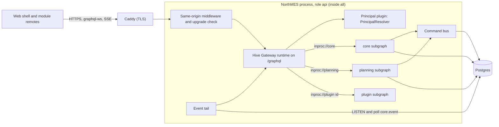
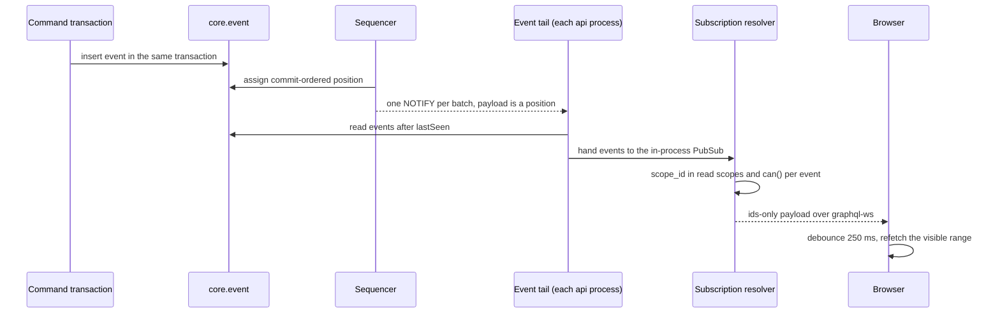
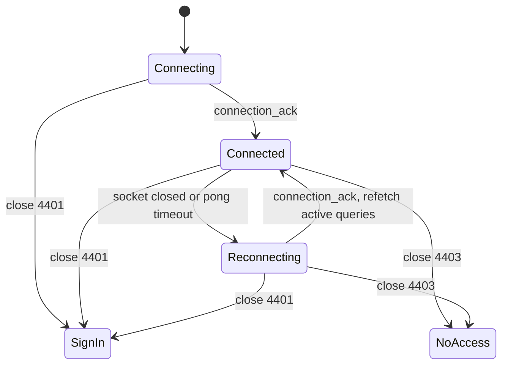

# GraphQL and APIs

NorthMES serves its web app through one GraphQL endpoint, `/graphql`, inside the same Node process as every module. Each module and plugin is a GraphQL Federation subgraph that is built in process, and an embedded Hive Gateway runtime composes the subgraphs into a supergraph at boot and serves queries, mutations and subscriptions over HTTP, graphql-ws and SSE. Every list follows one connection convention with filter, orderBy, search and group by. Every error follows one `DomainError` model. Live screens receive ids from subscriptions fed by the event tail and refetch what they show. Release 1 adds a short list of REST routes under `/api/v1` (Better Auth, the web module list, browser error reports, the AI chat stream, station sign-in and the Pyramid file upload), the health probes at the root and one MCP endpoint with eight planning tools. A public REST API for outside systems, described in OpenAPI, comes later. This document gives the rules, names, limits and tests that the tasks implementing these parts follow.

## Decisions in this document

| Topic | ADR | Status | Still to confirm |
|---|---|---|---|
| Federation subgraphs in one process, embedded gateway, schema snapshot | [0015][adr-0015] | accepted | none |
| List conventions | [0016][adr-0016] | accepted | none |
| Realtime subscriptions, reconnect, stale tabs | [0018][adr-0018] | accepted | none |
| Commands as the single write path, error model | [0012][adr-0012] | proposed | none |
| Zod contracts for inputs | [0017][adr-0017] | proposed | none |
| Principals, credentials, same-origin rules | [0011][adr-0011] | proposed | none |
| Identity, roles, one plant per request | [0010][adr-0010] | accepted | product owner (who edits and assigns roles); maintainer (operator placeholder email) |
| No integration REST API in release 1 | [0031][adr-0031] | proposed | product owner (field ownership, spread rule) |
| Pyramid file upload | [0032][adr-0032] | proposed | pilot IT (write method, Pyramid field meanings); product owner (fallback write path, plant moves) |
| MCP endpoint and toolset | [0034][adr-0034] | accepted | maintainer (off by default per installation; personal access tokens before OAuth) |
| AI chat route and tool runner | [0035][adr-0035] | accepted | lawyer (AI Act Article 50); maintainer (Google in release 1) |
| Health endpoints and shutdown order | [0043][adr-0043] | accepted | none |
| Time scalars | [0024][adr-0024] | proposed | none |
| Unit arguments and unit enums | [0023][adr-0023] | accepted | product owner (pieces per hour) |
| Web codegen and Apollo Client | [0020][adr-0020] | proposed | maintainer (Base UI; token base) |
| API reports, version ranges, event schema diffs | [0038][adr-0038] | accepted | maintainer (no range override in 0.x) |
| Slot ids and plugin checks | [0037][adr-0037] | accepted | maintainer (no third-party plugin on the pilot; web-only plugins degrade); product owner (unpaid-invoice validator) |
| Presentation settings in `/api/v1/web/modules`, week labels, machine-readable output | [0061][adr-0061] | accepted | none |
| Measured input limits, link manifests and link snapshots | [0062][adr-0062] | accepted | none |
| REST route families under `/api/v<major>`, reserved path segments, the boot route check, the public API and OpenAPI later | [0064][adr-0064] | accepted | none |

Related plan documents: [02-architecture.md](02-architecture.md) (process roles and boot order), [03-modules-and-extensibility.md](03-modules-and-extensibility.md) (module packages, manifests, plugins), [04-data-and-platform.md](04-data-and-platform.md) (command pipeline, row-level security, audit, event log), [06-web-and-ux.md](06-web-and-ux.md) (shell, remotes, `DataTable`), [07-production-planning.md](07-production-planning.md) (board queries and planning commands), [09-operator-station.md](09-operator-station.md), [10-ai-and-agents.md](10-ai-and-agents.md), [11-quality-and-testing.md](11-quality-and-testing.md), [12-operations-and-security.md](12-operations-and-security.md), [13-delivery-and-github.md](13-delivery-and-github.md). Terms follow [GLOSSARY.md](../../GLOSSARY.md).

## Endpoints in release 1

| Path | Transport | Credentials accepted | Called by | ADR |
|---|---|---|---|---|
| `/graphql` | HTTP POST; graphql-ws over a WebSocket upgrade; SSE with `Accept: text/event-stream` | session cookie, station cookie | web shell, module remotes, stations | [0015][adr-0015], [0018][adr-0018] |
| `/mcp` | HTTP POST (MCP Streamable HTTP) | bearer only: personal access token or a JWT whose `aud` is the public origin plus `/mcp`; cookies are ignored | MCP clients | [0034][adr-0034] |
| `/api/v1/auth/*` | HTTP | Better Auth handles sign-in itself | sign-in, sign-out, session | [0010][adr-0010] |
| `/api/v1/web/modules` | HTTP GET | session cookie, station cookie | shell boot and plant switch | [0019][adr-0019] |
| `/api/v1/web/client-errors` | HTTP POST | session cookie, station cookie | shell and remotes | [0043][adr-0043] |
| `/api/v1/ai/chat` | HTTP POST, streamed response | session cookie | AI chat panel | [0035][adr-0035] |
| `/api/v1/station` | HTTP POST | station cookie | station sign-in and sign-out | [0033][adr-0033] |
| `/api/v1/pyramid-connector/import-file` | HTTP POST, multipart | session cookie | company admin (Pyramid XML upload) | [0032][adr-0032] |
| `/health`, `/health/live`, `/health/ready` | HTTP GET | none (routes marked `@Public`) | customer monitoring, release CI, System health | [0043][adr-0043] |
| `/modules/<id>/<version>/` | static files, immutable caching | none | shell loading remotes | [0019][adr-0019] |

The `api` role serves all of these; the pilot runs role `all`, which contains `api` ([0002][adr-0002]). The `worker` role serves only its own health endpoint. Each path under `/api/v1/` belongs to one route family, and the others are root routes ([Route families and reserved path segments](#route-families-and-reserved-path-segments)).

## GraphQL Federation in one process

Every module and plugin exposes its own Federation subgraph, written NestJS code-first. The project kept this shape over a single modular schema, which internal research note 02 had recommended. All subgraphs run in one Nest process, and the gateway runs embedded in that process. There is no `apps/gateway`, no Apollo Server, no subgraph HTTP route and no HTTP subgraph mode in release 1 ([0015][adr-0015]).



Internal research note 18 measured the cost on one Apple M4 machine: the embedded gateway added about 0.07 ms per request over a plain Apollo server, each extra in-process subgraph call added 0.1 to 0.2 ms against about 0.5 ms over loopback HTTP, and boot of the whole process with three subgraphs, composition included, took 101 to 121 ms. These are pilot-scale figures, not a capacity plan.

### Subgraphs

- The host turns each enabled module with a `server` entry into a subgraph by calling `defineSubgraph({ name, module, subscriptions })` itself. The subgraph name is the module's GraphQL name from `moduleNames` (module id `production-start` gives `productionStart`), so the root-field prefix has one source ([0003][adr-0003]).
- `InProcessSubgraphDriver` in `@northmes/sdk/graphql` (MIT) extends Nest's `AbstractGraphQLDriver`. It builds the subgraph schema with Nest's `GraphQLFederationFactory.generateSchema`, registers `{ name, schema, sdl, url: "inproc://<name>" }` in a `SubgraphRegistry` and starts no server. It needs neither `@nestjs/apollo` nor `@apollo/server`.
- Module authors never configure `GraphQLModule`. They declare types through `graphqlKit(() => <Id>Module)`, which applies `registerIn`, `@key` and the `includeModules` workaround below.
- Resolvers live only in `<Id>Module`. `<Id>ApiModule` holds plain providers for other modules and no resolvers. The isolation boot check fails when a resolver-bearing Nest module is reachable from two subgraph roots or through a global module, and prints both import paths ([0003][adr-0003]).
- Each subgraph sets `fieldResolverEnhancers: ["guards", "interceptors", "filters"]` (see [Guards on every field](#guards-on-every-field)).

### The embedded gateway

- `GatewayModule` creates the runtime with `createGatewayRuntime` from `@graphql-hive/gateway-runtime` in `onApplicationBootstrap`, after every subgraph schema exists, and mounts it as Nest middleware on `/graphql`, ahead of Nest's 404 handler. Until the runtime exists the middleware answers 503.
- Runtime options: `cors: false`, `csrfPrevention: { requestHeaders: ['x-northmes-csrf'] }`, `maskedErrors: true`, `demandControl` (see [Limits](#gateway-limits-and-masking)), and `plugins` holding the principal plugin, the graphql-armor max-depth and max-tokens plugins, field-suggestion blocking and the plugin that writes `x-northmes-build`.
- A hybrid transport executes subgraph operations in process with `createDefaultExecutor` from `@graphql-mesh/transport-common` when the transport entry starts with `inproc://`. It keeps one subgraph context per client request and subgraph in a `WeakMap`, so DataLoader caches survive several `_entities` calls in one request (the spike saw one SQL query for 25 orders). The HTTP branch stays in the code for a module that later leaves the process.
- Boot awaits `runtime.getSchema()`. Without it the gateway loads the supergraph lazily, and a graphql-ws subscription that arrives before the first HTTP request fails with `Expected null to be a GraphQL schema`. The call also moves supergraph errors to boot.
- graphql-ws runs on one `ws` server created with `noServer: true`. The HTTP server's `upgrade` listener runs the same-origin check and hands `/graphql` upgrades to it. Two `ws` servers attached to one HTTP server interfere, which is why the server uses `noServer`.
- SSE needs no code: the runtime serves `Accept: text/event-stream` on `/graphql`.

### Composition at boot

The gateway module composes the supergraph at boot from the enabled subgraphs with `composeServices()` from `@theguild/federation-composition`, then applies the NorthMES rules. Any error exits the process with code 1 and a `SupergraphCompositionError` that lists every error on its own line. Boot composition took 6.2 ms for 3 subgraphs with 50 types and 62.1 ms for 24 subgraphs with 575 types (internal research note 18).

Boot composition is required because a drop-in plugin produces a supergraph that no committed file contains, and a served file could drift from the code in the image. The committed snapshot exists for codegen, diffs and plugin checks only (see [Schema snapshot and diff gates](#schema-snapshot-and-diff-gates)).

The supergraph hash appears in the boot log, on `/health/ready`, on the System health page and in the `x-northmes-build` header.

| Rule id | Rule | Example failure |
|---|---|---|
| `NORTHMES_ROOT_FIELD_PREFIX` | Every root field of Query, Mutation and Subscription starts with the subgraph's GraphQL name followed by an upper-case letter. Namespace objects such as `planning { ... }` are not used. | `[broken] Query.ping must start with "broken" followed by an upper-case letter` |
| `NORTHMES_TYPE_OWNERSHIP` | A type or enum that is not an entity lives in one subgraph. Only `@key` entities and SDK shared types appear in several. | Two modules emit enum `LossCategory`. Used only in outputs, composition merges the two value sets silently; used in an input, it fails with `EMPTY_MERGED_ENUM_TYPE`. |
| `NORTHMES_CONTRIBUTED_FIELD_NULLABLE` | A field one module adds to another module's entity is nullable. | `openOrderCount: Int!` on core's `Article`: a user without the planning permission loses the whole article to null propagation. |
| `NORTHMES_SDK_TYPE_DRIFT` | Every shared type prints identically in every subgraph that emits it. | `StringFilter differs between "core" and "planning"; rebuild against the same @northmes/sdk` |
| Federation's own checks | `@external` fields match the owner's type exactly; field types agree across subgraphs. | `FIELD_TYPE_MISMATCH` and `EXTERNAL_TYPE_MISMATCH` on `Article.name` |

The drift rule exists because composition merges input types, and enums used in inputs, by intersection without any error. A plugin built against an older SDK whose `StringFilter` lacks `startsWith` would remove `startsWith` from every list in the installation.

The shared-type allowlist holds `PageInfo` (`@shareable`), the time scalars `Instant`, `LocalDate`, `LocalTime` and `LocalDateTime`, the list operator inputs (`IdFilter`, `StringFilter`, `IntFilter`, `FloatFilter`, `DateTimeFilter`, `DateFilter`, `BooleanFilter` and their range inputs), the enums `SortDirection` and `NullsOrder`, and the unit enums with their measured-value filter inputs. A new shared type enters only through `@northmes/sdk`, never through a module.

The SDK pins the federation link to `https://specs.apollo.dev/federation/v2.9` and imports only `@key`, `@shareable`, `@external`, `@requires`, `@provides`, `@inaccessible`, `@tag`, `@override`, `@interfaceObject`, `@cost` and `@listSize`. `@nestjs/graphql` 14 links v2.14 by default, and the composition library knows v2.0 to v2.9, so composition would fail with `UNKNOWN_FEDERATION_LINK_VERSION`.

`@nestjs/graphql`, `@apollo/subgraph`, `@theguild/federation-composition`, `@graphql-hive/gateway-runtime`, `@graphql-mesh/transport-common` and `graphql` 16 are pinned exactly in the pnpm catalog and upgraded together in one pull request. The design was tested on 2026-10-04 with `@nestjs/graphql` 14.0.3, `@apollo/subgraph` 2.15.1, `@graphql-hive/gateway-runtime` 2.12.1, `@graphql-mesh/transport-common` 1.1.0, `@theguild/federation-composition` 0.27.0 and `graphql` 16.14.2. `@apollo/gateway` (Elastic-2.0) and `@graphql-yoga/nestjs-federation` (which depends on it) are never installed ([0040](../adr/0040-dependency-license-policy-ci-gate-and-sbom.md)).

### Type rules for module and plugin authors

1. Each type has one owning module. Master data types (`Article`, `Equipment`, `Plant`, `Customer` and the other core registers) belong to core. Other modules reference them by key and never copy their columns.
2. Entity keys are `id: ID!`. The owner answers `@ResolveReference` through a per-request DataLoader. For an unknown or hidden id the owner throws a typed `NOT_FOUND` error with a module-scoped `errorCode` (for example `core.customer.not_visible`). It does not return null, because a null entity under a non-null field gave one masked "Unexpected error." per row in the list prototype.
3. A field that references another module's entity is a nullable object field returning `{ __typename, id }`, even when the column is `not null`, because the owner decides visibility.
4. A field a module adds to another module's entity is nullable (enforced). A field a plugin adds also carries the plugin's prefix, for example `Article.helloGreeting` (review rule, not enforced).
5. `@external` fields repeat the owner's type exactly.
6. Root fields carry the module prefix: `planningProductionOrders`, `planningReleaseProductionOrder`, `planningBoardChanged`, `coreCustomers`.
7. An enum used by several modules lives in `@northmes/contracts` and every user emits it identically. Otherwise one module owns the enum and the others expose a `String`.
8. A connection type belongs to its node's module: `ProductionOrderConnection` in planning, `CustomerConnection` in core.
9. A web remote queries only fields of its own module and of the modules in its `dependsOn` closure. A plugin field on a core screen comes from the plugin's slot widget with its own query. Disabling a plugin removes its fields at the next boot, and the gateway rejects a document that selects them with `GRAPHQL_VALIDATION_FAILED`.

### Traps the SDK absorbs

The spikes reproduced these with the pinned versions. Each fix lives in the SDK or the root test config, never in module code.

| Trap | Effect without the fix | Fix | Guard |
|---|---|---|---|
| `@nestjs/graphql` 14.0.3 ignores `registerIn` on the federation path | Every module's types land in every subgraph; boot fails with `Schema must contain uniquely named types but contains multiple types named "Article"` | `buildSchemaOptions: { includeModules: [module] }` (an internal key) | boot test with two subgraphs; the fix belongs upstream |
| Default federation link v2.14 | `UNKNOWN_FEDERATION_LINK_VERSION` | link pinned to v2.9 | composition test |
| Entity stub used only as a resolver parent | `"Article" defined in resolvers, but not in schema` | `entityRef` records stubs and `defineSubgraph` adds them as `orphanedTypes`; owner entities reached only by a reference resolver too | boot test |
| `@ResolveReference` with decorated parameters | `Cannot read properties of undefined (reading 'id')` | the reference argument is marked `@Parent()` | unit test |
| Async subscription context with guards | `source is not async iterable` | the driver awaits Nest's context callback in `subscriptionWithFilter` | subscription guard test |
| Guards skipped on `@ResolveField` reached through `_entities` | a user without the permission reads a contributed field | `fieldResolverEnhancers` on every subgraph | `_entities` guard test |
| A plain `@Field` holding a function-valued property | `Int cannot represent non-integer value: [function totalCount]` | connection fields are `@ResolveField` methods on a generated `<T>ConnectionResolver` | list kit test |
| Resolver methods created at run time lack `design:paramtypes` | `Cannot read properties of undefined (reading '1')` | the list kit sets the metadata with `Reflect.defineMetadata` | list kit test |
| Input classes created inside a type thunk | `CannotDetermineInputTypeError` | the list kit creates every class when the declaration is registered | list kit test |
| `graphql` loaded twice under Vitest | `instanceof GraphQLError` fails and the gateway masks every subgraph error | the root Vitest config aliases `graphql` to one file | gateway test suite |
| `@nestjs/graphql` 14.0.0 or 14.0.1 with `@apollo/subgraph` 2.15.x | `doc.definitions is not iterable` at boot | `@nestjs/graphql` 14.0.2 or later | exact pin |
| Peer variants install a second copy of `@nestjs/graphql` | two copies in one process (seen during the spike install) | pnpm catalog for `@nestjs/*`, `@apollo/subgraph`, `graphql`, `typescript` | CI check for one `@nestjs+graphql@` directory in `node_modules/.pnpm` |

### What a module author writes

```ts
// modules/planning/server/graphql.ts (AGPL), sketch
export const gql = graphqlKit(() => PlanningModule);
export const ArticleRef = gql.entityRef("Article");

@gql.ObjectType("ProductionOrder", { key: "id" })
export class ProductionOrder {
  @Field(() => ID) id: string;
  // ...
}

@Resolver(() => ArticleRef)
@RequirePermission("planning.productionOrder:read")
export class PlanningArticleResolver {
  @ResolveField(() => Int, { nullable: true })
  openOrderCount(@Parent() a: { id: string }, @Context() ctx: SubgraphContext) {
    // plant-scoped count through a request DataLoader
  }
}
// ProductionOrder.article returns { __typename: "Article", id: row.articleId }
```

The SDK's `/graphql` subpath owns `defineSubgraph`, the driver, `graphqlKit`, `entityRef`, `connectionOf`, `PageInfo`, `RequirePermission`, `Public`, `SubgraphContext`, `loaderFor`, `inputFromZod` and `objectFromZod`. The exception filter is exported from the server-only subpath `@northmes/sdk/errors` ([The exception filter](#the-exception-filter)). The AGPL core gateway module owns composition, the NorthMES rules, the transport and the principal plugin ([0022][adr-0022]).

## Principal, guards and mutations

### The principal, once per request

- A gateway plugin resolves the principal in `onContextBuilding`, once per client request, through `PrincipalResolver(request, plant)` from the SDK. The same resolver serves REST controllers, `/api/v1/ai/chat` and `/mcp` ([0010][adr-0010], [0011][adr-0011]).
- Session path: Better Auth database sessions with a cookie cache whose `maxAge` is at most 60 s.
- Station path: the resolver verifies the key in the `__Host-nm_station` cookie, loads `core.credential`, takes the plant from the credential's scope and rejects a differing `x-northmes-plant`. On HTTP it adds the operator from `x-northmes-operator-session` after checking that the operator session is open and belongs to this station. When a station cookie is present, session cookies are ignored except on sign-out and admin deregistration ([0033][adr-0033]).
- Plant: the Apollo HTTP link sends the route plant's id in `x-northmes-plant`. The resolver validates it against `core.role_assignment` with the ancestor walk. An unknown or unauthorized plant fails with `FORBIDDEN`, `errorCode: core.plant_forbidden`, data null and one `permission.denied` security event. No request falls back to a default plant, and the plant is never stored on the session ([0007][adr-0007]). At a plant whose onboarding is not complete, only a holder of `core.onboarding:manage` passes; any other principal with a role there gets `FORBIDDEN` with `core.plant_not_ready` and no security event. An operation without the header is served only when every root field in it is one of core's plant-free admin fields, which the admin pages under `/admin` use ([0066][adr-0066]).
- The resolved principal (user or station, roles at the plant, permission set, read and write scopes) reaches every subgraph call as an object in process. No header, no signature and no second session lookup are involved; the spike saw one session lookup for a request that touched three subgraphs.
- Subgraph context: `{ principal, correlationId, loaders, subgraph }`. Data access opens transactions that set `read_scopes` and `write_scopes` with transaction-local `set_config` from that principal ([0008][adr-0008]).
- `/graphql` rejects personal access tokens of api-key `configId` `mcp` and any token whose `aud` ends in `/mcp` with 401, so an agent that can read its MCP token cannot call the commit mutation as the user.
- The permission cache is invalidated locally when a role transaction commits, with a 30 s TTL as backstop. A role-assignment change invalidates all of that user's scopes; a `core.role` change invalidates every user of the organization.

### Guards on every field

- One global `PermissionGuard` reads `@RequirePermission("<module>.<entity>:<action>")` from the method or the class. `@Public()` is the only opt-out.
- Because every subgraph sets `fieldResolverEnhancers`, the guard runs on root fields, on `@ResolveField` handlers reached through `_entities`, on `@ResolveReference` and on subscription start.
- At boot a walk over resolver classes (Nest `DiscoveryService`) exits with code 1 and names `Type.field` when a field carries neither permission nor `@Public` metadata.
- The field guard is a coarse gate. The command pipeline loads the target and calls `can(principal, permission, target.scope_id)`, or uses the requested scope for creates ([0012][adr-0012]).
- Introspection is refused for unauthenticated requests with `UNAUTHENTICATED`.

### Mutations are commands

- Every Mutation field maps to a registered command handler. The boot check exits when one does not ([0012][adr-0012]).
- Naming: the command `planning.releaseProductionOrder` is the mutation `planningReleaseProductionOrder`.
- The pipeline runs in this order: parse the input with the command's Zod contract; load the target and check permission at its scope; open the audit context; take the optional reason; check `expectedVersion`; run command validators (veto only); a reserved signature stage (declared, not built); execute; write outbox events. One transaction is one audit command. Details are in [04-data-and-platform.md](04-data-and-platform.md).
- Input types come from the Zod schema in `@northmes/<id>-contracts`. `inputFromZod(name, schema)` walks `z.toJSONSchema(schema, { io: "input" })` and builds `@InputType` classes. It supports scalars, enums, lists, nested named objects, nullability and defaults, and throws at boot on anything else. An integer maps to `Int` only when it is bounded to 32 bits. Enum and nested object names come from `.meta({ id })`. nestjs-zod is not used ([0017][adr-0017]).
- Contract inputs may use `.refine` and `.superRefine` with synchronous checks. `z.toJSONSchema` leaves checks out, so they pass `inputFromZod`, and both the pipeline parse and the browser resolver run them with the same messages and paths. A rule that needs stored data is a handler check that throws a `DomainError` with `fieldErrors`, never a refinement. A cross-field rule between measured fields is a handler check too, because the contract validates measured values in the unit the person typed and the browser never converts ([0062][adr-0062]). Contracts use no async refinements: the pipeline parses synchronously, and `useZodForm` sets the resolver mode to sync. `.meta({ id })` is the last call on a named schema, because `.refine()` returns a schema that does not keep the id. A transform appears only as `z.codec` or as a pipe whose input side `inputFromZod` supports ([0017][adr-0017]).
- Every mutation accepts the same optional reason input, so the contract stays fixed when a later compliance profile requires reasons ([0051](../adr/0051-regulated-readiness-no-regret-rules.md)). Commands that check versions take `expectedVersion`. Create-type commands take a client-generated uuidv7 `id` and insert with `on conflict do nothing`, so a retry after a restart is harmless.
- The gateway rejects a mutation whose `x-northmes-client-build` differs from the server build with `core.client_outdated`. Queries pass, and so do API keys and MCP clients that send no header.
- Stations send mutations over HTTP only, never over the WebSocket, with `AbortSignal.timeout(15000)` and without `optimisticResponse` ([09-operator-station.md](09-operator-station.md)).

### Gateway limits and masking

| Limit | Value | Where |
|---|---|---|
| Error masking | `maskedErrors: true`; unknown errors are masked again in each subgraph | runtime option and SDK exception filter |
| Query depth | 12 | graphql-armor max-depth plugin in `plugins` (not a runtime option) |
| Tokens per document | 2 000 | graphql-armor max-tokens plugin in `plugins` |
| Cost | `demandControl` with `maxCost` starting at 20 000, then set from measured persisted documents | runtime option |
| `@listSize` on root connections | `slicingArguments: ["first", "last"]`, `sizedFields: ["edges"]`, `requireOneSlicingArgument: false` | SDK list kit |
| `@listSize` on nested connections | `slicingArguments: ["first"]`, `sizedFields: ["edges"]`, `requireOneSlicingArgument: false` | SDK list kit |
| `@listSize` on `groupedAggregates` | `slicingArguments: ["first"]`, no `sizedFields` | SDK list kit |
| Field suggestions | blocked | gateway plugin |
| Introspection | refused without a session | gateway |
| Persisted documents | manifest generated now, enforced later | web build |

A depth of 12 allows three nested connection levels plus a related object, because each connection costs three levels (field, `edges`, `node`). With the default type cost of 1, a table of 100 orders with customer, `totalCount` and `pageInfo` costs 303; 100 orders with 100 operations each costs 20 301 and is refused. `requireOneSlicingArgument` stays false: with `first: Int = 25` in the schema, the gateway otherwise rejects a call that sends only `last`.

## List conventions

Every list is a Relay connection, relations resolve as objects, and every list offers filter, orderBy, search and group by ([0016][adr-0016]). One declaration in the module's contracts package generates the GraphQL types, the SQL and the resolvers through the list kit in `@northmes/sdk`.

### Root list field and connection

```graphql
# template
<module><Entities>(
  first: Int = 25
  after: String
  last: Int
  before: String
  filter: <T>Filter
  orderBy: [<T>OrderBy!]
  search: String
  includeArchived: Boolean = false   # archivable entities only
): <T>Connection!

type ProductionOrderConnection {
  edges: [ProductionOrderEdge!]!
  pageInfo: PageInfo!
  totalCount: Int!
  aggregates: ProductionOrderAggregates!
  groupedAggregates(
    groupBy: [ProductionOrderGroupBy!]!
    having: ProductionOrderHaving
    orderBy: [ProductionOrderGroupOrderBy!]
    first: Int = 100
  ): [ProductionOrderGroup!]!
}
type ProductionOrderEdge { cursor: String!  node: ProductionOrder! }
```

| Argument | Rule |
|---|---|
| `first` | Default 25, range 1 to 100. `first: 0` is refused. The default sits in the schema because Hive's cost estimate ignores `@listSize(assumedSize:)` when a call sends no slicing argument. |
| `last`, `before` | Select backward paging; `first` is then ignored. |
| `after` with `before` | Refused. |
| `filter` | Typed per declared field (see [Filters](#filters)). |
| `orderBy` | At most 3 entries; a repeated field is refused; nulls LAST by default in both directions; `id` is appended as tie-breaker with the direction of the last entry. |
| `search` | Trimmed, at most 100 characters, case-insensitive. |
| `includeArchived` | Only on archivable entities; default false. |

Refused arguments return `BAD_USER_INPUT` with `errorCode` `core.list.bad_argument`.

`pageInfo` follows the Relay specification (https://relay.dev/graphql/connections.htm). `hasNextPage` is exact when paging forward. `hasPreviousPage` is `after != null` when paging forward, which the specification allows. Both mirror when paging backward. `startCursor` and `endCursor` are null when the page is empty.

Every connection field resolves lazily through a generated `<T>ConnectionResolver`, which also carries the list's permission guard. `edges` and `pageInfo` share one row query. A query that selects only `aggregates` and `groupedAggregates` runs no row query. `totalCount` runs one `count(*)` with the same filter only when selected. Append-only lists (the audit list, the event log, the connector import log) declare `totalCount: false` and show "more" from `hasNextPage`; they keep filter, orderBy, search and group by.

The planning board's range query is described in [07-production-planning.md](07-production-planning.md). Its resolver limits days and rows and returns `planning.board.range_too_large` above them.

### Cursors

- A cursor is opaque `base64url(JSON [1, orderSignature, sortValues..., id])`. The leading 1 is the format version.
- `orderSignature` encodes field, direction and null placement per key, for example `deadlineAt.AL,id.AL`. A cursor used with another `orderBy` is refused with `BAD_USER_INPUT` and `errorCode` `core.list.invalid_cursor`.
- Sort values are selected as `<column>::text` and compared as `cast($v as <type>)`. A JavaScript `Date` drops microseconds: in the prototype, a walk over 500 orders, 100 of which shared one millisecond, read 700 rows of which 417 were distinct.
- The cursor holds values, never a row lookup, so a deleted cursor row does not break the next page.
- Cursors are not signed. Changing a cursor only moves the start point inside rows the caller may already read under the same scope and filter.
- Lists make no snapshot promise. A row whose sort value moves across the cursor between pages may be skipped or read twice. Screens refetch the visible page when an event names a listed id.

### Filters

Each declared filterable field gets one operator input chosen by its type. Shared operator inputs are SDK value types; enum filters belong to the enum's module.

| Field type | Input | Operators |
|---|---|---|
| id, reference id | `IdFilter` | `eq`, `ne`, `in`, `notIn`, `isNull` |
| text | `StringFilter` | `eq`, `ne`, `in`, `notIn`, `contains`, `startsWith`, `isNull` |
| integer | `IntFilter` | `eq`, `ne`, `in`, `notIn`, `lt`, `lte`, `gt`, `gte`, `between: IntRange`, `isNull` |
| decimal quantity | `FloatFilter` in the prototype; the decimal scalar is open | as integer |
| instant | `DateTimeFilter` over `Instant` values | `eq`, `ne`, `lt`, `lte`, `gt`, `gte`, `between: DateTimeRange`, `isNull` |
| plain date, plant day of an instant | `DateFilter` over `LocalDate` | `eq`, `ne`, `in`, `lt`, `lte`, `gt`, `gte`, `between: DateRange`, `isNull` |
| enum | `<Enum>Filter` | `eq`, `ne`, `in`, `notIn`, `isNull` |
| boolean | `BooleanFilter` | `eq`, `isNull` |
| measured value | per-dimension `<Dimension>Filter` with `unit` | `lt`, `lte`, `gt`, `gte`, `between`, `isNull` |

`<T>Filter` also has `and: [<T>Filter!]`, `or: [<T>Filter!]` and `not: <T>Filter`. Fields side by side are joined with `and`.

Semantics, each checked against hand-written SQL in tests:

- Positive operators never match NULL. `ne` is `is distinct from`, `notIn` is `(col = any($1)) is not true`, and `not: F` is `(F) is not true`, so all three include NULL rows. "Status is not cancelled" lists orders with no status too.
- `contains` and `startsWith` are case-insensitive (`ILIKE`) and escape `\`, `%` and `_`. There is no case-sensitive variant.
- `between` is inclusive at both ends. Screens filter instants with `gte` and `lt`.
- `in` and `notIn` take at most 1 000 values.
- An empty `or` is ignored.
- A column the declaration does not list is not in the input. A new column is not filterable until someone declares it.

Plant-local dates: an instant declared `plantDate` also gets `<field>Date` and `<field>ProductionDay`, both `DateFilter`. The SDK turns each date into the instant where that plant day starts, in TypeScript with Temporal, the plant's zone, its production day start and `resolveWallClock`. SQL never turns local time into an instant ([0024][adr-0024]). Release 1 lists are scoped to the active plant, so one zone applies; company-wide lists across plants with different zones wait.

### Search

`search` becomes an `or` of `ILIKE '%term%'` over the declared search fields plus every declared reference search. Release 1 needs it on customer orders, because the pilot finds an order by the customer's own order number; the list prototype carried that number on production orders as `customerOrderRef`.

Under row-level security `ILIKE` cannot use a trigram index, because `textlike` and `texticlike` are not leakproof in Postgres 18. With 50 000 orders in one plant a search took 33.7 ms at p50 through GraphQL. Plant lists in release 1 hold hundreds to a few thousand rows, so this is accepted; indexed text search for large lists waits.

### Sorting

`orderBy: [<T>OrderBy!]` where `<T>OrderBy { field: <T>SortField!, direction: SortDirection = ASC, nulls: NullsOrder }`. `<T>SortField` lists only declared fields plus `ID`. Codegen emits it as a const enum, and `DataTable` reads it to know which headers sort.

A list cannot sort by another module's field, because the subgraph does not hold the value. If a screen needs it, the owning module publishes the value through an event and the referencing module keeps a read-model column for sorting only, reviewed like any copied column. Sorting by a related field inside the module waits.

### Relations

| Relation | Shape | Batching |
|---|---|---|
| To-one, same module | object field | `loaderFor(ctx, "<module>.<entity>", ...)`, one statement per relation per request |
| To-many, same module | nested connection `(first: Int = 25, filter, orderBy)` without cursors, with `totalCount` and `aggregates` per parent | one statement per relation and argument set: `row_number() over (partition by <fk> order by <orderBy>, id)` keeps `first + 1` rows per parent; windowed `count`, `sum`, `avg`, `min`, `max` give the per-parent totals |
| To another module | nullable object field returning a Federation reference | the gateway batches one `_entities` call per subgraph; the owner's reference resolver uses a request DataLoader |

- Paging past the first page of a nested list goes to the root list with a parent filter, for example `planningProductionOrderOperations(filter: { productionOrderId: { eq: $id } }, after: $cursor)`, because one `after` cannot apply to every parent in a batch. `groupedAggregates` under a nested connection is refused.
- Relation filters inside a module: `operations: { some: ..., none: ... }` compiles to `exists` and `not exists`. `every` is not generated; `none` with a negated filter covers it.
- Relations to another module: only the foreign key is filterable, as `<ref>Id: IdFilter`. A declared `<ref>Search: String` runs a two-step lookup through the owner's API module (`searchIds(ctx, term, limit)`) under the same principal and scope, then filters `<ref>_id = any($ids)`. More than 1 000 matches is refused with `core.list.ref_search_too_broad`, never truncated. Copying another module's names into a module as search keys is rejected.
- A field a plugin contributes to another module's entity is not filterable, sortable or groupable in the owner's list. A plugin that needs that offers its own list.

Hidden related rows: the owner throws a typed `NOT_FOUND` for a hidden id, and the client gets `customer: null` plus one error for that row. Commands keep references consistent with visibility (a reference points to the same scope or an ancestor, [0009][adr-0009]), so a hidden related row means a data error. Screens wrap relations the user may lack permission for in `@include(if: $canReadCustomer)` driven by the web SDK's permission set. `customer { id }` alone is answered by the gateway from the reference without calling core; ids are not secret in NorthMES.

Measured in the list prototype (internal research note 34): 100 orders with their customers ran 3 SQL statements, p50 8.4 ms through the gateway, against 87 statements and 16.7 ms without batching. 25 orders with operations, job orders, customer and equipment ran 5 statements and 2 subgraph calls, p50 12.4 ms, against 144 statements without batching.

### Aggregates and group by

- `aggregates: <T>Aggregates!` holds `count: Int!` and nullable `sum`, `avg`, `min` and `max` objects with the fields declared for each function. One statement computes only the selected functions, over every row the filter and row-level security let through, ignoring paging.
- `groupedAggregates(groupBy, having, orderBy, first)` returns `[<T>Group!]!` where `<T>Group { keys: <T>GroupKeys!, count: Int!, sum, avg, min, max }`.
- `groupBy` takes 1 to 3 keys from `<T>GroupBy`: plain fields (`STATUS`, `PRIORITY`), plant-time buckets (`DEADLINE_AT_DAY`, `DEADLINE_AT_WEEK`, `DEADLINE_AT_MONTH`, `DEADLINE_AT_PRODUCTION_DAY`) and references (`CUSTOMER`). `first` is 1 to 500, default 100.
- `keys` is a typed object, not a list of strings: `keys { status deadlineAtWeek customer { name } }`. A reference key resolves through Federation in the same request. A key not grouped is null.
- `having` takes `count: IntFilter` and `sum` per field. Groups order by their keys, ascending with nulls last, unless `orderBy` names keys or `COUNT`.
- Buckets are computed in SQL, which may turn an instant into local time: `(col at time zone $zone)::date`, `date_trunc('week', ...)` with ISO weeks from Monday, `date_trunc('month', ...)`, and the production day as `((col at time zone $zone) - $dayStart::interval)::date`. The label of a week key comes from `formatIsoWeek` in `@northmes/contracts`, which pairs the ISO week-year with the week number (`2026-W53`), never the calendar year ([0061][adr-0061]).
- Waits: `having` on `avg`, `min` and `max`; ordering groups by sums.

Screens use group by for filter chips with counts (`groupedAggregates(groupBy: [STATUS]) { keys { status } count }` in the same request as the page) and for load per machine per production day.

### Measured values and units

Metric values are stored in SI and converted only on the server ([0023][adr-0023]).

- A measured filter carries one `unit` for its bounds. The SDK converts the bounds to the canonical unit before SQL and swaps them for reciprocal rate units: `cycleTime: { gte: 300, unit: PIECES_PER_HOUR }` becomes at most 12 s.
- `orderBy` sorts the canonical column. The field description says that a rate unit reads in the reverse order.
- Aggregates run on the canonical column and convert on the way out through the same unit argument, for example `sum { plannedDuration(unit: HOUR) }`. Absolute temperatures have no `sum`.
- Measured values are not group keys, and their filters offer ranges and `isNull` but no `eq`, `ne` or `in`, because a converted bound rarely equals a stored double exactly.

### One declaration generates the rest

```ts
// modules/planning/contracts/src/lists/production-orders.ts (MIT, pure data), sketch
export const productionOrderList = defineList({
  module: "planning",
  name: "productionOrder",                 // root field planningProductionOrders
  permission: "planning.productionOrder:read",
  scope: "plant",                          // explicit plant predicate next to RLS
  fields: {
    number:           text({ filter: true, sort: true, search: true }),
    customerOrderRef: text({ nullable: true, filter: true, sort: true, search: true }),
    status:           enumOf(productionOrderStatus, { filter: true, sort: true, group: true }),
    deadlineAt:       instant({ nullable: true, filter: true, sort: true, plantDate: true,
                                group: ["DAY", "WEEK", "MONTH", "PRODUCTION_DAY"], aggregate: ["min", "max"] }),
    priority:         int({ filter: true, sort: true, group: true }),
  },
  refs: { customer: ref("core.customer", { nullable: true, filter: true, group: true, search: true }) },
  many: { operations: many(() => productionOrderOperationList, { foreignKey: "productionOrderId" }) },
  defaultOrderBy: [{ field: "deadlineAt", direction: "ASC" }],
});

// modules/planning/server/graphql/production-orders.ts (AGPL), sketch
export const orders = listKit(productionOrderList, {
  table: "planning.production_order",
  node: () => ProductionOrder,
  refs: { customer: { searchIds: (ctx, term, limit) => coreApi.customers.searchIds(ctx, term, limit) } },
});
```

`defineList` comes from `@northmes/contracts`. `listKit` generates, registered in the owning module and visible in the committed subgraph SDL: `<T>Filter` with enum and relation filters, `<T>SortField`, `<T>OrderBy`, `<T>GroupBy`, `<T>GroupKeys`, `<T>Aggregates` with its `Sum`, `Avg`, `Min` and `Max` types, `<T>Group`, `<T>Having`, `<T>GroupOrderBy`, `<T>Edge`, `<T>Connection`, the argument types, the `<T>ConnectionResolver`, reference fields and nested connection loaders. The SQL side (filter compiler, plant dates, reference search, keyset with the null split, aggregates, groups, nested batching, cursor codec) is shared code that reads the declaration. The master-data kit's `list` block is this declaration ([0022][adr-0022]).

### SQL and index rules for lists

- The SDK adds the plant predicate `scope_id = $activePlant` next to row-level security. With it a deep page used an ordered index scan (0.11 ms); with row-level security alone the planner chose a bitmap scan and a sort (2.05 ms).
- Every list's default order gets an index `(scope_id, <sort columns>, id)`. Nested connections need `(<foreign key>, <default sort>)`, for example `(production_order_id, seq)`.
- Keyset predicates: a row comparison `(k1, k2, id) > (v1, v2, i)` when all keys share one direction and are non-null; a redundant leading bound `k1 >= v1` for an ascending non-null first key; otherwise the expanded form `(k1 after v1) or (k1 = v1 and k2 after v2) or ...`.
- A nullable first sort key is split into its non-null and null partitions, each with an index-friendly predicate. The null partition is read only when the page is not full. A page at 85 percent depth took 4.19 ms at p50 with the split against 17.45 ms with one OR query (50 000 orders).
- `numeric` sort keys and `LIKE` filters get no index range under row-level security, because their operators are not leakproof.
- Text sorts use the column collation for the order, the keyset predicate and the index alike.

The web side (`useListState`, `useConnection`, `DataTable`, URL state) is in [06-web-and-ux.md](06-web-and-ux.md). A paged table needs no Apollo field policy, because every argument is part of the cache key.

## Scalars and value types

| Scalar or type | Wire form | Rule |
|---|---|---|
| `Instant` | ISO 8601 with a required offset | A fact in time. The Apollo cache keeps the ISO string; the board converts to epoch milliseconds once at the data edge. |
| `LocalDate`, `LocalTime`, `LocalDateTime` | ISO 8601 without offset | Plant wall-clock values. Only the server turns a `LocalDateTime` into an instant, through `resolveWallClock` and its clamp rule. |
| `ID` | string | uuidv7 keys. |
| Unit enums | per dimension, for example `CycleTimeUnit` with `SECOND`, `MINUTE`, `PIECES_PER_HOUR`, `PIECES_PER_MINUTE` | Output fields take a unit argument with a default: `cycleTime(unit: CycleTimeUnit! = SECOND)`. The server converts GraphQL inputs to the canonical unit. |
| Article quantities | decimal | `numeric(18,6)` in the article's stock unit. The GraphQL decimal scalar is not chosen yet. |

The subgraph driver validates the time scalars with Zod, and codegen maps them to the branded string types exported by `@northmes/contracts`, which the contracts' time value schemas also output ([0024][adr-0024]).

## Error model

### DomainError and the code catalog

- One error type, `DomainError { code, kind, message, details?, fieldErrors? }`, lives in the SDK ([0012][adr-0012]).
- `code` is stable and module-scoped: it starts with the owning module's id. Codes are never renamed after a release.
- `kind` is one of `validation`, `unauthenticated`, `not_found`, `forbidden`, `conflict`, `precondition`, `unavailable`.
- Each module declares its codes with `defineErrors` in its contracts package, each with its kind and an optional Zod schema for `details`. The docs and a TypeScript union for the web are generated from the declarations.
- A `DomainError` may carry `fieldErrors: [{ path, message, code }]` with paths relative to the command input. A `defineErrors` entry may declare `field: <dot path>`, and a thrown error of that code fills `fieldErrors` from it. The exception filter writes them to `extensions.fieldErrors` in the same shape as a Zod failure. `toDomainError` maps a code-key violation to `core.code_taken` with `fieldErrors` on the definition's `code` field.
- Result unions (errors as data) are not used.

Codes named by the decisions so far:

| Code | Meaning |
|---|---|
| `core.forbidden` | permission denied at the target's scope (`FORBIDDEN`) |
| `core.plant_forbidden` | `x-northmes-plant` names a plant the principal may not use, or an operation without the header selects a field that is not plant-free (`FORBIDDEN`) |
| `core.plant_not_ready` | the plant's onboarding is not complete and the principal does not hold `core.onboarding:manage` (`FORBIDDEN`, no security event) ([0066][adr-0066]) |
| `core.plant_slug_taken` | another plant of the installation uses the slug; `fieldErrors` on `slug`, and the message names no company |
| `core.onboarding_incomplete` | `core.completeOnboarding` found an open required step; `details.steps` lists them |
| `core.version_conflict` | `expectedVersion` is stale |
| `planning.production_order.locked` | another planner's soft lock holds the order |
| `core.code_taken` | code clash within a scope; the message hides the other plant's key |
| `core.crossScopeReference` | a reference points outside the same scope or its ancestors |
| `core.command_rejected` | a command validator vetoed; `details` carry `rejectedBy`, the validator's `code`, that code's `details` and the `message` the server renders from the validating module's `defineErrors` ([ADR 0068](../adr/0068-extension-points-declared-by-their-owners-contributions-as-manifest-data-with-code-by-id-and-a-plugin-inventory.md)) |
| `core.validator_contract_mismatch` | a validator payload failed the owner's contract |
| `core.client_outdated` | mutation from a tab running an older build |
| `core.secret_reentry_required` | an outbound URL changed without a new secret |
| `core.list.bad_argument`, `core.list.invalid_cursor`, `core.list.ref_search_too_broad` | list argument errors (`BAD_USER_INPUT`) |
| `planning.board.range_too_large` | board range above its day or row limit |
| `core.request.malformed`, `core.request.too_large`, `core.request.unsupported_media_type`, `core.request.rate_limited` | request and transport errors on REST routes (M-51) |
| `core.internal` | a masked error |

### The exception filter

One filter catches every exception (`@Catch()` with no arguments). The SDK exports it, with `toDomainError`, from the server-only subpath `@northmes/sdk/errors`, not from the root, because manifests import `defineModule` from the root before any Nest code loads ([0002][adr-0002], [0003][adr-0003]). `apps/server` registers it once as `APP_FILTER` in the root module, so it is a singleton that can inject the logger and the error recorder. Modules and plugins never register filters ([0012][adr-0012]).

- The filter turns the exception into a `DomainError` or an unknown error, using `toDomainError` for database errors (below), and then answers by `host.getType()`: for `graphql` it returns a `GraphQLError` with the extensions in [GraphQL errors](#graphql-errors), for `http` it writes `application/problem+json` through the response object ([REST errors](#rest-errors)) and returns nothing, and for any other type it rethrows.
- The filter is synchronous, because Nest 12 calls an HTTP exception filter without awaiting it. Work it starts in the background, such as counting a masked error, catches its own failure.

Exceptions that are not a `DomainError`:

1. `PermissionGuard` and `PrincipalGuard` throw a `DomainError` (`core.forbidden` with `details.permission`, or kind `unauthenticated`) and never return false, because a guard that returns false makes Nest throw its own `ForbiddenException`.
2. A Nest `HttpException`, or an http-errors object such as body-parser's, maps by status: 400 to `validation`, 401 to `unauthenticated`, 403 to `forbidden`, 404 to `not_found` and 409 to `conflict`. The message becomes the kind's fixed text, because Nest's default texts are not written for users. Malformed JSON is a 400 with `core.request.malformed`.
3. Other 4xx statuses are transport errors. They keep their HTTP status and carry a core code: 413 `core.request.too_large`, 415 `core.request.unsupported_media_type` and 429 `core.request.rate_limited` with a `Retry-After` header. The code names answer M-51 in [16-open-questions.md](16-open-questions.md#design-points-from-the-plan-documents).
4. A 5xx status and anything else is masked.
5. Core's user-management handlers translate a Better Auth `APIError` from `auth.api` into `core.user.*` codes ([0011][adr-0011]). An `APIError` that escapes them is masked.
6. A `GraphQLError` thrown by module code is masked like any unknown error, because modules throw `DomainError`.
7. A 401 on `/mcp` also carries the `WWW-Authenticate` header with `resource_metadata` ([0034][adr-0034]).

### GraphQL errors

Kind to GraphQL `extensions.code` and REST status:

| `kind` | `extensions.code` | REST status |
|---|---|---|
| `validation` | `BAD_USER_INPUT` | 400 |
| `not_found` | `NOT_FOUND` | 404 |
| `forbidden` | `FORBIDDEN` | 403 |
| `conflict` | `CONFLICT` | 409 |
| `precondition` | `PRECONDITION` | 412 |
| `unavailable` | `UNAVAILABLE` | 503 |
| `unauthenticated` (no session) | `UNAUTHENTICATED` | 401 |
| unknown error | `INTERNAL_SERVER_ERROR` with `errorCode` `core.internal`, message "Unexpected error." | 500 |

The SDK exception filter writes these extensions. The gateway passes them through and adds `serviceName`.

```json
{
  "message": "Not permitted.",
  "path": ["planningProductionOrders"],
  "extensions": {
    "code": "FORBIDDEN",
    "errorCode": "core.forbidden",
    "details": { "permission": "planning.productionOrder:read" },
    "correlationId": "<correlation id>",
    "serviceName": "planning"
  }
}
```

A Zod parse failure becomes `BAD_USER_INPUT` with `fieldErrors: [{ path, message, code }]`, which `useCommandForm` maps onto form fields.

Database errors map in one SDK function, `toDomainError(error)`, which the pipeline's error step, the jobs wrapper, the tool runner and the exception filter all call, so a database error maps the same way on every path:

| SQLSTATE | Mapped to |
|---|---|
| 42501 (row-level security or grant) | `FORBIDDEN`, `core.forbidden` |
| 23P01 on a code exclusion constraint, 23505 on a code key | `core.code_taken` |
| 23514 on a scope span check | `core.crossScopeReference` |

Zero rows on a versioned update is a return value, not an exception, so the `/data` update helper raises `core.version_conflict` itself, or `core.not_found` when the row is gone.

Masking and logging:

- The exception filter masks every unknown error as "Unexpected error." with the correlation id, inside the subgraph, whatever the transport. In the HTTP-mode spike a plain `Error` thrown in a resolver leaked its message through the gateway even with `NODE_ENV=production`, because Apollo had turned it into a `GraphQLError` first. The gateway's `maskedErrors` is a second layer.
- The filter logs domain errors below error level; Nest's `ExceptionsHandler` would log every expected `FORBIDDEN` as an error. Every log line carries the correlation id ([0046](../adr/0046-observability-structured-logs-host-checks-and-optional-opentelemetry.md)).
- For a masked error the filter writes one log line at error level with the correlation id, the error class, the stack and, for a Postgres error, the SQLSTATE and the constraint name. It never logs Postgres DETAIL text or bound parameters, because they hold key values. It also counts the error by fingerprint (the error class plus the first stack frame outside `node_modules`), with the last correlation id, for System health ([0043][adr-0043]). The jobs wrapper and the tool runner record masked errors the same way.

On the web, Apollo Client 4 reports errors as `CombinedGraphQLErrors`, and one classifier in `@northmes/web-sdk` reads `code` and `errorCode`. `useConnection` runs list queries with `errorPolicy: "all"` and turns `NOT_FOUND` and `FORBIDDEN` on a nullable relation path into a cell state instead of a page error.

### REST errors

REST routes answer errors as `application/problem+json` (RFC 9457, https://www.rfc-editor.org/rfc/rfc9457) built from the same `DomainError`:

```json
{
  "type": "https://docs.northmes.dev/errors/core.forbidden",
  "title": "Not permitted",
  "status": 403,
  "detail": "Uploading Pyramid files needs pyramidConnector.import:upload at company scope.",
  "instance": "<request path>",
  "code": "core.forbidden",
  "errors": [],
  "correlationId": "<correlation id>"
}
```

`status` follows the kind table above; `code` holds the module-scoped `errorCode` (`core.internal` for a masked error, with `type` `https://docs.northmes.dev/errors/core.internal`), `errors` the field errors, and `correlationId` the request's correlation id. The `type` base `https://docs.northmes.dev/errors/` is proposed (see [Open items](#open-items)). Transport errors keep their HTTP status and carry the codes in [The exception filter](#the-exception-filter), for example 413 with `core.request.too_large` for an upload above 25 MB.

### MCP and assistant tool errors

The shared tool runner maps errors before either adapter sees them: a known domain error becomes `{ code, safeMessage, retryable }`, anything else `{ code: "internal", correlationId }` ([0035][adr-0035]).

`toMcpTool` returns a runner error as a `CallToolResult` with `isError: true`, `structuredContent` holding the runner's error object and the same JSON as text, and never throws to the MCP SDK. The MCP SDK rejects arguments that fail the advertised input schema with "Input validation error" before the runner runs, and that text holds only Zod issue paths and messages ([0034][adr-0034]).

## Realtime subscriptions

Screens show live status through GraphQL subscriptions ([0018][adr-0018]).

### Transport and connection rules

- Subscriptions are prefixed root fields, for example `planningBoardChanged(plantId: ID!)`. A subscription operation has exactly one root field, so namespace objects cannot carry module streams.
- graphql-ws runs on `/graphql`. SSE on the same endpoint serves a site that blocks WebSockets; the web uses a fetch-based SSE client so it can send `x-northmes-csrf`.
- The WebSocket principal comes only from the handshake cookie. `connectionParams` never carry identity or plant: the gateway runtime spreads `connectionParams` over `ctx.headers`, so trusting them would let a client set its own headers.
- graphql-ws `onConnect` resolves the session and closes inside the protocol: 4401 without a session, 4403 on lost plant membership.
- Station sockets authorize against the station's own permissions only and carry no operator. Stations cannot send mutations over the WebSocket. `core.credential.revoked` closes that credential's sockets with 4403.
- Sockets close when the session is revoked.

### From commit to screen



- Every `api` process tails `core.event` with one direct `LISTEN` connection plus a polling fallback (every 2 to 5 s in the design), and feeds the subscriptions through an in-process `PubSub`. No third-party Postgres pub/sub library is used ([0014][adr-0014]).
- A process starts at the current maximum position; after a listener reconnect the fallback read catches up, so nothing is lost while the process is up.
- With several `api` replicas each runs its own gateway and its own tail, so the gateway needs no shared pub/sub. A browser's socket stays on one replica.

### Authorization per subscription and per event

- Each subscription resolves its principal and scopes from its `plantId` argument and checks plant membership and the subscription's permission at start. A user without them gets `FORBIDDEN` when subscribing.
- Each event is filtered on `event.scope_id` being in the subscriber's read scopes (the company or the plant) plus `can()` for the subscription's permission through the permission cache. A filter on the plant alone would drop company-scope events such as article renames.
- When a permission is removed, the open subscription stops receiving events without waiting for the TTL.
- An error raised while a subscription streams, for example in the per-event `can()`, never reaches the exception filter, because Nest wraps only the resolver call. The SDK subscription wrapper catches it, logs it like a masked error with the subscription's correlation id, sends one payload with "Unexpected error." and the `correlationId`, and completes that subscription. The socket stays open.
- DataLoaders are built per event, not per subscription, so a renamed article reaches the next payload.
- Each subscription executes on its own, so one event fans out to one `_entities` call per foreign subgraph per subscriber. In process this is a function call.

### Payloads and refetch

- Payloads carry ids and changed fields, never whole screens. The board subscription carries changed ids, and the client refetches the visible range.
- One `planning.plan.revised` event per apply carries `plantId`, `revision`, `runId` and `changedJobOrderIds` capped at 200; null means "refetch the range".
- The tail groups the events of one read per plant into one ids-only message. The client debounces 250 ms, ignores revisions it already has, and refetches only when the changed ids intersect its loaded range, by ids when there are few.
- `core.calendar.availability_changed` makes the board refetch availability for the overlapping visible range. Autoplan run status reaches the board through the subscription.
- Thresholds for the board are set from the board spike's measured volumes. See [07-production-planning.md](07-production-planning.md).

### The client

`createNorthmesClient({ plantId })` in `@northmes/web-sdk` returns one `ApolloClient` per plant. Its HTTP link sends `x-northmes-plant`, `x-northmes-csrf` and `x-northmes-client-build`, and it owns its own graphql-ws client. The `$plant` route renders the provider for its plant, and a plant switch stops and disposes the old client, which also drops its normalized cache. Plant-scoped fields on company entities, such as `Article.openOrderCount`, make that necessary.

| graphql-ws client option | Value |
|---|---|
| `retryAttempts` | `Infinity` |
| `retryWait` | backoff capped at 10 s, with jitter |
| `shouldRetry` | false for close codes 4400, 4401 and 4403 |
| `keepAlive` | 10 000 ms; a pong timeout closes with 4499 after 5 s |
| on `connected` after a retry | refetch every active query; compare `/api/v1/web/modules` versions and integrity |

The graphql-ws 6.3.0 defaults (5 attempts, no keep-alive) gave up after about 31 to 46 s, shorter than any upgrade, and events committed in the gap were never sent.

| Close code | Meaning | Client reaction |
|---|---|---|
| 4400 | protocol error | fatal, no retry |
| 4401 | no session | fatal; the shell routes to sign-in |
| 4403 | lost plant membership or revoked credential | fatal; the shell shows an access message |
| 4499 | pong timeout (client side) | reconnect |
| other closes | network loss, restart, upgrade | reconnect |



While the client is reconnecting, the shell shows "Live updates paused, reconnecting" in the top bar through its live region, the board's Pause control shares that state, and board moves are disabled ([0021][adr-0021], [0029][adr-0029]).

### Stale tabs after an upgrade

- The gateway adds `x-northmes-build: <version>+<supergraphHash>` to every `/graphql` response and to the graphql-ws `connection_ack` payload.
- `createNorthmesClient` sends `x-northmes-client-build` and compares the server value with the value it booted with.
- A blocking reload dialog opens on a mismatch, on `GRAPHQL_VALIDATION_FAILED`, on a failed dynamic import, and on a changed supergraph hash or manifest integrity in `/api/v1/web/modules`. Meanwhile the link refuses mutations, and the server rejects a stale mutation with `core.client_outdated`.
- Stations reload by themselves only when no form holds unsent input.

### Shutdown

Role `all` shuts down in this order: readiness returns 503; graphql-ws is disposed in `beforeApplicationShutdown` (otherwise `server.close()` waits forever for subscribers); pg-boss `stop()`; Nest closes HTTP; the gateway runtime is disposed in `onApplicationShutdown`; the listener connection and pools close last. `app.enableShutdownHooks(["SIGTERM", "SIGINT"])` is mandatory because the embedded gateway registers SIGTERM listeners that stop Node's default exit. `return503OnClosing` is on and `forceCloseConnections` is off ([0043][adr-0043]).

## Same-origin rules, CSRF and credentials

Without these rules, Yoga (under the gateway runtime) with `cors` undefined reflects any `Origin` with credentials and executes form-encoded mutations. `SameSite=Lax` blocks only cross-site requests, and other applications on the customer's intranet domain count as same-site. A WebSocket upgrade has no CORS at all ([0011][adr-0011]).

- The gateway runs with `cors: false` and `csrfPrevention: { requestHeaders: ['x-northmes-csrf'] }`. The Apollo HTTP link and the SSE client send the header. Yoga's check covers only requests without a content type or with a content type that skips preflight, so JSON requests rely on the middleware below.
- A global Nest middleware, mounted before the gateway and before every cookie-authenticated controller (`/api/v1/pyramid-connector/import-file`, `/api/v1/web/*`, `/api/v1/ai/chat`, `/api/v1/station`), rejects unsafe methods with 403 unless `Origin` equals `NORTHMES_PUBLIC_ORIGIN`, or, when `Origin` is absent, `Sec-Fetch-Site` is `same-origin`. Each rejection writes a security event.
- The WebSocket upgrade listener runs the same function, answers 403 and destroys the socket on a foreign origin.
- Better Auth's `trustedOrigins` is `[NORTHMES_PUBLIC_ORIGIN]`. The session cookie is `SameSite=Strict`. The station cookie is `__Host-nm_station` with `SameSite=Strict` and `Path=/`.
- `/mcp` is exempt from the cookie rule because it accepts bearer credentials only, and it checks `Origin` and `Host` itself.
- The page CSP is strict `'self'`, with `img-src` and `connect-src` limited to self ([0019][adr-0019]).

### Credentials by endpoint

One table drives `PrincipalGuard` and the gateway plugin:

| Endpoint | Accepts | Rejects |
|---|---|---|
| `/graphql`, `/api/v1/web/*` | session cookie, station cookie | personal access tokens of `configId` `mcp`, any token whose `aud` is `/mcp` |
| `/mcp` | bearer JWT with `aud` = `NORTHMES_PUBLIC_ORIGIN + '/mcp'`, or a personal access token of `configId` `mcp` (prefix `nms_mcp_`) | cookies (ignored) |
| `/api/v1/station` | station cookie; registration uses a pairing code that an admin approves from a signed-in PC ([09-operator-station.md](09-operator-station.md)) | |
| `/api/v1/ai/chat`, `/api/v1/pyramid-connector/import-file` | session cookie | |

Boot asserts that Better Auth's `enableSessionForAPIKeys` is false and that `disabledPaths` contains every `/admin/*` path, the api-key client endpoints and `/token`.

### Headers

| Header | Direction | Set by | Meaning |
|---|---|---|---|
| `x-northmes-plant` | request | Apollo HTTP link | id of the route's plant; validated per request; absent on requests from `/admin` |
| `x-northmes-csrf` | request | Apollo HTTP link, SSE client | presence required by the gateway's CSRF prevention |
| `x-northmes-client-build` | request | `createNorthmesClient` | build the tab booted with |
| `x-northmes-operator-session` | request | station client | operator bearer for the station's open operator session; stored hashed |
| `x-northmes-build` | response and `connection_ack` | gateway | `<version>+<supergraphHash>` |
| `x-northmes-correlation-id` | response | server | the request's correlation id; a client-sent correlation header is ignored (M-52) |

Request logs redact `cookie`, `authorization`, `x-api-key`, the operator-session header and `set-cookie` ([0046](../adr/0046-observability-structured-logs-host-checks-and-optional-opentelemetry.md)).

### Rate limiting

Better Auth's limiter, with database storage, guards the sign-in endpoints. The station key config turns that limiter off and uses a per-station limit instead: 5 unknown badges within 60 s lock badge sign-in on that station for 5 minutes and write a security event. `@nestjs/throttler` keeps counters in memory while one replica runs (for example on `/api/v1/web/client-errors`); a Postgres `ThrottlerStorage` is written when a second replica exists. Only Caddy is a trusted proxy.

## REST endpoints in release 1

The Pyramid connector runs in process, so release 1 has no integration REST API, no public route, no API tokens for outside systems and no idempotency store ([0031][adr-0031]). Every route below is a first-party, library or root route. The public API with integration tokens bound to a scope node, OpenAPI generated from the Zod contracts and an oasdiff gate come with the first public route, which arrives with the first outside system or Data collection's ingestion endpoint ([0017][adr-0017], [0055][adr-0055], [0064][adr-0064]); [The public API and OpenAPI, later](#the-public-api-and-openapi-later) records the design.

Every REST route either resolves its principal through `PrincipalResolver` or carries `@Public`, and the route inventory test, `apps/server/test/rest/routes.int.test.ts`, lists every route and fails on one that does neither. No REST route defaults the plant for a user with several plants. Public routes will take it from the path segment `/plants/{plant}/` (M-37). The first-party routes take it from the request: `/api/v1/web/modules` from `?plant=` and `/api/v1/ai/chat` from the route's plant that the request carries. Request bodies are parsed with Zod.

| Route | Method | Permission or credential | Limits and behaviour |
|---|---|---|---|
| `/api/v1/auth/*` | Better Auth | none before sign-in | `toNodeHandler(auth)` mounted before body parsing; sign-up disabled; `/admin/*`, `/organization/*`, api-key client endpoints and `/token` answer 404, so a company is created only by the CLI ([0066][adr-0066]) |
| `/api/v1/web/modules?plant=<slug>` | GET | session or station | `plant` is the plant slug from the URL, unique per installation; 401 without a session, 403 for an unauthorized plant; lists enabled, permitted and compatible remotes, each with its `kind` (`core`, `module` or `plugin`), its `icon`, a SHA-384 hash of its manifest and `integrity: null` for a module with missing files, plus permissions per plant and `plant { id, slug, name, timeZone, presentation }` with the plant's resolved presentation values ([06-web-and-ux.md](06-web-and-ux.md), [0061][adr-0061]). It also returns the user's `companies` with their plants and onboarding state, `admin` and `plant.onboardingState`; at a plant in onboarding it lists no modules for a user without `core.onboarding:manage`; called by a user session without `plant`, it returns `plant: null` and the user's permissions at each company node, keyed by company id, and lists the modules with admin routes when `admin` is true ([0066][adr-0066], [0067][adr-0067]) |
| `/modules/<id>/<version>/*` | GET | public | immutable caching; remotes hold no data |
| `/api/v1/web/client-errors` | POST | session or station | same-origin, rate-limited, 8 kB body cap; body `{ moduleId, moduleVersion, stage, code, messageTemplate, route, fingerprint }` with `stage` one of `manifest`, `entry`, `validate`, `render`, `slot`, `chunk`, `csp`, `insecure-context`; CSP reports go to the same route; rows group by fingerprint with counts in a core table on the audit no-trigger list |
| `/api/v1/ai/chat` | POST | session; `ai.assistant:use` plus each tool's permission at the named plant | strict Zod body: roles `user` or `assistant`, part types `text` and `step-start`, at most 40 messages and 40 000 characters; client tool parts and system messages are dropped; a file part or a 41st message returns 400; the request carries the route's plant; the response is the AI SDK UI message stream with keep-alive; a budget stop ends it with `data-ai-stop budget-exhausted` ([10-ai-and-agents.md](10-ai-and-agents.md)) |
| `/api/v1/station` | POST | station cookie | the commands `core.stationOperatorSignIn` and `core.stationOperatorSignOut` with principal station, surface `station` and `acting_for` the user ([09-operator-station.md](09-operator-station.md)) |
| `/api/v1/pyramid-connector/import-file` | POST, multipart | `pyramidConnector.import:upload` at company scope, admin only by default | one file, at most 25 MB (413 above), content type `text/xml` or `application/xml`; the SHA-256 of the file is the input digest; the import job acts for the uploader; a foreign `Origin` gets 403 and enqueues nothing ([08-pyramid-connector.md](08-pyramid-connector.md)) |
| `/health`, `/health/live`, `/health/ready` | GET | public | see below |

The upload stores no file. The connector parses the XML into its own raw payload, inbox and run-log tables, which are command-only ([0032][adr-0032]). A general file storage port comes later ([0054][adr-0054]).

### Route families and reserved path segments

Every REST route under `/api/v<major>/` belongs to one of three route families: public, first-party and library ([0064][adr-0064]). Root routes stay at the root, outside the families.

| Family | Paths | Called by | Promise |
|---|---|---|---|
| Public API | `/api/v<major>/<module-id>/...`; none in release 1 | outside systems, with integration tokens | the compatibility promise of its API major; the only routes in the OpenAPI document |
| First-party | `/api/v1/web/modules`, `/api/v1/web/client-errors`, `/api/v1/station`, `/api/v1/ai/chat`, `/api/v1/pyramid-connector/import-file` | the shell, the remotes and the stations from the same image | none; a route may change in any lockstep minor, build matching keeps its callers in step, and it never appears in the OpenAPI document |
| Library | `/api/v1/auth/*`: Better Auth's `toNodeHandler` with `basePath` `/api/v1/auth` | the shell's sign-in, sign-out and session | Better Auth's own; Better Auth defines the routes under its base path |
| Root routes (outside the families) | `/health`, `/health/live`, `/health/ready`, `/graphql`, `/mcp`, `/modules/<id>/<version>/*`, `/assets/*` and the SPA paths (`/`, `/$plant/...`, `/station/$stationId`, `/admin/...`) | probes, GraphQL and MCP clients, browsers | outside the API versions, because these are probes, protocols and static mounts, not REST API routes |

- First-party routes share the version segment with the public API. When the public API moves to v2, the first-party routes move in the same release, together with the shell.
- Host-owned first-party routes sit under `web` and `station`. Module-owned ones sit under the owner's id, such as `ai` and `pyramid-connector`, so a public route and a first-party route may share a module segment. The family comes from the controller's declaration, not from the path.
- One SDK helper, `ApiController({ module, family })` from `@northmes/sdk/rest`, builds every controller path. The server calls neither `app.setGlobalPrefix` nor `app.enableVersioning`: with a global prefix and URI versioning every root controller must sit on an `exclude` list, and a forgotten entry moves a route without any error.
- The boot route check (step 10 in [02-architecture.md](02-architecture.md#boot-sequence)) reads the helper's metadata. It stops boot when a REST controller path does not start with `api/v<major>/` and is not on the root allowlist, when a controller off the root allowlist was not declared through `ApiController`, when two controllers register the same method and path (Express would serve the first without an error), when a public controller's module segment differs from its owner's id, and when a plugin root reaches a controller before the public API exists ([03-modules-and-extensibility.md](03-modules-and-extensibility.md#rest-routes-and-plugins)).
- The catalog check refuses the module ids `web`, `station` and `auth`, because they are the first-party and library segments under `/api/v1`.
- Core's plant slug schema refuses the slugs `api`, `graphql`, `mcp`, `health`, `modules`, `assets`, `station` and `admin`, because a plant slug is the first segment of an SPA URL and these words are server paths, the station mount or the admin mount ([06-web-and-ux.md](06-web-and-ux.md#shell-routes-and-mount-points), [0066][adr-0066]).

Accepted ADRs written before [0064][adr-0064], such as [0019][adr-0019] for the module list, name the first-party routes without the `v1` segment. The paths in this plan follow [0064][adr-0064].

### The public API and OpenAPI, later

Release 1 builds no Swagger tooling and no public route. `@nestjs/swagger`, zod-openapi, the committed `schema/openapi-v1.json`, the oasdiff gate, `GET /api/v1/openapi.json` and integration tokens arrive with the first public route, each new dependency in its own pull request ([0064][adr-0064]). That work follows this design:

- There is one OpenAPI 3.1 document per API major, built in `apps/server` from every module the process loads, with one tag per module. zod-openapi converts the Zod schemas from the contracts packages, and the converter throws on a schema from any other library.
- An operationId starts with the module's GraphQL name followed by an upper-case letter, as `NORTHMES_ROOT_FIELD_PREFIX` requires of root fields. A component takes its name from `.meta({ id })` and has one owning module, as `NORTHMES_TYPE_OWNERSHIP` requires of types. Shared components (the problem, the field error, the time scalars, the unit enums and page info) come only from `@northmes/contracts` and print identically, as `NORTHMES_SDK_TYPE_DRIFT` requires.
- Writes are command routes, `POST /api/v<major>/<module-id>/commands/<command>`, with the body `contract.input` and an operationId equal to the mutation name, for example `planningReleaseProductionOrder`. The command bus parses the body once, so a REST caller gets the same `fieldErrors` as a GraphQL caller, in an `application/problem+json` body ([REST errors](#rest-errors)).
- Reads are resource routes, `GET /api/v<major>/<module-id>/<resource>` and `/<resource>/{id}`. Each response has a Zod output schema in the contracts package, and lists follow the connection and cursor conventions in [List conventions](#list-conventions).
- Plant-scoped routes take the plant as a path segment, `/api/v<major>/<module-id>/plants/{plant}/...` (M-37).
- Public creates are idempotent through the client uuidv7 `id` that create command inputs already carry, so no idempotency store is needed.
- docs.northmes.dev renders the committed snapshot, which holds the in-repo modules. Each installation serves `GET /api/v1/openapi.json`, its plugins' public routes included, to a signed-in user or an integration token. The image ships no Swagger UI.
- The oasdiff gate compares `schema/openapi-v1.json` with the base branch ([Schema snapshot and diff gates](#schema-snapshot-and-diff-gates)). From 1.0 a break in the public API needs a new API major.
- When v2 starts, v1 stays for one minor release while NorthMES is on 0.x. After 1.0 it stays until the supported minor that last served v1 ends its fix window.

### Health endpoints

Every web endpoint and service exposes health ([0043][adr-0043]):

- `/health` returns status, version and dependency state, such as whether the database is connected.
- `/health/live` checks the process only.
- `/health/ready` checks `select 1`, schema compatibility, the `LISTEN` connection and that pg-boss has started. It returns JSON with the supergraph hash and a degraded list: Pyramid unreachable, a backup older than 26 hours, audit partitions fewer than 3 months ahead (readiness fails below 1), hostcheck stale, WAL archive failing or a PITR gap, certificate expiry within 30 days, clock skew. It returns 503 during shutdown.
- Checks are custom `@nestjs/terminus` indicators with timeouts. Modules add their own through `defineHealthCheck({ name, affects: "ready" | "degraded", timeoutMs, check })` from `@northmes/sdk/health`; the Pyramid connector reports its last poll.
- An in-process watchdog exits with code 1 when readiness stays false more than 120 s after the first success, or 300 s after start, so the restart policy recovers the process.
- The `worker` role exposes its own health endpoint.

## The MCP endpoint

Release 1 ships one MCP endpoint with a read-mostly planning toolset ([0034][adr-0034]). MCP clients run their own models under the user's own account; the customer-configured AI provider applies to in-app features only, and the docs say so.

### Endpoint

- `POST /mcp` lives inside the Nest app in the `api` role. It is built on `@modelcontextprotocol/server` v2 directly in a Nest controller, not on `@rekog/mcp-nest`, with `createMcpHandler(factory, { legacy: "stateless" })`, so clients of the 2026-07-28 revision and 2025-era clients both work. No session store and no sticky sessions are needed. Specification: https://modelcontextprotocol.io/specification/2026-07-28.
- The endpoint is disabled per installation by default and enabled through an audited command, `northmes installation set mcp.enabled true` on the host, not an environment variable ([0022][adr-0022], [0066][adr-0066]). While it is off, `POST /mcp` returns 404.
- The controller validates `Origin` and `Host` itself, because the SDK handler checks neither.

### Sign-in and principal

- Release 1 signs in with a personal access token: a Better Auth api-key with `configId` `mcp`, prefix `nms_mcp_` and an expiry of at most 90 days. The token acts as the user with the user's roles; each call's rights are the token's scopes intersected with a live `can()` ([0011][adr-0011]).
- A request without a bearer, including one with only a session cookie, gets 401 with a `WWW-Authenticate` header that carries `resource_metadata`.
- OAuth 2.1 login through Better Auth's MCP plugin, with client ID metadata documents and a dynamic client registration fallback, comes after a LAN spike, later. When registration arrives it accepts only `http://localhost` and `http://127.0.0.1` redirect URIs.
- Each call runs as the user, with the token as credential and surface `mcp` on any command row ([0013][adr-0013]).

### Tools

Tools are defined once in `@northmes/sdk/mcp` with `defineTool` as plain data: name, toolset, Zod input and output schemas, permission, annotations (`readOnlyHint` and `destructiveHint` on every tool), effect (read or proposal) and handler. The definitions do not import the MCP SDK. One shared runner parses the input, checks the permission at the named plant, runs the handler in a transaction with the scope set (read tools in `SET TRANSACTION READ ONLY`), validates the output and returns `structuredContent` plus the serialized JSON as text. Two thin adapters, `toMcpTool` and `toAgentTool`, sit on the runner, so the in-app assistant never calls `/mcp` over HTTP ([0035][adr-0035]).

| Tool | Returns or does | Effect |
|---|---|---|
| `core_list_plants` | plants the user can reach, with the default one | read |
| `planning_find_orders` | orders by number (`1001.20`), article, customer, status or deadline window; the `late` filter returns the late-order facts | read |
| `planning_get_order` | one production order with operations, job orders, allocations and material warnings | read |
| `planning_machine_schedule` | job orders on equipment for a plant and production day, with optional local from and to resolved on the server | read |
| `planning_capacity_load` | load against available time per equipment and day or shift | read |
| `planning_material_warnings` | job orders with a material shortfall | read |
| `planning_estimate_duration` | duration of a quantity on equipment from the scheduling domain | read |
| `planning_propose_changes` | writes a proposal of moves (equipment and start of existing job orders, at most 50 items, one plant) that a planner reviews and saves | proposal |

Rules:

- Every tool takes an explicit `plant` argument, required unless the user reaches exactly one plant.
- Agent-visible input schemas stay in a portable subset: objects, enums, arrays of primitives or of flat objects of primitives, optional fields. No unions, records or recursion. A schema lint rejects a `z.union` input.
- `tools/list` is filtered by the union of the user's plant permissions and returns `cacheScope: "private"`, a short `ttlMs` and `listChanged: false`. Every call re-checks permission at the named plant.
- Read tools take a `view` argument (`committed` or `draft`); MCP defaults to the committed plan ([0029][adr-0029]).
- Tool outputs give local time with offset plus the plant zone. The propose input takes a local date-time with an optional offset, which the server resolves with `resolveWallClock`, and echoes local time, offset and instant per item with `resolvedAmbiguous` and `resolvedGap` flags.
- ERP text in tool results (CustomData, notes, customer names) is wrapped as `{ untrusted: true, text }`, capped at 500 characters per value and 50 values per call, and appears only in named data fields, never in tool descriptions or instructions.
- The manifest-driven personal-field redactor runs on every tool output inside the shared runner.
- Proposing never takes or breaks a soft lock. Read tools return `heldByOther` true or false, never the holder's identity. Only a person's Save commits a proposal ([0036][adr-0036]).

### Audit and logs

Read calls write no command row: they run in a read-only transaction with no audit context, and each call goes to the structured log with its correlation id. `planning_propose_changes` opens an audit context and writes exactly one command ([0013][adr-0013]).

### What waits

MCP Apps views, WebMCP, an autoplan tool, admin and import tools, per-organization toolset toggles, `listChanged` and OAuth login wait. If velocity is low, the `/mcp` endpoint (8 to 13 days) is the third item on the cut list; the tool definitions and the shared runner stay, because the in-app assistant uses them ([0055][adr-0055]).

## Codegen for web packages

`pnpm gen` runs in a fixed order ([0015][adr-0015], [0058][adr-0058]):

1. `northmes schema print`: each module's `modules/<id>/schema.graphql`, `schema/supergraph.graphql` and `schema/api.graphql`.
2. One closure schema per web package.
3. Typed documents per web package.
4. CSS sources (`sources.gen.css`).
5. Link snapshots, `modules/<id>/web/links.snapshot.json`, from each module's link manifest ([0062][adr-0062]).
6. Database types, only when the migrations hash changed, because kysely-codegen needs a migrated database.
7. Generated reference docs.

With the first public route, `northmes openapi print` joins the list right after step 1 and writes `schema/openapi-v1.json`. Like `northmes schema print`, it builds from the fixed list of in-repo modules, never reads `northmes.config.json` and runs with `DATABASE_URL` unset. Its output is the committed snapshot that docs.northmes.dev renders ([0064][adr-0064]).

`pnpm gen --check` writes to a temporary directory and diffs against the committed files. Output is deterministic (`lexicographicSortSchema`, sorted keys). Generated paths are marked `linguist-generated`, and the rule for a merge conflict in a generated file is "run `pnpm gen`". `pnpm check` includes `pnpm gen --check`.

`northmes schema print` builds the subgraphs of a fixed list of in-repo modules without listening. It never reads `northmes.config.json`, completes with `DATABASE_URL` unset and constructs no database pool. The example plugins stay out of the snapshot; `pnpm plugin:check <id>` prints a plugin's SDL and composes it against the snapshot. `schema/api.graphql` is the client-facing schema printed from the composition's public SDL: it has no `join__` types and hides `@inaccessible` fields.

A closure schema is the API schema composed from one web package's module plus its `dependsOn` closure. Each web package's codegen reads its closure schema, so a planning screen cannot select a field from a plugin that an installation may lack.

GraphQL Code Generator setup per web package ([0020][adr-0020]):

- `typescript-operations` and `typed-document-node`, one generated file per web package;
- `.graphql` files next to the screens that use them;
- `enumType: "const"`, so sort fields and other enums exist at run time;
- `Instant`, `LocalDate`, `LocalTime` and `LocalDateTime` mapped to the branded string types exported by `@northmes/contracts`;
- data masking on, with `@unmask` where the board needs raw speed;
- no generated hooks: screens use Apollo Client 4 hooks and `createQueryPreloader` with the typed documents.

A persisted-documents manifest (hash to document) is generated from the web documents now and enforced at the gateway later. The gateway's `maxCost` is set from the costs of the documents in it.

GraphQL reference pages for the docs site are generated by an in-house graphql-js script per subgraph when the docs document the API; release 1 generates only the configuration and the permissions and roles references ([0048](../adr/0048-documentation-on-docs7-at-docs-northmes-dev.md)).

## Schema snapshot and diff gates

The committed files are `schema/api.graphql`, `schema/supergraph.graphql`, each `modules/<id>/schema.graphql`, the closure schemas and each `modules/<id>/web/links.snapshot.json`. With the first public route, `schema/openapi-v1.json` joins them.

| Gate | Compares | In 0.x | From 1.0 |
|---|---|---|---|
| Snapshot drift (`pnpm gen --check`) | regenerated files against committed ones | blocks the pull request | blocks |
| Composition | in-repo subgraphs with the NorthMES rules | blocks | blocks |
| Plugin corpus | the pull request's subgraphs composed with the in-repo examples, the SDL in `test/plugin-corpus` and the built package of any plugin the pilot runs | blocks | blocks |
| GraphQL Inspector | `schema/api.graphql` against the base branch | reports; its entity-field diff goes into the release notes | blocks |
| Slot ids | slot ids against the previous release's snapshot | a removed slot id fails | fails |
| Link patterns | link patterns and search keys against the previous release's snapshot | a removed pattern without a `moved` entry fails | fails |
| Event schemas | event JSON Schemas against the previous release; an added field counts as breaking | a breaking change bumps the minor version | as [0038][adr-0038] |
| API Extractor | committed report per MIT package against the code | `@internal` by default, `@beta` for what the example plugins use | `@public` from 1.0 |
| OpenAPI diff (oasdiff), from the first public route | `schema/openapi-v1.json` against the base branch | an ERR-level break blocks unless the pull request title has `!` | every break in the public API blocks |

Versions stay lockstep 0.x through the pilot, and a breaking change bumps the minor version; the pull request title marks it with `!` ([0038][adr-0038]). The oasdiff gate reads that marker, so a public API break in 0.x is explicit and lands in the changelog ([0064][adr-0064]). There is no blanket freeze of `@key` entity fields and no release-candidate contract channel ([0037][adr-0037]).

## Tests

Integration and end-to-end tests run against Postgres from `@testcontainers/postgresql` and send operations to `/graphql` of a role `all` app ([0041][adr-0041]). AI is mocked by default ([0042][adr-0042]). Vitest projects follow the file suffix: `*.test.ts` is unit, `*.int.test.ts` is integration, `*.test.tsx` is web, `*.test-d.ts` is types (Vitest typecheck mode); Playwright specs end in `.spec.ts`. Names marked with an asterisk come from the decisions; the others are proposed names for the tasks.

| Test | Asserts |
|---|---|
| `gateway/composition.test.ts` | each NorthMES rule fails with its rule id; a broken example plugin yields the three expected errors; the drift rule names both subgraphs |
| `gateway/boot.int.test.ts` | a composition error exits with code 1; the supergraph hash is logged and on `/health/ready`; a subscription before the first HTTP request works |
| `gateway/guards.int.test.ts` | a resolver field without permission or `@Public` makes boot exit 1 and name `Type.field`; a contributed field returns `FORBIDDEN` without the permission while its parent object returns; anonymous `{ __schema { types { name } } }` returns `UNAUTHENTICATED`; a 13-level query returns a depth error; a document over `maxCost` is refused |
| `gateway/principal.int.test.ts` | a viewer at A with header B gets `FORBIDDEN` `core.plant_forbidden`, data null and one security event with `detail.plant` B; one session lookup serves a request that touches three subgraphs; a personal access token on `/graphql` gets 401; a mutation with a stale `x-northmes-client-build` gets `core.client_outdated` |
| `gateway/same-origin.int.test.ts` | `OPTIONS /graphql` from a foreign origin gets no `Access-Control-Allow-Origin`; a form-urlencoded mutation with a valid cookie gets 403 and writes no `audit.command` row; a JSON POST from a foreign origin gets 403 and from the public origin succeeds; a WebSocket with a foreign origin gets 403 on upgrade; a socket that sends `connectionParams { cookie }` without a cookie header gets `UNAUTHENTICATED` |
| `rest/routes.int.test.ts` * | every route uses `PrincipalResolver` or is marked `@Public`; every route is in exactly one family or on the root allowlist, and is on the release 1 list; the release 1 list holds `/api/v1/web/modules`, `/api/v1/web/client-errors`, `/api/v1/station`, `/api/v1/ai/chat`, `/api/v1/pyramid-connector/import-file`, Better Auth at `/api/v1/auth` and the root routes; every route outside the root allowlist starts with `/api/v1/`; no route is in the public family; the health routes sit at the root |
| `boot/routes.int.test.ts` * | a controller at `api/web/modules` makes boot exit 1 naming the class; a controller declared with plain `@Controller` off the root allowlist makes boot exit 1 naming the class; two controllers on `POST /api/v1/web/client-errors` make boot exit 1 naming both classes; a public controller with module segment `scheduling` inside the planning module makes boot exit 1 naming both ids; the health controller at `/health` passes as a root route |
| `lists/*.int.test.ts` | seven `orderBy` cases walk all rows forward and backward; a deleted cursor row; a cursor from another `orderBy` refused; operators against hand-written SQL including NULL semantics; `deadlineAtDate: { eq: "2026-10-26" }` across the Europe/Stockholm DST change; `some` and `none`; a reference search over 1 000 ids refused; a hidden customer returns typed `NOT_FOUND`; 100 orders with customers in 3 statements; group limits |
| `schema/print.int.test.ts` | print with `DATABASE_URL` unset constructs zero pools, finishes under 5 s and equals the committed files; adding a plugin to `northmes.config.json` leaves the snapshot unchanged |
| `test/meta/gen.test.ts` | `pnpm gen` twice leaves an empty diff; adding a field to a planning resolver makes `pnpm gen --check` exit 1 and name `schema/api.graphql` |
| `subscriptions/board.int.test.ts` | a subscriber at plant HEL receives HEL events with `article.name` resolved; a viewer at A who is operator at B gets `FORBIDDEN` subscribing at B; a HEL subscriber receives company and HEL events and no STO events; a renamed article reaches the next payload; after `planning.productionOrder:read` is removed, nothing arrives within 2 s |
| `create-northmes-client.test.ts` | with fake timers and a mock WebSocket, 20 failed connects then success: the client is still connecting, `connected` fires once and the refetch runs once; the factory's graphql-ws options match the table above |
| `e2e/reconnect-after-outage.spec.ts` * | connections refused for four minutes of fake time while the server moves an order; after they resume, the station list updates within 15 s and the banner is gone |
| `e2e/stale-tab.spec.ts` * | a tab on build A shows the reload dialog after a restart as build B, sends no mutation on Release, and a direct fetch with build A gets `core.client_outdated` |
| `mcp.disabled.int.test.ts` * | `POST /mcp` returns 404 while the setting is off |
| `tool-bridge.int.test.ts` * | the agent's tool list equals the SDK planning toolset filtered by `can()` for the user at the named plant |
| `mcp/tools.int.test.ts` | every tool declares both annotations and an `outputSchema`, and its `structuredContent` validates; a plant A user never gets plant B rows; calls work in both protocol eras; a session cookie without a bearer gets 401 with `resource_metadata`; read calls write no command row; the propose tool writes exactly one |
| `mcp/schema-subset.test.ts` | the propose input passes the schema lint; a `z.union` input fails |
| `rest/pyramid-upload.int.test.ts` | on `/api/v1/pyramid-connector/import-file`, a 26 MB upload returns 413; a user with the permission at one plant only gets 403; a multipart POST from a foreign origin gets 403 and enqueues nothing |
| `rest/ai-chat.int.test.ts` | a file part returns 400; 41 messages return 400 |
| `rest/web-modules.int.test.ts` | no cookie returns 401; `?plant=B` for a viewer at A returns 403; `?plant=B` returns plant B's `timeZone` and resolved presentation values, and a station cookie at plant B gets the same values |
| `shutdown.int.test.ts` | a 1.5 s mutation with `app.close()` after 300 ms returns 200 with one `audit.command` row; readiness returns 503 during shutdown |

## Open items

| Item | Working default | Who decides |
|---|---|---|
| Route for the audit export | the export format and its command are release 1 ([0013][adr-0013]), but the release 1 REST list names no export route; any export route uses `PrincipalResolver` and writes its command before streaming | maintainer |
| GraphQL decimal scalar and server decimal library for article quantities | `FloatFilter` in the prototype only | [0023][adr-0023] |
| Base of the problem `type` URI | `https://docs.northmes.dev/errors/<errorCode>`; the docs site generates no error pages in release 1 | maintainer |
| Spelling of error codes | codes start with the module id; `core.crossScopeReference` is camelCase while other codes use snake_case, and some station codes in [09-operator-station.md](09-operator-station.md) are written in upper case; settle one form before the first release, because codes are never renamed | maintainer |
| Name of the instant filter input | `DateTimeFilter` over `Instant` values, as in the list prototype | list kit task |
| Integration tokens for the public API | bound to a scope node; their `configId`, prefix, expiry, issuing UI, rotation, audit surface and per-token rate limits are not designed yet | maintainer, with the first public route ([0064][adr-0064]) |
| Whether a plant slug can be renamed | public paths carry the slug, so a rename breaks integrations as well as bookmarks | the plant slug task (E05-S03) |
| `/mcp` off by default per installation; personal access tokens before OAuth | as described above | maintainer ([0034][adr-0034]) |
| Whether tool results sent to a model count as exports | they do not; `ai.ai_call` records in-app tool use and MCP reads go to the log | maintainer ([0013][adr-0013]) |
| Final `maxCost` and depth limit | 20 000 and 12 until measured from persisted documents | measured after the first screens |
| `hasPreviousPage` exactness when paging forward | `after != null` | list kit task |
| A "hidden" marker for related rows instead of a `NOT_FOUND` error per row | typed `NOT_FOUND` | revisit if a screen needs it |
| Persisted documents: generator and enforcement date | generated now, enforced later | after the pilot |

Further open questions are collected in [16-open-questions.md](16-open-questions.md) and risks in [17-risks.md](17-risks.md).

[adr-0002]: ../adr/0002-modular-monolith-with-module-owned-schemas-and-process-roles.md
[adr-0003]: ../adr/0003-module-package-shape-and-the-definemodule-manifest.md
[adr-0007]: ../adr/0007-tenancy-company-plants-and-the-scope-tree.md
[adr-0008]: ../adr/0008-row-level-security-with-transaction-local-scopes.md
[adr-0009]: ../adr/0009-code-uniqueness-per-scope-with-an-exclusion-constraint.md
[adr-0010]: ../adr/0010-identity-with-better-auth-roles-and-permissions-in-core-tables.md
[adr-0011]: ../adr/0011-principals-credentials-and-same-origin-rules.md
[adr-0012]: ../adr/0012-commands-as-the-single-write-path.md
[adr-0013]: ../adr/0013-audit-trail-written-in-the-command-transaction.md
[adr-0014]: ../adr/0014-outbox-event-log-and-pg-boss-jobs.md
[adr-0015]: ../adr/0015-graphql-federation-inside-one-process-with-an-embedded-hive-gateway.md
[adr-0016]: ../adr/0016-graphql-list-conventions-connections-relations-filter-sort-search-and-group-by.md
[adr-0017]: ../adr/0017-zod-contracts-as-the-single-source-for-inputs.md
[adr-0018]: ../adr/0018-realtime-subscriptions-over-graphql-ws-fed-by-the-event-tail.md
[adr-0019]: ../adr/0019-web-shell-with-react-module-federation-remotes.md
[adr-0020]: ../adr/0020-frontend-libraries-tanstack-router-apollo-client-4-shadcn-ui-and-forms.md
[adr-0021]: ../adr/0021-accessibility-target-wcag-2-2-aa.md
[adr-0022]: ../adr/0022-shared-building-blocks-packages-the-master-data-kit-settings-and-generators.md
[adr-0023]: ../adr/0023-si-units-with-a-northmes-unit-catalog.md
[adr-0024]: ../adr/0024-time-utc-instants-plant-wall-clock-temporal-and-the-clamp-resolver.md
[adr-0029]: ../adr/0029-per-planner-drafts-soft-locks-and-the-plan-revision.md
[adr-0031]: ../adr/0031-erp-integration-connector-modules-field-ownership-and-pending-changes.md
[adr-0032]: ../adr/0032-pyramid-connector-polling-file-mode-and-shadow-write-back.md
[adr-0033]: ../adr/0033-online-operator-station-in-the-production-start-module.md
[adr-0034]: ../adr/0034-mcp-surface-one-endpoint-a-read-mostly-planning-toolset.md
[adr-0035]: ../adr/0035-ai-provider-port-with-customer-configured-providers.md
[adr-0036]: ../adr/0036-agent-proposals-as-planning-records-a-person-commits.md
[adr-0037]: ../adr/0037-plugins-drop-in-packages-command-validators-and-ui-slots.md
[adr-0038]: ../adr/0038-versions-and-releases-lockstep-0-x-release-please-api-reports.md
[adr-0041]: ../adr/0041-test-strategy-tdd-vitest-projects-testcontainers-and-playwright.md
[adr-0042]: ../adr/0042-ai-in-tests-mocked-by-default-opt-in-live-runs.md
[adr-0043]: ../adr/0043-health-endpoints-graceful-shutdown-and-the-system-health-page.md
[adr-0054]: ../adr/0054-file-storage-port-with-a-postgres-driver.md
[adr-0055]: ../adr/0055-release-1-scope-under-option-b-and-the-scope-rule.md
[adr-0058]: ../adr/0058-developer-environment-source-exports-one-stack-script-and-one-gate-command.md
[adr-0061]: ../adr/0061-presentation-settings-for-dates-clocks-and-numbers-with-one-pinned-locale.md
[adr-0062]: ../adr/0062-web-form-contracts-url-view-state-and-module-link-manifests.md
[adr-0064]: ../adr/0064-rest-routes-under-api-v1-and-openapi-from-zod-contracts.md
[adr-0066]: ../adr/0066-companies-created-by-the-cli-plant-slugs-unique-per-installation-admin-pages-at-admin-and-an-onboarding-wizard-before-a-plant-opens.md
[adr-0067]: ../adr/0067-plant-switcher-across-companies-nav-icons-by-lucide-name-and-a-top-bar-slot.md
