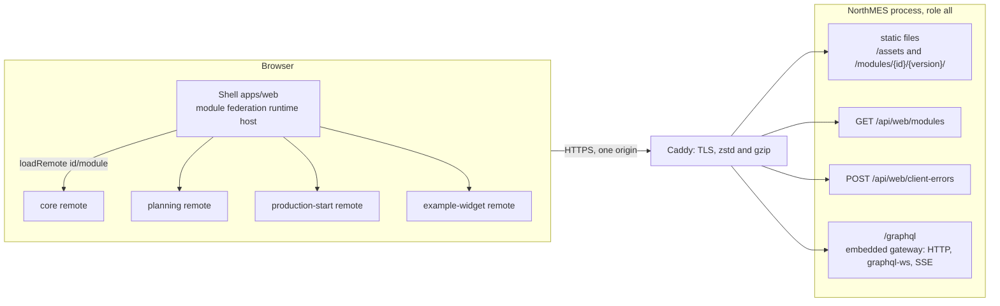
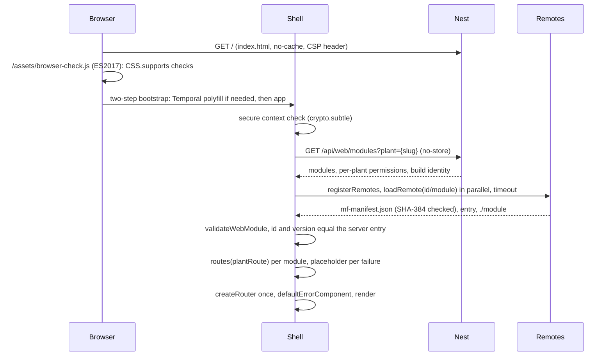
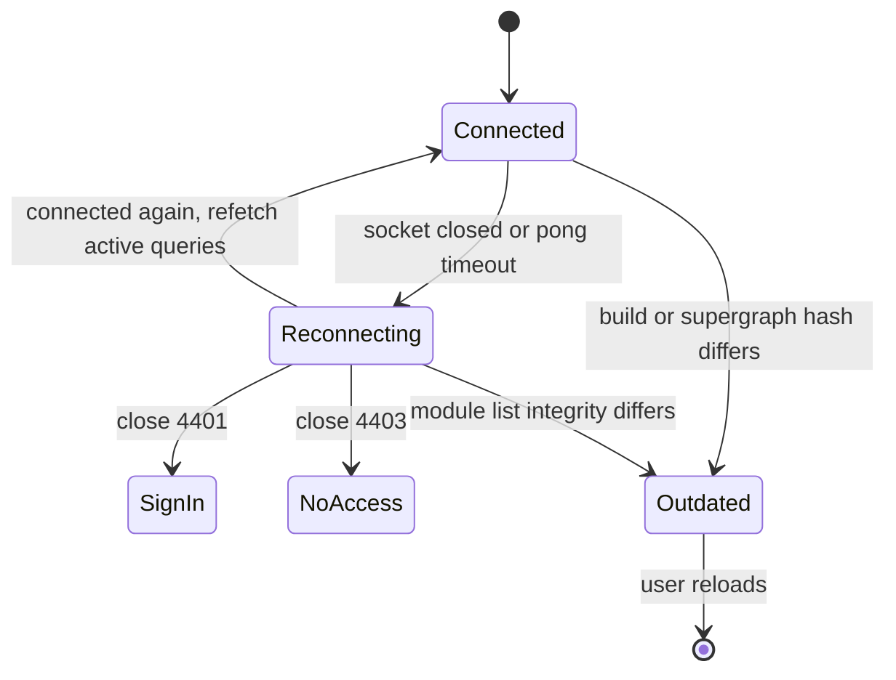
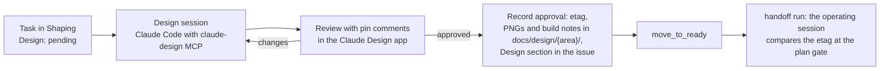

# Web and UX

The NorthMES web app is one browser shell (`apps/web`) that loads one React remote per module at run time through Module Federation. The shell is a pure `@module-federation/runtime` host: it asks the server which remotes the user may load, registers them, validates each against the `defineWebModule` contract and builds one TanStack Router route tree from the routes the remotes return. React, the router, Apollo Client, `@northmes/web-sdk` and `@northmes/ui` are shared singletons that the shell provides and no remote bundles. In-repo remotes ship no CSS; the shell builds one Tailwind stylesheet from their sources. Nest serves the shell and every remote from one origin under a strict content security policy. Screens are built from shared patterns in `@northmes/ui` and `@northmes/web-sdk` (data table, entity list, detail page with a History tab, forms, settings, page states) and from the master-data kit. The whole app targets WCAG 2.2 AA, and the planning board meets 2.5.7 and 2.5.8 with non-drag move paths and cluster targets. Every UI task starts from a design approved in the Claude Design project. This document is the build plan for all of that; the decisions themselves live in the ADRs it links.

## Decisions this document relies on

| ADR | Status | What it fixes for the web app |
|---|---|---|
| [0019 Web shell with React Module Federation remotes](../adr/0019-web-shell-with-react-module-federation-remotes.md) | accepted | Runtime host, remote contract, singletons, CSS rule, plant switch, browser floor |
| [0020 Frontend libraries](../adr/0020-frontend-libraries-tanstack-router-apollo-client-4-shadcn-ui-and-forms.md) | proposed | TanStack Router, Apollo Client 4, codegen, shadcn on Base UI, forms, design tokens |
| [0021 Accessibility target WCAG 2.2 AA](../adr/0021-accessibility-target-wcag-2-2-aa.md) | accepted | Target, shell services, gates, board accessibility |
| [0022 Shared building blocks](../adr/0022-shared-building-blocks-packages-the-master-data-kit-settings-and-generators.md) | accepted | Package map, promotion rule, master-data kit, settings |
| [0018 Realtime subscriptions](../adr/0018-realtime-subscriptions-over-graphql-ws-fed-by-the-event-tail.md) | accepted | Per-plant client, reconnect rules, stale tabs after an upgrade |
| [0016 GraphQL list conventions](../adr/0016-graphql-list-conventions-connections-relations-filter-sort-search-and-group-by.md) | accepted | Connections, filter, sort, search and group by that `DataTable` renders |
| [0037 Plugins](../adr/0037-plugins-drop-in-packages-command-validators-and-ui-slots.md) | accepted | UI slots as versioned contracts, slot rendering rules |
| [0043 Health endpoints and System health](../adr/0043-health-endpoints-graceful-shutdown-and-the-system-health-page.md) | accepted | Browser errors reach the server |
| [0035 AI provider port](../adr/0035-ai-provider-port-with-customer-configured-providers.md) | accepted | Chat panel accessibility and disclosure text |
| [0024 Time](../adr/0024-time-utc-instants-plant-wall-clock-temporal-and-the-clamp-resolver.md) | proposed | Time scalars, plant time display, Temporal bootstrap |
| [0023 SI units](../adr/0023-si-units-with-a-northmes-unit-catalog.md) | accepted | Unit-aware number input and unit arguments |
| [0053 Translation](../adr/0053-translation-english-first-general-translation-later.md) | accepted | English first, plain-string labels, `lang` on master data text |
| [0011 Principals, credentials and same-origin rules](../adr/0011-principals-credentials-and-same-origin-rules.md) | proposed | CSRF header, WebSocket close codes |
| [0030 A planning board built in house](../adr/0030-a-planning-board-built-in-house.md) | proposed | Board and job order table view |
| [0033 Online operator station](../adr/0033-online-operator-station-in-the-production-start-module.md) | accepted | Station mount, targets, idle warning |
| [0038 Versions and releases](../adr/0038-versions-and-releases-lockstep-0-x-release-please-api-reports.md) | accepted | Shared version checks, API reports for MIT packages |
| [0049 Delivery workflow](../adr/0049-delivery-workflow-handoff-thin-vertical-slices-and-claude-design-per-task.md) | accepted | Claude Design per task, approval by etag |
| [0044 On-prem deployment with mandatory TLS](../adr/0044-on-prem-deployment-with-docker-compose-and-mandatory-tls.md) | accepted | HTTPS for every browser |

A task that implements part of this document moves to Ready only when every ADR it links is accepted with no open confirmation (see [13-delivery-and-github.md](13-delivery-and-github.md)).

## Terms

- Shell: the host app in `apps/web` (AGPL-3.0-or-later). It owns the page frame, a handful of its own routes and the shell services. It holds no module screens.
- Remote: one module's web package, `@northmes/<id>-web`, built with Vite and `@module-federation/vite` and loaded by the shell at run time. It exposes one entry, `./module`.
- Module id: the kebab-case id from the module's `defineModule` manifest (for example `production-start`). The remote's name, its URL segment and its route path derive from it. See [03-modules-and-extensibility.md](03-modules-and-extensibility.md).
- Slot: a typed, versioned place in a screen that its owning module renders and other modules fill (`planning/board/side/v1`). A contribution is one module's entry in a slot.
- Closure schema: the GraphQL schema composed from a web package's own module and its `dependsOn` closure. A remote's typed documents are generated against it, so a screen cannot select a field from a module it does not depend on.
- Plant route: the route `/$plant`, where `$plant` is the plant slug, unique per company. Every planner screen sits under it.

Domain words (production order, job order, equipment, operation) follow [GLOSSARY.md](../../GLOSSARY.md). The UI label for a job order is "Job".

## Architecture overview



The shell, `/graphql`, `/api` and every remote share one origin. There is no CORS, and the session cookie works on every request and on the WebSocket upgrade. Nest serves the files from the `api` role (role `all` on the pilot); there is no `web` role, no server-side rendering and no TanStack Start ([0019](../adr/0019-web-shell-with-react-module-federation-remotes.md), [0002](../adr/0002-modular-monolith-with-module-owned-schemas-and-process-roles.md)). GraphQL and realtime are described in [05-graphql-and-apis.md](05-graphql-and-apis.md); deployment and TLS in [12-operations-and-security.md](12-operations-and-security.md).

## The shell as a pure runtime host

### What the shell is

- A Vite single page app with code-based TanStack Router routes. It runs no federation build plugin. It creates one `@module-federation/runtime` instance, hands its own copies of the shared packages to it with `registerShared`, and loads remotes listed by the server with `registerRemotes` and `loadRemote`.
- Because the shell runs no federation plugin, it scans no package exports. That removes the cause of the earlier white page, where share proxies were built from scanned barrel exports and the shell and remotes ended up with separate React contexts.
- The React Compiler runs through its Babel preset in the shell and in every remote ([0020](../adr/0020-frontend-libraries-tanstack-router-apollo-client-4-shadcn-ui-and-forms.md)).
- The shell entry is a two-step bootstrap: it awaits the conditional Temporal polyfill import, then imports the app ([0024](../adr/0024-time-utc-instants-plant-wall-clock-temporal-and-the-clamp-resolver.md)). No other web code imports `temporal-polyfill`.

The federation setup, as tested in the web spike (internal research note 19):

```ts
// apps/web/src/federation.ts (AGPL)
import * as ApolloClient from "@apollo/client";
import * as ApolloReact from "@apollo/client/react";
import { createInstance } from "@module-federation/runtime";
import * as Ui from "@northmes/ui";
import * as WebSdk from "@northmes/web-sdk";
import * as Router from "@tanstack/react-router";
import * as React from "react";
import * as ReactDOM from "react-dom";
import * as JsxRuntime from "react/jsx-runtime";

const provided = {
  react: React, "react-dom": ReactDOM, "react/jsx-runtime": JsxRuntime,
  "@tanstack/react-router": Router,
  "@apollo/client": ApolloClient, "@apollo/client/react": ApolloReact,
  "@northmes/web-sdk": WebSdk, "@northmes/ui": Ui,
};

export const mf = createInstance({
  name: "northmes_shell",
  remotes: [],
  plugins: [diagnostics, manifestIntegrity, retryPlugin],
});
mf.registerShared(Object.fromEntries(Object.entries(provided).map(([key, mod]) => [key, {
  version: SHARED_VERSIONS[key], // injected at build time from the installed package.json files
  scope: "default",
  lib: () => mod,
  shareConfig: { singleton: true, requiredVersion: false },
}])));
```

`diagnostics` is a runtime plugin on `errorLoadRemote` that records the lifecycle stage of a failure. `manifestIntegrity` is a runtime plugin on the `fetch` hook that computes the SHA-384 of each `mf-manifest.json` and compares it with the `integrity` value from the module list. `retryPlugin` is `@module-federation/retry-plugin` with its cache-busting query for manifest and entry retries.

### Shell routes and mount points

The shell owns a few code-based routes of its own and two mount points for remotes:

| Route | Owner | Purpose |
|---|---|---|
| Root layout | shell | Landmarks, skip link, top bar, sidebar, live regions outside `#root` |
| Sign-in | shell | Better Auth sign-in for planners and admins |
| `/$plant` | shell | Plant layout; resolves the slug; an unknown slug is NOT_FOUND, never a default plant ([0007](../adr/0007-tenancy-company-plants-and-the-scope-tree.md)) |
| `/$plant/<id>/...` | remote `<id>` | Each module owns `/$plant/<id>/*` and nothing else |
| `/station/$stationId` | shell layout, production-start remote | Full-screen station layout without sidebar ([09-operator-station.md](09-operator-station.md)) |
| Status route | shell | Minimal status page that still renders when the core remote fails, because System health lives in the core remote |
| "All pages" index | shell | Lists every route title (WCAG 2.4.5), built from the same titles as the route suite |
| `/$plant/<id>/$` placeholder | shell | Added for each module that failed to load |

Remotes return code-based route subtrees from `routes(plantRoute)` and, for the station, `stationRoutes(stationRoute)`. Screens inside a module are lazy (`lazyRouteComponent`), and their chunks load from the remote's own path on first navigation. TanStack Router builds its route tree once, when the router is created, so a change in the set of loaded modules means a full page load.

### Boot sequence



1. `index.html` ships a static `main` with an `h1` "Loading NorthMES" and a status line, so a failed boot still leaves a heading and text. A boot error renders as a heading plus text.
2. `/assets/browser-check.js`, an external ES2017 file, checks `CSS.supports` for `color-mix()` and `@property`. On an unsupported browser it shows a plain page naming the browser and the minimum version, and loads no other script.
3. The shell checks for a secure context. Without one, `crypto.subtle` is missing and the manifest hash check cannot run; the shell says plainly that NorthMES needs HTTPS and reports stage `insecure-context` (see [Failure handling](#failure-handling)).
4. The shell fetches `/api/web/modules?plant=<slug>` and registers every listed remote.
5. It loads all remotes in parallel. The load timeout is 10 s for the planner layout and 30 s for the station layout, with a loading indicator per remote after 2 s.
6. It validates each module object with `validateWebModule` and checks that its id and version equal the server's entry. The shell does no range check of its own; the server already filtered on the range ([0038](../adr/0038-versions-and-releases-lockstep-0-x-release-please-api-reports.md)).
7. It calls `routes(plantRoute)` for each valid module and checks that the returned route's path equals the module id. Each failed module gets a placeholder route and an "(unavailable)" menu entry at its usual position.
8. It creates the router once with `defaultErrorComponent`, then renders.

### Plant switch

The plant is in the URL and in a header on every request; it is never stored on the session, so a planner can keep two plants open in two tabs ([0007](../adr/0007-tenancy-company-plants-and-the-scope-tree.md)). The plant switcher is a menu of links (WCAG 3.2.2) and lives in the shell only. On a plant change the shell fetches `/api/web/modules?plant=<new>`:

- If the set of module ids and versions differs, it does a full navigation with `window.location.assign`.
- Otherwise it swaps the permission set and the per-plant Apollo client. The `$plant` route renders the client provider for its plant; the old client is stopped and disposed.

Nav items and slot contributions filter on the current plant's permissions ([0019](../adr/0019-web-shell-with-react-module-federation-remotes.md)).

### Shell layout

- Top bar: breadcrumb, a page actions slot that remotes fill through the `TopBarActions` portal from `@northmes/ui`, the live-updates status, one help menu at a fixed place (WCAG 3.2.6) and the user menu. Modules add entries to the help menu and never add their own top-level help.
- Sidebar: core items first, then module items, then plugins in their own section, in the stable order the manifests declare (`order` is required, WCAG 3.2.3). Order never follows usage.
- One shell aside slot, where the AI chat panel mounts so it survives route changes. At most one panel docks beside `main`; below about 640 px the chat panel opens as a modal sheet ([0035](../adr/0035-ai-provider-port-with-customer-configured-providers.md), [10-ai-and-agents.md](10-ai-and-agents.md)).
- One `Toaster`, one dialog stack, and `aria-busy` on `main` while a route loads.

## The remote contract

### `defineWebModule`

Each remote exposes exactly one entry, `./module`, whose default export is the value of `defineWebModule`. The types live in MIT `@northmes/web-sdk`:

```ts
// packages/web-sdk/src/contract.ts (MIT)
export interface WebModule {
  readonly id: string;               // equals the manifest id and the URL segment
  readonly version: string;          // equals the manifest version
  readonly northmesRange: string;    // for example ">=0.4.0-0 <0.5.0-0"
  readonly permissions: readonly string[];
  routes?(parent: PlantRoute): AnyRoute;            // subtree under /$plant/<id>; absent for a contribution-only plugin
  stationRoutes?(parent: StationRoute): AnyRoute;   // production-start only in release 1
  readonly nav: readonly NavItem[];                 // { id, label, to, permission?, order? }
  readonly widgets: readonly SlotContribution[];    // contributions to slots other modules own
  readonly typePolicies?: TypePolicies;             // merged into each per-plant Apollo client
}

export interface SlotContribution<S extends SlotId = SlotId> {
  readonly id: string;               // "example-widget.large-orders"
  readonly slot: S;                  // "planning/board/side/v1"
  readonly label: string;            // required; names the section the shell renders
  readonly order: number;
  readonly permission: string;
  readonly component: ComponentType<SlotProps[S]>;
}
```

`validateWebModule(value, expectedId)` returns a list of errors and fails on: a missing default export, an id other than the expected one, non-string `version` or `northmesRange`, `routes` that is not a function, non-array `nav`, `widgets` or `permissions`, and a contribution without `label`.

### Rules the shell and CI enforce

| Rule | Enforced by |
|---|---|
| A module owns `/$plant/<id>/*` and nothing else | Shell boot check: the returned route path equals the id |
| Id, version and range in `defineWebModule` equal the backend manifest | Build check in `@northmes/web-build` ([0003](../adr/0003-module-package-shape-and-the-definemodule-manifest.md)) |
| Every `nav[].to` matches a route in the module's own tree | Vitest test per remote |
| Every leaf route has a title | Per-remote Vitest harness that walks `module.routes(plantRoute)` ([0021](../adr/0021-accessibility-target-wcag-2-2-aa.md)) |
| Labels are plain strings, never React nodes | Contract types; a later command palette and translation read them |
| A contribution's slot belongs to a module in the contributor's `dependsOn` closure | Boot catalog check and the shell's acceptance check against the module list ([0037](../adr/0037-plugins-drop-in-packages-command-validators-and-ui-slots.md)) |
| A remote queries only fields of its own module and its `dependsOn` closure | Codegen per web package against its closure schema |
| Changing a slot's props adds `v2` and keeps `v1` for one deprecation window | CI check that fails when a slot id from the previous release's snapshot disappears |

### Routes and typed links

- `screenRoute({ parent, path, title, nav, permission, component })` from `@northmes/web-sdk` wraps `createRoute`. It stores the title in `staticData` and sets the page `head`, declares the nav entry, checks the permission before load, and sets pending and error components. Route, title and nav entry are one declaration.
- `@northmes/web-sdk/routes` exports `createShellRoutes()` and the types `RootRoute`, `PlantRoute` and `StationRoute`. The shell calls the function once; modules use only the types.
- Each module has a type-only `register.ts` that declares TanStack Router's `Register` for "the shell skeleton plus my own subtree". Links and `useParams` inside a module are then typed; the spike showed that unknown paths and missing params fail typecheck.
- Links to another module's screens cannot be typed that way, because no TypeScript program sees every route. A module that wants to be linked to exports small pure link helpers from its MIT contracts package, for example `planningLinks.order(plant, orderId)` returning a string ([0003](../adr/0003-module-package-shape-and-the-definemodule-manifest.md)).

### Remotes in release 1

One remote per module that has screens: `core` (master data, settings, System health), `planning` (board, job order table view, orders, proposal review), `production-start` (station routes and a panel in planning's order slot), and one for the `example-widget` plugin, which contributes to `planning/board/side/v1`. The backend validator example plugin has no remote. See [Open points](#open-points) for the UI of the Pyramid connector and the AI provider settings.

Slot ids follow `<module>/<area>/<name>/v<N>`. Known release 1 slots:

| Slot id | Owner | Contributors in release 1 |
|---|---|---|
| `planning/board/side/v1` | planning | `example-widget`; props carry `plantId` and `paused` |
| `planning/order/panels/v1` | planning | production-start |
| `planning/board/block-fields/v1` (proposed id) | planning | core fields, the Pyramid connector and plugins through `BoardFieldSlot`; pure text and icon fields with `accessibleText`, rendered on every block, see [07-production-planning.md](07-production-planning.md) |
| `planning/board/header/v1` (proposed id) | planning | the Pyramid connector ("Pyramid data as of <time>") |
| Shell aside slot | shell | AI chat panel |

Slot prop types stay in `@northmes/web-sdk` in release 1, so a plugin types its contribution without importing AGPL code.

## Shared singletons

| Share key | Why one instance |
|---|---|
| `react`, `react-dom`, `react/jsx-runtime` (`react/jsx-dev-runtime` in dev) | Hooks and the renderer |
| `@tanstack/react-router` | Route objects a remote creates must belong to the shell's router |
| `@apollo/client`, `@apollo/client/react` | One normalized cache; `ApolloProvider` context lives in the `react` subpath |
| `@northmes/web-sdk` | Shell context (plant, user, permissions), client factory, slots, `announce()` |
| `@northmes/ui` | Contexts for top bar portal, toasts, dialogs and tooltips; components that match the shell stylesheet |

Rules:

- Every remote declares every share as `{ singleton: true, import: false, requiredVersion: false }`. A remote never bundles a fallback and fails loudly when the shell does not provide a share.
- One list, `packages/web-build/shared.mjs`, feeds the shell and every remote config. A unit test asserts that the shell's `registerShared` keys equal that list.
- Every subpath is a separate share key. A remote that imports an unshared subpath silently gets a private copy (the spike reproduced this with `@apollo/client/cache`). Shared web packages are single-entry, export every name explicitly (Biome `noReExportAll` as an error) and add no new share keys ([0022](../adr/0022-shared-building-blocks-packages-the-master-data-kit-settings-and-generators.md)).
- The `northmes:no-bundled-singletons` guard in `@northmes/web-build` fails a remote build when any chunk contains a module from a singleton package, from `packages/web-sdk/src`, from `graphql`, or from a package on the forbidden-bundle list. That list derives from `@northmes/ui`'s own dependencies (sonner, the primitive library, floating-ui, react-hook-form and the rest), so a remote reaches those only through `@northmes/ui` exports.
- `@module-federation/vite` is pinned exactly; every shared and federation package is in the strict pnpm catalog with `overrides` that point the singletons at the catalog. Renovate's `minimumReleaseAge` is strict for the Module Federation packages, and upgrades run on a branch with the contract suite ([0050](../adr/0050-github-organization-rulesets-ci-runners-and-supply-chain.md)).
- `/api/web/modules` checks each remote's shared versions: react the same major and not newer, router and Apollo the same minor, `@northmes/web-sdk` and `@northmes/ui` the same 0.minor. A committed N-1 build of the widget plugin loads in Playwright on pull requests that touch the singleton list or the federation packages ([0038](../adr/0038-versions-and-releases-lockstep-0-x-release-please-api-reports.md)).
- Remotes set `dts: false` and do not use `@module-federation/bridge-react`; remote components render inside the shell's own React tree.

Kept for after the pilot: the experimental external runtime, the DTS plugin, import-map integrity for every chunk, a service worker, enabling plugins without a page reload, and the Rsbuild build path. The Rsbuild path is the tested exit if the Vite plugin fails: the shell reads only `mf-manifest.json`, so a remote can switch bundler without a shell change.

## CSS rules

The spike reproduced the reason for these rules: a remote's own unprefixed Tailwind sheet loaded after the shell's sheet redeclared `.hidden` in the same layer and broke the shell's `md:flex`. Each later remote could break every earlier one.

- In-repo remotes (`modules/*/web`) import no stylesheet and emit no CSS. A build check fails when one emits CSS bytes; an empty import still produces a 0-byte file, so the rule is "import no stylesheet".
- The shell builds one Tailwind sheet. `pnpm gen` writes `apps/web/src/styles/sources.gen.css` with one explicit `@source` directory per remote's workspace dependency closure plus `packages/web-sdk/src`. It never scans built `dist` JS. Wildcard directory segments are not used, because Tailwind matched nothing for `modules/*/web/src` in the spike.
- Dynamic class names are banned by a review rule. Palette classes go through `@source inline()`. Board block colors are a CSS variable, not a class per color.
- Anything built through the plugin path (the examples and customer plugins) ships a sheet with a plugin prefix and no preflight, with tokens mapped from the shell's CSS variables. A check requires every utility selector in a plugin sheet to carry its prefix.
- Design tokens are CSS variables in `@northmes/ui`. Module styling uses tokens and components; a pattern check rejects raw color classes and status palette utilities in module web sources.
- `forced-color-adjust: none` appears only in the color swatch components; a CI grep fails on any other use.

CSS and the content security policy:

- `style-src 'self'` blocks runtime style injection. sonner gets a pnpm patch that removes its runtime style insertion, and its CSS joins the `@northmes/ui` sheet; a unit test fails if the installed sonner contains `__insertCSS(`.
- The app is wrapped in Base UI's `CSPProvider` with `disableStyleElements`, and the shell sheet carries Base UI's scrollbar rules.
- A Playwright CSP fixture records `securitypolicyviolation` events, shows a toast and opens each overlay, and fails on any violation.

## Serving and the module list endpoint

### Files and cache headers

| Path | Cache-Control | Notes |
|---|---|---|
| `/` and the SPA fallback (`index.html`) | `no-cache` | Carries the CSP header |
| `/assets/**` (shell build) | `public, max-age=31536000, immutable` | Content-hashed |
| `/modules/<id>/<version>/mf-manifest.json`, `mf-stats.json`, `remoteEntry.js` | `no-cache` with ETag | Fixed names |
| `/modules/<id>/<version>/**` (other files) | `public, max-age=31536000, immutable` | Content-hashed |

Nest mounts each installed module version with `useStaticAssets` and `fallthrough: false`, so a missing file under a module path is a 404, never the shell's HTML. The SPA fallback route refuses `/modules/` and `/assets/` paths. In the image, files live under `web/shell/` and `web/modules/<id>/<version>/`. Caddy encodes zstd and gzip.

The content security policy for the shell:

```text
default-src 'self'; script-src 'self'; style-src 'self'; connect-src 'self';
img-src 'self' data:; object-src 'none'; base-uri 'self'; frame-ancestors 'none'
```

The runtime loads ES module entries with plain `import()` and needs neither inline scripts nor `new Function`. CSP violation reports go to `/api/web/client-errors`.

### `GET /api/web/modules`

The shell takes remote URLs only from this endpoint, never from query parameters or storage. The response is sent with `Cache-Control: no-store`. It lists only modules that are installed, enabled, compatible with the running NorthMES version and permitted for the user at that plant.

| Field | Meaning |
|---|---|
| `modules[].id`, `version` | Module id and version; the shell checks the loaded module against them |
| `modules[].remoteName` | Federation name derived from the id by the same function the remote config uses; it contains no hyphen |
| `modules[].manifestUrl` | `/modules/<id>/<version>/mf-manifest.json` |
| `modules[].integrity` | `sha384-...` of the manifest, or `null` when the server marked the module degraded |
| `modules[].label`, `order` | From the backend manifest, so a failed module keeps its menu entry and position |
| Per-plant permissions | The permission set of the user at this plant, used by nav items, contributions and `can()` in the shell |
| Build identity | Version and supergraph hash, compared on reconnect to detect an upgrade |

The `id`, `version`, `remoteName`, `manifestUrl` and `integrity` shape ran in the spike. The other fields come from later decisions; the task that builds the endpoint fixes their names.

At boot the server reads every installed `mf-manifest.json` and checks that each file it lists exists. A missing file marks the module degraded with `integrity: null`, logs `web.asset_missing`, and shows on System health ("planning: 1 missing file").

### Browser errors reach the server

`POST /api/web/client-errors` is authenticated, same-origin, rate-limited and capped at an 8 kB body. It takes `{ moduleId, moduleVersion, stage, code, messageTemplate, route, fingerprint }`, where `stage` is one of `manifest`, `entry`, `validate`, `render`, `slot`, `chunk`, `csp` or `insecure-context`. Rows land in a core table on the audit no-trigger list, grouped by fingerprint with counts, and System health shows them ([0043](../adr/0043-health-endpoints-graceful-shutdown-and-the-system-health-page.md)). Reporters:

- `createRoot` with `onCaughtError` and `onUncaughtError`.
- Window `error` and `unhandledrejection` handlers. `moduleId` comes from the catching boundary or from a stack URL under `/modules/<id>/<version>/`.
- The federation diagnostics plugin, the route error component and each slot boundary.

Nothing leaves the installation. Error telemetry to the project is opt-in and built later ([0052](../adr/0052-error-telemetry-opt-in-and-deferred.md)).

## Data access from screens

### Apollo Client per plant

`createNorthmesClient({ plantId })` in `@northmes/web-sdk` returns one Apollo Client 4 per plant ([0018](../adr/0018-realtime-subscriptions-over-graphql-ws-fed-by-the-event-tail.md)):

- An HTTP link with the plant constant in `x-northmes-plant`, the CSRF header `x-northmes-csrf` ([0011](../adr/0011-principals-credentials-and-same-origin-rules.md)), the client build header `x-northmes-client-build`, and a client time header the server uses to measure clock skew.
- Its own graphql-ws client. Subscriptions take their plant from a `plantId` argument; nothing goes in `connectionParams`. SSE on the same endpoint is the transport for a site that blocks WebSockets, through a fetch-based client that can send the CSRF header.
- The error link, the merged `typePolicies` of the loaded remotes, and data masking on.

The normalized cache is the only GraphQL cache; there is no TanStack Query. Instants stay ISO strings in the cache. A paged table needs no field policy, because every argument is part of the store key. An infinite list uses `relayStylePagination(["filter", "orderBy", "search"])`. After a mutation or an event that touches a listed id, a screen refetches its active list query.

Route loaders preload with Apollo's `createQueryPreloader`. Operations live in `.graphql` files next to the screen. GraphQL Code Generator with `typescript-operations` and `typed-document-node` writes one typed-document file per web package from its closure schema, with const enums. There are no generated hooks; screens call Apollo's hooks with typed documents and read fragments with `useFragment`. `@unmask` is allowed where the board needs raw speed.

### Live data, reconnects and upgrades



- graphql-ws settings: `retryAttempts: Infinity`, `retryWait` capped at 10 s with jitter, `shouldRetry` false for close codes 4400, 4401 and 4403, `keepAlive: 10000`, and a pong timeout that closes with 4499 after 5 s. The library defaults gave up after about 31 to 46 s, which every upgrade exceeds.
- After a reconnect the client refetches every active query and compares the `/api/web/modules` versions and integrity with its boot values.
- While reconnecting, the top bar shows "Live updates paused, reconnecting" through the polite live region. The board's Pause control shares that state, and board moves are disabled while the socket is disconnected ([0029](../adr/0029-per-planner-drafts-soft-locks-and-the-plan-revision.md)).
- Close code 4401 sends the user to sign-in. Close code 4403 shows an access message.
- The gateway returns `x-northmes-build: <version>+<supergraphHash>` on every response and in the graphql-ws `connection_ack` payload, and rejects a mutation whose `x-northmes-client-build` differs with `core.client_outdated`. Queries pass.
- A blocking reload dialog opens on a build mismatch, on `GRAPHQL_VALIDATION_FAILED`, on a failed dynamic import, and on a changed supergraph hash or manifest integrity in `/api/web/modules`. While it is open, the link refuses mutations on the client. Stations reload by themselves only when no form holds unsent input.

## Failure handling

| Failure | What the user sees | Reported as | Test |
|---|---|---|---|
| Unsupported browser | Plain page naming the browser and the minimum version | none | `browser-check.js` with `CSS.supports` mocked false renders the message and loads no other script |
| Plain HTTP | Message that NorthMES needs HTTPS | stage `insecure-context` | Playwright on an HTTP origin |
| Remote files missing, manifest 404, hash mismatch | "(unavailable)" menu entry at its usual position, placeholder route with title "Production start unavailable · Plant A · NorthMES" and one focused `h1` showing stage and code | stage `manifest`; server log `web.asset_missing` | Degraded-path specs: one module's files missing, one wrong manifest hash; sidebar order equals a run with all remotes present |
| Slow remote | Per-remote loading indicator after 2 s; retry with a new request; placeholder only after the timeout (10 s planner, 30 s station) | stage `manifest` or `entry` on final failure | production-start delayed 12 s: no placeholder at 10 s on the station mount |
| `./module` throws or fails validation | Placeholder for that module, the rest works | stage `entry` or `validate` | Module throwing at evaluation produces a client error row within 2 s |
| Remote screen throws | `defaultErrorComponent` with a title and `h1`; header and menu stay | stage `render` | Playwright |
| Lazy chunk missing (tab older than the installed version) | Reload dialog | stage `chunk` | `stale-tab.spec.ts` |
| Core remote broken | Shell status route still renders | stage `entry` | Core remote deleted |
| Slot contribution throws | Fallback inside that contribution's frame, with a role and accessible name; focus moves to it when focus was inside the widget; selecting another entity resets it | stage `slot` | Fixture widget that throws for one order and rejects a promise for another |
| Socket lost | "Live updates paused, reconnecting"; moves disabled | none | `reconnect-after-outage.spec.ts` |
| Server restarting (502 or 503 from `/graphql` or `/api`) | The top bar shows that the server is restarting through the polite live region, moves and mutations stay disabled, and the shell retries; a full page load gets Caddy's maintenance page. Final English copy comes from design task D2 | none | Nightly Compose: stop `app` with the board open; the shell shows the restarting state, not the route error component, and recovers without a reload after `app` starts |
| Server upgraded while the tab is open | Reload dialog; mutations refused | `core.client_outdated` from the gateway | `stale-tab.spec.ts` |

Each slot contribution renders in its own error boundary, keyed by contribution id with reset keys from the slot's selected entity.

## Dev workflow

- `pnpm dev` runs the one stack script that also serves e2e setup and the handoff demo ([0058](../adr/0058-developer-environment-source-exports-one-stack-script-and-one-gate-command.md)). It starts Postgres from the pinned image through Testcontainers, migrates, seeds a company, a plant, a planner and an operator, and starts Nest (rebuilt by `tsc -b --watch`, restarted after each completed build), the shell's Vite dev server and one Vite dev server per remote.
- Ports come from binding `127.0.0.1:0` and reach the shell proxy and the remotes through environment variables. Nest in dev mode returns the remote dev servers' manifest URLs from `/api/web/modules`. Remote dev servers set `cors: true` and `server.origin`; the shell's dev server proxies `/api`, `/graphql` and `/modules` to Nest.
- Workspace packages export their TypeScript sources through the `@northmes/source` condition, so a fresh worktree needs no build step.
- A remote edit reaches the page through React Fast Refresh across the federation boundary and keeps component state (63 to 230 ms in the spike). An edit to the shell's `main.tsx` reloads the page.
- The `northmes:restart-on-shared-export-change` plugin restarts a remote's dev server when a shared package's entry file changes; the page needs one reload. The shell never restarts.
- A new Tailwind class in a remote file appears without a reload, because the shell's sheet scans the module's source directory.
- `pnpm gen` writes, in a fixed order, the schema snapshots, the closure schema per web package, the typed documents and `sources.gen.css` (database types and reference docs follow). `pnpm gen --check` fails on drift.

If the number of Vite watchers becomes a problem, a `pnpm dev --web <id>` option that runs only named remotes as dev servers and serves the rest from their last build is the planned fallback; it is not built in release 1.

## Shared web packages

All three are MIT, import nothing AGPL, and carry an API Extractor report from the first commit (`@internal` by default, `@beta` for what the example plugins use). Each has a section in the root `AGENTS.md` that states what it owns, what it refuses and its test floor ([0022](../adr/0022-shared-building-blocks-packages-the-master-data-kit-settings-and-generators.md)).

| Package | Owns | Refuses | Shared at run time |
|---|---|---|---|
| `@northmes/web-sdk` | `defineWebModule`, `validateWebModule`, contract and slot prop types, `createShellRoutes` and route types, `screenRoute`, `ShellProvider` and `useShell` (rendered only by the shell), `createNorthmesClient`, `useConnection`, `useListState`, `useCommandForm`, `usePermission` and `<Can>`, `announce()`, `<Slot>` and the slot registry, `formatPlantTime`, `<PlantDateTime>` and `usePlantTime()`, `masterDataRoutes` and `MasterDataLookup` | Module domain logic | singleton |
| `@northmes/ui` | shadcn 4 components on Base UI, tokens and the two-tone focus ring, presentational patterns (see [UI patterns](#ui-patterns)), the form engine `useZodForm`; block and swatch text color through `textColorFor` from `@northmes/contracts` | Apollo, TanStack Router and GraphQL imports, so later MCP Apps views can use it | singleton |
| `@northmes/web-build` | `defineRemoteConfig({ id, version })`, the shared list `shared.mjs`, the browser floor and explicit `build.target`, the `no-bundled-singletons`, no-CSS and restart guards, the `sources.gen.css` generator, plugin build helpers | Run-time code | build time only |

`defineRemoteConfig` names the `./module` expose once and writes it into both the federation config and Rolldown's `input`, so a remote's `vite.config.ts` is two lines. It declares `@module-federation/vite`, `@vitejs/plugin-react` and `@tailwindcss/vite` as dependencies, so it also works outside the workspace.

Import rules for module and plugin web code (Biome `noRestrictedImports`): no direct import of `@base-ui/*` or Radix ([0020](../adr/0020-frontend-libraries-tanstack-router-apollo-client-4-shadcn-ui-and-forms.md)). Forms, tables, toasts and virtualization come through `@northmes/ui` exports. A change to a shared web package is its own task and pull request, ordered before the module tasks that use it.

A composite with a judgement (`DataTable`, `EntityForm`) is promoted to a shared package at the third use, or at the second when both users ship in release 1. The second copy carries `// shared-candidate: #<issue>`, and a copy detector over `modules/*` fails on a third copy unless it is promoted or allowlisted.

## UI patterns

### Patterns in `@northmes/ui`

| Pattern | Release 1 users | Contract |
|---|---|---|
| `PageFrame` | Every screen | Renders the `h1` (`tabindex="-1"`) from the route title outside every data Suspense, a breadcrumb, and actions into the top bar slot |
| `Card` | Every screen | The panel surface; no hand-written panel class strings |
| `DataTable` | Production orders, job order table view, registers, audit admin list, connector import log | Server paging, sort on declared columns, toolbar, row link, states |
| `EntityListPage` | Registers, production orders | `PageFrame` plus `DataTable` plus the four list states |
| `EntityDetailPage` | Production order, registers | Tabs: General, History, slot tabs |
| `HistoryTab` | Production order, registers | Field diffs from the audit trail with labels from the definition |
| `EntityForm`, `useZodForm` | Register forms, settings, connector and AI provider forms | react-hook-form 7 with the Standard Schema resolver |
| `SettingsForm` | Core, planning, connector, AI provider settings | Renders a `defineSettings` schema |
| `StatusBadge` | Order status, archived, connector health | Icon plus text, never color alone |
| `EmptyState`, `LoadingState`, `ErrorState` | Every list and detail | See [Page states](#page-states) |
| `ConfirmDialog` | Archive, break lock, release | Optional or required reason field, focus restore, correct button roles |
| `DateTimeText` | Board detail, lists, history, station | Zone label when the user's zone differs |
| `QuantityInput` | Station report, order quantity | Decimal value; unit restricted to one dimension |
| `ColorSwatchPicker` | Equipment group, equipment | 20-color palette plus any color; text by `textColorFor` |
| `Lookup` | Register references, cross-module pickers | Typeahead plus browse dialog |
| `DefinitionList`, `IdentifierLink` | Detail screens, tables | |
| `HoverCard` | Board block hover, tooltips with content | Opens on hover and on focus; see [Accessibility](#accessibility-wcag-22-aa) |

Primitives follow the accessibility rules below: `Button`, `IconButton` (a required `label` prop, 36 px default), `Field` (label, description and error wired; the description accepts children), `Input`, `NumberField`, `Select`, `Combobox`, `Checkbox` with a 24 px hit area, `Dialog`, `Sheet`, `Menu`, `Tabs`, `Table`, `Tooltip`, `VisuallyHidden`, `SkipLink`, `Toaster`. No component accepts a prop it silently ignores, and coverage includes all of `packages/ui/src`. Not in `@northmes/ui` in release 1: the plant switcher (shell only), timeline primitives (the board only), charts and comments.

### Lists

A list is a Relay connection on the server ([0016](../adr/0016-graphql-list-conventions-connections-relations-filter-sort-search-and-group-by.md), [05-graphql-and-apis.md](05-graphql-and-apis.md)). On the web:

- `useListState(listDefinition)` builds the route's `validateSearch` schema from the list declaration in the module's contracts package and strips defaults from the URL. URL parameters: `q` (search), one key per filter field (`status=planned,active`, `deadline=2026-10-01..2026-10-31`, `customer=<id>`), `sort=deadlineAt,-priority`, `group=status`, `size=50`, `after` or `before` (the opaque cursor) and `archived=1`. It returns valid values with defaults, the GraphQL variables, `setFilter`, `setSort`, `setGroup`, `next`, `previous` and `clear`. Any change to filter, sort, search or size drops the cursor.
- `useConnection(document, variables)` runs the query with `errorPolicy: "all"`, turns relation-path `NOT_FOUND` and `FORBIDDEN` errors into cell states, and returns rows, `pageInfo`, `totalCount`, `aggregates` and groups.
- `DataTable` uses TanStack Table v9 with manual sorting, paging, filtering and grouping, so the server does all four. Keyset paging shows Previous and Next, not page numbers; "Rows 51 to 100 of 500" comes from a page counter in the URL plus `totalCount`. Sortable headers come from the codegen const enum `<T>SortField` and set `aria-sort`. Lists without `totalCount` (append-only lists such as the audit list) show Previous and Next only.
- Group by: the toolbar's "Group by" picks one `<T>GroupBy` value; the table renders group rows from `groupedAggregates` (key, count, sums), and expanding a group loads its rows with the key added to the filter. Filter chips show counts from the same `groupedAggregates` call.
- Search is trimmed and at most 100 characters; page size is 1 to 100 with 25 as default. These limits come from the server; the UI does not offer other values.

### Detail pages and the History tab

`EntityDetailPage` renders General, History and slot tabs (Comments come later). A hidden or unknown entity shows the not-found state, because owners throw a typed `NOT_FOUND`. `HistoryTab` reads the audit trail's field diffs for record-class tables only, filtered by the reader's field permissions, with labels from the entity's definition ([0013](../adr/0013-audit-trail-written-in-the-command-transaction.md)). Draft tables and operational logs have no History tab.

### Forms

- `useZodForm` (in `@northmes/ui`) binds react-hook-form to a Zod contract. `useCommandForm({ contract, mutation, toInput, optimistic? })` (in `@northmes/web-sdk`) binds it to a command mutation: it maps `fieldErrors` and DomainError details to fields, keeps entered values after a server error (WCAG 3.3.7), announces success, and accepts an optional `optimisticResponse`. Station mutations never use `optimisticResponse`.
- Every input goes through `Field`, which wires label, description, `aria-invalid` and `aria-describedby`. On submit an error summary at the top receives focus and links to each field. Messages state the rule and the fix ("Scrap can be at most 37, the remaining quantity").
- Labels carry units ("Good quantity (pcs)"). Date and cycle time fields show a format hint.
- Updates send `expectedVersion`; `core.version_conflict` shows an inline conflict message with a way to reload the entity, and the entered values stay.
- Every mutation accepts the shared optional reason input. `ConfirmDialog` asks for a reason where the command requires one (break lock: 3 to 500 characters).
- Create-type commands send a client-generated uuidv7 id, so a retry after a restart is harmless.

### Settings

Settings are `defineSettings` Zod schemas in a module's contracts package, stored at company and plant scope in audited tables and rendered by `SettingsForm` ([0022](../adr/0022-shared-building-blocks-packages-the-master-data-kit-settings-and-generators.md)). Every field needs a label and a description in its schema metadata; a field without them is refused at boot. A module's settings page lives in that module's remote, because dependencies point toward core and core cannot import another module's contracts. Behaviour switches that look like infrastructure, such as enabling `/mcp` or a connector's live write-back, are settings commands in this same UI, never environment variables.

### Page states

| State | Component | Content |
|---|---|---|
| Loading | `LoadingState` | Skeleton that matches the populated layout, rendered by the same component as the populated state; `main` carries `aria-busy` |
| First run | `EmptyState` | The action that creates the first item |
| Filtered empty | `EmptyState` | "Clear filters" |
| Not found | `EmptyState` | "Back to <list>" |
| Forbidden | `EmptyState` | What permission is missing, without data |
| Error | `ErrorState` | Text error with the correlation id and a way out |

Every data-bound region designs and tests all of its states.

### Time and units

- `formatPlantTime` formats instants in the plant zone and adds the short zone name when the offset differs from the hour before or after (DST). Screens show plant times with a zone label when the user's zone differs. A lint fails on `Intl.DateTimeFormat` without `timeZone` ([0024](../adr/0024-time-utc-instants-plant-wall-clock-temporal-and-the-clamp-resolver.md)).
- Date and time inputs take plant-local values and are labelled with the zone. Only the server turns a local date-time into an instant.
- Metric values arrive from GraphQL in the unit a screen asks for through the field's unit argument (for example `cycleTime(unit: PIECES_PER_HOUR)`). The unit-aware number input sends the value with its unit, and the server converts ([0023](../adr/0023-si-units-with-a-northmes-unit-catalog.md)). Display decimals come from the unit catalog. Article quantities show in the article's stock unit.

## Master-data kit UI

One `defineMasterData` definition in a module's MIT contracts package yields the register's GraphQL types and list, the form, the picker and the lookup ([0022](../adr/0022-shared-building-blocks-packages-the-master-data-kit-settings-and-generators.md)). The web side:

- `masterDataRoutes(definition, overrides)` returns the list, detail and create and edit routes as `screenRoute` entries, so title, nav entry and permission come with them.
- List: `EntityListPage` with `DataTable`, columns, search, filters and sorts from the definition's list declaration, and an archived toggle (`archived=1`, `includeArchived` on the server).
- Detail: `EntityDetailPage` with General (sections from the definition), History and slot tabs.
- Form: `EntityForm` from the definition's fields, with `ui` hints from field metadata (`textarea`, `swatch`). Codes are unique per scope; the server's `core.code_taken` maps to the code field.
- Archive and restore: `ConfirmDialog` with an optional reason. Writes to an archived row return `core.archived`, shown as a conflict.
- Picker: `<MasterDataLookup definition={tool} />`. Another module renders it with the owner's generated lookup documents from the owner's contracts package, so no module writes its own picker.
- Translatable names use `localizedText`; the form edits the name and its translations, and lists render the resolved name with `lang` (see [Language](#language)).

The kit is built with equipment groups and tools first, because they differ in fields and allowed scope levels. Further release 1 registers are warehouses, customers and equipment. Escape levels are documented and counted: 0 changes the definition, 1 adds fields, commands, tabs or row actions, 2 replaces one screen with `masterDataRoutes(def, { list: ToolList })`, 3 leaves the kit. If three of the first five registers need level 2 or 3, the kit is reworked before more registers use it. Articles, routings, operation equipment and calendars are not registers; they use `EntityListPage`, `EntityDetailPage` and the command forms directly.

## Accessibility: WCAG 2.2 AA

The shell, every remote, the board and the station target WCAG 2.2 AA, plus EN 301 549 V4.1.1 clauses 9.7 (user preferences) and 12.3 (accessibility documentation) for public tenders ([0021](../adr/0021-accessibility-target-wcag-2-2-aa.md)). Conformance covers full pages, so a plugin's slot content is part of the page; plugins must pass the same suite, and the conformance statement covers core modules only.

### Shell services

- `<html lang="en">`, landmarks (`header`, `nav`, `main`, `aside`) and a "Skip to main content" link as the first focusable element (2.4.1).
- Page titles in the form "Planning board · Plant A · NorthMES", specific part first (2.4.2). `screenRoute` requires a title. Placeholder routes, the error component and the reload dialog have a title and an `h1`.
- Focus on route change (2.4.3): on `onRendered` with `pathChanged`, `focusPageHeading` waits one frame, focuses the `h1` and falls back to `main`. Search parameter changes (filters, zoom, `?view=table`) do not move focus.
- Two live regions, polite and assertive, created in `index.html` outside `#root` with explicit `aria-live` and `aria-atomic`, so they keep working while a modal is open and are one DOM singleton across all remotes.
- The help menu (3.2.6), the stable sidebar order (3.2.3) and the "All pages" index (2.4.5).

### Moving board blocks without dragging (2.5.7, 2.1.1)

A keyboard path alone does not meet 2.5.7; a single pointer must also be able to move a block without dragging. These ship in the same increment as dragging ([0021](../adr/0021-accessibility-target-wcag-2-2-aa.md), [07-production-planning.md](07-production-planning.md)):

- Detail panel: clicking a block opens a docked panel with a machine select limited to allowed machines, a start date and time field in the plant zone (labelled with the zone), "Earlier" and "Later" buttons that step one snap slot, and Apply, which goes through the same draft move as a drag.
- Block menu: reachable by click, by the context-menu key and by Shift+F10. It lists Move, Lock or unlock, Break lock and Open order. Every keyboard command on the board also appears there, so letter keys are never the only path. Move opens a dialog that lists every allowed machine; the job order table view uses the same Move dialog.
- Keyboard move mode: `M` on a focused block enters move mode; Left and Right step one snap slot, Up and Down step through allowed machines and skip collapsed groups, Enter commits to the draft, Escape cancels. Focus stays on the moving block. After a commit, focus returns to the block by id.
- Panning and zoom: native scrollbars stay visible; the toolbar has "Earlier", "Later", "Now" and "Go to date"; zoom has buttons next to Ctrl+wheel.
- Pointer cancellation (2.5.2): a drag commits on pointer up, and Escape cancels before release.
- Click-to-place is a cut candidate, because the detail panel and the Move dialog already meet 2.5.7.

The board is an ARIA grid with roving `tabindex`: each machine is a `row` with a `rowheader` and one `gridcell` per block in time order; a machine without blocks in range has one focusable "No jobs in this range" cell; virtualized rows set `aria-rowcount` and `aria-rowindex`; the range extractor keeps the focused row and the move preview's row mounted. Keys: Tab enters at the selected block and leaves the grid; Left and Right move along the row; Up and Down go to the nearest block in time on the adjacent row; Home and End; Page Up and Page Down; Enter opens the detail panel. Blocks hold no interactive elements. Letter commands work only while a board cell has focus (2.1.4).

### Target size (2.5.8)

- Every interactive control is at least 24 by 24 CSS px. A CSS variable `--nm-target-min` (24 px by default, 44 px in the station layout until a glove test on pilot hardware sets the final value) drives every `@northmes/ui` interactive primitive, so shell chrome and plugin panels follow ([0033](../adr/0033-online-operator-station-in-the-production-start-module.md)).
- The shadcn checkbox is 16 px; it gets a 24 px hit area.
- Every board block is at least 24 px tall. A block narrower than 24 px stops being its own target: adjacent narrow blocks merge into one cluster target whose accessible name includes state counts ("4 jobs, 07:00 to 09:10, 2 late, 1 being edited by Alex Lund"). Activating it opens a popover list with one 24 px row per block, each with its own menu and Move action.
- Each machine row header has a "Blocks on this machine" button that lists the row's blocks in the loaded range, as an equivalent control on the same page. The design does not rely on the Essential exception.
- axe's `target-size` rule is disabled by default; the `wcag22aa` tag in the test configuration turns it on.

### Color and contrast (1.4.1, 1.4.3, 1.4.11)

- Color groups but never carries state. On the board the fill is always the order color; no state maps to a hue at any density.
- Each state has an icon or line style drawn in the block's text color, text in the accessible name and a line in the hover card:

| State | Visual cue besides color | Name text |
|---|---|---|
| Hard locked | Padlock icon, solid 2 px inner border | "locked" |
| Held by another planner | That planner's initials badge, dashed border | "being edited by <name>" |
| In my draft | Pencil icon, double border | "changed in your draft, not saved" |
| Proposed by the assistant | Spark icon, dotted border | "proposed by assistant, not reviewed" |
| Started | Play icon and a progress bar along the bottom | "started, 40 of 120 pcs" |
| Late | Clock icon | "late by 2 days" |
| Material warning | Warning triangle | "material short" |
| Conflict | Striped edge | "overlaps <job>" |

  The overdue and finish-pending states get their cues in the board design task under the same rule. At the narrowest density, icons do not fit; the state then lives in the accessible name, the cluster popover rows and the hover card.
- Block text is pure black or pure white, whichever contrasts more with the fill (`textColorFor` in `@northmes/contracts`). That choice reaches at least 4.58:1 for every sRGB fill, so any user-picked color passes 4.5:1. A property test checks it over random colors and the 20 palette colors.
- Every block has a 1 px border in the foreground token (light theme) or the background token (dark theme) and a 1 px gap to its neighbors, so the block edge reaches 3:1 against the lane whatever the fill.
- The focus ring is two-tone: a 2 px outline in the foreground token plus a 2 px ring in the background token, so one of the two contrasts with any fill.
- In forced-colors mode, borders, icons and line styles keep states readable. Only color swatches use `forced-color-adjust: none` (EN 301 549 clause 9.7).
- Under `prefers-reduced-motion: reduce`, scrolling to a row does not animate, block moves do not animate and toasts do not slide.

### Live regions and status messages (4.1.3)

- `announce(message, { politeness })` writes to the shell's polite or assertive region through a short queue that clears and then sets the text, so a repeated message is read again and two calls in one tick arrive in order.
- `notify()` sends to sonner only, never also to `announce()`. Toasts only echo what is visible elsewhere; they never hold the only copy of a message or the only Undo, and errors stay inline until fixed.
- Board messages: each move-mode step is a polite message such as "Press 4, Tue 6 Oct 07:30 to 11:45. Not saved.", debounced to about 300 ms; a commit uses the times the server returns. Refusals are assertive and specific ("Cannot move 1001.10: locked by Alex Lund since 09:12."). Realtime events are announced only when they concern this planner: the focused block moved, a lock this planner holds was broken (assertive), or a draft row now conflicts. Autoplan status arrives as polite messages backed by a visible status line.

### Pause live updates (2.2.2)

The board and the job order table view have a "Pause live updates" control inside planning. While paused, both render from a frozen block model taken at pause time; the planner's own draft operations and autoplan results apply to it by id; a counter reads "12 changes waiting"; Resume rebuilds the model and refetches the visible range. A broken lock or a draft conflict still announces while paused. The `planning/board/side/v1` slot props carry `paused` so a widget can honor it. Whether the product owner wants pause at all is open; see [16-open-questions.md](16-open-questions.md).

### Time limits (2.2.1)

- Every time limit the app sets warns at least 20 seconds before it ends, extends with one action and allows unlimited extensions.
- Station idle sign-off: the idle limit is at least 120 s and the warning starts 30 s before sign-off in a modal dialog; "Stay signed in" resets the client timer and says entries are kept. The server's limit is a backstop at the client limit plus 15 minutes or the end of the shift. The client idle timer does not fire while a station command is in flight.
- Soft lock expiry: the board warns before a lock expires and offers a one-action extension. The draft is autosaved to the server, so expiry releases locks and never discards moves ([0029](../adr/0029-per-planner-drafts-soft-locks-and-the-plan-revision.md)).

### Focus (2.4.3, 2.4.7, 2.4.11)

- Dialogs return focus to their trigger. Opening the chat panel moves focus to its input; Escape or Close returns focus to the trigger.
- If the focused block is moved away by another planner, focus goes to the nearest block in the same row and an announcement says why.
- One Escape stack on the board: hover card, popover, move mode, docked panel; each press closes one layer, and modal dialogs sit on top.
- The hover card opens after a short delay on hover and at once on focus, closes on Escape without moving focus, stays open while the pointer is over it, and holds no interactive content. Every hover field is also in the detail panel (1.4.13).
- Focus not obscured: the board scroller sets `scroll-padding-top` and `scroll-padding-left` to the sticky header height and machine column width and passes the same values to the virtualizers; the page scroller sets `scroll-padding-top` for the top bar. The detail panel docks beside the board instead of covering it, and toasts sit away from the board and form areas.
- Focusing a block scrolls it into view and does nothing else (3.2.1); panels open on Enter or click.

### Forms and sign-in (3.3.x)

- Errors: text next to the field, `aria-invalid`, `aria-describedby`, and an error summary that receives focus on submit (3.3.1, 3.3.3).
- Saving a draft, breaking a lock and releasing an order show a review or a confirmation first (3.3.4). Station reports are corrected through a correction entry.
- Redundant entry (3.3.7): forms prefill from context and keep entered values after a server error.
- Accessible authentication (3.3.8): `autocomplete` on `username`, `current-password`, `new-password`, `email`; paste and autofill allowed; a show-password toggle; no CAPTCHA anywhere. At the station, badge-only sign-in is the default; a PIN, when enabled, is one `<input type="password" inputmode="numeric" autocomplete="current-password">` that accepts paste and autofill, never one box per digit.
- Badge capture: the station sign-in screen focuses its badge field with a ref. There is no global key listener for badge input (2.1.4 and speech input). Enter in a station number field never submits; only the Send button does. Details in [09-operator-station.md](09-operator-station.md).

### Reflow, zoom and text spacing (1.4.10, 1.4.4, 1.4.12)

- At 320 CSS px wide only the board grid and data tables scroll in two dimensions, each inside its own container. Toolbars collapse into a menu, filters wrap, the detail panel becomes a full-width sheet and the chat panel a modal sheet.
- The sticky machine column is capped at about 40 percent of the board width and truncates names, which stay complete in the row header's accessible name.
- Row heights and block font sizes use `rem`; the virtualizer re-measures on resize. No `maximum-scale` or `user-scalable=no`.
- Text containers have no fixed heights except board blocks, which truncate and expose the full text in the accessible name, hover card and detail panel.

### Language

The UI ships in English only ([0053](../adr/0053-translation-english-first-general-translation-later.md)). User-facing text stays literal in JSX and labels are plain strings, so wrapping them for General Translation (`gt-react`) later is mechanical. Translatable master data keeps a translations column from its first migration (`localizedText`: `name` plus `translations` of field, locale and text; resolution by exact tag, then base language, then default). A company data-language setting gives master data text its `lang` attribute (3.1.2), and translated values carry their translation's `lang`. Board block names are built through `aria-labelledby` from visible spans that carry `lang` plus visually hidden spans for times and states, so an article name in Swedish keeps its language inside an English name.

### AI chat panel

The chat panel follows [0035](../adr/0035-ai-provider-port-with-customer-configured-providers.md) and [10-ai-and-agents.md](10-ai-and-agents.md):

- A Stop button shows while streaming. The streaming message renders outside any live region with `aria-busy`; the finished message is appended once to a `role="log"` list.
- Model Markdown headings map to `h3` to `h6` under the panel's `h2`, so the page keeps one `h1`. Tool results render as tables with `caption` and `th`. Links print as plain text with the full URL; only same-origin paths stay clickable. No raw HTML and no remote images.
- Each assistant message carries a visible "AI-generated" label inside its accessible name. A fixed text sits in the chat header and in the proposal review: "Written by an AI assistant. Check before you commit." No setting removes it.
- The request carries `answerLanguage`, and each message element gets `lang`. Errors go to the polite region and the prompt stays in the text area. Auto-scroll happens only when the reader is at the bottom.
- With no provider configured, the feature is off and the panel is hidden.

### Gates and tests

| Gate | Where | Fails on |
|---|---|---|
| Biome a11y rules (recommended set at error) | Every web package | Static JSX violations; `noAutofocus` stays on, and the station badge field uses a ref |
| Component a11y tests in a Vitest browser-mode project | `packages/ui`, kit routes, board fixtures | axe violations (happy-dom cannot run axe's contrast rule); first tests: `Field` wiring, `IconButton` name, `HoverCard` focus and Escape, board key handling on a fixture grid, cluster merging at a given width, `textColorFor` |
| Token contrast test | `packages/ui` | A token pair below 4.5:1 (text) or 3:1 (non-text) in light or dark; runs before the first component |
| Per-remote route harness | Each remote | A leaf route without a title; a `nav[].to` without a route |
| Playwright route suite | e2e | Enumerates `router.routesById` at run time with the example plugins enabled; per route: axe, a unique title, exactly one `h1`, first Tab focuses the skip link and the skip link moves focus into `main` |
| axe per route and state | e2e | Tags `wcag2a`, `wcag2aa`, `wcag21a`, `wcag21aa`, `wcag22aa`; states include board loaded, move mode, detail panel open, cluster popover open, station form with errors, idle warning shown; `incomplete` results are reported, not failed |
| `ci / a11y` | Required job from the first board pull request | `e2e/a11y/board.axe.spec.ts` over the populated, locked block, move mode and paused states |
| Keyboard-only flows | e2e, no `page.mouse` | Planner move by keyboard and Save with review; single-pointer move through the detail panel and the Move dialog with no `mouse.down` followed by `mouse.move`; table view sort and Move; break lock from a second context; station badge sign-in, invalid quantity, error summary, idle warning with `page.clock`; `toMatchAriaSnapshot()` of the board grid; focus-not-obscured sampling with `document.elementsFromPoint` |
| Media runs | e2e | Flows repeated with forced colors, reduced motion and dark scheme |
| Reflow check | e2e | At 320 by 640, `scrollWidth` greater than `clientWidth` outside the board and table containers |
| `forced-color-adjust` grep | CI | Any use outside the swatch components |
| Manual NVDA pass | Planner-class Windows PC | One pass on the board core, one before the pilot install |

An axe exclusion needs a linked issue and an expiry date. The docs site gets an "Accessibility" page: target, tested browser and screen reader pairs, board keyboard commands, how to pause live updates, known issues and how to report a problem (EN 301 549 clause 12.3).

## Design tokens

The token base is shadcn's neutral theme with these fixes, in light and dark ([0020](../adr/0020-frontend-libraries-tanstack-router-apollo-client-4-shadcn-ui-and-forms.md)):

| Token | Fix | Criterion |
|---|---|---|
| `--input` (input borders) | OKLCH lightness 0.669 or lower in light, 0.478 or higher in dark | 1.4.11 |
| Focus indicator | A separate `--focus` token used without the `/50` opacity, or the two-tone ring | 1.4.11, 2.4.7 |
| `--muted-foreground` | Lightness 0.547 or lower where it sits on `--muted` | 1.4.3 |
| Accent text, link text | At least 4.5:1 against their backgrounds | 1.4.3 |
| Decorative `--border` on cards | May stay light; 1.4.11 applies only to boundaries that identify a control | |

Internal research note 21 measured the shadcn defaults: they fail 1.4.11 for `--input` (1.26:1 light) and for the `ring/50` focus ring (1.54:1 light, 1.87:1 dark), and `muted-foreground` on `muted` is 4.34:1 in light. The design project's default bound design system, Broadsheet, also fails 1.4.3 for links, primary buttons and muted text, has no dark theme and loads fonts from a CDN, so it is not used.

Rules:

- `@northmes/ui` is the source of truth. Tokens are oklch CSS variables in `:root` and `.dark`, mapped with `@theme inline`. The first token task settles the file names in `packages/ui`.
- The token contrast test reads the token values and asserts a declared list of pairs in both themes with `culori`: `toGamut("rgb", "oklch")` first, then `wcagContrast`. Text pairs need 4.5:1; input border, focus ring halves and block border on lane need 3:1.
- NorthMES tokens on top of shadcn: order status, lateness, lock owner, board tokens, equipment group colors and the 20-color order palette. The palette values are set in design task D1.
- Fonts are self-hosted and bundled; the app makes no CDN calls. Icons come from `lucide-react` through `@northmes/ui`.

## Claude Design per task

Every UI task starts from a design approved in the Claude Design project, made between `create_task` and `move_to_ready` in a Claude Code session outside handoff runs ([0049](../adr/0049-delivery-workflow-handoff-thin-vertical-slices-and-claude-design-per-task.md), [13-delivery-and-github.md](13-delivery-and-github.md)).



### Order of design work

1. D1 tokens and contrast: settle the bound design system (remove the Broadsheet binding or move to a new project), the token base with the fixes above, the contrast table per pair with ratios from the repository test, the order palette and group colors, the block text rule, the state marker set, the two-tone focus ring, the font and icon set, and the shadcn components in every state, including the 24 px checkbox hit area.
2. D2 shell and navigation: sidebar with core, module and plugin sections in a stable order, collapsed rail and 320 px sheet; top bar with breadcrumb, page actions slot, help menu and user menu; plant switcher as a menu of links; skip link and landmarks; title pattern; module unavailable placeholder and error panel; the station frame.
3. D3 planning board and D4 operator station, in either order once D2 is approved. New kinds of screens get a variations round (three or more options) before the spec page.
4. The canonical list and form page for core master data, because most release 1 screens outside the board are lists and forms.

After that, design only what the next task needs.

### What every design page contains

- A header frame: owning issue, area or module id, route (for example `/$plant/planning/...`), primary persona from the persona list in [README.md](README.md) (Planner, Operator, Plant admin, Plugin developer, Maintainer, Hosting partner), acceptance criteria, assumptions and open questions.
- States: populated; empty with the action that creates the first item; loading as a skeleton of the populated layout; error with a way out; forms with field errors, the error summary and a server error that keeps values; and the domain states (for the board: committed, in my draft, held by another planner, hard-locked, started, proposed, conflict, late, overdue, finish-pending, material warning).
- Widths: planner pages at 1280, 1440 and 1920 px plus a 320 px reflow frame; station pages at 1280 by 800, 1920 by 1080 and portrait.
- Light and dark themes.
- A long-strings frame with German or Finnish labels and data at full length.
- Keyboard and focus frames: tab order, keys, where focus goes after each action, the focus ring, and the sticky offsets that keep focus visible.
- Build notes, marked as not part of the UI: the shadcn component for each element by its shadcn name (not Base UI or Radix APIs), tokens used, ARIA roles, accessible names and announcements, slot ids and what a contribution may render there, the WCAG 2.2 criteria that apply by number, and the final English copy (labels with units, error messages that state the allowed range, button and page titles).

Every module page mounts the shared shell frame (`Shell.dc.html`; station pages mount `StationFrame.dc.html`). States the shell owns, such as the module unavailable placeholder, are drawn once in a shell page. Page files in the design project are named `<area>-<issue>-<slug>.dc.html`, where `area` is `ui`, `shell` or a module id; the prefix maps to `packages/ui`, `apps/web` or `modules/<id>/web`. An approved page is frozen; a later change copies it under a new issue number.

### Approval and what the implementer takes

- Claude Design has no approval state. Approval is recorded as the approved file's etag, PNGs of each frame in light and dark at the frame width plus the build notes committed to `docs/design/<area>/` on main, and a Design section in the issue that names the page, the etag, the frames this task implements and the PNGs.
- A UI task moves to Ready only when its design is approved (definition of ready).
- Before a UI task's run starts, and again before Krister answers its plan gate, the operating session compares the approved etag with the design project's current etag; on a mismatch it asks whether the new version is approved.
- The implementing agent takes layout, region order, states and their transitions (one test per state), copy text verbatim, the keyboard model and slot placements. It does not take markup, class names, inline styles, token values, canvas icons or demo numbers. A value on the page that is not a token is a question, not a new color. Controls that lead nowhere in this task are left out and named in the pull request.
- When a design and the accessibility rules in this document disagree, the rules win, and the design is fixed in a new page version.
- A pull request that changes tokens is not done until a design session copies the new token blocks into the design project's `tokens.css`, which names the source commit.

## Supported browsers

| Browser | Minimum version |
|---|---|
| Chrome and Edge | 111 |
| Firefox | 128 |
| Safari | 16.4 |

The floor is declared in `@northmes/web-build`, which sets `build.target` explicitly for the shell and every remote ([0019](../adr/0019-web-shell-with-react-module-federation-remotes.md)). `/assets/browser-check.js` shows a plain page on anything older. Chrome and Edge 109 are the last versions on Windows 7 and 8.1, so those systems cannot run NorthMES. Every browser needs HTTPS with a certificate it trusts, because the manifest hash check uses `crypto.subtle`, which exists only in a secure context ([0044](../adr/0044-on-prem-deployment-with-docker-compose-and-mandatory-tls.md)). Stations use a persistent browser profile, never Edge kiosk mode (InPrivate). Pilot IT reports the OS and browser versions on station and planner PCs before go-live. Automated tests run on Chromium; the manual screen reader pass uses NVDA with Chrome or Edge on Windows.

## Release 1 work list

Each line is a candidate story; the delivery session splits it into thin vertical slices.

| Work | Package | Depends on | Key tests |
|---|---|---|---|
| Shared list, `defineRemoteConfig`, guards, browser floor | `@northmes/web-build` | none | Guard fixture remote that bundles an Apollo subpath fails; fixture remote importing sonner fails naming the package; empty-CSS check |
| Contract, `validateWebModule`, route types, `screenRoute`, `ShellProvider` | `@northmes/web-sdk` | web-build | `validateWebModule` error cases; contribution without `label` fails |
| Tokens with fixes, focus ring, primitives, token contrast test | `@northmes/ui` | design D1 | Token contrast test; component a11y tests |
| Shell boot, federation instance, placeholders, error component, status route | `apps/web` | web-sdk, ui, design D2 | Playwright contract test: every module validated, every nav entry renders; degraded-path specs; CSP fixture |
| Static mounts, cache headers, `/api/web/modules`, boot file check | `apps/server` | catalog | Disabled module never appears in any browser request; missing file marks the module degraded |
| Shell services: titles, focus, live regions, skip link, help menu, "All pages" | `apps/web`, web-sdk | shell boot | Route suite; `announce` queue tests |
| `createNorthmesClient`, reconnect, build header, reload dialog | `@northmes/web-sdk`, gateway | realtime | Fake-timer test with 20 failed connects; `reconnect-after-outage.spec.ts`; `stale-tab.spec.ts` |
| `/api/web/client-errors` and reporters | `apps/server`, `apps/web` | System health | Module throwing at evaluation creates a row with stage `entry` |
| Plant switch | `apps/web` | module list | One document navigation when the module set differs; `useShell().can()` changes with the plant |
| List hooks and `DataTable` | web-sdk, ui | list kit on the server | URL state round trip; group rows; `aria-sort` |
| Page patterns, forms, settings, History tab | ui, web-sdk | audit, settings | Each state per pattern; server error keeps values |
| Master-data kit web part | web-sdk | kit server part | Kit contract suite with equipment groups and tools |
| `pnpm dev` remote orchestration | scripts | stack script | Fresh worktree dev start |
| Example widget remote | `examples/plugin-widget` | slots | `plugin-outside` CI job; N-1 widget build loads |

Board, station and AI panel work is listed in [07-production-planning.md](07-production-planning.md), [09-operator-station.md](09-operator-station.md) and [10-ai-and-agents.md](10-ai-and-agents.md).

## Open points

| Point | Who answers | Working default |
|---|---|---|
| Base UI over Radix as the primitive library; shadcn neutral tokens as the base | Maintainer ([0020](../adr/0020-frontend-libraries-tanstack-router-apollo-client-4-shadcn-ui-and-forms.md)) | Base UI; shadcn neutral with the fixes above |
| Is "Pause live updates" wanted | Product owner ([0021](../adr/0021-accessibility-target-wcag-2-2-aa.md)) | Built as described |
| OS and browser versions on station and planner PCs; the planner PC class for the board spike and NVDA passes | Pilot IT | Browser floor above |
| Gloves, screen size and badge reader model at stations | Pilot IT | `--nm-target-min` 44 px at stations |
| Where the UI of the Pyramid connector (integration card, import log, import inbox) and of the AI provider settings (integration cards) lives | Maintainer | Not decided. Core cannot render another module's screens, because dependencies point toward core; the options are a remote per module or contributions to a core Integrations page slot |
| Whether release 1 ships a dashboard and its slot `core/dashboard/widgets/v1` | Maintainer | Not decided; the web spike's contract declared the slot |
| Which module owns scrap reasons, a register in the kit | Maintainer | Not decided |
| Codes case-insensitive; archived rows keep their code | Product owner ([0009](../adr/0009-code-uniqueness-per-scope-with-an-exclusion-constraint.md)) | The kit assumes both |
| Whether "pieces per hour" counts pieces or cycles in the cycle time input | Product owner ([0023](../adr/0023-si-units-with-a-northmes-unit-catalog.md)) | Not decided |

The full list with dates is in [16-open-questions.md](16-open-questions.md); web risks such as the Module Federation plugin's rate of shared-module bugs are in [17-risks.md](17-risks.md).

## Related documents

- [02-architecture.md](02-architecture.md): process roles and the module dependency rules.
- [03-modules-and-extensibility.md](03-modules-and-extensibility.md): manifests, plugins and slot contracts.
- [05-graphql-and-apis.md](05-graphql-and-apis.md): the supergraph, list conventions and subscriptions.
- [07-production-planning.md](07-production-planning.md): the board, drafts, locks and the job order table view.
- [09-operator-station.md](09-operator-station.md): the station screens and their states.
- [10-ai-and-agents.md](10-ai-and-agents.md): the assistant, proposals and provider settings.
- [11-quality-and-testing.md](11-quality-and-testing.md): Vitest projects, Testcontainers and Playwright.
- [12-operations-and-security.md](12-operations-and-security.md): TLS, Caddy, System health.
- [13-delivery-and-github.md](13-delivery-and-github.md): handoff, slices and the definition of ready.
