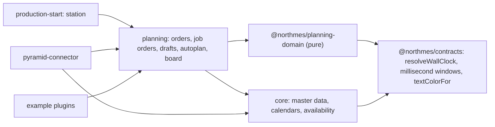
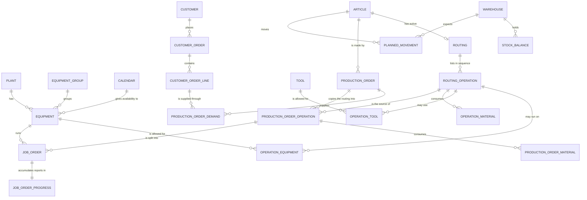
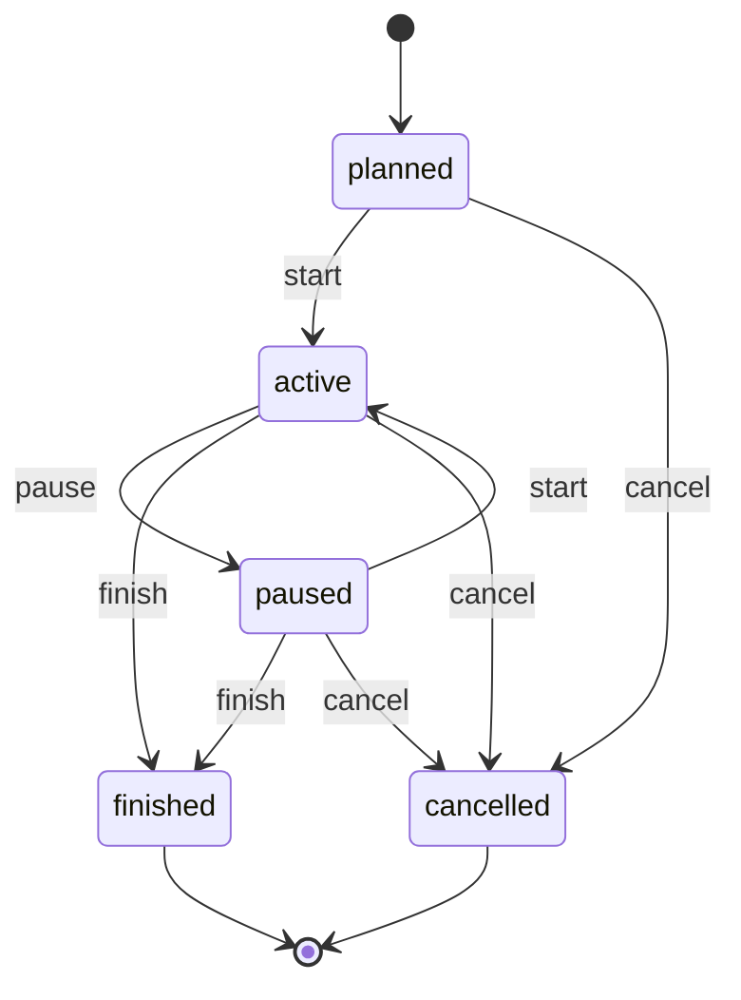
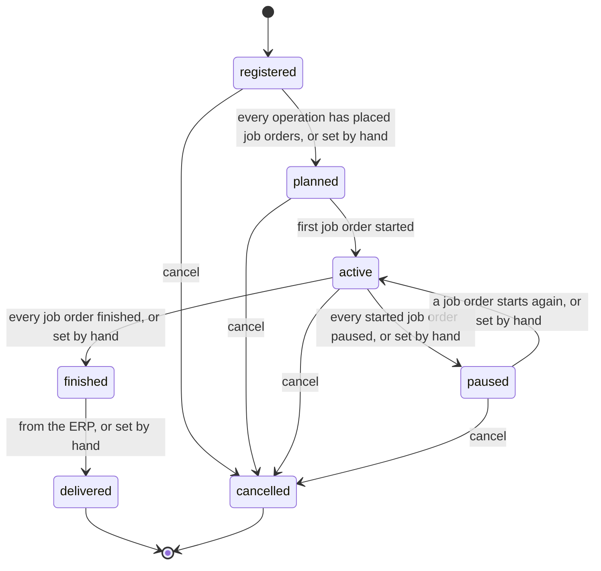
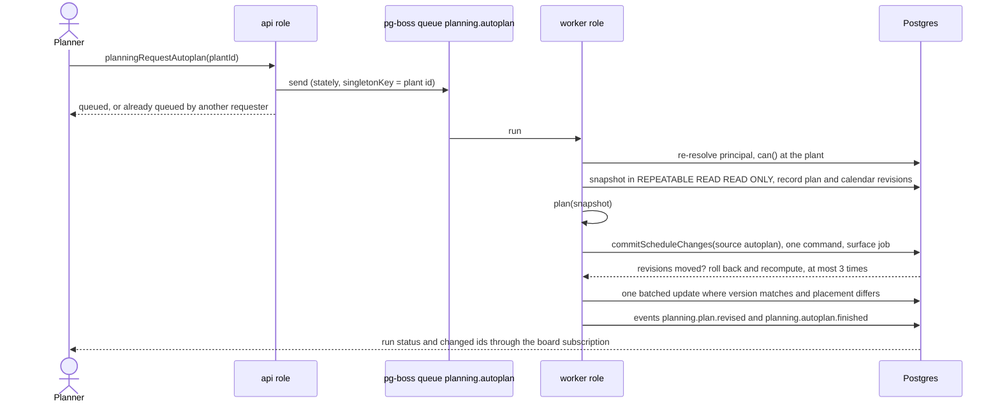

# Production planning

Production planning is the first NorthMES module to release. This document specifies the planning domain for release 1: the master data that planning reads from core, the planning records the planning module owns, statuses and transitions, the planned duration formula with its worked test cases, plant calendars, time and DST rules, the autoplan engine, fixed and frozen rows, per-planner drafts with soft locks and the plan revision, conflicts, material warnings, the planning board and its accessibility, realtime updates, performance budgets and the board spike. It is written for the session that turns the plan into GitHub issues and for the coding agents that build it. Each rule links to its ADR; rules that wait for an answer carry a working default and appear in [16-open-questions.md](16-open-questions.md). Terms follow [GLOSSARY.md](../../GLOSSARY.md).

## How to read this document

- Decided: the rule comes from an accepted ADR.
- Proposed: the rule comes from a proposed ADR; Krister accepts or changes it through that ADR.
- Open: the product owner, pilot IT or the lawyer must answer. The working default applies until then, and the code keeps the choice behind a setting or a single function so the answer changes one place.
- Plan proposal: a rule that no ADR covers yet. It fills a gap so tasks can be shaped. The shaping session confirms each plan proposal with the maintainer before a task depends on it.
- Examples use synthetic data only: Plant A in `Europe/Stockholm`, Plant B in `Europe/Helsinki`, machines CNC1 and CNC2, production orders numbered from 1001. Fixtures in the repository are synthetic; no file or value from the pilot customer is committed.

## Scope in release 1

Release 1 holds the full planning scope under option B ([ADR 0055](../adr/0055-release-1-scope-under-option-b-and-the-scope-rule.md), [01-product-and-scope.md](01-product-and-scope.md)):

- Core master data that planning reads: plants, equipment groups, equipment, tools, articles, routings and routing operations, operation equipment, operation tools, operation materials, calendars, warehouses and customers.
- Planning records: customer orders and lines, production orders, production order demand, production order operations and their materials, job orders and their progress, the stock snapshot, the plan revision, drafts, soft locks, autoplan runs and proposals.
- The scheduling domain package with the duration function, `plan()`, `validate()`, the lock rules, snapping and the material projection.
- Autoplan as a per-plant background job with a direct apply through the commit command.
- Per-planner drafts, soft locks and Save.
- The planning board and the job order table view, both with the accessibility rules below.
- Realtime board updates through GraphQL subscriptions.
- Imports and write-back through the Pyramid connector, which calls planning's canonical commands ([08-pyramid-connector.md](08-pyramid-connector.md)).
- Operator progress from the minimal station, which reports through planning's API ([09-operator-station.md](09-operator-station.md)).
- Agent proposals reviewed into the planner's draft ([10-ai-and-agents.md](10-ai-and-agents.md)).

Not in release 1: BOM explosion into new child orders, automatic parent and child links for imported orders, a solver, block resize, a compressed off-hours axis, multi-select and multi-drag, continuous zoom, undo beyond discarding the draft, a conflict navigator, a minimap, storage locations, crew rotation, a setup matrix, a generic CSV or Excel import, company-wide multi-plant planning screens and the reporting schema.

## Module boundaries



- Core owns master data: plant, scope tree, equipment groups, equipment, tools, articles, routings and routing operations, operation equipment, operation tools, operation materials, calendars, warehouses and customers. Planning never reads core's tables; it calls `CoreApiModule` in process ([ADR 0002](../adr/0002-modular-monolith-with-module-owned-schemas-and-process-roles.md)). Decided.
- The scheduling domain is one AGPL package, `@northmes/planning-domain`, in `modules/planning/domain`. It holds the duration and release functions, `plan()`, `validate()`, the lock rules (`judgeMove`), snapping and `projectMaterial`, as pure TypeScript with no Nest, Kysely, `pg` or `process.env` imports; a lint test enforces this. Planning server and planning web both import it; other modules reach its results only through planning's API module ([ADR 0057](../adr/0057-scheduling-domain-as-a-pure-package-in-the-planning-module.md)). Proposed.
- Generic time arithmetic that core also needs (`resolveWallClock`, half-open millisecond windows with `union`, `subtract`, `addWork`, `subtractWork`) and `textColorFor` live in the MIT `@northmes/contracts` package. Proposed.
- Calendar expansion from calendar versions belongs to core. Planning gets availability through `CoreApiModule.availability(...)`; the board gets it through an availability query. Proposed ([ADR 0057](../adr/0057-scheduling-domain-as-a-pure-package-in-the-planning-module.md)).
- Production-start reports progress by calling planning's `reportOperationProgress` in its own command transaction. Planning never depends on production-start; it shows downstream data only through slots that the downstream module fills ([ADR 0002](../adr/0002-modular-monolith-with-module-owned-schemas-and-process-roles.md)).
- The Pyramid connector calls core and planning commands for imports and consumes planning events for write-back. Nothing in core or planning is Pyramid-specific ([ADR 0031](../adr/0031-erp-integration-connector-modules-field-ownership-and-pending-changes.md)).

## Names

Code names follow ISA-95 where a term exists. ISA-95 is a glossary page in the docs, not a schema ([ADR 0026](../adr/0026-planning-domain-names-aligned-with-isa-95.md)). Proposed.

| Code name | UI label | ISA-95 | Pyramid word | Never in code |
|---|---|---|---|---|
| `company` | Company | Enterprise | (company in the ERP) | organization (Better Auth's word stays inside the auth module) |
| `plant` | Plant | Site | warehouse mapping decides the plant | site |
| `equipmentGroup` | Equipment group | Equipment class | `EquipmentCategory` | work center, category |
| `equipment` | Machine | Work center of type work cell | `EquipmentCode`, `EquipmentName` | work center, resource, lane |
| `tool` | Tool | Equipment specification | a `CustomData` field named in the connector mapping | |
| `article` | Article | Material definition | `ArticleNumber` | material, item, product |
| `routing` | Routing | Operations definition | (implicit per article) | |
| `routingOperation` | Operation | Operations segment | operation row template | |
| `operationEquipment` | Machines for operation | Equipment specification of the segment | | |
| `operationTool` | Tools for operation | Equipment specification of the segment | | |
| `operationMaterial` | Material | Material specification (consumed) | `BillOfMaterials` line | |
| `customerOrder`, `customerOrderLine` | Customer order, line | outside ISA-95 | `CustomerOrderNumber`, stock row `O` | |
| `productionOrder` | Production order | Operations request of type production | manufacturing order, `OrderNumber` | batch, lot |
| `productionOrderOperation` | Operation (on an order) | Segment requirement | order row, `ProductionOrderNumber` such as `1001.20` | |
| `jobOrder` | Job | Job order | (the product owner's "batch row") | batch row, batch, lane item |
| `productionOrderDemand` | Demand | Pegging | | allocation (kept free for stock reservations) |

"Job" is a UI label only. In code the full name `jobOrder` is used, because "job" also names background jobs in the queue library. "Frozen window" means the planning time fence; "frozen by reports" means a row that carries reports. The glossary keeps both.

## Domain model

### Entity overview



### Scope level per entity

Every row has a `scope_id` in the scope tree ([ADR 0007](../adr/0007-tenancy-company-plants-and-the-scope-tree.md)), row-level security on read and write scopes ([ADR 0008](../adr/0008-row-level-security-with-transaction-local-scopes.md)) and codes unique per scope ([ADR 0009](../adr/0009-code-uniqueness-per-scope-with-an-exclusion-constraint.md)). A row may reference a row at its own scope or an ancestor scope only. Child tables copy `scope_id` from their parent.

| Entity | Scope level | Status |
|---|---|---|
| Plant | plant node (`core.plant.id` equals the scope node id) | Decided |
| Equipment | plant | Decided |
| Equipment group | company or plant | Decided |
| Tool | company or plant; tools the connector creates go to the order's mapped plant | Proposed |
| Operation tool | open: company or plant | Open (product owner) |
| Article, routing, routing operation, operation material | company | Decided |
| Operation equipment | the equipment's plant (it references a company routing operation and a plant machine; declarative span check) | Proposed |
| Calendar, calendar version, deviation | plant | Proposed |
| Warehouse | plant | Plan proposal |
| Customer | company | Decided |
| Customer order header | company | Decided |
| Customer order line | the delivering plant when known, otherwise the company | Proposed, product owner confirms before the customer order migration |
| Production order, its operations, materials, job orders, progress | plant | Decided |
| Production order demand | the production order's plant; may reference same-plant or company lines only | Proposed |
| Stock balance, planned movement | the warehouse's plant | Plan proposal |
| Plan state, drafts, soft locks, autoplan runs, proposals | plant | Proposed |

A company user works one plant at a time in release 1: every request carries exactly one plant ([ADR 0007](../adr/0007-tenancy-company-plants-and-the-scope-tree.md)). A child production order is always created in its parent's plant.

### Common columns

These rules come from [04-data-and-platform.md](04-data-and-platform.md) and apply to every planning and core table below.

- `id uuid primary key default uuidv7()`, never reused. Create commands accept a client-generated id.
- `scope_id`, plus `scope_span` on tables with codes or cross-level references.
- `version` bumped by a `BEFORE UPDATE` trigger; commands take `expectedVersion`.
- `archived_at` on record tables; business records are archived, never deleted.
- `created_by`, `updated_by` as principal ids, never names.
- Importable rows carry `source`, `external_ref`, `external_data` (ERP free fields such as Pyramid's CustomData, an ordered list of `{ key, value }` in `jsonb`) and `do_not_update`.
- Translatable names are `localizedText`: a `name` plus a `translations jsonb` column from the first migration ([ADR 0053](../adr/0053-translation-english-first-general-translation-later.md)).
- Business quantities are `numeric(18,6)` in the article's stock unit. Metric values (durations, ratios) are `double precision` in the canonical SI unit with the unit in the column name, for example `cycle_time_s` and `oee_target_ratio` ([ADR 0023](../adr/0023-si-units-with-a-northmes-unit-catalog.md)).
- Plant-local definitions (shifts, breaks, deviations, ERP deadlines) are stored as wall-clock `time`, `date` or `timestamp` plus the plant zone; facts are `timestamptz` ([ADR 0024](../adr/0024-time-utc-instants-plant-wall-clock-temporal-and-the-clamp-resolver.md)).

### Core master data that planning reads

Core builds the code registers (equipment groups, tools, warehouses, customers, equipment) with the master-data kit; articles, routings, operation equipment and calendars use the lower-level shared pieces ([ADR 0022](../adr/0022-shared-building-blocks-packages-the-master-data-kit-settings-and-generators.md)).

| Table | Planning-relevant columns | Notes |
|---|---|---|
| `core.plant` | `slug`, `name`, `time_zone` (IANA id), `production_day_start` (`time`) | The slug is unique per installation and appears in the URL ([ADR 0066](../adr/0066-companies-created-by-the-cli-plant-slugs-unique-per-installation-admin-pages-at-admin-and-an-onboarding-wizard-before-a-plant-opens.md)). |
| `core.equipment_group` | `code`, `name`, `color` | Color rule on import: an existing color wins, else the import color, else one of the 20 palette colors. Decided as a product owner rule ([ADR 0026](../adr/0026-planning-domain-names-aligned-with-isa-95.md)). |
| `core.equipment` | `code`, `name`, `equipment_group_id`, `is_plannable`, `is_oee`, `external_code`, `color`, `calendar_id` | Equipment with `is_plannable` or `is_oee` appears on the board. Equipment can be a machine or another resource (building, lift, truck). |
| `core.tool` | `code`, `name` | Unknown tools from an import are created automatically. |
| `core.article` | `code`, `name`, `article_group`, `stock_unit` (unit catalog code), `note` | |
| `core.routing` | `article_id` | One active routing per article in release 1 (plan proposal). |
| `core.routing_operation` | `routing_id`, `operation_number`, `name`, `cycle_time_s`, `cycle_time_entry_value`, `cycle_time_entry_unit`, `retool_time_s`, `fixed_time_s`, `oee_target_ratio`, `pieces_per_cycle`, `cycles_per_piece`, `lead_time_s`, `send_ahead_quantity`, `min_cycle_time_s`, `max_cycle_time_s`, `valid_cycle_time_s`, `stop_limit_s`, `short_stop_limit_s`, `do_not_update` | `lead_time_s` sits on the waiting operation; `send_ahead_quantity` (Pyramid `StartNextAfterQuantity`) sits on the releasing operation. The connector upserts a routing operation keyed by (article, operation number) and respects `do_not_update` ([ADR 0027](../adr/0027-planned-duration-formula-and-override-precedence.md)). |
| `core.operation_equipment` | `routing_operation_id`, `equipment_id`, `is_default`, nullable overrides `cycle_time_s`, `pieces_per_cycle`, `cycles_per_piece`, `retool_time_s`, per-machine `stop_limit_s` and `short_stop_limit_s`, `do_not_update` | A null override inherits from the routing operation. Stop limits are carried for later modules; planning does not read them. |
| `core.operation_tool` | `routing_operation_id`, `tool_id`, nullable override `pieces_per_cycle` (and `cycle_time_s` only if the product owner confirms) | Tool choice is never written back to the ERP. |
| `core.operation_material` | `routing_operation_id`, `article_id`, `quantity_per_piece`, `source_warehouse_id` | Used when NorthMES releases its own orders. |
| `core.warehouse` | `code`, `name`, `external_code` | The connector maps ERP warehouses to plants. |
| `core.customer` | `code` (customer number), `name` | Only number and name are imported ([ADR 0032](../adr/0032-pyramid-connector-polling-file-mode-and-shadow-write-back.md)). |

`pieces_per_cycle`, `cycles_per_piece` and `send_ahead_quantity` are counts, stored as `numeric(18,6)` and parsed into scaled integers at the snapshot boundary (plan proposal for the column type; the scaled-integer rule is in [ADR 0027](../adr/0027-planned-duration-formula-and-override-precedence.md)). Cycle time keeps what the person typed: `cycle_time_entry_value` and `cycle_time_entry_unit` (for example 420 and `PIECES_PER_HOUR`), with `cycle_time_s` derived and never rounded before storage ([ADR 0023](../adr/0023-si-units-with-a-northmes-unit-catalog.md)).

The calendar tables are in [Calendars and shift patterns](#calendars-and-shift-patterns).

### Planning records

The planning module owns these tables in the `planning` schema. Column lists are the planning-relevant part; the migration is the source.

| Table | Columns | Lifecycle class |
|---|---|---|
| `customer_order` | `number`, `customer_id`, `customer_own_number` (nullable), ERP link fields | record |
| `customer_order_line` | `customer_order_id`, `line_number`, `article_id`, `quantity`, `expected_delivery_date`, ERP link fields; `scope_id` is the delivering plant or the company | record |
| `production_order` | `number`, `article_id`, `quantity`, `deadline_date`, `deadline_time` (nullable), `priority` (integer, lower first, null sorts last), `color`, `status`, `output_warehouse_id`, `parent_production_order_id` (manual link), `note`, ERP link fields | record |
| `production_order_demand` | `production_order_id`, `customer_order_line_id`, `quantity` | record |
| `production_order_operation` | `production_order_id`, `sequence`, `display_number` (the ERP's row reference verbatim, or `<order>.<operation number>` for NorthMES orders), `name`, `source_operation_id`, `source_operation_version`, copied rate fields (as on `routing_operation`), `quantity`, `status`, `priority`, `is_locked` | record |
| `production_order_material` | `production_order_operation_id`, `article_id`, `quantity` (total for the order), `source_warehouse_id`, `note` | record |
| `job_order` | `production_order_operation_id`, `quantity`, `equipment_id` (nullable), `tool_id` (nullable), `setup_start_at`, `run_start_at`, `end_at` (planned instants, nullable while unplaced), `actual_start_at`, `actual_end_at`, `status`, frozen rates (`cycle_time_s`, `pieces_per_cycle`, `cycles_per_piece`, `retool_time_s`, `fixed_time_s`, `planning_factor`), `planned_setup_s`, `planned_run_s`, `ideal_seconds_per_piece` | record |
| `job_order_progress` | `job_order_id`, `good_quantity`, `scrap_quantity`, `last_reported_at` | record (plan proposal) |
| `stock_balance` | `warehouse_id`, `article_id`, `quantity`, `connector_id`, `as_of` | reference |
| `planned_movement` | `kind`, `article_id`, `warehouse_id`, `quantity` (signed), `date_local` (`timestamp`, plant wall clock), `production_order_id` (nullable), `external_ref` | reference |
| `plant_plan_state` | `plant_id` (primary key), `revision bigint` | record (plan proposal) |
| `draft`, `draft_change` | see [Drafts](#drafts-soft-locks-the-plan-revision-and-save) | working |
| `soft_lock` | see [Soft locks](#soft-locks) | working |
| `autoplan_run` | see [The autoplan job and its apply](#the-autoplan-job-and-its-apply) | operational (plan proposal) |
| `proposal`, `proposal_item` | see [10-ai-and-agents.md](10-ai-and-agents.md) and [ADR 0036](../adr/0036-agent-proposals-as-planning-records-a-person-commits.md) | record (plan proposal) |

Rules for these tables:

- Lifecycle classes follow [ADR 0013](../adr/0013-audit-trail-written-in-the-command-transaction.md). Job orders are record class whether or not they carry reports, so `DELETE` and `TRUNCATE` on `job_order` are revoked from `nm_app` and autoplan never deletes or recreates a job order. Working default; the maintainer confirms the classes.
- Lock columns never go on `job_order`; soft locks have their own table so lock extensions do not bump the job order version or write audit diffs ([ADR 0029](../adr/0029-per-planner-drafts-soft-locks-and-the-plan-revision.md)).
- Operator progress goes to `job_order_progress`, which does not bump `job_order.version`, so quantity reports never fail an apply or turn drafts stale ([ADR 0029](../adr/0029-per-planner-drafts-soft-locks-and-the-plan-revision.md)).
- Release copies the routing into the order: each `production_order_operation` records `source_operation_id` and `source_operation_version` ([ADR 0051](../adr/0051-regulated-readiness-no-regret-rules.md), rule 8).
- `is_locked` (the hard lock, Pyramid `IsLocked`) lives on the production order operation, as in Pyramid. Working default; open for the product owner.
- An order with no demand rows is a stock order. Several customer order lines for the same article are gathered into one production order.
- `deadline_date` plus nullable `deadline_time`: when the source gives only a date (Pyramid always sends `00:00:00`), `deadline_time` is null and the plant's deadline rule turns the date into an instant. Plan proposal for the column split; the deadline rule itself is in [Settings](#settings).
- `planned_movement.kind` takes `purchaseReceipt`, `purchaseRequisition`, `consumption`, `output`, `customerDemand`, `transferOut` and `transferIn` (Pyramid reference types I, A, T, R, O, M and N). Plan proposal for the names.
- The stock snapshot is replaced per connector by `replaceStockSnapshot` and applied as a diff ([ADR 0032](../adr/0032-pyramid-connector-polling-file-mode-and-shadow-write-back.md)).

### What the job order snapshots for OEE

Planning owns the inputs that OEE needs later, so OEE needs no migration ([ADR 0027](../adr/0027-planned-duration-formula-and-override-precedence.md)):

- `ideal_seconds_per_piece` (planned run time per item): cycle seconds times cycles per piece divided by pieces per cycle, for the actual machine and tool, without the planning factor.
- `planned_setup_s` and `planned_run_s`, stored apart so a later module can classify setup as a loss.
- The resolved rates, frozen when the job order is placed.

## Statuses and transitions

Production order, production order operation and job order statuses use the product owner's six statuses plus `cancelled` ([ADR 0026](../adr/0026-planning-domain-names-aligned-with-isa-95.md)). Proposed. The allowed transitions and whether order status follows operation status are open for the product owner; the tables below are the working default (plan proposal).

| Pyramid `ProductionStatusId` | Production order | Operation | Job order |
|---|---|---|---|
| 1 | `registered` | `registered` | (none) |
| 2 | `planned` | `planned` | `planned` |
| 3 | `active` | `active` | `active` |
| 4 | `paused` | `paused` | `paused` |
| 5 | `finished` | `finished` | `finished` |
| 6 | `delivered` | (none) | (none) |
| (none) | `cancelled` | `cancelled` | `cancelled` |

A job order's placement is separate from its status. A job order with no `equipment_id` or no `setup_start_at` is unplaced; its status is still `planned` (not started).

### Job order



| From | To | Trigger | Source |
|---|---|---|---|
| `planned` | `active` | `productionStart.start` calls `reportOperationProgress`; or `reportSourceProgress` from the ERP when operators report there | derived from a report |
| `active` | `paused` | pause at the station | derived |
| `paused` | `active` | start at the station | derived |
| `active`, `paused` | `finished` | finish at the station | derived |
| `planned`, `active`, `paused` | `cancelled` | planner cancels the job order or its production order | manual, audited |

- Reports are facts. A report is accepted on a locked, moved, cancelled or finished job order and gets a conflict flag when its equipment differs from the planned one or the job order is finished or cancelled ([ADR 0033](../adr/0033-online-operator-station-in-the-production-start-module.md)).
- `reportOperationProgress` moves `planned` to `active` and increments reported quantities without bumping `job_order.version`. The task that builds it decides how the version trigger skips that status change (for example a column list on the trigger) and tests it.
- Start, pause and finish are idempotent by target state.
- A correction keeps a started job started and a finished job finished.
- Any change of machine or start, from Save or autoplan, adds `and status = 'planned'` to its update; Postgres re-checks the predicate after the lock wait, so a job that starts during a Save is never moved ([ADR 0033](../adr/0033-online-operator-station-in-the-production-start-module.md)).
- A planner's move of the unreported remainder of a started job is refused until the product owner decides whether splitting it is allowed. Open.

### Production order operation and production order



Working default for the derived part (plan proposal):

- An operation is `active` when any of its job orders is active, `paused` when none is active and at least one is paused, `finished` when every non-cancelled job order is finished, `planned` when every non-cancelled job order is placed and none has started, and `registered` otherwise.
- A production order follows the same rule over its operations, plus `delivered`, which only the ERP or a person sets. Operations have no `delivered`.
- The product owner wants every status settable by hand. Manual transitions are audited and must keep parent and children consistent: cancelling an order cancels its unstarted job orders; finishing an order by hand leaves started job orders as they are and lists them in the result.
- Cancelling never deletes rows. Reports on a cancelled job order stay and carry the conflict flag.
- A status change bumps the plan revision ([Plan revision](#plan-revision)).

## Planned duration

[ADR 0027](../adr/0027-planned-duration-formula-and-override-precedence.md). Proposed; the divisor, the tool override of cycle seconds and the deadline and lead-time defaults wait for the product owner.

### The formula

```text
setupSeconds            = retoolSeconds + fixedSeconds
runSecondsFor(n, rates) = ceilToSecond( ceil(n * cyclesPerPiece / piecesPerCycle) * cycleSeconds / planningFactor )
plannedSeconds(job)     = setupSeconds + runSecondsFor(job.quantity, job.rates)
```

- Planned seconds are working seconds laid over the machine's availability with `addWork`. Breaks and closed time inside the interval extend it. A job order is one contiguous block on its machine: setup, then run, interrupted only by calendar closures, never by another job order.
- Retool is not divided by the planning factor.
- A piece exists when its cycle completes, so a partial cycle rounds up.
- Quantity 0 gives setup only and no send-ahead release.
- Each job order carries the full retool time. Consecutive job orders of the same article and operation on one machine do not skip the second setup (working default, open).
- `fixedSeconds` is Pyramid's `ExtendedTime` when it is mapped as a fixed time; the connector folds a separate setup row into the next operation's retool by default ([08-pyramid-connector.md](08-pyramid-connector.md)).
- Quantities and rates are parsed into scaled integers at the snapshot boundary (Postgres `numeric` arrives as a string), and every ceiling is taken in integers. No `parseFloat` before arithmetic.

The same function gives four results, so the board preview, autoplan and the server agree:

1. The job order run time.
2. The send-ahead release: setup end plus `runSecondsFor(S)`, laid over the releasing machine's availability.
3. The remaining work of an active or paused job order: `runSecondsFor(quantity minus good minus scrap)`.
4. The backward share bound for split predecessors in `plan()`.

### Input rules

Zod rules in the snapshot: `quantity >= 0`, `cyclesPerPiece > 0`, `piecesPerCycle > 0`, `cycleSeconds >= 0`, `planningFactor` in (0, 2]. A violation becomes a per-row "invalid rates" result while the other rows are planned. The connector maps an OEE of 0 or empty to null (inherit) with an import warning.

### The planning factor

The divisor is the operation's OEE target by default, behind the plant setting `planningFactorSource`: `oeeTarget` (default), `factor` (one plant-wide value in (0, 2]) or `none` (1). Open for the product owner. `oeeTarget` comes only from the operation; equipment and tools cannot override it, so machines are compared against the same number.

Whether "pieces per hour" means pieces or cycles when one cycle makes several pieces is open ([ADR 0023](../adr/0023-si-units-with-a-northmes-unit-catalog.md)). The cycle time entry converts with the reciprocal: seconds = 3600 / pieces per hour.

### Override precedence

Base values come from the production order operation, which copied the routing operation at release. Overrides come from the source routing operation's operation equipment and operation tools when the job order is placed.

| Field | Routing operation | Operation equipment | Operation tool |
|---|---|---|---|
| `cycleSeconds` | base | may override | only if the product owner confirms (open) |
| `piecesPerCycle` | base | may override | may override, and wins over equipment |
| `cyclesPerPiece` | base | may override | no |
| `retoolSeconds` | base | may override | no |
| `fixedSeconds` | only source | no | no |
| `oeeTarget` | only source | refused | refused |

When both may override a field, the order is tool, then operation equipment, then routing operation. An equipment override of `oeeTarget` is refused with a validation error.

Rates are resolved when a job order is placed and frozen on it, together with planned setup seconds, planned run seconds and ideal seconds per piece. Fixed rows never change their rates; free rows pick up master data changes on the next autoplan run or move. Editing an operation equipment override after release leaves already placed job orders unchanged.

### Worked example as test cases

TC1, the worked example (7 200 pieces, 146 700 s of working time), is the first failing test of the scheduling domain. Every case below is a synthetic fixture.

Fixture "A1 calendar": Plant A in `Europe/Stockholm`, Monday to Friday 06:00 to 15:00 with breaks 08:30 to 08:45 and 11:00 to 11:30, so the working windows are 06:00 to 08:30, 08:45 to 11:00 and 11:30 to 15:00 (29 700 s per day). No deviations. No DST change falls in November 2026.

Fixture "TC1 rates": 7 200 pieces, cycle 45 s, 3 pieces per cycle, 1 cycle per piece, planning factor 0.75 (the OEE target), retool 2 700 s, fixed 0 s.

Assumptions, each a setting or rule above: retool is not divided by the planning factor; lead time is elapsed clock time; retool may be interrupted by breaks and nights; each job order carries the full retool; planned time consumes working seconds only.

| Case | Input | Expected |
|---|---|---|
| TC1 base | TC1 rates, start Mon 2026-11-02 06:00 | 2 400 cycles; run 108 000 s; run divided by 0.75 is 144 000 s; total 146 700 s (4 days plus 27 900 s); retool 06:00 to 06:45; end Fri 2026-11-06 14:30 local (13:30Z) |
| TC2 no factor | TC1 with planning factor 1.0 | total 110 700 s; end Thu 2026-11-05 12:45 |
| TC3 cycles per piece | TC1 with 1 piece per cycle and 2 cycles per piece | 14 400 cycles; run 864 000 s after the factor; total 866 700 s (duration only) |
| TC4 rounding | TC1 with 7 201 pieces | 2 401 cycles; total 146 760 s; end Fri 2026-11-06 14:31 |
| TC5 tool override | TC1, operation 3 pieces per cycle, tool 8 pieces per cycle | 900 cycles; total 56 700 s; end Tue 2026-11-03 14:15 |
| TC5b precedence | operation 3 per cycle; CNC2 override 7 per cycle; tool T8 8 per cycle | CNC1 with T8: 900 cycles, 56 700 s; CNC2 without a tool: 1 029 cycles, 64 440 s; CNC2 with T8: 56 700 s. An equipment override of `oeeTarget` is refused. Editing the CNC2 override after release leaves the placed job order unchanged |
| TC6 split | TC1 split 3 600 on CNC1 and 3 600 on CNC2, both start Mon 2026-11-02 06:00 | each job order 74 700 s; both end Wed 2026-11-04 10:30 |
| TC7 lead plus retool | previous operation ends Mon 2026-11-02 10:00; lead time 5 h; retool 2 700 s | lead ends Mon 15:00; retool Mon 14:15 to 15:00; first piece Tue 06:00. Working-time variant: lead ends Tue 06:30; retool Mon 14:45 to 15:00 and Tue 06:00 to 06:30 |
| TC8 overlap across a break | previous operation ends Mon 07:00; lead 2 h; retool 2 700 s | lead ends 09:00; retool 08:00 to 08:30 and 08:45 to 09:00; first piece 09:00 |
| TC9 send-ahead | op 10: 40 s, 1 per cycle, factor 1, no retool, start Mon 06:00, 6 000 pieces; op 20 send-ahead 150 on op 10, lead 0 | op 20 earliest start Mon 07:40; op 10 ends Thu 2026-11-12 06:40; by the last-piece rule op 20 cannot end before op 10's end plus one op 20 cycle |
| TC9b cycle-quantized release | TC1 rates from Mon 2026-11-02 06:00, send-ahead S | S = 318 releases at 08:46 (106 cycles, 6 360 s); S = 319 at 08:47 (107 cycles, 6 420 s) |
| TC9c remaining work | 7 050 pieces remaining at TC1 rates | run 141 000 s |
| TC10 backward | total 146 700 s, deadline date Fri 2026-11-13 | `deadlineRule` `endOfShift` (15:00): latest start Mon 2026-11-09 06:30. `startOfDay` (00:00, as Pyramid sends): latest start Fri 2026-11-06 06:30. One working day apart |
| TC11 regression | TC1 inputs | the test asserts 146 700 s; the formula without pieces per cycle and the planning factor gives 326 700 s and fails it |
| TC12 cycle input | "12,5" seconds; 420 pieces per hour; and 7 200 pieces at 420 pieces per hour, 1 piece per cycle, factor 0.75 | 12.5 s; 8.571428571428571 s stored with entry value 420 and unit `PIECES_PER_HOUR`, read back as 420 after display rounding; run 82 286 s |
| TC13 version start | new calendar version effective Thu 2027-08-12; Mon 2027-08-16; Sun 2027-08-15; edit a version in effect; edit a future version | confirmation prompt; no prompt; prompt; refused; allowed |
| TC14 rotation | two-week pattern; ISO parity against an anchored cycle | 2026-W53 and 2027-W01 both odd under ISO parity; the anchored cycle alternates |
| TC15 DST overtime | overtime Sun 2026-10-25 00:00 to 06:00; Sun 2027-03-28 00:00 to 06:00 | 25 200 s; 18 000 s |
| TC16 ERP times | a synthetic ERP operation row: 4 pieces at 1 500 s, planned 09:10 to 10:50 on one day | the parser yields 6 000 s between start and end (connector parser test, [08-pyramid-connector.md](08-pyramid-connector.md)) |

## Calendars and shift patterns

[ADR 0025](../adr/0025-plant-calendars-shift-patterns-and-the-production-day.md). Proposed; shift and break times, the week rule, deviation precedence and the production day start wait for the product owner.

### Data model (core)

| Table | Columns |
|---|---|
| `calendar` | `plant_id`, `name`; equipment points to one calendar through `equipment.calendar_id`, default the plant calendar |
| `calendar_version` | `calendar_id`, `effective_from date`, `cycle_weeks int default 1`, `cycle_anchor date` (a Monday), `week_rule` (`anchored`, or `isoParity` as an explicit option) |
| `calendar_shift` | `version_id`, `week_index`, `iso_weekday`, `start_time`, `end_time`, `label`; `end_time <= start_time` means the end is on the next date; `CHECK (end_time < '24:00')` |
| `calendar_break` | `shift_id`, `start_time`, `end_time`; a break time before the shift start is on the next date; breaks sit inside their shift |
| `calendar_deviation` | `plant_id`, `kind` (`overtime` or `non_working`), `starts_local`, `ends_local` (`timestamp` pairs in the plant zone), `applies_to_all`, `reason` |
| `calendar_deviation_equipment` | `deviation_id`, `equipment_id` |

If the product owner says overtime nights carry breaks, an optional `shift_template_id` on overtime deviations is added. Until then, a break inside overtime is two overtime rows.

### Rules

1. A shift belongs to the date it starts. Shifts are shorter than 24 hours and may cross midnight.
2. A shift uses the version in force on its start date, so a Sunday 22:00 shift belongs to the old version when the new one starts on Monday.
3. A version is frozen once `effective_from <= (now() AT TIME ZONE p.time_zone)::date`, read from a settable `core.clock_now()` so tests can move the clock. A trigger refuses changes to a frozen version and to its shift and break rows. A correction is a new version. This keeps earlier shift figures reproducible ([ADR 0051](../adr/0051-regulated-readiness-no-regret-rules.md), rule 9).
4. A new version that starts on a day other than Monday returns a confirmation reason the client shows ("Does the pattern really start on a Thursday?"); the command runs once the person confirms.
5. Week index is `floor(days(cycle_anchor, monday of date) / 7) mod cycle_weeks`. ISO week parity is only an explicit option, because 2026-W53 and 2027-W01 are both odd.
6. Deviations exist per equipment and plant-wide. Plant holidays are a plant-wide non-working deviation.
7. Precedence goes by scope first, then by kind. An equipment deviation overrides a plant-wide one; within one scope, non-working beats overtime, overtime beats break, break beats shift. If the product owner keeps the older rule (non-working always wins), `createDeviation` returns the warning `OVERTIME_FULLY_CANCELLED` and the editor shows it. Open.
8. Availability per equipment is computed as sorted, disjoint, half-open millisecond windows: plant level `((shifts minus breaks) plus plant-wide overtime) minus plant-wide non-working`, then equipment level `(plant level plus equipment overtime) minus equipment non-working`.
9. The public API takes an instant range: `availability(calendar, equipment, fromMs, toMs)`. It expands from the local date of `from` minus one day to the local date of `to`, then clips, so a range starting at local midnight keeps the night shift that began the evening before. SQL selects deviations with `starts_local < local(to) + 1 day` and `ends_local > local(from) - 1 day`; TypeScript clips exactly.
10. Expansion runs once per calendar version (pattern plus plant-wide deviations) with a per-(zone, date) offset cache, then applies equipment deviations. `resolveWallClock` runs only on dates with a zone transition.
11. `addWork(av, from, work)` and `subtractWork(av, until, work)` return a placement with `start`, `end` and the working `segments`, or `null` when the horizon runs out. The caller expands four more weeks and retries up to a fixed limit, so a machine without capacity cannot loop forever.
12. `CoreApiModule` exposes a per-plant calendar revision. Every calendar write bumps it, and core emits `core.calendar.availability_changed { plantId, equipmentIds or all, fromLocal, toLocal }`.
13. Crew rotation (who works which shift) is HR planning, not release 1 capacity.

Open for the product owner: break and night shift times, the even and odd week rule, whether overtime nights carry breaks, and whether a schedule in effect also locks past deviations.

### The production day

Each plant has `production_day_start`, a `core.plant` column next to the zone. `productionDayOf(instant) = (local(instant) minus production_day_start).date` on the wall clock. A night shift that crosses midnight belongs to the production day it started on, and shift figures are attributed by shift start date. The value is validated against the zone's transitions for 10 years, so a start inside the spring gap or the repeated autumn hour is refused. Production days are 23 or 25 hours long on transition weekends. A versioned plant setting waits until the product owner says whether the day start can change. Open: the pilot's day start (00:00, 06:00 or 07:00).

### Calendar tests

| Case | Input | Expected |
|---|---|---|
| CAL1 night from the day before | weekday night shift 22:00 to 06:00; range from Tue 00:00 local | includes Monday night 00:00 to 06:00 |
| CAL2 autumn range | CNC1, one-row Saturday overtime 22:00 to 06:00 on 2026-10-24; range [2026-10-24T22:00Z, 2026-10-25T11:00Z) | [2026-10-24T22:00Z, 2026-10-25T05:00Z), 25 200 s |
| CAL3 spring range | same on 2027-03-27; range [2027-03-27T23:00Z, 2027-03-28T10:00Z) | [2027-03-27T23:00Z, 2027-03-28T04:00Z), 18 000 s |
| CAL4 scope precedence | plant-wide non-working [2027-03-26 00:00, 2027-03-30 00:00) local; CNC1 overtime [2027-03-27 22:00, 2027-03-28 06:00) | CNC1 has [2027-03-27T21:00Z, 2027-03-28T04:00Z) (7 h); CNC2 has 0. Under the older rule the command result carries `OVERTIME_FULLY_CANCELLED` |
| CAL5 overtime with a break | Saturday 2026-10-24 overtime as one row; as two rows with a 02:00 to 02:30 gap | 9 h; 8.5 h |
| CAL6 forward and backward on DST nights | overtime 22:00 to 02:00 and 02:30 to 06:00: forward from 22:00 and backward to 06:00 | 2026-10-24, 8 h: ends 05:30 +01 (04:30Z); starts 22:30 +02 (20:30Z). 2027-03-27, 6 h: ends 05:00 +02 (03:00Z); starts 23:00 +01 (22:00Z) |
| CAL7 freeze on the local date | version effective 2026-10-25 with a Sunday 05:00 shift; edit at 2026-10-24T22:30Z | refused (local date is already 2026-10-25) |
| CAL8 production day start | `Europe/Stockholm` with 02:30; with 06:00 | refused; accepted |
| CAL9 production days | Stockholm, day start 06:00, production days 2026-10-24 and 2027-03-27 | [2026-10-24T04:00Z, 2026-10-25T05:00Z), 25 h; [2027-03-27T05:00Z, 2027-03-28T04:00Z), 23 h |
| CAL10 non-Monday prompt | TC13 | as TC13 |
| CAL11 cost | seeded pilot-scale fixture (40 machines, 3 calendars, 20 weeks) | at most about 3 400 `resolveWallClock` calls |

## Time and DST rules

[ADR 0024](../adr/0024-time-utc-instants-plant-wall-clock-temporal-and-the-clamp-resolver.md). Proposed.

- Facts are `timestamptz` instants in UTC. Each plant has an IANA zone. Plant-local definitions are wall-clock values plus the plant zone.
- Temporal is used everywhere, with `temporal-polyfill` loaded only in host entry points. Domain code never calls `Temporal.Now` or `Date.now()`; `now` is an input.
- One resolver, `resolveWallClock(zone, date, time)`, applies the clamp rule: a time in the spring gap resolves to the first instant after the gap; a repeated autumn time resolves to its first occurrence. It is monotonic, so adjacent windows stay adjacent. Boot throws unless `resolveWallClock('Europe/Stockholm', 2027-03-28, 02:30)` is 01:00Z.
- SQL converts instants to local time and never local time to instants, because Postgres resolves a repeated time to its second occurrence. A test asserts that no query does `timestamp ... AT TIME ZONE` towards an instant.
- Session zones are pinned to UTC per database role. The driver returns strings for `date`, `timestamp` and `timestamptz`; repositories convert to Temporal; a Kysely plugin throws on `Date` parameters.
- GraphQL uses the shared scalars `Instant` (offset required), `LocalDate`, `LocalTime` and `LocalDateTime` (no offset). Only the server turns a `LocalDateTime` into an instant ([05-graphql-and-apis.md](05-graphql-and-apis.md)).
- In the browser, instants stay ISO strings in the Apollo cache and become epoch milliseconds once at the board's data edge.
- Board time snaps with offset-preserving `ZonedDateTime.round`. Hour ticks come from exact instants; day ticks from `startOfDay()` plus one day.
- `formatPlantTime` in `@northmes/contracts` (subpath `format`) formats instants in the plant zone with the plant's hour cycle and adds the short zone name when the offset differs from the hour before or after. It uses the pinned base locale `en-GB-u-ca-gregory-nu-latn`, never the process or browser default, so `02:30 CEST` reads the same on every host ([ADR 0061](../adr/0061-presentation-settings-for-dates-clocks-and-numbers-with-one-pinned-locale.md)). A lint fails on `Intl.DateTimeFormat`, `Intl.NumberFormat`, `Intl.DurationFormat` and `toLocaleString`, `toLocaleDateString` and `toLocaleTimeString` calls outside `packages/contracts/src/format/`. Screens show plant time with a zone label when the browser zone differs from the plant zone.
- Autoplan, availability and the board work in epoch milliseconds inside loops and use Temporal only at the edges.

| Case | Input | Expected |
|---|---|---|
| TIME1 spring gap | `resolveWallClock('Europe/Stockholm', 2027-03-28, 02:30)` | 01:00Z, flagged `resolvedGap` where the caller asks |
| TIME2 autumn repeat | `resolveWallClock('Europe/Stockholm', 2026-10-25, 02:30)` | 00:30Z, flagged `resolvedAmbiguous` |
| TIME3 break in the gap | break [02:30, 03:15) on 2026-03-29 | resolves to an empty or forward window, never an inverted one |
| TIME4 snapping | `snap(2026-10-25T01:10Z, 15 min)` | 01:15Z; snap is monotone |
| TIME5 ticks | hour ticks for the plant days 2026-10-25 and 2027-03-28 | 25 and 23 |
| TIME6 labels | `formatPlantTime` in `Europe/Stockholm` with `h23` for 2026-10-25T00:30Z and 01:30Z, under `LANG=en_US.UTF-8` and `LANG=fi_FI.UTF-8` | `02:30 CEST` and `02:30 CET` under both |
| TIME7 hostile zone | domain suite under `TZ=UTC`, `Europe/Stockholm` and `Pacific/Chatham`; native Temporal and forced polyfill | identical results |

## Autoplan

[ADR 0028](../adr/0028-autoplan-as-a-pure-deterministic-function.md). Proposed; the frozen window, overdue rows, the apply path and child orders wait for the product owner.

### Contract

- `plan(snapshot): PlanResult` is a pure, deterministic TypeScript function in `@northmes/planning-domain`. `now` is part of the snapshot. No database reads, no clock and no randomness inside.
- No solver in release 1. A `Scheduler` port leaves room for a CP-SAT or Timefold plugin later.
- `plan()` has a step budget; when it runs out the result is `budget_exceeded`.
- Comparators compare code units and end on `id`. A Biome rule bans `localeCompare` and `Intl.Collator` in domain code.
- The snapshot is plain numbers (epoch milliseconds, scaled integers). `plan()` moves to a worker thread only if the performance budget fails.

### Snapshot

The snapshot loader runs in one `REPEATABLE READ READ ONLY` transaction and passes it to `CoreApiModule` query methods through an explicit `ReadContext` parameter. It records the plan revision and the calendar revision. Contents:

- `now`, the plant zone and the planning settings.
- Availability per plannable equipment over the horizon.
- Open production orders with deadline instants (from the deadline rule), priority, number, id and manual child links.
- Operations with frozen rates, lead time, send-ahead quantity, `is_locked` and the allowed equipment with override rates.
- Job orders with status, placement, actual start, reported quantities and resolved rates.
- Live soft locks.

### Row classification

| Class | Which rows | Treatment |
|---|---|---|
| Finished | status `finished` | keep the actual interval |
| Active, paused | status `active` or `paused` | keep machine and actual start; end = `addWork` from max(now, actual start) for the remaining quantity. When reported good plus scrap reaches the quantity but the row is not finished, end = now and the row is flagged "finish pending" |
| Active without actual start | imported active rows with no actual start | start = max(planned start, now) on the same machine, end from the remaining quantity, flagged "actual start unknown" |
| Overdue | status `planned`, planned start before now, not hard-locked | free; keeps its sticky machine; flagged overdue; placed by the normal pass with `notBefore = now + frozenHours` |
| Frozen | setup start in [now, now + frozenHours) | keeps machine and its order on that machine; shifts right to max(planned start, projected end of the previous fixed row on that machine), never left |
| Held | job orders of a production order with a live soft lock; an expired draft change does not hold a row | as frozen, and listed in the result with reason "held" |
| Hard-locked | operation `is_locked` | stays put; produces a conflict when it overlaps or lies in the past ("locked in the past") |
| Free | everything else | placed by the passes below |

`frozenHours` are elapsed hours. Open for the product owner: may overdue work jump the frozen window, and is the frozen window elapsed hours, working hours or "through the end of the next production day". A Friday 14:00 run with 24 hours freezes one working hour on the A1 calendar, which is why the basis matters.

### Order of planning

Orders are planned one at a time, sorted by deadline instant ascending, then order priority ascending (null last), then order number by code units, then id. Priority 1 gets the just-in-time slot and priority 2 goes late under shortage. Children linked by hand leave the top-level sort and plan right after their parent.

### Rules between operations

For consecutive operations P (earlier) and N (later), lead time L sits on N and send-ahead quantity S sits on P.

1. Release of N without S: the latest end over all of P's job orders plus L.
2. Release of N with S: the first instant at which P's job orders together have produced S pieces, plus L. Pieces of a P job order complete at `addWork(av, setupEnd, runSecondsFor(k)).end`; the sum runs across all of P's rows.
3. Retool overlap: the release bounds N's run start, so retool may run during the lead time. When the plant setting `retoolOverlapsLeadTime` is false, the release bounds N's setup start.
4. Last piece: every N job order ends no earlier than P's latest end plus L plus one N cycle.
5. N is not split because P is split.
6. Lead time basis: elapsed clock time by default; the working-time variant (setting `leadTimeBasis`) counts L over the calendar of N's machine. Open.
7. Machine choice: a job order keeps its machine (sticky). A job order without a machine chooses among the operation's plannable equipment at the plant: the latest feasible start when planning backward, the earliest finish when planning forward; ties go to the default machine, then equipment code, then id.
8. Autoplan never splits and never changes quantities. Planners split by hand; each job order on a new machine gets its own setup.
9. Job orders on non-plannable equipment are returned under `notPlannable` and not placed.

### Algorithm

```text
plan(snapshot): PlanResult
  ctx   = timelines(snapshot)                       // per machine: availability windows and reservations
  fence = snapshot.now + frozenHours                // elapsed hours
  classify job orders; reserve finished, active, paused, hard-locked rows;
  reserve frozen and held rows on their machines, shifted right only
  orders = open production orders with at least one free job order, without hand-linked children
  sort orders by (deadlineInstant, priority nulls last, number by code units, id)
  for order in orders:
    trial = ctx.fork()
    if not planBackward(order, trial, fence):
      trial = ctx.fork()
      planForward(order, trial, fence)
      result.fallbacks += order
    ctx = trial
    plan the order's hand-linked children the same way, right after it
    if plannedEnd(order) > deadlineInstant(order): result.late += lateFacts(order)
    if stepBudgetSpent(): return budget_exceeded
  return result(ctx)

planBackward(order, ctx, fence):
  for op in order.operations by sequence descending:
    fixedRows, freeRows = split(op)                 // fixed rows bound both neighbours
    bound     = latestEnd(op, next operation, order) // over all rows of the next operation
    notBefore = max(fence, release from fixed predecessor rows)
    for row in freeRows by quantity descending, id ascending:
      choice = latest feasible subtractWork over candidate machines, start >= notBefore
      if none: return false
      ctx.reserve(choice)
  return true

latestEnd(P, N, order):
  if N is none: return deadlineInstant(order)
  anchor = min over N rows of (retoolOverlapsLeadTime ? runStart : setupStart)
  b      = min over N rows n of (subtractWork(av(n.machine), n.end, oneCycle(n)).start minus L)   // last-piece rule
  if P has no send-ahead: return min(anchor minus L, b)
  share  = ceil(S * row.quantity / P.quantity)                                                   // per split P row
  work   = runSecondsFor(row.quantity) minus runSecondsFor(share)
  return min(b, addWork(av(m), anchor minus L, work).end)

planForward(order, ctx, fence):
  for op in order.operations by sequence ascending:
    fixedRows, freeRows = split(op)
    release = previous op ? releaseOf(previous op, op) over all its rows : fence
    for row in freeRows by quantity descending, id ascending:
      choice = earliest finish addWork over candidate machines from max(release, fence)
      if none within the horizon: result.unplaced += row; continue
      ctx.reserve(choice)
  result.conflicts += fixed rows of the order whose rules the placed rows break
```

The earlier pseudocode's `pieceSecs` and `fixedRowsStillSatisfied` are gone: fixed rows bound their neighbours in both passes, and release times come from `runSecondsFor`. "Late" compares the planned end with the deadline; it does not depend on whether the fallback ran.

### Result

`PlanResult` holds:

- `placements`: job order id, equipment id, setup start, run start, end, planned setup and run seconds, resolved rates.
- `fallbacks`: orders planned forward.
- `late`: per order the deadline rule in use, `asOf`, planned end, delay, whether the fallback ran, fixed or locked rows, conflicts, material warnings, and per-operation wait time against run time. These are the late-order facts the job order table view and the `late` filter of `planning_find_orders` return ([10-ai-and-agents.md](10-ai-and-agents.md)). Attribution of a binding constraint inside `plan()` comes later.
- `conflicts`, `unplaced`, `notPlannable`, `invalidRates`, `held` (with reason "held").
- Flags per row: `overdue`, `finishPending`, `actualStartUnknown`.
- `stats` and `budgetExceeded`.

### Invariants

The autoplan strategy contract suite (`autoplanStrategyContract` in `@northmes/testing`, database-free part) holds for `plan()` and any later `Scheduler`:

- No free row overlaps any row.
- Overlaps between fixed rows appear in `conflicts`.
- Send-ahead and last-piece bounds hold.
- Active rows keep machine and actual start.
- Late orders are flagged, not dropped.
- Permutation invariance: any permutation of the input arrays gives a deep-equal result.
- Idempotence: apply, reload, plan again with the same `now`, and zero rows change.

The suite fails on a strategy that ignores send-ahead.

### The autoplan job and its apply



- Queue `planning.autoplan` with policy `stately`, `singletonKey` = plant id and `retryLimit: 0`; a person requests again instead of pg-boss retrying. `expireInSeconds` comes from the measured run time plus a margin; `heartbeatSeconds` is 10, so a killed worker frees the plant within 30 s.
- `planning.autoplan_run(id, plant_id, requested_by, status, snapshot_revision, applied_revision, attempts, stats, result, error)` with status `queued`, `running`, `applied`, `superseded` or `failed`. A second request while one is queued returns "already queued by <user>" with no audit row.
- Job data carries only the principal reference, credential id, correlation id, plant and request time. The worker re-resolves the principal and runs `can()` at execution; when the role is gone the run fails with a `permission.denied` security event and changes nothing.
- The apply runs `planning.commitScheduleChanges(source: autoplan)` in one transaction and one command with surface `job` and the request's correlation id. It re-reads both revisions under the plan state row lock; if either moved, it rolls back and recomputes, at most 3 times, before reporting "plan changed during autoplan". It writes one batched `update ... from (values ...)` where `version` matches and the placement differs.
- Rows under a live soft lock (another planner's open draft) are fixed with reason "held" and listed in the result, so a planner's open draft survives a colleague's autoplan.
- Every run publishes `planning.autoplan.finished { moved, skippedBeingEdited, late, conflicts, unplaced }` to the requester.
- Open for the product owner: the default above applies directly; the alternative writes the result as a proposal into the requester's draft (or a run-scoped proposal set) that the planner reviews and saves. Either way the result goes through `commitScheduleChanges`.

## Fixed, frozen, held and locked rows

The words overlap in conversation, so the code and the UI keep them apart:

| Word | Meaning | Who sets it | Effect on autoplan | Effect on a planner's move |
|---|---|---|---|---|
| Hard-locked | the operation's `is_locked` | a planner with `lock` permission; the ERP on first import | stays put; conflict when broken | refused (`PINNED`) |
| Soft-locked | a live `soft_lock` row held by another planner | the first draft change to the order | held | refused (`LOCKED`) with holder and time; can be broken |
| Started | job order status other than `planned` | reports | kept by status rules | refused (`STARTED`) |
| Frozen window | setup start inside [now, now + frozenHours) | time passing | kept on its machine and order, shifted right only | allowed; flagged as a frozen window conflict to confirm (plan proposal) |
| Frozen by reports | a row that carries reports | reports | never deleted or recreated | machine and start cannot change |
| Fixed | any row `plan()` does not place: finished, active, paused, hard-locked, frozen, held | derived | bounds neighbouring operations | not applicable |

`judgeMove(row, target, context)` in the domain package returns `ok`, `PINNED`, `LOCKED` or `STARTED`, plus confirmable conflicts. The board, the Move dialog, the job order table view, `commitScheduleChanges` and agent proposals all use it.

## Drafts, soft locks, the plan revision and Save

[ADR 0029](../adr/0029-per-planner-drafts-soft-locks-and-the-plan-revision.md). Accepted: per-planner drafts with soft locks, and Save commits the draft through one command. The lock level, who may break locks and save with conflicts wait for the product owner.

### Drafts

- Each planner has one draft per plant: `planning.draft(id, plant_id, owner_user_id, version)` with unique `(plant_id, owner_user_id)`, autosaved to the server.
- `planning.draft_change(draft_id, job_order_id, base_version, equipment_id, start_at, end_at, proposal_id null)` holds the moves. `start_at` is the setup start.
- Moves are disabled while the subscription socket is disconnected.
- Draft content never reaches the ERP; only Save triggers write-back.
- `planningMyDraft(plantId)` returns a status per row, computed in SQL:

| Row status | Meaning | Actions |
|---|---|---|
| `OK` | lock held, row unchanged | Save |
| `LOCK_LOST` | another planner holds the order's lock now (holder and since when) | discard, rebase |
| `STALE` | the committed row's planning fields changed after the draft was based on it (who changed it) | discard, rebase |
| `STARTED` | the job order started | discard |
| `PENDING_ERP_CHANGE` | an ERP change waits for acceptance on the order | discard, rebase after accept |
| `ROW_GONE` | the job order was cancelled or its order archived | discard |

- The stale check compares planning fields (machine, start, end, quantity, status) or the plan revision, not the whole-row version, so a note or a material line from an import does not turn drafts stale. How the check reads the base values (columns on `draft_change` or the audit diff since `base_version`) is decided in the task that builds `planningMyDraft`.
- Read tools take a `view` argument (`committed` or `draft`): the in-app assistant defaults to the caller's draft, MCP to the committed plan.
- Optional ghost outlines show other planners' draft targets. They are a cut candidate.
- The shared plant draft of the earlier design is rejected.

### Soft locks

- `planning.soft_lock(production_order_id primary key, plant_id, draft_id, holder_user_id, taken_at, expires_at, version)`.
- The first draft change to any job order of a production order locks the whole order for that draft. This matches the write-back key, the pending-change unit and autoplan's order-at-a-time loop. Open: the product owner said "operation"; the order level is the working default.
- Take or take over in one statement:

```sql
insert into planning.soft_lock (production_order_id, plant_id, draft_id, holder_user_id, taken_at, expires_at)
values ($1, $2, $3, $me, now(), now() + $idle)
on conflict (production_order_id) do update
  set draft_id = excluded.draft_id, holder_user_id = excluded.holder_user_id,
      taken_at = excluded.taken_at, expires_at = excluded.expires_at
  where planning.soft_lock.expires_at < now() or planning.soft_lock.holder_user_id = $me
returning *;
-- zero rows: LOCKED
```

- Expiry is lazy and read from the database clock; there is no cleanup job. The idle expiry time is open.
- A lock is extended only inside move commands and an explicit Extend action, never on a client timer. An expiring lock is a WCAG 2.2.1 time limit, so the board warns before expiry and offers a one-action extension.
- Break is one command, `planning.breakSoftLock`, whose input requires a reason (trimmed, 3 to 500 characters) and `expectedHolderId`. It transfers the lock in the same statement, records the previous holder in the command detail and publishes `planning.production_order.soft_lock_changed`. A stale `expectedHolderId` returns a conflict.
- The manifest declares `lock` and `breakLock` on the job order resource. Admins get both; the planner role gets `breakLock` if the product owner agrees; the agent permission set strips both.
- Soft locks are audited under `planning.productionOrder` with `expires_at` skipped, so extensions write no diffs.
- Save releases the locks of the orders it committed.

### Plan revision

- `planning.plant_plan_state(plant_id primary key, revision bigint)`. Every job order writer (Save, autoplan apply, import, accept-pending, operator status changes) selects the row `for update` and bumps the revision in the same transaction when placement, locks, quantity, deadline or status change. The row lock serializes writers.
- `CoreApiModule` exposes the per-plant calendar revision; autoplan records both.
- Save and accept run `validate()` over the committed rows on the touched equipment and orders plus the change set. New overlaps and precedence breaks come back as conflicts the planner confirms with a reason, stored in `audit.command.reason`, because the first import at the ERP's planned times already creates overlaps the board must tolerate. Open: the product owner may prefer that new overlaps are refused.
- This replaces a per-row plan revision column and an advisory lock.

### Save and `commitScheduleChanges`

One internal command, `planning.commitScheduleChanges(changeSet, source: draft | autoplan | proposal | externalChange)`, serves Save, the autoplan apply and accept-pending, so validators, the plan revision, events and audit are the same for every source. It is validatable: plugin validators see every source, AI moves included.

```mermaid
sequenceDiagram
  actor Planner
  participant Board as Board (planning remote)
  participant Cmd as commitScheduleChanges
  participant DB as Postgres
  Planner->>Board: Save
  Board->>Cmd: planningSaveDraft(plantId, confirmedConflicts, reason)
  Cmd->>DB: audit.begin_command (surface web)
  Cmd->>DB: select plant_plan_state for update
  Cmd->>DB: per row, check soft lock held (or re-take an expired, untaken lock), planning fields current, status planned
  Cmd->>Cmd: command validators (veto only, time-limited)
  Cmd->>Cmd: validate() over touched equipment and orders plus the change set
  alt refusals, or new conflicts not confirmed
    Cmd-->>Board: typed list of conflicting rows, nothing written
  else all rows pass
    Cmd->>DB: one batched update where version matches, placement differs, status planned
    Cmd->>DB: bump revision; delete committed draft rows and their soft locks
    Cmd->>DB: outbox: plan.revised, job_order.scheduled, soft_lock_changed
    Cmd-->>Board: saved, new revision, server times per row
  end
```

- Save is all or nothing. The typed result lists each conflicting row with a reason.
- Save silently re-takes an expired lock that nobody else took when the row is current.
- Write-back and the autoplan apply take the plant from the draft or the run, never from a default.
- The commit message on the board uses the times the server returns, because breaks, closed time and DST gaps decide the final placement.

### Splitting and hard-locking by hand (plan proposal)

[ADR 0029](../adr/0029-per-planner-drafts-soft-locks-and-the-plan-revision.md) fixes the draft change shape for moves only. Planners also split job orders and set the hard lock. Until the maintainer decides otherwise, this plan proposes:

- Split is a draft change of kind `split`: it names the source job order, a client-generated id for the new job order and the quantity moved to it. Save creates the new job order (record class, own full retool) and reduces the source quantity in the same command. The moved quantity cannot exceed the unstarted quantity; splitting a started job order's remainder stays refused until the product owner decides. This adds `kind`, `new_job_order_id` and `quantity` to `draft_change`.
- Lock and unlock are a direct command, `planning.setOperationLocked(operationId, locked, expectedVersion)`, refused when another planner holds the order's soft lock. It bumps the plan revision and publishes `planning.job_order.lock_changed` for write-back.

## Conflicts

A conflict is a broken planning rule that NorthMES reports and never repairs on its own.

| Kind | Detected by | When | Effect |
|---|---|---|---|
| `OVERLAP` | `validate()`, `plan()` for fixed rows | Save, accept-pending, autoplan, import | listed; Save needs confirmation with a reason |
| `LEAD_TIME`, `SEND_AHEAD`, `LAST_PIECE` | `validate()` | Save, accept-pending | as above |
| `FROZEN_WINDOW` | `judgeMove`, `validate()` | Save, proposals | confirmable on Save; a proposal item inside the window is blocked |
| `LOCKED_IN_PAST` | `plan()` | autoplan | listed in the run result and on the board |
| `PINNED`, `LOCKED`, `STARTED` | `judgeMove` | move, Save, proposals | refusal, not confirmable |
| `STALE`, `LOCK_LOST`, `ROW_GONE`, `PENDING_ERP_CHANGE` | draft row status | Save | refusal for that row; discard or rebase |
| Import conflict | connector import recomputes an untouched order | each poll | marked on the board and in the import log |
| Report conflict | production-start | a report on another machine or on a finished or cancelled job order | Conflict state on the block |

The reason codes above are a plan proposal except `OVERLAP` and `STALE`, which come from the stress-tested design. Late orders and material shortages are warnings, not conflicts.

## Material warnings

[ADR 0028](../adr/0028-autoplan-as-a-pure-deterministic-function.md). Proposed.

- Stock is a balance per warehouse plus dated planned movements. The connector emits canonical movements of kind consumption or output with `productionOrderId` and `articleId` and keeps the ERP date as a fallback. NorthMES-created orders get the same links from their production order materials.
- One pure function, `projectMaterial(placements, movements, now)`, derives dates when read:
  - consumption at the earliest setup start among the consuming operation's job orders;
  - output at the latest end of the last operation;
  - the ERP date for an unplaced order;
  - now for an overdue movement.
- It sorts by (instant, incoming before outgoing, id), sums per article over the plant's mapped warehouses, and returns warnings per job order: a consumption whose running balance falls below zero marks the consuming operation's job orders "material short".
- `plan()`, the board read model and the board's draft overlay call it, so a draft move shows the warning before Save.
- Pyramid's T and R stock rows are re-dated, never ignored, so material already issued to a started operation is not counted twice ([08-pyramid-connector.md](08-pyramid-connector.md)).
- Open for the product owner: whether purchase requisitions (A rows) count, and how the send-ahead quantity enters the warning.

## ERP changes on planned orders

The full rules are in [08-pyramid-connector.md](08-pyramid-connector.md) and [ADR 0031](../adr/0031-erp-integration-connector-modules-field-ownership-and-pending-changes.md). The planning side:

- An order is touched when a committed planner change exists, a live soft lock exists or a job order has started. Expired draft rows do not count.
- An ERP change to a touched order becomes a pending change. Accept-pending runs `commitScheduleChanges(source: externalChange)`: it takes the order's soft lock if free and is refused with the holder's name otherwise, and it rebases the accepting planner's own draft rows (new duration at the draft position, new base version).
- Proposed spread rule: a quantity delta goes to the last not-started job order by planned start; a decrease below reported quantities, or an operation with no not-started job order, stays pending as "split by hand". Open.
- For an untouched order the import recomputes each job order's end at its current start with the shared duration function, marks resulting overlaps and precedence breaks as conflicts and enqueues write-back.
- The first import of an operation creates one job order on the given equipment at the ERP's planned start; NorthMES computes the end with `addWork` over its own availability and logs the difference from the ERP's end.
- Imports write only rows whose own columns differ, so they do not bump job order versions needlessly.
- Field ownership against the product owner's "NorthMES is master" is open. Until it is answered, ERP-owned fields import (pending on touched orders) and show a "differs from ERP" flag; planning fields are owned by NorthMES and written back.
- The board shows pending changes and the "differs from ERP" flag through planning's board field slot `planning/board/block-fields/v1`, filled by the connector, and the header slot `planning/board/header/v1` shows "Pyramid data as of <time>".

## Agent proposals in the plan

[ADR 0036](../adr/0036-agent-proposals-as-planning-records-a-person-commits.md). Accepted. Details are in [10-ai-and-agents.md](10-ai-and-agents.md). The planning side:

- Proposals are planning records with moves of existing job orders only, at most 50 items, one plant.
- Proposing never takes or breaks a lock; each item gets a status through `judgeMove`, the frozen window and the held-by-other check.
- Accepting an item takes the soft lock in the planner's name and copies the move into the planner's draft with `proposal_id` set. Save commits it through `commitScheduleChanges`, so validators see AI moves and only a person's Save triggers write-back.
- The review panel shows the conflicts a selection creates and the engine-computed consequences (which orders become late or later, and by how much), computed with `plan()` and `validate()` on the draft view.

## Child orders

[ADR 0028](../adr/0028-autoplan-as-a-pure-deterministic-function.md). Proposed; the product owner confirms.

- Pyramid's order file has no parent reference, so imported orders plan independently by their ERP deadlines.
- A planner may link a child to a parent by hand (`planning.linkChildProductionOrder`, plan proposal for the name). Linked children leave the top-level sort and plan right after their parent.
- A child production order is always created in its parent's plant; a cross-plant link fails with `core.crossScopeReference`.
- Linking refuses a cycle: an order cannot be linked under itself or under one of its own descendants, and the command fails with `planning.production_order.link_cycle` (plan proposal for the code). The command runs in a `read committed` transaction, Postgres's default. It first selects the plant's `plant_plan_state` row `for update` and bumps the plan revision when it writes the link, because the autoplan snapshot holds the manual child links ([Plan revision](#plan-revision)). It then walks the new parent's chain of parents in a statement that starts after the lock is granted, so links in one plant run one after another, the walk sees the link committed by the command that held the lock before it, and the second of two opposite links fails with `planning.production_order.link_cycle` instead of a serialization error (plan proposal). A linked child may have children of its own (Krister, 2026-10-08; the product owner confirms it in PO-17).
- NorthMES does not explode BOMs into new child orders in release 1.

## Planning board in release 1

[ADR 0030](../adr/0030-a-planning-board-built-in-house.md). Proposed; weekly volumes (product owner), the planner PC (pilot IT) and the FullCalendar fallback (legal review) wait.

### Build

- A resource timeline built in house: a headless TypeScript core, DOM rendering, TanStack Virtual for rows, own time culling, an SVG overlay for links of the selected order only, and custom pointer events (no dnd-kit or pragmatic-drag-and-drop). Drag previews move in `requestAnimationFrame` with state in a ref or an external store, so rows do not re-render until drop.
- Duration and snapping come from `@northmes/planning-domain`, so the preview and the server agree; the server stays the authority.
- The headless core is plain functions: `createTimeScale({ range, zoom, timeZone, widthPx })` with `x(instant)`, `instant(x)` and `ticks()`, plus `cullBlocks` and `hitTest`. All position math goes through the scale, so a compressed axis can be added later as another scale.
- Bryntum, DHTMLX PRO and Scheduler, SVAR PRO, KendoReact, Syncfusion, Planby and GSTC are excluded from core. FullCalendar Premium is a fallback only if a legal review clears it under the AGPL ([ADR 0030](../adr/0030-a-planning-board-built-in-house.md)).

### In release 1

- Machine rows grouped by equipment group with group colors and collapse; row virtualization; sticky time header and machine column.
- A linear axis with four zoom presets from hours to weeks, in plant time with a zone label.
- Non-working shading per machine from the availability query.
- Blocks with settings-driven fields and a hover card that includes ERP free fields; the fill is the order color.
- Move in time and between allowed machines with snapping: first to the zoom preset's step, then forward to the next working instant on the target machine. Snap steps per preset are set in the board design task.
- The block states listed below.
- Break lock with a confirmation dialog that requires a reason.
- Realtime updates and "Pause live updates".
- Keyboard navigation, keyboard move mode and the detail panel, shipped in the same increment as dragging.
- Dark mode.
- The board field slot `planning/board/block-fields/v1` that core, the connector and plugins fill, and the header slot `planning/board/header/v1` (both ids proposed in [ADR 0037](../adr/0037-plugins-drop-in-packages-command-validators-and-ui-slots.md)). Both are slots of the `field` kind ([ADR 0068](../adr/0068-extension-points-declared-by-their-owners-contributions-as-manifest-data-with-code-by-id-and-a-plugin-inventory.md)), which takes the place of `BoardFieldSlot`: a contribution's synchronous, cheap `render` returns text, an optional icon and `accessibleText`, and its hover renderer may fetch.
- `BoardBlock` carries explicit fields for draft (`none`, `mine`, `proposal`), late, conflict, material shortage and progress.
- The board URL keeps the view a planner shares: `view=table` for the job order table view, `zoom=<preset id>`, `from=<plant-local date>` for the start of the visible range, and `order=<production order id>` for the selected order, which opens its detail panel. Collapsed machine groups, move mode and paused live updates stay local. The defaults (board view, the default preset, the current production day) are stripped. Design task D3 names the preset ids.

### Cut from release 1

Resize (block length follows from quantity, rates and the calendar), the compressed off-hours axis, multi-select and multi-drag, continuous zoom, undo beyond discarding the draft, the conflict navigator and the minimap. Click-to-place (about 1.5 days) and the ghost outlines of other planners' drafts are cut candidates if velocity is low.

### Block states

No state maps to a hue. The fill is always the order color, every block has a 1 px border in the `block-border` token (the foreground token in the light theme, a light token of its own in the dark theme, [06-web-and-ux.md](06-web-and-ux.md)), and black or white block text is chosen per fill with `textColorFor` (at least 4.58:1 for any sRGB fill). State markers use the block's text color.

| State | Cue besides color | Accessible name text |
|---|---|---|
| Committed | none | (order, operation, article, quantity, times, machine) |
| Mine in draft | pencil icon, double border | "changed in your draft, not saved" |
| Held by another planner | initials badge, dashed border | "being edited by <name>" |
| Hard-locked | padlock icon, solid 2 px inner border | "locked" |
| Started | play icon, progress bar along the bottom | "started, 40 of 120 pcs" |
| Proposed | spark icon in the text color, dotted border | "proposed by assistant, not reviewed" |
| Conflict | striped edge | "overlaps 1002.10" |
| Late | clock icon | "late by 2 days" |
| Overdue | cue set in the board design task | "overdue" |
| Finish pending | cue set in the board design task | "finish pending" |
| Material warning | warning triangle | "material short" |

At bar density icons do not fit; the state then lives in the cluster popover rows, the accessible name and the hover card.

### Data loading

- The board loads the visible range plus a margin. The range resolver limits days and rows and fails with `planning.board.range_too_large` above the limits; the limits are set from the board spike's measured volumes.
- Blocks come through Apollo's normalized cache, with `@unmask` where the board needs raw speed. Instants stay ISO strings in the cache and become epoch milliseconds once at the data edge.
- Availability for shading comes from core's availability query for the visible range, memoized per calendar version in the browser.
- The board header shows "Pyramid data as of <time>".

### Job order table view

The table view is the main screen-reader path and a second view for every planner ([ADR 0030](../adr/0030-a-planning-board-built-in-house.md)):

- A semantic table built with TanStack Table: order and operation, article, machine, start, end, quantity, status, lock holder, order deadline, planned end and late-by. Sortable headers set `aria-sort`.
- A "Late only" filter that reuses the query behind the `late` filter of `planning_find_orders`, and works with the AI module disabled.
- Server paging through the Relay connection ([ADR 0016](../adr/0016-graphql-list-conventions-connections-relations-filter-sort-search-and-group-by.md)), not row virtualization, because NVDA browse mode stops at the last rendered row.
- Each row has Move (the shared Move dialog), Lock and Open order. The URL keeps the view (`?view=table`).

### Board settings

Board settings choose which fields show on a block and which on hover, including ERP free-field keys and slot fields. They are planning settings at company and plant scope ([Settings](#settings)).

## Board accessibility

[ADR 0021](../adr/0021-accessibility-target-wcag-2-2-aa.md). Accepted: the web app, the board included, targets WCAG 2.2 AA. Whether "Pause live updates" is wanted at all is open for the product owner.

### Moving without dragging

- The detail panel has a machine select limited to allowed machines, a start field in the plant zone labelled with the zone, Earlier and Later buttons that step one snap slot, and Apply. Apply goes through the same draft move as a drag.
- The block menu (click, context-menu key, Shift+F10) lists Move, Lock or unlock, Break lock and Open order. Its Move dialog lists every allowed machine.
- Keyboard move mode: M on a focused block enters move mode; Left and Right step one snap slot; Up and Down step through allowed machines and skip collapsed groups; Enter commits to the draft; Escape cancels. Focus stays on the moving block, with polite step messages ("CNC2, Tue 3 Nov 07:30 to 11:45. Not saved."), debounced to about 300 ms.
- Range extension follows the move preview, not focus. After a commit, focus returns to the block by id, because the block remounts under another row.
- Drag-to-pan has alternatives: visible scrollbars, toolbar buttons Earlier, Later, Now and Go to date, and zoom buttons beside Ctrl+wheel.

### Grid semantics and focus

- The board is `role="grid"` named after plant and range. Each machine is a row with a row header and one cell per block in time order; a machine with no blocks in range gets one focusable "No jobs in this range" cell. Group rows hold a collapse button with `aria-expanded`.
- Roving tabindex, not `aria-activedescendant`. Tab enters at the selected block and leaves the grid. Left and Right move along a row, Up and Down go to the block nearest in time on the adjacent row, Home and End go to the row's first and last block, Page Up and Page Down move a screenful, Enter opens the detail panel.
- Virtualized rows set `aria-rowcount` and `aria-rowindex`. The range extractor keeps the focused row and the move preview's row mounted.
- Each block's accessible name is built through `aria-labelledby` from visible spans that carry `lang` plus visually hidden spans for times and states, so an article name in another language keeps its language.
- Blocks hold no interactive elements; plugin block fields render text and icons only.
- Selection is separate from focus (`aria-selected`); selecting a block outlines the other blocks of the same order.
- One Escape stack: hover card, popover, move mode, docked panel; each press closes one layer, and modal dialogs sit on top.
- `scroll-padding` on the scroller and `scrollPaddingStart` on the virtualizers keep a focused block from hiding under the sticky header or column (2.4.11). The detail panel docks and narrows the board instead of covering it.

### Targets and density

- Blocks are at least 24 px tall.
- Blocks narrower than 24 px merge into cluster targets whose names include state counts ("4 jobs, 07:00 to 09:10, 2 late, 1 being edited by <name>"). Activating a cluster opens a popover with one 24 px row per block, each with its own menu and Move action.
- The row header has a "Jobs on this machine" button that lists the row's blocks in the loaded range.

### Announcements and live updates

- Refusals are assertive and specific: "Cannot move 1001.20: locked by <name> since 09:12."
- Realtime announcements cover only what concerns this planner: the focused block moved by someone else, a lock this planner holds was broken (assertive), a draft row now conflicts.
- Autoplan status comes as polite messages backed by a visible status line: started; finished with moved and late counts; failed with a reason.
- "Pause live updates" stays inside planning. While paused, the board and the table view render from a frozen block model taken at pause time; the planner's own draft operations and own autoplan results apply by id; a counter reads "12 changes waiting"; Resume rebuilds the model and refetches the visible range. The `planning/board/side/v1` slot props carry `paused`. A broken lock or draft conflict still announces while paused.
- The hover card opens on focus as well as hover, closes on Escape without moving focus, holds no interactive content, and every hover field is also in the detail panel.

### Reflow, zoom and color

- The board grid is the 1.4.10 excepted section: it scrolls in both directions inside its own container; the page around it does not. The machine column is capped at about 40 percent of the board width.
- Row height and block font size use `rem`, so 200 percent text zoom grows the rows.
- Under `prefers-reduced-motion`, scrolling and block moves do not animate.
- In Windows contrast themes the border, icon and line-style cues keep states readable; `forced-color-adjust: none` is used only on color swatches.

### Gates

- Axe with `wcag2a`, `wcag2aa`, `wcag21a`, `wcag21aa`, `wcag22aa` in Playwright over the board states (populated, locked block, move mode, paused) in a separate required `ci / a11y` job from the first board pull request: `e2e/a11y/board.axe.spec.ts`.
- `board-keyboard.spec.ts`: move mode changes machine and start and announces both.
- One manual NVDA pass on the board core on the pilot planner-class Windows PC, and one before the pilot install.

## Realtime

[ADR 0018](../adr/0018-realtime-subscriptions-over-graphql-ws-fed-by-the-event-tail.md). Accepted: screens show live status through GraphQL subscriptions.

- The board subscribes to `planningBoardChanged(plantId)` over graphql-ws, with SSE on the same endpoint for sites that block WebSockets. The subscription resolves its principal and scopes from `plantId` and checks membership and permission at start; each event is filtered on its scope and on `can()`.
- Messages carry ids, never blocks. One `planning.plan.revised` event per apply carries `plantId`, `revision`, `runId` and `changedJobOrderIds` capped at 200 (null means "refetch the range"). The event tail groups the events of one read per plant into one ids-only message.
- The client debounces 250 ms, ignores revisions it already has, and refetches only when the changed ids intersect its loaded range, by ids when there are few.
- `planning.production_order.soft_lock_changed` and `planning.draft.changed` reach the board only; no consumer and no write-back job listens to them, and a contract test asserts it.
- `core.calendar.availability_changed` makes the board refetch availability for the overlapping visible range; a new Saturday overtime shows on another planner's board within 5 s without a reload.
- Autoplan run status reaches the requester through the same subscription and `planning.autoplan.finished`.
- `createNorthmesClient({ plantId })` returns one Apollo client per plant with its own graphql-ws client. It retries without a limit (wait capped at 10 s with jitter), stops on close codes 4400, 4401 and 4403, and refetches every active query after a reconnect. The shell shows "Live updates paused, reconnecting" and the board disables moves meanwhile.
- The exact message shape of `planningBoardChanged` (one type with optional parts, or a union of message kinds) is a plan proposal for the task that builds it.

## Performance budgets

| Measure | Budget | Source |
|---|---|---|
| Autoplan snapshot load, pilot scale (40 machines, 500 orders, about 1 600 job orders, 8 weeks, 4 vCPU, Node 26) | at most 500 ms | [ADR 0028](../adr/0028-autoplan-as-a-pure-deterministic-function.md) |
| Calendar expansion, pilot scale | at most 300 ms | ADR 0028 |
| `plan()`, pilot scale | at most 1 s | ADR 0028 |
| Apply, pilot scale | at most 1 s, one `UPDATE` statement for 1 600 rows | ADR 0028, ADR 0029 |
| Request to board refetch | at most 5 s at p95 | ADR 0028 |
| `plan()`, stress scale (60 machines, 5 000 job orders, 16 weeks) | at most 5 s | ADR 0028 |
| Whole run, stress scale | at most 15 s; hard cap 60 s | ADR 0028 |
| Event loop during a 5 000-row run | `monitorEventLoopDelay` max under 100 ms; `/health/live` answers in under 200 ms | ADR 0028 |
| `resolveWallClock` calls on the seeded pilot fixture | at most about 3 400 | ADR 0028 |
| Board messages after a 500-row apply | at most 2 messages and 1 board query per subscriber | [ADR 0018](../adr/0018-realtime-subscriptions-over-graphql-ws-fed-by-the-event-tail.md) |
| Availability for 60 machines over 8 weeks in the browser under the polyfill | under 30 ms on the CI runner | [ADR 0024](../adr/0024-time-utc-instants-plant-wall-clock-temporal-and-the-clamp-resolver.md) |
| Writing an identical board result twice | zero extra block layer renders | ADR 0024 |

A nightly Vitest bench on the CI runner holds the autoplan budgets and records fallback and late counts as a quality baseline. System health shows event-loop delay p99 and heap used ([12-operations-and-security.md](12-operations-and-security.md)). The range limits and realtime thresholds are set from the board spike's measured volumes. For comparison, the earlier attempt's autoplan blocked the event loop for 2.8 s at 500 rows, mostly in time zone offset lookups; a per-date offset cache took a 32 000-call calendar expansion from 3.95 s to 94 to 149 ms, and a lean placement placed 1 549 job orders in 4 to 7 ms.

## The board spike (SP3) and its exit

[ADR 0030](../adr/0030-a-planning-board-built-in-house.md). Proposed.

- SP3 measures max(2 x pilot weekly job orders x 8 weeks, 5 000) blocks on 60 rows, fed through Apollo from a mocked schema or a stub resolver, on the pilot planner PC class. It also runs once with the Temporal polyfill forced in Chromium. It does not wait for the planning orders epic; the board-core tasks wait only for the SP3 verdict and the board design approval, and only the board's data-wiring task waits for the planning API.
- Pass criteria:
  - 60 fps while scrolling at day zoom;
  - p95 frame time at most 33 ms while dragging at week zoom;
  - no long task over 50 ms;
  - keyboard move mode steps one snap and one machine.
- The spike also measures the normalized-cache write of N blocks and the refetch of the visible range.
- Verdict on 2026-11-06. On a fail, one more week limits the rendered range (day zoom up to 2 weeks, week zoom aggregated per shift). On a second fail by 2026-11-20, planning runs on the job order table view with the shared Move dialog plus a read-only timeline.
- `e2e/board-perf.spec.ts` samples frame times nightly on a fixed runner as a regression check only; the verdict comes from planner hardware.
- Open: the pilot's machines and job orders per week (product owner) and the planner PC model and browser (pilot IT).

## API surface

GraphQL root fields carry the module prefix; lists are Relay connections with filter, sort, search and group by ([ADR 0015](../adr/0015-graphql-federation-inside-one-process-with-an-embedded-hive-gateway.md), [ADR 0016](../adr/0016-graphql-list-conventions-connections-relations-filter-sort-search-and-group-by.md), [05-graphql-and-apis.md](05-graphql-and-apis.md)). Every write is a command ([ADR 0012](../adr/0012-commands-as-the-single-write-path.md)) with its Zod input in `@northmes/planning-contracts` ([ADR 0017](../adr/0017-zod-contracts-as-the-single-source-for-inputs.md)). Names marked with an asterisk are plan proposals.

### Commands

| Command | Caller | Validatable | Notes |
|---|---|---|---|
| `planning.createProductionOrder` | web | no | NorthMES's own orders; status `registered` |
| `planning.updateProductionOrder`* | web | no | quantity, deadline, priority, color of NorthMES-owned fields |
| `planning.setProductionOrderDemand`* | web | no | demand rows; same-plant or company lines only |
| `planning.setCustomerOrderLineDeliveringPlant`* | web | no | permission at company scope |
| `planning.releaseProductionOrder` | web | yes | copies the routing with source id and version; creates one unplaced job order per operation; the example validator plugin attaches here |
| `planning.setProductionOrderStatus`* | web | no | manual transitions, cancel, delivered |
| `planning.linkChildProductionOrder`* | web | no | manual parent link, same plant; refuses a cycle |
| `planning.moveJobOrderInDraft`* | web, proposal accept | no | takes the soft lock; writes a draft change |
| `planning.splitJobOrderInDraft`* | web | no | see [Splitting and hard-locking by hand](#splitting-and-hard-locking-by-hand-plan-proposal) |
| `planning.discardDraftChanges`*, `planning.rebaseDraftChange`* | web | no | per row or whole draft |
| `planning.extendSoftLock`* | web | no | explicit Extend |
| `planning.breakSoftLock` | web | no | reason and `expectedHolderId` required |
| `planning.setOperationLocked`* | web | no | hard lock |
| `planning.saveDraft`* | web | no | wraps `commitScheduleChanges(source: draft)` |
| `planning.commitScheduleChanges` | Save, autoplan apply, accept-pending | yes | internal; one command per call |
| `planning.requestAutoplan`* | web, later tools | no | enqueues; no audit row when already queued |
| `planning.acceptProposalItem`*, `planning.rejectProposalItem`* | web | no | [ADR 0036](../adr/0036-agent-proposals-as-planning-records-a-person-commits.md) |
| `planning.upsertCustomerOrder`, `planning.upsertCustomerOrderLine`, `planning.upsertProductionOrder`, `planning.replaceStockSnapshot`, `planning.markSourceMissing`, `planning.reportSourceProgress` | connector | no | canonical import commands; write only changed rows |
| `planning.reportOperationProgress` | production-start, in its transaction | no | API method, not a GraphQL mutation |

Fact commands (start, pause, finish, quantity reports, corrections) are not validatable in release 1 ([ADR 0033](../adr/0033-online-operator-station-in-the-production-start-module.md)).

### Queries and subscriptions

| Field | Purpose |
|---|---|
| `planningProductionOrders`, `planningProductionOrder` | production order list and detail (operations, job orders, demand, material warnings, History tab) |
| `planningJobOrders` | the table view; filters include `late`, `equipment`, `status` and `startAtProductionDay`; group by equipment and production day for load |
| `planningBoard`* | blocks for a plant, a range and optional equipment groups, with range limits |
| `planningMyDraft` | the caller's draft with row statuses |
| `planningAutoplanRun`* | latest run status and result for a plant |
| `planningEstimateDuration`* | duration of a quantity on a machine, from the domain package (also the MCP tool) |
| `planningBoardChanged` | the board subscription |

### Events

From the release 1 catalog ([ADR 0014](../adr/0014-outbox-event-log-and-pg-boss-jobs.md), [04-data-and-platform.md](04-data-and-platform.md)): `planning.production_order.soft_lock_changed`, `planning.draft.changed`, `planning.job_order.lock_changed`, `planning.job_order.scheduled`, `planning.plan.revised`, `planning.autoplan.finished`, and core's `core.calendar.availability_changed`. A lint fails on the string `batch_row` in contracts packages.

### Permissions

Permission ids follow `<module>.<entity>:<action>` ([ADR 0010](../adr/0010-identity-with-better-auth-roles-and-permissions-in-core-tables.md)). `lock` and `breakLock` on the job order resource are proposed in [ADR 0029](../adr/0029-per-planner-drafts-soft-locks-and-the-plan-revision.md); the rest is a plan proposal:

| Permission | Planner | Viewer | Admin |
|---|---|---|---|
| `planning.productionOrder:read` | yes | yes | yes |
| `planning.productionOrder:create`, `:update`, `:release`, `:cancel` | yes | no | yes |
| `planning.jobOrder:read` | yes | yes | yes |
| `planning.jobOrder:schedule` (draft moves, Save) | yes | no | yes |
| `planning.jobOrder:lock` | open | no | yes |
| `planning.jobOrder:breakLock` | if the product owner agrees | no | yes |
| `planning.autoplan:run` | yes | no | yes |
| `planning.settings:manage` | no | no | yes |

The agent permission set strips `lock` and `breakLock`.

## Settings

Planning settings are Zod definitions in `@northmes/planning-contracts`, stored in audited tables at company and plant scope; none lives in environment variables ([ADR 0022](../adr/0022-shared-building-blocks-packages-the-master-data-kit-settings-and-generators.md)).

| Setting | Values | Default | Status |
|---|---|---|---|
| `planningFactorSource` | `oeeTarget`, `factor`, `none` | `oeeTarget` | Open (product owner) |
| `planningFactor` | (0, 2], used with `factor` | none; required with `factor` | Open |
| `frozenHours` | elapsed hours, 0 or more | not decided | Open (product owner) |
| `leadTimeBasis` | `elapsed`, `working` | `elapsed` | Open |
| `retoolOverlapsLeadTime` | boolean | true (the product owner confirmed the overlap; the switch is NorthMES's addition) | Proposed |
| `deadlineRule` | `startOfDay`, `endOfShift` | `startOfDay` | Open |
| `softLockIdleExpiry` | duration | not decided | Open (product owner) |
| `countPurchaseRequisitions` | boolean | not decided | Open (product owner) |
| `boardBlockFields`, `boardHoverFields` | lists of field ids (core fields, ERP free-field keys, slot fields) | set in the board design task | Plan proposal |

The production day start is not a planning setting. It is the `core.plant` column `production_day_start`, a local time validated against the zone, next to the plant's `time_zone` ([The production day](#the-production-day)). Its value for the pilot is still open with the product owner.

A product owner answer still missing on 2026-10-30 becomes a setting whose default is recorded in the ADR that owns the rule ([ADR 0027](../adr/0027-planned-duration-formula-and-override-precedence.md), [ADR 0028](../adr/0028-autoplan-as-a-pure-deterministic-function.md), [ADR 0029](../adr/0029-per-planner-drafts-soft-locks-and-the-plan-revision.md)). Until a default is recorded, tests set these settings explicitly.

The planning rules step of the onboarding wizard shows these settings, each default with the ADR that records it. A plant cannot open while a setting without a recorded default has no value at the company or the plant ([ADR 0066](../adr/0066-companies-created-by-the-cli-plant-slugs-unique-per-installation-admin-pages-at-admin-and-an-onboarding-wizard-before-a-plant-opens.md)).

## Graph algorithms with graphology (later)

Release 1 uses no graph library. A routing is an ordered list of operations, the rules between operations relate consecutive operations only, and a linked child order has one parent. graphology (MIT), a graph data structure with algorithm packages such as graphology-dag, comes in when one of these triggers arrives:

- non-linear or branching routings
- multi-level BOM explosion
- in-memory where-used analysis
- a critical-path view

The trigger brings an ADR at status proposed, or an amendment to [ADR 0057](../adr/0057-scheduling-domain-as-a-pure-package-in-the-planning-module.md) if graphology goes into `@northmes/planning-domain`, whose "May import" row names only `@northmes/contracts`. The dependency then comes in its own pull request. In the domain package graphology must not weaken determinism: `plan()` is invariant under any permutation of its input, and comparators compare code units and end on the id. graphology does not specify its node iteration order and breaks ties in edge insertion order, so a caller sorts its input before it builds a graph. The snapshot stays plain data and holds no `Graph`, which is an event emitter.

The module catalog does not use graphology ([E02-S01-T04, #229](E02-walking-skeleton.md#e02-s01-t04-229-platform-order-the-module-catalog-and-stop-on-missing-dependencies)). The catalog orders modules core first, in-repo modules before plugins, then by id, and a cycle error names every module in the cycle. graphology-dag's topological sort follows insertion order and throws on a cycle without naming any module, so it meets neither rule. The catalog keeps the hand-written depth-first search it ports from the integration spike.

## Tests

Tests are written first ([ADR 0041](../adr/0041-test-strategy-tdd-vitest-projects-testcontainers-and-playwright.md), [11-quality-and-testing.md](11-quality-and-testing.md)). Unit tests are `*.test.ts`, integration tests `*.int.test.ts` on Postgres from `@testcontainers/postgresql`, web tests `*.test.tsx`. Each test carries its requirement id; the case ids in this document (TC, CAL, TIME, AP, DR) serve as those ids until the numbering scheme exists. File paths are plan proposals.

### Domain unit tests (`modules/planning/domain`)

- `duration.test.ts`: TC1 to TC6, TC5b, TC9c, TC11, TC12; quantity 0 gives setup only; OEE 0 gives `invalidRates` for that row only; one fast-check property on 6-decimal inputs against an exact integer ceiling.
- `release.test.ts`: TC7, TC8, TC9, TC9b; retool overlap on and off; lead time basis across a weekend gives different starts for `elapsed` and `working`.
- `deadline.test.ts`: TC10 with `startOfDay` and `endOfShift`.
- `plan.test.ts`:
  - AP1 fallback: TC1 through `plan()` with now Mon 2026-11-02 05:00, `frozenHours` 0, deadline Wed 2026-11-04 15:00 falls back, starts Mon 06:00, ends Fri 2026-11-06 14:30 and is flagged late.
  - AP2 priority: two orders due Fri 2026-11-06 15:00 with priorities 1 and 2 on one machine, 29 700 s each: priority 1 runs Fri 06:00 to 15:00, priority 2 Thu.
  - AP3 split with a locked row: op 20 split 3 600 + 3 600, row A locked on CNC1 from Tue 2026-11-10 06:00 for 74 700 s (ending Thu 2026-11-12 10:30), row B free on CNC2, op 30 free (2 h), deadline Fri 2026-11-20 15:00: B is placed and op 30 is released from the later of A's and B's ends.
  - AP4 locked operation: op 20 locked Wed 2026-11-11 06:00 to 15:00, op 30 free (4 h), same deadline: op 30 ends Fri 15:00 and the order is not a fallback.
  - AP5 overdue: a row planned Mon 2026-11-02 06:00 to 15:00 with no reports, run at Mon 2026-11-09 06:00, is not kept in the past, keeps its machine, is flagged overdue, and its successor is released from its new end.
  - AP6 finish pending: an active row with quantity 1 000, good 1 000 and scrap 5, not finished, gets end = now and `finishPending`.
  - AP7 actual start unknown: an imported active row with 3 of 5 finished and no actual start re-projects from now with `actualStartUnknown`.
  - AP8 overrun: an active row overrunning into a frozen row shifts the frozen row right, never left.
  - AP9 frozen window basis: a Friday-afternoon run pins the `frozenHours` basis.
  - AP10 held rows: rows of an order with a live soft lock keep machine and order and appear under `held`.
  - AP11 not plannable: a job order on non-plannable equipment appears under `notPlannable`.
  - AP12 budget: a tiny step budget returns `budget_exceeded`.
- `plan.contract.test.ts`: runs `autoplanStrategyContract` from `@northmes/testing` against `plan()`; a strategy that ignores send-ahead fails it.
- `plan.property.test.ts`: permutation invariance; determinism (same snapshot twice, identical output).
- `judge-move.test.ts`: `PINNED`, `LOCKED`, `STARTED`, frozen window, held by another planner.
- `validate.test.ts`: overlap, lead time, send-ahead, last-piece and frozen window conflicts over a change set plus committed rows.
- `project-material.test.ts`: re-dated consumption and output, ERP date for unplaced orders, overdue movements due now, incoming before outgoing at the same instant, warning per job order.
- `domain-imports.test.ts`: the package imports no Nest, Kysely, `pg` or `process.env`; no `localeCompare` or `Intl.Collator`.

### Time and calendar tests

- `packages/contracts`: `resolve-wall-clock.test.ts` (TIME1 to TIME3, monotonic property in `Europe/Stockholm`, `America/Santiago`, `Australia/Lord_Howe`), `windows.test.ts` (fast-check: work conserved; no segment in non-working time; `subtractWork(addWork(s, d).end, d) >= s`; `null` only when availability is short; additive and monotonic in work), `src/format/plant-time.test.ts` (TIME6).
- `modules/core`: `availability.test.ts` (CAL1 to CAL6, CAL11), `calendar-version.int.test.ts` (CAL7, TC13), `production-day.test.ts` (CAL8, CAL9).
- `modules/planning/web`: `time-scale.test.ts` (TIME4, TIME5).
- The domain suites run under `TZ=UTC`, `Europe/Stockholm` and `Pacific/Chatham`, with native Temporal and with the forced polyfill (TIME7).

### Integration tests (`modules/planning/server`, Testcontainers)

- DR1 `draft.int.test.ts`: A and B each hold a draft at Plant A; A saves; only A's draft changes became job order updates; B's draft is unchanged; write-back jobs exist only for A's orders. A unique-constraint test on `(plant_id, owner_user_id)`.
- DR2 `commit-schedule-changes.int.test.ts`: a save with one stale row returns `[{ jobOrderId, reason: STALE }]` and changes no job order; a save with an unconfirmed new overlap returns `OVERLAP` naming the other row; with confirmation and a reason it commits and the reason is on the command row; the example validator plugin vetoes a change with `rejectedBy`, and no change rows are written.
- DR3 `save-race.int.test.ts` with two Nest instances: A's draft puts order 1001 on CNC2 08:00 to 10:00 and B's draft puts 1002 on CNC2 09:00 to 11:00; through 20 races the second save returns `OVERLAP` and a SQL check finds no unconfirmed overlapping pair.
- DR4 `soft-lock.int.test.ts`: A moves a job order of 1001, extends twice and saves: `job_order.version` increases once, and the audit trail holds one insert and one delete for the soft lock and none for the extensions. Two replicas with clocks 5 minutes apart report the same holder. A break with an empty reason is refused; with a reason the holder becomes B in one command row. Two concurrent takes on a free order: exactly one succeeds. A stale `expectedHolderId` returns a conflict. A viewer's break returns `FORBIDDEN` and one security event.
- DR5 `autoplan-job.int.test.ts`: 10 concurrent requests on two instances while a run is active give one queued run and two executed runs; a worker that throws ends its run `failed` with the error stored; a killed worker lets a new run start within 30 s; revoking the requester's role before the run fails it with one security event and no change. A pausable plan port blocks the run while an import inserts an overlapping job order: the apply re-snapshots once and leaves no overlap. A calendar deviation added during compute forces a recompute. 20 operator quantity reports during compute do not stop the apply on its first attempt. A 1 600-row apply issues one `UPDATE` in 1 s or less. With A holding order 1001 and C running autoplan, A's draft row is still current and A's save succeeds.
- DR6 `progress.int.test.ts`: `reportOperationProgress` moves a job order to `active` without bumping its version and bumps the plan revision; a Save that moves a job order which started meanwhile changes nothing for that row.
- DR7 `release.int.test.ts`: release copies the routing with `source_operation_id` and `source_operation_version`; editing the routing afterwards leaves the order unchanged; a child order in another plant fails with `core.crossScopeReference`; linking 1002 under 1001 bumps the plan revision; linking 1001 under itself, or under 1002 while 1002 is linked under 1001, fails with `planning.production_order.link_cycle` and changes no row; of two concurrent links, 1001 under 1002 and 1002 under 1001, one succeeds and the other fails with `planning.production_order.link_cycle` and changes no row.
- DR8 `pending-change.int.test.ts`: with order 1001 in A's draft and no live lock, an ERP quantity change applies; with a live lock it becomes pending and `job_order.version` is unchanged; B's accept while A holds the order is refused with A's name; A's accept rebases A's draft row and A's save succeeds. Spread rule unit case: job orders of 5 and 5, the first started, going from 10 to 12 gives 5 and 7.
- DR9 `events.int.test.ts`: after a 500-row apply a subscriber receives at most 2 messages; the connector subscribes to no `planning.draft.*` and no `*.soft_lock_changed` event, so a soft lock enqueues zero write-back jobs.

### Web tests (`modules/planning/web`)

- `test/board-search.test.tsx` (board URL keys, [ADR 0062](../adr/0062-web-form-contracts-url-view-state-and-module-link-manifests.md)): `?zoom=week&from=2026-11-02&order=<id>` opens that range with the panel open; Earlier and Later replace the history entry; an order id outside the range opens the panel's not-found state.

### End-to-end and accessibility (Playwright on the built `all` process)

- `e2e/planning/two-planners.spec.ts`: two browser contexts with `page.routeWebSocket`: A's lock expires, B takes over and saves; when A's socket reopens, A's block shows `LOCK_LOST` and `STALE` with B's name.
- `e2e/planning/pause.spec.ts`: A pauses; B moves block X; in A, X does not move and the counter reads "1 change waiting"; after Resume, X moves. B breaks A's lock while A is paused and A's assertive region announces it.
- `e2e/planning/board-keyboard.spec.ts`: focus a block, press M, press Down past a collapsed group, press Right 8 times past the loaded range, press Enter: the moved block is focused, lies inside the scroller, and the spoken text matches the server's start. With a hover card open in move mode, the first Escape closes the card and the second cancels the move.
- `e2e/planning/availability-live.spec.ts`: planner B's board shows CNC1's new Saturday overtime within 5 s.
- `e2e/a11y/board.axe.spec.ts`: populated, locked block, move mode and paused states, required in `ci / a11y`.
- `e2e/board-perf.spec.ts`: nightly frame-time regression check.
- A Chromium project with `globalThis.Temporal` deleted loads the board; hovering a block at 2027-03-28T01:00Z shows 03:00.
- The planner flows run once with the browser in `America/New_York` to check plant time with a zone label.

### Benchmarks

- `plan.bench.ts` (nightly): pilot and stress fixtures against the budgets; records fallback and late counts.

## Work breakdown hints

The working epic names come from the delivery plan ([13-delivery-and-github.md](13-delivery-and-github.md), [14-roadmap.md](14-roadmap.md)). Stories are thin vertical slices ([ADR 0049](../adr/0049-delivery-workflow-handoff-thin-vertical-slices-and-claude-design-per-task.md)).

- E03 Scheduling domain (no platform dependency; first handoff work once [ADR 0057](../adr/0057-scheduling-domain-as-a-pure-package-in-the-planning-module.md) is accepted): millisecond windows and `resolveWallClock` in contracts; the duration function with TC1 to TC12; release functions with TC7 to TC9b; `plan()` slice by slice (backward single order, forward fallback, fixed rows by class, split operations, machine choice, late facts); `validate()`; `judgeMove`; `projectMaterial`; the contract suite; the bench. The earlier attempt's placement, calendar, lock, operation and readiness rules are ported test-first with its six known defects fixed: priority sorted before deadline, a split predecessor releasing from one row only, backward placement into the past not turned into a forward fallback, rows without a machine skipped, the missing last-piece rule, and quadratic overlap checks.
- E06 Core master data and calendars: plant zone and production day start; equipment groups and tools with the master-data kit; equipment; articles; routings and routing operations with the cycle time entry; operation equipment and tools; calendars, versions, deviations and the availability query.
- E07 Planning orders and API: customer orders and lines; production orders and demand; release; job orders and progress; the plan revision; drafts, soft locks and Save; the autoplan job; GraphQL lists and the board read model; events.
- E08 Planning board: SP3 first, then the board design task, then board slices (rows and axis, blocks and states, moves by detail panel and Move dialog, keyboard move mode, drag, realtime, pause, table view).

Each slice ends in a behaviour a planner or a test can see: for example "a planner moves a job order in the detail panel and sees it in the draft" covers the command, the GraphQL field, the screen state and their tests.

## Open questions

All are listed with owner and date in [16-open-questions.md](16-open-questions.md).

Product owner:

- The duration divisor (OEE target, another factor or none) and whether a tool may override cycle seconds.
- Whether "pieces per hour" means pieces or cycles.
- Break and night shift times; the even and odd week rule; whether overtime nights carry breaks; whether a schedule in effect locks past deviations; deviation precedence (scope first, or non-working always wins).
- Production day start (00:00, 06:00 or 07:00).
- Lead time in calendar or working time; the deadline date meaning; where the send-ahead quantity lives.
- The frozen window basis and default, and whether overdue work may jump it.
- Autoplan applies directly or writes a proposal into the requester's draft.
- Soft locks per production order or per operation; who may break locks; the idle expiry.
- Save with confirmed conflicts, or refuse new overlaps.
- Allowed status transitions and whether order status follows operation status.
- `isLocked` on the operation or the job order; operation priority; the operator list sort.
- Splitting the unreported remainder of a started job.
- The spread rule for ERP quantity changes; field ownership against "NorthMES is master".
- Child orders planned independently with links by hand only, and that a linked child may have children of its own.
- Whether purchase requisitions count in the material warning.
- Machines and job orders per week; whether "Pause live updates" is wanted.
- Customer order line scope; the level of operation tools; case-insensitive codes and archived codes.

Pilot IT: the planner PC model and browser for SP3 and the NVDA passes.

User (plan proposals in this document): split as a draft change, the hard-lock command, the derived status rules, the deadline column split, and the lifecycle classes of `job_order_progress`, `plant_plan_state`, `autoplan_run` and proposals.

## Related decisions

- [ADR 0002](../adr/0002-modular-monolith-with-module-owned-schemas-and-process-roles.md) Modular monolith with module-owned schemas and process roles
- [ADR 0007](../adr/0007-tenancy-company-plants-and-the-scope-tree.md) Tenancy: company, plants and the scope tree
- [ADR 0009](../adr/0009-code-uniqueness-per-scope-with-an-exclusion-constraint.md) Code uniqueness per scope with an exclusion constraint
- [ADR 0012](../adr/0012-commands-as-the-single-write-path.md) Commands as the single write path
- [ADR 0013](../adr/0013-audit-trail-written-in-the-command-transaction.md) Audit trail written in the command transaction
- [ADR 0014](../adr/0014-outbox-event-log-and-pg-boss-jobs.md) Outbox, event log and pg-boss jobs
- [ADR 0016](../adr/0016-graphql-list-conventions-connections-relations-filter-sort-search-and-group-by.md) GraphQL list conventions
- [ADR 0018](../adr/0018-realtime-subscriptions-over-graphql-ws-fed-by-the-event-tail.md) Realtime subscriptions over graphql-ws fed by the event tail
- [ADR 0021](../adr/0021-accessibility-target-wcag-2-2-aa.md) Accessibility target WCAG 2.2 AA
- [ADR 0022](../adr/0022-shared-building-blocks-packages-the-master-data-kit-settings-and-generators.md) Shared building blocks
- [ADR 0023](../adr/0023-si-units-with-a-northmes-unit-catalog.md) SI units with a NorthMES unit catalog
- [ADR 0024](../adr/0024-time-utc-instants-plant-wall-clock-temporal-and-the-clamp-resolver.md) Time: UTC instants, plant wall clock, Temporal and the clamp resolver
- [ADR 0025](../adr/0025-plant-calendars-shift-patterns-and-the-production-day.md) Plant calendars, shift patterns and the production day
- [ADR 0026](../adr/0026-planning-domain-names-aligned-with-isa-95.md) Planning domain names aligned with ISA-95
- [ADR 0027](../adr/0027-planned-duration-formula-and-override-precedence.md) Planned duration formula and override precedence
- [ADR 0028](../adr/0028-autoplan-as-a-pure-deterministic-function.md) Autoplan as a pure deterministic function
- [ADR 0029](../adr/0029-per-planner-drafts-soft-locks-and-the-plan-revision.md) Per-planner drafts, soft locks and the plan revision
- [ADR 0030](../adr/0030-a-planning-board-built-in-house.md) A planning board built in house
- [ADR 0031](../adr/0031-erp-integration-connector-modules-field-ownership-and-pending-changes.md) ERP integration: connector modules, field ownership and pending changes
- [ADR 0033](../adr/0033-online-operator-station-in-the-production-start-module.md) Online operator station in the production-start module
- [ADR 0036](../adr/0036-agent-proposals-as-planning-records-a-person-commits.md) Agent proposals as planning records a person commits
- [ADR 0037](../adr/0037-plugins-drop-in-packages-command-validators-and-ui-slots.md) Plugins: drop-in packages, command validators and UI slots
- [ADR 0041](../adr/0041-test-strategy-tdd-vitest-projects-testcontainers-and-playwright.md) Test strategy
- [ADR 0051](../adr/0051-regulated-readiness-no-regret-rules.md) Regulated readiness: no-regret rules
- [ADR 0055](../adr/0055-release-1-scope-under-option-b-and-the-scope-rule.md) Release 1 scope under option B and the scope rule
- [ADR 0057](../adr/0057-scheduling-domain-as-a-pure-package-in-the-planning-module.md) Scheduling domain as a pure package in the planning module
- [ADR 0061](../adr/0061-presentation-settings-for-dates-clocks-and-numbers-with-one-pinned-locale.md) Presentation settings for dates, clocks and numbers with one pinned locale
- [ADR 0062](../adr/0062-web-form-contracts-url-view-state-and-module-link-manifests.md) Web form contracts, URL view state and module link manifests
