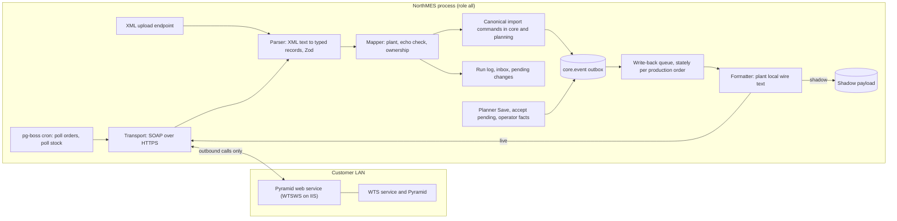
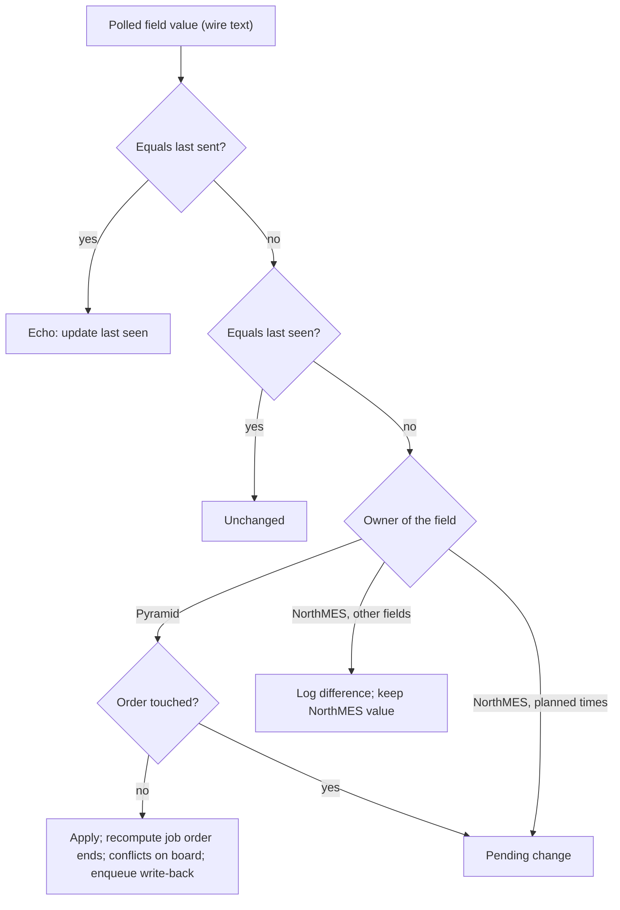

# Pyramid connector

Release 1 connects NorthMES to the pilot customer's Pyramid ERP through one connector module, `pyramid-connector`. The connector polls Pyramid's SOAP web service, or reads an uploaded XML file, and treats each response as a snapshot. It maps every changed order into core's and planning's canonical import commands inside the plant the order belongs to, and writes nothing for unchanged orders. It recognizes its own write-backs by comparing exact wire strings, turns ERP changes to orders a planner has touched into pending changes, and derives the dates of Pyramid's planned stock movements from the current plan. Write-back sends planned times, lock, status and priority per Pyramid operation row: in shadow mode until a write method is verified, then live. Everything Pyramid-specific stays inside the connector, so core and planning stay ERP-agnostic. The general rules are in [ADR 0031](../adr/0031-erp-integration-connector-modules-field-ownership-and-pending-changes.md), the Pyramid specifics in [ADR 0032](../adr/0032-pyramid-connector-polling-file-mode-and-shadow-write-back.md).

## Scope

| In release 1 | Not in release 1 |
|---|---|
| Import of production orders, operations and material lines | Generic CSV or Excel import |
| Customers (number and name only), articles (create only) | Customer addresses, phone numbers, organisation numbers |
| Equipment groups, equipment and tools, created on import when unknown | BOM explosion into child orders (Pyramid sends exploded materials) |
| Stock balances and planned movements, with re-dated T and R rows | Push from Pyramid (nothing documents it) |
| Polling, a Sync now action and file mode | An integration REST API for outside systems ([ADR 0031](../adr/0031-erp-integration-connector-modules-field-ownership-and-pending-changes.md)) |
| Echo detection, field ownership, pending changes | A shared core import service (waits for a second connector) |
| Import log, import inbox, integration card | A circuit-breaker table, per-order desired and sent versions |
| Write-back of planned times, lock, status and priority, shadow first | Quantity and deadline write-back, unless the Pyramid administrator confirms a method that accepts them |

The release 1 scope and the cut list are in [ADR 0055](../adr/0055-release-1-scope-under-option-b-and-the-scope-rule.md). If the write method arrives late, live write-back is cut item 4: the pilot runs shadow mode with the daily write-back report, provided the product owner accepts double entry in Pyramid for a set period.

## 1. Module and boundaries

The connector is an in-repo module on the same `defineModule` contract as every other module ([ADR 0003](../adr/0003-module-package-shape-and-the-definemodule-manifest.md)), licensed like the rest of core.

| Name | Value |
|---|---|
| Module id | `pyramid-connector` |
| GraphQL prefix, permission and command prefix | `pyramidConnector` |
| SQL schema, owner role | `pyramid_connector`, `nm_mod_pyramid_connector` |
| Server package | `@northmes/module-pyramid-connector`: manifest, `server/transport`, `server/parser`, `server/mapper`, `server/jobs`, `server/graphql`, migrations, `test/fixtures` |
| Web package | `@northmes/pyramid-connector-web` (proposed; whether the connector ships its own remote is open, M-31 in [16-open-questions.md](16-open-questions.md)): integration card, settings, import log, inbox, pending changes, board slot contributions |
| Contracts package (MIT) | `@northmes/pyramid-connector-contracts`: settings schema, command inputs, error codes, inbox error codes |
| `dependsOn` | `core`, `planning` |

Dependency arrows point toward core ([ADR 0002](../adr/0002-modular-monolith-with-module-owned-schemas-and-process-roles.md)). The connector calls `CoreApiModule` and `PlanningApiModule` in process for lookups and for the canonical import commands. It consumes planning's events through the outbox for write-back. Core and planning never import the connector, and the board shows connector data only through planning slots that the connector fills.

The connector runs in process. Polling and write-back belong to the `worker` part; the upload endpoint and the subgraph belong to the `api` part. The pilot runs role `all`, so both run in one process.

The connector acts as a system principal seeded by migration in `core.system_principal`, with surface `connector` ([ADR 0013](../adr/0013-audit-trail-written-in-the-command-transaction.md)). Each poll opens a run command on the run log. Each changed order opens its own command with `correlation_id` set to the run id and `causation_id` set to the run command id. Unchanged orders and unchanged runs write no order commands. A file-mode import acts for the user who uploaded the file.



## 2. Transport, parser, mapper and file mode

### 2.1 Transport

- SOAP 1.1 over HTTP with `fetch` and one hand-written envelope per method. A generated SOAP client pays off only if the WSDL turns out to have many methods.
- Pyramid's web service is WTSWS, an ASP.NET application on IIS that forwards requests to the WTS Windows service. The endpoint path ends with the Pyramid company's serial number. NorthMES makes only outbound calls from the Linux host to IIS on the LAN; the WTS ports stay between IIS and Pyramid.
- When authentication is on in WTSWS, the request carries username and password in the SOAP header. The vendor recommends a TLS certificate and IP restrictions on WTSWS; the install guide asks the Pyramid administrator for both, restricted to the NorthMES host.
- The method names come from the WSDL of the pilot's installation and live in the transport code, not in core.
- Every call uses `AbortSignal.timeout` with the timeout from the connector settings, because `fetch` has no overall default and a hung WTSWS would otherwise hold a worker for minutes.
- The SOAP password is a write-only secret, encrypted with the installation key. Its AES-GCM associated data binds table, row, column and the normalized endpoint host, so a settings change that moves the endpoint to another host without a new password fails with `core.secret_reentry_required` ([ADR 0047](../adr/0047-secrets-and-the-installation-key.md)).
- The Pyramid endpoint is an admin-set outbound URL on a private network, so its host needs an entry in the installation setting `outbound.allowedHosts`, which `northmes installation set` changes on the host ([ADR 0066](../adr/0066-companies-created-by-the-cli-plant-slugs-unique-per-installation-company-settings-at-settings-and-an-onboarding-wizard-before-a-plant-opens.md)). Link-local targets (`169.254.0.0/16`) and the database host are always blocked, with no exception.
- The two error texts the vendor documents for WTSWS (no WTS engine reachable, authentication failed) get their own error codes and messages on the integration card.

### 2.2 Parser

The parser takes a string, so polling and file mode share it.

- fast-xml-parser with `parseTagValue: false`, `removeNSPrefix: true` and an `isArray` callback for order rows, operation rows, material lines and stock rows. With the default `parseTagValue: true`, an order row reference such as `5001.20` becomes the number `5001.2`.
- The parser rejects external entities, `__proto__` element names, DOCTYPEs that expand entities (billion laughs) and deep nesting.
- A Zod schema in the contracts package validates every element after parsing.
- All data is element text, with no attributes. Empty values arrive as self-closing elements; the schema reads them as null.
- Exactly three date formats are accepted, and anything else is a row error: `yyyy-MM-dd HH:mm:ss` (order deadline), `yyyy-MM-dd HH:mm` (operation planned times), `yyyy-MM-dd HH.mm` with a dot (stock movement time).
- CustomData on order and operation is stored as an ordered list of `{ key, value }` in JSONB, keys exactly as sent (including non-ASCII letters), values as strings, empty as null, with a size cap. Only the keys named in the connector settings are interpreted.

### 2.3 Mapper and canonical commands

The mapper turns typed records into canonical commands. Every command runs through the normal command pipeline ([ADR 0012](../adr/0012-commands-as-the-single-write-path.md)): Zod contract, permission at the target's scope, audit context, version check, validators, outbox events. The command names below are the working names; [ADR 0031](../adr/0031-erp-integration-connector-modules-field-ownership-and-pending-changes.md) fixes them.

| Command | Owning module | Content |
|---|---|---|
| `upsertCustomer` | core | Customer number and name only, company scope |
| `upsertArticle` | core | Create only: article number and description |
| `upsertEquipmentGroup` | core | By category name, company scope |
| `upsertEquipment` | core | By external code, mapped plant |
| `upsertTool` | core | From the configured tool code and name keys, mapped plant |
| `upsertRoutingOperation` | core | Keyed by (article, operation number), respects "do not update" |
| `upsertCustomerOrder`, `upsertCustomerOrderLine` | not fixed (see open items) | Order number from the order list, line from the stock `O` row matched by customer order number plus article |
| `upsertProductionOrder` | planning | Header, operations, materials and external data in one command, so lag-to-lead and start-next-after values can move between operations |
| `replaceStockSnapshot` | not fixed (see open items) | Balances and planned movements, scoped to the connector, applied as a diff |
| `reportSourceProgress` | planning | Status and quantities, only when operators report in Pyramid |
| `markSourceMissing` | planning | An order that disappeared from the snapshot |

### 2.4 File mode

File mode imports an uploaded Pyramid XML response through the same parser and mapper.

- One REST endpoint in the `api` role, `POST /api/v1/pyramid-connector/import-file`, a first-party route of the connector ([ADR 0064](../adr/0064-rest-routes-under-api-v1-and-openapi-from-zod-contracts.md)). It is cookie-authenticated, so the same-origin check and the CSRF header apply ([ADR 0011](../adr/0011-principals-credentials-and-same-origin-rules.md)).
- One file per request, at most 25 MB, content type `text/xml` or `application/xml`.
- The SHA-256 of the file is the input digest on the command row.
- Permission `pyramidConnector.import:upload` at company scope, held by the admin role only by default.
- The upload enqueues an import job that acts for the uploader. The parser tells an order list from a stock list by the response body element.
- File mode serves development and the first pilot weeks before network access to WTSWS exists. The first import of pilot data runs in file mode on a throwaway install and is reviewed there. There is no dryRun command.

## 3. Polling with pg-boss

Nothing documents a push from Pyramid, so the connector polls. Jobs run on pg-boss behind the SDK `jobs` API ([ADR 0014](../adr/0014-outbox-event-log-and-pg-boss-jobs.md)). Queue names are proposed.

| Queue | Trigger | Policy | Work |
|---|---|---|---|
| `pyramid_connector.poll_orders` | pg-boss cron, default every 5 minutes; Sync now | `stately`, `singletonKey` = connector id | Fetch the order list and run one import run |
| `pyramid_connector.poll_stock` | pg-boss cron, default every 15 minutes; Sync now | `stately`, `singletonKey` = connector id | Fetch the stock list and apply it |
| `pyramid_connector.write_back` | Planning events through the outbox | `stately`, `singletonKey` = production order id | Send the order's current state (section 12) |
| `pyramid_connector.reconcile` | Going live; last step of `restore.sh` and `rollback.sh` | One per connector | Compare open orders with Pyramid's last seen values |
| `pyramid_connector.prune_payloads` | Daily cron | Singleton | Apply the raw payload retention (section 4) |

- A pg-boss schedule runs each cron slot once across processes. The intervals are connector settings; the defaults come from internal research note 10.
- `stately` allows one active and one queued run per key, so Sync now during a run queues exactly one follow-up.
- Every job payload carries `schema_version`; a handler parks an unknown version in the dead-letter state instead of retrying.
- A poll that fails on transport ends its run with status `failed` and an error code; the next slot polls again.
- Write-back transport errors retry with `retryBackoff` and a high `retryLimit`, or a dead letter that failed on transport is redriven on the first successful poll. The dead letter keeps only SOAP faults on data. The integration card lists failed write-backs with a retry action.
- When Pyramid is unreachable, `/health/ready` lists it in the degraded list and System health shows the last successful Pyramid poll ([ADR 0043](../adr/0043-health-endpoints-graceful-shutdown-and-the-system-health-page.md)). The process keeps running. The board header shows "Pyramid data as of <time>" through planning's header slot `planning/board/header/v1`.
- A restore drill sets one environment flag that skips integration crons and forces shadow mode ([ADR 0045](../adr/0045-backups-restore-drills-upgrades-and-rollback.md)).

## 4. Snapshot semantics

Each response is a full snapshot of the open orders, or of the stock list. If the administrator later confirms a changed-since filter, this section is revisited.

One run follows these steps:

1. Open the run command and the run row.
2. Hash the raw response (SHA-256). If the hash equals the previous run's hash for the same method, the run is `unchanged` and mapping is skipped.
3. Otherwise, strip `Customer` elements other than `ExternalId` and `CustomerName`, store the payload and parse it.
4. Apply the shrink guard (below).
5. For each order, compute a hash of its canonical form. An unchanged order produces no command. A changed order resolves its plant (section 5) and runs in one transaction; an order with an invalid operation is not applied in part and goes to the inbox as a whole.
6. Find missing orders by set difference in memory between the snapshot's order references and the connector's open external links, and call `markSourceMissing` for each. Rows are never stamped on each run.
7. Close the run with counts: created, updated, unchanged, pending, failed.

Rules:

- Imports write only rows whose own columns differ (`update ... where (columns) is distinct from (new values)`). A changed CustomData note or material line does not bump every job order's version and does not turn planners' draft rows stale after a poll. The draft conflict check compares planning fields or the plan revision ([ADR 0029](../adr/0029-per-planner-drafts-soft-locks-and-the-plan-revision.md)).
- An order missing from a snapshot is never deleted. If its last status was finished or delivered, it is closed; otherwise it is flagged for the planner.
- Shrink guard: a run that would flag more than max(10, 20 percent) of open orders missing, or cut the stock rows below 50 percent of the previous run, is held as an inbox item for an admin and not applied. An empty response after an outage therefore flags zero orders missing.
- Raw payloads are stored only when the hash changes. The connector keeps the last 50 runs per method plus runs that open inbox items reference, and nothing older than 7 days. The app does not compress payloads; Postgres TOAST does.
- The stock snapshot applies as a diff keyed by (connector, ReferenceType, ReferenceNumber, ArticleNumber, Warehouse). In an internal measurement, replacing 50 000 stock rows wrote 33 MB of WAL per stock poll; the diff and `wal_compression=zstd` on the database ([ADR 0005](../adr/0005-postgres-18-official-image-with-pgbackrest-timescaledb-deferred.md)) keep that down.
- The raw payload, inbox and run log tables are command-only with the payload hash on the command row, so whole payloads never enter the append-only audit trail. Business changes from an import are audited like any other command ([ADR 0013](../adr/0013-audit-trail-written-in-the-command-transaction.md)).

## 5. Plants and scopes

One connector instance serves one company ([ADR 0007](../adr/0007-tenancy-company-plants-and-the-scope-tree.md)).

- For each order the connector resolves the plant first: the warehouse-to-plant rules, or the default plant when no rule matches. The order's transaction runs with read and write scopes {company, mapped plant}. Codes are unique per scope ([ADR 0009](../adr/0009-code-uniqueness-per-scope-with-an-exclusion-constraint.md)), so a lookup by tool code or equipment code sees at most one match even when two plants both have tool `T-100`.
- Auto-created equipment and tools go to the mapped plant. Equipment groups and customers go to the company. A company-level auto-create that hits the code exclusion constraint (SQLSTATE 23P01) goes to the inbox with the clash named.
- ERP local times are parsed in the mapped plant's IANA zone, read through `CoreApiModule`. Write-back formats with the zone of the order's plant. The connector settings hold no plant, zone or deadline time-of-day keys; the zone is the plant record's `core.plant.time_zone`, and the deadline rule is a planning plant setting.
- `WarehouseIn` and `WarehouseOut` are warehouse codes. Which one is the material source and which the output is not verified, so until the administrator answers, both must map to the same plant.
- A Pyramid plant change (the order moves to a warehouse of another plant) and an order that maps to two plants are row errors. The order goes to the inbox with a named reason, and the existing NorthMES order stays unchanged until the product owner decides how plant moves work.
- Inbox items carry `candidate_plant_id` at company scope. Assigning a plant checks `can()` at the target plant.

## 6. Field mapping

The tables use the generic element names of Pyramid's order list response (`ManufacturingOrderOperationData`) and stock list response (`ArticleInventoryList`). Direction: in (Pyramid to NorthMES), out (written back), both. NorthMES names follow [ADR 0026](../adr/0026-planning-domain-names-aligned-with-isa-95.md) and the [glossary](../../GLOSSARY.md).

### 6.1 Order header (`ManufacturingOrderOperations`)

| Pyramid element | NorthMES target | Dir | Rule |
|---|---|---|---|
| `OrderNumber` | Production order external reference and display number | in | Opaque string; match key for orders |
| `CustomerOrderNumber` | Link to the customer order | in | Empty on stock orders. The order list has no line number; the line comes from the stock `O` row |
| `PlannedQuantity` | Production order quantity | in | Decimal string to `numeric(18,6)` in the article's stock unit |
| `ProductionStatusId` | Production order status | both | Status map (section 6.6), ownership in section 10 |
| `WarehouseIn`, `WarehouseOut` | Plant resolution; external data until the meaning is confirmed | in | Section 5 |
| `DeadlineDate` | Production order deadline (a date) | in | `yyyy-MM-dd HH:mm:ss`, always 00:00:00 in the samples. Stored as a date plus the plant's deadline time-of-day rule, start of day by default ([ADR 0028](../adr/0028-autoplan-as-a-pure-deterministic-function.md)) |
| `ColorCode` | Production order color | in | `#RRGGBB` |
| `AutoplanDirection` | Planning direction | in | Only `Backward` seen |
| `Priority` | Production order priority | both | Integer |
| `Note` | Production order note | in | Free text |
| `CustomData/*` | External data | in | Passthrough |
| `Customer/ExternalId`, `Customer/CustomerName` | Customer number and name | in | The only customer fields imported |
| Other `Customer` elements (registration number, addresses, phone, home page, note) | Not imported | none | Stripped before the raw payload is stored; some can be personal data |
| `Article/ArticleNumber` (equal to `Article/ExternalId`) | Article code and external reference | in | Create only |
| `Article/ArticleDescription` | Article name in the default language | in | Create only |
| `Id`, `Customer/Id`, `Article/Id`, `Operations/Id`, `Operations/EquipmentId` | None | none | Empty receiver slots; the administrator says whether write-back needs them |

### 6.2 Operation rows (`Operations`)

| Pyramid element | NorthMES target | Dir | Rule |
|---|---|---|---|
| `ProductionOrderNumber` | Production order operation external reference; write-back key | in (key) | Opaque string `<order>.<row>` (section 7) |
| `OperationNumber` | Operation sequence | in | 1 to n within the order |
| `OperationDescription` | Operation name | in | |
| `EquipmentCode` | Equipment by external code in the mapped plant; seeds the job order's equipment on first import | both | Unknown codes follow the auto-create setting. Machine or resource group is not verified |
| `EquipmentName` | Equipment name on create | in | |
| `EquipmentCategory` | Equipment group by name | in | Upsert at company scope |
| `ProductionStatusId` | Operation status | both | Status map, section 10 |
| `PlannedQuantity` | Operation quantity | in | Decimal string |
| `PlannedStartTime`, `PlannedEndTime` | Seed the job order on first import; compared as wire text afterwards | both | Sections 6.7 and 9 |
| `CycleTime` | `cycleSeconds` | in | Unit map and `cycleTimeBasis` (section 8); 0 on setup rows |
| `QuantityPerCycle` | `piecesPerCycle` | in | Empty means 1 |
| `RetoolTime` | `retoolSeconds` | in | Unit map |
| `ExtendedTime` | Folded into the next operation's retool, or `fixedSeconds` | in | Section 6.5 |
| `LeadTime` | Lead time on this (waiting) operation | in | Unit map |
| `LagTime` | Next operation's lead time, by the lag-to-lead rule | in | Unit map; the larger of the two values with an import warning when both are set |
| `StartNextAfterQuantity` | Stored on this (releasing) operation | in | 0 means unset; an article quantity |
| `Oee` | `oeeTarget` as a ratio | in | Integer percent divided by 100; 0 or empty maps to null (inherit) with an import warning ([ADR 0027](../adr/0027-planned-duration-formula-and-override-precedence.md)) |
| `IsLocked` | `isLocked` on the operation | both | Working default: the lock lives on the operation, as in Pyramid |
| `StartedQuantity`, `FinishedQuantity` | Reported progress | in or out | In through `reportSourceProgress` when operators report in Pyramid; out when they report in NorthMES and a write method accepts quantities |
| `CustomData/*` | External data; configured keys give tool code, tool name, operation priority and operation note | in, priority both | Section 15 |

Operation and operation equipment rows marked "do not update" in NorthMES are not changed by an import ([ADR 0026](../adr/0026-planning-domain-names-aligned-with-isa-95.md)).

### 6.3 Material lines (`Operations/BillOfMaterials/Article`)

| Pyramid element | NorthMES target | Rule |
|---|---|---|
| `ArticleNumber`, `ArticleDescription` | Operation material article | The article is created when missing |
| `Quantity` | Operation material quantity | Total for the order, already multiplied (not per piece); `numeric(18,6)` |
| `Note` | Operation material note | |

Material lines carry no Pyramid row number. The stock `T` row of a material line is matched by order number and article number.

### 6.4 Stock list (`ArticleInventoryList/Article`)

| Pyramid element | NorthMES target | Rule |
|---|---|---|
| `ArticleNumber`, `ArticleDescription` | Article | |
| `Warehouse` | Warehouse by external code | Mapped to a plant; a setting says which warehouses count |
| `StockQuantity` | Balance per (article, warehouse) | Repeated on every row of that pair |
| `ReferenceType` | Movement kind | Table below |
| `ReferenceNumber` | Movement external reference | Opaque: `<document>.<row>` for I, T, O, M and N; the order number for R |
| `Time` | Planned date | `yyyy-MM-dd HH.mm`, always 00.00 in the samples; a date in the past counts as due now |
| `Quantity` | Signed movement quantity | `numeric(18,6)` |
| `ReferenceTypeName` | Ignored | Label text |
| `Note`, `CustomData` | Passthrough | |

| ReferenceType | Meaning | Sign | NorthMES handling |
|---|---|---|---|
| I | Purchase order line | positive | Kept as sent |
| A | Purchase requisition | positive | Kept as sent; whether it counts in the material warning is open |
| T | Manufacturing material line | negative | Consumption, re-dated (section 11) |
| R | Manufacturing report-back, planned output | positive | Output, re-dated (section 11) |
| O | Customer order line | negative | Kept as sent; the source of customer order lines |
| M | Transfer out | negative | Kept as sent; pairs with N on one reference |
| N | Transfer in | positive | Kept as sent |

### 6.5 Created on import, and setup rows

- Customer: company scope, number and name.
- Article: create only. The sample data carries no unit, so an article created by import gets the stock unit `PIECE` until someone sets it in NorthMES ([ADR 0023](../adr/0023-si-units-with-a-northmes-unit-catalog.md)).
- Equipment group: company scope, by category name. Its color keeps an existing color, else the import color, else one of the 20 palette colors.
- Equipment: mapped plant. A setting decides the initial plannable flag: plannable with an inbox review item, or the import blocks the order until the code is mapped. `plan()` returns job orders on non-plannable equipment under `notPlannable`.
- Tool: mapped plant, from the configured tool code and tool name keys, with an operation tool link.

A Pyramid site can model setup as its own operation row. The connector treats a row with `CycleTime` 0 and a non-empty `ExtendedTime` as a setup row (the pattern in the sample data; the administrator confirms it). When a setup row and the next production row share an `EquipmentCode`, the connector folds the setup row into the next operation by default: its retool seconds become that operation's own `RetoolTime` plus the setup row's `ExtendedTime`. Autoplan then cannot place another order's job between setup and production. A connector setting keeps setup rows as their own operations, and then the planning rules require adjacency on the same machine. Without folding, `ExtendedTime` maps to `fixedSeconds`.

### 6.6 Status map

The product owner described Pyramid's six status ids. The connector setting `statusMap` holds this map by default, and the administrator confirms it.

| Pyramid id | Meaning | NorthMES status |
|---|---|---|
| 1 | Registered | `registered` |
| 2 | Planned | `planned` |
| 3 | Active | `active` |
| 4 | Paused | `paused` |
| 5 | Done | `finished` |
| 6 | Delivered | `delivered` |

NorthMES also has `cancelled`; the sample data shows no Pyramid id for it. Header status does not roll up from operation status in Pyramid (a sample order has header status 2 with an operation at 3), so the connector maps header and operation status separately.

### 6.7 First import of an operation

- The first import of an operation creates one job order on the given equipment. Its start is Pyramid's `PlannedStartTime`. Its end is computed with `addWork` over NorthMES availability for the planned duration ([ADR 0024](../adr/0024-time-utc-instants-plant-wall-clock-temporal-and-the-clamp-resolver.md)), and the difference from Pyramid's end is logged. Pyramid intervals that stretch over closed time (a few hours of work spread over a night) come out right this way.
- Job orders imported at Pyramid's planned times may overlap. The board shows them as conflicts; the import does not move them ([ADR 0029](../adr/0029-per-planner-drafts-soft-locks-and-the-plan-revision.md)).
- Imported orders plan independently by their ERP deadlines. Pyramid's order list has no parent reference, so the connector never guesses child order links ([ADR 0028](../adr/0028-autoplan-as-a-pure-deterministic-function.md)).

## 7. External references stay opaque

Every identifier and code from Pyramid is a string, never a number: `OrderNumber`, `ProductionOrderNumber`, `ReferenceNumber`, `CustomerOrderNumber`, `EquipmentCode`, article numbers, warehouse codes and tool codes.

- `ProductionOrderNumber` has the shape `<order>.<row>`, for example `5001.20`. The suffix is Pyramid's order row number, which material rows share (a stock `T` row can be `5001.10`). It is not the operation number. Code never splits it, parses it, rounds it or sorts it numerically, and compares it by string equality.
- Orders match on `OrderNumber` and operations on `ProductionOrderNumber`, both as strings.
- `pyramid_connector.external_link` maps each external reference to its NorthMES entity (section 14). Core and planning entities carry the reference in the `externalRef` value type from `@northmes/contracts`, which holds no Pyramid meaning.
- Screens show the reference exactly as Pyramid sends it.

## 8. Units per Pyramid field

The connector owns the map from Pyramid fields to catalog units, because nothing in core may be Pyramid-specific. Conversion happens at connector input; metric data is stored in its canonical SI unit ([ADR 0023](../adr/0023-si-units-with-a-northmes-unit-catalog.md)).

| Pyramid field | Pyramid representation | NorthMES storage | Setting |
|---|---|---|---|
| `CycleTime` | Integer; the samples fit seconds per piece | `cycle_time_s`, `double precision`, seconds per cycle | Time unit, plus `cycleTimeBasis` (`perPiece` or `perCycle`) with no default. `perPiece` maps to `cycleSeconds = CycleTime x QuantityPerCycle`; `perCycle` maps to `cycleSeconds = CycleTime` |
| `RetoolTime`, `LeadTime`, `LagTime`, `ExtendedTime` | Integer, unit not verified | `retool_time_s`, `lead_time_s`, fixed seconds, `double precision` | One time unit per field, no default |
| `Oee` | Integer percent | `oee_target_ratio` (0.75 for 75) | None; 0 or empty maps to null |
| `QuantityPerCycle` | Integer | Pieces per cycle | None; empty means 1 |
| `PlannedQuantity`, BOM `Quantity`, `StockQuantity`, `Quantity`, `StartedQuantity`, `FinishedQuantity`, `StartNextAfterQuantity` | Decimal text | `numeric(18,6)` in the article's stock unit | None; never parsed to a float |
| `PlannedStartTime`, `PlannedEndTime`, `DeadlineDate`, `Time` | Plant local wall clock | `timestamptz` instants (UTC), deadline as a date | None; the plant zone |
| `Priority` | Integer | Integer | None |

The import refuses to map operations until `cycleTimeBasis` and every field time unit are set, and the integration card says which setting is missing. Values the connector converted are not kept as entry columns: the last seen store already holds the external text.

## 9. Echo detection

Write-back changes Pyramid, and the next poll reads those values back. The connector must recognize its own values without raising pending changes.

For each external reference and field, the connector stores:

- last seen: the exact text of the XML element from the last poll;
- last sent: the exact text the formatter produced, with a state (`sending` or `sent`) and the job id.

A poll classifies each incoming value by string equality, before any parsing:

| Incoming text equals | Class | Action |
|---|---|---|
| Last sent, state `sending` or `sent` | Echo | Update last seen; no change |
| Last seen | Unchanged | Nothing |
| Neither | Real ERP change | Ownership rules (section 10); update last seen |

Why strings: write-back sends `yyyy-MM-dd HH:mm` in plant local time. Seconds are lost (an end at 14:31:20 goes out as `14:31`). A time in the repeated autumn hour, 2026-10-25T01:30Z in `Europe/Stockholm`, goes out as `2026-10-25 02:30`, which parses back to the first occurrence, 00:30Z. Comparing instants would raise a false pending change after almost every write-back.

Rules:

- The write-back job commits a `sending` row (value and job id) before the SOAP call and marks it `sent` afterwards. A poll that runs in between treats the value as an echo. There is no per-order advisory lock, because a lock cannot span the SOAP call.
- Write-back skips a payload equal to last sent after minute rounding.
- If the pilot shows that Pyramid normalizes written values, the first value read back after each write becomes that field's echo baseline.
- Shadow sends never update last sent. In shadow mode the connector logs every polled planned time that differs from the text in the latest shadow payload, so the pilot shows how Pyramid's text and NorthMES's formatting compare before live mode.
- After the first import, a Pyramid planned time that differs from both stored texts becomes a pending change for the planner (section 10). It is never silently ignored.
- Parsing local times uses `resolveWallClock` with the clamp rule ([ADR 0024](../adr/0024-time-utc-instants-plant-wall-clock-temporal-and-the-clamp-resolver.md)): `2027-03-28 02:30` (inside the spring gap) resolves to 01:00Z, and `2026-10-25 02:30` (the repeated hour) resolves to its first occurrence, 00:30Z.
- The formatter clamps an end that would format earlier than its start to the first wall time after the repeated hour: the interval [2026-10-25T00:50Z, 01:10Z) formats as `02:50` and `03:00`.

## 10. Field ownership and pending changes

The product owner said the planning tool is master over the ERP for every field it can change; the working answer gives the ERP the business facts and NorthMES the planning fields. Until the product owner answers, the working default is per-field ownership as in the table below ([ADR 0031](../adr/0031-erp-integration-connector-modules-field-ownership-and-pending-changes.md)). Live write-back cannot be selected until this question is answered.

An order is touched when a committed planner change exists, a live soft lock exists, or one of its job orders has started. Expired draft rows do not count.

| Fields | Owner | Real ERP change, order untouched | Real ERP change, order touched |
|---|---|---|---|
| Quantity, deadline, customer, article, materials, cancellation | Pyramid | Apply | Pending change |
| Planned start and end | NorthMES | Pending change | Pending change |
| Equipment, `isLocked`, priority | NorthMES | Not applied; logged as a difference in the import log | Same |
| Status 1 (registered) and 6 (delivered) | Pyramid | Apply | Apply |
| Status 2 to 5, reported quantities | The system operators report in (setting `operatorReportingSystem`) | Apply when Pyramid; pending change when NorthMES | Same |
| Operation template values (cycle time, retool, OEE target, pieces per cycle) | Pyramid, unless "do not update" | Apply | Pending change for released operations |
| Article details, groups, colors, tools after creation | NorthMES | Ignore | Ignore |



Untouched orders. When an ERP change applies to an untouched order, the import recomputes each job order's end at its current start with the shared duration function ([ADR 0027](../adr/0027-planned-duration-formula-and-override-precedence.md)), marks resulting overlaps and precedence breaks as conflicts on the board and in the import log, and enqueues write-back.

Pending changes. A pending change records the order, the field, the ERP text and the NorthMES value. The board shows a badge through planning's board field slot `planning/board/block-fields/v1`, and the connector's pending change list shows the detail. Pending changes live in the connector's schema in release 1; a shared core import service waits for a second connector.

- Accept runs `planning.commitScheduleChanges(source: externalChange)`, the same command that serves Save and the autoplan apply ([ADR 0029](../adr/0029-per-planner-drafts-soft-locks-and-the-plan-revision.md)). It takes the order's soft lock if it is free and is refused with the holder's name otherwise. It rebases the accepting planner's own draft rows: new duration at the draft position, new base version.
- Reject keeps the NorthMES value. Last seen already suppresses a repeat of the same rejected value (another poll with quantity 8 after rejecting 8 creates nothing; a 9 creates a new pending change), so there is no `rejected_value` column.
- A computed "differs from ERP" flag (NorthMES value against last seen) shows on Pyramid-owned fields on the board and in the import log. Quantity and deadline join write-back only if the Pyramid administrator confirms a method that accepts them.
- Proposed spread rule for a quantity change, which the product owner confirms: the delta goes to the last not-started job order by planned start. A decrease below the reported quantities, or an operation with no not-started job order, stays pending as "split by hand".

## 11. Stock: re-dated T and R rows

Pyramid's balance and its `T` quantities may already reflect material issued to a started operation, which NorthMES cannot see. Ignoring `T` and `R` rows and computing consumption separately would count some material twice. The connector therefore keeps Pyramid's `T` and `R` quantities and derives only their dates from the current NorthMES plan.

- The connector emits canonical movements of kind `consumption` (from `T`) or `output` (from `R`) with `productionOrderId` and `articleId`, and keeps the ERP date as a fallback. Production orders created in NorthMES get the same links from their operation materials.
- One pure function in `@northmes/planning-domain`, `projectMaterial(placements, movements, now)`, derives the dates when read ([ADR 0028](../adr/0028-autoplan-as-a-pure-deterministic-function.md)):
  - consumption at the earliest setup start among the consuming operation's job orders (the earlier operation when two operations consume the article);
  - output at the latest end of the last operation;
  - the ERP date for an order that is not placed;
  - now, when the derived date is in the past.
- It sorts by (instant, incoming before outgoing, id), sums per article over the plant's mapped warehouses and returns warnings per job order. `plan()`, the board read model and the board's draft overlay all call it.
- The dates are never stored at import. After a move, the material warning changes on the next refetch even when the stock import log says the run was unchanged.
- Rows of the other reference types stay as sent; overdue rows count as due now.
- Not verified: whether `T` rows show the remaining or the total quantity, and whether Pyramid recalculates its own material dates after a write-back.

## 12. Write-back

### 12.1 What is written

Per Pyramid operation row:

| Pyramid field | Value | Rule |
|---|---|---|
| `PlannedStartTime` | Earliest start among the operation's job orders | Plant local `yyyy-MM-dd HH:mm` |
| `PlannedEndTime` | Latest end among the operation's job orders | Same format; end-before-start clamp (section 9) |
| `EquipmentCode` | The machine's external code when all job orders of the operation sit on one machine that has one | Otherwise Pyramid's code stays and the board marks the row "not mirrored". A move to a machine without an external code warns |
| `IsLocked` | The operation's lock | |
| `ProductionStatusId` (operation and header) | Through the status map | Only statuses NorthMES owns (section 10) |
| `Priority` and the configured operation priority key | Order and operation priority | |
| `StartedQuantity`, `FinishedQuantity`, scrap | Net reported quantities | Only when operators report in NorthMES and the write method accepts quantities; a correction sends the new net |

Never written: tool choice, draft content, proposal content, and quantity or deadline unless the administrator confirms a method that accepts them.

### 12.2 When it runs

- Write-back consumes committed planning events: `planning.job_order.scheduled`, `planning.job_order.lock_changed`, and the status and progress changes from operator reports (that event is not yet named in the release 1 event catalog). A contract test asserts that the connector subscribes to no `planning.draft.*` event and no `*.soft_lock_changed` event, so a soft lock enqueues zero write-back jobs ([ADR 0014](../adr/0014-outbox-event-log-and-pg-boss-jobs.md)).
- Committed state changes only through Save, the autoplan apply, accept-pending, the untouched-order recompute and operator facts. Agent proposals reach Pyramid only after a planner saves them ([ADR 0036](../adr/0036-agent-proposals-as-planning-records-a-person-commits.md)).
- Write-back is state transfer on a `stately` queue keyed by production order: at most one queued and one active job per order. The handler reads the order's current committed state and sends every operation row whose state differs from last sent. Ten quick moves become one or two SOAP calls, and a retried write is harmless because it carries absolute values.
- A consumer inbox row makes a redelivered event a no-op. Worker concurrency is a connector setting.
- Whether the write method takes one operation row or a whole order per call is not known until the WSDL arrives. The transport hides this behind a write-method adapter, so a file export or a REST bridge can replace the SOAP method.

### 12.3 Shadow mode and going live

Shadow mode is the default and the only mode until a write method is verified. A shadow send writes `shadow_payload` and `shadow_at`, makes no SOAP call and never updates last sent. The planner gets a daily write-back report: per order, what NorthMES would have written that day.

```mermaid
stateDiagram-v2
  [*] --> Shadow
  Shadow --> ReconcilePreview: admin selects live (write method configured, field ownership answered)
  ReconcilePreview --> Shadow: admin cancels
  ReconcilePreview --> Live: admin confirms; one write-back per differing order
  Live --> Shadow: admin selects shadow (audited settings command)
  Live --> ReconcilePreview: restore.sh or rollback.sh, after the next poll
```

1. The settings schema refuses `writeBackMode: live` until the write-method adapter is configured and field ownership is answered.
2. Going live is an audited settings command ([ADR 0022](../adr/0022-shared-building-blocks-packages-the-master-data-kit-settings-and-generators.md)). It enqueues a one-time reconcile of all open orders: compute each order's state, compare it with Pyramid's last seen values (last sent is empty after shadow mode), and show the admin the count of differing orders and a sample.
3. On confirmation, the connector enqueues one write-back per differing order.
4. The sender re-reads the mode inside the job right before the SOAP call. Switching back to shadow while a job is queued produces zero requests.

After a restore or rollback, the same reconciler is the last step of `restore.sh` and `rollback.sh`, after the next poll has reset last seen. A restore sets last sent back in time while Pyramid keeps the later plans ([ADR 0045](../adr/0045-backups-restore-drills-upgrades-and-rollback.md)).

A diff preview screen before going live and a switch per field group (which fields write back) wait until the write method is known.

### 12.4 Build order, dates and fallback

Build order: file-mode import first, then shadow write-back whose body matches the recorded request and response pairs, then the live transport.

| Date | What must hold |
|---|---|
| 2026-10-15 | One written request goes to the pilot's Pyramid administrator and Pyramid reseller (section 17) |
| 2026-11-13 | Method names received |
| 2026-12-18 | A test company endpoint or recorded request and response pairs |
| 2027-01-22 | Live write-back verified (target) |
| 2027-02-26 | If no write path exists, the product owner picks one: a file export that Pyramid imports, a third-party REST bridge for Pyramid, or a pilot without ERP write-back |

## 13. Import log, inbox and integration card

Nothing is dropped silently. Every run, every row error and every failed write-back is visible to an admin.

- The run log lists each run: method, start, end, status (`unchanged`, `applied`, `held`, `failed`), payload hash and counts (created, updated, unchanged, pending, failed), with links to its inbox items. It is an append-only list, so its connection declares `totalCount: false` ([ADR 0016](../adr/0016-graphql-list-conventions-connections-relations-filter-sort-search-and-group-by.md)).
- Inbox items are keyed by (externalRef, errorCode) with first seen, last seen and a count: three polls with the same broken order give one item with count 3. Each item holds the field, the message, the raw XML fragment and `candidate_plant_id` where it applies. An order whose last import failed shows `sourceStale` on the board and in the log.
- The integration card shows the endpoint, the mode (shadow or live), the last successful poll per method, the last error, failed write-backs with a retry action, Sync now, and any setting that blocks the import.
- On the board, through planning's slots: "Pyramid data as of <time>" in `planning/board/header/v1`, and the pending change badge, the "differs from ERP" flag and the "not mirrored" marker in `planning/board/block-fields/v1` (both ids proposed in [ADR 0037](../adr/0037-plugins-drop-in-packages-command-validators-and-ui-slots.md)).

Proposed inbox error codes (contracts package):

| Code | Cause |
|---|---|
| `date_unparseable` | A date in none of the three formats |
| `quantity_invalid` | A quantity that is not a decimal |
| `equipment_unknown` | Unknown `EquipmentCode` while auto-create blocks the import |
| `code_clash` | A company-level auto-create hit 23P01 |
| `plant_moved` | The order's warehouse now maps to another plant |
| `order_spans_plants` | The order's warehouses map to two plants |
| `rates_invalid` | A rate violates the snapshot rules of [ADR 0027](../adr/0027-planned-duration-formula-and-override-precedence.md) |
| `run_held` | The shrink guard held the run |

Proposed GraphQL root fields (prefix rule of [ADR 0015](../adr/0015-graphql-federation-inside-one-process-with-an-embedded-hive-gateway.md)): `pyramidConnectorImportRuns`, `pyramidConnectorInboxItems`, `pyramidConnectorPendingChanges`, `pyramidConnectorStatus`; mutations `pyramidConnectorSyncNow`, `pyramidConnectorAcceptPendingChange`, `pyramidConnectorRejectPendingChange`, `pyramidConnectorAssignInboxPlant`, `pyramidConnectorRetryWriteBack`, `pyramidConnectorConfirmReconcile`. Settings use the shared settings form.

Permissions. `pyramidConnector.import:upload` is decided. The rest are proposed:

| Permission | Scope | Default role |
|---|---|---|
| `pyramidConnector.import:upload` | Company | Admin |
| `pyramidConnector.settings:manage` (settings, mode switch, reconcile) | Company | Admin |
| `pyramidConnector.import:sync` | Company | Admin, planner |
| `pyramidConnector.inbox:resolve` | Company | Admin |
| `pyramidConnector.pendingChange:decide` | Plant | Planner |
| `pyramidConnector.importRun:read` | Company | Admin, planner |

## 14. Data model

Tables in the `pyramid_connector` schema. Every table has `scope_id` and the split row-level security policies ([ADR 0008](../adr/0008-row-level-security-with-transaction-local-scopes.md)) and a lifecycle class ([ADR 0013](../adr/0013-audit-trail-written-in-the-command-transaction.md)). Command-only tables carry the statement-level `audit.require_context()` trigger.

| Table | Content | Lifecycle class |
|---|---|---|
| `run` | id, connector id, method, status, started and ended at, payload hash, counts, error code | operational |
| `raw_payload` | run id, method, SHA-256, stripped body | operational |
| `external_link` | `(company_id, connector_id, entity_type, external_ref, entity_id, plant_id, last_seen, last_sent)`, unique on the first four | operational |
| `write_back_state` | production order, operation reference, field, sent text, state `sending` or `sent`, job id, `shadow_payload`, `shadow_at` | operational |
| `inbox_item` | `(connector_id, external_ref, error_code)` unique, first seen, last seen, count, field, message, fragment, `candidate_plant_id`, status | operational |
| `pending_change` | production order, field, ERP text, NorthMES value, status, decided by | to confirm; History shows it under the production order |
| `stock_row` | The stock snapshot as sent, keyed by (connector, ReferenceType, ReferenceNumber, ArticleNumber, Warehouse) | reference |

## 15. Settings

The settings are a `defineSettings` Zod definition in the contracts package, stored at company scope in audited tables and rendered by the shared settings form ([ADR 0022](../adr/0022-shared-building-blocks-packages-the-master-data-kit-settings-and-generators.md)). Mode switches are audited settings commands, never environment variables.

| Setting | Default | Rule |
|---|---|---|
| `endpointUrl` | none | Ends with the Pyramid company serial; outbound URL allowlist applies |
| `soapUsername`, `soapPassword` | none | Password is a write-only secret; a host change requires re-entry |
| `requestTimeoutMs` | not fixed | Applied to every SOAP call |
| `pollOrdersEvery`, `pollStockEvery` | 5 minutes, 15 minutes | |
| `warehousePlantRules`, `defaultPlantId` | none | Section 5 |
| `stockWarehouses` | none | Which warehouses count |
| `autoCreateEquipment` | none | Plannable with an inbox review item, or block the order until the code is mapped |
| `cycleTimeBasis` | none | `perPiece` or `perCycle`; the import refuses to map operations until set |
| `fieldTimeUnits` | none | Time unit for `CycleTime`, `RetoolTime`, `LeadTime`, `LagTime`, `ExtendedTime` |
| `statusMap` | Section 6.6 | Administrator confirms |
| `setupRowRule` | `fold` | `fold` or `separate` |
| `lagToLeadRule` | larger value, warning when both set | |
| `customDataKeys` | none | Keys for tool code, tool name, operation priority, operation note, and the keys shown on a board block and on hover |
| `operatorReportingSystem` | none | `northmes` or `pyramid`, from the product owner's answer |
| `writeBackMode` | `shadow` | `live` only with a write method and answered field ownership |
| `writeMethod` | none | Write-method adapter configuration |
| `writeBackConcurrency` | not fixed | Worker concurrency |

A settings schema test rejects a `timeZone` key: plant, zone and deadline time of day belong to the plant.

## 16. Tests and synthetic fixtures

Tests are written first ([ADR 0041](../adr/0041-test-strategy-tdd-vitest-projects-testcontainers-and-playwright.md)).

- Fixtures are synthetic. They copy the structure of Pyramid responses with invented order numbers, article codes and placeholder names ("Customer A"). No file that the product owner or a customer shares enters any repository, public or private.
- Recorded request and response pairs from the pilot are customer data. They arrive only after the data processing agreement with the pilot customer is signed and are never committed to any repository. The contract fixture is a synthetic pair written to their structure.
- Integration and e2e tests run against Postgres from `@testcontainers/postgresql` on the pinned production image, with a database per test file cloned from a migrated template.
- A fake PWS server in the test process serves fixture XML and records write-back bodies.
- An opt-in live test runs only against the Pyramid test company with `NORTHMES_PYRAMID_LIVE=1`, never on pull requests.
- The ERP connector contract suite in `@northmes/testing` has a database-free part (the same payload twice gives the same canonical commands; local times parse in the plant zone across DST; unknown fields land in external data; output validates against the contracts schemas) and a database-backed part (inbox dedupe and write-back idempotency against the fake server).

Fixtures:

| Fixture | Contains |
|---|---|
| `orders-basic.xml` | Three orders with operation references `5001.5`, `5001.20` and `5001.2`, material lines, CustomData with non-ASCII keys |
| `orders-setup-row.xml` | A setup row (`CycleTime` 0, `ExtendedTime` 2700) followed by a production row on the same `EquipmentCode` |
| `orders-stock-order.xml` | An order with no customer order number |
| `orders-late.xml` | An operation planned after its order's deadline |
| `orders-dst.xml` | Planned times at `2026-10-25 02:30` and `2027-03-28 02:30` |
| `orders-two-plants.xml` | Tool `T-100` and equipment code `100` used in orders for two plants, warehouses 1 and 2 |
| `orders-customer-details.xml` | Placeholder addresses, phone numbers and a registration number, to prove stripping |
| `orders-broken.xml` | One order with an unparseable date |
| `orders-cycle-basis.xml` | An operation with `QuantityPerCycle` 3 |
| `stock-all-types.xml` | Rows of every reference type, past dates, an M and N pair on one reference |
| Generated stock set | 20 000 stock rows for the WAL and diff test |
| `write-back-pair.xml` | A synthetic request and response pair with the structure of the recorded pairs, once real pairs exist |

Tests (file names proposed, except `write-back.contract.test.ts`):

| Test | Proves |
|---|---|
| `parser.test.ts` | References stay strings and `5001.20` differs from `5001.2`; the three date formats parse and others fail; empty elements are null; CustomData keys keep non-ASCII letters; external entities, entity-expanding DOCTYPEs, `__proto__` names and deep nesting are rejected |
| `mapper.test.ts` | The setup pair folds into one operation with 2 700 s of retool; `CycleTime` 15, `QuantityPerCycle` 3, quantity 9 gives 135 s with `perPiece` and 45 s with `perCycle`, and mapping fails while unset; OEE 0 maps to null with a warning; a machine without an external code warns; an operation with two job orders, one locked |
| `echo-detection.int.test.ts` | A committed job order [2026-10-25T01:30:00Z, 2026-11-06T13:31:20Z] writes `2026-10-25 02:30` and `2026-11-06 14:31`; the next poll returning those strings is an echo with zero pending changes; a poll returning `2026-10-25 02:45` yields one pending change; a poll held between the SOAP call and the `sent` mark classifies the value as an echo |
| `shadow-live.int.test.ts` | Two saves in shadow mode write two shadow rows and make no SOAP calls; after going live the reconcile lists both orders and the fake server receives exactly two writes with current state; switching back to shadow with a job queued gives zero requests; after a restore each differing order is written once |
| `plant-scope-import.int.test.ts` | With warehouse 1 mapped to plant STO (`Europe/Stockholm`) and 2 to HEL (`Europe/Helsinki`), every job order and tool lands in its own plant, zero inbox items, no company-level `T-100`, and a replay produces zero commands; deadline 2026-11-02 resolves to 2026-11-01T22:00Z in HEL and 23:00Z in STO; a HEL row at 2026-10-25T00:30Z writes `2026-10-25 03:30` and a STO row `02:30`; a second snapshot that moves an order to warehouse 2 creates one inbox item and no new order |
| `downtime.int.test.ts` | With the pg-boss test clock, the fake server refuses connections for 24 simulated hours while a planner moves 30 orders; after recovery each order gets one write-back with its latest state and the dead letter holds none; an empty order list after recovery flags zero orders missing and creates one inbox item; a 60 s response delay fails the job at the configured timeout |
| `payload-storage.int.test.ts` | A 20 000-row stock snapshot applied twice with 5 percent changed stays under the agreed WAL budget; stored payloads contain no address or phone elements; 288 identical order polls produce zero `audit.change` rows and no update count increase on connector tables |
| `changed-rows.int.test.ts` | A poll that changes one CustomData value leaves every `job_order.version` unchanged, and a planner's draft for that order saves without STALE |
| `material-projection.test.ts` and `.int.test.ts` | Stock 5, the parent consumes 8 at an operation's start, a child's R row adds 10 at the child's end: no warning when the child ends first, a warning when it ends later, with no new stock import; after an autoplan apply the warning changes in the same refetch while the stock run is `unchanged` |
| `rejected-changes.int.test.ts` | Quantity 8 on a started order creates one pending change; after reject, three more polls with 8 create none and the order shows the differs flag; a poll with 9 creates a new pending change |
| `inbox.int.test.ts` | Three polls with the same broken order give one item with count 3; an order whose second import fails shows `sourceStale` |
| `auto-create-equipment.int.test.ts` | An unknown code creates equipment with the configured plannable default and an inbox item; a job order on non-plannable equipment comes back under `notPlannable` |
| `dst-formatter.test.ts` | fast-check over intervals inside both transition nights: the formatted end is never earlier than the start; [2026-10-25T00:50Z, 01:10Z) formats as `02:50` and `03:00` |
| `write-back.contract.test.ts` | Canonicalized XML from the envelope builder equals the synthetic fixture for one moved job order, and the fake server received that body |
| `subscriptions.contract.test.ts` | The connector subscribes to no `planning.draft.*` and no `*.soft_lock_changed` event |
| `settings.test.ts` | The schema rejects a `timeZone` key and refuses `live` without a write method |
| Nightly restore drill | A drill copy with live write-back configured sends zero requests to the fake server ([ADR 0045](../adr/0045-backups-restore-drills-upgrades-and-rollback.md)) |
| `e2e/pyramid-import.spec.ts` | Import through the fake server, the board shows the orders, a planner moves and saves, and the fake server records the shadow or live body |

## 17. Questions for the Pyramid administrator

One written request goes on 2026-10-15 to the pilot's Pyramid administrator and the Pyramid reseller. Answers go into [ADR 0032](../adr/0032-pyramid-connector-polling-file-mode-and-shadow-write-back.md) and [16-open-questions.md](16-open-questions.md).

Installation and access:

1. Pyramid version, installation type and database engine.
2. Is WTSWS installed? Its URL and company serial number, whether authentication is on, a WTS user for NorthMES, the TLS certificate, IP restrictions, and the firewall path from the NorthMES Linux host to IIS.
3. A test company endpoint for write-back tests.
4. How many WTS engines run, which polling rate is acceptable, and whether a service pack update requires reinstalling WTSWS.
5. The WSDL. Are the order list and stock list methods in the samples available on this installation? Are they a reseller customization, and who maintains them? Which request parameters exist (status, date range, changed since)? What is a typical response size?

Write-back (method names by 2026-11-13, endpoint or recorded pairs by 2026-12-18):

6. Which method writes `PlannedStartTime`, `PlannedEndTime`, `IsLocked`, `ProductionStatusId` and `Priority` per operation row? Is its key `ProductionOrderNumber` or `Id`? Does it take one row or a whole order? Can it create a split across machines?
7. Does any method accept order quantity and deadline? Started, finished and scrapped quantities?
8. Does Pyramid store written planned times verbatim (a write and read-back check)? How does it treat an end before its start?
9. Does Pyramid re-date material rows when operation dates change?
10. Recorded request and response pairs for the write method (delivered only after the data processing agreement is signed).
11. Is the export file of Pyramid's graphical planning tool a supported write path?

Field meanings:

12. Is `EquipmentCode` a machine or a resource group?
13. The units of `RetoolTime`, `LeadTime`, `LagTime`, `ExtendedTime` and `CycleTime`. Is `CycleTime` per piece or per cycle? One known operation with `QuantityPerCycle` above 1 and its planned times answers it. What is `ExtendedTime`?
14. Is `FinishedQuantity` good pieces only? Does a scrap field exist? Does any CustomData key carry a second finished count, and how does it relate to `FinishedQuantity`?
15. Does this site model setup as separate rows, and is "`CycleTime` 0 with `ExtendedTime` set" a reliable sign of one?
16. What do `WarehouseIn` and `WarehouseOut` mean? Which CustomData keys does this installation send on orders and operations, and which values can they take?
17. Do finished or deleted orders disappear from the order list? Does the stock list include articles with a balance and no open movements? Do `T` rows show the remaining or the total quantity?
18. Do the status ids 1 to 6 have the meanings in section 6.6 on this installation?

Recommendation sent with the questions: restrict WTSWS by IP to the NorthMES host, serve it over TLS, and restrict its file download setting, which allows any file by default.

## 18. General ERP connector rules

These rules keep core ERP-agnostic. A second connector follows them, and the ERP connector contract suite checks the testable ones.

1. One connector module per ERP, on the `defineModule` contract, depending on core and planning. Core and planning never import a connector.
2. NorthMES is built first for companies without an ERP. No ERP field name, status code, date format, unit, CustomData key or setup-row convention appears in core or planning; they live in the connector's parser, mapper and settings.
3. Imports go through the canonical import commands and the normal command pipeline, under the connector's system principal with surface `connector`. One transaction and one command per changed order, none for unchanged orders.
4. External references are opaque strings in the `externalRef` value type, matched by string equality, and the connector's link table maps them to NorthMES ids.
5. Each order is imported inside its plant's scopes. ERP local times are parsed in that plant's zone with `resolveWallClock`.
6. Units convert at connector input to catalog units. A field whose unit is not verified has no default, and the import refuses to run until it is set.
7. Echo detection compares exact wire text, never parsed values.
8. Ownership is per field. ERP changes to touched orders become pending changes, and accepting one runs `planning.commitScheduleChanges(source: externalChange)`.
9. Write-back consumes committed planning events only, as state transfer keyed by production order, and starts in shadow mode. Drafts, soft locks and proposals never reach the ERP.
10. Connector data reaches planning screens only through planning's slots.
11. Settings are a Zod definition in the connector's contracts package, stored in audited tables. Secrets are encrypted with the installation key and bound to the endpoint host.
12. Raw payloads, inbox and run log tables are command-only, and personal data the connector does not import is stripped before a payload is stored.
13. Fixtures are synthetic, and the connector ships a fake server for its integration and e2e tests.
14. A shared core import service, an integration REST API and generic file import wait until a second connector or an outside system needs them ([ADR 0031](../adr/0031-erp-integration-connector-modules-field-ownership-and-pending-changes.md)). Later ingestion of machine data uses a REST endpoint in core with MQTT and OPC UA as adapters; that is separate from ERP connectors.

## 19. Open items

The full list with owners is in [16-open-questions.md](16-open-questions.md); risks are in [17-risks.md](17-risks.md).

- Product owner: field ownership against "NorthMES is master" (blocks live write-back); the spread rule for quantity changes; plant moves and orders that span plants; whether operators report in NorthMES or keep reporting in Pyramid (sets `operatorReportingSystem`, by 2026-10-30); whether purchase requisitions (`A` rows) count in the material warning; double entry in Pyramid during shadow mode for a set period.
- Pilot IT and the Pyramid administrator: the questions in section 17, the write path by its dates, and when write-back goes from shadow to live.
- Design, not yet fixed: the name of the planning event for status and progress changes; the lifecycle class of `pending_change`; what write-back sends for a setup row folded into retool; the minute rounding rule beyond the 14:31:20 example; the request timeout and write-back concurrency defaults.
- Later, once the write method is known: a diff preview screen before going live and a switch per field group (which fields write back).
