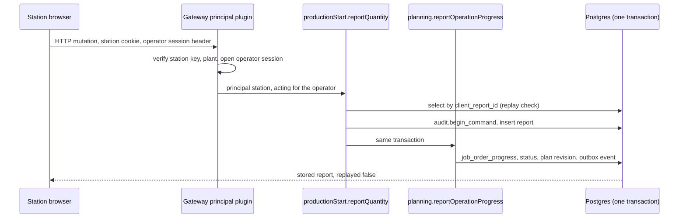
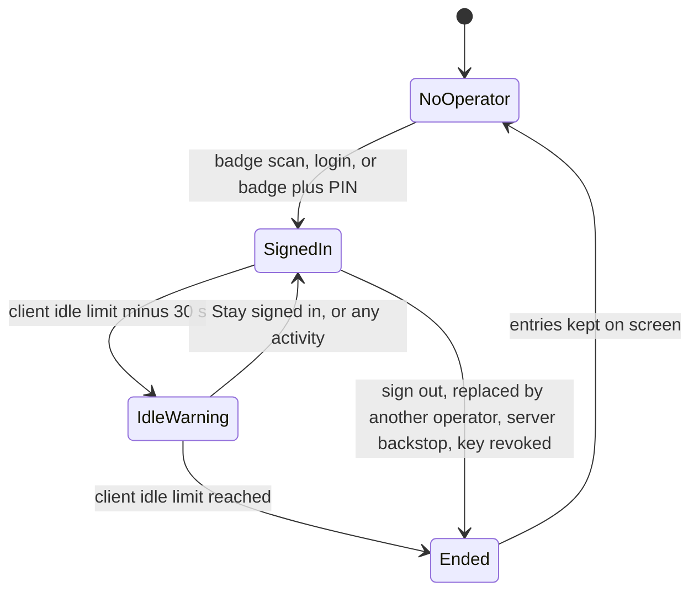
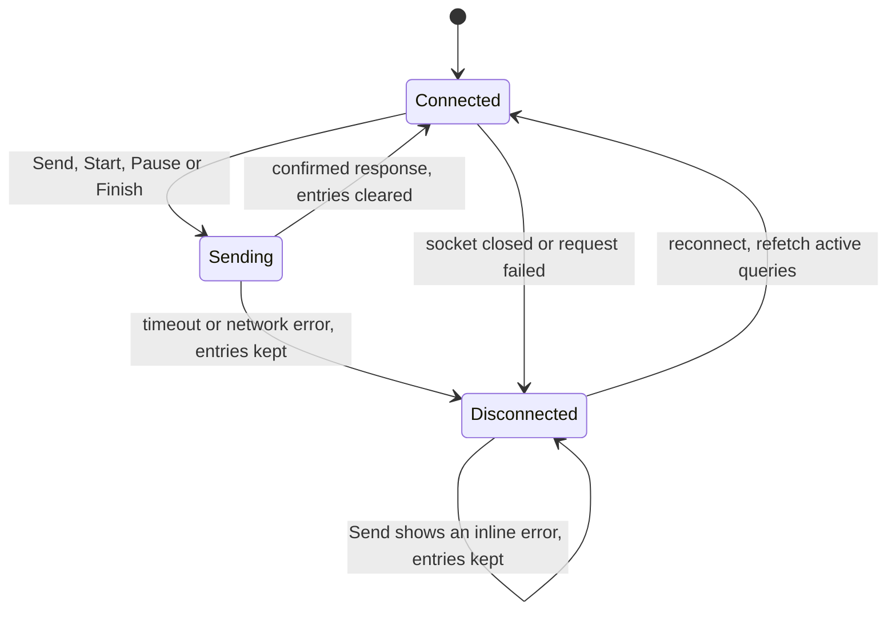

# Operator station

Release 1 ships a minimal online operator station in the production-start module. A registered station PC opens the full-screen route `/station/$stationId`, operators sign in by badge or personal login, and they start, pause and finish job orders and report good and scrap quantities with a scrap reason. Reports are append-only facts: a correction is a new record that references the original, and a job order that carries reports is frozen against planner moves of its machine and start. Every submit is idempotent, so a retry after a timeout never creates a second report. Release 1 has no offline queue: when the connection drops, entries stay on the screen and are never sent until the operator presses Send again. The offline queue, OEE and machine prefill come in later releases. The decisions are in [ADR 0033](../adr/0033-online-operator-station-in-the-production-start-module.md).

## Scope

| In release 1 | Later |
|---|---|
| Station registration with a pairing code, a device credential per station | Offline queue with a service worker |
| Badge sign-in (default), personal login, an optional PIN | Several operators signed in at one station |
| Switch equipment; start, pause and finish a job order | OEE, shift attribution of reports |
| Good and scrap quantities with a scrap reason | Machine prefill of quantities |
| Corrections as new records; the last five reports on the job | "Scan anywhere" badge capture |
| Idempotent submits, idle sign-off with a warning | Splitting the unreported remainder of a started job |
| Connected and Disconnected states, HTTPS only | Electronic signatures on reports |

The station is part of release 1 by the maintainer's decision ([ADR 0055](../adr/0055-release-1-scope-under-option-b-and-the-scope-rule.md)). Two things can move it: if the product owner answers by 2026-10-30 that operators keep reporting in Pyramid, the station moves to a 0.x release and statuses and quantities arrive through the connector's `reportSourceProgress` ([08-pyramid-connector.md](08-pyramid-connector.md)). It is also item 5 on the cut list (5 to 7 days); a cut removes it together with the `station` api-key configuration, the station principal and `core.badge_assignment`.

## 1. Where the station lives

| Name | Value |
|---|---|
| Module id | `production-start` |
| GraphQL, permission and command prefix | `productionStart` |
| SQL schema, owner role | `production_start`, `nm_mod_production_start` |
| Packages | `@northmes/module-production-start`, `@northmes/production-start-web`, `@northmes/production-start-contracts` (MIT) |
| `dependsOn` | `core`, `planning` |

- The shell has a second mount point, `/station/$stationId`, with a full-screen layout and no sidebar. The production-start remote returns its station routes from `stationRoutes(stationRoute)` ([ADR 0019](../adr/0019-web-shell-with-react-module-federation-remotes.md)).
- For a station principal, `/api/web/modules` returns the station mount and its modules. Station remotes load with a 30 s timeout. Every station chunk preloads right after sign-in.
- The station device identity, operator sessions and badges live in core. Reports live in `production_start`. Production-start reports progress by calling `planning.reportOperationProgress` in the same transaction, so planning has no dependency on production-start ([ADR 0002](../adr/0002-modular-monolith-with-module-owned-schemas-and-process-roles.md)).
- Production-start also contributes a panel to planning's order panel slot, so planners see reported quantities on an order.

## 2. Station registration and device identity

A station is a device identity plus, at most, one signed-in operator ([ADR 0011](../adr/0011-principals-credentials-and-same-origin-rules.md)).

Registration:

1. An admin creates the station record in core: plant, name, the equipment bound to it and its settings.
2. The station's browser opens the registration page, which shows a short pairing code.
3. The admin approves the code from their own signed-in PC and picks the station. No admin password or admin session cookie lands in the station's shared browser profile.
4. The server creates a Better Auth api-key credential with `configId` `station` whose permissions are the station's ceiling, records it in `core.credential` against the station and the plant's scope, and sets the cookie `__Host-nm_station` (HttpOnly, Secure, SameSite=Strict, Path=/).
5. The key has no expiry. The server re-sends the cookie with a fresh Max-Age once a day, because Chrome caps cookie lifetime at 400 days.

Principal resolution. The gateway's principal plugin has a station branch:

- It verifies the key and loads `core.credential`. A verified key hash is cached in process for 30 to 60 s and dropped on `core.credential.revoked`; a WebSocket connection verifies once.
- It takes the plant from the credential's scope and rejects a differing `x-northmes-plant` with 403.
- On HTTP it adds the operator from `x-northmes-operator-session` after checking that the session is open and belongs to this station. The operator bearer is a random token stored hashed, not the session's primary key, which appears in audit rows and logs.
- The station key alone grants only `core.station:signIn` and reading its own station record. Without an operator, a query such as `planningJobOrders` returns FORBIDDEN.
- With an operator, the effective permissions are the station ceiling intersected with the operator's permissions at the station's plant. An operator whose only role is at another plant cannot sign in at this station.
- A command precondition rejects a station principal whose target equipment is not bound to the station (FORBIDDEN, error code `productionStart.station_equipment`).
- When a station cookie is present, session cookies are ignored, except on sign-out and on the admin deregistration route.
- Station subscriptions authorize against the station ceiling only and carry no operator, because a browser WebSocket cannot send the operator header. Stations cannot send mutations over the WebSocket.
- The same-origin check covers `/api/station` and `/graphql` ([ADR 0011](../adr/0011-principals-credentials-and-same-origin-rules.md)).

Limits, presence and revocation:

- The Better Auth rate limiter is off for the `station` key configuration. Instead, 5 unknown badges within 60 s lock badge sign-in on that station for 5 minutes and write a security event; the sixth attempt returns 429.
- A security event is written when a station key is used from a new source IP. `allowedCidrs` per station is optional.
- Station presence is written at most every 30 to 60 s without an audit row. System health lists stations not seen for 7 days ([ADR 0043](../adr/0043-health-endpoints-graceful-shutdown-and-the-system-health-page.md)).
- Deregistering a station revokes its key; `core.credential.revoked` closes that credential's sockets with close code 4403.

Every station command is audited with principal type `station`, `acting_for` the operator's user id, surface `station` and the plant as scope ([ADR 0013](../adr/0013-audit-trail-written-in-the-command-transaction.md)).

## 3. Operator sign-in

### 3.1 Operators and badges

- Every operator is a full NorthMES user with a username from the first migration; badge and PIN are sign-in methods ([ADR 0010](../adr/0010-identity-with-better-auth-roles-and-permissions-in-core-tables.md)). Better Auth needs a unique email on every user, so an operator without one gets a placeholder address; the working proposal is an address under the reserved `.invalid` domain.
- A username is never reassigned. A password an administrator sets is temporary and must be changed at the next sign-in.
- Badges are dated records: `core.badge_assignment(user_id, badge_hmac, valid_from, valid_to)`. `badge_hmac` is computed with the `badge-v1` purpose key, its key version is stored, and the column is declared redact.
- Keyboard-wedge readers differ in output (decimal or hex, byte order, leading zeros). The pilot standardizes on one reader model and configuration, and the server normalizes the scanned value before computing the HMAC.

### 3.2 Sign-in commands

- Sign-in, sign-out and replacement are the commands `core.stationOperatorSignIn` and `core.stationOperatorSignOut` under `/api/station`, with principal station, surface station and `acting_for` the user. The Better Auth plugin endpoint is not used for them.
- Methods: badge (the default), username and password, and badge plus PIN when the station's PIN option is on. Personal login runs through the same command, so no Better Auth session cookie is left on the shared device.
- One open session per station: a partial unique index on `core.station_operator_session (station_id) where ended_at is null`. The sign-in command ends the open session in the same transaction with end reason `replaced` and retries once on 23505.
- The job order's state does not change when the operator changes. After a new sign-in, the header shows who started the job and when, for example "5001.20 started 12:02 by Anna Berg, last report 13:58".
- Security events: `auth.station_sign_in`, `auth.station_sign_in_failed` (with a keyed hash of the scan, never the plaintext), `auth.station_sign_out` with reason `explicit`, `idle_client`, `idle_server`, `replaced` or `revoked`, and lockouts.

### 3.3 WCAG 3.3.8 accessible authentication

The station targets WCAG 2.2 AA like the rest of the web app ([ADR 0021](../adr/0021-accessibility-target-wcag-2-2-aa.md)). Criterion 3.3.8 forbids a cognitive function test, such as remembering a password or transcribing characters, in any sign-in step unless the step offers an alternative or a mechanism.

- A badge scan is something the operator has, not a cognitive function test, so badge-only sign-in passes. It is the default.
- A PIN is remembering a set of characters. It passes only through the mechanism exception: one `<input type="password" inputmode="numeric" autocomplete="current-password">` that accepts paste and autofill, never one box per digit. The on-screen keypad only adds digits to that field. The settings page states next to the PIN option that a shared station rarely has a password manager, so the PIN is a real barrier for some operators.
- Personal login uses `autocomplete="username"` and `autocomplete="current-password"`, allows paste and has a show-password toggle.
- No CAPTCHA anywhere. Rate limiting is the brute-force control.
- The sign-in screen focuses its badge field on load through a ref (not the `autofocus` attribute). The reader types into that field and ends with Enter.
- Badge input is captured only in the focused badge field and on the Switch operator screen. There is no global key listener, because a listener that reacts to character keys falls under 2.1.4 and breaks speech input. Every station screen has a visible Switch operator button.
- A failed scan gives a text message next to the field and in the polite live region: "Badge not recognized. Scan again or sign in with your user name".
- After sign-in, focus moves to the station heading, for example "Press 4, Anna Berg".

## 4. Reporting

### 4.1 The job list

- The station lists the job orders on its equipment, sorted by planned start, with priority shown (working default until the product owner answers). It also lists job orders with an open run on its equipment, whatever their planned machine.
- The job list and the scrap reasons are fetched at sign-in and read cache-first, so the report form opens even during an outage. A station subscription keeps the list live.
- Switching equipment is a list of buttons; after a switch, focus moves to the new heading.

### 4.2 Commands

Fact commands go over HTTP to `/graphql` with the station cookie and the operator session header. The mutation fields carry the module prefix; `productionStartReportQuantity` is the decided example, and the other field names follow the same rule.

| Command | Effect | Idempotency |
|---|---|---|
| `productionStart.start` | Moves the job order from planned (or paused) to active on the reporting equipment, through `planning.reportOperationProgress` | By target state |
| `productionStart.pause` | Active to paused | By target state |
| `productionStart.finish` | To finished | By target state: finish on a finished job returns its current state |
| `productionStart.reportQuantity` | Good and scrap quantities with a scrap reason | `client_report_id` |
| `productionStart.correctReport` | A correction row (section 6) | `clientCommandId` |

`productionStart.reportQuantity` input: `clientReportId`, `jobOrderId`, `equipmentId`, `goodQuantity`, `scrapQuantity`, `scrapReasonId` (required when scrap is above zero), optional `note`, `deviceTime`, optional `confirmedLargeQuantity`, optional `confirmedRepeat`, optional `prefill`. Quantities are `numeric(18,6)` in the article's stock unit ([ADR 0023](../adr/0023-si-units-with-a-northmes-unit-catalog.md)).

Rules:

- Large quantities. When good plus scrap exceeds the remaining quantity times a plant setting (default 1.5), the server requires `confirmedLargeQuantity: true` and otherwise returns `QUANTITY_CONFIRMATION_REQUIRED`. The UI asks in a dialog.
- Repeats. A new report with the same job and quantities within 10 minutes under a different `client_report_id` returns `REPEAT_CONFIRMATION_REQUIRED` unless `confirmedRepeat` is set. The UI asks "Report again?".
- Prefill. The contracts package reserves an optional input `{ source, quantity, ref? }`. Release 1 rejects source `machine` with `UNSUPPORTED_PREFILL_SOURCE`. The rule that a changed machine-prefilled quantity needs a note applies only to machine prefill, so release 1 never requires that note. A note, when given, is the command's reason.
- Scrap reasons are a register built with the master-data kit ([ADR 0022](../adr/0022-shared-building-blocks-packages-the-master-data-kit-settings-and-generators.md)). Whether core or production-start owns it is open.
- Mutations never use `optimisticResponse`. "Reported 120 good" appears only after the server's response.
- The station shows the last five reports on the selected job with operator and time.

### 4.3 Times

- A report stores `device_time`, `received_at` and a nullable `effective_at`. `received_at` comes from the database clock in the transaction; client time is stored as data and never used as the record time ([15-regulated-readiness.md](15-regulated-readiness.md)).
- Shift attribution of reports waits for OEE.
- The client sends its time in a header, and the server warns when the skew exceeds 5 s. Every station syncs its clock to the plant's NTP source.

### 4.4 Screen rules

- Interactive targets follow the CSS variable `--nm-target-min`: 24 px by default, 44 px in the station layout, final value after a glove test on pilot hardware. Every `@northmes/ui` primitive reads it, so shell chrome and plugin panels follow.
- The quantity field is a `NumberField` with a visible unit and `inputmode="numeric"`. While the app keypad is visible, the field uses `inputmode="none"`, and a System keyboard toggle brings the device keyboard back.
- Enter in a station number field never submits; only the Send button does. A badge scanned into the wrong field therefore cannot send a report.
- Errors show as text next to the field with `aria-invalid`, and an error summary at the top receives focus on submit and links to each field. Messages state the rule and the fix.
- Scrap reasons are a `fieldset` with the legend "Scrap reason" and large radio buttons; with more than about eight reasons, a searchable list. Within one report, the last scrap reason stays selected.
- After a report, focus stays on Send and the polite region says, for example, "Reported 120 good, 3 scrap on 5001.20".

## 5. Reports are facts, and rows with reports are frozen

A report records what happened on the floor. Planning rules never refuse it, and nothing edits it afterwards.

- `productionStart.start` and the quantity report call `planning.reportOperationProgress` in the same transaction. It moves the status from planned to active and increments the reported quantities in `planning.job_order_progress` without bumping `job_order.version`, so a quantity report never turns a planner's draft stale. A status change bumps the plant's plan revision ([ADR 0029](../adr/0029-per-planner-drafts-soft-locks-and-the-plan-revision.md)).
- The equipment check is "the reporting equipment belongs to the station". A report stores `job_order_id`, `production_order_operation_id` and `equipment_id`.
- The server accepts reports on locked, moved, cancelled and finished job orders. When the reporting equipment differs from the planned one, or the job is finished or cancelled, `reportOperationProgress` sets a conflict flag in a separate planning table, and the board shows the Conflict state. No `permission.denied` event is written for a domain conflict.
- Report tables are append-only: UPDATE and DELETE on them are revoked from `nm_app`.
- On the planning side, `planning.commitScheduleChanges` and the autoplan apply add `and status = 'planned'` to any change of machine or start. Postgres re-checks the predicate after the lock wait, so a save that races a start fails for the started row without an advisory lock.
- Autoplan keeps machine and actual start of active and paused rows and recomputes only their end ([ADR 0028](../adr/0028-autoplan-as-a-pure-deterministic-function.md)).
- Job orders are record class: autoplan never deletes or recreates them, and DELETE and TRUNCATE on them are revoked from `nm_app` ([ADR 0013](../adr/0013-audit-trail-written-in-the-command-transaction.md)).
- A planner's move of the unreported remainder of a started job is refused until the product owner decides about splitting it.
- The fact commands (start, pause, finish, reportQuantity, correctReport) are not validatable in release 1. Later extension points on them are advisory: a validator may add a flag or ask for a confirmation, never veto and never block on a timeout ([ADR 0037](../adr/0037-plugins-drop-in-packages-command-validators-and-ui-slots.md)).
- The glossary keeps "frozen window" for the planning time fence and "frozen by reports" for rows that carry reports ([GLOSSARY.md](../../GLOSSARY.md)).
- When operators report in NorthMES, status and net quantities reach Pyramid through write-back ([08-pyramid-connector.md](08-pyramid-connector.md)).

## 6. Corrections as new records

A wrong report is never edited. A correction is a new row that references the original and carries a reason ([ADR 0051](../adr/0051-regulated-readiness-no-regret-rules.md)).

- `productionStart.correctReport({ originalReportId, deltaGood, deltaScrap, scrapReasonId?, reason, clientCommandId })`, with `reason` required.
- It inserts a report row of kind `correction` with `corrects_report_id` set to the original.
- Only original reports can be corrected; correcting a correction is rejected. The net per original stays at or above zero, otherwise `CORRECTION_EXCEEDS_ORIGINAL`.
- It calls `reportOperationProgress` with negative deltas. A started job stays started and a finished job stays finished. Write-back sends the new net.
- Proposed permission: the operator role gets `productionStart.report:correct` for reports from the same station in the current production day; other corrections need the supervisor role. The product owner confirms who may correct.
- Example: a report of 120 good and 3 scrap, corrected by minus 120 and minus 3 with a reason, leaves two rows and a net of zero; the audit change rows for the report table hold only inserts.

## 7. Idempotent submits

- The client creates the report's uuidv7 `client_report_id` when the form opens. It keeps the id across retries and edits and replaces it only after a confirmed response. The localStorage copy of the entries keeps the id across a reload.
- Before `audit.begin_command`, the server selects by `client_report_id`. If a report exists, it returns the stored report with `replayed: true`. On a unique violation race (23505) it rolls back and returns the stored row, which leaves exactly one command row and one report row.
- Start, pause and finish are idempotent by target state.
- Station mutations use `AbortSignal.timeout(15000)`. While a request is in flight, Send is `aria-disabled` and a status says "Sending". The client idle timer does not fire while a station command is in flight, and a success that arrives after sign-out shows on the sign-in screen.
- A generic `command_receipt` table waits until REST or outside callers need it ([ADR 0012](../adr/0012-commands-as-the-single-write-path.md)).

## 8. Idle sign-off and warnings

Idle sign-off is a time limit under WCAG 2.2.1, so the station warns and offers an extension.

- The client idle limit is a station setting with a minimum of 120 s; the settings schema rejects 30 and 119 and accepts 120.
- The warning opens 30 s before sign-off in a modal dialog ("You will be signed out in 30 seconds. Stay signed in"). Stay signed in resets the client timer locally and pings the server only when connected. The dialog says that entries are kept. Any activity resets the timer.
- The server limit is a backstop: the client limit plus 15 minutes, or the end of the shift. A network drop therefore never counts as inactivity on the server before the warning has run.
- A per-minute singleton job ends stale sessions under a system context.
- When a command returns `OPERATOR_SESSION_ENDED`, the client keeps the entries and asks for a badge scan. It sends them under the new session only when the scan is the same user. The next operator never sends a previous operator's report.

## 9. What happens during a network drop

Release 1 has no offline queue. It makes this promise instead:

- Unsent entries stay on the screen and in localStorage (inside try/catch, cleared after a confirmed response).
- Entries are never sent without the operator pressing Send.
- Loss of entries on a device failure is accepted.

- States: Connected, and Disconnected with the banner "No connection to NorthMES. Entries stay on this screen and are not sent until the connection is back." The banner has `role=status` and is announced once on change, not repeated.
- Send, Start, Pause and Finish while disconnected show an inline error next to the button and keep the entries.
- The graphql-ws client reconnects without a limit: wait capped at 10 s with jitter, keep-alive every 10 s, and a pong timeout that closes with 4499 after 5 s. Close codes 4400, 4401 and 4403 are not retried. After a reconnect, the client refetches every active query and compares the module versions. The top bar shows "Live updates paused, reconnecting" meanwhile ([ADR 0018](../adr/0018-realtime-subscriptions-over-graphql-ws-fed-by-the-event-tail.md)).
- When the app is down or restarting, Caddy serves a maintenance page for 502, 503 and 504 (status 503, `Retry-After: 15`) with a `role=status` message and a retry every 10 s that returns to the original URL. An unattended station comes back within 30 s after the app is up ([ADR 0044](../adr/0044-on-prem-deployment-with-docker-compose-and-mandatory-tls.md)).
- After an upgrade, the station shell reloads by itself only when it is idle, no form holds unsent input and the module versions changed. Until then the server refuses mutations from the old build with `core.client_outdated`, and the entries stay.
- Upgrades run between shifts, with a paper reporting form as the fallback ([ADR 0045](../adr/0045-backups-restore-drills-upgrades-and-rollback.md)). The product owner confirms the window.

## 10. HTTPS requirement

Every browser reaches NorthMES over HTTPS, stations included ([ADR 0044](../adr/0044-on-prem-deployment-with-docker-compose-and-mandatory-tls.md)).

- The customer's own CA is preferred. Caddy's internal CA is the fallback, with its root deployed to station PCs by Group Policy or Intune.
- Plain HTTP is never served: a catch-all `http://` block redirects any host to the canonical HTTPS host with 308. `.local` names are not used. HSTS waits until the pilot's certificates are confirmed.
- The station needs HTTPS because the `__Host-nm_station` cookie must be Secure, and browsers keep Secure cookies only over HTTPS; badge numbers and passwords cross the plant network; and the later offline queue needs a service worker, which runs only in a secure context.
- The browser error reporter sends an insecure context to the server as a client error with stage `insecure-context` ([ADR 0043](../adr/0043-health-endpoints-graceful-shutdown-and-the-system-health-page.md)).

## 11. Browser setup on station PCs

The customer's IT sets up each station PC. The install guide holds this list.

- A persistent browser profile. Never Edge kiosk mode or Assigned Access with Edge: both run an InPrivate session, which drops the station cookie.
- A local Windows station account with auto-logon that starts the browser full screen in a normal, persistent profile, for example Chrome `--kiosk` with a fixed `--user-data-dir`. The pilot tests on its own hardware that the profile survives a restart.
- Browser floor: Chrome and Edge 111, Firefox 128, Safari 16.4 ([ADR 0019](../adr/0019-web-shell-with-react-module-federation-remotes.md)). Chrome and Edge 109 are the last versions on Windows 7 and 8.1, so such PCs cannot run a station. Pilot IT reports the OS and browser versions of stations and planner PCs before go-live. An older browser gets a plain page that names the browser and the minimum version.
- The plant's CA root (or Caddy's root) in the Windows trust store.
- Sleep off, and the Windows Update restart window outside shifts.
- Time synchronized to the plant's NTP source.
- One badge reader model in keyboard-wedge mode, with one configuration, tested with the plant's real badges.
- A glove test on the station's screen before the final `--nm-target-min` value is fixed.
- Optional `allowedCidrs` per station from the station network ranges pilot IT provides.

## 12. Data model

Proposed tables; the register-decided parts are the badge table, the session index, the report columns and the revoked grants.

| Table | Content |
|---|---|
| `core.station` | id, `scope_id` (plant), code, name, settings (idle limit, PIN option, `allowedCidrs`) |
| `core.station_equipment` | station id, equipment id |
| `core.credential` | The station's api-key credential, bound to the station and the plant scope |
| `core.station_operator_session` | id, station id, user id, method, token hash, started at, last seen at, ended at, end reason (`explicit`, `idle_client`, `idle_server`, `replaced`, `revoked`); partial unique index on `station_id where ended_at is null` |
| `core.badge_assignment` | `user_id`, `badge_hmac` (redact), key version, `valid_from`, `valid_to` |
| `production_start.report` | id, `client_report_id` (unique), kind (`start`, `pause`, `finish`, `quantity`, `correction`), `corrects_report_id`, `job_order_id`, `production_order_operation_id`, `equipment_id`, station id, operator user id, good and scrap quantity (`numeric(18,6)`), scrap reason id, note, `device_time`, `received_at`, `effective_at`; UPDATE and DELETE revoked from `nm_app` |
| `planning.job_order_progress` | Reported quantities and actual times per job order; no version bump on `job_order` |
| Planning conflict table | Conflict flags from reports, kept apart from the report rows |

Station presence uses skipped columns or an allowlisted presence table, so it writes no audit rows.

## 13. Tests

Tests come first ([ADR 0041](../adr/0041-test-strategy-tdd-vitest-projects-testcontainers-and-playwright.md)). Integration tests run against Testcontainers Postgres as `nm_app` with triggers on. File names marked proposed may change in the task.

| Test | Proves |
|---|---|
| `station-offline.spec.ts` | Sign in, `setOffline(true)`, open the report form: scrap reasons render and no script request fails; Send shows the inline error, the values stay, and the polite region holds the offline message once; `setOffline(false)` and Send saves one report; axe passes in the disconnected state |
| `station-server-down.spec.ts` | Against the Compose stack: stop the app, the station URL shows the maintenance page; start the app, and the station screen returns within 30 s without input |
| `station-double-submit.spec.ts` | The server commits while the browser sees a failure; Send twice, reload, Send again: exactly one `production_start.report` row |
| `started-row-freeze.int.test.ts` | Two connections and a barrier: when the start commits first, the planner's save fails for that row and the row stays on its machine; when the move commits first, the report succeeds on the reporting equipment with the conflict flag set and no `permission.denied` event; a report on a locked job succeeds; autoplan over a started row changes only its end; an `nm_app` UPDATE on the report table fails with permission denied |
| `reconnect-after-outage.spec.ts` | WebSocket refused while the clock moves 4 minutes and the server moves a job to another machine; after reconnect the station list no longer shows it within 15 s of fake time and the banner is gone |
| `report-idempotency.int.test.ts` (proposed) | The same `client_report_id` sent twice in sequence and twice concurrently gives one report row and one `audit.command` row, the second response marked `replayed`; finish twice returns the current state |
| `station-session.int.test.ts` (proposed) | Two concurrent sign-ins on one station leave one open session and the other ended with reason `replaced`, two `auth.station_sign_in` events and one `auth.station_sign_out` with reason `replaced`, and the job order still started |
| `station-principal.int.test.ts` (proposed) | Another station's operator session returns 403; a differing `x-northmes-plant` returns 403; a mutation over the station WebSocket is rejected; revoking the key closes the socket with 4403; without an operator, `planningJobOrders` is FORBIDDEN; six unknown badges within a minute return 429 on the sixth and write one lockout event; a report on equipment not bound to the station is FORBIDDEN with `productionStart.station_equipment`; an operator with roles in two plants gets the station plant's data, and an operator with no role at that plant cannot sign in |
| `station-session-ended.spec.ts` (proposed) | Entries kept after `OPERATOR_SESSION_ENDED` are sent only after the same user's scan, never under another operator |
| `station-badge.spec.ts` (proposed) | With Good quantity focused, typing `0004512345` and Enter with a 5 ms delay sends zero mutations; with nothing focused, a burst does not change the operator |
| `report-rules.int.test.ts` (proposed) | Good 4512345 without `confirmedLargeQuantity` returns `QUANTITY_CONFIRMATION_REQUIRED`; a near-duplicate without `confirmedRepeat` returns `REPEAT_CONFIRMATION_REQUIRED`; prefill source `machine` returns `UNSUPPORTED_PREFILL_SOURCE`; a report row carries `device_time` and `received_at` |
| `report-correction.int.test.ts` (proposed) | A correction of minus 120 and minus 3 with a reason gives two rows and net 0 with the original unchanged; minus 121 returns `CORRECTION_EXCEEDS_ORIGINAL`; correcting a correction is rejected; an operator from another station gets FORBIDDEN |
| `station-settings.test.ts` (proposed) | The idle limit schema rejects 30 and 119 and accepts 120 |
| `station-idle.spec.ts` (proposed) | With `page.clock`, the warning appears 30 s before sign-off, Stay signed in resets it, and entries survive the sign-off |
| `station-targets.spec.ts` (proposed) | At 1280 x 800 with touch, every visible interactive element, shell chrome and plugin panels included, measures at least 44 by 44 px |

The station flows also run in the keyboard-only Playwright suite and the axe route suite.

## 14. What later releases add

- Offline queue. An IndexedDB outbox on the station and a service worker owned by the shell, scoped to `/`, that precaches the shell and caches station remotes at run time, with a warm-up after sign-in so the station screen opens offline. Replayed reports keep the device time as data and take their record time from the database clock. Status messages on change only, such as "Offline. 3 reports waiting." and "Back online. 3 reports sent.". HTTPS is already in place for the service worker.
- OEE. Shift attribution of reports through `effective_at`. Machine prefill from Data collection with source `machine` accepted and the prefill quantity stored, which brings the changed-prefill note rule and possibly preset note reasons.
- Several operators per station: the unique index moves to `(station_id, user_id)` and reports pick the operator explicitly. Whether a job pauses when the operator changes is decided then.
- "Scan anywhere" as a per-station setting with an operator-visible toggle, and burst rejection in number fields once the reader model is tested.
- Splitting the unreported remainder of a started job.
- Advisory validators on fact commands.
- Electronic signatures on reports, for a regulated customer ([15-regulated-readiness.md](15-regulated-readiness.md)).
- A generic command receipt table for REST and outside callers.

## 15. Open questions

The full list is in [16-open-questions.md](16-open-questions.md); risks are in [17-risks.md](17-risks.md).

- Product owner: do operators report in NorthMES or keep reporting in Pyramid (by 2026-10-30); who may correct a report; several operators per station and whether a job pauses when the operator changes; "scan anywhere"; the changed-prefill rule and preset note reasons; splitting the remainder of a started job; the upgrade window with paper reporting; the operator list sort.
- Pilot IT: station hardware, OS and browser versions, screen size and gloves, the badge reader model, station network ranges, NTP for stations, the TLS option.
- User: the online-only promise in place of an outage queue; the placeholder email scheme for operators.
- Design: whether core or production-start owns the scrap reason register.
