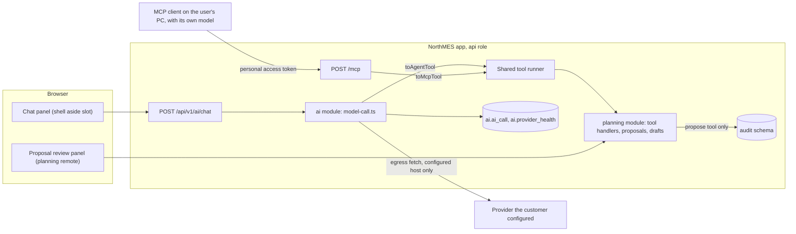
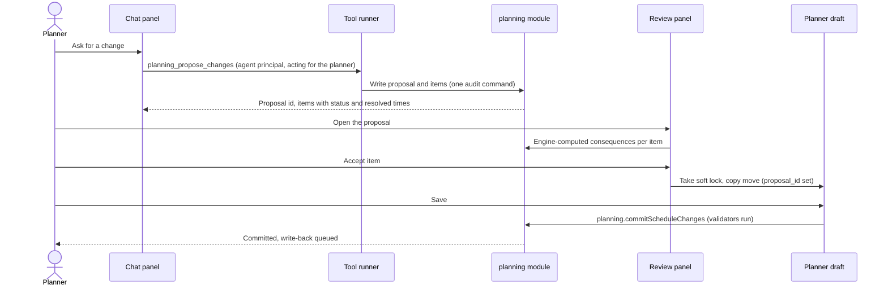
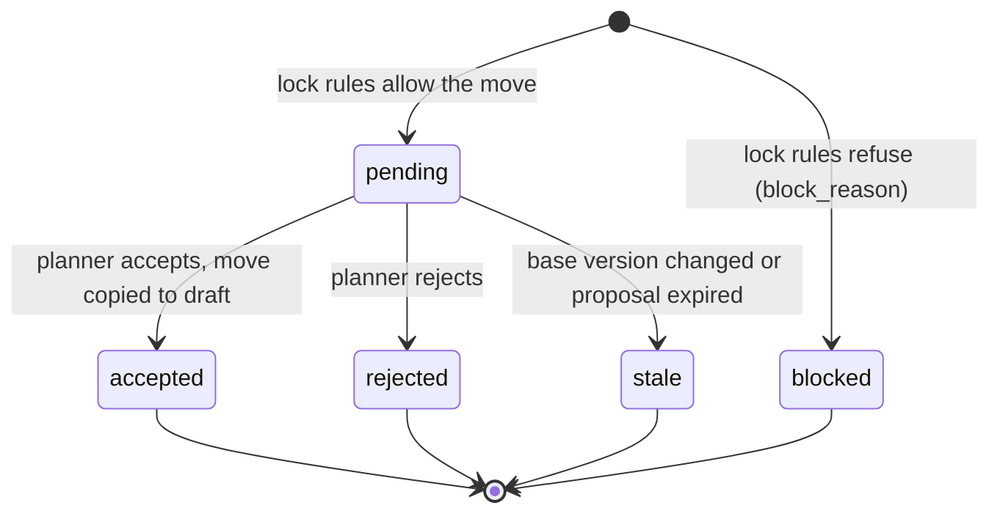

# AI and agents

NorthMES calls language models only through a provider that the customer configures with its own credentials, so neither the NorthMES project nor Flexmatic (the company behind it) sees the data or pays for usage. Release 1 ships a types-only AI port in the MIT SDK, a core `ai` module built on the Vercel AI SDK 7, provider settings per company with usage metering and budgets, a read-only planning assistant in the web shell, agent proposals that a planner reviews and commits through their own draft, and one `/mcp` endpoint with a read-mostly planning toolset of eight tools. AI never commits a change and never scores, ranks or assigns people. Every model call goes through one file with fixed safety options, every data-leak guard has a test, and tests use a mocked provider unless a developer starts a budget-capped live run.

## Decisions

| Topic | ADR | Status |
|---|---|---|
| AI provider port, providers, the model-call file, metering, the assistant, prompt-injection defences, disclosure and the people rule | [ADR 0035](../adr/0035-ai-provider-port-with-customer-configured-providers.md) | accepted |
| Agent proposals as planning records a person commits | [ADR 0036](../adr/0036-agent-proposals-as-planning-records-a-person-commits.md) | accepted |
| The `/mcp` endpoint and the planning toolset | [ADR 0034](../adr/0034-mcp-surface-one-endpoint-a-read-mostly-planning-toolset.md) | accepted |
| AI in tests | [ADR 0042](../adr/0042-ai-in-tests-mocked-by-default-opt-in-live-runs.md) | accepted |
| The agent principal and which tool calls are audited | [ADR 0013](../adr/0013-audit-trail-written-in-the-command-transaction.md) | accepted |
| Credentials bound to surfaces (MCP tokens) and same-origin rules | [ADR 0011](../adr/0011-principals-credentials-and-same-origin-rules.md) | proposed |
| Outbound URLs and encrypted AI secrets | [ADR 0047](../adr/0047-secrets-and-the-installation-key.md) | proposed |
| Drafts and soft locks that proposals feed | [ADR 0029](../adr/0029-per-planner-drafts-soft-locks-and-the-plan-revision.md) | accepted |
| Chat panel accessibility | [ADR 0021](../adr/0021-accessibility-target-wcag-2-2-aa.md) | accepted |
| MIT license of `@northmes/sdk` | [ADR 0056](../adr/0056-mit-sdk-packages-the-extension-exception-and-the-trademark-policy.md) | proposed |
| Presentation values in the time context line, ISO 8601 and canonical tool outputs | [ADR 0061](../adr/0061-presentation-settings-for-dates-clocks-and-numbers-with-one-pinned-locale.md) | accepted |

## Ground rules

1. The customer holds the account with the model provider, accepts that provider's terms and data processing agreement, and pays the provider directly. NorthMES ships no API key, runs no proxy and no hosted endpoint, and has no fallback provider.
2. With no provider configured, every AI feature is off, the chat panel is hidden, and no model call can happen.
3. The data path runs from the NorthMES server inside the customer's network to the endpoint the customer configured (OpenRouter, the customer's Azure resource, a local model server). Flexmatic is not in that path. Usage rows and AI configuration live in the customer's own Postgres.
4. AI never commits a change. Agent writes are proposals that a person reviews and commits in the NorthMES UI, and only that person's Save triggers ERP write-back.
5. AI features never score, rank or assign people. This is a written product rule (see [AI Act transparency and the people rule](#ai-act-transparency-and-the-people-rule)).
6. MCP clients run their own models under the user's own account. The provider layer covers only the model calls NorthMES itself makes. The user docs say this plainly.
7. Tool reads are not audited. A proposal is a command and is audited.

## Architecture



Tools are defined once in the MIT SDK as plain data. One shared runner parses the input, checks permission at the named plant, runs the handler in a transaction with the row-level security scope ([ADR 0008](../adr/0008-row-level-security-with-transaction-local-scopes.md)), validates the output and returns structured content plus text. Two thin adapters sit on the runner: `toAgentTool` for the in-app assistant and `toMcpTool` for `/mcp`. The in-app assistant never calls `/mcp` over HTTP, so there is no token forwarding and no second public edge. A fix in the runner lands for both doors at once.

## Packages and modules

| Package or module | License | Holds |
|---|---|---|
| `@northmes/sdk`, subpath `/ai` | MIT | The types-only AI port: model aliases, capabilities, run context, requests, results, usage, availability. No AI SDK type crosses it. |
| `@northmes/sdk`, subpath `/mcp` | MIT | `defineTool`: Zod input and output schemas, handler, annotations, permission. Independent of the MCP SDK. |
| `modules/ai` | AGPL-3.0-or-later | The port implementation on the Vercel AI SDK 7 (`ai`) with `@ai-sdk/azure`, `@ai-sdk/openai-compatible` and `@openrouter/ai-sdk-provider`; `modules/ai/server/model-call.ts`; provider configs, alias bindings, budgets, feature enablement; `POST /api/v1/ai/chat`; usage tables. |
| Core host | AGPL-3.0-or-later | The `/mcp` controller, the shared tool runner and both adapters, the `AiRunRegistry`. |
| `modules/planning` | AGPL-3.0-or-later | The planning tool handlers, `planning.proposal` and `planning.proposal_item`, the review panel. See [07-production-planning.md](07-production-planning.md). |
| `@northmes/testing` | MIT | The AI mock helpers used by unit and integration tests. |

Library choice ([ADR 0035](../adr/0035-ai-provider-port-with-customer-configured-providers.md)): the Vercel AI SDK 7 covers every provider the customer may pick with first-party packages, ships `MockLanguageModelV4` and `simulateReadableStream` for test-first work, and has a clean license tree. Its majors arrive about every six months, each with a matching `@openrouter/ai-sdk-provider` major; keeping AI SDK types inside `modules/ai` contains that churn. Mastra is rejected because its published package contains source-available `ee/` code that may not be redistributed and it sends opt-out telemetry. LlamaIndex.TS is rejected because its repository is archived. TanStack AI is the recorded fallback. The license gate also scans installed packages for `ee/` folders and "Enterprise" license files ([ADR 0040](../adr/0040-dependency-license-policy-ci-gate-and-sbom.md)).

The port starts from this shape; the committed API report ([ADR 0038](../adr/0038-versions-and-releases-lockstep-0-x-release-please-api-reports.md)) fixes the final one.

```ts
// @northmes/sdk/ai (MIT). Starting shape.
export type ModelAlias = "fast" | "reasoning" | "embedding" | (string & {});
export type AiCapability = "tools" | "structuredOutput" | "streaming" | "vision";

export interface AiRunContext {
  feature: string;          // declared in the module manifest, e.g. "planning.assistant"
  companyId: string;
  plantId: string;          // the route plant for the chat; required for plant data
  actor: PrincipalRef;      // the user the run acts for
  correlationId: string;
  signal?: AbortSignal;
}

export interface GenerateRequest<T = string> {
  alias: ModelAlias;
  needs?: AiCapability[];
  instructions?: string;    // module-owned system text, identical between runs
  messages: { role: "user" | "assistant"; content: string }[];
  toolsets?: string[];      // SDK toolset names, the same definitions MCP serves
  output?: StandardSchemaV1<T>;
  maxSteps?: number;        // capped by company policy
  maxOutputTokens?: number; // capped by company policy
}

export type AiAvailability =
  | { available: true; capabilities: AiCapability[] }
  | { available: false; reason: "no-provider" | "feature-disabled" | "budget-exhausted" | "not-permitted" };

export interface AiPort {
  availability(alias: ModelAlias, ctx: AiRunContext): Promise<AiAvailability>;
  generate<T = string>(req: GenerateRequest<T>, ctx: AiRunContext): Promise<GenerateResult<T>>;
  streamChat(req: GenerateRequest, ctx: AiRunContext): AiChatStream; // opaque; only the core chat route consumes it
  embed(values: string[], ctx: AiRunContext): Promise<{ vectors: number[][]; model: string; usage: AiUsage }>;
}
```

## Providers and credentials

### Release 1 provider kinds

| Kind | Credentials | What NorthMES sends or sets | Notes |
|---|---|---|---|
| `openrouter` (default) | The customer's own API key | `provider: { data_collection: "deny", zdr: true }` on every request; the customer can loosen it | Base URL `https://openrouter.ai/api/v1`, or `https://eu.openrouter.ai/api/v1` for customers on an OpenRouter plan that includes EU in-region routing (Business or Enterprise). Costs come back in the provider metadata. |
| `azure-openai` | API key; Microsoft Entra client secret; Entra client certificate; managed identity only when NorthMES itself runs in Azure | `azure.chat(deployment)`, which calls `/chat/completions` and avoids Responses API storage; `store: false` under the key the model reads | Entra credentials get an explicit `authorityHost` from an allowlist (`login.microsoftonline.com` and the sovereign clouds) and an explicit regional setting. The token scope is a config field. A certificate is preferred to a secret. |
| `openai-compatible` | None, or a bearer key | The admin declares what the server supports: `tools`, `toolChoice`, `structuredOutput`, `embeddings` | Local Ollama, vLLM and similar. NorthMES cannot detect capabilities reliably, so the tool-call probe must pass before a tool feature can use the alias. Ollama servers should run with `OLLAMA_NO_CLOUD=1`. |

The `azure-openai` kind calls the customer's own deployment by its deployment name, so every model the customer deploys in its Azure OpenAI resource works with an API key or Entra ID. Whether models the customer deploys in Azure outside Azure OpenAI are reached through `azure-openai`, through `openai-compatible`, or need their own kind is not verified.

### Later provider kinds

The port and the config schema already hold these kinds. Each adds about 1 to 2 days (config schema, auth, Test connection, docs, one live check) and ships in a 0.x release when a customer asks. Whether Google Vertex and the Gemini API must ship in release 1 is open (ADR 0035).

| Kind | Credentials | Privacy settings the checklist names |
|---|---|---|
| `vertex` | Service account key JSON, or a Workload Identity Federation credential configuration | The `eu` multi-region or an EU regional location, never `global` |
| `gemini-api` | API key | A paid project |
| `bedrock` | Bedrock API key, or access keys | `data_retention_mode: none` per region, EU geographic inference profiles |
| `anthropic`, `openai`, `mistral` | API key, optional base URL | `store: false` for OpenAI; zero data retention by agreement where the provider offers it |

NorthMES never uses a default credential chain (`DefaultAzureCredential`, the AWS node provider chain, Google Application Default Credentials). Those read host-level identity, which belongs to no company.

### Configuration, aliases and features

- Providers are configured per company on the Integrations page as integration cards: a Zod config schema rendered as a form, write-only secrets, a Test connection action, health (last success, last error, calls today, cost this month) and a fixed privacy checklist per kind.
- The provider config table carries `scope_id` from its first migration, so a plant override can come later. Release 1 shows company level only. No host-level provider exists, because nobody would own its bill.
- Modules ask for an alias (`fast`, `reasoning`, `embedding`), never a model. Each company binds an alias to a provider config and a model (the deployment name for Azure). A model retirement is an admin change, not a code change.
- Features are declared in the module manifest under `ai.features` ([ADR 0003](../adr/0003-module-package-shape-and-the-definemodule-manifest.md)), are off by default, and are enabled by a company admin. A feature cannot be enabled until its alias's Test connection probe has passed.
- Permission ids follow the `<module>.<entity>:<action>` format of [ADR 0010](../adr/0010-identity-with-better-auth-roles-and-permissions-in-core-tables.md): `ai.assistant:use`, `ai.provider:manage`, `ai.usage:read`.
- Instructions are module-owned text in code. Customer-editable prompts wait until they have an owner and a permission.
- Plugins call the same port. Plugin-defined provider kinds are not supported in release 1; any other provider must be OpenAI-compatible or added to core.
- Embeddings and pgvector wait until a feature measures that Postgres full-text search is not enough. When vectors arrive, each vector stores its embedding model id and dimension, and a change of the `embedding` alias triggers re-embedding.

```ts
// modules/planning manifest, ai part
defineModule({
  id: "planning",
  ai: {
    features: {
      "planning.assistant": {
        title: "Planning assistant",
        aliases: ["fast"],
        toolsets: ["planning"],
        needsPersonalData: false,
        defaultEnabled: false,
      },
    },
  },
});
```

Writes to provider configs, alias bindings, prices, budgets, feature enablement and the privacy acknowledgement are commands in the `ai` module ([ADR 0012](../adr/0012-commands-as-the-single-write-path.md)) and are audited, with secret columns declared secret.

### Secrets and outbound URLs

- Secrets are encrypted with `node:crypto` AES-256-GCM under the installation key with a versioned keyring ([ADR 0047](../adr/0047-secrets-and-the-installation-key.md)). The associated data covers table, row, column and the normalized endpoint host.
- A config update that changes a base URL without a new secret fails with `core.secret_reentry_required`, so Test connection can never send a stored key to a new host.
- Admin-set outbound URLs follow one rule: private and link-local targets need an entry in the installation setting `outbound.allowedHosts`, set with `northmes installation set` on the host (a LAN Ollama is a normal case), `169.254.0.0/16` and the database host are always blocked, and Test connection reports only reachable, not reachable or auth failed.
- The provider cache is keyed by (provider config id, config revision) and is invalidated with the permission cache, so an edited base URL, a rotated secret or a removed config takes effect without a restart.
- Keys never reach the browser. All model calls run on the server.

### Test connection and the privacy checklist

Test connection runs per alias binding. It sends one minimal chat call with the exact provider options the feature sends (for OpenRouter: `data_collection`, `zdr` and `require_parameters: true`) plus a fixed tool-call probe. It sends no plant data. The capabilities that worked, and any failure code, go on `ai.provider_health`. A binding whose probe fails with no matching OpenRouter endpoint is marked unusable with reason `routing`.

The privacy checklist shows the plan, the region and the data path for the kind (for Azure, for example, a Data Zone EU or Standard deployment in an EU region). The admin's acknowledgement is stored in the audited config.

## Model calls and data-leak guards

`modules/ai/server/model-call.ts` is the only caller of `streamText`, `generateText` and `embed`. A lint rule forbids importing those three, or `registerTelemetry`, from `ai` anywhere else. Every call goes out with these fixed options:

- `telemetry: { isEnabled: false }`. Without it, a subscriber on the `ai:telemetry` diagnostics channel received prompts even with no integration registered and with input and output recording off.
- An `onError` handler, and caught `generateText` errors. The log line holds only provider kind, status code, error code, `isRetryable` and correlation id. A pino serializer for AI SDK error classes drops `requestBodyValues`, `responseBody`, `data` and cause text, and no AI SDK error object reaches the Nest logger or exception filter.
- `providerOptionsFor(kind)`, which writes `store: false` under the key the model actually reads.
- An egress `fetch` that compares scheme, host and port with the configured base URL, sets `redirect: 'error'` and rejects `http:` when the config says `https:`. `experimental_download` throws.
- Timeouts per alias: first chunk 30 s, between chunks 30 s, per step 120 s, `maxRetries` 1. A timeout becomes a typed stop reason in the stream and `provider_timeout` on `ai.provider_health`.
- The default-provider guard: no string model ids, no Vercel AI Gateway default, no environment credential or base-URL fallbacks. It is set at module load of `model-call.ts` and in the Vitest `setupFiles`, so unit tests that skip Nest have it too.
- A manifest-driven personal-field redactor runs on every tool output inside the shared runner, so names, emails and badge data declared personal in a manifest never reach a model unless a feature declares that it needs them.
- The shared runner maps errors before either adapter sees them: known domain errors become `{ code, safeMessage, retryable }`, anything else `{ code: 'internal', correlationId }`.

Each guard has a test. These are integration or unit tests in `modules/ai` and the core host; names are behaviour names for the issues.

| Guard | Test |
|---|---|
| No provider, no call | Boot with no provider configured: zero outbound requests, `availability` returns `no-provider`, the panel is hidden. |
| No gateway default | With `AI_GATEWAY_API_KEY` set (and, separately, only `VERCEL_OIDC_TOKEN`), a string model id throws without a request. |
| Strict config | A company config missing its key fails validation while `AZURE_API_KEY` is set in the environment. |
| Egress to the configured host only | A provider with base URL A cannot reach host B. Server A answers 307, then 308, pointing to B: B receives zero requests and the error code is `provider_redirect`. |
| `store: false` | A request-body test per provider kind, including the mixed case of Azure and OpenAI provider options. |
| Telemetry off | Subscribe to `tracingChannel('ai:telemetry')` and register a capturing integration, then run a two-step mocked run through `model-call.ts`: zero channel messages and callbacks, and the markers `PROMPT-SECRET` and `CUSTOMDATA-SECRET` appear in no payload. A control call to raw `streamText` does capture messages, so the test fails if a later SDK moves the leak. |
| No prompt text in logs | Stub providers that refuse connections and that return 400, with markers in the prompt and in a tool result: no marker in stdout, stderr or the pino destination. |
| Tool errors stay generic | A tool that throws a Postgres unique violation on a key that is not a code key: the next mocked prompt holds `internal` and the correlation id, not the DETAIL text, and so does the MCP `tools/call` result. |
| Timeouts | A stub server that accepts the connection and never answers ends with `provider_timeout`. |
| Entra authority | With `AZURE_AUTHORITY_HOST=https://evil.test` set, the Entra factory sends its token request to `login.microsoftonline.com`. |
| No file downloads | `POST /api/v1/ai/chat` with a file part returns 400. A `model-call.ts` unit test with a file part and a spy download function is rejected and the spy is never called. |
| Secret bound to host | Changing a base URL without a new secret fails with `core.secret_reentry_required`. |
| Cache follows config | After a config update commits, the next call uses the new base URL and secret; a removed config gives `no-provider`. |
| Personal fields redacted | The same tool through MCP and through `toAgentTool`, with an operator who reported scrap, returns neither the operator's id nor name. |
| Lint | A file outside `model-call.ts` that imports `streamText` from `ai` fails lint. |

## Usage metering, budgets and audit

One `ai.ai_call` row is written per model call (per step, not per run). It holds company, plant, user, principal, feature, run id, correlation id, provider config id and kind, requested and reported model, input, cached, output and reasoning tokens, provider-reported cost when present, estimated cost from the admin's price table otherwise, latency, finish reason, error code, the names of tools called and the provider's request or generation id. It never holds prompt or completion text.

- Rows are written on finish, on error and on abort, because a started call is billed. On abort the row holds an estimate (prompt size plus streamed output already relayed) with status `aborted-estimated`.
- OpenRouter costs are reconciled through `GET /api/v1/generation` in a pg-boss job ([ADR 0014](../adr/0014-outbox-event-log-and-pg-boss-jobs.md)), using the generation id captured in the egress fetch.
- Each company has one budget currency. Under a cost budget, binding a model requires a price in that currency, and provider cost in another currency converts with an admin-entered rate saved on the row.
- Budgets: a monthly cost or token limit with a warning threshold and a hard stop, a per-user daily cap, and per-alias `maxOutputTokens` and `maxSteps`. Checks run before each step. A budget stop ends the stream with `data-ai-stop budget-exhausted`. `ai.budget_state` (`ok`, `warning`, `exhausted`) per company and month feeds an admin banner in the shell. The provider's own key limit is the second fence, and the admin docs say so.
- Concurrent runs per user are capped at 1 or 2.
- `ai.ai_call` has monthly partitions with a 13-month default retention.
- Per-user totals show only to holders of `ai.usage:read` at company scope, and the usage page never sorts users by spend.

| Action | Audit record |
|---|---|
| Edit a provider config, alias binding, price, budget, feature enablement or privacy acknowledgement | A command row and field diffs; secret columns redacted |
| A model call | An `ai.ai_call` row (usage log, not audit) |
| A read tool call from the assistant | None; tool names, plant and row counts show in `ai.ai_call` |
| A read tool call over MCP | None; a structured log line with the correlation id ([ADR 0046](../adr/0046-observability-structured-logs-host-checks-and-optional-opentelemetry.md)) |
| `planning_propose_changes` | Exactly one command row with principal type `agent` (assistant) or the user (MCP) |
| A denied tool call | One `permission.denied` security event with surface `assistant` or `mcp` |

`ai.ai_call` and `ai.provider_health` are on the audit lint allowlist as usage logs with no business state, and they are written with an explicit company write scope, because step and abort callbacks run outside any command transaction. Read tools run in `SET TRANSACTION READ ONLY` with no audit context; a read handler that attempts an INSERT fails.

The agent principal ([ADR 0013](../adr/0013-audit-trail-written-in-the-command-transaction.md)): a migration adds principal type `agent` and surface `assistant` before the partitioned audit tables hold data. The in-app agent is a fixed system principal per feature (`planning.assistant`) with `acting_for` the user, `credential_id` the session credential and `client { feature, aiRunId, providerConfigId, model }`. MCP calls run as the user, with the personal access token as credential and surface `mcp`. Only the propose tool opens an audit context.

Whether tool results sent to a model count as exports is open. The working default is no, because `ai.ai_call` records them. If the answer is yes, one command per run (`ai.toolResultsSent` with plant and entity counts) is written, not one per call.

## The read-only planning assistant

### Chat route

- `POST /api/v1/ai/chat` in the `api` role: a Nest controller using `pipeUIMessageStreamToResponse` with `keepAliveMs`, so plant proxies do not cut idle streams. The browser uses `useChat` from `@ai-sdk/react`. Caddy flushes `text/event-stream` at once ([ADR 0044](../adr/0044-on-prem-deployment-with-docker-compose-and-mandatory-tls.md)).
- Auth is the session cookie plus the same-origin check of [ADR 0011](../adr/0011-principals-credentials-and-same-origin-rules.md); the chat uses a fetch-based client so it can send the CSRF header.
- The body is parsed with a strict Zod schema: roles `user` or `assistant` only, part types `text` and `step-start` only, at most 40 messages and 40 000 characters. Client-supplied tool parts and system messages are dropped.
- Chat history stays in the browser for the session. Server-side history with a retention setting is a later company setting.
- Long runs as pg-boss jobs arrive with the first feature that needs them. Model tokens never travel over GraphQL subscriptions.

### Plant, permissions and time

- The chat request carries the route plant ([ADR 0007](../adr/0007-tenancy-company-plants-and-the-scope-tree.md)). The server fills a missing plant argument with it and states the plant in the instructions.
- The runner checks `ai.assistant:use` together with each tool's permission at the plant the call names. A refusal returns a typed not-permitted result and writes one `permission.denied` event with surface `assistant`.
- The instructions are identical between runs, so provider prompt caching survives. One line of time context goes in the turn after the cached prefix, for example "Plant P1, now 2026-10-24T21:00+02:00, production day 2026-10-24, dates 24.10.2026, 24-hour clock, decimal comma". The line gives the plant's presentation values, so the model's prose writes dates and numbers as the screens do ([ADR 0061](../adr/0061-presentation-settings-for-dates-clocks-and-numbers-with-one-pinned-locale.md)).
- Tool outputs give local time with offset plus the zone id, and canonical values with the unit in the key; they stay ISO 8601 and canonical whatever the presentation values. Wall-clock inputs are resolved on the server with `resolveWallClock` ([ADR 0024](../adr/0024-time-utc-instants-plant-wall-clock-temporal-and-the-clamp-resolver.md)).
- Read tools take a `view` argument (`committed` or `draft`). The assistant defaults to the caller's draft; MCP defaults to the committed plan ([ADR 0029](../adr/0029-per-planner-drafts-soft-locks-and-the-plan-revision.md)).

### Tool results

- Results to the model are capped at 50 rows and 20 000 characters, with `truncated`, `total` and a cursor argument.
- `toAgentTool` sends only the structured JSON to the model.
- Before each model call, tool results older than the last two turns are pruned to a one-line summary.
- The late-order filter returns facts the engine already has (deadline rule in use, `asOf`, planned end, delay, whether the forward fallback ran, fixed or locked rows, conflicts, material warnings, wait time against run time per operation). The instructions forbid stating a cause the facts do not show. The late filter works with the AI module disabled ([ADR 0030](../adr/0030-a-planning-board-built-in-house.md)).

### Chat panel

The panel follows [ADR 0021](../adr/0021-accessibility-target-wcag-2-2-aa.md) and [ADR 0035](../adr/0035-ai-provider-port-with-customer-configured-providers.md). Details are in [06-web-and-ux.md](06-web-and-ux.md).

- It mounts through one shell aside slot, so it survives route changes. Below about 640 px it opens as a modal sheet; at most one panel docks beside main.
- Opening moves focus to the input; Escape or Close returns focus to the trigger. A Stop button shows while streaming.
- The streaming message renders outside any live region with `aria-busy`; the finished message is appended once to a `role=log` list.
- Model Markdown headings map to h3 to h6. Tool results render as tables with caption and `th`, with values formatted by the web formatters and the plant's presentation values. Links print as plain text with the full URL; only same-origin paths stay clickable. No raw HTML and no remote images.
- Each assistant message carries a visible "AI-generated" label in its accessible name. The chat header and the proposal review show a fixed text: "Written by an AI assistant. Check before you commit." No setting removes it.
- The request carries `answerLanguage`, and messages get `lang`.

### Shutdown

Chat runs register an `AbortController` in the `AiRunRegistry`. At shutdown they abort with reason `server-restarting` and get up to 5 s to settle their `ai.ai_call` rows. The propose tool checks the signal before its commit ([ADR 0043](../adr/0043-health-endpoints-graceful-shutdown-and-the-system-health-page.md)).

## Agent proposals

Agent writes are proposals stored as planning records ([ADR 0036](../adr/0036-agent-proposals-as-planning-records-a-person-commits.md)). A person accepts them into their own draft and commits them with Save. Release 1 proposals contain moves only.

### Records

| Table | Columns |
|---|---|
| `planning.proposal` | `id`, `plant_id`, `owner_user_id`, `origin` (`assistant` or `mcp`), `credential_id`, `correlation_id`, `ai_run_id`, `created_at`, `expires_at`, `status` |
| `planning.proposal_item` | `job_order_id`, `base_version`, `target_equipment_id`, `target_start_local`, `target_start_instant`, `status` (`pending`, `accepted`, `rejected`, `stale`, `blocked`), `block_reason`, `draft_row_hash` (a hash of the requester's `planning.draft_change` row for that job order when the item was written; null when the draft held no change for it), `accepted_by`, `committed_command_id` |

`planning.draft_change.proposal_id` links a draft change to the proposal it came from, and `audit.command.proposal_id` is set on the accept command. Per-row provenance lives on `planning.proposal_item`.

### Rules

- Release 1 scope: moves of existing job orders (equipment and start) only, at most 50 items per proposal, no splits and no quantity changes. The propose input is one move shape with an enum kind.
- A proposal holds only structured moves for one plant. Model text stays in the requester's chat, so it cannot carry data read at another plant to other planners.
- A proposal expires after 24 hours or when a base version changes.
- Proposing never takes or breaks a soft lock. Each item runs through the shared lock rules (`judgeMove` for PINNED, LOCKED and STARTED rows, the frozen window, rows held by another planner) and gets a status. Read tools return `heldByOther` true or false, never the holder's identity.
- The agent permission set strips `lock` and `breakLock`.
- The propose input takes a local date-time with an optional offset, resolved on the server with `resolveWallClock`. The output echoes local time, offset and instant per item, with `resolvedAmbiguous` and `resolvedGap` flags.
- Accept recomputes the hash. When the requester's draft row for that job order changed after the proposal, the item shows "changed in your draft since the proposal" and the planner confirms before the accepted move replaces the draft move.
- The planner accepts items one at a time. Accepting takes the soft lock in the planner's name and copies the move into the planner's draft. Save commits the draft through `planning.commitScheduleChanges`, so command validators (including the example plugin, [ADR 0037](../adr/0037-plugins-drop-in-packages-command-validators-and-ui-slots.md)) see AI moves exactly like manual ones, and only a person's Save triggers write-back ([08-pyramid-connector.md](08-pyramid-connector.md)).
- `planning.commitProposal` is not built.

### Review and commit



The review panel is a list in the planning remote with "show on board". It shows the conflicts a selection creates and the engine-computed consequences (which orders become late or later, and by how much) next to the rationale, which is labelled AI-written. The board shows proposed rows with their own cue: a spark icon in the text color and a dotted border, distinct from the draft's double border, and "proposed by assistant, not reviewed" in the accessible name.

### Item states



## MCP endpoint and toolset

### Endpoint

- One `/mcp` endpoint inside the Nest app in the `api` role ([ADR 0034](../adr/0034-mcp-surface-one-endpoint-a-read-mostly-planning-toolset.md)), built on `@modelcontextprotocol/server` v2 directly (not `@rekog/mcp-nest`) with `legacy: "stateless"`, so clients of the 2026-07-28 protocol revision and 2025-era clients both work from one endpoint.
- `/mcp` validates `Origin` and `Host` itself, because the SDK handler checks neither.
- `/mcp` is disabled per installation by default and enabled with the audited command `northmes installation set mcp.enabled true` on the host ([ADR 0066](../adr/0066-companies-created-by-the-cli-plant-slugs-unique-per-installation-admin-pages-at-admin-and-a-setup-wizard-before-a-plant-opens.md); behaviour switches never live in environment variables). `POST /mcp` returns 404 while it is off.
- `tools/list` is filtered by the union of the user's plant permissions, with `cacheScope: "private"`, a short `ttlMs` and `listChanged: false`. Every call re-checks permission at the plant it names.

### Release 1 toolset

| Tool | Effect | Purpose |
|---|---|---|
| `core_list_plants` | read | Plants the user can reach; a default only for users with one plant |
| `planning_find_orders` | read | Search production orders by number, article, customer, status or due window; the `late` filter returns the late-order facts |
| `planning_get_order` | read | One production order with operations, job orders, demand and material warnings |
| `planning_machine_schedule` | read | Job orders on equipment for a plant, production day and optional local from and to, resolved on the server |
| `planning_capacity_load` | read | Load against available time per equipment and day or shift |
| `planning_material_warnings` | read | Job orders with a material shortfall |
| `planning_estimate_duration` | read | Duration of a quantity on equipment, from the scheduling engine as a pure function |
| `planning_propose_changes` | proposal | Writes a proposal (see [Agent proposals](#agent-proposals)) |

Every plant-scoped tool has an explicit `plant` argument, required unless the user reaches exactly one plant. There is no `core_set_active_plant` and no hidden session state. The cap is eight tools, and a CI check holds it.

### Tool definition rules

- Each tool is a `defineTool` value in an MIT package with Zod input and output schemas, a handler, a permission and annotations. Every tool declares `readOnlyHint` and `destructiveHint` and an `outputSchema`.
- Results return `structuredContent` plus the same JSON as text, and `structuredContent` validates against the output schema.
- Agent-visible input schemas stay in a portable subset: objects, enums, arrays of primitives or of flat objects of primitives, optional fields. No unions, records or recursion, because some providers reject them. A schema lint fails on `z.union` in a tool input.
- ERP free text appears only in named data fields of results (see [Prompt-injection defences](#prompt-injection-defences)), never in tool descriptions or server instructions.

### Sign-in

- Release 1 signs MCP clients in with a personal access token: a Better Auth api-key with `configId` `mcp`, prefix `nms_mcp_`, expiry at most 90 days ([ADR 0011](../adr/0011-principals-credentials-and-same-origin-rules.md)). The token acts as the user with the user's roles; each call's rights are the token's scopes intersected with a live `can()`.
- `/mcp` accepts only that token or a bearer JWT whose `aud` is the public origin plus `/mcp`, and ignores cookies. The GraphQL guard rejects `mcp` tokens and any token with an `/mcp` audience, so an agent that can read its MCP token cannot call the commit mutation as the user.
- OAuth 2.1 login through Better Auth's MCP plugin, with Client ID Metadata Documents and a dynamic client registration fallback, comes later, after a LAN spike. When registration arrives it accepts only `http://localhost` and `http://127.0.0.1` redirect URIs.

### Not in release 1

MCP Apps views, WebMCP, an autoplan tool, admin and import tools, per-organization toolset toggles and `listChanged` notifications. `structuredContent` is designed so a view can be added later without changing tools.

## On-prem reachability

The pilot runs on one Linux host in the plant ([ADR 0044](../adr/0044-on-prem-deployment-with-docker-compose-and-mandatory-tls.md)). Firewall and proxy settings are in [12-operations-and-security.md](12-operations-and-security.md).

| Path | What must be reachable | Notes |
|---|---|---|
| NorthMES to a cloud provider | Outbound HTTPS from the host to the configured base URL; for Entra auth also the token endpoint (`login.microsoftonline.com` or a sovereign cloud) | Behind a proxy: `NODE_USE_ENV_PROXY=1` with `HTTPS_PROXY`, and `NO_PROXY` including the database host and any LAN model server. A TLS-inspecting proxy needs its CA in `NODE_EXTRA_CA_CERTS`. Proxy behaviour of the token calls is not verified. |
| NorthMES to a LAN model server | The server's address on the installation allowlist | The air-gapped option. Small local models call tools less reliably than hosted ones; the pilot has to measure quality on its hardware. |
| Claude Code (or another MCP client) on a LAN PC to `/mcp` | HTTPS to the plant host; the client trusts the plant CA (`NODE_EXTRA_CA_CERTS` for Claude Code) | Works with no public URL. The token goes in a header (`claude mcp add --header`). |
| Claude Desktop with a local config to `/mcp` | Same as above, through a stdio bridge such as `mcp-remote` | Not tested with NorthMES. |
| Hosted connectors (claude.ai, Claude Desktop custom connectors, mobile) | A public HTTPS endpoint reachable from Anthropic's cloud, because these connections start there | Not a release 1 default. Exposing the plant host is a customer IT decision. |

MCP traffic can stay on the plant network, but tool results become model context at the MCP client's own model provider. Plan data leaves the plant that way, under the user's own account. The user docs say so.

## AI Act transparency and the people rule

- Article 50(1) of the EU AI Act asks that people are informed that they are interacting with an AI system unless that is obvious. The fixed disclosure text and the "AI-generated" label on every assistant message meet this. Whether Article 50(1) exempts an assistant whose AI nature is obvious, and what Article 50(2) machine-readable marking of generated text needs, is not settled; ADR 0035 records both as needing confirmation.
- Annex III point 4(b) makes high-risk any system used to allocate tasks based on individual behaviour or personal traits, or to monitor and evaluate the performance and behaviour of persons at work. Explaining a production plan or a late order is not in that list. Assigning operators to shifts, ranking operators or evaluating operator performance would be. So the product rule is: AI features never score, rank or assign people. The usage page follows the same line and never ranks users by spend.
- The installation policy object can hide AI per module in a regulated profile later ([15-regulated-readiness.md](15-regulated-readiness.md), [ADR 0051](../adr/0051-regulated-readiness-no-regret-rules.md)).
- Article 4 also asks providers and deployers to take measures for the AI literacy of their staff.

## Prompt-injection defences

Release 1 has a write path (proposals), and ERP text such as CustomData, order notes and customer names reaches tool results. The defences ([ADR 0035](../adr/0035-ai-provider-port-with-customer-configured-providers.md)):

- ERP text in tool results is wrapped as `{ untrusted: true, text }`, capped at 500 characters per value and 50 values per call, and appears only in named data fields, never in tool descriptions or instructions.
- Proposals hold only structured moves for one plant, and a person must accept and save them.
- The review shows engine-computed consequences next to the AI-written rationale, so a planner judges the move, not the model's words.
- Calls that injected text causes for another plant fail with FORBIDDEN and one security event.
- The Markdown renderer prints links as plain text with the full URL and does no autolinking (same-origin paths stay clickable). The page CSP keeps `img-src` and `connect-src` to self, which closes the image-URL exfiltration route.
- A per-conversation read set is not built: the model can always call a find tool on any rows first.

## Testing

All AI tests follow [ADR 0041](../adr/0041-test-strategy-tdd-vitest-projects-testcontainers-and-playwright.md) and [ADR 0042](../adr/0042-ai-in-tests-mocked-by-default-opt-in-live-runs.md); the general harness is in [11-quality-and-testing.md](11-quality-and-testing.md).

### Mocked by default

- Unit and integration tests use `MockLanguageModelV4` and `simulateReadableStream` from the AI SDK, wrapped by helpers in `@northmes/testing`. They reproduce abort, telemetry and tool-error cases.
- End-to-end tests run against a stub OpenAI-compatible server configured as the test company's provider.
- Integration tests run on Postgres from `@testcontainers/postgresql`.

### Live runs

- Real-model tests run only through `pnpm test:ai`, `pnpm test:e2e:ai` or `NORTHMES_AI_LIVE=1`. They never run in the default test run and never on pull requests.
- The cap is provider-side: a dedicated OpenRouter key with a credit limit and a monthly `limit_reset`, held as a GitHub environment secret on a workflow with only `workflow_dispatch` and `schedule` triggers. A workflow lint asserts that the live workflow has no `pull_request` trigger.
- The live suite runs with one worker and a per-run call counter in `globalSetup` as a soft cap. A fixture injects the key into the test company's config.
- The live suite holds the injection fixture: a synthetic order whose CustomData contains an instruction. Asked "which orders are late", the real model makes no propose call and no item touches unrelated orders.

### Tests to write

Besides the guard tests in [Model calls and data-leak guards](#model-calls-and-data-leak-guards):

| Area | Test |
|---|---|
| Metering | A stream aborted after 150 ms leaves an `aborted-estimated` row with cost above zero. |
| Metering | USD 0.10 at an entered rate of 10.5 counts as 1.05 in the company currency. |
| Budgets | With a budget of 1.00 and steps costing 0.40, the third step never starts and the stream ends with `budget-exhausted`. |
| Audit | A mocked run that calls `planning_propose_changes` writes exactly one `audit.command` with principal type `agent`, surface `assistant` and `acting_for` the user. |
| Audit | A three-step read-only run writes three `ai.ai_call` rows and no audit rows. |
| Audit | An MCP `planning_find_orders` call with the `late` filter writes no command row. |
| Audit | A read handler that attempts an INSERT fails with "cannot execute INSERT in a read-only transaction". |
| Audit | Editing the OpenRouter key writes one change row with a redacted diff. |
| Chat route | `POST /api/v1/ai/chat` with 41 messages returns 400. |
| Tool results | A fixture with 500 late orders returns 50 rows with `total` 500 in under 20 000 characters of JSON. |
| Tool results | In a six-turn mocked conversation, the sixth prompt carries full tool results only for turns 5 and 6. |
| Plant | A scripted call with no plant from a chat started on plant B runs at plant B, and `ai.ai_call.plant_id` is plant B. |
| Permissions | A user with `ai.assistant:use` at plant A only and planning read at A and B gets not-permitted for a call at B, and the recorded provider request holds no plant B order numbers. |
| Time | `planning_machine_schedule` for a night shift across the autumn DST change queries the correct UTC window and returns local times with the new offset; the spring twin too. |
| Caching | The instructions string is identical for two runs at different clocks, and for two runs with different presentation values. |
| Late facts | The deadline rule, `asOf` and the fallback flag come back for a late fixture order; GraphQL and the tool return the same ids; the filter works with the `ai` module disabled. |
| Rendering | A model message with a Markdown link to an outside host renders no anchor. |
| Test connection | A stub OpenRouter that answers the probe with a no-matching-endpoint 404 marks the binding unusable with reason `routing`, and enabling the feature fails. A stub that returns a tool call records the `tools` capability. |
| Proposals | The propose input passes the schema lint; a `z.union` input fails. |
| Proposals | `proposal-accept.int.test.ts`: a planner moves job order R2 in the draft after the proposal; accepting the R2 item returns the changed-in-draft flag and leaves the draft row unchanged until the planner confirms. |
| Tool bridge | `tool-bridge.int.test.ts`: the agent's tool list equals the SDK planning toolset filtered by `can()` for the user at the named plant. |
| MCP off | `mcp.disabled.int.test.ts`: `POST /mcp` returns 404 while the setting is off. |
| MCP | A user without the propose permission gets no `planning_propose_changes` in `tools/list`; every tool declares both annotations and an `outputSchema`, and its `structuredContent` validates; a plant A user never gets plant B rows; the tool count stays at eight; calls work in both protocol eras. |

Each release also gets one manual smoke test with Claude Code against `/mcp`.

## Scope and cut order

The three AI features are in release 1 under option B ([ADR 0055](../adr/0055-release-1-scope-under-option-b-and-the-scope-rule.md)). Estimates: the read-only assistant with its chat panel and accessibility work about 21 days, agent proposals 8 to 12 days, the `/mcp` endpoint 8 to 13 days. If measured velocity forces cuts, the order in ADR 0055 applies: `/mcp` goes first of the three, then proposals, then the assistant; each needs the maintainer's decision at a checkpoint and moves the feature to a 0.x release during the pilot, not out of the product. The SDK tool definitions, the shared runner, the provider port, provider settings and usage metering stay in every case, so a later release only adds the feature. Providers beyond the release 1 set and MCP OAuth sign-in are already outside release 1.

## Open questions

Answers go into the ADRs and [16-open-questions.md](16-open-questions.md).

- Must Google Vertex and the Gemini API ship in release 1? (maintainer; ADR 0035)
- Do tool results sent to a model count as exports? (maintainer; ADR 0013)
- `/mcp` off by default per installation, and personal access tokens before OAuth? (maintainer; ADR 0034)
- Article 50(1) and 50(2) of the AI Act (needs confirmation; ADR 0035).
- Which provider and plan will the pilot customer use: OpenRouter with global processing, OpenRouter EU in-region routing, or Azure in an EU data zone?
- How do models the customer deploys in Azure outside Azure OpenAI reach NorthMES? Release 1 supports Azure OpenAI deployments with key or Entra ID; other Azure-hosted models wait for a measured test. (maintainer; ADR 0035)
- Which Entra token scope does the pilot's Azure resource accept, `https://ai.azure.com/.default`, `https://cognitiveservices.azure.com/.default` or both? A spike decides.
- Do the Entra, Google and AWS token libraries honour the proxy settings behind a plant proxy? Not tested.
- Which local model gives acceptable tool calling on hardware a plant would buy? It needs a measured test with the planning toolset.
- Which owner the chat panel code has: the shell or the core remote, both mounting through the shell aside slot.
