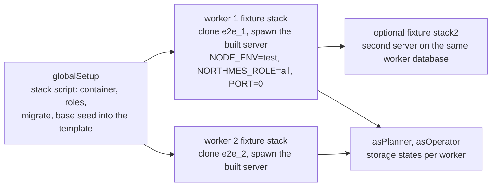
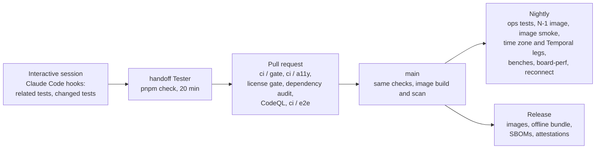

# Quality and testing

NorthMES is built test first. Every change starts with a failing test, integration and end-to-end tests run against a real Postgres that `@testcontainers/postgresql` starts for each run, and AI is mocked unless a person starts a live run on purpose. This document gives the rules every task follows, the test tiers and where each runs, the Vitest projects and the file suffixes that select them, the Testcontainers harness, the time zone matrix, multi-instance and contract tests, Playwright end-to-end tests with a database and a server per worker, accessibility testing, the AI test modes, the performance budgets, requirement ids, the CI gates, and what Claude Code hooks can and cannot do inside handoff runs. The main decisions are [ADR 0041](../adr/0041-test-strategy-tdd-vitest-projects-testcontainers-and-playwright.md) (test strategy), [ADR 0042](../adr/0042-ai-in-tests-mocked-by-default-opt-in-live-runs.md) (AI in tests) and [ADR 0058](../adr/0058-developer-environment-source-exports-one-stack-script-and-one-gate-command.md) (developer environment and the one gate command). Terms follow [GLOSSARY.md](../../GLOSSARY.md).

## Decisions in this document

| Topic | ADR | Status | Still to confirm |
|---|---|---|---|
| TDD, Vitest projects, Testcontainers, Playwright, contract suites, nightly tests | [0041](../adr/0041-test-strategy-tdd-vitest-projects-testcontainers-and-playwright.md) | accepted | none |
| AI mocked by default, opt-in live runs | [0042](../adr/0042-ai-in-tests-mocked-by-default-opt-in-live-runs.md) | accepted | none |
| Source exports, one stack script, one gate command | [0058](../adr/0058-developer-environment-source-exports-one-stack-script-and-one-gate-command.md) | proposed | none |
| Configuration, `configForTest` and the end-to-end environment | [0060](../adr/0060-configuration-with-nestjs-config-one-zod-environment-schema-and-secret-files.md) | accepted | none |
| Node and TypeScript pins, runtime test | [0004](../adr/0004-monorepo-tooling-pnpm-turborepo-node-and-typescript-versions.md) | proposed | maintainer (TypeScript 6.0.x) |
| Pinned database image for tests | [0005](../adr/0005-postgres-18-official-image-with-pgbackrest-timescaledb-deferred.md) | accepted | maintainer (the pgBackRest source fallback until PGDG publishes 2.59.3) |
| Time-series contract suite and benchmark gate (later) | [0059](../adr/0059-time-series-storage-port-with-an-open-default-backend.md) | proposed | maintainer (no TimescaleDB backend from the project); product owner (raw pulse retention) |
| Time, Temporal and the time zone matrix | [0024](../adr/0024-time-utc-instants-plant-wall-clock-temporal-and-the-clamp-resolver.md) | proposed | none |
| Presentation formatters, the locale leg and the format lint | [0061](../adr/0061-presentation-settings-for-dates-clocks-and-numbers-with-one-pinned-locale.md) | accepted | none |
| The `types` project, the link pattern check and the path literal check | [0062](../adr/0062-web-form-contracts-url-view-state-and-module-link-manifests.md) | accepted | none |
| Accessibility target and gates | [0021](../adr/0021-accessibility-target-wcag-2-2-aa.md) | accepted | product owner (is pause live updates wanted) |
| Autoplan performance budget | [0028](../adr/0028-autoplan-as-a-pure-deterministic-function.md) | proposed | product owner (frozen window, overdue rows, apply path, child orders) |
| Board spike and its performance exit | [0030](../adr/0030-a-planning-board-built-in-house.md) | proposed | product owner (weekly volumes); pilot IT (planner PC); lawyer (FullCalendar fallback only) |
| Scheduling domain as a pure package | [0057](../adr/0057-scheduling-domain-as-a-pure-package-in-the-planning-module.md) | proposed | maintainer |
| Plugin checks and example plugins in CI | [0037](../adr/0037-plugins-drop-in-packages-command-validators-and-ui-slots.md) | accepted | maintainer (no third-party plugin on the pilot; web-only plugins degrade); product owner (unpaid-invoice validator) |
| Version checks, API reports, N-1 widget | [0038](../adr/0038-versions-and-releases-lockstep-0-x-release-please-api-reports.md) | accepted | maintainer (no range override in 0.x) |
| Schema snapshot and composition corpus | [0015](../adr/0015-graphql-federation-inside-one-process-with-an-embedded-hive-gateway.md) | accepted | none |
| Route families, the boot route check and the later OpenAPI diff gate | [0064](../adr/0064-rest-routes-under-api-v1-and-openapi-from-zod-contracts.md) | accepted | none |
| Ops tests: restore drill, upgrade and rollback | [0045](../adr/0045-backups-restore-drills-upgrades-and-rollback.md) | proposed | maintainer and pilot IT (disk layout, offsite target, RPO and RTO); product owner (upgrade window) |
| Required checks and CI runners | [0050](../adr/0050-github-organization-rulesets-ci-runners-and-supply-chain.md) | accepted | none |
| Requirement ids in tests, validation impact | [0051](../adr/0051-regulated-readiness-no-regret-rules.md) | accepted | lawyer (signature path, CRA role); product owner (regulated profile switch) |
| handoff runs, the Tester and the plan gate | [0049](../adr/0049-delivery-workflow-handoff-thin-vertical-slices-and-claude-design-per-task.md) | accepted | maintainer (persona list, epic order) |

Related plan documents: [04-data-and-platform.md](04-data-and-platform.md) (data-layer tests), [06-web-and-ux.md](06-web-and-ux.md) (accessibility gates in detail), [07-production-planning.md](07-production-planning.md) (planning test list), [08-pyramid-connector.md](08-pyramid-connector.md) (connector fixtures and the fake PWS server), [09-operator-station.md](09-operator-station.md) (station tests), [10-ai-and-agents.md](10-ai-and-agents.md) (AI test list), [12-operations-and-security.md](12-operations-and-security.md) (what the ops tests protect), [13-delivery-and-github.md](13-delivery-and-github.md) (workflows, rulesets, issue shape), [15-regulated-readiness.md](15-regulated-readiness.md) (test evidence for regulated customers).

## Rules every task follows

1. A change starts with a failing test. A plan takes one behaviour at a time: one step writes its failing test (file, test name, why it fails before the change), the next step makes it pass with the smallest change. A refactor step with the tests green follows, and the coder keeps it ([ADR 0041](../adr/0041-test-strategy-tdd-vitest-projects-testcontainers-and-playwright.md)).
2. The commit that adds a failing test has a subject starting with `test:`.
3. The seam a task names under "Seam" counts as agreed. SQL-level tests of row-level security policies, constraints and the catalog are their own seam and test the database through `packages/testing`.
4. Every acceptance criterion names the test that proves it. A task without a test for a criterion fails the plan review.
5. Integration and end-to-end tests run against Postgres started by `@testcontainers/postgresql` on the pinned production image. There is no shared database, no mock of Postgres, no `docker compose` for tests and no `.env` file for tests. A missing Docker fails the run; no test skips itself because Docker is absent.
6. Tests call the mocked AI provider. Real-model tests live in `*.ai.test.ts` and run only through `pnpm test:ai` or `pnpm test:e2e:ai` ([ADR 0042](../adr/0042-ai-in-tests-mocked-by-default-opt-in-live-runs.md)).
7. A test isolates itself by creating its own company and plant (`given.company()`, `given.plant()`). Tests never truncate tables and never assert global counts.
8. Fixtures write through `db.command({ principal, scopes, reason }, fn)` with surface `cli`, so the audit trigger sees an audit context. A raw insert outside it fails with SQLSTATE P0001 and a message that names `db.command` ([ADR 0013](../adr/0013-audit-trail-written-in-the-command-transaction.md)).
9. Test data is synthetic. No file the product owner or a customer shares, no recorded request and no real name enters any repository (see [Test data](#test-data-and-fixtures)).
10. `.only` and `.skip` fail Biome (`lint/suspicious/noFocusedTests`, `lint/suspicious/noSkippedTests`). Snapshots are updated with `vitest -u` only when the task asks for it.
11. Pure domain code imports no Nest, Kysely, `pg` or `process.env`. The scheduling domain is the package `@northmes/planning-domain` in `modules/planning/domain` ([ADR 0057](../adr/0057-scheduling-domain-as-a-pure-package-in-the-planning-module.md)), and a lint test enforces the import ban there.
12. Test names, file names and fixtures use glossary terms. `batch_row` does not appear in event, error or test names.
13. Every command runs as a root pnpm script or with `pnpm --filter` from the repository root, never after a `cd` ([ADR 0058](../adr/0058-developer-environment-source-exports-one-stack-script-and-one-gate-command.md)).

## Test tiers

| Tier | Files | Runs against | Runs in | Examples |
|---|---|---|---|---|
| Pure unit | `*.test.ts` in domain, contracts and other packages | Nothing outside the process; `now` and the plant zone are arguments | `pnpm check`, hooks, handoff Tester, `ci / gate` | duration function, `plan()`, `resolveWallClock`, millisecond windows; property tests with `fast-check`; plan output as a text table compared with `toMatchFileSnapshot` |
| Web component | `*.test.tsx` | happy-dom with the React plugin | `pnpm check` | screen states, form wiring, board key handling on a fixture grid |
| Type | `*.test-d.ts` | The TypeScript compiler through Vitest typecheck mode; nothing runs | `pnpm check`, `ci / gate` | `@ts-expect-error` on a link builder call with a missing param; `z.output` of a command contract's input assignable to the generated mutation input type |
| Component accessibility | Vitest browser mode | Chromium through `@vitest/browser-playwright` | see [Vitest projects](#vitest-projects-keyed-by-file-suffix) | axe on `Field`, `IconButton`, `HoverCard`, the board fixture grid |
| Integration | `*.int.test.ts` | Testcontainers Postgres, the Nest app in the test process (`createTestApp`), pg-boss, `LISTEN` | `pnpm check`, `ci / gate` | commands through the pipeline, GraphQL through `gqlClient`, jobs, subscriptions |
| Database seam | `*.int.test.ts` in `packages/testing` and module migration tests | Testcontainers Postgres, raw SQL as `nm_app` or `nm_owner` | `pnpm check` | RLS matrix, exclusion constraints, catalog lint, migration runner |
| Multi-instance | `*.int.test.ts` with `createReplicas(2)` | Two Nest instances in one process, one cloned database | `pnpm check` | a job runs once, two planners on one row, realtime across instances |
| Contract suites | Called from module test files | Database-free part in unit; database-backed part in integration | `pnpm check` | autoplan strategy invariants, ERP connector, master-data kit, command pipeline |
| End to end | Playwright specs under `e2e/` | The built `all` process, a database and a server per worker | `pnpm check:full`, `ci / gate` (skeleton spec), `ci / e2e`, `ci / a11y` | planner and operator flows, keyboard-only flows, axe per route and state |
| Ops | `*.ops.test.ts` | The real Compose file through Testcontainers' `DockerComposeEnvironment` | nightly | install, restore drill, WAL archive outage, upgrade and rollback |
| Image smoke | nightly job | The built image in `GenericContainer` against a `PostgreSqlContainer` on a shared network | nightly, `main` | migrate, role `all`, readiness, three smoke specs |
| Live AI | `*.ai.test.ts`, live e2e | The customer-style provider configuration with a capped key | `pnpm test:ai`, `pnpm test:e2e:ai`, never on pull requests | the injection fixture, tool calls on a real model |
| Performance | `*.bench.ts`, `e2e/board-perf.spec.ts` | CI runner (regression), planner-class PC (verdict) | nightly | `plan.bench.ts`, board frame times |
| Manual | scripts in the docs | Real hardware and a person | before the pilot install, per release | NVDA passes, Try it in handoff, an MCP smoke test with Claude Code per release |

## Vitest projects keyed by file suffix

One root `vitest.config.ts` defines the projects. Vitest runs outside Turborepo; Turborepo caches `build`, `typecheck` and `lint`, never tests, because the integration project must own exactly one container per run. The projects are keyed on file suffix, not on folders, so a test anywhere in the module layout lands in exactly one project ([ADR 0041](../adr/0041-test-strategy-tdd-vitest-projects-testcontainers-and-playwright.md)).

| Project | Selects | Environment and setup | Runs in |
|---|---|---|---|
| `unit` | `**/*.test.ts`, except `**/*.int.test.ts`, `**/*.ai.test.ts` and `**/*.ops.test.ts` | Node; no container | `pnpm check` |
| `integration` | `**/*.int.test.ts` | Node; the project's `globalSetup` starts one Testcontainers Postgres per run | `pnpm check` |
| `web` | `**/*.test.tsx`, except the browser project's files | happy-dom with the React plugin | `pnpm check` |
| browser accessibility project | A suffix the task that adds the project picks, outside every other glob | Vitest browser mode, `@vitest/browser-playwright` with Chromium, `vitest-browser-react` | Not decided (see [Open questions](#open-questions)) |
| `ai` | `**/*.ai.test.ts` | The integration global setup, one worker, a per-run call counter | `pnpm test:ai` only |
| `ops` | `**/*.ops.test.ts` | Docker and the Compose file | nightly |
| `types` | `**/*.test-d.ts` | Vitest typecheck mode, no runtime | `pnpm check` |

Every project excludes `node_modules`, `dist` and `docs/sources`. The browser project exists because happy-dom cannot run axe's contrast rule.

Two more projects run the scheduling domain, time and format suites (the format suite is `packages/contracts/src/format/`) again with a different setup file: one with native Temporal (Node 26) and one that replaces the global `Temporal` with `temporal-polyfill`, because Safari users run the polyfill ([ADR 0024](../adr/0024-time-utc-instants-plant-wall-clock-temporal-and-the-clamp-resolver.md)). If the week-1 test pins Node 24 instead, Temporal is behind a flag there and the native leg needs that flag ([ADR 0004](../adr/0004-monorepo-tooling-pnpm-turborepo-node-and-typescript-versions.md)).

Rules:

- `test/meta/collection.test.ts` compares `vitest list --json --filesOnly` with the test files `git ls-files` lists and fails on a file in no suffix project or in two. It counts the suffix projects in the table above; the two Temporal projects reuse files on purpose and are left out of the count.
- The coverage `include` follows the same globs, so the coverage gate on the scheduling domain sees its files. Coverage uses `@vitest/coverage-v8`. Only the scheduling domain has a threshold at first; the value is set by the task that adds the gate. Codecov receives the report from the UTC leg and stays informational.
- Vitest 5 runs on Vite 8 without SWC. Decorator metadata comes from `experimentalDecorators` and `emitDecoratorMetadata` in `tsconfig.json`. Where the transformer cannot infer a type it emits `Object`, so every code-first GraphQL field names its type (`@Field(() => String, { nullable: true })`), interface-typed dependencies use `@Inject(TOKEN)`, and the Nest CLI GraphQL plugin is not used. A guard test walks every provider and fails when a `design:paramtypes` entry is `Object` and the parameter has no `@Inject` token. `unplugin-swc` is the documented fallback.
- Every workspace package exports a `"@northmes/source"` condition that points at its `.ts` entry, listed before `"default"`. The root Vitest config sets `resolve.conditions` and `ssr.resolve.conditions` to `["@northmes/source"]`, so tests run from source in a fresh worktree with no build. A unit test asserts that every package with `exports` lists the condition first ([ADR 0058](../adr/0058-developer-environment-source-exports-one-stack-script-and-one-gate-command.md)).
- `runtime.test.ts` asserts the Node major and that `module.registerHooks` is a function. The Vitest global setup and the start of `pnpm check` assert the Node major too ([ADR 0004](../adr/0004-monorepo-tooling-pnpm-turborepo-node-and-typescript-versions.md)).
- `TZ` is set on the command line or at the top of `vitest.config.ts`. Setting it through the `env` option or a setup file has no effect on `Date` in the `threads` and `vmThreads` pools.
- Vitest 5 behaviour that tests rely on: `clearMocks` is on by default; inline projects inherit the root config; `VITEST_POOL_ID` starts at 1; an unawaited `.resolves` fails; fake timers also fake `Temporal` when it exists. Inside Claude Code, Vitest picks its `agent` reporter, which prints failures only.

Root scripts:

| Script | Runs | Used by |
|---|---|---|
| `pnpm check` | turbo `lint` and `typecheck`, `pnpm gen --check`, then `vitest run` over `unit`, `integration`, `web` and `types` | The one gate: handoff's Tester, `ci / gate`, a developer before pushing |
| `pnpm check:full` | `pnpm check`, the Europe/Stockholm leg and the end-to-end suite | Release 1's done conditions require it to pass on `main`; CI jobs call the parts it contains |
| `pnpm test:unit`, `pnpm test:int` | One project | Local work |
| `pnpm test:watch` | `vitest --project unit` | The TDD loop |
| `pnpm test:tz` | Unit and integration with `TZ=Europe/Stockholm` and `NM_TEST_PG_TZ=Europe/Stockholm` | The Stockholm leg |
| `pnpm e2e` | Build, then `playwright test` | Local end-to-end runs |
| `pnpm test:ai`, `pnpm test:e2e:ai` | The live AI suites | A person, or the scheduled live workflow |
| `pnpm db:types --verify` | kysely-codegen against a migrated database; fails on any generated `Date` type | `pnpm gen` |

Every CI gate step except the pull request checks (`ci / linked issue`, `ci / pr title` and, from the first public route, `ci / openapi diff`) runs a script that `pnpm check` or `pnpm check:full` contains, and `test/meta/gates.test.ts` checks that the Tester command in every committed handoff graph is `pnpm check` ([ADR 0058](../adr/0058-developer-environment-source-exports-one-stack-script-and-one-gate-command.md)).

## Testcontainers harness

`@northmes/testing` (MIT) holds the harness, so modules and the example plugins use one setup. Its `configForTest(overrides)` validates an explicit record with the same `loadEnv` and registers it without letting `ConfigModule.forRoot` read or write `process.env` ([ADR 0060](../adr/0060-configuration-with-nestjs-config-one-zod-environment-schema-and-secret-files.md)). See [ADR 0041](../adr/0041-test-strategy-tdd-vitest-projects-testcontainers-and-playwright.md) and [04-data-and-platform.md](04-data-and-platform.md#testing-the-data-layer).

### One container per run

- The integration project's `globalSetup` starts one `PostgreSqlContainer` per run. The image is the digest in `infra/pg-image.json`, the same file Compose and the offline bundle job read; a repository lint fails when a test names any other Postgres image ([ADR 0005](../adr/0005-postgres-18-official-image-with-pgbackrest-timescaledb-deferred.md)).
- The container gets a tmpfs on its data directory, `fsync=off`, `synchronous_commit=off`, `full_page_writes=off`, `max_connections=300` and a session zone from `NM_TEST_PG_TZ` (default `UTC`).
- The database name and password are random, because Docker publishes the container port on every host interface. Ryuk stays on, so a killed run's container is removed.
- The setup bootstraps the roles (`nm_owner`, `nm_app`, `nm_auth`, `nm_ext`) as the container superuser, then runs `northmes migrate` as a function into a template database named after a hash of the migration files. The migration step closes its client, because a template with an open connection cannot be cloned.
- The template carries the full migrated catalog: every module schema, the audit triggers, pg-boss's schema and the Better Auth tables.

```ts
// packages/testing/src/vitest/global-setup.ts (sketch; helper names are placeholders)
export default async function setup(project: TestProject) {
  const pg = await new PostgreSqlContainer(pgImageFromInfraFile())
    .withPassword(randomSecret())
    .withTmpFs({ "/var/lib/postgresql": "rw" })
    .withCommand([
      "postgres",
      "-c", "fsync=off", "-c", "synchronous_commit=off", "-c", "full_page_writes=off",
      "-c", "max_connections=300",
      "-c", `timezone=${process.env.NM_TEST_PG_TZ ?? "UTC"}`,
    ])
    .start();
  await bootstrapRoles(pg);   // nm_owner, nm_app, nm_auth, nm_ext as the superuser
  await migrateTemplate(pg);  // northmes migrate into nm_template_<migrations hash>, then disconnect
  project.provide("pg", { host: pg.getHost(), port: pg.getPort(), adminUrl: pg.getConnectionUri() });
  return () => pg.stop();
}
```

### One database per test file

- `useTestDatabase()` creates `t_<VITEST_POOL_ID>_<random>` from the template with `CREATE DATABASE ... TEMPLATE`. A clone took 10 to 26 ms in the testing research (internal research note 17).
- It hands out `pg.Pool`s for `nm_app` and, for database-seam tests only, `nm_owner`. Application code under test connects as `nm_app`. The container's default user is a superuser and bypasses row-level security, so a test connected as that user would pass RLS tests falsely.
- Every pool gets a `pool.on("error")` handler before use. `DROP DATABASE ... WITH (FORCE)` in `afterAll` terminates idle clients, and without the handler the run reports unhandled `57P01` errors.
- Isolation inside a file comes from fresh companies and plants created through `given.*` factories with uuidv7 ids, never from truncating.

Alternatives that were measured and rejected: a transaction rolled back per test (fails as soon as code commits, opens a second connection or runs a job, which most NorthMES code does); a schema per worker (modules own fixed schema names such as `core` and `planning`); Testcontainers `snapshot()` and `restoreSnapshot()` (they reset one database per container, so they cannot serve parallel files).

### Time-series storage later

The pinned image has no TimescaleDB, its image test fails when the `timescaledb` extension is available, and Data collection does not bring it in ([ADR 0059](../adr/0059-time-series-storage-port-with-an-open-default-backend.md), proposed). When Data collection starts, two checks test its storage:

- The contract suite `@northmes/sdk/timeseries/testing` is a Vitest suite that takes an adapter factory and a Testcontainers Postgres from this harness. It runs in CI against the default adapter and covers batch replay, `(seriesId, ts)` deduplication, ordered reads, plant scope, the retention, late-window and future-skew rejections, rollup revision on late data, a fast-check comparison of rollups with a brute-force recomputation, 23- and 25-hour production days, quality counting, dropping raw samples past retention, and export and import between adapters.
- The benchmark gate `bench/timeseries` runs nightly on the Linux CI runner. It loads one production day of a reference plant (300 machines, 3 000 analog series at 0.1 Hz, 28.5 million raw rows) through the port as `nm_app` with row-level security, and fails when a floor in ADR 0059 is missed: append rate, bytes per raw row, rollup time, read time, and append waits during a partition detach.

An optional adapter (`citus_columnar` or ClickHouse) is listed as supported only when both pass for it in CI.

### Local machines and agents

- Docker Desktop works with no configuration. Colima and Rancher Desktop need `DOCKER_HOST` and `TESTCONTAINERS_DOCKER_SOCKET_OVERRIDE=/var/run/docker.sock`. Rootless Podman needs `TESTCONTAINERS_RYUK_DISABLED=true`. testcontainers-node does not read the Docker CLI context.
- On a laptop, `.withReuse()` behind an opt-in variable skips the container start. A reused container has no Ryuk label and outlives the run, so CI never uses reuse. Random database names keep two worktrees on one reused container apart.
- handoff runs in worktree mode only; its Docker workspace mode mounts no Docker socket, so Testcontainers cannot start there. `scripts/handoff/setup.sh` pre-pulls the pinned image and installs Playwright Chromium, because a first pull counts against the Tester's 20-minute timeout.
- `pnpm-workspace.yaml` does not allow `cpu-features`, `protobufjs` and `ssh2` (Testcontainers' native dependencies) to build; without that the frozen install fails.
- CI runs container tests on Linux runners only. GitHub-hosted macOS runners cannot run Docker.

### One stack script

One script serves `pnpm dev`, the end-to-end global setup and handoff's `handoff-demo` ([ADR 0058](../adr/0058-developer-environment-source-exports-one-stack-script-and-one-gate-command.md)). It starts Testcontainers Postgres from the pinned image, bootstraps the roles as the container superuser, runs `northmes migrate`, runs an idempotent seed (a company, one plant, a planner and an operator whose dev-only credentials live in the seed package) and migrates again when a migration file changes. It first writes `.northmes/dev.env` (with `NODE_ENV=development`) and the dev secret files under `.northmes/secrets/` (mode 0600) with random values when they are missing, with the `_FILE` keys in `dev.env` pointing at the files, so the role bootstrap and `northmes migrate` find their passwords; the config loader refuses those dev secrets when `NODE_ENV` is `production` ([ADR 0060](../adr/0060-configuration-with-nestjs-config-one-zod-environment-schema-and-secret-files.md)). Ports come from binding `127.0.0.1:0` and reach the shell proxy and the remotes through the environment; the server's default port is not 3000 (handoff's dashboard port), and EADDRINUSE names `PORT`.

Required test, `dev-up.int.test.ts`: the bootstrap runs twice against one container and the second run applies nothing and adds no rows; the seeded planner signs in through the Better Auth API; `/health/ready` returns 200. Loading the config with `NODE_ENV=production` and the dev secret marker throws a named error. Two stack instances started together get disjoint ports.

## Time zones and Temporal

Domain code takes `now` and the plant zone as arguments (a `Clock` port in services, `FixedClock` in tests), so scheduling tests need no fake timers. Calendar code reads "today" from the settable `core.clock_now()`. Integration tests never use fake timers, because `pg` uses real timers for its connections; an adapter that needs a fixed time uses `vi.setSystemTime()` or `vi.useFakeTimers({ toFake: ["Date"] })` ([ADR 0024](../adr/0024-time-utc-instants-plant-wall-clock-temporal-and-the-clamp-resolver.md)).

| Leg | Node | Postgres session zone | What it catches | Runs in |
|---|---|---|---|---|
| UTC | `TZ=UTC` | `UTC` | The baseline; coverage comes from this leg | `pnpm check`, `ci / gate` |
| Stockholm | `TZ=Europe/Stockholm` | `Europe/Stockholm` | SQL that depends on the session zone (`now()::date`, `date_trunc('day', ...)`), driver date parsing | `pnpm test:tz`, `pnpm check:full`, `ci / gate` |
| Hostile zone | server `Pacific/Chatham` (+12:45 and +13:45) | `Pacific/Chatham` | Asserts the pins: every pool reports `current_setting('TimeZone') = 'UTC'`, and the domain suites give the same results as in UTC | nightly |
| Native Temporal | Node 26 | | The production runtime | nightly |
| Forced polyfill | the global replaced by `temporal-polyfill` | | Browsers without native Temporal | nightly |
| Chromium without Temporal | a Playwright project whose init script deletes `globalThis.Temporal` | | The shell's two-step bootstrap loads the polyfill before any remote; hovering a block at 2027-03-28T01:00Z shows 03:00 | `ci / e2e` |
| Browser zone | Playwright projects with `timezoneId` `Europe/Stockholm` and `America/New_York` | | Screens show plant time with a zone label when the browser zone differs from the plant zone | `ci / e2e` |
| Locale | The format suite under `LANG=en_US.UTF-8` and under `LANG=fi_FI.UTF-8` (Node takes its default locale from `LANG`), and a Playwright project with locale `en-US` | | A formatter that depends on the process or browser default locale; every formatted string must be identical across the runs ([ADR 0061](../adr/0061-presentation-settings-for-dates-clocks-and-numbers-with-one-pinned-locale.md)) | The Playwright project in `ci / e2e`; the two `LANG` runs are placed by the task that adds them (see [Open questions](#open-questions)) |

Fixtures exist from the first calendar test: Stockholm on 2026-10-25 (the repeated hour) and 2027-03-28 (the missing hour), the same two nights for a Helsinki plant, a night shift across midnight and across each change, and two plants in different zones in one company report. Property tests with `fast-check` convert random plant-local times between 2026 and 2030 to instants and back and check the gap and overlap rules, and check that a shift's capacity equals the sum of its real instants. The planning document lists the time and calendar test files ([07-production-planning.md](07-production-planning.md)).

## The database seam

These tests run SQL against the cloned database through `packages/testing`. They are a seam of their own, so a task may test a policy or a constraint without going through a command ([04-data-and-platform.md](04-data-and-platform.md), [ADR 0008](../adr/0008-row-level-security-with-transaction-local-scopes.md), [ADR 0009](../adr/0009-code-uniqueness-per-scope-with-an-exclusion-constraint.md), [ADR 0006](../adr/0006-kysely-sql-first-migrations-and-the-northmes-migration-runner.md)).

- Row-level security, always as `nm_app`: plant A sees plant A rows and company rows and never plant B rows; a write into a scope outside `write_scopes` fails the `WITH CHECK`; no scope set means zero rows; a transaction-local `set_config` does not leak into the next transaction on the same pooled connection. A table-driven matrix inserts one row per scope as the owner role and reads it as `nm_app` under each scope.
- Catalog lint as an integration test: every table in a module or plugin schema has `relrowsecurity` and at least one policy, or an allowlist entry with a reason; no `pg_policies` row has `cmd = 'ALL'`; the table owner is the module's `nm_mod_<id>` role; `nm_app` has no DDL rights and no `TRUNCATE`; no index sits on a virtual generated column; every table has the audit capture trigger set `ENABLE ALWAYS` or an allowlist entry. Release 1 uses no `FORCE ROW LEVEL SECURITY`, and the lint does not require it ([ADR 0008](../adr/0008-row-level-security-with-transaction-local-scopes.md)).
- Code uniqueness: both clash directions (company code then plant code, and the reverse), and two concurrent inserts where exactly one fails with SQLSTATE `23P01`.
- Version triggers: one test each.
- Blocking is asserted deterministically, never with sleeps. Session A takes the lock in an open transaction, session B starts its statement, `waitUntilBlocked` polls `pg_blocking_pids(<B pid>)` until it contains A, then the test commits A and checks B's outcome.
- Migration runner: a fresh database migrates and `pnpm db:types --verify` finds no drift; a second run is a no-op; two runners at once apply each file once; an edited applied file fails its checksum; core runs first, then modules in `dependsOn` order, then plugins, and a dependency cycle is refused; a plugin migration that alters a core table fails with "must be owner"; two files with the same timestamp prefix in one module are refused; a module migration that would drop a plugin's foreign key raises an error that names the key (`migrate-guards.test.ts`); `rollback-compat.test.ts` boots the previous catalog over a newer expand-only schema with one warning and refuses it once the file carries the contract marker ([ADR 0045](../adr/0045-backups-restore-drills-upgrades-and-rollback.md)). Upgrade tests from a dump of the previous release start when release 1 ships.

## Multi-instance tests

The pilot runs one `all` replica, but the code follows the multi-replica rules, and concurrency inside one process (pg-boss workers, two planners, an import running while a planner saves) has the same failure modes ([ADR 0002](../adr/0002-modular-monolith-with-module-owned-schemas-and-process-roles.md)). `createReplicas(2)` builds two Nest applications in one test process, each with its own `Test.createTestingModule(...).compile()`, `pg.Pool`, pg-boss instance and `LISTEN` connection, against one cloned database and listening on port 0. Sharing a process can hide module-level mutable state, so a lint rule forbids such state, and the nightly image smoke test covers the real process boundary.

| Case | Test |
|---|---|
| A job runs once | Many jobs, two pools, several claim loops; a run-log primary key fails on a double run. pg-boss's `TestClock` drives cron-once tests without real waiting. |
| Two planners cannot both move one row | Deterministic: both read version 3, A's update succeeds, B's returns zero rows and maps to `core.version_conflict`. Race: 20 iterations of two concurrent moves through GraphQL on the two instances, exactly one success each time. Soft lock: B's move fails with `planning.production_order.locked` naming A; B breaks the lock with a reason, and one audit command row records it. |
| Autoplan runs once per plant | Concurrent requests on both instances give one queued run (the `stately` queue keyed by plant). |
| Realtime across instances | An event committed through B reaches a subscriber on A; after `pg_terminate_backend` on A's listener, later events still arrive. |
| Retries count once | A replayed Pyramid import (same payload twice) writes nothing the second time; a write-back event delivered twice makes one outbound call; a replayed station report with the same `client_report_id` gives one report row and one command row. |

The module documents hold the concrete multi-instance tests of each area ([07-production-planning.md](07-production-planning.md), [08-pyramid-connector.md](08-pyramid-connector.md), [09-operator-station.md](09-operator-station.md)).

## Contract suites

A contract suite is a function in `@northmes/testing` that registers Vitest tests against a factory, so a second implementation of a port runs the same checks. Suites check invariants, not exact outputs. Each suite is split into a database-free part and a database-backed part, so a later app repository can run the first without Docker. Release 1 has one implementation of each port; the suites run in core CI, and publishing them together with `pnpm northmes check` for app repositories waits ([ADR 0041](../adr/0041-test-strategy-tdd-vitest-projects-testcontainers-and-playwright.md)).

| Suite | Invariants | Called from |
|---|---|---|
| Autoplan strategy | No two rows overlap on one machine; locked and started rows are unchanged; rows lie inside available time; operation n+1 starts after operation n plus lead time; late orders are flagged, not dropped; the same input gives the same plan. Fixtures are synthetic JSON planning problems that exercise the rules of the worked examples in [07-production-planning.md](07-production-planning.md). | `plan.contract.test.ts` in the planning domain |
| ERP connector | Database-free: the same payload twice gives the same canonical commands; local times parse in the plant zone across DST; unknown fields land in external data; output validates against the contracts schemas. Database-backed: inbox dedupe and write-back idempotency against the fake server the connector supplies. | the Pyramid connector ([08-pyramid-connector.md](08-pyramid-connector.md)) |
| Master-data kit | The run-time behaviour the kit gives every register; the suite is called once per register | each register's test file ([ADR 0022](../adr/0022-shared-building-blocks-packages-the-master-data-kit-settings-and-generators.md)) |
| Command pipeline | The pipeline order and rules of ADR 0012 (parse, permission at the target's scope, audit context, `expectedVersion`, veto-only validators that fail closed, outbox events in the same transaction) | core and the modules that add commands ([ADR 0012](../adr/0012-commands-as-the-single-write-path.md)) |

Generators are built only with a golden test that generates a module and a register into a temporary workspace and runs typecheck, migrations, the kit contract suite and the remote build; every claim the docs make about generated output is an assertion there ([ADR 0022](../adr/0022-shared-building-blocks-packages-the-master-data-kit-settings-and-generators.md)).

## End-to-end tests with Playwright

End-to-end tests run the planner and operator flows against the built `all` process, the same server the image runs ([ADR 0041](../adr/0041-test-strategy-tdd-vitest-projects-testcontainers-and-playwright.md)).

### Shape

Playwright starts `webServer` before `globalSetup`, and the server process does not see variables that `globalSetup` sets. A container started in `globalSetup` therefore cannot feed `webServer`, so NorthMES uses no `webServer`:



- `globalSetup` runs the stack script into a template database and returns a teardown that stops the container. The shell, the remotes and the server are built before the run.
- A worker-scoped `stack` fixture clones `e2e_<parallelIndex>` from the template, spawns `node apps/server/dist/main.js` with `NODE_ENV=test`, `NORTHMES_ROLE=all`, `PORT=0` and that database, waits for the port line on stdout and sets `baseURL`. Workers never share data. Spawning the built server avoids Playwright's TypeScript loader.
- The optional `stack2` fixture starts a second server on the same worker database for cross-replica realtime specs.
- Authentication: per worker, a fixture creates a planner and an operator in the worker's plant with Better Auth `testUtils`, writes `storageState` files keyed by `parallelIndex` and exposes `asPlanner` and `asOperator` contexts. `testUtils` lives in a test-only auth instance that refuses to start under `NODE_ENV=production` and is not in the production image ([ADR 0010](../adr/0010-identity-with-better-auth-roles-and-permissions-in-core-tables.md)).
- Specs build URLs with the link builders from the contracts packages, for example `page.goto(planningLinks.orders.order({ plant, orderId }).href)`.
- External systems are stubs started by fixtures: the fake PWS server for Pyramid and a stub OpenAI-compatible server configured as the test company's AI provider.
- Realtime: two browser contexts (planner A and planner B); `page.routeWebSocket()` closes the subscription socket to test refetch after reconnect; `context.setOffline(true)` drives the station's disconnected state; `page.clock` fixes browser time.
- Automated tests run on Chromium, installed with `playwright install --with-deps chromium`. Edge or Firefox projects join only if the browser versions pilot IT reports make them necessary. Traces are uploaded on failure.

### Specs that gate

| Spec | Gate |
|---|---|
| `e2e/skeleton.spec.ts`: the integration check of the walking skeleton on the built `all` process with Testcontainers Postgres | Required in `ci / gate` from M1, together with the resolve-hook test ([ADR 0058](../adr/0058-developer-environment-source-exports-one-stack-script-and-one-gate-command.md)) |
| `e2e/a11y/board.axe.spec.ts`: populated, locked block, move mode and paused states | Required in `ci / a11y` from the first board pull request ([ADR 0021](../adr/0021-accessibility-target-wcag-2-2-aa.md)) |
| Planner, station and Pyramid flows listed in [07](07-production-planning.md), [08](08-pyramid-connector.md) and [09](09-operator-station.md) | `ci / e2e`; required once stable, and before the lean handoff graph |
| The committed N-1 build of the example widget loads with no console error and no CSP violation | Pull requests that touch the shared singleton list or the federation packages ([ADR 0038](../adr/0038-versions-and-releases-lockstep-0-x-release-please-api-reports.md)) |
| The example plugin spec after an install from packed tarballs outside the repository | the `plugin-outside` job ([ADR 0037](../adr/0037-plugins-drop-in-packages-command-validators-and-ui-slots.md)) |
| `reconnect-after-outage.spec.ts`, `e2e/board-perf.spec.ts` | nightly |

## Accessibility testing

The target is WCAG 2.2 AA plus EN 301 549 V4.1.1 clauses 9.7 and 12.3 ([ADR 0021](../adr/0021-accessibility-target-wcag-2-2-aa.md)). The full gate table, with the shell services each test checks, is in [06-web-and-ux.md](06-web-and-ux.md#gates-and-tests). The test layers:

| Layer | What runs | Fails on |
|---|---|---|
| Lint | Biome's recommended `a11y` rules at error in every web package; `noAutofocus` allowed only in the station sign-in file, with a comment; a CI grep for `forced-color-adjust` outside the swatch components | Static JSX violations |
| Token contrast | A unit test in `packages/ui` reads the token values and checks a declared list of pairs in light and dark with `culori` (`toGamut("rgb", "oklch")`, then `wcagContrast`) | A text pair below 4.5:1, a non-text pair below 3:1 |
| Components | The browser project calls `axe.run()` on rendered components through an `expectNoAxeViolations(container)` helper in `@northmes/testing` | axe violations, including contrast |
| Routes | A per-remote Vitest harness; a Playwright route suite that enumerates `router.routesById` at run time with the example plugins enabled | A leaf route without a title; per route: an axe violation, a missing or duplicate title, not exactly one `h1`, a first Tab that misses the skip link |
| States | `AxeBuilder` with tags `wcag2a`, `wcag2aa`, `wcag21a`, `wcag21aa` and `wcag22aa` per route and state (board loaded, move mode, detail panel open, cluster popover open, station form with errors, idle warning shown) | `violations`; `incomplete` results are reported for review, not failed |
| Keyboard and single pointer | Playwright flows with no `page.mouse`: planner move by keyboard and Save; single-pointer move through the detail panel and the Move dialog with no `mouse.down` followed by `mouse.move`; table view sort and Move; break lock from a second context; station badge sign-in, invalid quantity, error summary, idle warning with `page.clock`; `toMatchAriaSnapshot()` of the board grid; focus-not-obscured sampling with `document.elementsFromPoint` | A focus, name or announcement assertion; a dragged pointer in the single-pointer flow |
| Media and reflow | The flows again with forced colors, reduced motion and dark scheme; at 320 by 640, `scrollWidth` greater than `clientWidth` outside the board and table containers | Overflow, lost focus indicators |
| Manual | One NVDA pass on the planner-class Windows PC on the board core, and one before the pilot install; the handoff Try it gate includes a keyboard-only pass and both themes | Findings become issues |

axe covers only target size (2.5.8) of the criteria new in WCAG 2.2 at A and AA. Focus not obscured (2.4.11), dragging movements (2.5.7), consistent help (3.2.6), redundant entry (3.3.7) and accessible authentication (3.3.8) rely on the targeted flows above and on manual review. An axe exclusion needs a linked issue and an expiry date. Plugins pass the same suite, because a slot's content is part of the page.

## AI test modes

AI is mocked by default and tested live only on purpose ([ADR 0042](../adr/0042-ai-in-tests-mocked-by-default-opt-in-live-runs.md)). The AI test list is in [10-ai-and-agents.md](10-ai-and-agents.md#testing).

| Mode | How | Where |
|---|---|---|
| Mocked unit and integration | `MockLanguageModelV4` and `simulateReadableStream` from the AI SDK, wrapped by helpers in `@northmes/testing`; abort, tool-error and budget cases are reproducible | `pnpm check` |
| Mocked end to end | A stub OpenAI-compatible server configured as the test company's provider | `ci / e2e` |
| Default-provider guard | Set at module load of `modules/ai/server/model-call.ts` and in the Vitest `setupFiles`: no string model ids, no gateway default, no credential or base-URL fallback from the environment | Every run |
| Live | `pnpm test:ai` (the `ai` project, `*.ai.test.ts`), `pnpm test:e2e:ai`, or `NORTHMES_AI_LIVE=1` | A person or the scheduled live workflow; never the default run, never a pull request |

The live cap is provider-side: a dedicated OpenRouter key with a credit limit and a monthly `limit_reset`, held as a GitHub environment secret on a workflow whose only triggers are `workflow_dispatch` and `schedule`. A workflow lint asserts that this workflow has no `pull_request` trigger. The live suite runs with one worker and a per-run call counter in `globalSetup` as a soft cap, and a fixture injects the key into the test company's configuration. The live suite holds the prompt-injection fixture: a synthetic order whose CustomData holds an instruction; asked which orders are late, the model makes no propose call.

The Pyramid connector follows the same pattern: an opt-in live test runs only against the Pyramid test company with `NORTHMES_PYRAMID_LIVE=1`, never on pull requests ([ADR 0032](../adr/0032-pyramid-connector-polling-file-mode-and-shadow-write-back.md)).

## Performance tests

Budgets are recorded in the ADRs and held by nightly jobs. A nightly run on the CI runner is a regression check; a verdict that depends on hardware comes from the pilot's hardware class.

| Area | Budget | Test | ADR |
|---|---|---|---|
| Autoplan, pilot scale (40 machines, 500 orders, about 1 600 job orders, 8 weeks, 4 vCPU, Node 26) | Snapshot load at most 500 ms; calendar expansion at most 300 ms; `plan()` at most 1 s; apply at most 1 s; request to board refetch at most 5 s at p95 | `plan.bench.ts`, nightly; records fallback and late counts as a quality baseline | [0028](../adr/0028-autoplan-as-a-pure-deterministic-function.md) |
| Autoplan, stress scale (60 machines, 5 000 job orders, 16 weeks) | `plan()` at most 5 s; the whole run at most 15 s; hard cap 60 s | `plan.bench.ts`, nightly | [0028](../adr/0028-autoplan-as-a-pure-deterministic-function.md) |
| Wall-clock resolution | `resolveWallClock` runs at most about 3 400 times on the seeded pilot fixture (40 machines, 3 calendars, 20 weeks) | A counter around the resolver | [0028](../adr/0028-autoplan-as-a-pure-deterministic-function.md) |
| Event loop during autoplan | During a 5 000-row run, `monitorEventLoopDelay` max stays under 100 ms and `/health/live` answers in under 200 ms | Integration test on the stress fixture | [0028](../adr/0028-autoplan-as-a-pure-deterministic-function.md) |
| Bulk apply | A 1 600-row apply issues one `UPDATE` in 1 s or less | `autoplan-job.int.test.ts` | [0028](../adr/0028-autoplan-as-a-pure-deterministic-function.md) |
| Planning board | max(2 x pilot weekly job orders x 8 weeks, 5 000) blocks on 60 rows: 60 fps while scrolling at day zoom; p95 frame time at most 33 ms while dragging at week zoom; no long task over 50 ms; keyboard move mode steps one snap and one machine; once more with the Temporal polyfill forced | The board spike SP3 on the planner-class PC decides; `e2e/board-perf.spec.ts` samples frame times nightly on a fixed runner as a regression check only | [0030](../adr/0030-a-planning-board-built-in-house.md) |
| Realtime volume | After a 500-row apply a board subscriber receives at most 2 messages; thresholds for range limits come from the spike's measured volumes | `events.int.test.ts` | [0018](../adr/0018-realtime-subscriptions-over-graphql-ws-fed-by-the-event-tail.md) |
| Log volume | The per-service log budget holds at least 14 days | The nightly end-to-end run measures log bytes per hour | [0046](../adr/0046-observability-structured-logs-host-checks-and-optional-opentelemetry.md) |

If the autoplan budget fails, `plan()` moves to a worker thread; until then it stays behind a function boundary with a step budget that returns `budget_exceeded`. If the board spike fails twice, the job order table view with the Move dialog plus a read-only timeline carries the pilot ([ADR 0030](../adr/0030-a-planning-board-built-in-house.md)). Before the pilot install, a run on the pilot-like VM seeds three years of synthetic orders and times the board queries and an autoplan run, because the sizing figures are estimates (internal research note 15).

## Ops and image tests

The nightly workflow tests what an on-prem install depends on. What each test protects is described in [12-operations-and-security.md](12-operations-and-security.md).

| Test | Proves |
|---|---|
| Compose stack | The real Compose file comes up through Testcontainers' `DockerComposeEnvironment` and `/health/ready` answers 200 through Caddy; with `app` stopped, `GET /` through Caddy returns the maintenance page with 503 |
| Install | `install.sh` runs on Linux; `app` and `db` read their secrets; `/run/secrets/db_owner_password` does not exist inside `app`; with the backup mount absent, `db` fails to start with a clear error and no directory is created |
| Restore drill | Rows written, a full backup, the drill, rows written in the copy and `pg_switch_wal()` there: `pgbackrest info` lists no timeline 2, the archived segment count is unchanged, a production point-in-time restore returns production rows only, and a drill copy with live write-back configured sends zero requests to the fake PWS server |
| WAL archive outage (`wal-archive-outage.ops.test.ts`) | With repo2 unreachable and 300 MB of WAL generated against a small queue maximum, `pg_wal` stays bounded, health shows the archive failing and a PITR gap, and `pgbackrest check` passes once repo2 is back |
| Upgrade and rollback | Install N-1, write rows, upgrade to N with a fixture migration that fails halfway, roll back: `db` starts, rows written before the stop are present, the restored backup set equals the recorded label, and a write succeeds afterwards. A script test with a stub `docker` binary logs "stop app" before the backup call |
| N-1 image | For releases of the image rollback class, the previous image's smoke test and workers run through the real Compose file over a database the current image wrote |
| Site files | An upgrade leaves the site Caddyfile snippet unchanged and keeps the previous images; a site image with the example validator migrates and reaches ready |
| Image smoke | The image built with `GenericContainer.fromDockerfile()` runs `northmes migrate` and role `all` against a `PostgreSqlContainer` on a shared network, reaches readiness and passes three smoke specs; `NODE_OPTIONS` carries no `--conditions` |
| Image content | No `timescaledb` extension; `datlocprovider` is `b`; pgBackRest 2.59.3 or later; `pgbackrest check` passes after install; `pg_stat_archiver.failed_count` is 0 after `pg_switch_wal()` |
| hostcheck | Fixture inputs (disk at 91 percent, a backup 27 hours old, a certificate expiring in 20 days) give one state change and one mail each, captured by Mailpit; a `host.json` 16 minutes old adds a stale entry to readiness |
| Offline bundle (release job) | The amd64 bundle loads in a fresh VM or Docker-in-Docker with `--network none`, the preflight passes, `up --pull never` starts the stack and `/health/ready` returns 200 through Caddy |

## Requirement ids and test evidence

Tests carry requirement ids from the first test, because adding them later costs more than adding them now ([ADR 0051](../adr/0051-regulated-readiness-no-regret-rules.md), rule 19 in [15-regulated-readiness.md](15-regulated-readiness.md)). The id format is not decided yet, and because the rule applies from the first test, it is needed before the first test task (see [Open questions](#open-questions)). Until the maintainer fixes the format, a test name starts with the plan case id when one exists (TC1, CAL8) and otherwise with the story's plan id (E07-S05). With ids in place, a traceability matrix from requirement to test can be generated for a regulated customer's validation package.

Before the first regulated sale, CI starts keeping JUnit XML from Vitest and Playwright, the coverage report and the end-to-end report per release tag. An older tag can be re-run to produce them.

Every pull request states a validation impact: none, UI only, records, security, calculation or data migration ([ADR 0038](../adr/0038-versions-and-releases-lockstep-0-x-release-please-api-reports.md), rule 18 in [ADR 0051](../adr/0051-regulated-readiness-no-regret-rules.md)).

## Test data and fixtures

- Fixtures are synthetic: invented order numbers, article codes and placeholder names such as "Customer A". The Pyramid fixtures copy the structure of real responses only ([08-pyramid-connector.md](08-pyramid-connector.md#16-tests-and-synthetic-fixtures)).
- No file the product owner or a customer shares, no recorded request and response pair and no production export enters any repository, public or private. Recorded pairs arrive only after a data processing agreement covers them, and the contract fixture is a synthetic pair written to their structure ([12-operations-and-security.md](12-operations-and-security.md#gdpr-basics)).
- A repository lint fails on the organisation number pattern `\d{6}-\d{4}` in any tracked file, and on a deny-list of real customer names under `fixtures/` and `docs/sources/`, read as hashes from a CI secret. The deny-list itself does not live in the public repository.
- The seed data for `pnpm dev` and `handoff-demo` is fictional, because handoff pushes demo screenshots to a public branch.
- Spike sources that the first epic ports live in `docs/sources/` and are excluded from Biome, `tsc` and Vitest.

## CI gates

The workflows, rulesets and runner settings are in [13-delivery-and-github.md](13-delivery-and-github.md) and [ADR 0050](../adr/0050-github-organization-rulesets-ci-runners-and-supply-chain.md). This section lists what each check runs.



### Required checks

The ruleset on `main` requires these checks, strict (the branch must be up to date):

| Check | Runs |
|---|---|
| `ci / lint` | turbo `lint`, then `pnpm gen --check` |
| `ci / typecheck` | turbo `typecheck` |
| `ci / build` | turbo `build` |
| `ci / test` | The unit, integration, web and types projects in the UTC leg, then the unit and integration projects in the Europe/Stockholm leg, in one job. The Europe/Stockholm leg also runs after a failed UTC leg |
| `ci / pr title` | The title is a Conventional Commit with an allowed type |
| `ci / linked issue` | A linked issue with `Closes #N`; Renovate and release pull requests exempt |
| `ci / gate` | Needs every other job in `ci.yml`, and fails when one of them failed or was cancelled, or was skipped on a pull request. From M1 also `e2e/skeleton.spec.ts` and the resolve-hook test. Later also `ci / docs` (once `apps/docs` exists), `ci / cla` (before the first outside pull request) and `ci / openapi diff` (with the first public route). |
| `ci / a11y` | The axe specs over the board states, from the first board pull request |
| `license gate` | `pnpm sbom` and the license script ([12-operations-and-security.md](12-operations-and-security.md#license-gate)) |
| `dependency audit` | `pnpm audit --prod --audit-level high` |
| `CodeQL` | GitHub's default setup for `actions` and `javascript-typescript` |

Each job in `ci.yml` is a required check of its own, so the merge box shows each kind of check as required ([ADR 0069](../adr/0069-require-each-ci-job-as-a-status-check-on-main.md)). A job that joins, leaves or changes its name in `ci.yml` needs a ruleset edit: an added name after the merge, a removed or old name just before it ([ADR 0069](../adr/0069-require-each-ci-job-as-a-status-check-on-main.md)), and `test/meta/workflows.test.ts` lists the job names. Required workflows have no `paths` filters, because a workflow skipped by a path filter leaves its required check waiting forever; a job that should run only for some paths decides in its first step.

`ci / openapi diff` is a job inside `ci / gate` that ships with the first public route; release 1 has none ([ADR 0064](../adr/0064-rest-routes-under-api-v1-and-openapi-from-zod-contracts.md)):

- It runs `oasdiff breaking` on `schema/openapi-v1.json` against the base branch with `--fail-on ERR`, so each pull request sees only its own changes.
- oasdiff is a release binary pinned and checked against its checksum, or `oasdiff/oasdiff-action/breaking` pinned by digest ([ADR 0050](../adr/0050-github-organization-rulesets-ci-runners-and-supply-chain.md)).
- In 0.x an ERR-level break fails unless the pull request title carries `!`, the breaking-change marker of [ADR 0038](../adr/0038-versions-and-releases-lockstep-0-x-release-please-api-reports.md), which also bumps the minor and puts the break in the changelog. From 1.0 every ERR-level break in the public API fails, with or without `!`, and a break needs a new API major.
- WARN-level findings are reported and do not block.
- Like `ci / pr title`, it reads the pull request, so it is not part of `pnpm check`. `pnpm openapi:diff` runs the same comparison locally and only reports.
- `test/meta/openapi-diff.test.ts` runs the job's script on fixture pairs: a removed response field under a title without `!` exits 1, the same change titled `feat(planning)!:` exits 0, an added optional response field exits 0, and at version 1.0.0 a removed field exits 1 even with `!`.

### Other checks on pull requests

Only the checks above are required by the ruleset. The checks below run on pull requests and show their result there. One that lands as a job in `ci.yml` becomes a required check in that change, because `ci / gate` needs every job there and the ruleset names each of them; for a check in another workflow, the task that adds it decides. `ci / e2e` becomes required before the project moves to the lean handoff graph.

| Check | Runs | When |
|---|---|---|
| `ci / e2e` | `pnpm e2e` with Chromium, traces uploaded on failure | Every pull request and push to `main` |
| `fresh-worktree` | `git worktree add`, `pnpm install --frozen-lockfile`, `pnpm test:int` with no build step | Every pull request |
| `plugin-outside` | Packs the MIT packages, installs an example plugin from those tarballs outside the repository, builds it, drops it into a plugins directory, boots and runs the example spec | Every pull request |
| Image build and scan | Builds the app and Postgres images without pushing; Trivy or Grype pinned by digest; fails on critical findings that have a fix | Pull requests and `main`, once a Dockerfile exists |
| Composition corpus | Composes the in-repo examples, `test/plugin-corpus` SDL and the built package of any plugin the pilot runs against the pull request's schema | Every pull request |
| GraphQL Inspector | Diffs the committed API schema; report only in 0.x, and its entity-field diff goes into the release notes; a gate at 1.0 | Every pull request |
| API Extractor | A committed report per MIT package, so a changed public API shows in the diff | Every pull request |
| Slot ids | Fails when a slot id from the previous release's snapshot disappears | Every pull request |
| Link patterns | Fails when a link pattern, param or search key from the previous release's `links.snapshot.json` disappears without a `moved` entry | Every pull request |
| Event schemas | Diffs event JSON Schemas; an added field counts as breaking | Every pull request |
| N-1 widget | Loads the committed previous widget build in Playwright | Pull requests that touch the shared singleton list or the federation packages |
| Socket | Checks new dependencies | Pull requests that change a manifest or the lockfile |

### Runners

Blacksmith runners run the trusted test and build jobs: unit and integration in both time zone legs and the end-to-end suite for pull requests from branches in the repository and pushes to `main`, image build and smoke, and the nightly ops tests. GitHub-hosted runners run the static jobs (lint, typecheck, build, license gate), every fork pull request, release, signing, attestations, the CLA check, Scorecard and labelers. Runner labels live in repository variables, so moving a job back is a variable change ([ADR 0050](../adr/0050-github-organization-rulesets-ci-runners-and-supply-chain.md)).

### Lints and meta tests

| Check | Fails on | ADR |
|---|---|---|
| `test/meta/collection.test.ts` | A test file in no suffix project or in two | [0041](../adr/0041-test-strategy-tdd-vitest-projects-testcontainers-and-playwright.md) |
| `test/meta/gates.test.ts` | A Tester command other than `pnpm check`; a CI gate step, other than the pull request checks, that runs a script `check` or `check:full` does not contain; a `CLAUDE.md` whose first non-heading line is not `@AGENTS.md` | [0058](../adr/0058-developer-environment-source-exports-one-stack-script-and-one-gate-command.md) |
| `test/meta/doc-links.test.ts` | A relative Markdown link in `docs/plan`, `docs/adr`, `docs/agents` or `GLOSSARY.md` whose target `git ls-files` does not list; any Markdown link into the gitignored `docs/research` folder; a backticked repository path in `AGENTS.md`, `CLAUDE.md` or `docs/agents` that `git ls-files` does not list and that the test's list of planned paths does not hold (each planned path names the task that creates it). Backticked paths in `docs/plan` and `docs/adr` name files that later tasks create and are not checked | [0049](../adr/0049-delivery-workflow-handoff-thin-vertical-slices-and-claude-design-per-task.md) |
| Domain path meta test | The task template, the Vitest config, the Biome domain override, `tests-changed.mjs` and `.coderabbit.yaml` name different domain paths | [0057](../adr/0057-scheduling-domain-as-a-pure-package-in-the-planning-module.md) |
| Domain import lint | Nest, Kysely, `pg` or `process.env` in `modules/planning/domain` | [0057](../adr/0057-scheduling-domain-as-a-pure-package-in-the-planning-module.md) |
| Postgres image lint | A Compose file, Dockerfile or test that names a Postgres image other than the digest in `infra/pg-image.json` | [0005](../adr/0005-postgres-18-official-image-with-pgbackrest-timescaledb-deferred.md) |
| SQL lints | `sql.raw`, `sql.lit`, and `sql.ref` or `sql.id` with non-literal input; a `TRUNCATE` grant; `northmes.audit_id` outside the audit module | [0008](../adr/0008-row-level-security-with-transaction-local-scopes.md), [0006](../adr/0006-kysely-sql-first-migrations-and-the-northmes-migration-runner.md), [0013](../adr/0013-audit-trail-written-in-the-command-transaction.md) |
| Migration lint | `cascade`, `drop table`, dropping constraints on referenced tables or a key type change in a file without the contract marker | [0045](../adr/0045-backups-restore-drills-upgrades-and-rollback.md) |
| Classification lint | A `bytea` column, or a column named like secret, ciphertext, password, token or key, that is not declared secret or allowed with a reason | [0013](../adr/0013-audit-trail-written-in-the-command-transaction.md) |
| Time and format lints | `Intl.DateTimeFormat`, `Intl.NumberFormat`, `Intl.DurationFormat`, `toLocaleString`, `toLocaleDateString` or `toLocaleTimeString` outside `packages/contracts/src/format/` (a fixture remote that calls `toLocaleDateString()` or `new Intl.NumberFormat()` proves that the rule fails); module-scope Temporal calls in shared packages; imports of `temporal-polyfill` or `@js-temporal/polyfill` outside host entries | [0024](../adr/0024-time-utc-instants-plant-wall-clock-temporal-and-the-clamp-resolver.md), [0061](../adr/0061-presentation-settings-for-dates-clocks-and-numbers-with-one-pinned-locale.md) |
| Path literal check | An app path written as a string literal in `to=`, `href=`, `navigate({ to })`, `redirect({ to })` or `page.goto()` in `modules/*/web`, `examples/*/web`, `apps/web` or `e2e` without an allowlist entry that gives a reason. `test/meta/path-literals.test.ts` checks that a fixture `<Link to="/x">` in a module web file fails and a builder call passes | [0062](../adr/0062-web-form-contracts-url-view-state-and-module-link-manifests.md) |
| AI import lint | `streamText`, `generateText`, `embed` or `registerTelemetry` imported outside `modules/ai/server/model-call.ts` | [0035](../adr/0035-ai-provider-port-with-customer-configured-providers.md) |
| Live workflow lint | A `pull_request` trigger on the live AI workflow | [0042](../adr/0042-ai-in-tests-mocked-by-default-opt-in-live-runs.md) |
| Contracts lint | `batch_row` in a contracts package | [0014](../adr/0014-outbox-event-log-and-pg-boss-jobs.md) |
| Fixture lint | The organisation number pattern in any tracked file, or a deny-listed customer name under `fixtures/` or `docs/sources/` | none; part of the data processing rules in [12](12-operations-and-security.md#gdpr-basics) |
| `pnpm gen --check` | A generated file that differs from what `pnpm gen` writes | [0015](../adr/0015-graphql-federation-inside-one-process-with-an-embedded-hive-gateway.md) |
| Lockfile test | More than one `@nestjs/core` or `@nestjs/graphql` resolution | [0037](../adr/0037-plugins-drop-in-packages-command-validators-and-ui-slots.md) |
| Route test, `apps/server/test/rest/routes.int.test.ts` | An HTTP route that neither uses `PrincipalResolver` nor is marked `@Public`; a route outside the release 1 list, which gives each route's family or puts it on the root allowlist | [0010](../adr/0010-identity-with-better-auth-roles-and-permissions-in-core-tables.md), [0064](../adr/0064-rest-routes-under-api-v1-and-openapi-from-zod-contracts.md) |
| Boot checks in the integration suite | A Mutation field without a command handler; a resolver field with neither permission nor `@Public` metadata; a table without the audit trigger or an allowlist entry; a REST controller path outside `/api/v<major>/` that is not on the root allowlist; a REST controller off the root allowlist that was not declared through `ApiController`; two controllers on one method and path; a public controller whose module segment is not its owner's id; a REST controller that a plugin root reaches, until the public API exists | [0002](../adr/0002-modular-monolith-with-module-owned-schemas-and-process-roles.md), [0012](../adr/0012-commands-as-the-single-write-path.md), [0064](../adr/0064-rest-routes-under-api-v1-and-openapi-from-zod-contracts.md) |

## Claude Code hooks and their limits in handoff runs

In an interactive Claude Code session, hooks in `.claude/settings.json` keep the TDD loop honest:

| Hook | Does | On failure |
|---|---|---|
| `PostToolUse` on `Edit` and `Write` | Reads `tool_input.file_path`, skips non-TypeScript files and runs `vitest related <file> --run` in the project that matches the file. It adds `--passWithNoTests` only when the edited file is not itself a test, so a new test file that no project collects fails instead of passing quietly | Writes the failures to stderr and exits 2, which shows them to Claude. In the red phase this confirms that the new test fails |
| `Stop` | `vitest run --changed` over the unit and integration projects | Exits 2 to keep Claude working. The hook checks `stop_hook_active` to avoid a loop; Claude Code also caps stop-hook continuations at eight in a row |
| `PreToolUse` on `Bash` | Blocks `vitest -u` and `--update` unless the user asked for a snapshot update | Blocks the command |

The maintainer builds tasks through handoff runs. handoff passes `disableAllHooks: true` to every agent step, so none of these hooks run inside a handoff run. Test first in a run rests on other places ([ADR 0049](../adr/0049-delivery-workflow-handoff-thin-vertical-slices-and-claude-design-per-task.md)):

1. The issue names the seam and the first failing tests under "Tests first", and each acceptance criterion maps to a test.
2. The planner, coder, plan reviewer and code review node instructions require one behaviour at a time, the failing test first, and a named test per criterion. The plan reviewer blocks code before its test, a step with two behaviours, a criterion without a test, a test at the wrong seam and a database test outside `packages/testing` and Testcontainers.
3. Krister approves the test list, the seam and the owned paths at the plan gate (guided and standard graphs).
4. The Tester runs `pnpm check` after every coder attempt, starts its own Postgres container, has a 20-minute timeout and one retry for a flaky run, and sends failures back to the coder with the output tail.
5. `scripts/handoff/tests-changed.mjs` runs `git diff --name-only origin/main...HEAD` and fails when a source file changed and no test file did. Every non-generated file under `modules/**`, `packages/**` and `examples/**` counts as source, contracts and migrations included, except `docs/` and the paths on the generated-files list shared with `pnpm gen --check`.

`tests-changed.mjs` checks that tests changed, not that they were written first. Commit order (`test:` before the code) is visible in the pull request and is checked by the plan reviewer and the code review, not by a script. Whether a stricter tool is worth a model call per edit (Probity, the successor of `tdd-guard`) is decided after a trial week on the scheduling domain.

## Open questions

The full list with owners and dates is in [16-open-questions.md](16-open-questions.md). For this area:

| Question | Owner | Working default |
|---|---|---|
| What format do requirement ids in tests take, and where in a test do they sit? | maintainer | Until the maintainer fixes the format, a test name starts with the plan case id when one exists (TC1, CAL8) and otherwise with the story's plan id (E07-S05); decided before the first test task |
| Which suffix selects the browser accessibility project, and does it run in `pnpm check` or only in CI? | not assigned | Decided by the task that adds the project |
| The coverage threshold for the scheduling domain | not assigned | Set by the task that adds the gate |
| Does the hostile-zone leg and the Temporal variant projects also run on pull requests that touch time code? | not assigned | Nightly only |
| Do the two `LANG` runs of the format suite run in `pnpm check` or only in CI? | not assigned | Decided by the task that adds them |
| Do the pilot's planner PCs and stations need Edge or Firefox projects in Playwright? | pilot IT | Chromium only |
| Is the pilot host amd64, so the image smoke and bundle jobs match it? | pilot IT | amd64 |
| Where does the Playwright package live (`apps/e2e` or a root `e2e` folder)? | not assigned | Specs use `e2e/...` paths as the ADRs name them |
| Is a stricter test-first check (Probity, or a commit-order script) worth adopting? | maintainer | Hooks in interactive sessions; the Tester and `tests-changed.mjs` in runs |
| When does `ci / e2e` become a required check? | maintainer | Before the lean handoff graph |
| Is "Pause live updates" wanted, which decides whether `pause.spec.ts` stays? | product owner | Built as designed |
