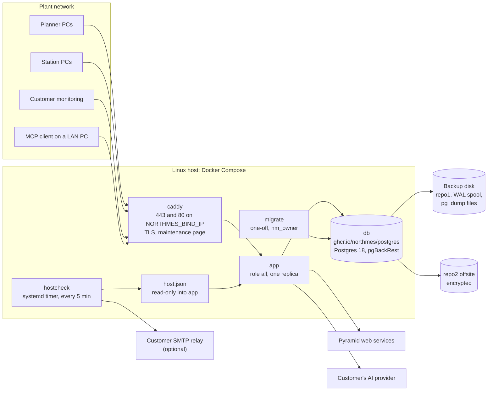
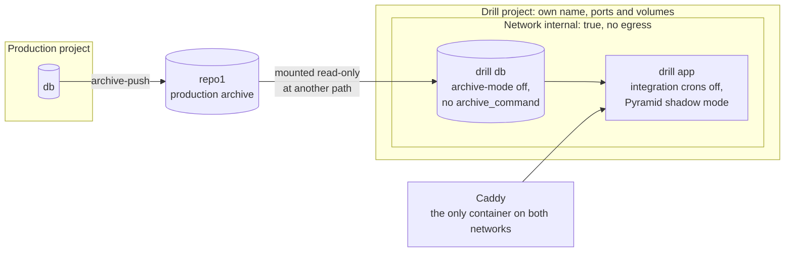
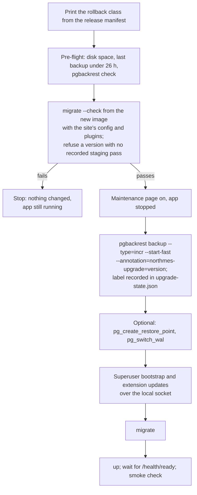

# Operations and security

The pilot runs NorthMES on one Linux host at the plant with Docker Compose: Caddy for TLS, one `app` container in role `all`, a one-off `migrate` service and Postgres 18 with pgBackRest. This document describes that bundle and the host it needs, the TLS options, the bootstrap of database roles and the first admin, backups with WAL archiving, restore drills that cannot touch production, upgrades and rollback, offline image transfer, health checks and the System health page, logs and optional OpenTelemetry, secrets and the installation key, the same-origin and credential rules, rate limiting, the supply chain, the license gate, security reporting, the GDPR basics and the go-live checklist. Each part links its ADR; the main ones are [ADR 0044](../adr/0044-on-prem-deployment-with-docker-compose-and-mandatory-tls.md) (deployment and TLS), [ADR 0045](../adr/0045-backups-restore-drills-upgrades-and-rollback.md) (backups, drills, upgrades and rollback) and [ADR 0047](../adr/0047-secrets-and-the-installation-key.md) (secrets). The host is a single point of failure, and the install guide says so: recovery is a restart plus a restore.

## Decisions in this document

| Topic | ADR | Status | Still to confirm |
|---|---|---|---|
| Compose bundle and mandatory TLS | [0044](../adr/0044-on-prem-deployment-with-docker-compose-and-mandatory-tls.md) | accepted | pilot IT (TLS option, bind address) |
| Database image, bootstrap and extension updates | [0005](../adr/0005-postgres-18-official-image-with-pgbackrest-timescaledb-deferred.md) | accepted | maintainer (the pgBackRest source fallback until PGDG publishes 2.59.3) |
| Configuration, the environment schema and secret files | [0060](../adr/0060-configuration-with-nestjs-config-one-zod-environment-schema-and-secret-files.md) | accepted | none |
| Backups, restore drills, upgrades and rollback | [0045](../adr/0045-backups-restore-drills-upgrades-and-rollback.md) | proposed | maintainer and pilot IT (disk layout, offsite target, RPO and RTO); product owner (upgrade window) |
| Health endpoints, shutdown, System health | [0043](../adr/0043-health-endpoints-graceful-shutdown-and-the-system-health-page.md) | accepted | none |
| Logs, host checks, optional OpenTelemetry | [0046](../adr/0046-observability-structured-logs-host-checks-and-optional-opentelemetry.md) | proposed | pilot IT (monitoring tool or SMTP relay) |
| Secrets and the installation key | [0047](../adr/0047-secrets-and-the-installation-key.md) | proposed | pilot IT (escrow location) |
| Identity, sessions, station credentials | [0010](../adr/0010-identity-with-better-auth-roles-and-permissions-in-core-tables.md) | accepted | product owner (who edits and assigns roles); maintainer (operator placeholder email) |
| Principals, credentials, same-origin rules, rate limiting | [0011](../adr/0011-principals-credentials-and-same-origin-rules.md) | proposed | none |
| Route families under `/api/v1`, credentials per family, the later public API | [0064](../adr/0064-rest-routes-under-api-v1-and-openapi-from-zod-contracts.md) | accepted | none |
| Security events, personal data, retention | [0013](../adr/0013-audit-trail-written-in-the-command-transaction.md) | accepted | maintainer (lifecycle classes; tool results as exports); lawyer (retention, erasure) |
| Station principal and network | [0033](../adr/0033-online-operator-station-in-the-production-start-module.md) | accepted | product owner (reporting in NorthMES or Pyramid, corrections, operators per station); pilot IT (station network, hardware) |
| Outbound URLs for AI providers | [0035](../adr/0035-ai-provider-port-with-customer-configured-providers.md) | accepted | lawyer (AI Act Article 50); maintainer (Google in release 1) |
| Site image for plugins | [0037](../adr/0037-plugins-drop-in-packages-command-validators-and-ui-slots.md) | accepted | maintainer (no third-party plugin on the pilot; web-only plugins degrade); product owner (unpaid-invoice validator) |
| Patch releases and release assets | [0038](../adr/0038-versions-and-releases-lockstep-0-x-release-please-api-reports.md) | accepted | maintainer (no range override in 0.x) |
| Supply chain, attestations, CI runners | [0050](../adr/0050-github-organization-rulesets-ci-runners-and-supply-chain.md) | accepted | none |
| Dependency license gate and SBOM | [0040](../adr/0040-dependency-license-policy-ci-gate-and-sbom.md) | proposed | lawyer (GPL family policy) |
| License and source offer | [0039](../adr/0039-license-agpl-3-0-or-later-core-and-a-contributor-license-agreement.md) | accepted | lawyer (license file and CLA text) |
| Security answers, regulated readiness | [0051](../adr/0051-regulated-readiness-no-regret-rules.md) | accepted | lawyer (signature path, CRA role); product owner (regulated profile switch) |
| Error telemetry, opt-in and deferred | [0052](../adr/0052-error-telemetry-opt-in-and-deferred.md) | accepted | none |
| Public names and mail addresses | [0048](../adr/0048-documentation-on-docs7-at-docs-northmes-dev.md) | accepted | maintainer (docs content license) |

Related plan documents: [02-architecture.md](02-architecture.md) (process roles, boot and shutdown), [04-data-and-platform.md](04-data-and-platform.md) (database roles, secrets per service, audit), [06-web-and-ux.md](06-web-and-ux.md) (supported browsers, stale tabs after an upgrade), [08-pyramid-connector.md](08-pyramid-connector.md) (shadow and live write-back), [09-operator-station.md](09-operator-station.md) (station PCs and HTTPS), [10-ai-and-agents.md](10-ai-and-agents.md) (on-prem reachability of AI providers and MCP clients), [11-quality-and-testing.md](11-quality-and-testing.md) (the ops tests), [13-delivery-and-github.md](13-delivery-and-github.md) (workflows and rulesets), [15-regulated-readiness.md](15-regulated-readiness.md).

## The pilot shape

- One installation serves one customer. The pilot host runs one `app` replica in role `all`; there is no Helm chart, no Kubernetes and no PgBouncer in release 1 ([ADR 0044](../adr/0044-on-prem-deployment-with-docker-compose-and-mandatory-tls.md), [ADR 0002](../adr/0002-modular-monolith-with-module-owned-schemas-and-process-roles.md)).
- The code still follows the multi-replica rules (stateless processes, idempotent jobs, transaction-level advisory locks, `LISTEN` on a direct connection, migrations as a separate step), so a second replica needs no rewrite.
- All frontend assets are bundled. The shell makes no CDN calls, and fonts are self-hosted.
- Nothing leaves the installation by default: no telemetry, no error reporting to the project, no AI call unless the customer configures its own provider.

## The Compose bundle

Each release attaches a versioned bundle to the GitHub release: `compose.yaml` with every image pinned by digest, the vendor `Caddyfile`, `northmes.env.example`, the scripts (`install-preflight.sh`, `install.sh`, `upgrade.sh`, `rollback.sh`, `restore.sh`, `rotate-cert.sh`, `hostcheck`), the systemd units for the timers and a release manifest that states the schema compatibility number and the rollback class. Docker's `compose publish` cannot ship a Compose app with bind mounts, so the bundle is a tarball ([ADR 0044](../adr/0044-on-prem-deployment-with-docker-compose-and-mandatory-tls.md)).

### Services

| Service | Image | Does | Secrets it receives | Settings |
|---|---|---|---|---|
| `caddy` | `caddy`, pinned by digest | TLS, reverse proxy, compression, the maintenance page | none; the customer's certificate and key are mounted read-only from `./certs`, or the internal CA lives in the `caddy_data` volume | A static Caddyfile that imports a site snippet; no Docker socket; publishes 443 and 80 on `NORTHMES_BIND_IP` only; `encode zstd gzip`; `handle_errors 502 503 504` serves the maintenance page with status 503 and `Retry-After: 15`; depends on `app` with `service_started`; `stream_close_delay` keeps WebSockets open across a reload; a Compose healthcheck through a local request on its own listener (the probe is fixed in E17-S02) |
| `app` | `ghcr.io/northmes/northmes:<version>@sha256:<digest>`, or the site image built from it | Role `all`: the shell, remotes, `/graphql`, `/mcp`, `/api`, workers, cron, health | `db_app_password`, `db_auth_password`, `auth_secret`, `installation_key`, `customer_ca` | `init: true`; `stop_grace_period: 45s`, above the pg-boss drain timeout; a `mem_limit`; `read_only: true` with a tmpfs for `/tmp`; `cap_drop: [ALL]`; `no-new-privileges`; non-root user; healthcheck through a small Node script that fetches `/health/ready`; retries the database at boot; mounts `host.json` read-only; `NODE_EXTRA_CA_CERTS` points at `customer_ca` |
| `migrate` | the same image as `app` | `northmes migrate`, `northmes company create`, `add-admin` and `list`, `northmes installation show` and `set`, `northmes admin reset-password` | `db_owner_password`, and `auth_secret` if Better Auth needs it for the commands that create users (M-53) | `restart: "no"`; `install.sh` and `upgrade.sh` run it explicitly with `docker compose run --rm migrate` |
| `db` | `ghcr.io/northmes/postgres@sha256:<digest>`, the digest in `infra/pg-image.json` | Postgres 18 with pgBackRest | the superuser password (`POSTGRES_PASSWORD_FILE`); the first-init script also reads the role passwords from `_FILE` secrets | `-c wal_compression=zstd` and the archive settings below; a `mem_limit`; `shm_size` above the 64 MB default; a `stop_grace_period` longer than app's; healthcheck `pg_isready`; publishes no port; the backup disk bound with the long syntax and `create_host_path: false` |

Rules for every service:

- `pull_policy: missing`, so an offline host never tries to pull.
- The `local` log driver, which rotates by default; the `json-file` default does not rotate.
- Only Caddy publishes ports. Docker routes published ports before ufw's chains, so a published database port would bypass the host firewall.
- `depends_on` is a Compose client feature and is ignored after a host reboot, when the daemon restarts containers by their restart policy in no order. The app therefore retries the database with backoff, reports not ready until the database answers and the schema is compatible, and the scripts run `migrate` explicitly.
- Each long-running service has a Compose healthcheck: `app` through `/health/ready`, `db` through `pg_isready`, `caddy` through a local request. `migrate` is a one-off and reports through its exit code. `/health` with status, version and dependency state is served by the app in every role ([ADR 0043](../adr/0043-health-endpoints-graceful-shutdown-and-the-system-health-page.md)), and Caddy passes it through to the customer's monitoring.
- Profiles: `observability` starts an OpenTelemetry backend for a debugging session; `mail` starts Mailpit for test installs only.

### Site files

A release never overwrites what the site changed ([ADR 0044](../adr/0044-on-prem-deployment-with-docker-compose-and-mandatory-tls.md), [ADR 0037](../adr/0037-plugins-drop-in-packages-command-validators-and-ui-slots.md)):

- `compose.override.yaml`, which Compose merges automatically, holds the site's Compose changes.
- `northmes.env` holds infrastructure settings only: the public origin (`NORTHMES_PUBLIC_ORIGIN`), the bind address (`NORTHMES_BIND_IP`), database URLs (`DATABASE_LISTEN_URL` is a direct connection), proxy variables and the optional `OTEL_EXPORTER_OTLP_ENDPOINT`. Settings that change behaviour, such as switching Pyramid write-back to live, are audited settings commands in the database, and installation-wide ones, such as enabling `/mcp`, are audited `northmes installation set` commands on the host; none are environment variables ([ADR 0022](../adr/0022-shared-building-blocks-packages-the-master-data-kit-settings-and-generators.md)). The server validates the environment against one Zod schema at boot. Each secret reaches it as a file whose path is in its own `_FILE` key, which `compose.yaml` sets per service, for example `NORTHMES_DB_APP_PASSWORD_FILE=/run/secrets/db_app_password`, and secret values never enter the environment ([ADR 0060](../adr/0060-configuration-with-nestjs-config-one-zod-environment-schema-and-secret-files.md)).
- A site Caddyfile snippet holds the host name and the TLS choice; the vendor Caddyfile imports it.
- `pgbackrest.conf` holds the site's repositories and the repo2 credentials, so it is a site file too.
- Plugins reach the pilot as a site image: `FROM ghcr.io/northmes/northmes:<version>` with `COPY plugins/` and the config, tagged per upgrade, so a rollback returns to the previous site image tag. No third-party plugin runs on the pilot.
- The N-1 images stay on the host by tag, and the previous bundle's `compose.yaml` and Caddyfile are kept.

## TLS

HTTPS is mandatory for every browser, planners and stations alike. Stations need a secure context, the session cookie is `Secure`, and the shell's manifest hash check uses `crypto.subtle`, which exists only in a secure context ([ADR 0044](../adr/0044-on-prem-deployment-with-docker-compose-and-mandatory-tls.md)).

| Option | When | What the site does |
|---|---|---|
| The customer's own CA (preferred) | The customer runs a CA, for example AD Certificate Services, and its PCs already trust it | The CA issues a certificate for a name in the customer's internal DNS; Caddy uses it from `./certs`; renewal is manual, so System health shows the expiry |
| Caddy's internal CA (fallback) | No customer CA | Caddy runs `tls internal` with `skip_install_trust`; the root certificate from the `caddy_data` volume goes to customer IT, which deploys it to every PC by Group Policy or Intune |

A public name with the ACME DNS-01 challenge needs a Caddy build with a DNS provider module, outbound internet and DNS API credentials; it is not part of the release 1 install guide. Plain HTTP is never served, and a browser policy that treats an HTTP origin as secure is not a supported setup.

Rules:

- A catch-all `http://` block redirects any host to the canonical HTTPS host with status 308.
- Names in the customer's internal DNS only; `.local` names are reserved for multicast DNS and are not used.
- HSTS is switched on only after the pilot's certificates are confirmed.
- Caddy's internal CA keeps its root and keys in the data directory, which must not be treated as a cache: losing it means a new root on every PC. The `caddy_data` volume is backed up, and the root key is in the offline escrow when this option is used.
- The internal CA issues leaf certificates valid for 12 hours with `NotBefore` set to the issue time, so every station syncs its clock to the plant NTP source.
- The app reads certificate validity through a TLS connection to `caddy:443` and warns 30 days before expiry. `scripts/rotate-cert.sh` checks that key and certificate match, the SAN and the chain, copies the files atomically, runs `caddy reload --force` and confirms that the served `notAfter` changed.
- The first shell script checks `isSecureContext` before sign-in and shows a plain message on an insecure origin.
- Outbound TLS: Node uses its bundled CA list. `NODE_EXTRA_CA_CERTS` points at the `customer_ca` secret, so the Pyramid web services, an SMTP relay or a TLS-inspecting proxy with the customer's CA verify. Node only warns when that file is missing or malformed, so a wrong path shows up later as failed certificate checks. The connector maps `CERT_HAS_EXPIRED` to its own message.

## Host, disks and network

### Host

| Item | Rule |
|---|---|
| Machine | A Linux VM on amd64, because the offline bundle is built for `linux/amd64`; an agreed owner for OS patching |
| Docker | Engine 29 or later with the containerd snapshotter, Compose 5 or later, from Docker's repository; offline packages are a customer IT prerequisite in the install guide |
| Clock | The host in UTC, synchronized with chrony or systemd-timesyncd against the customer's NTP source; containers and Postgres run in UTC |
| Sizing (proposal from estimates, not measurements) | 4 vCPU, 16 GB RAM (8 GB without the observability profile), SSD, a 100 GB data disk and a separate backup disk of at least 200 GB; Postgres `shared_buffers` 2 to 4 GB, the app limit 2 GB, Caddy 256 MB |

The sizing comes from estimated pilot volumes (internal research note 15). Before go-live a run on the pilot-like VM seeds three years of synthetic orders and times the board queries and an autoplan run ([11-quality-and-testing.md](11-quality-and-testing.md#performance-tests)).

### Disk layout

| Disk or path | Holds | Rule |
|---|---|---|
| Root disk | The operating system | |
| Data disk | Docker's `data-root`: the `pgdata` volume, images, container logs | `/etc/docker/daemon.json` sets `data-root`; otherwise everything lands under `/var/lib/docker` on the root disk |
| `/srv/northmes-backup` on the backup disk | pgBackRest repo1, the WAL archive spool, pgBackRest logs, the nightly `pg_dump` files | A systemd drop-in sets `RequiresMountsFor=/srv/northmes-backup` on `docker.service`; the bind uses the long syntax with `create_host_path: false`, so a missing mount stops `db` with a clear error instead of filling an empty directory on the root disk |
| `/srv/northmes/status/host.json` | hostcheck output | Mounted read-only into `app` |
| `/opt/northmes/bin/hostcheck` | The host check script | Run by a systemd timer |
| The bundle's `secrets` directory | One file per Compose secret | Root-owned, mode 0700; `install.sh` writes each file with `install -m 0440`, owned by root and the group of the uid the db and app processes run as |

The disk layout, the offsite target and the RPO and RTO are confirmed with pilot IT before go-live ([ADR 0045](../adr/0045-backups-restore-drills-upgrades-and-rollback.md)).

### Network

| Direction | Allowed | Notes |
|---|---|---|
| Inbound 443 and 80 | From the plant networks to `NORTHMES_BIND_IP` | Port 80 only redirects. Network ACLs belong to customer IT; `DOCKER-USER` rules are optional. |
| Outbound | The Pyramid web services; the customer's AI provider when configured; repo2; NTP; the SMTP relay when hostcheck mails | Behind a proxy: `NODE_USE_ENV_PROXY=1` with `HTTPS_PROXY`, and `NO_PROXY` including the database host and any LAN model server ([10-ai-and-agents.md](10-ai-and-agents.md#on-prem-reachability)) |
| Support access | Through the customer's VPN | See [Security reporting and support access](#security-reporting-and-support-access) |
| Stations | Optional `allowedCidrs` per station; a security event when a station key is used from a new source IP | Station network ranges come from pilot IT ([ADR 0033](../adr/0033-online-operator-station-in-the-production-start-module.md)) |

Station and planner PCs use a persistent browser profile, never Edge kiosk mode or Assigned Access with Edge, which run InPrivate and drop the station cookie. Pilot IT reports their OS and browser versions before go-live, because Chrome and Edge 109 are the last versions on Windows 7 and 8.1 and the floor is 111 ([06-web-and-ux.md](06-web-and-ux.md#supported-browsers), [09-operator-station.md](09-operator-station.md)).

## Install and bootstrap

There is no web setup route, so nobody on the plant network can make themselves company admin before IT finishes the install ([ADR 0011](../adr/0011-principals-credentials-and-same-origin-rules.md), [ADR 0005](../adr/0005-postgres-18-official-image-with-pgbackrest-timescaledb-deferred.md)).

1. `install-preflight.sh` checks that `docker info` shows the containerd snapshotter, Engine 29 or later and Compose 5 or later, and verifies the image tarball (see [Offline image transfer](#offline-image-transfer)).
2. `install.sh` generates the secrets and writes them with `install -m 0440`.
3. It chowns the backup and spool directories to the db uid.
4. It starts `db`. On first init, a script in `/docker-entrypoint-initdb.d` creates `nm_owner`, `nm_app`, `nm_auth` and `nm_ext` from the `_FILE` secrets. On a database server that already exists, `northmes db bootstrap` does the same once as the superuser. The first init also sets `POSTGRES_INITDB_ARGS='--locale-provider=builtin --builtin-locale=C.UTF-8'`.
5. It runs `pgbackrest stanza-create`, `pgbackrest check` and a full backup.
6. It runs `docker compose run --rm migrate`, then starts `app` and `caddy`.
7. An administrator creates each company with its first company admin: `docker compose run --rm migrate northmes company create --name <text> --admin-username <username> --reason <text>`. The command writes a command row with surface `cli` under the system principal `core.cli`, writes a security event and prints the new user's temporary password once; the password must be changed at the first sign-in. The first admin then signs in and goes through the onboarding wizard, which creates the first plant and keeps it closed to planners and stations until its calendar and a plannable machine exist ([ADR 0066](../adr/0066-companies-created-by-the-cli-plant-slugs-unique-per-installation-admin-pages-at-admin-and-an-onboarding-wizard-before-a-plant-opens.md)).
8. When a private host must be reachable (a Pyramid endpoint, a model server on the plant LAN) or `/mcp` is wanted, the administrator sets it with `northmes installation set` in the same container.

`northmes company add-admin` gives a company another company admin and restores a company that has lost every company admin; `northmes admin reset-password` recovers a locked-out user. `northmes company list` shows the companies, their onboarding state and their admins. Every command takes `--json` for scripts, never prompts and takes no password as a flag, so a hosting partner can script a customer's companies with fixed `--id` values. The JSON output for a new user holds its temporary password, which appears nowhere else, so a script keeps that output out of its logs.

Operators come from a seed script, or later from a CSV import. The go-live checklist asks for at least two admin accounts; the second one comes from `northmes company add-admin`.

## Backups and WAL archiving

pgBackRest 2.59.3 or later runs inside the database image, because `archive_command` runs in the Postgres container. Versions before 2.59.3 could give encrypted repositories weak subkeys ([ADR 0045](../adr/0045-backups-restore-drills-upgrades-and-rollback.md), [ADR 0005](../adr/0005-postgres-18-official-image-with-pgbackrest-timescaledb-deferred.md)).

| Setting | Value | Why |
|---|---|---|
| `archive_mode`, `archive_command` | `on`, `pgbackrest --stanza=northmes archive-push %p` | Continuous WAL archiving for point-in-time recovery |
| `archive_timeout` | 60 s | A quiet planning database can take hours to fill a WAL segment; this bounds the loss to about a minute |
| repo1 | Posix path on the backup disk | Fast local restores |
| repo2 | The customer's NAS, SFTP or S3-compatible storage, encrypted | Survives the loss of the host; the location is confirmed with pilot IT |
| `archive-async` | `y`, with the spool path on the backup disk | Required for `archive-push-queue-max` |
| `archive-push-queue-max` | Sized to the data disk, for example 20GiB | `archive-push` fails when any repository fails. While repo2 is unreachable, WAL would grow until the data disk fills and Postgres stops. Above the limit WAL is dropped with a warning, the database stays up, health shows the PITR gap in red, and a new full backup is required. |
| `log-path`, `log-level-file` | On the backup disk, `warn` | The default path lies in the container's writable layer |
| Timers | Two per repository: weekly `--type=full` and daily `--type=diff`, with explicit `retention-full` and `retention-archive`, `Persistent=true` and `After=docker.service` | A single diff timer turns its first run into a full and never expires anything |
| Second copy | A nightly `pg_dump` that keeps 7 files | An independent logical copy |

Rules:

- A restore point and an incremental backup precede every upgrade (see [Upgrades and rollback](#upgrades-and-rollback)).
- Outside the database, the backup covers the `caddy_data` volume, the bundle with its site files and `northmes.env`, and the secrets directory. The installation key is kept apart from the database backups, because the key plus a database backup gives the plaintext of every stored secret.
- A monthly restore test restores only the database and checks row counts through `psql`.
- Each quarter, a restore from repo2 only, on a scratch VM or in CI, uses nothing but the escrowed material, and its duration is recorded as the measured RTO ([ADR 0047](../adr/0047-secrets-and-the-installation-key.md)).
- Proposed targets: RPO 1 minute, RTO 2 hours. Retention values per repository are set with pilot IT.
- Pilot IT agrees before go-live that reverting a hypervisor snapshot is not the database recovery path. After a revert, Postgres sends WAL segments whose names already exist in the repository with other content, pgBackRest refuses them and archiving stops. If a revert happens anyway, the database is restored through pgBackRest or a new full backup goes into a fresh stanza, and hostcheck alerts on `pg_stat_archiver.failed_count` above 0.

## Restore drills isolated from production

A restore drill never writes into the production archive and never talks to an integration. A copy of a physical backup shares the production system identifier, so a drill that kept the production `archive_command` would push its own timeline into the production archive, and a later point-in-time restore could follow that timeline. The restored database also holds the Pyramid endpoint, the encrypted credentials and the scheduled jobs, so a drill with live write-back could send an old plan to production Pyramid ([ADR 0045](../adr/0045-backups-restore-drills-upgrades-and-rollback.md)).

- Restores in a drill use `--archive-mode=off`, through a drill override with no `archive_command`, with the repository mounted read-only at another path and a distinct Compose project name, ports and volumes.
- Both database services have a `mem_limit`, so a second instance cannot push the host into the OOM killer.
- Drills preferably run on a second VM, or in a CI Testcontainers job against a copy of repo1, which removes the shared paths, secrets and memory risk at once.
- The drill app sits on a Compose network with `internal: true` and no egress. Caddy is the only container on both networks. One environment flag skips integration crons and forces Pyramid shadow mode. Rule 6 in [15-regulated-readiness.md](15-regulated-readiness.md) keeps behaviour settings out of environment variables, so whether the drill switch may stay an environment flag is open (M-48 in [16-open-questions.md](16-open-questions.md)).
- The production restore runbook states which `--target-timeline` to use.

The nightly ops test proves it: it writes rows, takes a full backup, runs the drill, writes rows in the copy and switches WAL there, then asserts that `pgbackrest info` lists no timeline 2, the archived segment count is unchanged, a production point-in-time restore returns production rows only, and a drill copy with live write-back configured sends zero requests to the fake PWS server ([11-quality-and-testing.md](11-quality-and-testing.md#ops-and-image-tests)).

### A production restore

1. Stop `app`. Restore with `restore.sh`, which passes `--target-action=promote`, because pgBackRest's default target action pauses: `pg_isready` would be green while every write fails in a read-only recovery.
2. Wait until `pg_is_in_recovery()` is false, then run `migrate`.
3. Start `app`. Restore and rollback write a security event through a `cli` audit context, and the shell shows admins and planners a banner for 24 hours: "Data restored to <time>; changes after that were lost."
4. The last step of `restore.sh` and `rollback.sh` runs the Pyramid write-back reconciler after the next poll has reset the last-seen values, so Pyramid and NorthMES agree again ([08-pyramid-connector.md](08-pyramid-connector.md)).
5. The runbook replays pseudonymizations newer than the restore point, from the log lines kept outside the database (see [GDPR basics](#gdpr-basics)).

## Upgrades and rollback

### Schema compatibility

- Every migration file carries an expand or a contract marker. A migration lint rejects `cascade`, `drop table`, dropping constraints on referenced tables and key type changes unless the file carries the contract marker ([ADR 0045](../adr/0045-backups-restore-drills-upgrades-and-rollback.md)).
- Each release carries one schema compatibility number in `northmes_meta`. A contract migration, a pg-boss schema change, a Better Auth schema change or an extension update bumps it.
- Boot and readiness accept a newer database while that number does not exceed the image's maximum. System health then shows "schema ahead by N expand migrations".
- An older image's `migrate` applies nothing and exits 0 with a warning when the database is compatible, so the previous image can start on a schema that only expanded.
- Every job payload and event carries `schema_version`, and a handler parks an unknown version in a dead-letter state instead of retrying, because after an image rollback old code reads what the new release wrote ([ADR 0014](../adr/0014-outbox-event-log-and-pg-boss-jobs.md)).
- The runner records the foreign keys that point into a module's schema from other schemas before that module's pending files and raises when one disappears. Plugin foreign keys to other modules use `ON DELETE CASCADE` or `SET NULL`, per the owner's grant policy. System health lists leftover schemas of modules no longer installed.

The release manifest states the rollback class:

| Rollback class | Meaning | Rollback |
|---|---|---|
| image | The release only expanded the schema | Start the previous site image; no restore |
| restore | The release bumped the schema compatibility number | Restore the backup taken at the start of the upgrade, then start the previous site image |

`rollback.sh` never rolls the database image back without a restore.

### `upgrade.sh`

- `migrate --check` runs boot steps 1 to 10 (config, resolve hook, manifests, catalog checks, migration check, server imports, Nest create, isolation check, static mounts, schema build and composition) without listening and stops before the first migration file. In this mode the migration check of step 5 lists pending files instead of failing on them. A plugin that no longer composes therefore fails before any downtime ([02-architecture.md](02-architecture.md#boot-sequence)).
- The app is stopped before the backup, so nothing writes between the backup and the migration, and a rollback restores that backup exactly.
- Extension updates run as `docker compose exec -T db psql -U postgres` for every extension whose `extversion` is older than its `default_version`, because `migrate` runs as `nm_owner` and cannot alter an extension the superuser created.

### `rollback.sh`

1. Export the `audit.command` and `production_start.report` rows written after the recorded upgrade time to a CSV, so people can re-enter them.
2. For the restore class: `restore --set=<label> --type=immediate --target-action=promote`, using the label from `upgrade-state.json`. The default `--set` is the latest backup, which would not reach the intended point.
3. Wait until `pg_is_in_recovery()` is false, then run the previous image's `migrate`, which applies nothing.
4. Start the previous site image. Write the security event, show the 24-hour banner and run the reconciler as in a production restore.

### When and how often

- Upgrades are scheduled between shifts, with paper reporting meanwhile (the product owner confirms the window). Stations show Caddy's maintenance page, which retries every 10 seconds and returns to the original URL ([09-operator-station.md](09-operator-station.md)).
- Nobody installs or upgrades in the week of a daylight saving change.
- Open browser tabs detect the new build and reload, as [06-web-and-ux.md](06-web-and-ux.md) describes.
- A patch release is image-only, has no migrations and has rollback class image, with a 72-hour target from fix to customer bundle ([ADR 0038](../adr/0038-versions-and-releases-lockstep-0-x-release-please-api-reports.md)).
- The pilot's exit criteria include an upgrade rehearsal from N to N+1 with a migration, the backup and a rollback on the pilot-like VM. A nightly test runs the previous image's smoke test and workers over a database the current image wrote, for releases of the image class ([11-quality-and-testing.md](11-quality-and-testing.md#ops-and-image-tests)).

## Offline image transfer

A plant without internet receives images as a file ([ADR 0050](../adr/0050-github-organization-rulesets-ci-runners-and-supply-chain.md)).

1. A release job on an amd64 GitHub-hosted runner builds `northmes-<version>-linux-amd64-images.tar.zst` from `docker compose config --images` with `docker save --platform linux/amd64`, and attaches its sha256. A default pull on an arm64 laptop fetches arm64 content only, so the bundle is never built there.
2. GitHub artifact attestations cover the image digests, the SBOMs, the `docker save` tarballs and the Compose bundle. They are made on GitHub-hosted runners only, so a verifier can deny self-hosted runners.
3. On a connected machine: `gh attestation download` and `gh attestation trusted-root`. On the offline machine: `gh attestation verify --bundle ... --custom-trusted-root ...`. Cosign keyless signatures, including `cosign sign-blob` on the tarball, are an optional second path; plain checksums are the minimum.
4. `install-preflight.sh` checks the Docker setup, verifies the tarball's attestation or signature and digest, and after `docker load` runs `docker image inspect <ref@digest>` for each image. On the classic overlay2 store a loaded image has no repo digests and digest-pinned references would try to pull, which is why the preflight requires the containerd snapshotter.
5. The stack starts with `docker compose up --pull never`.

A release CI job loads the bundle in a fresh amd64 VM or Docker-in-Docker with `--network none` and checks `/health/ready` through Caddy. Pilot IT confirms which verification tool the transfer machine has (`gh`, cosign or checksums).

## Health and the System health page

Every web endpoint and service exposes `/health` with status, version and dependency state, plus `/health/live` and `/health/ready` ([ADR 0043](../adr/0043-health-endpoints-graceful-shutdown-and-the-system-health-page.md)). Module checks and their owners are in [04-data-and-platform.md](04-data-and-platform.md#health-checks-per-module).

| Endpoint | Checks | Used by |
|---|---|---|
| `/health/live` | The process only | Probes that only ask whether the process answers; the autoplan event-loop test |
| `/health/ready` | `select 1`, schema compatibility, the `LISTEN` connection, pg-boss started. Returns JSON with a degraded list, and 503 during shutdown | The Compose healthcheck, the customer's monitoring, the shell's admin banner |
| `/health` | Status, version and the state of each dependency (database connected and similar) | Any client that wants the full status |

Degraded entries keep readiness true: Pyramid unreachable; the last successful backup older than 26 hours; audit partitions fewer than 3 months ahead (readiness fails below 1 month, because a missing partition makes every write fail); `host.json` older than 15 minutes; WAL archiving failing or a PITR gap; certificate expiry within 30 days; clock skew. Checks are custom `@nestjs/terminus` indicators with timeouts.

Docker never restarts a container because it is unhealthy. An in-process watchdog exits with code 1 when readiness stays false more than 120 seconds after its first success, or 300 seconds after start, so `restart: unless-stopped` recovers the process. pg-boss start retries with backoff like the database pool. The shutdown order is in [02-architecture.md](02-architecture.md#shutdown-sequence).

### hostcheck

The app cannot see disk space, NTP state or pgBackRest from inside its container, and a host script cannot insert into an audited table without an audit context. One host script therefore writes a file the app reads ([ADR 0046](../adr/0046-observability-structured-logs-host-checks-and-optional-opentelemetry.md)):

- `/opt/northmes/bin/hostcheck` runs on a systemd timer every 5 minutes (`Persistent=true`, `After=docker.service`) and writes `/srv/northmes/status/host.json`: disk free per mount (root, data-root, backup), `pgbackrest info --output=json`, the last drill result, `NTPSynchronized`, the certificate's `notAfter` and the running image digests.
- The app reads archive health from `pg_stat_archiver` over SQL and certificate expiry from a TLS connection to `caddy:443`, so those two do not depend on the file.
- Alerts reach a person through one of two paths, and one of them is a go-live gate: the customer's monitoring polls the degraded list of `/health/ready`, or hostcheck mails state changes through the customer's SMTP relay. No in-app notification service is built for this ([ADR 0055](../adr/0055-release-1-scope-under-option-b-and-the-scope-rule.md)).

### The System health page

Admins see, on one page: errors and browser errors grouped by fingerprint; failed and retrying jobs; the last successful Pyramid poll; the last successful backup; database size; certificate expiry; NTP status; versions, the image digest and the supergraph hash; Node and Postgres tzdata versions and whether Temporal is native or the polyfill; event-loop delay p99 and heap used; a "Modules and plugins" table (id, version, range, status, reason); "schema ahead by N"; leftover plugin schemas; stations not seen for 7 days; `pg_stat_archiver` `failed_count` and `last_failed_time`. The app measures clock skew per request from a client time header and warns above 5 seconds.

## Logs and optional OpenTelemetry

- `nestjs-pino` writes JSON to stdout with a correlation id on every request, job and Pyramid poll. The `local` log driver rotates the files ([ADR 0046](../adr/0046-observability-structured-logs-host-checks-and-optional-opentelemetry.md)).
- Redaction: `pinoHttp` redacts `req.headers.cookie`, `req.headers.authorization`, `req.headers['x-api-key']`, the station operator-session header and `res.headers['set-cookie']`, or a request serializer keeps only method, URL and correlation id. AI SDK error objects pass through a serializer that drops request bodies and response bodies ([10-ai-and-agents.md](10-ai-and-agents.md)).
- Requests log at debug level except errors and slow requests. Per-service log options come from a measured budget that holds at least 14 days; the nightly end-to-end run measures log bytes per hour.
- Every security event is also a log line, `{type: 'security_event', kind, principal, scope, correlationId}`, so a customer log collector sees failed sign-ins.
- MCP reads are not audited; they go to the structured log with the correlation id.
- OpenTelemetry sits behind the optional `observability` profile. The SDK loads only when `OTEL_EXPORTER_OTLP_ENDPOINT` is set and otherwise runs with `OTEL_SDK_DISABLED=true`. When the profile was researched (internal research note 15), the published NestJS instrumentation did not yet cover Nest 12, and the all-in-one backends were meant for development or needed several GB of memory, so the profile is for a debugging session, not for permanent use.
- Browser errors reach the installation's own database through `POST /api/v1/web/client-errors` (authenticated, same-origin, rate-limited, 8 kB body cap; CSP reports go there too). Server errors are recorded by fingerprint by the exception filter, the jobs wrapper and the tool runner ([05-graphql-and-apis.md](05-graphql-and-apis.md#graphql-errors)). System health shows both, and nothing leaves the installation. Opt-in error telemetry to the project is a decided principle built later, off by default ([ADR 0052](../adr/0052-error-telemetry-opt-in-and-deferred.md)).
- No Sentry SDK runs in the server.

## Secrets and the installation key

([ADR 0047](../adr/0047-secrets-and-the-installation-key.md), [04-data-and-platform.md](04-data-and-platform.md#secrets-and-the-installation-key))

| Secret | Service | Purpose |
|---|---|---|
| `db_app_password` | `app` | `nm_app`, the runtime login |
| `db_auth_password` | `app` | `nm_auth`, Better Auth's own pool |
| `auth_secret` | `app` | The Better Auth secret |
| `installation_key` | `app` | Root of the purpose keys for stored secrets and badge hashes |
| `customer_ca` | `app` | The customer's CA bundle for outbound TLS |
| `db_owner_password` | `migrate` | `nm_owner`, the only login that may `SET ROLE` to module owner roles |
| Superuser password | `db` | First init, bootstrap and extension updates |

- In role `all`, every plugin's server code runs in the app process. Keeping `db_owner_password` out of `app` means a plugin bug or remote code execution cannot connect as the owner and drop audit partitions. A contract test parses `docker compose config --format json` and asserts that `app` has no `db_owner_password`; the nightly Compose job asserts that `/run/secrets/db_owner_password` does not exist inside `app`.
- Stored secrets (AI provider keys, Pyramid credentials) use `node:crypto` AES-256-GCM with a versioned keyring. The associated data binds each ciphertext to its table, row, column and normalized endpoint host, so a configuration change that points a stored key at a new host fails with `core.secret_reentry_required`.
- Purpose keys come from the installation key through HKDF: `secrets-v1` for stored secrets and `badge-v1` for badge HMACs. Rotation re-encrypts every row in one transaction.
- Admin-set outbound URLs: private and link-local targets need an entry in the installation setting `outbound.allowedHosts`, set with `northmes installation set` on the host (a LAN model server is a normal case); `169.254.0.0/16` and the database host are always blocked; Test connection reports only reachable, not reachable or auth failed ([ADR 0035](../adr/0035-ai-provider-port-with-customer-configured-providers.md)).
- Losing the installation key means re-entering every integration secret.

One offline escrow, kept in two places, holds the material needed to recover on a clean host: `repo2-cipher-pass`, the repo2 credentials, the installation key, the Caddy root key (internal CA option) and the Better Auth secret. Without the repo2 cipher pass the offsite backup cannot be decrypted, and a monthly test from repo1 on the same host never shows that, so the quarterly restore from repo2 uses only the escrow. Where the escrow is kept is confirmed by pilot IT.

## Same-origin and credential rules

The shell, `/graphql`, `/api` and every remote share one origin, so there is no CORS and the session cookie works everywhere ([ADR 0011](../adr/0011-principals-credentials-and-same-origin-rules.md)).

- The gateway runs with `cors: false` and `csrfPrevention: { requestHeaders: ['x-northmes-csrf'] }`; the Apollo HTTP link in `web-sdk` sends the header.
- A global Nest middleware, mounted before the gateway and every first-party route (`/api/v1/web/*`, `/api/v1/station`, `/api/v1/ai/chat` and `/api/v1/pyramid-connector/import-file`), rejects unsafe methods unless `Origin` equals `NORTHMES_PUBLIC_ORIGIN`, or `Sec-Fetch-Site` is `same-origin` when `Origin` is absent, and writes a security event. Better Auth's `trustedOrigins` is `[NORTHMES_PUBLIC_ORIGIN]`.
- The WebSocket upgrade listener runs the same check, answers 403 and destroys the socket on a foreign origin. The WebSocket principal comes only from the handshake cookie, never from `connectionParams`; graphql-ws closes with 4401 without a session and 4403 on lost plant membership.
- The session cookie is `SameSite=Strict`; the station cookie is `__Host-nm_station` (`SameSite=Strict`, `Path=/`). Database sessions use a cookie cache of at most 60 seconds, so a banned user's cached cookie stops working within a minute.
- The page CSP is strict `'self'`, with `img-src` and `connect-src` kept to self.

Credentials follow the route family ([ADR 0064](../adr/0064-rest-routes-under-api-v1-and-openapi-from-zod-contracts.md)). Every REST route lives under `/api/v<major>/`, and `ApiController({ module, family })` records its family on the controller. Public and first-party routes share the version segment, so the guard and the same-origin middleware read the family from that metadata, not from a path prefix.

- First-party routes (`/api/v1/web/*`, `/api/v1/station`, `/api/v1/ai/chat`, `/api/v1/pyramid-connector/import-file`) serve only the shell, the remotes and the stations of the same image. They accept the cookies in the table below and pass the same-origin middleware.
- Better Auth's handler at `/api/v1/auth/*` is the library family, guarded by `trustedOrigins` and `disabledPaths`.
- Root routes (`/health`, `/health/live`, `/health/ready`, `/graphql`, `/mcp`, `/modules/<id>/<version>/*`, `/assets/*` and the SPA paths) stay at the root, outside the families.
- Public routes, `/api/v<major>/<module-id>/...`, arrive with the first outside system or Data collection's ingestion endpoint. Release 1 has none.

Credentials are bound to surfaces:

| Surface | Accepts | Refuses |
|---|---|---|
| `/graphql`, `/api/v1/web` | Session and station cookies | MCP tokens (api-key `configId` `mcp`) and any token whose `aud` is `/mcp`, so an agent holding its MCP token cannot call the commit mutation as the user; integration tokens (later) |
| `/api/v1/station` | The station cookie plus an operator session token | Session cookies, except on sign-out and admin deregistration |
| `/api/v1/ai/chat`, `/api/v1/pyramid-connector/import-file` | The session cookie | Bearer tokens |
| `/mcp` | A bearer JWT whose `aud` is `NORTHMES_PUBLIC_ORIGIN + '/mcp'`, or a personal access token with prefix `nms_mcp_` that expires within 90 days | Cookies; integration tokens (later); `/mcp` checks `Origin` and `Host` itself and returns 404 while the installation setting `mcp.enabled` is off |
| Better Auth `/admin/*` and `/organization/*` | Nothing: every path is in `disabledPaths`; user management runs as NorthMES commands, and companies come only from `northmes company create` | Sessions with `impersonatedBy` set |
| Public routes (later) | A bearer integration token bound to a scope node | Cookies, which they ignore, and MCP tokens |
| `GET /api/v1/openapi.json` (later) | The session cookie or an integration token | Anonymous requests and MCP tokens |

Later, with the first public route ([ADR 0064](../adr/0064-rest-routes-under-api-v1-and-openapi-from-zod-contracts.md)):

- Public routes accept bearer integration tokens only and ignore cookies, so they are exempt from the same-origin middleware in the same way as `/mcp`.
- `/graphql`, `/mcp` and every first-party route refuse integration tokens.
- Commands that arrive through a public route record the audit surface `api`.
- Rate limits count per integration token in a Postgres `ThrottlerStorage` (see [Rate limiting](#rate-limiting)).
- The token design (`configId`, prefix, expiry, issuing UI, rotation) is decided then.
- The image serves no Swagger UI, so the page CSP stays strict `'self'`. The API reference is rendered on docs.northmes.dev from the committed snapshot.

Boot refuses to start when `BETTER_AUTH_TELEMETRY` is set, when `enableSessionForAPIKeys` is true, or when `disabledPaths` lacks the api-key client endpoints and `/token`. Sign-up is disabled. Better Auth is pinned exactly and upgraded on purpose, with its release notes read and a migration ([ADR 0010](../adr/0010-identity-with-better-auth-roles-and-permissions-in-core-tables.md)). Whether the pilot needs multi-factor sign-in is decided after the pilot says whether it falls under the Swedish Cybersecurity Act (the NIS2 implementation); the candidates are Microsoft Entra ID as the Microsoft provider or Better Auth's `twoFactor` plugin after a review of its advisories ([ADR 0051](../adr/0051-regulated-readiness-no-regret-rules.md)).

## Rate limiting

([ADR 0011](../adr/0011-principals-credentials-and-same-origin-rules.md), [ADR 0033](../adr/0033-online-operator-station-in-the-production-start-module.md))

- Better Auth's limiter, with database storage, guards the sign-in endpoints.
- The station key configuration has Better Auth's limiter off and a per-station limit instead: 5 unknown badges within 60 seconds lock badge sign-in on that station for 5 minutes and write a security event. A terminal server or NAT can put many users behind one IP, so badge limits are per station, not per address.
- `@nestjs/throttler` keeps counters in memory while one replica runs. A Postgres `ThrottlerStorage` is written when a second replica exists, or with the first public route, whichever comes first; the Redis storage package does not support Nest 12, and Redis is not part of release 1.
- Public routes (later) are limited per integration token, because in-memory counters do not limit an outside client across replicas ([ADR 0064](../adr/0064-rest-routes-under-api-v1-and-openapi-from-zod-contracts.md)).
- Only Caddy is a trusted proxy. Caddy ignores incoming `X-Forwarded-For` values from clients.
- `/api/v1/web/client-errors` is rate-limited, and AI runs are capped per user ([10-ai-and-agents.md](10-ai-and-agents.md#usage-metering-budgets-and-audit)).

## Supply chain

([ADR 0050](../adr/0050-github-organization-rulesets-ci-runners-and-supply-chain.md), [ADR 0038](../adr/0038-versions-and-releases-lockstep-0-x-release-please-api-reports.md))

| Concern | Rule |
|---|---|
| Pinning | Every image by digest (Compose, Dockerfiles, `infra/pg-image.json`); every GitHub Action by full SHA, enforced by the organization setting; every scanner image by digest. A malicious Trivy release and force-pushed action tags in March 2026 are the reason scanners are pinned too. |
| Updates | Renovate with `config:best-practices`, `helpers:pinGitHubActionDigests`, digest pinning for Compose and Dockerfiles and a `minimumReleaseAge` (strict for the Module Federation packages). Dependabot alerts are on; Dependabot security updates are off. |
| New dependencies | Socket checks them on pull requests. A handoff run never adds a dependency released within the `minimumReleaseAge` window; it returns a question, and dependency additions are their own human-reviewed tasks. |
| Builds | Images are built, pushed and signed in the same workflow run as the release. Jobs are split so that no job both installs dependencies and holds `id-token: write`. Release, signing and attestations run on GitHub-hosted runners. |
| Provenance | GitHub artifact attestations for image digests, SBOMs, the `docker save` tarballs and the Compose bundle; bundles renamed `<asset>.intoto.jsonl` for Scorecard. Cosign keyless signing is optional. |
| SBOM | One CycloneDX SBOM per workspace package (`pnpm sbom --split`) and one per image that includes OS packages; attached to each release and copied into the image under `/usr/share/northmes/` |
| Scanning | The image build on pull requests and `main` scans with Trivy or Grype pinned by digest and fails on critical findings that have a fix. CodeQL default setup for `actions` and `javascript-typescript`. OpenSSF Scorecard and the Best Practices badge. |
| Repository | Secret scanning and push protection; private vulnerability reporting; least-privilege workflow permissions; `persist-credentials: false`; no `pull_request_target`; a tag ruleset; immutable releases from the first release; a `release` environment with owner approval and no admin bypass; approval required for all outside contributors' workflow runs. |
| Images | Rebuilt on every release, which also picks up new tzdata. Published as `ghcr.io/northmes/...`. |

## License gate

The license gate runs per package from the first commit and is a required check ([ADR 0040](../adr/0040-dependency-license-policy-ci-gate-and-sbom.md), [ADR 0039](../adr/0039-license-agpl-3-0-or-later-core-and-a-contributor-license-agreement.md)).

- `pnpm install --frozen-lockfile` with `supportedArchitectures` for linux x64 and arm64, glibc and musl, so native binaries that ship in images are in the tree; then `pnpm sbom --sbom-format cyclonedx --sbom-type application --prod --split`; then `scripts/license-gate.mjs` applies the policy that each package's own `license` field selects. Every workspace package sets its `license` field.
- Core (AGPL-3.0-or-later, everything in the server image or the browser bundle) allows MIT, MIT-0, ISC, BSD-2-Clause, BSD-3-Clause, 0BSD, Apache-2.0, Zlib, Unlicense, CC0-1.0, BlueOak-1.0.0 and Python-2.0; MPL-2.0 for unmodified files and CC-BY-4.0 for data, each with a recorded note. It denies GPL-2.0-only, source-available and non-commercial licenses, custom licenses, `UNLICENSED`, "SEE LICENSE IN" and missing licenses. Third-party GPL-3.0, AGPL and LGPL are denied in core pending legal review.
- The MIT packages (`@northmes/contracts`, every `@northmes/<id>-contracts`, `@northmes/sdk`, `@northmes/web-sdk`, `@northmes/ui`, `@northmes/web-build`, `@northmes/testing` and the generator) allow only permissive licenses in `dependencies` and `peerDependencies` and import nothing AGPL.
- Non-SPDX names pass only when `license-clarifications.json` maps that exact `name@version` after a person read the file; reviewed exceptions live in `license-exceptions.json` with a reason. The gate also scans installed packages for `ee/` folders and "Enterprise" license files, which SPDX fields miss.
- Never installed: `@graphql-yoga/nestjs-federation`, `@apollo/gateway`, `exceljs`, the npm `xlsx` package, `@sentry/node` in the server, Mastra. papaparse handles CSV. If a cache is ever needed, it is Valkey, not Redis.
- `THIRD_PARTY_NOTICES.txt` is generated at build time from the server's and the web app's production dependencies, copied into the image and served by the web app, because the browser bundle is distributed too.
- `LICENSE`, `NOTICE` and SPDX headers ship from the first commit. An About page shows the version, the license and a source link for that exact version, configurable so a partner that modifies core points to its own source (AGPL section 13).

## Security reporting and support access

([ADR 0051](../adr/0051-regulated-readiness-no-regret-rules.md), [ADR 0048](../adr/0048-documentation-on-docs7-at-docs-northmes-dev.md))

- `SECURITY.md` names GitHub private vulnerability reporting, with a report form that asks for the CWE, and security@northmes.dev. It holds the supported-versions table (before 1.0, only the latest minor is supported) and a response target.
- Before the pilot, a short page describes vulnerability handling and how customers are notified. The EU Cyber Resilience Act's vulnerability reporting obligations have applied since 11 September 2026; the project's role under the act is recorded in ADR 0051 as needing confirmation.
- Fixes reach customers as patch releases (image-only, no migrations, rollback class image) with a 72-hour target from fix to customer bundle.
- Support engineers are named NorthMES users with a support role, never shared logins. Support access goes through the customer's VPN. `audit.begin_command` with surface `sql` requires an active support user and a reason.
- Support receives logs only, with secret headers redacted. No database dump leaves the site. Every support ticket has a deletion date.
- Mail addresses under northmes.dev: security@ for vulnerability reports, privacy@ for data protection questions, support@ for the pilot.

## GDPR basics

The customer is the controller of the personal data in its installation. When the NorthMES vendor installs or supports an installation with remote access or receives logs, as for the pilot, the vendor is a processor, and an Article 28 agreement is needed. A partner that hosts an installation is a processor, and its hosting provider is a sub-processor ([ADR 0013](../adr/0013-audit-trail-written-in-the-command-transaction.md)).

What NorthMES stores and where:

- Production records, reports and audit rows store a person id, never a name. Names, emails and badge HMACs live only on the user and badge tables. IP addresses and user agents are stored on security events only, never on command rows.
- Pyramid imports take only the customer number and name; organisation numbers, addresses and phone numbers are not imported, and stored raw payloads are stripped of every customer element except the external id and the name. Some customers are sole traders, so their names are personal data.
- Module manifests declare personal-data fields, and the docs generate a register of what NorthMES stores and why.
- Retention in release 1: security event partitions are dropped after a default period held in the installation setting `audit.securityEventRetentionDays`, which `northmes installation set` changes; `ai.ai_call` keeps a 13-month default; audit command and change rows have no limit by default, as a customer setting; raw Pyramid payloads keep the last 50 runs per method, at most 7 days. Retention periods per category are under legal review.

Erasure:

- Erasure means pseudonymization. A `core.pseudonymizeUser` command, built when the first erasure request arrives, updates the user record, deletes accounts and sessions, revokes credentials, ends role and badge assignments and writes `user.pseudonymized`. The auth schema has no audit capture trigger, which keeps old names out of the trail.
- Pseudonymized data is still personal data for the customer, who can re-identify a person from rosters and badge logs. The product calls the command "pseudonymize user" and treats it as data minimization, not as deletion.
- Each pseudonymization is also a log line kept outside the database, and the restore runbook replays erasures newer than the restore point.
- Raw ERP payloads, the import inbox and run logs are command-only tables, so whole payloads never enter the append-only trail.

The data processing agreement template is the European Commission's standard contractual clauses for Article 28 (Implementing Decision (EU) 2021/915), with annexes generated from the manifests' personal-data declarations. The annex states that the AI data path runs from the customer's server to the customer's own provider, the audit retention default, the backup retention and the breach contacts. The agreement is signed before any real pilot data (files or recorded Pyramid requests) reaches development. Real files stay outside the repository and become anonymized synthetic fixtures before any commit; a repository lint fails on the organisation number pattern and on a deny-list of real customer names under `fixtures/` ([11-quality-and-testing.md](11-quality-and-testing.md#test-data-and-fixtures)).

## Go-live checklist

No pilot install happens until every item holds. The release-level conditions are in [01-product-and-scope.md](01-product-and-scope.md#what-done-means-for-release-1).

| # | Item | Who confirms |
|---|---|---|
| 1 | A Linux VM on amd64 with Docker Engine 29 or later (containerd snapshotter) and Compose 5 or later from Docker's repository; the host in UTC with NTP synchronized; an owner for OS patching | pilot IT |
| 2 | The disk layout: Docker `data-root` on the data disk, the backup disk mounted at `/srv/northmes-backup` with `RequiresMountsFor` on `docker.service` | maintainer and pilot IT |
| 3 | A DNS name in the customer's internal DNS; the TLS option chosen (the customer's CA preferred); the certificate or root trusted on every planner PC and station; `NORTHMES_BIND_IP` set to the plant-facing address | pilot IT |
| 4 | Firewall: inbound 443 and 80 from plant networks only; outbound to Pyramid, NTP, repo2, the AI provider if configured and the SMTP relay if used; a support access path through the customer's VPN | pilot IT |
| 5 | Secrets generated by `install.sh`; the escrow complete in two places (repo2 cipher pass, repo2 credentials, installation key, Caddy root key for the internal CA option, Better Auth secret) | pilot IT |
| 6 | Backups: `pgbackrest check` passes; the first full backup done; WAL archiving confirmed with `pg_stat_archiver.failed_count` at 0; a repo2 copy confirmed; both timers per repository active; one full restore done and timed in an isolated drill; RPO and RTO agreed | maintainer and pilot IT |
| 7 | Pilot IT agrees that a hypervisor snapshot revert is not the database recovery path | pilot IT |
| 8 | Alerts reach a person: the customer's monitoring polls the degraded list of `/health/ready`, or hostcheck mails state changes through the customer's SMTP relay | pilot IT |
| 9 | The image bundle verified (attestation, cosign or checksum) and loaded with `--pull never`; no unfixed critical finding in the image scan | maintainer |
| 10 | An upgrade rehearsal from N to N+1 with a migration, the backup and a rollback on the pilot-like VM; a host reboot tested | maintainer |
| 11 | Planner and station OS and browser versions reported and at or above the browser floor; stations on a persistent profile, never Edge kiosk mode; stations synced to the plant NTP source; the badge reader model tested | pilot IT |
| 12 | Pyramid: the first import done in file mode on a throwaway install; write-back in shadow mode until the write method is verified ([08-pyramid-connector.md](08-pyramid-connector.md)) | pilot IT and product owner |
| 13 | At least two company admin accounts, created through `northmes company create` and `northmes company add-admin`; a written runbook for logs, restart, restore, upgrade and contacts | maintainer |
| 14 | The upgrade window between shifts and the paper fallback for station reporting agreed | product owner |
| 15 | The data processing agreement in place; the support rules (logs only, no database dump leaves the site, deletion dates on tickets) known to everyone who supports the pilot | maintainer |
| 16 | Multi-factor sign-in decided after the pilot's answer on the Swedish Cybersecurity Act | pilot IT and maintainer |
| 17 | The install date is not in the week of a daylight saving change | maintainer |

## Open questions

The full list with owners and dates is in [16-open-questions.md](16-open-questions.md). For this area:

| Question | Owner | Working default |
|---|---|---|
| TLS option and certificate issuer | pilot IT | The customer's own CA |
| The bind address and the plant network ranges | pilot IT | Not set |
| Disk layout, the offsite repo2 target, RPO and RTO | maintainer and pilot IT | RPO 1 minute, RTO 2 hours; repo2 on the customer's NAS, SFTP or S3 |
| Retention values per pgBackRest repository | maintainer and pilot IT | Not set |
| Where the offline escrow is kept | pilot IT | Not set |
| A monitoring tool that polls `/health/ready`, or an SMTP relay | pilot IT | Not set; one of the two is a go-live gate |
| The verification tool on the transfer machine | pilot IT | `gh attestation verify` |
| Station network ranges and whether `allowedCidrs` is used | pilot IT | Not used |
| Whether the pilot falls under the Swedish Cybersecurity Act, which decides multi-factor sign-in | pilot IT | Not set |
| The upgrade window and paper reporting during upgrades | product owner | Between shifts |
| Whether the role passwords stay mounted into `db` after the first-init script has run | not assigned | Decided by the bootstrap task |
| The response target in `SECURITY.md` | maintainer | Not set |
| The name of the drill environment flag and the client time header | not assigned | Decided by the tasks that build them |
| Whether sequencer lag affects readiness or only shows as degraded | not assigned | Not decided |

Legal questions are tracked outside the public plan. Until legal review, command and change rows have no retention limit by default ([ADR 0013](../adr/0013-audit-trail-written-in-the-command-transaction.md)), and third-party GPL-family licenses stay denied in core ([ADR 0040](../adr/0040-dependency-license-policy-ci-gate-and-sbom.md)).
