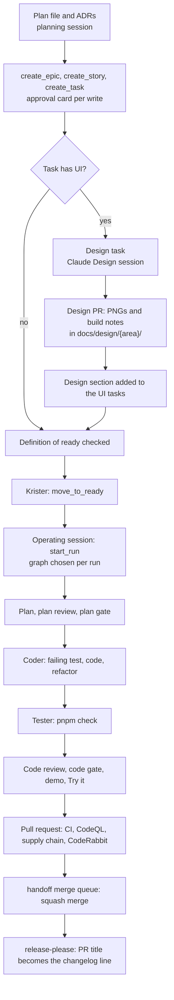
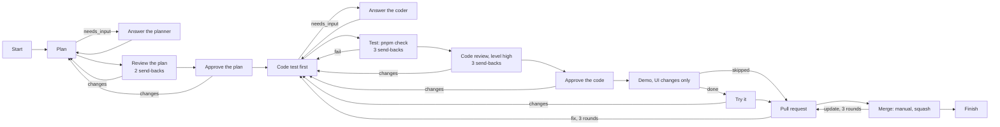
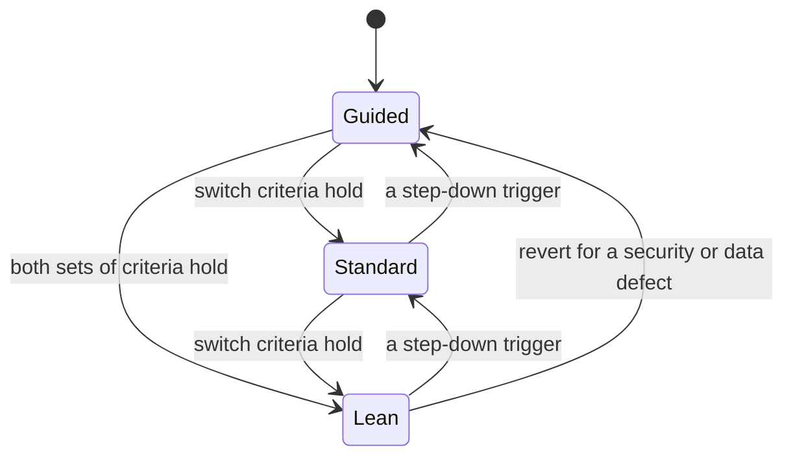

# Delivery and GitHub

This document says how NorthMES work moves from the plan to a released version. Work is shaped as GitHub issues (epics, stories and tasks) with the handoff plugin, and each task is one thin vertical slice that handoff builds test first in its own git worktree. The operating session picks the graph per run: the guided graph with human gates for the foundation, and the standard or lean graph for routine tasks once the measurable switch criteria in [docs/agents/handoff/README.md](../agents/handoff/README.md#switching-graphs) hold. handoff is the maintainer's workflow; contributors open issues with the GitHub issue forms and send pull requests. UI tasks start from a design approved in the Claude Design project and committed to `docs/design/`. GitHub checks every pull request with one CI gate, CodeQL, the supply chain jobs and CodeRabbit, and release-please turns squashed pull request titles into the changelog. The document covers the handoff configuration, the issue formats, labels and Project fields, the definitions of ready and done, the design workflow, the installed agent skills, the GitHub organization and repository setup, CI and its runners, the release process, the docs site at docs.northmes.dev and the community files with their contact addresses. A later session uses it to create the issues, and coding agents use it to know what a finished task looks like. When this document and an ADR disagree, the ADR holds and this document gets fixed.

## Decisions

| ADR | Status | What it decides for delivery |
|---|---|---|
| [0001](../adr/0001-record-architecture-decisions-in-madr.md) | accepted | ADRs in MADR, numbered by a script, and the rule that a task moves to Ready only when every linked ADR is accepted |
| [0049](../adr/0049-delivery-workflow-handoff-thin-vertical-slices-and-claude-design-per-task.md) | accepted | handoff on GitHub issues, thin vertical slices, Claude Design per task, the installed skills, the persona list, gate time measurement |
| [0063](../adr/0063-agent-skills-from-library-authors-pinned-in-the-repository.md) | accepted | Agent skills from library authors, pinned in the repository |
| [0050](../adr/0050-github-organization-rulesets-ci-runners-and-supply-chain.md) | accepted | The `northMES` organization, rulesets, CI runners, supply chain, agents on GitHub, the offline image bundle |
| [0065](../adr/0065-coderabbit-check-run-and-a-required-approval-on-main.md) | proposed | CodeRabbit's check run, and 1 required approval on `main` that CodeRabbit gives on Krister's pull requests |
| [0038](../adr/0038-versions-and-releases-lockstep-0-x-release-please-api-reports.md) | accepted | One version for everything, lockstep 0.x, release-please, API reports |
| [0048](../adr/0048-documentation-on-docs7-at-docs-northmes-dev.md) | accepted | The docs site on Docs7 at docs.northmes.dev, public names under northmes.dev, the mail addresses |
| [0041](../adr/0041-test-strategy-tdd-vitest-projects-testcontainers-and-playwright.md) | accepted | Test first, Vitest projects, Testcontainers and Playwright |
| [0042](../adr/0042-ai-in-tests-mocked-by-default-opt-in-live-runs.md) | accepted | Mocked AI by default, live runs only on request |
| [0058](../adr/0058-developer-environment-source-exports-one-stack-script-and-one-gate-command.md) | proposed | Source exports, one stack script for dev, demo and e2e, one gate command |
| [0022](../adr/0022-shared-building-blocks-packages-the-master-data-kit-settings-and-generators.md) | accepted | Shared packages, recipes per extension point, `pnpm gen:migration` |
| [0039](../adr/0039-license-agpl-3-0-or-later-core-and-a-contributor-license-agreement.md) | accepted | AGPL-3.0-or-later core and a contributor license agreement |
| [0040](../adr/0040-dependency-license-policy-ci-gate-and-sbom.md) | proposed | The dependency license gate and SBOMs |
| [0056](../adr/0056-mit-sdk-packages-the-extension-exception-and-the-trademark-policy.md) | proposed | MIT SDK packages, the extension exception, the trademark policy |
| [0055](../adr/0055-release-1-scope-under-option-b-and-the-scope-rule.md) | accepted | The scope rule and the velocity row that sets the pilot date |

## Who does what

| Actor | Does | Does not |
|---|---|---|
| Krister (the maintainer) | Accepts ADRs and scope; relays product owner answers; approves every shaping write (handoff shows an approval card); reviews and approves designs in Claude Design; moves tasks to Ready; answers the plan gate, question gates, permission requests, the code gate and Try it; decides repairs, loop resolutions and cancels; decides the disputed review comments the pull request step asks about, and resolves the review threads handoff leaves open; approves the pull requests that CodeRabbit skips (Renovate's and the release pull request); requests merges on the guided graph; decides each graph switch; merges the release pull request; runs the manual NVDA passes (on the board core, and before the pilot install) | Edit code inside a run's worktree |
| Planning session (interactive Claude Code in this repository) | Writes plan files and ADRs; creates issues with handoff's tools; adds story context and Design sections with `gh issue edit`; runs spikes; opens each epic's "docs: record the Enn plan and ADRs" pull request | Answer a gate for Krister |
| Design session (interactive Claude Code with the claude-design MCP) | Builds design pages, runs the verify and comment loops, opens the design pull request with PNGs and build notes | Work inside a handoff run |
| Operating session (interactive Claude Code with handoff's MCP tools) | Paces the work: picks the next Ready task without open blockers, starts its run with `start_run` and the chosen graph, follows run events, brings questions, permission requests, failures and merge decisions to Krister, checks that CodeRabbit reviewed each new commit (the pull request step asks for the review by itself through `reviewRequest`), checks the design etag before a UI task's run and at its plan gate | Answer a question, a permission request or a gate without Krister's decision |
| handoff agents (planner, plan reviewer, coder, code review, demo) | Run `claude -p` in a fresh worktree; read the task, its story and epic, the issue comments, `CLAUDE.md` with the `AGENTS.md` it imports, `.claude/rules`, the project's agent notes, their node instructions and the library skills; plan, write tests and code, review, demo | Run hooks, use the maintainer's MCP servers, fetch URLs, push, run `gh`, open issues, resolve review threads |
| handoff nodes without a model (Tester, pull request, merge) | Run the gate command; push and open the pull request with `Closes #N`; wait for CI and CodeRabbit; send failures and findings back to the coder; post the coder's answers to review comments, resolve their threads after the reviewer's next review and ask Krister about the disputed ones; merge through handoff's queue | Merge a guided run without Krister's request |
| Bots | CI on GitHub Actions, CodeQL, CodeRabbit, release-please, Renovate, Codecov, Socket, Scorecard | Merge |

## From plan to merged pull request



1. The planning session writes the story and its tasks into the epic's plan file with plan identifiers, and drafts any ADR the story needs from `docs/adr/template.md`. Each item of an ADR's Confirmation section becomes a line under Tests first or an acceptance criterion.
2. The same session creates the issues with handoff's tools, in dependency order, and adds the context the create tools cannot write (story context, Design sections) with `gh issue edit`. It writes the issue numbers back into the plan file and opens one docs pull request with the plan file and the ADRs; that pull request closes the epic's docs task.
3. For a story with UI, a design session builds the design pages; Krister reviews and approves them; the design pull request commits the approved PNGs and build notes and closes the design task, which unblocks the UI tasks.
4. Krister checks the definition of ready and moves the task to Ready.
5. The operating session starts the task's run with the graph for that task. The run plans one behaviour at a time, writes each failing test before its code, runs the gate command, reviews, demos UI changes and opens the pull request.
6. GitHub runs the required checks and CodeRabbit reviews. Failures and findings go back to the coder, and the pull request step posts the coder's answer to each finding and resolves its thread after CodeRabbit's next review.
7. handoff's merge queue squashes the pull request with its title as the commit subject, closes the task and sets it Done. On the guided graph this happens when Krister requests the merge.
8. release-please collects the squashed titles into the next release pull request, which Krister merges outside handoff.
9. Krister checks the story's criteria on `main` and closes the story. handoff closes tasks, never stories or epics.

## handoff configuration

handoff runs graphs of coding agents on GitHub issues. Its operational files live in [docs/agents/handoff/README.md](../agents/handoff/README.md) and the graph files in `docs/agents/handoff/graphs/`; this section states the configuration the plan depends on.

### Instance and workspace

- Worktree mode (`HANDOFF_WORKSPACE=worktree`). In Docker workspace mode the run's container has no Docker socket, so `@testcontainers/postgresql` cannot start a database there. Each agent step runs in a fresh git worktree on the run's branch.
- handoff's `.env` holds a classic `GITHUB_TOKEN` with the `project` scope, because a fine-grained token or a GitHub App cannot reach a user-owned Project, and `CLAUDE_CODE_OAUTH_TOKEN`. `HANDOFF_CAP_CLI=1` serializes Claude steps across all projects until the subscription's limits are known. Runs, design sessions and the operating session share one Claude subscription.
- The handoff dashboard, worker and database run on the maintainer's machine (`pnpm db:up`, `pnpm dev:web`, `pnpm dev:worker`), plus `pnpm dev:webhooks <owner>/NorthMES` while runs are active, so pull request steps hear about CI without polling. Every handoff MCP tool fails while the dashboard or its database is down; the operating session checks them before it starts.
- Docker Desktop runs on the machine. On another Docker runtime, the Tester's `passEnv` lists `DOCKER_HOST` and the Testcontainers socket override.
- The plan uses Flow mode: an order of tasks and their blockers, with no dates and no sizes.

### Project settings

| Setting | Value | Why |
|---|---|---|
| Setup command | `sh scripts/handoff/setup.sh`: `pnpm install --frozen-lockfile`, a pull of the pinned database image named in `infra/pg-image.json`, `playwright install chromium` | Runs once per worktree before the planner; nothing in it needs a database. The first image pull would otherwise count against the Tester timeout |
| Teardown command | empty | Ryuk removes Testcontainers containers |
| Agent notes | "Docker Desktop runs on this machine. Tests start their own Postgres with @testcontainers/postgresql through packages/testing, so runs need no shared test database and no .env. Run every command as pnpm or git from the repository root (root scripts, pnpm --filter or pnpm -C); any other command, docker included, waits for a person's permission. Port 3000 belongs to handoff; the app takes its port from PORT. Name anything you create outside the worktree after HANDOFF_RUN_SHORT. Put follow-ups in the pull request description. When a dependency you need was released within Renovate's minimumReleaseAge window, return needs_input." | Agents learn the environment from these notes, not from guessing. The handoff run rules live here and in the node instructions, never in `AGENTS.md` or `CLAUDE.md` |
| UI paths | `apps/web/**`, `modules/*/web/**`, `packages/ui/**`, `packages/web-sdk/**` | A server-only change that touches a `.tsx` test helper does not trigger a demo |
| Launch configuration | `.claude/launch.json` with `handoff-demo`: the one stack script ([ADR 0058](../adr/0058-developer-environment-source-exports-one-stack-script-and-one-gate-command.md)) starts a Testcontainers Postgres, migrates, seeds fictional demo data and serves the production build of role `all` on `$PORT` | One origin and one port per demo, so two runs' demos never claim the same remote ports |
| Demo seed command | `pnpm build` | The demo app must answer within 120 seconds of starting; the seed command has 10 minutes |
| Plan budget | 15 files and 12 steps | One task is one pull request; the plan reviewer's instructions in all three graphs name these numbers |
| Plan mode | Flow | Order and blockers only |

### What run agents see

- Only tracked files in their worktree. Research material, the spike scratchpad and files outside the repository do not exist for them, so every task brief and ADR carries the facts it needs, and code a task ports is first copied to `docs/sources/`.
- The repository's `CLAUDE.md` (which starts with `@AGENTS.md`), `.claude/CLAUDE.md` and `.claude/rules`. The maintainer's global rules and MCP servers do not load, so `AGENTS.md` carries the writing, scope and test rules itself. The gitignored `CLAUDE.local.md` with the maintainer's own instructions is not in the worktree; the handoff run rules reach agents through the project's agent notes and the node instructions.
- A context packet: the task, its story and epic as "Part of" context, the issue comments newest first, the acceptance criteria, the other active runs with their owned paths and handoff's open pull requests. Each body and the comments are cut at 4 000 characters.
- An allowed-tools list per node. A call outside it waits for a person for up to 30 minutes. Coders run `git` and `pnpm`, never `docker`.
- Claude Code hooks are off in every run step (`disableAllHooks`). Test first therefore comes from five places: the issue's Tests first section, the node instructions, the plan gate on the test list, the Tester, and the tests-changed check. Interactive sessions use hooks from `.claude/settings.json` (related tests after an edit, changed tests before stop, a block on snapshot updates).

### Library skills

The planner and the coder enable the library skills `tdd` and `codebase-design`, which also gives those nodes the Skill tool, and the MCP server `context7`, so they read current library documentation; the plan reviewer enables `context7` as well. The coder also enables `vitest`, `pnpm`, `turborepo`, `apollo-client` and `playwright-cli`, and the code review node enables `wrdn-authz` and `secret-serialization`. Each node names them under its `library` key in the graph files. Runs pass `--strict-mcp-config`, so a node has only the MCP servers its `library` key names. The library's `tdd` comes from `mattpocock/skills`, because handoff's import skips a skill whose name the library already holds from another source; the other skills of this repository are in the library group `northmes`, imported on 2026-10-05. The run configuration (`<HANDOFF_HOME>/claude-config/settings.json`) is to deny `Skill(grilling)` and `Skill(domain-modeling)`, which belong to interactive planning (E00-S07-T01). A node that names a skill or server the library lacks fails, so the project skills that E02 writes are imported before a graph names them.

### The graphs

Three graphs share the planner and coder instructions, the Tester and the pull request settings. Routine tasks start on the guided graph and move to the standard or lean graph when the measurable criteria hold; the standard graph is an optional middle rung, and tasks that stay guided keep the guided graph after a switch.

| Graph | Krister approves | Merge | Used for |
|---|---|---|---|
| `northmes-guided` | the plan, the code, Try it for UI changes, the merge | manual, on Krister's request | the foundation, new patterns, tasks labelled `human` |
| `northmes-standard` | the plan | automatic | the optional middle rung |
| `northmes-lean` | nothing by default | automatic, with a notification per merge | routine tasks once the switch criteria hold |

In every graph a person also steps in when an agent asks a question, when the pull request step asks about review comments it cannot settle, when a step fails or a loop runs out of rounds, and when a step asks permission for a tool call.



The guided graph, step by step:

| Step | Node type | What it does |
|---|---|---|
| Plan | `planner` | Plans one behaviour at a time: one step writes the failing test (file, test name, why it fails), the next makes it pass, a last step may refactor. Takes the tests from the issue's Tests first section and keeps the seam the issue names. Names the test for each acceptance criterion. Puts tests, migrations, generated files and the lockfile in the owned paths. Returns a question when neither the issue nor an ADR decides, or when readings of the issue differ materially; leaves the size proposal out |
| Answer the planner | `human_gate`, question | Krister's answer goes back to the planner |
| Review the plan | `reviewer` | Blocks code before its test, a step with two behaviours, a criterion without a test, a test at the wrong seam, a database test outside `packages/testing`, a conflict with a linked ADR, owned paths that miss a changed file, a step for behaviour the issue does not ask for, and a plan over budget that does not split |
| Approve the plan | `human_gate`, approval | Krister checks the test list, the seam, the owned paths and any proposed split. For a UI task the operating session first compares the approved etag in the Design section with the design project's current one |
| Code test first | `coder` | Commits each failing test with a `test:` subject, then the code, then refactors with the tests green. Contract checks after every attempt: `diff_within_paths` and `node scripts/handoff/tests-changed.mjs` |
| Answer the coder | `human_gate`, question | Krister answers the coder |
| Test | `tester` | `pnpm check`, 20 minute timeout, one retry for a flaky run |
| Code review | `code_review`, level high | Claude Code's code-review skill plus the NorthMES blocking rules below |
| Approve the code | `human_gate`, approval | Krister reads the diff with the findings. "Approve after fixes" sends chosen findings back and lets the fixed work through without a second code gate |
| Demo | `demo`, UI changes only | Starts `handoff-demo` and takes one screenshot per acceptance criterion; a browser console error fails it |
| Try it | `human_gate`, try | Krister marks each criterion as working or not in the running app, with a keyboard-only pass, both themes, and the design PNGs side by side |
| Pull request | `pr` | Pushes, opens the pull request with `Closes #N`, waits for CI and for a CodeRabbit review on the head commit (`waitForReviewers: ["coderabbitai[bot]"]`, `reviewTimeoutMinutes: 30`), sends failed job logs, unresolved threads, non-approval review summaries and the findings in CodeRabbit's summary comment back to the coder. With `reviewThreads: { "reply": true, "summary": "coderabbitai" }` it posts the coder's answer to each finding on GitHub, resolves the thread after CodeRabbit's next review, and asks Krister one question about the findings it cannot settle ([docs/agents/handoff/README.md](../agents/handoff/README.md#review-comments)). `noChecksAfterMinutes: 30`; `requireApproval` stays off: it would wait for an approval with no time limit, and the `main` ruleset already refuses a merge without one ([ADR 0065](../adr/0065-coderabbit-check-run-and-a-required-approval-on-main.md)) |
| Merge | `merge`, manual, squash | Waits in handoff's merge queue for Krister's request (dashboard or `request_merge`). A branch behind `main` or in conflict goes back to the pull request step, up to 3 times. Closes the task and sets Done |

The lean graph differs in these steps:

| Step | Lean graph |
|---|---|
| Review the plan | No plan gate follows, so the planner cannot split. The reviewer also blocks a plan over 15 files or 12 steps, a plan that needs a product, legal or design decision the issue does not record, and a plan that adds a pattern the issue and ADRs do not name |
| Code test first | Contract check `diff_within_paths` only; files declared in `extraPaths` with a reason pass, others raise a paths question |
| Tests came first | A `tester` node runs `node scripts/handoff/tests-changed.mjs`; a failure goes back to the coder up to 2 times |
| Test, code review | Up to 2 send-backs each. The code review knows nobody reviews after it, so each finding is blocking or follow_up |
| Demo | UI changes only; screenshots go into the pull request description. No Try it gate |
| Merge | Automatic squash merge when the pull request is first in the queue with CI green and no changes requested |

Code review blocking rules (every graph):

- a behaviour change without a test, or a test that would pass without the change;
- code committed before its failing test where the plan put the test first;
- a database test outside the Testcontainers harness in `packages/testing`, or one connected as a superuser;
- a new table without row-level security and split policies (`FOR SELECT` on read scopes; `FOR INSERT`, `FOR UPDATE` and `FOR DELETE` on write scopes; no `FOR ALL`; no `FORCE ROW LEVEL SECURITY` in release 1), or without the audit trigger or an allowlist entry with a reason ([ADR 0008](../adr/0008-row-level-security-with-transaction-local-scopes.md), [ADR 0013](../adr/0013-audit-trail-written-in-the-command-transaction.md));
- a write that bypasses the command pipeline ([ADR 0012](../adr/0012-commands-as-the-single-write-path.md));
- a module that reads another module's tables;
- a contributed GraphQL field that is not nullable, or a root field without the module prefix ([ADR 0015](../adr/0015-graphql-federation-inside-one-process-with-an-embedded-hive-gateway.md));
- a web remote that bundles its own copy of a shared singleton;
- an interactive element without an accessible name, state shown by color alone, or a color or size on a screen that is not a token ([ADR 0021](../adr/0021-accessibility-target-wcag-2-2-aa.md));
- a change that contradicts a linked ADR;
- an acceptance criterion the diff does not implement, or behaviour the issue did not ask for.

The tests-changed check (`scripts/handoff/tests-changed.mjs`) runs `git diff --name-only origin/main...HEAD` and exits 1 when a non-generated file under `modules/**`, `packages/**` or `examples/**` changed and no `*.test.ts`, `*.test.tsx`, `*.int.test.ts` or `*.test-d.ts` file did. Until E00-S06-T01 adds the script, the graphs run the check as `[ ! -f scripts/handoff/tests-changed.mjs ] || node scripts/handoff/tests-changed.mjs`; that task removes the guard. The Tester and the coder run `pnpm check`, the one gate command ([ADR 0058](../adr/0058-developer-environment-source-exports-one-stack-script-and-one-gate-command.md)): turbo lint and typecheck, `pnpm gen --check`, then `vitest run` over the unit, integration, web and types projects. `test/meta/gates.test.ts` fails when the Tester command in a committed graph file is anything else, or when a coder instruction does not name `pnpm check`. `pnpm test:handoff` stays only as an alias that runs `pnpm check`.

### Node instructions

The instructions in the graph nodes follow the Claude Opus 5 prompting guide:

- They are phrased as what to do, not as prohibitions.
- The planner and coder carry the scope rule: deliver what the issue asks, at the scope it intends; ask only when readings of the issue would lead to materially different work; note follow-ups (the planner in its plan, the coder in the pull request description).
- The subagent rule (delegate only large, independent work) reaches run agents through `AGENTS.md`; the coder has no Agent tool, so the node instructions say nothing about subagents.
- Written deliverables (plans, pull request descriptions, review reports) are as long as the substance needs.
- No instruction asks an agent to double-check or verify again; review is its own step in the graph.
- Review instructions ask the reviewer to report every finding with its severity and leave the filtering to the verdict step; they never ask for high-severity findings only.
- No instruction asks an agent to write out its reasoning.
- Each node sets its effort, which handoff supports on its Claude steps: planner high, plan review medium, coder xhigh on `northmes-guided` and high on the other graphs, code review medium, demo medium ([docs/agents/handoff/README.md](../agents/handoff/README.md#the-graphs)).

### Choosing the graph per run

handoff's scheduler is not used. The operating session paces the work, as [Pacing runs](../agents/handoff/README.md#pacing-runs) in the handoff notes describes:

1. It reads the plan (`list_plan`, `list_backlog`) and picks the next Ready task, in Project order, that has no open blocker. Tasks labelled `design` or `spike`, the E00 and E01 tasks, each epic's "docs: record the Enn plan and ADRs" task, and any other task whose issue says a person works it in a session go to Krister; the session starts no run for them.
2. It starts the run with `start_run({ issues: [n], graph: "<graph>" })` and always passes `graph`, because without it `start_run` reuses the graph of the project's latest run.
3. It follows the run (`get_run`, `get_run_events`, `list_attention`) and brings every question, paths question, permission request, failure, exhausted loop and merge decision to Krister. It answers a gate, a question or a permission request only with Krister's decision, and repairs, resolves or cancels a run only when Krister says so.
4. It keeps one run active at a time at first, and two after two runs have finished without a collision on owned paths.
5. It batches gate questions so Krister answers gates twice a day.

The graph ladder and the switch rule, with its measurable criteria, live in [docs/agents/handoff/README.md](../agents/handoff/README.md#switching-graphs), which holds when it and this section differ; the weekly log the criteria are measured against is in the same file. The summary below states what the plan depends on. A switch changes the graph the operating session passes to `start_run` for routine tasks; runs already going keep the graph they started with. Because the session picks the graph per run, foundation-sensitive tasks stay guided after a switch.

A task runs on `northmes-guided` whatever the current rung when it carries `human`, or when it:

- is the first task of a new pattern: a new module, a new kind of migration, the first screen of a new kind, a new shared package or dependency;
- builds on an ADR that is `proposed` or has an open needs-confirmation;
- needs a product owner, legal or design decision;
- touches authentication, row-level security policies or secrets handling;
- is a docs task for an epic, or changes shared files such as the root README.



A clean run is a run that merged with no repair, no cancel and no `resolve_loop`, where every gate it reached was answered approve at the first question ("approve after fixes" and changes count as requested changes; question gates do not count).

Guided to standard when all of these hold:

1. Epics E00, E01 and E02 (the walking skeleton) are closed.
2. Each core pattern is on `main`, built through a guided run at least once: a pure domain function with unit tests; a migration with row-level security, its policies and the audit trigger, with SQL-level tests in `packages/testing`; a command through the pipeline with an integration test on Testcontainers Postgres; a GraphQL field with resolver tests and the schema snapshot; a web remote screen with component tests, an end-to-end test and a passed Try it.
3. The last 10 guided runs in a row are clean.
4. Among the last 20 merged task pull requests: no revert, and at most 1 follow-up fix pull request (a `fix` pull request for a defect in a task merged in the 14 days before it).
5. `ci / gate` passed on every push to `main` in the last 14 days.
6. The weekly log holds the median gate minutes of the last 10 guided runs as the baseline.

Standard to lean when all of these hold:

1. The last 10 standard runs in a row are clean.
2. Criteria 4 and 5 above hold over the latest merges.
3. CodeRabbit reviews every pull request without anyone posting `@coderabbitai review` (the repository has 10 or more stars, or an automatic trigger has been checked on 5 pull requests), and the last 10 runs recorded no reviewer timeout.
4. Unresolved review threads do not block an automatic merge: CodeRabbit resolves its own threads after the coder's fix, checked on 5 pull requests, or the ruleset no longer requires thread resolution.
5. `ci / e2e` is a required check, since nobody tries UI changes by hand.

Step one rung down when a pull request merged by the standard or lean graph is reverted; when 2 follow-up fix pull requests land within 10 merged tasks; when `ci / gate` fails on `main` twice in one week; when 3 or more runs in one week stop on an exhausted loop; or when the weekly sample finds a broken NorthMES rule the code review missed. A revert caused by a security or data defect goes straight back to guided. On the standard and lean graphs Krister reads two of their merged pull requests a week, picked at random, plus every pull request that merged after a reviewer timeout. Each switch, in either direction, is Krister's decision and goes into the weekly log with its trigger; clean runs count again from the date of a step down.

### Measurements

Two weekly records exist:

- The velocity row in [README.md](README.md): merged tasks, the ledger days they earn as shares of their epics' estimates, the cumulative total against the 1x line, and, from the first handoff runs, median gate minutes per task and merged tasks per day. Stories and tasks carry no size. The checkpoints in [14-roadmap.md](14-roadmap.md) turn these rows into the pilot date ([ADR 0055](../adr/0055-release-1-scope-under-option-b-and-the-scope-rule.md)).
- The handoff weekly log in [docs/agents/handoff/README.md](../agents/handoff/README.md): graph in use, runs started, merged, failed and cancelled, merged tasks per working day, median run time, median gate minutes per run, clean run streak, requested changes, automatic rounds per loop, stops for a person, CodeRabbit reviews and reviewer timeouts, reverts and follow-up fixes, and the cost each run reports. The graph switches above are measured against it.

## Shaping the plan into issues

### Plan identifiers and files

- Epics are `E00`, `E01` and upward; stories `E02-S03`; tasks `E02-S03-T01`. Blockers name identifiers until the issues exist. The epic order and the first weeks are in [14-roadmap.md](14-roadmap.md).
- Each epic from E02 on gets one shaping file, `docs/plan/Enn-<slug>.md` (for example `E02-<slug>.md` or `E14-<slug>.md`), with its stories and tasks; the E00 and E01 tasks live in [14-roadmap.md](14-roadmap.md). After the issues exist, the issue number is written next to each identifier (`E02-S03-T01, #42`). From then on the issue is the source of truth for scope, and the shaping file is not edited again.
- Each epic has a task "docs: record the Enn plan and ADRs", labelled `human`, closed by the docs pull request that adds the shaping file and the epic's ADRs (`ci / linked issue` needs `Closes #N`).

### Conversion sequence

1. `list_github_projects`, then `setup_plan` once: it creates or adopts the plan Project under the repository's owner, the labels `epic`, `story` and `task`, and the Status options.
2. Per epic: `create_epic(title, goal)` with the epic body in `goal`.
3. Per story: `create_story(epic, title, acceptance[])`, then `gh issue edit` to put the story context above the criteria.
4. Per story with UI: a design task with `create_task`, labelled `design` and `human`.
5. Per task, in dependency order: `create_task(story, title, brief, acceptance[], blocked_by[])` without `size`. UI tasks are blocked by their design task.
6. `list_plan` to check the tree; `arrange_plan` to preview an order (it writes nothing); `set_order` to write it.
7. Krister calls `move_to_ready` (or moves the card) for tasks that meet the definition of ready.

Every write shows Krister an approval card. Issues are created and their plan fields changed only with handoff's tools; body text the create tools cannot write (story context, the Design section) is added with `gh issue edit` in the same interactive session. Run agents never open issues; they put follow-ups in the pull request description.

### Rules for every issue

- Title `<module>: <outcome>`, imperative, under 72 characters, using [GLOSSARY.md](../../GLOSSARY.md) terms. The pull request title is a different line (see [the changelog](#changelog-from-pull-request-titles)).
- The first line of the body is the plan identifier (`Plan: E02-S03-T01`).
- A task body stays under about 3 500 characters; agents see the first 4 000 characters of each body.
- Only the heading `## Acceptance criteria` contains the words "criteria", "acceptance" or "definition of done", and checkboxes appear only under it. handoff counts the checkboxes under that heading as the task's criteria; test lists elsewhere are plain bullets.
- Links point at repository paths. Agents cannot open claude.ai links, image links or other URLs.
- Comments are scope: agents read them. Gate decisions and "reuse this branch" notes go into comments, so a later run sees them; "read these notes" lines do not.
- No customer names, organisation numbers, real order data or legal material appear in an issue. Fixtures and examples use fictional data.

### Epic

Created with `create_epic(title, goal)`; everything below goes into `goal`. Labels: `epic`, one `area:` label. An epic never runs.

```markdown
Plan: E03
Goal: two to four sentences: the outcome, and why release 1 needs it.
Who it is for: Planner. Also: Plant admin.
Outcome (plain bullets): what is true when every story is done.
ADRs: docs/adr/0027-planned-duration-formula-and-override-precedence.md, docs/adr/0057-scheduling-domain-as-a-pure-package-in-the-planning-module.md
Out of scope: ...
```

### Story

Created with `create_story(epic, title, acceptance[])`; the context above the criteria is added with `gh issue edit`. Under about 3 500 characters, because every task's agents read it as "Part of" context; agents see the first 4 000.

```markdown
Plan: E03-S02
As a planner, I see each job order's planned length computed from its quantity, its rates and the plant calendar.
Who it is for: Planner.
Module: planning
ADRs: docs/adr/0027-planned-duration-formula-and-override-precedence.md
Design: no UI

## Acceptance criteria
- [ ] ...
```

"Who it is for" names a persona from the persona list in [README.md](README.md): Planner, Operator, Plant admin, Plugin developer, Maintainer, Hosting partner.

### Task

Created with `create_task(story, title, brief, acceptance[], blocked_by[])`. The brief is everything above the criteria. Labels: `task`, one `area:` label, `human` when it must stay guided or a person acts first.

```markdown
Plan: E03-S02-T01

## Goal
Compute the run seconds of a job order from its quantity and frozen rates, so autoplan, the board and the late-order facts use one rule.

## Where in the code
modules/planning/domain: duration.ts (new), duration.test.ts (new)
Seam: pure function runSecondsFor(n, rates) in @northmes/planning-domain; no Nest, no database, no process.env.

## Tests first
- duration.test.ts: "rounds a partial cycle up to a whole cycle" (TC1)
- duration.test.ts: "gives zero run seconds for quantity 0"
- duration.test.ts: "divides by the planning factor and never the retool time"

## Design
none

## ADRs
docs/adr/0027-planned-duration-formula-and-override-precedence.md (its Confirmation items are in the tests above)

## Out of scope
Override precedence between tool and operation equipment (E03-S02-T02).

## Changelog
none, internal

## Acceptance criteria
- [ ] runSecondsFor follows the formula in ADR 0027 for every case in Tests first
- [ ] The domain package imports nothing from Nest, Kysely, pg or process.env (lint test green)
- [ ] ...
```

Rules for the task text:

- "Seam" names the interface the tests drive. It counts as agreed with Krister, so the `tdd` skill does not stop to ask about it. SQL-level tests of row-level security policies, constraints and the catalog are their own seam through `packages/testing`.
- Tests first names test files and test names. Each test carries its requirement id (rule 19 in [15-regulated-readiness.md](15-regulated-readiness.md)). Until the maintainer fixes the format, a test name starts with the plan case id when one exists (TC1, CAL8) and otherwise with the story's plan id (E07-S05).
- 3 to 8 acceptance criteria, each checkable by a person in the running app, or for a task without UI by the reviewer from the tests and the diff.
- Changelog holds the future pull request title as a Conventional Commit for users, or "none, internal".

### Design task

Created with `create_task` under the story, labelled `design` and `human`. Worked in a design session, closed by the design pull request.

```markdown
Plan: E08-S02-T01
Owning story: #38. UI tasks waiting on this: #43, #44.
Page: planning/planning-38-board.dc.html (variations page first: yes)

## Frames
- States: populated, empty, loading, error; domain states: committed, in my draft, held by another planner, hard-locked, started, proposed, conflict, late, overdue, finish pending, material warning
- Widths: 1280, 1440, 1920; 320 reflow
- Themes: light, dark; one frame with long German or Finnish labels
- Keyboard and focus frames

## Build notes needed
shadcn components by name, tokens, keyboard and focus order, ARIA roles, names and announcements, slot ids, final English copy, WCAG 2.2 criteria by number

## References
docs/adr/0021-accessibility-target-wcag-2-2-aa.md, docs/adr/0030-a-planning-board-built-in-house.md; earlier pages: shell/shell-12-navigation.dc.html

## Output
docs/design/planning/planning-38-board.md and its PNGs; Design section on #43 and #44

## Acceptance criteria
- [ ] Every frame in the list exists in light and dark
- [ ] No comment thread on the page is open
- [ ] Krister approved the page and the design project's README row holds the etag
- [ ] The design pull request with PNGs and build notes is merged
- [ ] #43 and #44 carry the Design section
```

### Spike

Created with `create_task` under the spike story of the epic it de-risks, labelled `spike` and `human`. Worked in an interactive session; spike code stays off `main`. Closed by the pull request that adds or updates the ADR.

```markdown
Plan: E01-S04-T01
Question: does the in-house board keep 60 fps while scrolling at day zoom with max(2 x weekly job orders x 8 weeks, 5 000) blocks on 60 rows, on the planner-class PC?
Decision that waits: docs/adr/0030-a-planning-board-built-in-house.md
Timebox: one week
Method: headless board core fed through Apollo from a mocked schema; one run with the Temporal polyfill forced
Pass: 60 fps scrolling at day zoom; p95 frame time at most 33 ms while dragging at week zoom; no long task over 50 ms; keyboard move mode steps one snap and one machine
Output: the ADR with the measured numbers and the verdict
Out of scope: production code on main

## Acceptance criteria
- [ ] The ADR records the result, the numbers and the chosen path
- [ ] Follow-up tasks exist in Shaping, or the fallback is named
```

### Bug

A public report arrives through the bug report form (labels `bug`, `needs triage`). After triage the planning session rewrites the body into the shape below and calls `plan_issue(issue, story)`, which adds the `task` label and the sub-issue link. A bug found in a run, at Try it or on `main` is created with `create_task` directly.

```markdown
Plan: E07-S03-T07
What happens: ...
What should happen: ...
Steps: with the demo seed, ...
Version: commit or release; browser if UI

## Tests first
- <file>: "<name of the test that fails today>"

## Where in the code
suspected files

## Changelog
fix(planning): ...

## Acceptance criteria
- [ ] The regression test fails before the fix and passes after it
- [ ] ...
```

## Labels and Project fields

| Label | Set by | Meaning |
|---|---|---|
| `epic`, `story`, `task` | handoff (`setup_plan`, the create tools) | The kind of plan item. Only open `task` issues in Ready run |
| `human` | Planning session or Krister | Runs only on the guided graph, or is worked by a person in a session (design, spike, the epic's plan docs task, E00 and E01 work) |
| `design`, `spike` | Planning session | The kind of a `human` task |
| `bug`, `enhancement`, `documentation`, `good first issue` | GitHub defaults, issue forms | |
| `accessibility` | Issue forms, sessions | Accessibility work and reports |
| `needs triage`, `plugin request` | Issue forms | Public intake |
| `breaking change`, `security` | Sessions | Public hardening work; vulnerabilities go through private reporting instead |
| `dependencies` | Renovate | Dependency update pull requests |
| `area: planning`, `area: core`, `area: sdk`, `area: web`, `area: docs`, `area: deploy`, `area: ci` | Sessions | One per issue; one more per module as modules start (for example `area: pyramid-connector`, `area: production-start`, `area: ai`) |
| `autorelease: pending`, `autorelease: tagged` | release-please | |

The label list lives in `scripts/labels.sh` (`gh label create --force`), so the organization repository gets the same set.

| Project field | Use |
|---|---|
| Status: Shaping, Ready, Running, In review, Done | Everything starts in Shaping. Only Krister moves a task to Ready. handoff sets Running when a run starts, In review when the pull request opens and Done when it merges; a cancelled run puts the task back |
| Size | Present (`setup_plan` adds it) and left empty. handoff draws every card without a size at the same default length in the Flow view; a running card fills with the share of its graph's steps that have passed |
| Start, Target, Estimate | Not used; they belong to Timeline mode |
| Priority | Not used; the order is Project order |
| Milestone | One per release (`Release 1` for release 1), set on the epic; its stories and tasks inherit it in handoff ([handoff notes](../agents/handoff/README.md#the-plan)) |

Issue types and issue fields are not used for planning; they would store the labels' facts a second time.

## Thin vertical slices

A story splits into tasks that each deliver one small behaviour end to end: the migration, the command, the GraphQL field, the screen state and their tests, as far as that behaviour needs them, inside the plan budget of 15 files and 12 steps. A task never covers one layer for a whole story.

Worked example, story "Plant admin maintains equipment groups" after the master-data kit exists:

| Task | Behaviour | Layers it touches |
|---|---|---|
| `core: create an equipment group at company or plant scope` | An admin creates a group and sees it | migration with row-level security and the audit trigger, the create command through the pipeline, the prefixed mutation, the form state, SQL-level, integration and component tests |
| `core: list equipment groups with search and filter` | An admin finds a group | the list declaration, the connection field, the `DataTable` screen state, resolver and component tests |
| `core: refuse a plant code that clashes with a company code` | A clash shows as a field error | the exclusion constraint test, the error mapping, the form's field error, integration and component tests |
| `core: archive an equipment group` | Archived groups leave the list unless `includeArchived` is set | the archive command, the list argument, the screen action, tests |

The layer split it replaces (one migration task, one command task, one GraphQL task, one screen task for the whole story) is not used.

Further rules:

- A change to a shared package is its own task and pull request, ordered before the module tasks that use it ([ADR 0022](../adr/0022-shared-building-blocks-packages-the-master-data-kit-settings-and-generators.md)).
- Adding a dependency is its own task, reviewed by Krister. Run agents never add a dependency released within Renovate's `minimumReleaseAge` window; they return a question instead ([ADR 0050](../adr/0050-github-organization-rulesets-ci-runners-and-supply-chain.md)).
- Tasks that change a hot file are ordered with `blocked_by`: the lockfile, committed schema snapshots, generated files, root configs and shared docs. On a conflict in a generated file the coder runs `pnpm gen` (or the file's own command) instead of merging by hand.
- Docs per task: the module's own docs, regenerated reference files, and a recipe plus reference when the task changes an extension point (the files to write, the commands to run, each boot or composition error with its meaning). User guides and other shared docs go into one docs task at the end of each epic, run alone on the guided graph.
- The coder keeps a refactor step after green ([ADR 0041](../adr/0041-test-strategy-tdd-vitest-projects-testcontainers-and-playwright.md)).

## Definition of ready

A task moves to Ready when all of these hold:

1. The body follows the task template, stays under about 3 500 characters and has 3 to 8 criteria under `## Acceptance criteria`.
2. Tests first names test files and test names at a named seam.
3. Every linked ADR is on `main` with status `accepted` and no open needs-confirmation ([ADR 0001](../adr/0001-record-architecture-decisions-in-madr.md)).
4. Every file the task refers to is in the repository. Code a task ports from a spike is first copied to `docs/sources/` by a session.
5. Blockers are closed, or set as `blocked_by`.
6. For a UI task: its design task is closed, the PNGs and build notes are in `docs/design/<area>/` on `main`, the Design section names the approved etag, and the etag still matches the design project.
7. The plan fits the budget of 15 files and 12 steps, or the task is split before it moves.
8. A task that changes a hot file is ordered with `blocked_by` against other tasks that change it.
9. Answers the task needs from the product owner or from legal review are recorded in the issue, or the task carries `human`.

## Definition of done

Task, checked at the code gate, at Try it and on the pull request:

1. Every acceptance criterion holds: at Try it for UI tasks, at the code gate (or by the code review on the lean graph) for the rest.
2. The tests came first: a `test:` commit before the code on the branch, one named test per criterion, the tests-changed check passed.
3. `pnpm check` passed in the run and the required checks passed on the pull request. `ci / e2e` shows no new failure.
4. No blocking review finding is open; other findings are fixed or listed in the pull request description; CodeRabbit findings are answered and their threads resolved.
5. For UI: matches the design frames in light and dark at the frame widths; Biome's accessibility rules are clean; axe route checks and keyboard flows for the touched routes pass; 320 px reflow works; the console shows no errors.
6. For data: migrations are forward-only and carry their expand or contract marker; a new table has row-level security with split policies (no `FORCE` in release 1), the audit trigger or an allowlist entry with a reason; tests connect as `nm_app`; a new command runs through the command pipeline and writes an audit row.
7. For GraphQL: snapshots regenerated; root fields carry the module prefix; contributed fields are nullable; a breaking change has `!` in the pull request title.
8. Docs updated as the slice rules say.
9. The pull request title is the changelog line, the description states the validation impact (none, UI only, records, security, calculation, data migration), and the pull request is squash-merged through handoff's queue; the issue is closed and Done.

Story: every task is Done; Krister has checked the story's criteria on `main`; the design project's README marks its pages implemented.

Epic: every story is closed; the epic's docs task is merged (user guides, upgrade notes for any breaking change); ADR statuses are current; issue numbers are written into the shaping file.

## Claude Design per task

UI work starts from a design in the NorthMES project in Claude Design. Mockups are made one task at a time, between `create_task` and `move_to_ready`, in design sessions outside handoff runs; run agents have no access to Claude Design ([ADR 0049](../adr/0049-delivery-workflow-handoff-thin-vertical-slices-and-claude-design-per-task.md)). The page contents and the design order are specified in [06-web-and-ux.md](06-web-and-ux.md#claude-design-per-task); this section covers the delivery side.

### Order

1. D1 tokens and contrast: the token base (shadcn neutral with the contrast fixes in 06), the order palette, state markers, the focus ring, fonts and icons, the components in every state. The design project uses no bound design system.
2. D2 shell and navigation, including the station frame.
3. D3 planning board and D4 operator station, in either order once D2 is approved. New kinds of screens get a variations page first.
4. The canonical list and form page for core master data.

After these, a design is made only when the next task needs it. Design sessions and handoff runs can run side by side; both use the same Claude subscription.

### Steps for one page

1. The design session reads the issue and the design project's `README.md` (the rules and the index of pages), then builds the page `<area>-<issue>-<slug>.dc.html` in its area folder and adds the page's row to the README index. The area folder is `ui/`, `shell/` or the module id's folder, which the module's first page creates ([06, What every design page contains](06-web-and-ux.md#what-every-design-page-contains)). The page has a header frame first, then the states, widths, themes, long-strings frame, keyboard and focus frames and the build notes. It runs the verify loop: rendered, console clean, no failed requests, screenshots looked at.
2. Krister reviews in the Claude Design app with pin comments and sends the ones to act on to Claude. The session reads the queued comments, edits with the file's etag, re-renders and acknowledges them.
3. A page is ready for approval when no comment thread is open. Krister approves it.
4. The session records the approval: the etag in the design project's README row; PNGs of each frame in light and dark at the frame's width; the build notes. A design pull request adds `docs/design/<area>/<page-slug>.md` (page name, approved etag, frames, build notes) and the PNGs as `docs/design/<area>/<page-slug>-<frame>-<theme>.png`, and closes the design task.
5. The session adds a Design section to each UI task with `gh issue edit`: the page, the approved etag, the frames the task implements, the repository paths of the PNGs and build notes, and the two to five build notes that matter for that task. The section embeds the PNGs of those frames as images, from their raw GitHub URLs on `main`, so the issue shows what the task builds. The story that owns the screen embeds its main frames the same way, and the epic does when the screen is its main one. A chosen direction from a variations round is recorded the same way: its frames go into `docs/design/<area>/` next to a short decision record, and the design task embeds them. Frames of an approved page or a chosen direction are embedded from their files in `docs/design/<area>/` on `main`, so the issue and the repository record show the same images. A screenshot that has no record, such as a work-in-progress frame, can be attached with `gh issue edit --attach`.
6. After the implementing pull request merges, the README row says "implemented in PR #n".

An approved page is frozen. A later change copies it under a new issue number, and the README marks the old page superseded.

### What the implementing agent does with a design

- Reads the Design section, the PNGs and `docs/design/<area>/<page-slug>.md` from the worktree.
- Takes the layout, region order, states and their transitions (one test per state), copy text verbatim, the keyboard model and slot placements.
- Rebuilds everything with `@northmes/ui` components and token utilities; takes no markup, class names, inline styles, token values, canvas icons or demo numbers. A value on the page that is not a token is a question at the question gate.
- Leaves out controls that lead nowhere in this task and names them in the pull request.
- Follows the accessibility rules where they and the design disagree; the design is then fixed in a new page version.

### Drift checks

| Drift | Check | When |
|---|---|---|
| The design changed after approval | The operating session compares the approved etag with the design project's current etag; on a mismatch Krister decides whether the new version is approved | Before `move_to_ready`, before `start_run` and at the plan gate |
| Code against design | A criterion "matches `<page>` frames in light and dark at the frame widths"; demo screenshots per criterion; Try it with the PNGs side by side | Demo and Try it |
| Tokens in the design against `packages/ui` | The design project's `ui/tokens.css` names its source commit; a pull request that changes tokens is not done until a design session copies the new token blocks | Every token pull request |

## Agent skills in the repository

Skills are installed in `.claude/skills`, pinned by commit in `skills-lock.json`, with each source's license reproduced in `.claude/skills/THIRD_PARTY_LICENSE.md` ([ADR 0049](../adr/0049-delivery-workflow-handoff-thin-vertical-slices-and-claude-design-per-task.md), [ADR 0063](../adr/0063-agent-skills-from-library-authors-pinned-in-the-repository.md)). Ten come from `mattpocock/skills` at `24fe0ef`. Eight more were added on 2026-10-05 after a license and fit review against the ADRs ([ADR 0063](../adr/0063-agent-skills-from-library-authors-pinned-in-the-repository.md)). `.claude/settings.json` denies `npm` and `npx`, which `apollo-client` and `playwright-cli` pre-approve, and `CLAUDE.md` says that an ADR wins where a skill's example differs.

| Skill | Invoked by | Used in |
|---|---|---|
| `tdd` | model | Every handoff run (planner and coder, through the library group) and interactive spikes. The task's Seam line settles the seam |
| `codebase-design` | model | Called by `tdd`; the vocabulary for the Seam line. Planner and coder, through the library group |
| `grilling` | model | The interview engine behind `grill-me` and `grill-with-docs`; planning sessions only, denied in runs |
| `grill-me` | user | Stress-testing a plan item, an epic or a product owner rule before shaping |
| `grill-with-docs` | user | Planning a story or an ADR draft; settles terms into `GLOSSARY.md` and drafts ADRs |
| `domain-modeling` | model | Called by `grill-with-docs`; keeps `GLOSSARY.md` and offers ADRs in the format of [docs/agents/domain.md](../agents/domain.md); denied in runs |
| `writing-for-agents` | model | `CLAUDE.md`, `AGENTS.md`, node instructions, project skills and task briefs |
| `to-questionnaire` | user | One questionnaire per person for questions only they can answer; its output files are gitignored |
| `wait-what` | user | Re-states the last reply in plain English with glossary terms |
| `improve-codebase-architecture` | user | Interactive sessions only, once two or more modules have weeks of history on `main` |
| `vitest` (antfu/skills) | model | Coder; Vitest 5 configuration, projects and fixtures |
| `pnpm` (antfu/skills) | model | Coder; pnpm 12 settings in `pnpm-workspace.yaml`, catalogs and `allowBuilds`. ADRs 0004 and 0050 win over its CI and Docker examples |
| `turborepo` (vercel/turborepo) | model | Coder; reads the docs that ship in `node_modules/turbo` for the installed version |
| `apollo-client` (apollographql/skills) | model | Coder on web packages; Apollo Client 4 imports, data masking and preloading. The session cookie of ADR 0011 wins over its bearer-token example |
| `playwright-cli` (microsoft/playwright-cli) | model | Coder, for end-to-end specs and for checking a built UI, run as `pnpm exec playwright` |
| `wrdn-authz` (getsentry/warden-skills) | model | Code review; authorization defects in resolvers, commands, guards and tools. Row-level security scopes count as tenant scoping |
| `secret-serialization` (getsentry/skills) | model | Code review; secrets that reach logs, errors, spans or serialized config |
| `diagnosing-bugs` (mattpocock/skills) | model | Interactive sessions for bugs and regressions; on the coder only for a bug-fix task |

Not installed: `code-review` (it would replace the built-in skill handoff's code review node calls), `handoff` (a name clash with the plugin), `to-spec`, `to-tickets`, `implement`, `implement-spec`, `wayfinder`, `triage` and `setup-matt-pocock-skills` (they create issues or run work outside handoff's Project and runs).

Project skills, written by the tasks that build each extension point: the E02 tasks write `db-test` (the Testcontainers harness, `given` factories, two-instance helpers), `vertical-slice` (how a story splits into tasks), `graphql-subgraph` (`defineSubgraph`, prefix and nullability rules, schema print and codegen) and `web-remote` (the remote config factory, singletons, typed documents, slots), and `dst-test` (the Stockholm and Helsinki daylight saving nights and a non-UTC `TZ`) comes with [E03-S01](14-roadmap.md#e03-s01-contracts-resolve-plant-wall-clock-times-and-work-in-time-windows). Each is NorthMES's own file at `.claude/skills/<name>/SKILL.md`, with no `skills-lock.json` entry and no section in `THIRD_PARTY_LICENSE.md`, because those pin and license the third-party skills ([ADR 0063](../adr/0063-agent-skills-from-library-authors-pinned-in-the-repository.md)). The skills check in `test/meta/agent-files.test.ts` compares `skills-lock.json` with the pinned skills and accepts these five names as project skills; E02-S02-T07, which writes `db-test`, adds that rule. Each joins the `northmes` library group when it lands.

TanStack Table v9 ships its own skills inside `@tanstack/table-core` and `@tanstack/react-table`; agents read them from `node_modules`, because their names collide in one folder and the installed copy matches the installed version. Reviewed on 2026-10-05 and left out, because they contradict ADRs, lack a license or add little to the ADRs and Context7: supabase-postgres-best-practices, apollo-federation, graphql-schema, the TanStack Router skills, shadcn, react-hook-form, kysely-postgres, ai-sdk, the Better Auth and Module Federation skills (no license), and the third-party NestJS, Zod, pg-boss, Docker and accessibility skills.

A pin moves only after reading the skills' changelog between the two commits, reviewing the diff under `.claude/skills` and running the user-level `skill-scanner` skill (getsentry/skills) over the changed folders.

## Repository rules for agents

- The instruction files are layered for an open source repository. `AGENTS.md` holds the tool-neutral rules for any contributor's agent: the working, scope, subagent and writing rules, and the rule that every command runs as `pnpm` or `git` from the repository root (root scripts, `pnpm --filter` or `pnpm -C`, never `cd`) ([ADR 0058](../adr/0058-developer-environment-source-exports-one-stack-script-and-one-gate-command.md)). `CLAUDE.md` starts with `@AGENTS.md` and adds only a short note on the installed skills. Neither file mentions handoff. Maintainer-only instructions are private and load through the gitignored `CLAUDE.local.md`. The handoff run rules live in handoff's project agent notes and the graph node instructions.
- `docs/agents/domain.md` sets the ADR format and the glossary rules; `docs/agents/issue-tracker.md` sets how issues are created; `docs/agents/coderabbit.md` describes the CodeRabbit setup.
- People and interactive sessions open an issue before a change; contributors use the GitHub issue forms and send pull requests. Run agents put follow-ups in the pull request description.
- ADR numbers come from the ADR numbering script, never from scanning `docs/adr/`. Until the script exists, the planning session numbers ADRs by hand from `docs/adr/README.md`. A new ADR has status `proposed`; only Krister sets `accepted`.
- Generated files (schema snapshots, link snapshots, `*.gen.*` files, the lockfile) are rebuilt with the command that owns them, also when resolving a merge conflict. Generated paths are marked `linguist-generated` in `.gitattributes`.
- Meta tests keep the rules true: `test/meta/gates.test.ts` (every CI gate step runs a script that `pnpm check` or `pnpm check:full` contains; the handoff Tester runs `pnpm check`; root scripts only), `test/meta/doc-links.test.ts` (a relative Markdown link in `docs/plan`, `docs/adr`, `docs/agents` or `GLOSSARY.md` must point at a file `git ls-files` lists, no Markdown link may point into the private research folder, and a backticked repository path in `AGENTS.md`, `CLAUDE.md` or `docs/agents` must exist in `git ls-files` or be on the test's list of planned paths, each of which names the task that creates it; backticked paths in `docs/plan` and `docs/adr` name files later tasks create and are not checked), `test/meta/collection.test.ts` (every test file belongs to exactly one Vitest project).

## GitHub organization and repository

### Organization and the move

- The public repository is `github.com/northmes/northmes` (transferred from the maintainer's personal account and renamed on 2026-10-05). The GitHub organization `northMES` exists on the Free plan, with northmes.dev verified; the npm organization `northmes` holds the `@northmes` scope.
- Status on 2026-10-05: these accounts are set up: the GitHub organization `northMES` with CodeRabbit installed, the npm organization `northmes`, the Docker Hub namespace `northmes`, the public mailboxes on northmes.dev (security@, conduct@, legal@, privacy@ and support@, see [Community files and contact addresses](#community-files-and-contact-addresses)), two-factor sign-in on every account, a private companion repository for maintainer material, and the sandbox organization `northmes-sandbox` for tool tests. Spike SP0 is done: handoff's GitHub organization support is built and was checked in the sandbox organization.
- The repository is in the organization. `add_project` targets `northmes/northmes` directly, `setup_plan` creates or adopts the plan Project under the organization, and `pnpm dev:webhooks northmes/northmes` relays the repository's events; if handoff already holds the project under the old owner, `pnpm handoff project move` updates it in place of `add_project`, and `setup_plan` with `copy_from` set to the old Project's owner and number copies the plan's items ([docs/agents/handoff/README.md](../agents/handoff/README.md#before-the-first-run)).
- The move happens before the first image is pushed to GHCR, because a GHCR package stays with the account that pushed it. Images are published as `ghcr.io/northmes/<image>` with the `org.opencontainers.image.source` label set before the first push and public visibility after it.
- Organization settings: approval required for all external contributors' workflows; actions must be pinned to a full-length commit SHA; a second owner account kept for recovery.
- Waiting until later: Discussions, the organization `.github` repository with default community files, a dev container, per-module CODEOWNERS with teams, Sponsors and the public demo installation.

### Repository settings

- Merge methods: squash only, with the pull request title as the commit subject and a blank commit body. Auto-merge off.
- Secret scanning and push protection on. Dependabot alerts on; Dependabot security updates off, so Renovate and Dependabot do not open the same fix.
- Private vulnerability reporting on, with a `.github/VULNERABILITY_REPORT.yml` form and the CWE field required.
- CodeQL default setup for `actions` and `javascript-typescript`.
- Immutable releases on from the first release tag.
- `pnpm-workspace.yaml` sets `pmOnFail: ignore`, so the lockfile stays one YAML document and GitHub's dependency graph can read it. After the first push, check that the dependency graph lists the packages.
- A `release` environment with Krister as required reviewer, "Prevent self-review" off (one maintainer must approve their own runs) and administrator bypass off.
- `CODEOWNERS`: `* @Krister-Johansson`. Code owner review is not required, because a maintainer cannot approve their own pull request.
- Signed commits stay off until every agent path signs. GitHub's merge queue stays off: handoff's queue with strict required checks merges one up-to-date pull request at a time.

### Rulesets

Branch ruleset on `main`:

- Pull request required, 1 approving review, stale approvals dismissed on push, review threads must be resolved ([ADR 0065](../adr/0065-coderabbit-check-run-and-a-required-approval-on-main.md)). CodeRabbit gives the approval on pull requests that handoff or a session opens with Krister's token, since GitHub does not let Krister approve them; `@coderabbitai approve` is the fallback. Krister approves Renovate's pull requests and the release pull request, which CodeRabbit skips.
- Squash merge only; linear history.
- Required status checks, strict (branch up to date): `ci / lint`, `ci / typecheck`, `ci / build`, `ci / test`, `ci / pr title`, `ci / linked issue` and `ci / gate` from the GitHub Actions app ([ADR 0069](../adr/0069-require-each-ci-job-as-a-status-check-on-main.md)), `license gate`, `dependency audit`, `CodeQL`.
- Block force pushes and deletion.
- No bypass actors.

Tag ruleset on `v*`: blocks deletion and updates, allows creation (release-please creates tags).

Required workflows have no `on.paths` filter, because a workflow skipped by a path filter leaves its required check waiting forever; a job that should run only for some paths decides in its first step.

### Agents on GitHub

- An agent merges only when the maintainer asks: Krister's request on the guided graph, or the automatic merge of the standard or lean graph, which the operating session uses only after Krister has switched routine tasks to it ([ADR 0050](../adr/0050-github-organization-rulesets-ci-runners-and-supply-chain.md)).
- The Claude Code Action (`@claude` on issues and pull requests, and scheduled prompts) runs as a custom GitHub App with only Contents, Issues and Pull requests permissions, with a turn limit, a job timeout and a concurrency group.
- Actions execution policies let only the owner start the release and image workflows by `workflow_dispatch`.
- Public issues and their comments are untrusted input for any agent.
- No workflow uses `pull_request_target`.

## CI

All workflows set `permissions: contents: read` at the top and raise permissions per job; every action is pinned by full commit SHA with the version in a comment; checkouts set `persist-credentials: false`; event values are never interpolated straight into run scripts.

### Workflows and jobs

| Workflow and job | Trigger | Runs |
|---|---|---|
| `ci.yml` `ci / lint` | pull request, push to `main` | `pnpm install --frozen-lockfile`; turbo lint (Biome in CI mode, the import rules that keep MIT packages free of AGPL code); `pnpm gen --check` |
| `ci.yml` `ci / typecheck` | pull request, push to `main` | `pnpm install --frozen-lockfile`; turbo typecheck (`tsc`) |
| `ci.yml` `ci / build` | pull request, push to `main` | `pnpm install --frozen-lockfile`; turbo build |
| `ci.yml` `ci / test` | pull request, push to `main` | The UTC leg: Vitest unit, integration, web and types projects with Testcontainers Postgres on the pinned image; coverage; Codecov upload. Then, in the same job and also after a failed UTC leg, the Europe/Stockholm leg: the unit and integration projects with Node and Postgres in Europe/Stockholm, plus the hostile leg (server zone Pacific/Chatham) and the forced-polyfill Temporal project |
| `ci.yml` `ci / e2e` | pull request, push to `main` | Build, `playwright install --with-deps chromium`, Playwright against the built `all` process; traces on failure. Includes `e2e/skeleton.spec.ts` |
| `ci.yml` `ci / a11y` | pull request, push to `main` | axe over the board states; a separate job from the first board pull request ([ADR 0021](../adr/0021-accessibility-target-wcag-2-2-aa.md)) |
| `ci.yml` `ci / docs` | pull request, push to `main` | `pnpm docs:generate`, then `git diff --exit-code -- apps/docs` and `git status --porcelain apps/docs` |
| `ci.yml` `ci / linked issue` | pull request | A linked issue with `Closes #N`; Renovate and release pull requests exempt |
| `ci.yml` `ci / pr title` | pull request | The title is a Conventional Commit with an allowed type |
| `ci.yml` `ci / cla` | pull request | The contributor license agreement check, before the first outside pull request |
| `ci.yml` `fresh-worktree` | pull request | `git worktree add`, `pnpm install --frozen-lockfile`, `pnpm test:int` with no build step |
| `ci.yml` `plugin-outside` | pull request, push to `main` | Packs the MIT packages, installs an example plugin from the tarballs outside the repository, builds it, drops it into a plugins directory, boots and runs its e2e spec |
| `ci.yml` `ci / gate` | pull request, push to `main` | Needs every other job in `ci.yml`, and fails when one of them failed or was cancelled, or was skipped on a pull request |
| `supply-chain.yml` `license gate` | pull request, push to `main` | `pnpm sbom` per package and `scripts/license-gate.mjs` with the policy of [ADR 0040](../adr/0040-dependency-license-policy-ci-gate-and-sbom.md) |
| `supply-chain.yml` `dependency audit` | pull request | `pnpm audit --prod --audit-level high`, with assessed exceptions recorded |
| `supply-chain.yml` `dependency review` | pull request | `actions/dependency-review-action`, once the dependency graph reads the lockfile |
| `images.yml` `image build + scan` | pull request, push to `main` | Builds the app and Postgres images without pushing; Trivy or Grype pinned by digest; fails on a critical finding with a fix |
| CodeQL default setup | GitHub | `actions` and `javascript-typescript` |
| `release-please.yml` | push to `main`, dispatch | The release flow below |
| `nightly.yml` | schedule, dispatch | The Compose stack; ops tests (install, restore drill, WAL archive outage, upgrade from N-1 with a failing migration and rollback); the N-1 image over a database the current image wrote; the board performance spec; the autoplan bench; the reconnect-after-outage spec |
| `scorecard.yml` | as in the maintainer's gqlPrune repository | OpenSSF Scorecard |
| Live AI workflow | `workflow_dispatch` and `schedule` only | `pnpm test:ai` and `pnpm test:e2e:ai` with a dedicated, credit-capped provider key from a GitHub environment secret; a workflow lint fails if it gains a `pull_request` trigger ([ADR 0042](../adr/0042-ai-in-tests-mocked-by-default-opt-in-live-runs.md)) |

The Pyramid live test runs only against a test company with `NORTHMES_PYRAMID_LIVE=1`, never on pull requests. A committed N-1 widget build loads in Playwright on pull requests that touch the shared singleton list or the federation packages.

### Required checks

The ruleset names each job of `ci.yml` as a required check from the GitHub Actions app ([ADR 0069](../adr/0069-require-each-ci-job-as-a-status-check-on-main.md)): `ci / lint`, `ci / typecheck`, `ci / build`, `ci / test`, `ci / pr title`, `ci / linked issue` and `ci / gate`. It also names `license gate`, `dependency audit` and `CodeQL`. `ci / gate` needs every other job in `ci.yml`; from M1 (2026-11-20) also `e2e/skeleton.spec.ts` and the resolve-hook test; `ci / docs` once `apps/docs` exists; `ci / cla` before the first outside pull request; `ci / a11y` from the first board pull request; `ci / e2e` once it is stable, and at the latest before the lean graph. A job that joins, leaves or changes its name in `ci.yml` needs a ruleset edit: an added name after the merge, a removed or old name just before it ([ADR 0069](../adr/0069-require-each-ci-job-as-a-status-check-on-main.md)), and `test/meta/workflows.test.ts` lists the job names. Every gate step runs a script that `pnpm check` or `pnpm check:full` contains.

### Runners: Blacksmith with a fallback

Blacksmith runs only for GitHub organizations, so until the repository moves every job runs on GitHub-hosted runners.

| Job | Runner |
|---|---|
| Lint, typecheck, build, license gate | GitHub-hosted `ubuntu-24.04` |
| Unit and integration in both time zone legs, e2e: pull requests from branches in the repository and pushes to `main` | Blacksmith 4 vCPU x64 |
| The same jobs for fork pull requests | GitHub-hosted |
| Image build and smoke, amd64 and arm64 | Blacksmith 4 vCPU x64 and arm |
| Nightly ops tests | Blacksmith 4 vCPU x64 |
| Release, image push, signing, attestations, SBOMs, npm publish, the release pull request, the CLA check, Scorecard, labelers | GitHub-hosted |

- Blacksmith's 4 vCPU size matches GitHub's public 4 vCPU and 16 GB runners, so tests behave the same on both paths.
- Runner labels live in repository variables (`NM_RUNNER_X64`, `NM_RUNNER_ARM64`), and fork pull requests always resolve to GitHub-hosted runners:

  ```yaml
  runs-on: >-
    ${{ (github.event_name == 'pull_request' && github.event.pull_request.head.repo.fork)
        && 'ubuntu-24.04'
        || vars.NM_RUNNER_X64 || 'ubuntu-24.04' }}
  ```

  During a Blacksmith outage, deleting the variables and re-running the queued jobs moves CI back without a commit.
- Attestations, signatures and npm provenance are made on GitHub-hosted runners only, because Blacksmith runners register as self-hosted and verifiers can deny those.
- Blacksmith settings: the App installed on the NorthMES repository only; sticky-disk branch protection on; branch-scoped caches; SSH access off; AI features off; a spending alert; an EU region requested from support. `useblacksmith/*` actions are pinned by SHA like any other action, and sticky disks are not used in release 1.
- The first two weeks compare wall time, container start time and flake rate between the two paths.

## Review and supply chain services

| Service | Setup |
|---|---|
| CodeRabbit | Installed on the `northMES` organization (2026-10-05). `.coderabbit.yaml` exists and passes CodeRabbit's validation (profile `chill`, path instructions per area, generated files filtered, a check run on the head commit and no commit status, finishing touches that commit code off). It reviews a pull request when it opens and again after every push (`auto_incremental_review: true`, no pause after a number of reviewed commits). A public repository with fewer than 10 stars gets a review only after an `@coderabbitai review` comment, which the pull request step posts through `reviewRequest` when the pull request opens and after each later push, and a session posts on the pull requests it opens. In a handoff run the coder checks each finding against the issue and the ADRs and answers it as fixed, declined, unclear or a duplicate; the pull request step replies in the thread and resolves it after CodeRabbit's next review. `request_changes_workflow` is on, so CodeRabbit resolves the threads a later commit addressed and a clean review approves the head commit, which is the approval the `main` ruleset requires; `@coderabbitai approve` resolves its threads and approves. Details: [docs/agents/coderabbit.md](../agents/coderabbit.md) |
| Renovate | The Mend Renovate app with `config:best-practices`, `helpers:pinGitHubActionDigests`, digest pinning for Compose files and Dockerfiles, a custom manager for the database image digest in `infra/pg-image.json`, `minimumReleaseAge` (stricter for the Module Federation packages), a weekly schedule, grouped GitHub Actions and dev dependency updates, label `dependencies`. Renovate pull requests skip `ci / linked issue` and CodeRabbit, so Krister approves them. If Renovate cannot update the pnpm lockfile in its first week, Dependabot version updates take over |
| Codecov | Informational, no pull request comment; one component per module from paths; one upload from the UTC leg with OIDC instead of a token. The coverage threshold for the scheduling domain lives in `vitest.config.ts` |
| Socket | The GitHub app with `socket.yml` triggering on `package.json` files, `pnpm-lock.yaml` and `pnpm-workspace.yaml`; checks new dependencies on pull requests |
| CodeQL | Default setup, a required check |
| OpenSSF Scorecard | `scorecard.yml` with a read-only token that can read rulesets. Code-Review stays at 0 while one maintainer merges their own pull requests |
| OpenSSF Best Practices | NorthMES registered at bestpractices.dev with `.bestpractices.json`; passing before release 1, silver after |
| Context7 | `context7.json` points the Context7 library at `apps/docs` and excludes `docs/`, `.claude` and the root rule files |

## Release process

### Versions

Every `@northmes/*` package, every module package, the example plugins and the image carry one version, bumped together, and stay on 0.x through the pilot; a breaking change bumps the minor ([ADR 0038](../adr/0038-versions-and-releases-lockstep-0-x-release-please-api-reports.md)). API Extractor writes a committed report per MIT package, so every change to a public package shows in review. GraphQL Inspector diffs the committed API schema and reports in 0.x; it becomes a gate at 1.0. Docker tags are `X.Y.Z` and `X.Y`.

### Changelog from pull request titles

- Pull requests merge by squash only, with the pull request title as the commit subject and an empty body. The title is a Conventional Commit written for users: `type(module): outcome`, for example `feat(planning): show late orders on the board`, with `!` before the colon for a breaking change. `ci / pr title` checks it.
- Commits on a branch are free form, except that red commits start with `test:`. The squash keeps only the title.
- release-please builds `CHANGELOG.md` and the GitHub release from the titles: `feat`, `fix`, `security`, `perf` and `revert` are visible; `docs`, `refactor`, `test`, `build`, `ci` and `chore` are hidden.
- A wrong line is fixed with a `BEGIN_COMMIT_OVERRIDE` block in the merged pull request's body.
- What a changelog line cannot carry (upgrade steps, migrations, downtime) goes into the upgrade guide in `apps/docs`, written in the pull request that makes the breaking change. Deprecations go on the docs Deprecations page.

### release-please configuration

One root component at `"."`, release type `node`, `bump-minor-pre-major`, `initial-version: 0.1.0`, tags `vX.Y.Z` without a component, and `extra-files` with `"glob": true` over `apps/*/package.json`, `modules/*/package.json`, `packages/*/package.json` and `examples/*/package.json`, so one release pull request rewrites every version. Internal dependencies use `workspace:*`, which release-please leaves alone. Releases are drafts with `force-tag-creation: true`. Spike SP2 tests the configuration in a scratch repository before the first release pull request.

### Release workflow

All in `release-please.yml`, in one workflow run, because GitHub starts no new workflow run for events made with `GITHUB_TOKEN`:

1. The release-please job opens or updates the release pull request with a release token, so CI runs on it and its required checks can pass. Krister merges `chore(main): release` outside handoff.
2. When a release is created, the image job builds and pushes the app image for amd64 and arm64 with BuildKit SBOM and provenance on.
3. The bundle job on an amd64 GitHub-hosted runner builds `northmes-<v>-linux-amd64-images.tar.zst` from `docker compose config --images` with `docker save --platform linux/amd64`, and attaches its sha256.
4. The attestation job makes GitHub artifact attestations for the image digests, the SBOMs, the image tarball and the Compose bundle. Bundles are renamed `<asset>.intoto.jsonl` so Scorecard credits them. cosign keyless signatures stay an optional second path.
5. The SBOM job (read-only) writes per-package CycloneDX SBOMs and an image SBOM.
6. A verification job loads the bundle in a fresh amd64 VM or Docker-in-Docker with `--network none` and checks `/health/ready` through Caddy.
7. After approval in the `release` environment, the workflow attaches the bundles, SBOMs and attestation bundles to the draft release and publishes it; the published release is immutable.

No job both installs dependencies and holds `id-token: write`.

### Verification at the plant

`SECURITY.md` and the upgrade runbook document the offline path: on a connected machine, `gh attestation download <file> -R northmes/northmes` and `gh attestation trusted-root > trusted_root.jsonl`; on the offline host, `gh attestation verify <file> -R northmes/northmes --bundle <bundle>.jsonl --custom-trusted-root trusted_root.jsonl`. `install-preflight.sh` then checks the tarball's digest, loads the images, inspects each one by digest and starts the stack with `docker compose up --pull never` ([12-operations-and-security.md](12-operations-and-security.md)).

### Cadence and support

- Monthly minor releases, patches as needed. A patch release is image-only, with no migrations and rollback class image; the target from fix to customer bundle is 72 hours.
- Before 1.0 only the latest minor gets fixes. After 1.0 one minor per year gets 12 months of fixes.
- Every pull request states its validation impact, so a regulated customer later can see what each change touched ([15-regulated-readiness.md](15-regulated-readiness.md)).
- npm publishing of the MIT packages, with npm trusted publishing on GitHub-hosted runners, comes after the pilot.

## Documentation site

- The site lives in `apps/docs` and is served by Docs7 at docs.northmes.dev ([ADR 0048](../adr/0048-documentation-on-docs7-at-docs-northmes-dev.md)). It is not `docs/`, so plan files never become public URLs on the site.
- Pages use a portable Mintlify subset: plain Markdown plus Card, Steps, Tabs, CodeGroup, callouts, ParamField, ResponseField and Update; no Docs7-only fields except `filterSidebar`. Mintlify stays the fallback host.
- Docs7 runs no build step, so all generated MDX is committed, with generated navigation fragments included through `$ref`. `ci / docs` regenerates and fails on any diff or untracked file.
- Release 1 generates the configuration reference and the permissions and roles reference. GraphQL reference (an in-house `graphql-js` script per subgraph), SDK reference and MCP tool reference land with the surfaces they document.
- Module pages live in the site folder until external plugins exist. No versioned docs before 2.0.
- Previews run locally with `docs7 dev`.
- Docs7 refreshes the Context7 library on each production build, and `context7.json` points the repository index at the same folder.
- Still open: the docs content license, Docs7's default `Content-Signal: ai-train=yes`, and a CAA record for Docs7's certificate authority under northmes.dev ([16-open-questions.md](16-open-questions.md)).

## Community files and contact addresses

| File | Content |
|---|---|
| `LICENSE` | AGPL-3.0-or-later plus the draft extension exception. License texts get legal review before the SDK is announced to third parties |
| `NOTICE` | NorthMES, the copyright holder and the extension exception |
| `NOTICES.md` | Third-party notices for what the repository vendors, including the agent skills |
| `README.md` | What NorthMES is, quick start with Docker Compose, the docs link, modules, plugins, versions and upgrades, contributing, security with "Verifying a release", license. Badges: CI, Codecov, Scorecard, Best Practices, license, latest release, Context7 |
| `CONTRIBUTING.md` | How to open an issue with the issue forms and send a pull request; Node and pnpm versions, Docker for integration tests, the test tiers, the docs rule, licenses per package, the contributor license agreement. It describes handoff as the maintainer's own workflow, which contributors do not need |
| `CODE_OF_CONDUCT.md` | Reports to conduct@northmes.dev |
| `SECURITY.md` | Private vulnerability reporting (the form asks for the CWE) or security@northmes.dev; supported versions (latest minor only before 1.0); a response target; how to verify a release offline; plugins run in process with full trust |
| `GOVERNANCE.md` | The maintainer, decisions in public issues with ADRs, the change process, continuity |
| `AGENTS.md`, `CLAUDE.md` | Tool-neutral agent rules and the skills note (see [Repository rules for agents](#repository-rules-for-agents)); nothing about handoff |
| `CLA.md`, `CLA-corporate.md` | Individual and corporate contributor license agreements, in place before the first outside pull request; signatures recorded by GitHub user id in `.github/cla/signed.json`, with no names |
| `.github/ISSUE_TEMPLATE/` | `bug_report.yml` (version and plugin ids from System health, install type, browser, logs with a warning to remove names, order numbers and customer data), `feature_request.yml` (persona from the persona list, module, problem, proposal), `plugin_request.yml` (the extension point: command validator, event, UI slot, GraphQL extension, MCP tool, not sure), `config.yml` (security link to the private reporting form, docs link) |
| `.github/PULL_REQUEST_TEMPLATE.md` | `Closes #N`; checklist: Conventional Commit title for users, tests written first, `pnpm check` passes, docs updated, migrations forward-only with their marker, the license gate passes for new dependencies, validation impact, CLA for outside contributors |

| Address | Use |
|---|---|
| security@northmes.dev | Vulnerability reports (`SECURITY.md`) |
| conduct@northmes.dev | Code of conduct reports |
| legal@northmes.dev | Contributor license agreement, license and trademark questions |
| privacy@northmes.dev | Personal data requests |
| support@northmes.dev | Pilot support |
| krister@northmes.dev | The maintainer |

Everything public lives under northmes.dev: docs.northmes.dev for the docs, northmes.dev for a later landing page, and further subdomains for a demo or a telemetry receiver when they exist.

## Before the first handoff run

Epic E00 is worked in interactive sessions; its tasks carry `human`. On `main`:

- `AGENTS.md` and `CLAUDE.md`; `docs/agents/` (domain, issue tracker, CodeRabbit, handoff with the graph files); `GLOSSARY.md`; `docs/adr/README.md` with the index and the ADR numbering script; `docs/design/`; `docs/sources/` with the spike code E02 ports (code only, excluded from Biome, `tsc` and Vitest).
- The pnpm workspace: root `package.json` with `check`, `check:full`, `test:handoff`, `test`, `test:unit`, `test:int`, `test:tz`, `lint`, `typecheck`, `build` and `gen` (E00-S01-T02), while `gen:migration` arrives with E02-S02, `dev` with E02-S08, and `test:ai` and `test:e2e:ai` with the AI epics (E13 and E14); `pnpm-workspace.yaml` with the catalog, `pmOnFail: ignore` and cpu-features, protobufjs and ssh2 not allowed to build; the lockfile; `.node-version` and `.nvmrc`; `biome.json`; the base tsconfig with the `@northmes/source` condition; `turbo.json`.
- `packages/testing` with the Testcontainers global setup and one unit and one integration test that pass, so the first Tester run starts green.
- `scripts/handoff/setup.sh`, `scripts/handoff/tests-changed.mjs`, `.claude/launch.json` with `handoff-demo` before the first UI task, `.claude/settings.json` with the session hooks.
- `.github/` with `ci.yml` (including `ci / gate`), `supply-chain.yml`, the issue forms, the pull request template; `scripts/labels.sh`; `.coderabbit.yaml`; `renovate.json`; `release-please-config.json` and `.release-please-manifest.json` on 0.x; `scorecard.yml`; the community files; `LICENSE` and `NOTICE`.
- The meta tests `test/meta/gates.test.ts`, `test/meta/doc-links.test.ts` and `test/meta/collection.test.ts`.

On GitHub: the `main` and tag rulesets, the repository settings above, the labels, one milestone per release, and the repository selected in CodeRabbit's installation (CodeRabbit is installed on the `northMES` organization since 2026-10-05).

In handoff: the instance settings, `add_project` (on `northmes/northmes`), the three graphs imported from `docs/agents/handoff/graphs/` (Tester command and coder instructions naming `pnpm check`), the project settings with the agent notes above, `setup_plan`, the `northmes` library group, and `setup_project` run until it reports ready. The scheduler stays off.

## Open items

These are tracked with their working defaults in [16-open-questions.md](16-open-questions.md):

- The persona list and the epic order with the first weeks (Krister, [ADR 0049](../adr/0049-delivery-workflow-handoff-thin-vertical-slices-and-claude-design-per-task.md)).
- Approval of the transfer to the `northMES` organization; SP0 is done (Krister, [ADR 0050](../adr/0050-github-organization-rulesets-ci-runners-and-supply-chain.md)).
- The docs content license, the robots signal and the CAA record (Krister, [ADR 0048](../adr/0048-documentation-on-docs7-at-docs-northmes-dev.md)).
- The release cadence (Krister, [ADR 0038](../adr/0038-versions-and-releases-lockstep-0-x-release-please-api-reports.md)).
- The verification tool on the plant's transfer machine (pilot IT, [ADR 0050](../adr/0050-github-organization-rulesets-ci-runners-and-supply-chain.md)).

## Related documents

- [01-product-and-scope.md](01-product-and-scope.md): release 1 scope and what done means for release 1.
- [06-web-and-ux.md](06-web-and-ux.md): design page contents, tokens and accessibility rules.
- [11-quality-and-testing.md](11-quality-and-testing.md): Vitest projects, Testcontainers and Playwright.
- [12-operations-and-security.md](12-operations-and-security.md): the Compose install, upgrades and offline verification.
- [14-roadmap.md](14-roadmap.md): epics, milestones and the checkpoints that set the pilot date.
- [15-regulated-readiness.md](15-regulated-readiness.md): validation impact and requirement ids.
- [16-open-questions.md](16-open-questions.md): open questions by owner.
- [17-risks.md](17-risks.md): R-06 (one developer and gate time) and R-13 (customer data in the public repository).
