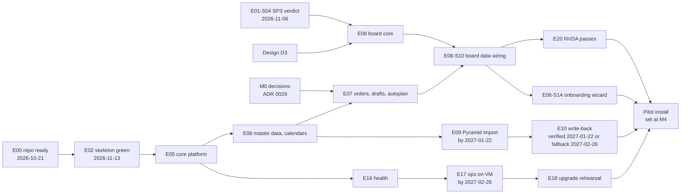

# Roadmap

This roadmap turns release 1 under option B into delivery work. It holds the checkpoints that set the pilot date, the weekly ledger row that measures velocity, the epics in dependency order with their stories, the tasks of the first two weeks, the cut list, the critical path and an outline of the public API epic that follows release 1. A later session creates the GitHub issues from it with the handoff plugin, and coding agents build the tasks. The release 1 scope is in [01-product-and-scope.md](01-product-and-scope.md), the delivery rules in [13-delivery-and-github.md](13-delivery-and-github.md), the risks in [17-risks.md](17-risks.md) and the open questions in [16-open-questions.md](16-open-questions.md). ADR [0055](../adr/0055-release-1-scope-under-option-b-and-the-scope-rule.md) decides the scope and the rule that measured velocity sets the pilot date. ADR [0049](../adr/0049-delivery-workflow-handoff-thin-vertical-slices-and-claude-design-per-task.md) decides the delivery workflow. Terms follow [GLOSSARY.md](../../GLOSSARY.md).

## How to turn this roadmap into issues

- Ids: epics `E00` to `E22`, stories `E07-S03`, tasks `E00-S02-T01`. The first line of every issue body is `Plan: <id>`. After creating an issue, the session writes its number next to the id in this file once. From then on the issue is the source of truth for scope.
- Titles read `<module>: <outcome>`, imperative, under 72 characters. A pull request title is a separate line in the form `type(module): outcome`; the scope may be left out for repository-wide changes such as `ci: ...`.
- Epics go in with `create_epic(title, goal)`. The `goal` text holds the goal, who it is for, the ADRs, what is out of scope, the estimate in raw days and the milestone.
- Stories go in with `create_story(epic, title, acceptance)`, using the story's acceptance criteria. The session then runs `gh issue edit` to put the plan id, the story statement, "Who it is for" (the persona of the statement), module, ADRs (as repository paths), design, blockers, the Tests first list as plain bullets, and notes above the criteria. The roadmap's "Acceptance criteria:" line and its bullets are not repeated there. A story body stays under about 3 500 characters, because every task's agents read it as context.
- This file holds tasks for E00, E01 and the design tasks D1 and D2, which run beside E02 ([0049](../adr/0049-delivery-workflow-handoff-thin-vertical-slices-and-claude-design-per-task.md)). Each task brief sits in a fenced block with the sections Goal, Where in the code, Tests first, Design, ADRs, Out of scope and Changelog, in that order. Everything above `## Acceptance criteria` is the `brief` of `create_task`, and the checkbox lines are its `acceptance`. Changelog holds the pull request title as `type(module): outcome`, or "none, internal". D1 and D2 use the design task format of [13-delivery-and-github.md](13-delivery-and-github.md#design-task) instead. Tasks for later stories are written when their epic is shaped, as thin vertical slices, in one shaping file per epic, `docs/plan/Enn-<slug>.md` ([13-delivery-and-github.md](13-delivery-and-github.md#plan-identifiers-and-files)). Each epic starts with the task "docs: record the Enn plan and ADRs", labelled `human` and closed by the pull request that adds its shaping file. A slice delivers one small end-to-end behaviour (for example a migration, a command, a GraphQL field, a screen state and their tests) inside handoff's plan budget of 15 files and 12 steps. A story is usually two to five tasks.
- Links: this file links ADRs relatively (`../adr/...`). Issue bodies name repository paths (`docs/adr/0029-...md`), because run agents read files and cannot follow links outside the repository.
- Blockers name ids here. The session creates issues in dependency order and turns each id into a `blocked_by` issue number.
- Bootstrap. Right after E00-S01-T01 pushes the workspace skeleton, an interactive session sets up the handoff instance (`.env` with a classic `GITHUB_TOKEN` that has the project scope, `CLAUDE_CODE_OAUTH_TOKEN`, `HANDOFF_WORKSPACE=worktree` and `HANDOFF_CAP_CLI=1`; `pnpm db:up`, `pnpm dev:web`, `pnpm dev:worker`). It then runs `add_project`, `list_github_projects` and `setup_plan` on the repository under its owner at that time, creates the labels `human`, `spike`, `design` and the `area:` labels with `gh label create`, and creates every E00 and E01 issue with handoff tools in dependency order. The conversion also creates the E04 epic and the stories E04-S01 and E04-S02, so D1 and D2 have an owning story. A person closes the E00-S01-T01 issue by hand with a link to the first commit. Status on 2026-10-05: SP0 is done, and handoff supports a repository and plan Project owned by an organization. The transfer to the `northMES` organization and the rename to `northmes` are done (E01-S01-T02, 2026-10-05), so `add_project` targets `northmes/northmes` directly. On 2026-10-05 the handoff project `northmes` (Flow mode) and the plan Project https://github.com/orgs/northMES/projects/1 were created, together with the labels `human`, `spike`, `design` and the `area:` labels, and the E00 epic, E00-S01 and its two tasks became issues 1 to 4.
- Area labels: repo, handoff and testing use `area: ci`; contracts and platform use `area: sdk`; core, audit, ai and production-start use `area: core`; planning and pyramid-connector use `area: planning`; ui and web use `area: web`; docs uses `area: docs`; ops uses `area: deploy`. Each task's Labels line names its area label.
- Estimates: each epic carries an estimate in raw days as planning information, and the weekly ledger turns it into credit as the epic's tasks merge (see [The weekly ledger row](#the-weekly-ledger-row)). Stories and tasks carry no size. The plan runs in handoff's Flow mode, where the order and the blockers show progress: the Project's Size field stays empty and `create_task` runs without `size`, as [docs/agents/issue-tracker.md](../agents/issue-tracker.md) says.
- Runs: handoff's scheduler is not used. The operating session reads `list_plan` and `list_backlog`, starts the next Ready task without open blockers with `start_run` and names the graph for that run, follows the run events, and brings every question, permission request, failed run and merge decision to Krister ([13-delivery-and-github.md](13-delivery-and-github.md#choosing-the-graph-per-run)). Only Krister answers questions and permission requests.
- Labels: `human` keeps a task on the guided graph, or with a person in a session. It goes on spikes (with `spike`), design tasks (with `design`), each epic's docs task, the first task of a new pattern, tasks that need a product owner, legal or design answer, tasks under an ADR that is `proposed` or has an open needs-confirmation, and tasks that touch authentication, row-level security policies or secrets handling. The list, the graph ladder (`northmes-guided`, `northmes-standard`, `northmes-lean`) and the switch rule with its measurable criteria are in [docs/agents/handoff/README.md](../agents/handoff/README.md). Because the operating session picks the graph per run, these tasks stay guided after a switch.
- Ready: a task moves to Ready only when every linked ADR is accepted with no open needs-confirmation, its blockers are closed or closing, every file it names is in the repository, and, for a UI task, its design is approved and committed under `docs/design/<area>/` (ADRs [0001](../adr/0001-record-architecture-decisions-in-madr.md) and [0049](../adr/0049-delivery-workflow-handoff-thin-vertical-slices-and-claude-design-per-task.md)). Until then the task stays in Shaping or carries `human` ([0001](../adr/0001-record-architecture-decisions-in-madr.md)). Every E00 and E01 task carries `human` and runs in an interactive session, because handoff is connected only in E00-S07 and ADRs 0004 and 0058 are accepted at M0.
- Design tasks: D1 tokens and contrast, D2 shell and navigation, D3 planning board, D4 operator station, then the canonical list and form page for core master data. Each is a task labelled `design` and `human` under the story that owns the screen, and the UI tasks of that story are blocked by it. What a design page contains is in [06-web-and-ux.md](06-web-and-ux.md#claude-design-per-task).
- Docs: generated and module docs change in the task that changes the code. Each epic ends with one docs task labelled `human` for user guides and shared docs, run alone because shared files cause merge conflicts.

## Personas

Stories use the persona list in [README.md](README.md). Issues, issue forms and design header frames use this list and no other.

| Persona | Who |
|---|---|
| Planner | Plans production orders on the board and in the job order table view, runs autoplan, saves drafts and handles ERP changes. |
| Operator | Signs in at a station by badge or personal login, starts, pauses and finishes jobs, and reports good and scrap quantities. |
| Plant admin | Sets up a company and its plants: users, roles, master data, calendars, settings, the Pyramid connector, AI providers and stations. Also installs and upgrades NorthMES on the customer's server together with the customer's IT. |
| Plugin developer | Builds a module or plugin on the `defineModule` contract: validators, slot widgets, subgraphs and remotes. Integration work such as an ERP connector counts here. |
| Maintainer | Builds and releases NorthMES itself: the repository, CI, the delivery workflow and the platform packages. |
| Hosting partner | A consultant or provider who installs and runs NorthMES for customers, one installation per customer. In release 1 it creates a customer's companies and their first company admins with scriptable CLI commands on the host, recovers company admins, and may run the onboarding wizard for the customer. |

## Milestones under option B

Option B keeps the full release 1 scope and moves the pilot later. Measured velocity sets the pilot date at the checkpoints below ([0055](../adr/0055-release-1-scope-under-option-b-and-the-scope-rule.md)). The internal stress test of the design (internal research note 32) set the dates for decisions, the walking skeleton, the board spike, the Pyramid requests and the operations rehearsal. The dates after M3 are proposals.

| Checkpoint | Date | What must hold | What it decides |
|---|---|---|---|
| Day 1 | Thu 2026-10-15 | The written request to the pilot's Pyramid administrator and the Pyramid reseller is sent (the questions are in [08-pyramid-connector.md](08-pyramid-connector.md#17-questions-for-the-pyramid-administrator)). The request for the data processing agreement is sent. The product owner session is booked. The private companion repository for internal research exists and is pushed, and SP0 (E01-S01) is done; both were done on 2026-10-05. Krister confirms the persona list and the epic order, which clears the needs-confirmation of ADR 0049. | |
| Week 1 | by Fri 2026-10-23 | handoff's `setup_project` reports ready (E00). The Node 26 hook tests, the time zone suite and the benchmarks have run on the `node:26` Debian image (E01-S05). A Windows PC of the pilot's planner PC class is in hand for SP3 and the NVDA passes. The product owner session has taken place. | Node 26 or Node 24 LTS ([0004](../adr/0004-monorepo-tooling-pnpm-turborepo-node-and-typescript-versions.md)) |
| M0 | Fri 2026-10-30 | The ADRs that E02 and E03 need are accepted: [0029](../adr/0029-per-planner-drafts-soft-locks-and-the-plan-revision.md), [0055](../adr/0055-release-1-scope-under-option-b-and-the-scope-rule.md), [0005](../adr/0005-postgres-18-official-image-with-pgbackrest-timescaledb-deferred.md), [0004](../adr/0004-monorepo-tooling-pnpm-turborepo-node-and-typescript-versions.md), [0057](../adr/0057-scheduling-domain-as-a-pure-package-in-the-planning-module.md) and the E02 list ([0003](../adr/0003-module-package-shape-and-the-definemodule-manifest.md), [0006](../adr/0006-kysely-sql-first-migrations-and-the-northmes-migration-runner.md), [0015](../adr/0015-graphql-federation-inside-one-process-with-an-embedded-hive-gateway.md), [0019](../adr/0019-web-shell-with-react-module-federation-remotes.md), [0037](../adr/0037-plugins-drop-in-packages-command-validators-and-ui-slots.md), [0041](../adr/0041-test-strategy-tdd-vitest-projects-testcontainers-and-playwright.md), [0058](../adr/0058-developer-environment-source-exports-one-stack-script-and-one-gate-command.md), [0060](../adr/0060-configuration-with-nestjs-config-one-zod-environment-schema-and-secret-files.md), [0062](../adr/0062-web-form-contracts-url-view-state-and-module-link-manifests.md), [0064](../adr/0064-rest-routes-under-api-v1-and-openapi-from-zod-contracts.md) and, under the working default of M-68, [0068](../adr/0068-extension-points-declared-by-their-owners-contributions-as-manifest-data-with-code-by-id-and-a-plugin-inventory.md)). Every product owner answer is recorded, or became a plant or connector setting whose default its ADR records. Krister and the product owner have written three to six pilot acceptance criteria (draft PA-1 to PA-6 in [01-product-and-scope.md](01-product-and-scope.md#pilot-acceptance-criteria-draft)) and settled whether double entry in Pyramid during shadow mode is acceptable, and for how long. The product owner has said whether operators report in NorthMES or in Pyramid. Krister has confirmed the MCP defaults (off per installation, personal access tokens before OAuth). | Decisions. The ledger opens. |
| SP3 verdict | Fri 2026-11-06 | The board spike is measured on the planner-class PC: 60 fps while scrolling at day zoom, p95 frame time at most 33 ms while dragging at week zoom, no long task over 50 ms, and keyboard move mode steps one snap and one machine. `e2e/board-perf.spec.ts` exists. | An interactive board, or one more week that limits the rendered range |
| Skeleton target | Fri 2026-11-13 | `e2e/skeleton.spec.ts` is green on the built `all` process. The Pyramid write method names have arrived. | If the spec is red, hardening freezes: only skeleton tasks run until it is green. |
| M1 | Fri 2026-11-20 | `e2e/skeleton.spec.ts` and the resolve-hook test are required in `ci / gate`. The SP3 second-fail deadline has passed. The first weekly ledger rows exist. | If SP3 failed twice: the job order table view with the shared Move dialog plus a read-only timeline carries planning (cut 8). |
| Rsbuild exit | Fri 2026-11-27 | Only if the skeleton spec is still red: the remotes move to the tested Rsbuild path, which stays inside [0019](../adr/0019-web-shell-with-react-module-federation-remotes.md). | |
| Pyramid endpoint | Fri 2026-12-18 | A Pyramid test company endpoint exists, or recorded request and response pairs have arrived. Recorded pairs arrive only after the data processing agreement is signed. They are never committed to any repository; tests use synthetic fixtures. | |
| M2 | Fri 2027-01-22 | Velocity checkpoint 1: the first forecast on the 1x line from at least eight weekly rows. The data processing agreement and the pilot agreement are signed. E09 is done. Live write-back is verified (target), or shadow mode runs with the daily write-back report. | A provisional pilot window |
| M3 | Fri 2027-02-26 | E17 is done: Compose on a pilot-like VM with pgBackRest and a timed restore. If Pyramid has no write path, the product owner picks a file export that Pyramid imports, a REST bridge, or a pilot without ERP write-back. Velocity checkpoint 2. The 10 percent stabilization reserve starts. | A narrower window and a review of the cut list |
| M4 (proposed) | Fri 2027-04-30 | Velocity checkpoint 3 | Krister fixes the pilot install date and the pilot test start from the three forecasts, and applies cuts if the forecast misses the date. |
| Pilot install (proposed) | Set at M4, at least 4 weeks before the pilot test | The upgrade rehearsal from N to N+1 with a migration, the backup and a rollback has run on the pilot-like VM. The second NVDA pass has run. The go-live checklist is complete: TLS option, disk layout, escrow, a monitoring tool or SMTP relay, browser versions, time sync. The conditions in [01-product-and-scope.md](01-product-and-scope.md#what-done-means-for-release-1) hold. | |
| Pilot test | Set at M4. The stress test estimated 2027-08-24 to 2028-01-20 on its 2x line. | The pilot acceptance criteria agreed at M0 | |

Nobody installs or upgrades in the week of a daylight saving change (autumn 2027-10-31, spring 2028-03-26). If the pilot window covers the night of 2027-10-31, that night runs on the installed system with the DST suites green. The stress test gave no 1x figure for the pilot window. The estimates already assume coding agents, so the forecast uses the 1x line, and on that line the window falls later than the 2x estimate.

## The weekly ledger row

[README.md](README.md) carries one row per week, written on Friday from the merged tasks per epic on the plan Project (`list_plan`) and handoff's weekly log in [docs/agents/handoff/README.md](../agents/handoff/README.md#weekly-metrics). The rows start at M1 at the latest. Planning tooling such as a forecast script is not built.

| Column | Meaning |
|---|---|
| Week ending | The Friday's date. |
| Working days | Weekdays worked this week, minus public holidays and absence. |
| Merged tasks | Task issues closed this week by a merged pull request, whether a handoff run or a session opened it. |
| Ledger days earned | Cumulative on this row minus Cumulative on the row before. |
| Cumulative | The sum of every epic's ledger credit on this Friday (rule below). |
| 1x line | Working days since 2026-10-15. On the 1x line one ledger day is earned per working day. |
| Against the line | Cumulative minus the 1x line. Negative means behind. |
| Rate | Ledger days earned per working day over the last four rows. |
| Median gate minutes per task | From the first handoff runs: for each merged run, the minutes from each gate's question to its answer (plan gate, code gate, Try it) plus the wait from `merge.ready` to a manual merge. Median over the week's merged runs. |
| Merged tasks per working day | Merged tasks divided by working days. |
| Notes | Decisions, cuts, graph switches, external waits. |

```markdown
| Week ending | Working days | Merged tasks | Ledger days earned | Cumulative | 1x line | Against the line | Rate | Median gate minutes per task | Merged tasks per working day | Notes |
|---|---|---|---|---|---|---|---|---|---|---|
```

Ledger credit. Each epic carries an estimate in raw days, from the sources named in the epic table below; stories and tasks carry no size. An epic's credit on a Friday is its midpoint estimate times its merged tasks divided by its task count. The task count is the number of task issues under the epic on the plan Project that Friday, open or closed, leaving out tasks closed as not planned. A task added or split later raises the count, so an epic's credit can fall in a week; a closed epic earns its full midpoint. An epic whose sources give no estimate gets one from Krister when its stories are created, written into the epic issue. Until then its merged tasks earn nothing and the forecast names the epic as unestimated.

How a checkpoint forecasts the date. The remaining ledger is, for each epic, its estimate times the share of its tasks not yet merged, summed over all epics; an epic with no tasks yet counts in full. It is computed once with the low and once with the high estimates. Dividing it by the rate gives the working days still needed. As a cross-check, the checkpoint also records the open tasks of the shaped epics divided by the merged tasks per working day over the last four rows; that figure covers only shaped epics and does not set the date. From M3 the rate is multiplied by 0.9, which holds 10 percent of capacity as the stabilization reserve. The result gives the earliest install date, and the pilot test starts at least 4 weeks later. The forecast uses the 1x line, because the estimates already include coding agents and a 2x or 3x line would count that speed-up twice. The stress test sized the full release 1 ledger at 301 to 423 raw days before the additions [0055](../adr/0055-release-1-scope-under-option-b-and-the-scope-rule.md) records (internal research note 32).

Gate time is measured, not assumed: at 180 to 240 tasks and 15 to 25 minutes of gates per task, the gates alone take 6 to 12 days. Gates are batched twice a day. The code gate leaves the routine path when the project moves from `northmes-guided` to `northmes-standard` or `northmes-lean` under the measurable switch criteria in [docs/agents/handoff/README.md](../agents/handoff/README.md#switching-graphs); the operating session picks the graph per run, so foundation-sensitive tasks stay guided after a switch ([0049](../adr/0049-delivery-workflow-handoff-thin-vertical-slices-and-claude-design-per-task.md)).

## Epics in dependency order

Estimates are raw ledger days from the internal research notes named in the table. They are estimates, not measurements, and they already assume coding agents. "Not estimated" means no source gives a figure; Krister sets one when the epic's stories are created. Epic estimates are planning information for the ledger; stories and tasks carry no size.

| Epic | Title | Estimate in raw days (source) | Depends on | Milestone |
|---|---|---|---|---|
| E00 | repo: Make the repository ready for the first handoff run | Not estimated; planned for 2026-10-16 to 2026-10-21 (internal research note 32) | none | Week 1 |
| E01 | platform: Settle the first decisions with five spikes | About 7: SP3 one week of work inside its two-week window (2026-10-26 to 2026-11-06), of which 3 days are the board estimate's performance spike (internal research note 05); SP1 one day (internal research note 16); SP0 under 2 hours (internal research note 27), done on 2026-10-05; SP2 and the Node test not estimated | E00-S05 for E01-S02 and E01-S05; E00-S02 for E01-S04; nothing for SP0 and SP2 | Week 1 to SP3 verdict |
| E02 | platform: Boot a walking skeleton end to end | Timeboxed to about 20 working days. Before the month-1 cut the list summed to 27 to 38 (internal research note 32). Part of the platform estimate of 35 to 51 (internal research notes 18, 19 and 20), which E04 and E21 share | E00, E01-S05 | Skeleton target, M1 |
| E03 | planning: Plan production in a pure scheduling package | Not estimated | E00, E01-S02 | M2 |
| E04 | web: Ship the shell, design tokens and shared UI patterns | Shell services and token fixes 6 (internal research note 21); web hooks and UI patterns 11 to 14 (internal research note 33); shell hardening inside the 35 to 51 platform days | E02, D1, D2 | M2 |
| E05 | core: Sign users in and make every write an audited command | Audit 3 to 5 (internal research note 22); command pipeline, data helpers, error catalog and jobs wrapper 6.5 to 9.5 (internal research note 33); identity, tenancy, events and realtime not estimated | E02 | M2 |
| E06 | core: Hold master data, units, settings and plant calendars | Units 9 (internal research note 35); list kit 17.5 to 24 gross, overlapping internal research note 33 (internal research note 34); master-data kit 6 to 8, settings 3, generators 3 to 4 (internal research note 33); calendars not estimated | E05, E04, E03-S01; E06-S14 also on E07-S08 and E08-S10 (production planning) and on E06-S13, E09-S06, E11-S01 and E13-S03 (its module steps) | M2; E06-S14 at M4, after E08-S10 |
| E07 | planning: Plan orders in per-planner drafts and run autoplan | Drafts, Save, soft locks and row statuses 4 to 7 (internal research note 32); production orders and the autoplan job not estimated | E06 (not E06-S14), E03 | M3 |
| E08 | planning: Move job orders on the board and in the table view | About 35 for the board (internal research note 05), 3 of them spent in E01; 8 for board accessibility and the table view (internal research note 21); click-to-place 1.5 of that is cut candidate 2 | E01-S04 verdict, D3, E04; E07 for data wiring | M4 |
| E09 | pyramid-connector: Import Pyramid orders, materials and stock | Not estimated; the field unit map is 1 (internal research note 35) | E06 | M2 |
| E10 | pyramid-connector: Write the committed plan back to Pyramid | Not estimated | E09, E07 | M2 target, M3 decision |
| E11 | production-start: Report production at an online station | 5 to 7 (internal research note 32) plus 3 for station accessibility (internal research note 21), partly overlapping | E07, E05, D4 | M4 |
| E12 | planning: Answer planning questions through tools and /mcp | `/mcp` endpoint 8 to 13 (internal research note 32); the tool definitions and runner not estimated | E07, E05 | M4 |
| E13 | ai: Configure customer AI providers and meter usage | 10 (internal research note 23: port 1, AI module 3, integration cards 3, metering and budgets 3) | E05, E06 | M3 |
| E14 | ai: Answer read-only planning questions in the assistant | 11 (internal research note 23: tool bridge 2, chat route and panel 4, tests 3, admin docs 2) plus 1 to 1.5 for chat panel accessibility (internal research note 32) | E12, E13, E04 | M4 |
| E15 | planning: Review agent proposals into the planner's draft | 8 to 12 (internal research note 32) | E12, E07, E08 | M4 |
| E16 | core: Report health, readiness and System health | SDK health helper 0.5 (internal research note 33); the rest not estimated | E02, E05 | M3 |
| E17 | ops: Install on a pilot-like VM with backups and a timed restore | Not estimated | E16, E05 | M3 |
| E18 | ops: Release, upgrade and roll back an installation | Not estimated | E17, E01-S03 | Pilot install |
| E19 | docs: Publish the docs site at docs.northmes.dev | Accessibility page 1 (internal research note 21); the rest not estimated | E00 | Per epic; pilot install |
| E20 | web: Hold WCAG 2.2 AA with gates and screen-reader passes | 7 (internal research note 21: test tooling and flows 4, manual pass and fixes 3), then about 2 per minor release | E04; E08 for the board | Pilot install |
| E21 | plugins: Build the example plugins outside the workspace | Two examples 2 and plugin build, pack and check 2 to 3 (internal research note 20); widget remote 1 to 2 (internal research note 19); partly spent in E02 | E02 | M2 |
| E22 | core: Keep the regulated path open | 8 to 10 (internal research note 24), much of it delivered inside E05 and E11 | E05 | M4 |

Board-core tasks in E08 wait only for the SP3 verdict and design approval D3; only the board's data-wiring story waits for E07. E09 starts right after core master data (E06), inside M2. E06-S14, the onboarding wizard, waits until production planning is built (E07-S08 and E08-S10, [ADR 0066](../adr/0066-companies-created-by-the-cli-plant-slugs-unique-per-installation-admin-pages-at-admin-and-an-onboarding-wizard-before-a-plant-opens.md)), so E06 closes at M4 while the rest of E06 lands in M2. No epic or story that depends on E06 waits for E06-S14. The first E03 runs start once E02-S01-T01 (the foundation pull request) has settled the root configuration files, or once all root configuration changes have landed in one session pull request.

### E00 repo: Make the repository ready for the first handoff run

Issue: northMES/northmes#1.

Goal: put on `main` everything a handoff run needs before it starts. That is the pnpm workspace with its root scripts and the one gate command, the Testcontainers harness with a green unit and a green integration test, the contributor and agent files, CI with `ci / gate` and the supply-chain checks, the ADR index and numbering script, the plan README with the ledger table, the spike sources that E02 ports, and the handoff scripts. The epic ends when handoff's `setup_project` reports ready.

Who it is for: Maintainer. Also: Plugin developer, who reads the same contributor files.

ADRs: [0001](../adr/0001-record-architecture-decisions-in-madr.md), [0004](../adr/0004-monorepo-tooling-pnpm-turborepo-node-and-typescript-versions.md), [0039](../adr/0039-license-agpl-3-0-or-later-core-and-a-contributor-license-agreement.md), [0040](../adr/0040-dependency-license-policy-ci-gate-and-sbom.md), [0041](../adr/0041-test-strategy-tdd-vitest-projects-testcontainers-and-playwright.md), [0049](../adr/0049-delivery-workflow-handoff-thin-vertical-slices-and-claude-design-per-task.md), [0050](../adr/0050-github-organization-rulesets-ci-runners-and-supply-chain.md), [0058](../adr/0058-developer-environment-source-exports-one-stack-script-and-one-gate-command.md), [0063](../adr/0063-agent-skills-from-library-authors-pinned-in-the-repository.md).

Out of scope: product code; the release workflow beyond the configuration SP2 verifies (E01-S03, E18); the docs site (E19); `.claude/launch.json` with `handoff-demo`, which arrives with the stack script (E02-S08) before the first UI task; the CLA text and `ci / cla`, which come before the first outside pull request (E19-S06).

Estimate: not estimated; planned for 2026-10-16 to 2026-10-21 (internal research note 32). Depends on: nothing. SP0 (E01-S01) is done (2026-10-05); the repository moved to the `northMES` organization and was renamed `northmes` (E01-S01-T02, 2026-10-05). Milestone: Week 1.

#### E00-S01 repo: Set up the pnpm workspace and the gate command

Issue: northMES/northmes#2.

As a maintainer, I want one workspace with root scripts and one gate command, so that every person, session and handoff run checks a change the same way.

Module: repo. Blocked by: none. Design: none.

ADRs: [0004](../adr/0004-monorepo-tooling-pnpm-turborepo-node-and-typescript-versions.md), [0058](../adr/0058-developer-environment-source-exports-one-stack-script-and-one-gate-command.md).

Acceptance criteria:

- A fresh clone installs with `pnpm install --frozen-lockfile`.
- `pnpm check` runs lint, typecheck, `pnpm gen --check` and the Vitest projects, and passes on `main`.
- handoff's Tester and the coder instructions in every graph name `pnpm check`, so the Tester and CI agree; `pnpm test:handoff` stays only as an alias that runs `pnpm check`.
- Every command is a root pnpm script or uses `pnpm --filter`; no script uses `cd`.
- `pnpm check` stops first when the running Node major differs from `.node-version`.

Tests first:

- `test/meta/workspace.test.ts`: "pnpm-workspace.yaml sets pmOnFail ignore and refuses builds of cpu-features, protobufjs and ssh2"; "every workspace package.json sets a license field"; "the catalog pins one TypeScript 6.0 version".
- `test/meta/gates.test.ts`: "test:handoff runs pnpm check"; "every graph's Tester command is pnpm check and its coder instruction names pnpm check"; "no package script contains cd".
- `scripts/check-node.test.ts`: "a Node major other than .node-version fails naming both".

Notes: Node 26 is the target; E01-S05 decides whether `.node-version` stays on 26 or moves to Node 24 LTS.

##### E00-S01-T01 repo: Push the workspace skeleton

Issue: northMES/northmes#3.

Labels: `task`, `human`, `area: ci` (the push goes to main before the ruleset exists). Blocked by: none.

Status on 2026-10-05: the first commits are on main. They hold LICENSE (the unmodified AGPL v3 text), NOTICE, .gitignore, AGENTS.md, CLAUDE.md, .claude/skills with skills-lock.json, .coderabbit.yaml, GLOSSARY.md and docs/plan, docs/adr and docs/agents. This task adds the workspace skeleton on top.

```markdown
Plan: E00-S01-T01

## Goal
Create the pnpm workspace every later task builds on and push it to main. The license files, the agent guides, the skills and the planning documents are already on main. Nothing under docs/research and no docs/project-brief.md is committed.

## Where in the code
package.json (root, private, "license": "AGPL-3.0-or-later", packageManager pinned)
pnpm-workspace.yaml (packages apps/*, modules/*, modules/*/contracts, modules/*/web, modules/planning/domain, packages/*, examples/*; strict catalog; pmOnFail: ignore; cpu-features, protobufjs and ssh2 not allowed to build)
turbo.json (cache everything except tests)
biome.json (Biome 2.5 root config, recommended a11y rules and the rules that fail on .only and .skip (ADR 0041), docs/sources excluded)
tsconfig.base.json (TypeScript 6.0.x from the catalog, customConditions ["@northmes/source"])
.node-version and .nvmrc (Node 26)
vitest.config.ts (unit project only for now, excluding node_modules, dist and docs/sources), test/meta/workspace.test.ts (new)
Seam: the test reads and parses repository files with node:fs; no network, no Docker.

## Tests first
- workspace.test.ts: "pnpm-workspace.yaml sets pmOnFail ignore and refuses builds of cpu-features, protobufjs and ssh2"
- workspace.test.ts: "every workspace package.json sets a license field"
- workspace.test.ts: "the catalog pins exactly one TypeScript 6.0 version"
- workspace.test.ts: ".node-version and .nvmrc name the same Node major"

## Design
none

## ADRs
docs/adr/0004-monorepo-tooling-pnpm-turborepo-node-and-typescript-versions.md
docs/adr/0058-developer-environment-source-exports-one-stack-script-and-one-gate-command.md

## Out of scope
The Testcontainers harness (E00-S02), root gate scripts (E00-S01-T02), CI workflows (E00-S04), any package under apps, modules or packages.

## Changelog
none, internal

## Acceptance criteria
- [ ] pnpm install --frozen-lockfile succeeds in a fresh clone
- [ ] pnpm vitest run --project unit runs workspace.test.ts green
- [ ] Biome check passes on the commit
- [ ] git ls-files lists nothing under docs/research and no docs/project-brief.md or rp-manifest.md
- [ ] main holds the existing AGENTS.md, CLAUDE.md, .claude/skills, skills-lock.json, .coderabbit.yaml, GLOSSARY.md, docs/plan, docs/adr and docs/agents
- [ ] After the push, the repository dependency graph lists the workspace packages (ADR 0050)
```

##### E00-S01-T02 repo: Add pnpm check and the root scripts

Issue: northMES/northmes#4.

Labels: `task`, `human`, `area: ci` (E00 and E01 run in interactive sessions; ADRs 0004 and 0058 are proposed). Blocked by: E00-S01-T01.

```markdown
Plan: E00-S01-T02

## Goal
Make pnpm check the one gate command. It runs turbo lint and typecheck, then pnpm gen --check, then vitest run over the unit, integration, web and types projects. pnpm check:full adds the Europe/Stockholm leg and e2e. handoff's Tester and the coder instructions in the three graphs name pnpm check; pnpm test:handoff stays only as an alias that runs pnpm check, so a graph version imported before this rule runs the same gate. pnpm gen runs a fixed, empty stage list until generators exist, so later tasks add stages in a fixed order.

## Where in the code
package.json root scripts: check, check:full, test:handoff, test, test:unit, test:int, test:tz, lint, typecheck, build, gen
scripts/gen.mjs (new): fixed stage order; --check writes to a temporary directory and diffs
scripts/check-node.mjs (new) and scripts/check-node.test.ts (new)
test/meta/gates.test.ts (new)
docs/agents/handoff/graphs/*.json (read only: they already name pnpm check)
Seam: gates.test.ts reads package.json files and the graph files; check-node exports a pure function compare(running, pinned).

## Tests first
- check-node.test.ts: "a Node major other than .node-version fails naming both versions"
- check-node.test.ts: "the same major passes"
- gates.test.ts: "test:handoff runs pnpm check"
- gates.test.ts: "the Tester command in every graph under docs/agents/handoff/graphs is pnpm check, and its coder instruction names pnpm check"
- gates.test.ts: "pnpm check runs lint, typecheck, gen --check and vitest in that order"
- gates.test.ts: "no root or package script contains cd"

## Design
none

## ADRs
docs/adr/0058-developer-environment-source-exports-one-stack-script-and-one-gate-command.md
docs/adr/0004-monorepo-tooling-pnpm-turborepo-node-and-typescript-versions.md

## Out of scope
Generator stages (each arrives with the task that owns its output), the e2e project (E02-S08), CI workflows (E00-S04).

## Changelog
chore(repo): add pnpm check and the root scripts

## Acceptance criteria
- [ ] pnpm check passes on main
- [ ] pnpm test:handoff runs pnpm check, and every graph file names pnpm check as its Tester command
- [ ] With a different Node major, pnpm check stops first with a message naming both versions
- [ ] pnpm gen --check exits 0 and prints its stage order
- [ ] gates.test.ts fails when a package script contains cd
```

#### E00-S02 testing: Give every integration test file its own Postgres database

Issue: northMES/northmes#5.

As a maintainer, I want each test run to start its own Postgres and each integration file to get its own database, so that parallel runs and worktrees never share data.

Module: testing. Blocked by: E00-S01. Design: none.

ADRs: [0041](../adr/0041-test-strategy-tdd-vitest-projects-testcontainers-and-playwright.md), [0005](../adr/0005-postgres-18-official-image-with-pgbackrest-timescaledb-deferred.md).

Acceptance criteria:

- One container per Vitest run starts from the image digest in `infra/pg-image.json`; no `.env` file is needed.
- Each integration test file gets its own database cloned from a template.
- The server time zone follows a test setting, so the time zone legs can run.
- Every tracked test file belongs to exactly one Vitest project, chosen by its suffix.
- No tracked file names a Postgres image other than the one in `infra/pg-image.json`.

Tests first:

- `packages/testing/test/harness.int.test.ts`: "each test file gets its own database"; "the server time zone follows NM_TEST_PG_TZ"; "the container image equals the digest in infra/pg-image.json".
- `test/meta/collection.test.ts`: "every tracked test file belongs to exactly one project".
- `test/meta/pg-image.test.ts`: "no tracked file names another postgres image".

Notes: until the NorthMES database image exists (E17-S01), `infra/pg-image.json` names the official `postgres:18` Debian image by digest. Testcontainers `snapshot()` and `restoreSnapshot()` are not used. Database roles arrive with the migration runner (E02-S02).

##### E00-S02-T01 testing: Start one Postgres per test run from the pinned image

Issue: northMES/northmes#193.

Labels: `task`, `human`, `area: ci` (first task of a new pattern). Blocked by: E00-S01-T02.

```markdown
Plan: E00-S02-T01

## Goal
@northmes/testing (MIT) starts one Postgres container per Vitest run from the image digest in infra/pg-image.json and gives every integration test file its own database, cloned from a template database. The container runs on tmpfs with durability off, max_connections=300 and a time zone taken from NM_TEST_PG_TZ (default UTC), with a random password and database name, and Ryuk left on.

## Where in the code
infra/pg-image.json (new): official postgres:18 Debian image by digest
packages/testing/package.json (new, license MIT, exports "@northmes/source" before "default")
packages/testing/src/global-setup.ts (new): PostgreSqlContainer from @testcontainers/postgresql
packages/testing/src/database.ts (new): useTestDatabase() clones the template per test file
vitest.config.ts: integration project for **/*.int.test.ts with the global setup
packages/testing/test/harness.int.test.ts (new)
Every new .ts file starts with // SPDX-License-Identifier: MIT (the package license).
Seam: useTestDatabase() returns { connectionString, databaseName }; tests talk to Postgres with pg.

## Tests first
- harness.int.test.ts: "each test file gets its own database"
- harness.int.test.ts: "the server time zone follows NM_TEST_PG_TZ"
- harness.int.test.ts: "the container image equals the digest in infra/pg-image.json"
- harness.int.test.ts: "two runs get different passwords and database names"

## Design
none

## ADRs
docs/adr/0041-test-strategy-tdd-vitest-projects-testcontainers-and-playwright.md
docs/adr/0005-postgres-18-official-image-with-pgbackrest-timescaledb-deferred.md

## Out of scope
Database roles and migrations (E02-S02), the app factory and given.* fixtures (E02), Playwright (E02-S08).

## Changelog
test(testing): start one Postgres per run with a database per file

## Acceptance criteria
- [ ] pnpm test:int starts one container per run and passes
- [ ] Two integration files running in parallel do not see each other's tables
- [ ] With NM_TEST_PG_TZ=Europe/Stockholm, show timezone returns Europe/Stockholm
- [ ] No .env file exists or is needed
- [ ] pnpm test:unit passes with Docker stopped
```

##### E00-S02-T02 testing: Key the Vitest projects on the file suffix

Issue: northMES/northmes#194.

Labels: `task`, `human`, `area: ci` (E00 and E01 run in interactive sessions; ADR 0058 is proposed). Blocked by: E00-S02-T01.

```markdown
Plan: E00-S02-T02

## Goal
One root Vitest config with projects keyed on the file suffix: unit is **/*.test.ts minus **/*.int.test.ts, **/*.ai.test.ts and **/*.ops.test.ts; integration is **/*.int.test.ts; web is **/*.test.tsx with the React plugin and happy-dom; types is **/*.test-d.ts in Vitest typecheck mode and runs in pnpm check; ai is **/*.ai.test.ts and runs only through pnpm test:ai; ops is **/*.ops.test.ts and runs nightly. All exclude node_modules, dist and docs/sources, and the coverage include follows the same globs. The global setup asserts the Node major. A meta test proves every tracked test file lands in exactly one project, and a lint keeps every Postgres image reference on infra/pg-image.json.

## Where in the code
vitest.config.ts
packages/testing/src/node-major.ts (new)
test/meta/collection.test.ts (new): compares vitest list --json --filesOnly with git ls-files
test/meta/pg-image.test.ts (new)
Seam: collection.test.ts runs vitest list in a child process; pg-image exports scan(files: { path, text }[]); the test passes in-memory files and the CLI passes git ls-files output.

## Tests first
- collection.test.ts: "every tracked test file belongs to exactly one project"
- collection.test.ts: "a file named x.int.test.ts lands in integration only"
- collection.test.ts: "a file named x.ai.test.ts lands in ai only and pnpm check does not run it"
- collection.test.ts: "a file named x.test-d.ts lands in types only"
- pg-image.test.ts: "no tracked Compose file, Dockerfile or test names a postgres image other than infra/pg-image.json's"

## Design
none

## ADRs
docs/adr/0041-test-strategy-tdd-vitest-projects-testcontainers-and-playwright.md
docs/adr/0058-developer-environment-source-exports-one-stack-script-and-one-gate-command.md
docs/adr/0062-web-form-contracts-url-view-state-and-module-link-manifests.md (the types project)

## Out of scope
The browser-mode project for component accessibility tests (E04-S01), Playwright projects (E02-S08).

## Changelog
test(testing): key Vitest projects on the file suffix

## Acceptance criteria
- [ ] pnpm check runs the unit, integration, web and types projects
- [ ] collection.test.ts fails on a test file that matches no project
- [ ] scan() reports an in-memory Dockerfile with FROM postgres:17
- [ ] docs/sources files are never collected
```

#### E00-S03 repo: Publish the license, contributor and agent files

Issue: northMES/northmes#6.

As a maintainer, I want the license, contributor, security and agent rule files on `main`, so that people and agents follow the same rules from the first pull request.

Module: repo. Blocked by: E00-S01. Design: none.

ADRs: [0039](../adr/0039-license-agpl-3-0-or-later-core-and-a-contributor-license-agreement.md), [0049](../adr/0049-delivery-workflow-handoff-thin-vertical-slices-and-claude-design-per-task.md), [0050](../adr/0050-github-organization-rulesets-ci-runners-and-supply-chain.md), [0058](../adr/0058-developer-environment-source-exports-one-stack-script-and-one-gate-command.md), [0063](../adr/0063-agent-skills-from-library-authors-pinned-in-the-repository.md).

Acceptance criteria:

- `LICENSE` holds the AGPL-3.0-or-later text, and `NOTICE` exists.
- `SECURITY.md` names security@northmes.dev, GitHub private vulnerability reporting and the supported versions (latest minor only before 1.0).
- `CODE_OF_CONDUCT.md` names conduct@northmes.dev.
- `AGENTS.md` holds the tool-neutral rules for any contributor's agent; `CLAUDE.md` starts with `@AGENTS.md` and adds only a short note on the installed skills; neither file mentions handoff.
- `.gitignore` keeps `docs/research/`, `docs/project-brief.md`, `rp-manifest.md` and the maintainer's `CLAUDE.local.md` out, and a test proves none of them is tracked.

Tests first:

- `test/meta/private-paths.test.ts`: "git ls-files lists nothing under docs/research"; "docs/project-brief.md and rp-manifest.md are not tracked".
- `test/meta/agent-files.test.ts`: "CLAUDE.md starts with @AGENTS.md"; "AGENTS.md and CLAUDE.md do not mention handoff"; ".claude/skills holds exactly the skills in skills-lock.json, each at its pinned commit, and THIRD_PARTY_LICENSE.md names every source".
- `test/meta/spdx.test.ts`: "every source file starts with an SPDX header that matches its package license".

Notes: the additions to `LICENSE` that ADR [0056](../adr/0056-mit-sdk-packages-the-extension-exception-and-the-trademark-policy.md) proposes wait for that ADR's acceptance. The CLA files and `ci / cla` come before the first outside pull request (E19-S06).

##### E00-S03-T01 repo: Add the license, contributor, security and agent files

Issue: northMES/northmes#195.

Labels: `task`, `human`, `area: ci` (shared files). Blocked by: E00-S02-T02.

Status on 2026-10-05: LICENSE (the unmodified AGPL v3 text) and NOTICE (NorthMES, the copyright holder and a pointer to the MIT notice of the vendored skills) are on main. This task checks them and adds the other files.

```markdown
Plan: E00-S03-T01

## Goal
Add the files every contributor and agent reads first. AGENTS.md holds the tool-neutral rules for any contributor's agent; CLAUDE.md starts with @AGENTS.md and adds only a note on the installed skills; neither mentions handoff. Check that AGENTS.md states three tool-neutral rules, phrased as what to do: run every command as pnpm or git from the repository root; start red commits with "test:"; bring a new dependency in its own pull request, at a version older than Renovate's minimumReleaseAge window. Handoff run rules go into handoff's agent notes and node instructions (E00-S07-T01); maintainer-only instructions load from the gitignored CLAUDE.local.md. CONTRIBUTING.md describes handoff as the maintainer's own workflow: contributors open issues with the issue forms and send pull requests.

## Where in the code
LICENSE (AGPL-3.0-or-later), NOTICE, README.md (with the CodeRabbit badge below), CONTRIBUTING.md (states that outside pull requests are not merged until the contributor license agreement check exists), CODE_OF_CONDUCT.md (conduct@northmes.dev), SECURITY.md (security@northmes.dev, private vulnerability reporting, supported versions, response target), GOVERNANCE.md, AGENTS.md, CLAUDE.md, .github/CODEOWNERS (* @Krister-Johansson), .gitignore
NOTICES.md: third-party notices for vendored files, pointing to .claude/skills/THIRD_PARTY_LICENSE.md for the agent skills at the commits pinned in skills-lock.json
README.md badge, verbatim: 
SPDX headers on every .ts file already on main
test/meta/private-paths.test.ts, test/meta/agent-files.test.ts, test/meta/spdx.test.ts (new)
Seam: tests read files and git ls-files output.

## Tests first
- private-paths.test.ts: "git ls-files lists nothing under docs/research"
- private-paths.test.ts: "docs/project-brief.md and rp-manifest.md are not tracked"
- agent-files.test.ts: "CLAUDE.md starts with @AGENTS.md"
- agent-files.test.ts: "AGENTS.md says every command runs as pnpm or git from the repository root"
- agent-files.test.ts: "AGENTS.md states the dependency release-age rule"
- agent-files.test.ts: "AGENTS.md and CLAUDE.md do not mention handoff"
- agent-files.test.ts: ".claude/skills holds exactly the skills in skills-lock.json, each at its pinned commit, and THIRD_PARTY_LICENSE.md names every source"
- agent-files.test.ts: "each source section of .claude/skills/THIRD_PARTY_LICENSE.md lists the skills skills-lock.json takes from that source and the full commit it pins, and holds a license text"
- agent-files.test.ts: ".claude/settings.json denies Bash(npm *) and Bash(npx *)"
- spdx.test.ts: "every .ts and .tsx file under apps, modules, packages and examples starts with an SPDX header matching its package license"

## Design
none

## ADRs
docs/adr/0039-license-agpl-3-0-or-later-core-and-a-contributor-license-agreement.md
docs/adr/0049-delivery-workflow-handoff-thin-vertical-slices-and-claude-design-per-task.md
docs/adr/0050-github-organization-rulesets-ci-runners-and-supply-chain.md
docs/adr/0063-agent-skills-from-library-authors-pinned-in-the-repository.md

## Out of scope
CLA.md, CLA-corporate.md and ci / cla (E19-S06); the additions to LICENSE proposed in docs/adr/0056-mit-sdk-packages-the-extension-exception-and-the-trademark-policy.md; TRADEMARKS.md.

## Changelog
docs(repo): add license, contributor, security and agent files

## Acceptance criteria
- [ ] The listed files exist on main
- [ ] SECURITY.md names security@northmes.dev, private vulnerability reporting and the supported-versions table
- [ ] CODE_OF_CONDUCT.md names conduct@northmes.dev
- [ ] CLAUDE.md begins with @AGENTS.md, and neither CLAUDE.md nor AGENTS.md mentions handoff
- [ ] NOTICES.md points to the license notice of each vendored skill source
- [ ] README.md shows the CodeRabbit pull request reviews badge for northMES/northmes
- [ ] The three meta tests pass
```

#### E00-S04 ci: Run the gate and the supply-chain checks on every pull request

Issue: northMES/northmes#7.

As a maintainer, I want CI, the license gate and the ruleset in place before the first run, so that nothing merges that `ci / gate` and the supply-chain checks have not passed.

Module: ci. Blocked by: E00-S01, E00-S02. Design: none.

ADRs: [0050](../adr/0050-github-organization-rulesets-ci-runners-and-supply-chain.md), [0040](../adr/0040-dependency-license-policy-ci-gate-and-sbom.md), [0038](../adr/0038-versions-and-releases-lockstep-0-x-release-please-api-reports.md).

Acceptance criteria:

- Every pull request and every push to `main` runs `ci / gate`, `license gate`, `dependency audit` and CodeQL, and all four are strict required checks.
- `ci / gate` runs the unit and integration projects in both the UTC and the Europe/Stockholm legs.
- A pull request title that is not a Conventional Commit, or a pull request without `Closes #N`, fails its check.
- A third-party GPL-3.0, AGPL or LGPL dependency fails the license gate by name.
- `main` accepts only squash merges with the PR title as subject and an empty body, with resolved threads and no bypass.

Tests first:

- `test/meta/workflows.test.ts`: "every uses: line pins a full commit SHA"; "no workflow uses pull_request_target"; "required workflows have no paths filter"; "every ci / gate step runs a script that pnpm check or check:full contains".
- `scripts/license-gate.test.ts`: "a GPL-3.0 package fails naming it"; "a package with an ee/ folder fails".
- `test/meta/github-files.test.ts`: "the issue forms offer the persona list from docs/plan/README.md".

Notes: SP0 is done (2026-10-05). The transfer to the `northMES` organization is done (2026-10-05), so the organization settings (approval for outside contributors, required SHA pinning) apply to E00-S04-T03 once they are set (E01-S01-T02).

##### E00-S04-T01 ci: Run ci / gate on pull requests and pushes to main

Issue: northMES/northmes#196.

Labels: `task`, `human`, `area: ci` (first workflow). Blocked by: E00-S02-T02.

```markdown
Plan: E00-S04-T01

## Goal
.github/workflows/ci.yml runs lint, typecheck and build, the tests under TZ=UTC and under TZ=Europe/Stockholm, ci / pr title and ci / linked issue, and one final job, ci / gate, that needs all of them. The ruleset will require only ci / gate from this file, so jobs can change without a ruleset edit. Every job runs a root pnpm script that pnpm check or check:full contains. ci / pr title accepts the types feat, fix, security, perf, revert, docs, test, ci, chore, refactor and build, an optional scope and an optional !. For the first two weeks the weekly row records wall time, container start time and flake rate for Blacksmith and GitHub-hosted runs.

## Where in the code
.github/workflows/ci.yml (new): top-level permissions contents: read; every action pinned by full SHA with the version in a comment; persist-credentials: false; no pull_request_target; no paths filter; runs-on for test jobs read from a repository variable (Blacksmith for branches in the repository and main, GitHub-hosted for forks and static jobs)
test/meta/workflows.test.ts (new)
Seam: the test parses workflow YAML files.

## Tests first
- workflows.test.ts: "every uses: line pins a 40-character SHA"
- workflows.test.ts: "no workflow uses pull_request_target"
- workflows.test.ts: "required workflows have no paths filter"
- workflows.test.ts: "every run step in ci / gate calls a script that pnpm check or check:full contains"
- workflows.test.ts: "test jobs take runs-on from a repository variable"
- workflows.test.ts: "every workflow sets top-level permissions"
- workflows.test.ts: "no job both runs pnpm install and holds id-token: write"
- workflows.test.ts: "ci / pr title accepts security(core): ..."
- workflows.test.ts: "ci / pr title accepts a title without a scope"

## Design
none

## ADRs
docs/adr/0050-github-organization-rulesets-ci-runners-and-supply-chain.md
docs/adr/0058-developer-environment-source-exports-one-stack-script-and-one-gate-command.md

## Out of scope
ci / e2e (E02-S08), ci / a11y (E20), ci / docs (E19), ci / cla (E19-S06), images and release workflows (E18).

## Changelog
ci: run the gate on pull requests and pushes to main

## Acceptance criteria
- [ ] A pull request shows ci / gate, ci / pr title and ci / linked issue
- [ ] A title that is not a Conventional Commit fails ci / pr title
- [ ] A pull request without Closes #N fails ci / linked issue, except Renovate and release pull requests
- [ ] Both time zone legs run the unit and integration projects
- [ ] workflows.test.ts passes
```

##### E00-S04-T02 ci: Gate dependencies on license, audit and release age

Issue: northMES/northmes#197.

Labels: `task`, `human`, `area: ci` (E00 and E01 run in interactive sessions; ADR 0040 is proposed and awaits confirmation). Blocked by: E00-S04-T01.

```markdown
Plan: E00-S04-T02

## Goal
.github/workflows/supply-chain.yml runs the license gate and the dependency audit on every pull request and push to main. The license gate builds an SBOM per package and applies the policy: third-party GPL-3.0, AGPL and LGPL are denied in core, packages with ee/ folders or "Enterprise" license files are denied, and the never-install list fails by name (@graphql-yoga/nestjs-federation, @apollo/gateway, exceljs, the npm xlsx package, @sentry/node in the server, mastra). Renovate pins digests and holds new releases for a minimum age.

## Where in the code
.github/workflows/supply-chain.yml (new): license gate (pnpm sbom --sbom-format cyclonedx --sbom-type application --prod --split, then scripts/license-gate.mjs), dependency audit (pnpm audit --prod --audit-level high)
scripts/license-gate.mjs, license-clarifications.json, license-exceptions.json (new)
renovate.json (config:best-practices, helpers:pinGitHubActionDigests, digest pinning for Compose and Dockerfiles, minimumReleaseAge, stricter for the Module Federation packages)
scripts/license-gate.test.ts (new) with fixture SBOMs under scripts/fixtures/
Seam: license-gate exports evaluate(sbom, policy) returning a list of violations.

## Tests first
- license-gate.test.ts: "a GPL-3.0 package fails naming the package"
- license-gate.test.ts: "a package with an ee/ folder fails"
- license-gate.test.ts: "a package on the never-install list fails"
- license-gate.test.ts: "an MIT and Apache-2.0 tree passes"
- license-gate.test.ts: "an Elastic-2.0 component under a core package fails naming it"
- license-gate.test.ts: "SEE LICENSE IN LICENSE fails until license-clarifications.json maps that exact version"
- license-gate.test.ts: "MPL-2.0 fails under an MIT package and passes with a note under core"
- license-gate.test.ts: "(MIT OR GPL-3.0-or-later) and MIT AND Zlib pass under core"
- license-gate.test.ts: "a package without a license fails"

## Design
none

## ADRs
docs/adr/0040-dependency-license-policy-ci-gate-and-sbom.md
docs/adr/0050-github-organization-rulesets-ci-runners-and-supply-chain.md

## Out of scope
Dependency review (after the dependency graph reads the lockfile), image scanning (E18), the SBOM per image (E18), Socket, Codecov and Scorecard (E00-S04-T04).

## Changelog
ci: add the license gate, dependency audit and Renovate

## Acceptance criteria
- [ ] supply-chain.yml runs license gate and dependency audit on every pull request and push to main
- [ ] license-gate.test.ts passes
- [ ] renovate.json passes Renovate's config validator
- [ ] The policy table in scripts/license-gate.mjs matches docs/adr/0040-dependency-license-policy-ci-gate-and-sbom.md
```

##### E00-S04-T03 ci: Protect main and configure the repository

Issue: northMES/northmes#201.

Labels: `task`, `human`, `area: ci` (GitHub settings). Blocked by: E00-S04-T02, E00-S05-T02, E01-S01-T01.

```markdown
Plan: E00-S04-T03

## Goal
Configure the repository so main only changes through checked squash merges. A session applies the GitHub settings and opens one pull request with the files. Settings: a ruleset on main with squash only, PR title as commit subject and a blank body, linear history, strict required checks ci / gate, license gate, dependency audit and CodeQL, required thread resolution, 1 approving review with stale approvals dismissed on push and the extra approval for unattributed Copilot pull requests left at GitHub's default, on (ADR 0065), no bypass actors, no force push or deletion; a tag ruleset on v* that blocks deletion and update; private vulnerability reporting; secret scanning with push protection; Dependabot alerts on and Dependabot security updates off; CodeQL default setup for actions and javascript-typescript; Actions pinned to full SHAs; approval for all outside contributors; auto-merge off; GitHub's merge queue off; the setting SP2 (E01-S03-T01) chooses for release-please pull requests (Actions may create pull requests, or a GitHub App token); once the repository is in the northMES organization (Blacksmith runs only for organizations), the Blacksmith App installed on the NorthMES repository only, sticky-disk branch protection on, branch-scoped caches, SSH access off, AI features off, a spending alert set, an EU region requested from support. Register NorthMES at bestpractices.dev, commit .bestpractices.json with the project id, and add the badge to README.md.

## Where in the code
scripts/labels.sh (new): epic, story, task, human, design, spike, accessibility, area: core, area: planning, area: sdk, area: web, area: docs, area: deploy, area: ci
.bestpractices.json (new), README.md (badge)
.github/ISSUE_TEMPLATE/config.yml, bug_report.yml, feature_request.yml, plugin_request.yml (new)
.github/PULL_REQUEST_TEMPLATE.md (new): validation impact none, UI only, records, security, calculation or data migration
.coderabbit.yaml (already on main and valid; keep reviews.auto_review.auto_incremental_review, reviews.request_changes_workflow, reviews.allow_author_approval and reviews.review_progress true, and reviews.commit_status and reviews.fail_commit_status false)
test/meta/github-files.test.ts (new)
scripts/repo/check-ruleset.mjs (new) and scripts/repo/check-ruleset.test.ts (new): reads the main ruleset through the GitHub API; a weekly CI job named repo settings runs check-ruleset.mjs against the live main ruleset (ADR 0065)
Seam: the test parses the YAML and Markdown files.

## Tests first
- github-files.test.ts: "every issue form's persona list equals the persona table in docs/plan/README.md"
- github-files.test.ts: "the PR template asks for one of the six validation impacts"
- github-files.test.ts: ".coderabbit.yaml turns on incremental reviews, review_progress, request_changes_workflow and allow_author_approval, and turns off commit_status and fail_commit_status"
- github-files.test.ts: "scripts/labels.sh creates epic, story, task, human, design and spike"
- github-files.test.ts: ".bestpractices.json names the project id"
- check-ruleset.test.ts: "a ruleset with 0 required approvals fails naming required_approving_review_count"

## Design
none

## ADRs
docs/adr/0050-github-organization-rulesets-ci-runners-and-supply-chain.md
docs/adr/0065-coderabbit-check-run-and-a-required-approval-on-main.md
docs/adr/0049-delivery-workflow-handoff-thin-vertical-slices-and-claude-design-per-task.md

## Out of scope
Release environment and immutable releases (E18), the CLA check (E19-S06).

## Changelog
chore(repo): add issue forms, PR template and labels

## Acceptance criteria
- [ ] A direct push to main is refused
- [ ] A pull request with an unresolved review thread cannot merge
- [ ] Only squash merge is offered, with the PR title as subject and an empty body
- [ ] The four required checks are strict
- [ ] .bestpractices.json is on main
- [ ] github-files.test.ts passes
```

##### E00-S04-T04 ci: Add Socket, Codecov and Scorecard

Issue: northMES/northmes#198.

Labels: `task`, `human`, `area: ci` (E00 and E01 run in interactive sessions). Blocked by: E00-S04-T01.

```markdown
Plan: E00-S04-T04

## Goal
Add the review and supply-chain services that report on pull requests without being required checks. Socket checks new dependencies, Codecov shows coverage as information only, and OpenSSF Scorecard scores the repository. Coverage from ci / test (TZ=UTC) reaches Codecov once through OIDC without a token.

## Where in the code
socket.yml (new): triggers on package.json files, pnpm-lock.yaml and pnpm-workspace.yaml
codecov.yml (new): informational, no pull request comment, one component per module from paths
.github/workflows/scorecard.yml (new): the read-only token that can read rulesets (docs/plan/13-delivery-and-github.md)
.github/workflows/ci.yml: ci / test (TZ=UTC) saves coverage as an artifact; a separate upload job that runs no pnpm install holds id-token: write, so the rule tested in E00-S04-T01 holds
test/meta/services.test.ts (new), test/meta/workflows.test.ts
Seam: the tests parse the YAML files.

## Tests first
- services.test.ts: "codecov.yml is informational and has no pull request comment"
- services.test.ts: "socket.yml triggers on package.json, pnpm-lock.yaml and pnpm-workspace.yaml"
- workflows.test.ts: "scorecard.yml runs on a schedule and on push to main with top-level permissions read-all"
- workflows.test.ts: "exactly one job uploads coverage, and it runs no pnpm install"

## Design
none

## ADRs
docs/adr/0050-github-organization-rulesets-ci-runners-and-supply-chain.md

## Out of scope
Making any of these services a required check, the OpenSSF Best Practices registration (E00-S04-T03).

## Changelog
ci: add Socket, Codecov and Scorecard

## Acceptance criteria
- [ ] scorecard.yml runs on a schedule and on push to main with top-level permissions read-all
- [ ] codecov.yml marks Codecov informational with no pull request comment
- [ ] ci / test (TZ=UTC) uploads coverage once through OIDC without a token
- [ ] services.test.ts and workflows.test.ts pass
```

##### E00-S04-T05 ci: Run the Claude Code Action as a custom GitHub App

Issue: northMES/northmes#203.

Labels: `task`, `human`, `area: ci` (GitHub settings). Blocked by: E00-S04-T03.

```markdown
Plan: E00-S04-T05

## Goal
Run the Claude Code Action (@claude on issues and pull requests, and scheduled prompts) as a custom GitHub App with only the permissions it needs, and keep release and image workflows in the owner's hands. A session creates the App and applies the settings, and one pull request adds the workflow. Public issues and their comments are untrusted input for the action.

## Where in the code
.github/workflows/claude.yml (new): the action pinned by full SHA, the App's token, a turn limit, a job timeout and a concurrency group
test/meta/workflows.test.ts
GitHub settings: the custom App (Contents, Issues and Pull requests permissions, no Workflows permission); Actions execution policies so only the owner starts the release and image workflows by workflow_dispatch
Seam: the test parses the workflow YAML.

## Tests first
- workflows.test.ts: "the claude workflow has a timeout and a concurrency group"
- workflows.test.ts: "the claude workflow sets a turn limit"

## Design
none

## ADRs
docs/adr/0050-github-organization-rulesets-ci-runners-and-supply-chain.md

## Out of scope
handoff runs, CodeRabbit, the release and image workflows themselves (E01-S03, E18).

## Changelog
ci: run the Claude Code Action as a custom GitHub App

## Acceptance criteria
- [ ] The App has Contents, Issues and Pull requests permissions and no Workflows permission
- [ ] The workflow sets a turn limit, a job timeout and a concurrency group, and pins the action by full SHA
- [ ] Actions execution policies let only the owner start the release and image workflows by workflow_dispatch
- [ ] workflows.test.ts passes
```

#### E00-S05 docs: Put the ADR index, plan README and spike sources in the repository

Issue: northMES/northmes#8.

As a maintainer, I want the ADR index, the numbering script, the plan README and the spike sources in the repository, so that run agents find every fact a task brief points at.

Module: docs. Blocked by: E00-S01. Design: none.

ADRs: [0001](../adr/0001-record-architecture-decisions-in-madr.md), [0049](../adr/0049-delivery-workflow-handoff-thin-vertical-slices-and-claude-design-per-task.md).

Acceptance criteria:

- `docs/adr/README.md` lists every ADR file with its title, status, release and needs-confirmation, and `pnpm adr:next` prints the next free number.
- `docs/plan/README.md` holds the weekly ledger table, the persona list, the epic order and the checklist of ADRs that M0 needs.
- The links in `docs/agents/domain.md` resolve.
- `docs/sources/` holds the spike sources and the earlier attempt's scheduling rules (code and specs only), and no gate collects them.
- A lint fails on an organisation number pattern anywhere in tracked files and on a customer name from the deny-list under `fixtures/` or `docs/sources/`.

Tests first:

- `test/meta/adr.test.ts`: "every docs/adr/NNNN-*.md file is in the index with the same title and status"; "numbers run contiguously from 0001".
- `test/meta/doc-links.test.ts`: "every relative link in docs/plan, docs/adr, docs/agents and GLOSSARY.md resolves"; "every backticked repository path in AGENTS.md, CLAUDE.md and docs/agents exists or is on the planned-paths list".
- `test/meta/no-customer-data.test.ts`: "an in-memory file with a 6-4 digit organisation number fails".

Notes: the customer deny-list is read from a CI secret as hashes and never committed in plain text. Backticked paths in `docs/plan` name files that later tasks create, so the doc-links test checks backticked paths only in the agent rule files.

##### E00-S05-T01 docs: Check the ADR index and add the numbering script

Issue: northMES/northmes#199.

Labels: `task`, `human`, `area: docs` (shared docs). Blocked by: E00-S01-T02.

```markdown
Plan: E00-S05-T01

## Goal
Keep docs/adr/README.md in step and add the numbering script. The index already exists: one row per ADR with number, title, status, release and needs-confirmation, and a "Next free number" line under the table. Check every row against its file's first heading and front matter and fix any drift. A script prints the next free number from the index, so two sessions never take the same number by scanning the folder. A meta test keeps the index and the files in step.

## Where in the code
docs/adr/README.md (exists; check and extend)
scripts/adr/next-number.mjs (new), root script adr:next
docs/agents/domain.md: replace "Take the number from the ADR numbering script" with "Take the number from `pnpm adr:next` (scripts/adr/next-number.mjs)" and delete the sentence that starts "Until that script exists"
test/meta/adr.test.ts (new)
Seam: next-number exports nextNumber(indexMarkdown); the test reads docs/adr.

## Tests first
- adr.test.ts: "every docs/adr/NNNN-*.md file is in the index with the same title and status"
- adr.test.ts: "numbers run contiguously from 0001"
- adr.test.ts: "every ADR has status, date, decision-makers, consulted, informed, release and needs-confirmation with allowed values"
- adr.test.ts: "the index lists no file that does not exist"
- adr.test.ts: "an accepted ADR has decision-makers Krister Johansson"
- adr.test.ts: "nextNumber returns one more than the highest indexed number"
- adr.test.ts: "the Next free number line in the index equals nextNumber"

## Design
none

## ADRs
docs/adr/0001-record-architecture-decisions-in-madr.md

## Out of scope
Changing any ADR's status (only Krister sets accepted).

## Changelog
docs(adr): check the ADR index and add the numbering script

## Acceptance criteria
- [ ] docs/adr/README.md lists every ADR file with the title, status, release and needs-confirmation of that file
- [ ] pnpm adr:next prints the next number
- [ ] adr.test.ts fails when an ADR file is renamed without updating the index
- [ ] The links from docs/agents/domain.md to GLOSSARY.md, docs/adr/README.md and the numbering script resolve
```

##### E00-S05-T02 docs: Check the plan README and add the doc-links test

Issue: northMES/northmes#200.

Labels: `task`, `human`, `area: docs` (shared docs). Blocked by: E00-S05-T01.

```markdown
Plan: E00-S05-T02

## Goal
Keep docs/plan/README.md in step with docs/plan/14-roadmap.md and add test/meta/doc-links.test.ts. The README already carries the document index, the persona list, the weekly ledger table (header row and empty rows with Friday dates up to M2), the epic order and the M0 ADR checklist, with the ADRs E02 needs (0003, 0006, 0015, 0019, 0037, 0041, 0058 and 0060) and those E03 and the rest of M0 need. Check them against the roadmap and the ADR front matter and fix any drift. The doc-links test keeps the public docs self-contained.

## Where in the code
docs/plan/README.md (exists; check and extend)
test/meta/doc-links.test.ts (new)
Seam: the test parses Markdown links and backticked paths and compares them with git ls-files and with its list of planned paths, where each entry names the task that creates the path.

## Tests first
- doc-links.test.ts: "every relative link in docs/plan, docs/adr, docs/agents and GLOSSARY.md resolves"
- doc-links.test.ts: "every backticked repository path in AGENTS.md, CLAUDE.md and docs/agents exists or is on the planned-paths list"
- doc-links.test.ts: "no file in docs/plan, docs/adr, docs/agents or GLOSSARY.md links into the gitignored docs/research folder"

## Design
none

## ADRs
docs/adr/0049-delivery-workflow-handoff-thin-vertical-slices-and-claude-design-per-task.md
docs/adr/0055-release-1-scope-under-option-b-and-the-scope-rule.md

## Out of scope
Filling ledger rows (weekly, by Krister), forecast tooling (not built).

## Changelog
docs(plan): check the plan README and add the doc-links test

## Acceptance criteria
- [ ] docs/plan/README.md on main holds the ledger header, the persona table, the epic order and the M0 ADR checklist
- [ ] doc-links.test.ts passes on main
- [ ] doc-links.test.ts fails on a fixture link to the gitignored docs/research folder
```

##### E00-S05-T03 repo: Copy the spike sources into docs/sources

Issue: northMES/northmes#202.

Labels: `task`, `human`, `area: ci` (a session copies files from outside the worktree). Blocked by: E00-S01-T01.

```markdown
Plan: E00-S05-T03

## Goal
Copy the reference code that E02 and E03 port into docs/sources/, so run agents can read it: the integration spike, the federation spike, the Module Federation spike, the Testcontainers spike, the time zone spike with its DST cases and Temporal benchmarks, and the earlier attempt's five scheduling rule files (placement.ts, calendar-rules.ts, lock-rules.ts, operation-rules.ts, readiness-rules.ts) with their specs. Code and specs only: no node_modules, logs, lockfiles or data dumps. A lint keeps customer data out of the repository. Without the deny-list secret (local runs, handoff's Tester, fork pull requests) the name check is skipped with a notice, and the number pattern still runs.

## Where in the code
docs/sources/spike-integration/, docs/sources/spike-federation/, docs/sources/spike-mf/, docs/sources/tcspike/, docs/sources/tz-spike/, docs/sources/earlier-attempt/ (new)
docs/sources/README.md (new): origin of each folder; reference input, not product code; the file path of each Temporal benchmark and what it measures
biome.json, tsconfig.base.json and vitest.config.ts already exclude docs/sources
scripts/lint/no-customer-data.mjs (new): fails on the organisation number pattern \d{6}-\d{4} in tracked files and on deny-listed customer names under fixtures/ and docs/sources/, with the deny-list read as hashes from a CI secret
test/meta/no-customer-data.test.ts (new)
Seam: the lint exports scan(files, denyHashes); tests pass in-memory files, and no tracked file holds a 6-4 digit number.

## Tests first
- no-customer-data.test.ts: "an in-memory file with a 6-4 digit organisation number fails"
- no-customer-data.test.ts: "an in-memory file holding a deny-listed name fails"
- no-customer-data.test.ts: "without deny hashes the name check is skipped and the number check runs"
- no-customer-data.test.ts: "docs/sources is excluded from every Vitest project"

## Design
none

## ADRs
docs/adr/0049-delivery-workflow-handoff-thin-vertical-slices-and-claude-design-per-task.md
docs/adr/0041-test-strategy-tdd-vitest-projects-testcontainers-and-playwright.md

## Out of scope
Porting any of the code (E02, E03).

## Changelog
chore(repo): add the spike sources the skeleton ports

## Acceptance criteria
- [ ] docs/sources holds the six folders with code and specs only
- [ ] pnpm check ignores docs/sources
- [ ] The lint passes on main and fails on the two in-memory cases
- [ ] The pull request description lists every copied folder with its origin
```

#### E00-S06 handoff: Add the scripts that runs and sessions call

Issue: northMES/northmes#9.

As a maintainer, I want the setup script, the tests-changed check and the session hooks in the repository, so that handoff's graphs and interactive sessions enforce test first.

Module: handoff. Blocked by: E00-S02. Design: none.

ADRs: [0049](../adr/0049-delivery-workflow-handoff-thin-vertical-slices-and-claude-design-per-task.md), [0041](../adr/0041-test-strategy-tdd-vitest-projects-testcontainers-and-playwright.md), [0063](../adr/0063-agent-skills-from-library-authors-pinned-in-the-repository.md).

Acceptance criteria:

- `sh scripts/handoff/setup.sh` installs dependencies with the frozen lockfile and pre-pulls the pinned database image.
- `node scripts/handoff/tests-changed.mjs` exits 1 when a non-generated file under `modules/`, `packages/` or `examples/` changed and no test file did.
- In an interactive session, editing a file runs its related tests, and stopping runs the changed tests.

Tests first:

- `scripts/handoff/tests-changed.test.ts`: "a source change without a test change exits 1"; "only generated files changed exits 0".
- `scripts/hooks/related-tests.test.ts`: "an edited test file runs without --passWithNoTests".

##### E00-S06-T01 handoff: Add the setup script and the tests-changed check

Issue: northMES/northmes#204.

Labels: `task`, `human`, `area: ci` (E00 and E01 run in interactive sessions; ADR 0049 awaits confirmation). Blocked by: E00-S02-T02.

```markdown
Plan: E00-S06-T01

## Goal
handoff's graphs call two scripts. setup.sh runs once per worktree: pnpm install --frozen-lockfile, then a pull of the image named in infra/pg-image.json, then a Playwright Chromium install when Playwright is installed. tests-changed.mjs runs git diff --name-only origin/main...HEAD and exits 1 when a non-generated file under modules/, packages/ or examples/ changed and no *.test.ts, *.test.tsx, *.int.test.ts or *.test-d.ts file did. Generated files are *.gen.*, schema snapshots under schema/ and modules/*/schema.graphql, link snapshots (modules/*/web/links.snapshot.json), and pnpm-lock.yaml.

## Where in the code
scripts/handoff/setup.sh (new)
scripts/handoff/tests-changed.mjs (new), scripts/handoff/tests-changed.test.ts (new)
test/meta/graphs.test.ts (new): reads the three graph files in docs/agents/handoff/graphs
docs/agents/handoff/graphs/*.json: remove the `[ ! -f scripts/handoff/tests-changed.mjs ] ||` guard from the tests-changed command (added 2026-10-05 so runs pass before the script exists), then re-import the three graphs in handoff
Seam: tests-changed exports judge(changedPaths) returning { ok, reason }; the CLI wraps it.

## Tests first
- tests-changed.test.ts: "a source change without a test change fails"
- tests-changed.test.ts: "a source change with a test change passes"
- tests-changed.test.ts: "a source change with only a *.test-d.ts change passes"
- tests-changed.test.ts: "only generated files changed passes"
- tests-changed.test.ts: "a change under docs only passes"
- graphs.test.ts: "the plan-review instructions in every graph name 15 files and 12 steps"
- graphs.test.ts: "every graph runs the tests-changed command as exactly node scripts/handoff/tests-changed.mjs"

## Design
none

## ADRs
docs/adr/0049-delivery-workflow-handoff-thin-vertical-slices-and-claude-design-per-task.md

## Out of scope
Other graph changes (the graphs are already in docs/agents/handoff/graphs), handoff project settings (E00-S07).

## Changelog
chore(handoff): add the setup script and the tests-changed check

## Acceptance criteria
- [ ] sh scripts/handoff/setup.sh succeeds in a fresh worktree without a database
- [ ] tests-changed.test.ts passes
- [ ] node scripts/handoff/tests-changed.mjs exits 1 on a branch that changes packages/testing/src without a test
- [ ] The three graph files and handoff's imported graphs run node scripts/handoff/tests-changed.mjs without the guard
```

##### E00-S06-T02 repo: Run related tests from session hooks

Issue: northMES/northmes#205.

Labels: `task`, `human`, `area: ci` (E00 and E01 run in interactive sessions). Blocked by: E00-S06-T01.

```markdown
Plan: E00-S06-T02

## Goal
Interactive Claude Code sessions run related tests after each edit and the changed tests before stop. handoff runs disable hooks, so this only serves sessions. When the edited file is itself a test, the hook drops --passWithNoTests so an empty match fails. A PreToolUse hook on Bash blocks vitest -u and --update unless the user asked for a snapshot update.

## Where in the code
.claude/settings.json (on main with the npm and npx deny rules of ADR 0063): add PostToolUse, Stop and PreToolUse hooks and keep the deny rules
scripts/hooks/related-tests.mjs, scripts/hooks/changed-tests.mjs (new)
scripts/hooks/block-snapshot-update.mjs (new)
scripts/hooks/related-tests.test.ts (new)
Seam: related-tests exports argsFor(editedPath) returning the vitest arguments.

## Tests first
- related-tests.test.ts: "an edited test file runs without --passWithNoTests"
- related-tests.test.ts: "an edited source file runs vitest related with --passWithNoTests"
- related-tests.test.ts: "a file under docs runs nothing"
- related-tests.test.ts: "vitest -u is blocked without a user request"

## Design
none

## ADRs
docs/adr/0041-test-strategy-tdd-vitest-projects-testcontainers-and-playwright.md
docs/adr/0063-agent-skills-from-library-authors-pinned-in-the-repository.md

## Out of scope
handoff run configuration.

## Changelog
chore(repo): run related tests from Claude Code session hooks

## Acceptance criteria
- [ ] related-tests.test.ts passes
- [ ] In a session, editing packages/testing/src/database.ts runs its related tests
- [ ] .claude/settings.json holds no secrets and no machine-specific paths
```

#### E00-S07 handoff: Connect the NorthMES project to handoff

Issue: northMES/northmes#10.

As a maintainer, I want the NorthMES project set up in handoff with its graphs and plan, so that the first tasks can run.

Module: handoff. Blocked by: E00-S01 to E00-S06, E01-S01. Design: none.

ADRs: [0049](../adr/0049-delivery-workflow-handoff-thin-vertical-slices-and-claude-design-per-task.md), [0050](../adr/0050-github-organization-rulesets-ci-runners-and-supply-chain.md), [0063](../adr/0063-agent-skills-from-library-authors-pinned-in-the-repository.md).

Acceptance criteria:

- handoff's `setup_project` reports ready for NorthMES.
- The graphs `northmes-guided`, `northmes-standard` and `northmes-lean` import without a compile error.
- The plan Project exists in Flow mode with Status Shaping, Ready, Running, In review and Done.
- `pnpm check` passes in a worktree made by handoff's setup command.

Tests first:

- A session check, not a code test: `setup_project` output with `ready` true, pasted into the issue.

##### E00-S07-T01 handoff: Import the graphs and configure the NorthMES project

Issue: northMES/northmes#206.

Labels: `task`, `human`, `area: ci` (interactive session, approval cards). Blocked by: E00-S03-T01, E00-S04-T03, E00-S05-T03, E00-S06-T02, E01-S01-T01.

Status on 2026-10-05: the three graphs are imported, with `northmes-guided` as the default; the repository's skills are in the library group `northmes`; the planner, plan reviewer and coder name `tdd`, `codebase-design` and `context7`. The setup command and the agent notes are set: until `scripts/handoff/setup.sh` exists the setup command runs `pnpm install --frozen-lockfile` when a `package.json` exists, and nothing before that. The milestones and the run configuration deny remain.

```markdown
Plan: E00-S07-T01

## Goal
Finish the handoff setup. SP0 is done (2026-10-05): handoff supports a repository and plan Project owned by an organization. The transfer is done (E01-S01-T02, 2026-10-05), so add_project targets northmes/northmes directly. In a Claude Code session: import the three graphs from docs/agents/handoff/graphs; project settings, with the handoff run rules in the agent notes; one GitHub milestone per release; setup_project until ready. handoff's scheduler is not used: the operating session starts each run with start_run and names the graph, and the first runs use northmes-guided.

## Where in the code
docs/agents/handoff/graphs/northmes-guided.json, northmes-standard.json and northmes-lean.json: the planner and coder nodes name the library skills tdd and codebase-design and the MCP server context7, and the plan reviewer names context7 (imported 2026-10-05); the coder also names vitest, pnpm, turborepo, apollo-client and playwright-cli, and the code review node names wrdn-authz and secret-serialization (docs/adr/0063-agent-skills-from-library-authors-pinned-in-the-repository.md). Node instructions follow the rules in docs/plan/13-delivery-and-github.md (Node instructions), and each node sets its effort where handoff supports it. Project settings: setup command sh scripts/handoff/setup.sh; empty teardown; agent notes (tests start their own Postgres with @testcontainers/postgresql, so runs need no shared database and no .env; run every command as pnpm or git from the repository root, since any other command, docker included, waits for a person's permission; port 3000 belongs to handoff and the app takes its port from PORT; name anything created outside the worktree after HANDOFF_RUN_SHORT; put follow-ups in the pull request description; return needs_input when a dependency you need was released within Renovate's minimumReleaseAge window); UI paths apps/web/**, modules/*/web/**, packages/ui/**, packages/web-sdk/**; plan budget 15 files and 12 steps; library group northmes with tdd and codebase-design on the planner and coder.

## Tests first
- Session check: setup_project returns ready true
- Session check: pnpm check passes in a fresh handoff worktree

## Design
none

## ADRs
docs/adr/0049-delivery-workflow-handoff-thin-vertical-slices-and-claude-design-per-task.md
docs/adr/0050-github-organization-rulesets-ci-runners-and-supply-chain.md
docs/adr/0063-agent-skills-from-library-authors-pinned-in-the-repository.md

## Out of scope
The demo seed command and .claude/launch.json handoff-demo (E02-S08), handoff's scheduler (not used), creating issues beyond E00 and E01.

## Changelog
chore(handoff): enable library skills and Context7 in the graphs

## Acceptance criteria
- [ ] setup_project reports ready
- [ ] The three graphs import without a compile error
- [ ] The planner and coder nodes of all three graphs name the library skills tdd and codebase-design and the MCP server context7; the coder also names vitest, pnpm, turborepo, apollo-client and playwright-cli, and the code review node names wrdn-authz and secret-serialization
- [ ] The run configuration denies the grilling and domain-modeling skills (docs/adr/0049-delivery-workflow-handoff-thin-vertical-slices-and-claude-design-per-task.md), and the pull request description says where the deny is set
- [ ] The plan Project shows Status Shaping, Ready, Running, In review and Done, with the Size field left empty
- [ ] pnpm check passes in a worktree made by the setup command
- [ ] get_scheduler shows the scheduler stopped, and the project's agent notes hold the run rules listed above
```

### E01 platform: Settle the first decisions with five spikes

Issue: northMES/northmes#11.

Goal: answer five questions that block early work, each inside a timebox with a pass threshold, and record each answer in its ADR. SP0 asks whether handoff plans and runs on an organization-owned repository, which decides when NorthMES moves to the `northMES` organization. SP1 asks whether Temporal with `temporal-polyfill` passes the DST cases of the earlier calendar rules. SP2 asks whether release-please with one root component releases every package in lockstep through draft releases. SP3 asks whether a headless board core meets the frame budget on the pilot's planner PC class. The Node test asks whether the plugin boot tests and the `module.registerHooks` resolve hook pass on Node 26.

Who it is for: Maintainer. Also: Planner (SP3), Plugin developer (the Node test).

ADRs: [0004](../adr/0004-monorepo-tooling-pnpm-turborepo-node-and-typescript-versions.md), [0024](../adr/0024-time-utc-instants-plant-wall-clock-temporal-and-the-clamp-resolver.md), [0030](../adr/0030-a-planning-board-built-in-house.md), [0038](../adr/0038-versions-and-releases-lockstep-0-x-release-please-api-reports.md), [0050](../adr/0050-github-organization-rulesets-ci-runners-and-supply-chain.md).

Out of scope: product code on `main`. Only the outputs named in each story land there: `e2e/board-perf.spec.ts` with its fixture, the release-please files, `runtime.test.ts` and the Node pins. Spike code otherwise stays on a branch or in a scratch repository.

Estimate: about 7 raw days (see the epic table). Depends on: E00-S05 for E01-S02 and E01-S05 (the sources), E00-S02 for E01-S04. SP0 and SP2 depend on nothing. Milestone: SP0 and the Node test in week 1, SP1 before E03 starts, SP2 by M1, SP3 verdict on 2026-11-06.

The session creates E01-S01-T01 before E00-S04-T03 and E00-S07-T01, which it blocks. Because SP0 is done (2026-10-05), the issue is created closed with the result, so those blockers resolve at once.

#### E01-S01 repo: Run handoff on an organization-owned repository (SP0)

Issue: northMES/northmes#13.

As a maintainer, I want to know whether handoff plans and runs on a repository owned by an organization, so that NorthMES moves to `northMES` before handoff's plan and the first image depend on the owner.

Module: repo. Blocked by: none. Design: none.

ADRs: [0050](../adr/0050-github-organization-rulesets-ci-runners-and-supply-chain.md), [0049](../adr/0049-delivery-workflow-handoff-thin-vertical-slices-and-claude-design-per-task.md).

Acceptance criteria:

- On a throwaway repository in the sandbox organization `northmes-sandbox`, `add_project`, `setup_plan` and one `start_run` complete, or the failing step is recorded with its error text.
- ADR 0050 records the decision: move NorthMES to `northMES` before E00-S07, or keep it under the personal account and move it before the first image is pushed to GHCR.
- If the move happens now, the repository is transferred and the image names in the plan stay `ghcr.io/northmes/...`.

Tests first:

- A session check: the run's id and final status, or the failing tool call and its error, pasted into the issue.

Notes: GHCR packages stay with the account that pushed them, so the move must happen before the first image push. A move after handoff holds the project means `pnpm handoff project move`, then `setup_plan` with `copy_from`.

Status on 2026-10-05: done. handoff's support for organization-owned repositories and Projects is built and was checked in the sandbox organization `northmes-sandbox`, and ADR 0050 records the result. The transfer and the rename are done (E01-S01-T02, 2026-10-05), so `add_project` targets `northmes/northmes` directly.

##### E01-S01-T01 repo: Try handoff on a throwaway organization repository

Labels: `task`, `human`, `spike`, `area: ci`. Blocked by: none.

```markdown
Plan: E01-S01-T01

## Goal
Question: do handoff's add_project, setup_plan, the shaping tools and one run work on a repository owned by an organization? Decision that waits: when NorthMES moves to the northMES organization (docs/adr/0050-github-organization-rulesets-ci-runners-and-supply-chain.md). Timebox: 2 hours. Pass: one task created with create_task, one run started with start_run, and Status written to the organization's plan Project.

## Where in the code
No NorthMES code. The sandbox organization northmes-sandbox and a throwaway repository with one README and one task issue. The result goes into docs/adr/0050-github-organization-rulesets-ci-runners-and-supply-chain.md.

## Tests first
- Session check: setup_plan creates or adopts a Project owned by the organization
- Session check: start_run on one task reaches the pull request step

## Design
none

## ADRs
docs/adr/0050-github-organization-rulesets-ci-runners-and-supply-chain.md

## Out of scope
Moving the NorthMES repository itself (a decision recorded here, done by Krister in E01-S01-T02), handoff code changes.

## Changelog
docs(adr): record the handoff organization test in ADR 0050

## Acceptance criteria
- [ ] The pull request updating ADR 0050 states pass or fail with the failing step and its error text
- [ ] ADR 0050 names the move date: before E00-S07, or before the first GHCR push
- [ ] The throwaway repository is listed for Krister to delete; the sandbox organization northmes-sandbox stays for later tool tests
```

##### E01-S01-T02 repo: Move NorthMES to the northMES organization

Labels: `task`, `human`, `area: ci` (done by Krister in a session). Blocked by: E01-S01-T01.

Status on 2026-10-05: the transfer is done and the repository is renamed `northmes` (github.com/northmes/northmes). The organization settings and the CodeRabbit repository selection remain.

```markdown
Plan: E01-S01-T02

## Goal
Transfer the repository to the northMES organization once Krister approves the transfer, and in any case before the first image is pushed to GHCR, because a GHCR package stays with the account that pushed it. The organization exists (Free plan, northmes.dev verified) and CodeRabbit is installed on it (both 2026-10-05). Krister does the transfer in a session and closes this issue by hand with a link to the transferred repository.

## Where in the code
No repository files. GitHub: the repository transfer, the organization settings (approval for all outside contributors' workflows, actions pinned to a full-length commit SHA) and the repository selected in the organization's CodeRabbit installation. handoff: add_project targets northmes/northmes directly; pnpm dev:webhooks northmes/northmes relays events.

## Tests first
- Session check: github.com/northmes/northmes opens, and the old URLs redirect to it
- Session check: setup_project reports ready after the move, if handoff was connected before it

## Design
none

## ADRs
docs/adr/0050-github-organization-rulesets-ci-runners-and-supply-chain.md

## Out of scope
Pushing any image (E17-S01, E18-S01), the organization .github repository and other items that wait until later in docs/plan/13-delivery-and-github.md.

## Changelog
none, internal

## Acceptance criteria
- [ ] The repository is github.com/northmes/northmes, and CodeRabbit reviews it after an @coderabbitai review comment
- [ ] Organization settings apply: approval for all outside contributors' workflows, actions pinned to a full-length commit SHA
- [ ] If handoff was connected before the move, pnpm handoff project move and setup_plan with copy_from ran, and setup_project reports ready
- [ ] No container package exists under the personal account
```

#### E01-S02 contracts: Port the DST calendar cases to Temporal (SP1)

Issue: northMES/northmes#14.

As a maintainer, I want the earlier attempt's DST calendar cases to pass on Temporal with `temporal-polyfill`, so that ADR 0024's choice of Temporal holds before the scheduling domain is built on it.

Module: contracts. Blocked by: E00-S05. Design: none.

ADRs: [0024](../adr/0024-time-utc-instants-plant-wall-clock-temporal-and-the-clamp-resolver.md), [0025](../adr/0025-plant-calendars-shift-patterns-and-the-production-day.md).

Acceptance criteria:

- Every DST case of the earlier `calendar-rules` spec passes on Temporal, natively on Node 26 and with `temporal-polyfill` 1.0.5 forced, under `TZ` set to UTC, Europe/Stockholm and Pacific/Chatham.
- The clamp resolver gives `2027-03-28T01:00Z` for 02:30 on 2027-03-28 in Europe/Stockholm and `2026-10-25T00:30Z` for 02:30 on 2026-10-25.
- Europe/Helsinki cases are added for both transition nights.
- ADR 0024 records the result and the numbers; on a fail it names the fallback.

Tests first:

- `calendar-rules.temporal.test.ts` (spike branch): "Stockholm 2026-03-29 has 23 hours and a 06:00 shift stays at 06:00"; "a break in the missing hour removes nothing from a night shift"; "Stockholm 2026-10-25 has 25 hours and both passes of 02:30 are open"; "a break across the repeated hour closes both passes"; "02:30 on 2027-03-28 resolves to 01:00Z"; "02:30 on 2026-10-25 resolves to its first occurrence, 00:30Z".

Notes: the passing cases become the first failing tests of E03-S01, which ports the code test-first into `@northmes/contracts`.

##### E01-S02-T01 contracts: Run the DST cases on Temporal and record the result

Labels: `task`, `human`, `spike`, `area: sdk`. Blocked by: E00-S05-T03.

```markdown
Plan: E01-S02-T01

## Goal
Question: does Temporal, native on Node 26 and through temporal-polyfill 1.0.5, pass the DST cases of docs/sources/earlier-attempt/calendar-rules.spec? Decision that waits: docs/adr/0024-time-utc-instants-plant-wall-clock-temporal-and-the-clamp-resolver.md. Timebox: one day. Method: port calendar-rules and its DST spec to Temporal on a spike branch, add the clamp resolver resolveWallClock and Europe/Helsinki cases, run under TZ=UTC, Europe/Stockholm and Pacific/Chatham, native and with the polyfill forced. Pass: every case green in every leg.

## Where in the code
Spike branch only: spike/sp1/calendar-rules.temporal.ts and calendar-rules.temporal.test.ts. On main: the result in docs/adr/0024-time-utc-instants-plant-wall-clock-temporal-and-the-clamp-resolver.md.

## Tests first
- "Stockholm 2026-03-29 has 23 hours and a 06:00 shift stays at 06:00"
- "a break in the missing hour removes nothing from a night shift"
- "Stockholm 2026-10-25 has 25 hours and both passes of 02:30 are open"
- "a break across the repeated hour closes both passes"
- "02:30 on 2027-03-28 in Europe/Stockholm resolves to 2027-03-28T01:00Z"
- "02:30 on 2026-10-25 in Europe/Stockholm resolves to 2026-10-25T00:30Z"

## Design
none

## ADRs
docs/adr/0024-time-utc-instants-plant-wall-clock-temporal-and-the-clamp-resolver.md

## Out of scope
Code in packages/contracts (E03-S01), calendar tables (E06).

## Changelog
docs(adr): record the Temporal DST spike in ADR 0024

## Acceptance criteria
- [ ] ADR 0024 states pass or fail per leg, with run times
- [ ] The spike branch name and commit are in the pull request description
- [ ] If any leg fails, ADR 0024 names the fallback and E03-S01 is updated before it moves to Ready
```

#### E01-S03 repo: Release every package in lockstep with release-please (SP2)

Issue: northMES/northmes#15.

As a maintainer, I want one release PR to version every package, module, example and the image together, so that lockstep 0.x releases work before the first tag.

Module: repo. Blocked by: none for the scratch test; E00-S04 for the files on `main`. Design: none.

ADRs: [0038](../adr/0038-versions-and-releases-lockstep-0-x-release-please-api-reports.md), [0050](../adr/0050-github-organization-rulesets-ci-runners-and-supply-chain.md).

Acceptance criteria:

- In a scratch repository with the NorthMES layout, one release PR rewrites the `version` of every `package.json` under `apps/*`, `modules/*`, `packages/*` and `examples/*` and leaves `workspace:*` specifiers untouched.
- The first release PR proposes 0.1.0, and a breaking change before 1.0 bumps the minor.
- With draft releases and `force-tag-creation`, the workflow creates the tag and a draft release, attaches an asset, then publishes; with immutable releases on, the published release cannot change.
- The squashed PR title is the changelog line, and a `BEGIN_COMMIT_OVERRIDE` block in a merged PR's body changes it.
- `release-please-config.json`, `.release-please-manifest.json` and the release job are on `main`, and ADR 0038 records the result.

Tests first:

- `test/meta/release-config.test.ts`: "extra-files globs cover apps, modules, packages and examples"; "initial-version is 0.1.0 and bump-minor-pre-major is true"; "no job in the release workflow both installs dependencies and holds id-token: write".

##### E01-S03-T01 repo: Test lockstep release-please in a scratch repository

Labels: `task`, `human`, `spike`, `area: ci`. Blocked by: none.

```markdown
Plan: E01-S03-T01

## Goal
Question: does release-please with one root component, extra-files globs, bump-minor-pre-major, initial-version 0.1.0 and draft releases with force-tag-creation release a pnpm workspace in lockstep? Decision that waits: docs/adr/0038-versions-and-releases-lockstep-0-x-release-please-api-reports.md. Method: a scratch repository with apps/a, modules/m, packages/p and examples/e, each with a package.json and workspace:* dependencies; squash merges with Conventional Commit titles; one feat, one fix, one feat! commit. Pass: every criterion below holds. Decision that also waits: the repository setting that lets Actions create pull requests, or a GitHub App token for release-please.

## Where in the code
Scratch repository only. On main: the result in docs/adr/0038-versions-and-releases-lockstep-0-x-release-please-api-reports.md.

## Tests first
- Session check: the first release PR proposes 0.1.0 and rewrites four package.json versions
- Session check: workspace:* specifiers are unchanged in the release PR diff
- Session check: after feat!, the next release PR proposes 0.2.0
- Session check: a draft release takes an uploaded asset and is then published
- Session check: in the scratch repository with a ruleset that requires one check, that check runs on the release PR and the PR can merge

## Design
none

## ADRs
docs/adr/0038-versions-and-releases-lockstep-0-x-release-please-api-reports.md

## Out of scope
Images, signing and SBOM jobs (E18).

## Changelog
docs(adr): record the release-please spike in ADR 0038

## Acceptance criteria
- [ ] ADR 0038 states pass or fail per check with the release-please version used
- [ ] The scratch repository's release PR links are in the pull request description
- [ ] Any change to the proposed configuration is written into the ADR
```

##### E01-S03-T02 repo: Add the release-please configuration and release job

Labels: `task`, `human`, `area: ci` (E00 and E01 run in interactive sessions; ADR 0038 awaits confirmation). Blocked by: E01-S03-T01, E00-S04-T01.

```markdown
Plan: E01-S03-T02

## Goal
Put the configuration the spike verified on main: one root component, extra-files globs over apps/*, modules/*, packages/* and examples/*, bump-minor-pre-major, initial-version 0.1.0, tags vX.Y.Z, draft releases with force-tag-creation. The workflow has the release-please job only; image, SBOM and signing jobs come in E18.

## Where in the code
release-please-config.json, .release-please-manifest.json ({ ".": "0.0.0" }) (new)
.github/workflows/release-please.yml (new): release job with contents: write and pull-requests: write; actions pinned by SHA
test/meta/release-config.test.ts (new)
Seam: the test parses the JSON and YAML files.

## Tests first
- release-config.test.ts: "extra-files globs cover apps, modules, packages and examples"
- release-config.test.ts: "initial-version is 0.1.0 and bump-minor-pre-major is true"
- release-config.test.ts: "releases are drafts with force-tag-creation"
- release-config.test.ts: "no job in the release workflow both installs dependencies and holds id-token: write"
- release-config.test.ts: "changelog sections show feat, fix, security, perf and revert and hide the other types"

## Design
none

## ADRs
docs/adr/0038-versions-and-releases-lockstep-0-x-release-please-api-reports.md
docs/adr/0050-github-organization-rulesets-ci-runners-and-supply-chain.md

## Out of scope
Image build, attestations, SBOMs and the offline bundle (E18); npm publishing (after the pilot).

## Changelog
ci: add the release-please configuration and release job

## Acceptance criteria
- [ ] release-config.test.ts passes
- [ ] The workflow passes the workflows.test.ts rules (SHA pins, no pull_request_target)
- [ ] The next push to main opens a release PR proposing 0.1.0
```

#### E01-S04 planning: Measure a board core on the planner PC class (SP3)

Issue: northMES/northmes#16.

As a planner, I want the board to scroll and drag smoothly with a full plant's job orders on my own PC, so that the in-house board is worth building.

Module: planning. Blocked by: E00-S02, a Windows PC of the pilot's planner PC class. Design: none (spike).

ADRs: [0030](../adr/0030-a-planning-board-built-in-house.md), [0021](../adr/0021-accessibility-target-wcag-2-2-aa.md), [0024](../adr/0024-time-utc-instants-plant-wall-clock-temporal-and-the-clamp-resolver.md).

Acceptance criteria:

- A headless board core prototype renders max(2 x the pilot's weekly job orders x 8 weeks, 5 000) blocks on 60 rows, fed through Apollo Client from a mocked schema or a stub resolver, so the normalized-cache write of every block and the refetch of the visible range are part of the measurement.
- On the planner-class PC the prototype holds 60 fps while scrolling at day zoom, p95 frame time at most 33 ms while dragging at week zoom, and no long task over 50 ms.
- Keyboard move mode steps one snap and one machine.
- One run with the Temporal polyfill forced in Chromium is recorded.
- `e2e/board-perf.spec.ts` is on `main` and samples frame times during a scripted scroll and drag; E18-S05 adds it to `nightly.yml`.
- ADR 0030 records the verdict on 2026-11-06 with the numbers.

Tests first:

- `e2e/board-perf.spec.ts`: "scrolls 8 weeks at day zoom and records frame times"; "drags one block across 10 rows at week zoom and records p95 frame time"; "moves a block one snap and one machine in keyboard move mode".

Notes: on a fail, one more week limits the rendered range (day zoom up to 2 weeks, week zoom aggregated per shift). On a second fail by 2026-11-20, planning runs on the job order table view with the shared Move dialog plus a read-only timeline (cut 8). The verdict comes from the planner hardware, never from CI timing. The prototype lives in `e2e/fixtures/board-perf/` and is not product code; E08-S01 points the spec at the real board core. SP3 does not wait for E07. Until the product owner gives weekly volumes, the spike uses 5 000 blocks.

##### E01-S04-T01 planning: Build the board spike harness and the perf spec

Labels: `task`, `human`, `spike`, `area: planning`. Blocked by: E00-S02-T02, E02-S01-T01.

E02-S01-T01 lands the root configuration of the walking skeleton first, and this task rebases its `package.json` and lockfile change on it.

```markdown
Plan: E01-S04-T01

## Goal
Build a headless board core prototype (time scale per zoom preset, culling, hit testing, rows with TanStack Virtual, DOM blocks, pointer drag with requestAnimationFrame and state in a ref) and feed it through Apollo Client 4 from a mocked GraphQL schema with N job orders on 60 rows over 8 weeks. Add a Playwright spec that samples frame times with requestAnimationFrame during a scripted scroll at day zoom and a drag at week zoom, and a keyboard move-mode step.

## Where in the code
e2e/fixtures/board-perf/ (new): Vite page, core prototype, mocked schema, seed of N blocks (N from the URL, default 5000)
e2e/board-perf.spec.ts (new)
playwright.config.ts (new or extended): a board-perf project, Chromium only; a second run deletes globalThis.Temporal before load to force the polyfill
package.json (root devDependencies for the fixture and @playwright/test), pnpm-workspace.yaml (catalog entries), pnpm-lock.yaml
Seam: the page exposes window.__boardPerf with frame samples; the spec reads them.

## Tests first
- board-perf.spec.ts: "scrolls 8 weeks at day zoom and records frame times"
- board-perf.spec.ts: "drags one block across 10 rows at week zoom and records p95 frame time"
- board-perf.spec.ts: "moves a block one snap and one machine in keyboard move mode"

## Design
none

## ADRs
docs/adr/0030-a-planning-board-built-in-house.md
docs/adr/0021-accessibility-target-wcag-2-2-aa.md

## Out of scope
The real board in modules/planning/web (E08), the verdict (E01-S04-T02), any GraphQL server code.

## Changelog
test(planning): add the board performance spec and spike harness

## Acceptance criteria
- [ ] pnpm exec playwright test --project board-perf runs the three cases and writes frame statistics to the report
- [ ] The fixture renders 5000 blocks on 60 rows from the mocked schema through Apollo Client
- [ ] A run with Temporal deleted completes and is reported separately
- [ ] No file under modules/ or packages/ changes
```

##### E01-S04-T02 planning: Measure on the planner PC and record the verdict

Labels: `task`, `human`, `spike`, `area: planning`. Blocked by: E01-S04-T01.

```markdown
Plan: E01-S04-T02

## Goal
Run the board spike on a Windows PC of the pilot's planner PC class, in the browser the planners use, and record the verdict on 2026-11-06. Pass: 60 fps scrolling at day zoom, p95 frame time at most 33 ms dragging at week zoom, no long task over 50 ms, keyboard move mode steps one snap and one machine. Measure at max(2 x the pilot's weekly job orders x 8 weeks, 5000) blocks.

## Where in the code
docs/adr/0030-a-planning-board-built-in-house.md (verdict, numbers, PC model and browser version)

## Tests first
- Session check: the three board-perf cases run on the planner PC with the block count above
- Session check: one run with the Temporal polyfill forced

## Design
none

## ADRs
docs/adr/0030-a-planning-board-built-in-house.md

## Out of scope
Tuning beyond the one extra week a first fail allows.

## Changelog
docs(adr): record the board spike verdict in ADR 0030

## Acceptance criteria
- [ ] ADR 0030 records fps, p95 frame time, longest task and block count for both runs
- [ ] ADR 0030 records pass, one more week, or the table view fallback
- [ ] On a first fail, a task for the range limits (day zoom up to 2 weeks, week zoom aggregated per shift) exists in Shaping
```

#### E01-S05 platform: Prove the plugin resolve hook on Node 26

Issue: northMES/northmes#17.

As a plugin developer, I want plugins to load against the host's packages on the pinned Node version, so that a plugin built outside the workspace never brings its own copy of Nest or the SDK.

Module: platform. Blocked by: E00-S05, E00-S01. Design: none.

ADRs: [0004](../adr/0004-monorepo-tooling-pnpm-turborepo-node-and-typescript-versions.md), [0037](../adr/0037-plugins-drop-in-packages-command-validators-and-ui-slots.md), [0024](../adr/0024-time-utc-instants-plant-wall-clock-temporal-and-the-clamp-resolver.md).

Acceptance criteria:

- On the `node:26` Debian image pinned by digest, the integration spike's four host-provided boot tests, the `module.registerHooks` resolve-hook test and the time zone suite pass, and the benchmarks run.
- If any of them fails, Node 24 LTS (24.13.1 or later) is pinned instead and ADR 0004 records why.
- `.node-version` and `.nvmrc` name the chosen major.
- `runtime.test.ts` asserts that `module.registerHooks` is a function.

Tests first:

- `test/meta/runtime.test.ts`: "module.registerHooks is a function"; "the running Node major equals .node-version".

Notes: `devEngines.runtime` is adopted only after a check that `pnpm-lock.yaml` stays one YAML document and that handoff's Tester uses the pinned Node.

##### E01-S05-T01 platform: Run the plugin boot tests on the node:26 image

Labels: `task`, `human`, `spike`, `area: sdk`. Blocked by: E00-S05-T03.

```markdown
Plan: E01-S05-T01

## Goal
Question: do the integration spike's four host-provided boot tests (a plugin that bundles host packages fails as designed; a plugin with its own Nest copy boots with the hook; a plugin outside the host tree boots with the hook; a clean plugin boots), the module.registerHooks resolve-hook test, the time zone suite and the Temporal benchmarks of docs/sources/tz-spike/ (docs/sources/README.md names each benchmark file and what it measures) pass on the node:26 Debian image? Decision that waits: the Node pin in docs/adr/0004-monorepo-tooling-pnpm-turborepo-node-and-typescript-versions.md. Timebox: one day. Fallback: Node 24 LTS, 24.13.1 or later.

## Where in the code
Runs from docs/sources/spike-integration and docs/sources/tz-spike inside docker run node:26 (Debian, by digest). Result in docs/adr/0004-monorepo-tooling-pnpm-turborepo-node-and-typescript-versions.md.

## Tests first
- Session check: the four boot tests, the resolve-hook test and the time zone suite pass on node:26
- Session check: benchmark numbers recorded next to the Node 24 numbers from the spike

## Design
none

## ADRs
docs/adr/0004-monorepo-tooling-pnpm-turborepo-node-and-typescript-versions.md
docs/adr/0037-plugins-drop-in-packages-command-validators-and-ui-slots.md

## Out of scope
Porting the plugin loader (E02-S04).

## Changelog
docs(adr): record the Node 26 test in ADR 0004

## Acceptance criteria
- [ ] ADR 0004 records pass or fail per test with the image digest
- [ ] ADR 0004 names Node 26 or Node 24 LTS as the pin
- [ ] The benchmark numbers are in the ADR
```

##### E01-S05-T02 platform: Pin the Node version and add the runtime test

Labels: `task`, `human`, `area: sdk` (E00 and E01 run in interactive sessions; ADR 0004 is proposed). Blocked by: E01-S05-T01, E00-S02-T02, E00-S04-T01.

```markdown
Plan: E01-S05-T02

## Goal
Pin the Node major chosen in ADR 0004 in .node-version and .nvmrc, and add a runtime test that fails when module.registerHooks is missing or when the running major differs from the pin.

## Where in the code
.node-version, .nvmrc
test/meta/runtime.test.ts (new)
Seam: plain assertions on node:module and process.versions.

## Tests first
- runtime.test.ts: "module.registerHooks is a function"
- runtime.test.ts: "the running Node major equals .node-version"

## Design
none

## ADRs
docs/adr/0004-monorepo-tooling-pnpm-turborepo-node-and-typescript-versions.md

## Out of scope
devEngines.runtime in package.json (only after the lockfile and Tester checks), the base image of the app (E17).

## Changelog
chore(repo): pin the Node version and test the runtime

## Acceptance criteria
- [ ] runtime.test.ts passes in pnpm check
- [ ] .node-version and .nvmrc name the major ADR 0004 records
- [ ] ci / gate runs on the pinned version
```

### E02 platform: Boot a walking skeleton end to end

Issue: northMES/northmes#18.

Goal: port the integration spike test-first into the repository, so that one process in role `all` boots core, planning and the backend validator plugin, composes the supergraph, serves one remote in the shell, runs a validatable command and pushes a live update to the browser. The exit is `e2e/skeleton.spec.ts` green on the built `all` process with Testcontainers Postgres. Every later epic builds on these paths.

Who it is for: Maintainer. Also: Plugin developer.

ADRs: [0002](../adr/0002-modular-monolith-with-module-owned-schemas-and-process-roles.md), [0003](../adr/0003-module-package-shape-and-the-definemodule-manifest.md), [0006](../adr/0006-kysely-sql-first-migrations-and-the-northmes-migration-runner.md), [0015](../adr/0015-graphql-federation-inside-one-process-with-an-embedded-hive-gateway.md), [0019](../adr/0019-web-shell-with-react-module-federation-remotes.md), [0037](../adr/0037-plugins-drop-in-packages-command-validators-and-ui-slots.md), [0041](../adr/0041-test-strategy-tdd-vitest-projects-testcontainers-and-playwright.md), [0058](../adr/0058-developer-environment-source-exports-one-stack-script-and-one-gate-command.md), [0060](../adr/0060-configuration-with-nestjs-config-one-zod-environment-schema-and-secret-files.md), [0062](../adr/0062-web-form-contracts-url-view-state-and-module-link-manifests.md), [0064](../adr/0064-rest-routes-under-api-v1-and-openapi-from-zod-contracts.md), [0068](../adr/0068-extension-points-declared-by-their-owners-contributions-as-manifest-data-with-code-by-id-and-a-plugin-inventory.md) (under the working default of M-68).

Out of scope: the frontend widget plugin, `plugin check` and packaging `@northmes/web-build` for use outside the workspace (moved to E21, inside M2); Better Auth and real permissions (E05); audit (E05); hardening of the shell (E04); `@nestjs/swagger`, the OpenAPI document and public routes, which wait for [the public API epic after release 1](#after-release-1-the-public-api-epic).

Estimate: timeboxed to about 20 working days, part of the platform estimate of 35 to 51 raw days (internal research notes 18, 19 and 20). Depends on: E00, E01-S05. Milestone: green by 2026-11-13; required in `ci / gate` from M1 (2026-11-20). If the spec is red on 2026-11-13, hardening freezes; if still red on 2026-11-27, the remotes take the tested Rsbuild path.

Each story that builds an extension point also writes its recipe (the files to write, the commands, each boot or composition error with its meaning) as a project skill at `.claude/skills/<name>/SKILL.md`: `db-test`, `vertical-slice`, `graphql-subgraph` and `web-remote`. The fifth project skill, `dst-test`, comes with [E03-S01](#e03-s01-contracts-resolve-plant-wall-clock-times-and-work-in-time-windows). A project skill gets no `skills-lock.json` entry, because that file pins the third-party skills of [ADR 0063](../adr/0063-agent-skills-from-library-authors-pinned-in-the-repository.md), and joins handoff's `northmes` library group when it lands ([13 delivery and GitHub](13-delivery-and-github.md#agent-skills-in-the-repository)). The validator point's recipe starts the `northmes-plugin` skill ([ADR 0068](../adr/0068-extension-points-declared-by-their-owners-contributions-as-manifest-data-with-code-by-id-and-a-plugin-inventory.md)).

E02-S01-T01 is the foundation pull request. It lands every root configuration change the skeleton needs (`package.json`, the catalog in `pnpm-workspace.yaml`, `pnpm-lock.yaml`, `vitest.config.ts`, `turbo.json`, `biome.json`) in one session pull request. It lands before E01-S04-T01, which rebases its `package.json` and lockfile change on it. E02 tasks run in interactive sessions, or as `human` tasks started on `northmes-guided`. The tasks are in [the E02 shaping file](E02-walking-skeleton.md): E02-S08-T01 (the stack script) and E02-S08-T05 (`pnpm dev`) run before E02-S07, and E02-S05 (#23) closes after E02-S08-T02 and E02-S08-T03, which hold its spec `e2e/shell-degraded.spec.ts` and the browser check for zero CSP violations.

#### E02-S01 platform: Load manifests and stop boot on catalog errors

Issue: northMES/northmes#19.

As a plugin developer, I want boot to read every manifest and stop with one message that lists every catalog error, so that a broken module or plugin never starts half a system.

Module: platform (`packages/sdk`, `apps/server`). Blocked by: E00-S07-T01, E01-S05-T02. Design: none.

ADRs: [0003](../adr/0003-module-package-shape-and-the-definemodule-manifest.md), [0002](../adr/0002-modular-monolith-with-module-owned-schemas-and-process-roles.md), [0038](../adr/0038-versions-and-releases-lockstep-0-x-release-please-api-reports.md), [0060](../adr/0060-configuration-with-nestjs-config-one-zod-environment-schema-and-secret-files.md), [0064](../adr/0064-rest-routes-under-api-v1-and-openapi-from-zod-contracts.md).

Acceptance criteria:

- `@northmes/sdk` exports `defineModule`, `moduleNames` and `HOST_PROVIDED`; a manifest imports only `defineModule` and loads without Nest.
- `moduleNames('production-start')` derives `productionStart`, `production_start`, the owner role `nm_mod_production_start` and the remote name; two modules with colliding derived names stop boot.
- The module ids `web`, `station` and `auth` are reserved, because they are the first-party and library segments under `/api/v1` ([ADR 0064](../adr/0064-rest-routes-under-api-v1-and-openapi-from-zod-contracts.md)); a module or plugin with one of these ids stops boot with a named message.
- A bad `northmes` range, a missing dependency, a cycle, a wrong key prefix, a core module depending on a plugin and a contribution to a slot of a module it does not depend on each exit 1 with a named message, and several problems are listed together.
- Modules load in topological order with core first.
- `apps/server` imports `ConfigModule.forRoot` with `ignoreEnvFile`, `cache`, `validate: loadEnv(serverEnvSchema)` and the `secrets` namespace from `@northmes/sdk/config` before every module; an invalid environment exits 1 before any manifest import and lists every bad key without its value.
- Biome `style/noProcessEnv` is an error outside `packages/sdk/src/config`, tests, `scripts` and tool configuration files.
- Every workspace package exports its sources under the `@northmes/source` condition before `default`, and production never sets that condition.

Tests first:

- `apps/server/test/catalog.test.ts`: "a missing dependency exits 1 naming both modules"; "three problems are listed as 3 problems"; "image 0.4.0-rc.1 satisfies range >=0.3.0 <0.5.0"; "module ids web, station and auth are each refused as reserved, and the message names the id".
- `packages/sdk/test/module-names.test.ts`: "production-start derives productionStart and production_start".
- `packages/sdk/test/config/server-env.test.ts`: "a missing public origin, PORT 70000 and role web are listed together without their values"; "NODE_ENV defaults to production and NORTHMES_ROLE to all".
- `packages/sdk/test/config/secrets.test.ts`: "a missing, empty or world-readable secret file fails naming its key"; "one trailing newline is trimmed"; "a dev-marked secret fails with NODE_ENV production".
- `apps/server/test/boot/config.int.test.ts`: "an invalid environment exits 1 before any manifest import and lists every bad key".
- `test/meta/source-exports.test.ts`: "every workspace package lists @northmes/source before default".

#### E02-S02 platform: Migrate each module as its own owner role

Issue: northMES/northmes#20.

As a plugin developer, I want `northmes migrate` to run each module's SQL files as that module's owner role, so that a module can never change another module's tables.

Module: platform (`apps/server`). Blocked by: E02-S01. Design: none.

ADRs: [0006](../adr/0006-kysely-sql-first-migrations-and-the-northmes-migration-runner.md), [0005](../adr/0005-postgres-18-official-image-with-pgbackrest-timescaledb-deferred.md), [0008](../adr/0008-row-level-security-with-transaction-local-scopes.md).

Acceptance criteria:

- `northmes migrate` applies `migrations/<UTC yyyymmddHHMMss>_<slug>.sql` per module in topological order, one transaction per file with `SET LOCAL ROLE nm_mod_<sql>`, under a direct-connection advisory lock.
- A second run is a no-op; a changed applied file stops with a checksum error; two files with the same timestamp prefix in one module are refused.
- Roles `nm_owner`, `nm_app`, `nm_auth` and `nm_ext` exist; `nm_app` has SELECT, INSERT, UPDATE and DELETE only and no TRUNCATE; every role has `timezone` set to UTC.
- A plugin migration that alters a core table or creates a table in another schema is refused and changes nothing.
- Boot refuses to start while a migration is pending.
- `pnpm gen:migration <module> <slug>` writes a file from the template: schema-qualified table, uuidv7 `id`, `scope_id`, `version`, the split RLS policies and the grants to `nm_app`.

Tests first:

- `apps/server/test/migrate.int.test.ts`: "two concurrent runs apply each file once"; "a plugin ALTER on core.article is refused"; "checksum drift stops the run naming the file".
- `test/meta/no-truncate.test.ts`: "no migration grants TRUNCATE to nm_app".
- `scripts/gen-migration.test.ts`: "the generated file has FOR SELECT, FOR INSERT, FOR UPDATE and FOR DELETE policies and no FOR ALL".

Notes: E05-S02 adds the audit trigger to the template. The `db-test` skill comes with this story.

#### E02-S03 platform: Compose module subgraphs behind one embedded gateway

Issue: northMES/northmes#21.

As a plugin developer, I want each module's code-first subgraph composed at boot behind one `/graphql` endpoint, so that a module adds types and fields without configuring GraphQL itself.

Module: platform (`packages/sdk`, `packages/contracts`, `apps/server`). Blocked by: E02-S01. Design: none.

ADRs: [0015](../adr/0015-graphql-federation-inside-one-process-with-an-embedded-hive-gateway.md), [0002](../adr/0002-modular-monolith-with-module-owned-schemas-and-process-roles.md), [0037](../adr/0037-plugins-drop-in-packages-command-validators-and-ui-slots.md), [0064](../adr/0064-rest-routes-under-api-v1-and-openapi-from-zod-contracts.md).

Acceptance criteria:

- `defineSubgraph` with the in-process driver builds one subgraph per module; `@graphql-hive/gateway-runtime` serves `/graphql` over HTTP, graphql-ws and SSE through the in-process transport.
- A root field without its module prefix, a type owned by two modules or a non-nullable contributed field fails composition, and the process exits naming the field and both subgraphs.
- The isolation check fails boot when a resolver-bearing Nest module is reachable from two subgraph roots, printing both import paths. Its reachability walk also assigns each controller to the module root that reaches it, or to the host.
- `@northmes/sdk/rest` exports `ApiController({ module, family })`, which builds the controller path `api/v<major>/<module>/` and records the module and the family for the route check. The server calls neither `app.setGlobalPrefix` nor `app.enableVersioning`.
- `@northmes/contracts` exports the API major, `API_MAJOR`, and a path function, `apiPath` ([ADR 0064](../adr/0064-rest-routes-under-api-v1-and-openapi-from-zod-contracts.md)); `ApiController` takes the major from it.
- The boot route check exits 1 and names the controller when a REST controller path does not start with `api/v<major>/` and is not on the root allowlist (`/health`, `/health/live`, `/health/ready`, `/graphql`, `/mcp`, `/modules/<id>/<version>/*`, `/assets/*` and the SPA paths), when a controller off the root allowlist was not declared through `ApiController`, when two controllers register the same method and path (naming both), and when a public controller's module segment differs from its owner's id.
- `northmes schema print` writes `schema/api.graphql`, `schema/supergraph.graphql` and each module's `schema.graphql` from in-repo modules only, with `DATABASE_URL` unset and no pool created.
- The boot log shows the supergraph hash.

Tests first:

- `apps/server/test/gateway/composition.test.ts`: "a root field without a module prefix fails with its rule id".
- `apps/server/test/gateway/boot.int.test.ts`: "a composition error exits with code 1".
- `apps/server/test/schema/print.int.test.ts`: "print with DATABASE_URL unset constructs zero pools and equals the committed files".
- `packages/sdk/test/rest/api-controller.test.ts`: "ApiController({ module: "web", family: "first-party" }) registers api/v1/web and records family first-party and module web".
- `packages/contracts/test/api-path.test.ts`: "API_MAJOR is 1 and apiPath for web/modules returns /api/v1/web/modules".
- `apps/server/test/boot/routes.int.test.ts`: "a controller at api/web/modules makes boot exit 1 naming the class"; "a controller declared with plain @Controller off the root allowlist makes boot exit 1 naming the class"; "two controllers on POST /api/v1/web/client-errors make boot exit 1 naming both classes"; "a public controller with module segment scheduling inside the planning module makes boot exit 1 naming both ids"; "the health controller at /health passes as a root route".
Notes: `pnpm gen` gets its first stage (schema). The `graphql-subgraph` skill comes with this story. The route check sits in this story because it reuses the isolation check's reachability walk. Release 1 has no public route, so the public-segment rule runs only against fixtures until the public API epic ([ADR 0064](../adr/0064-rest-routes-under-api-v1-and-openapi-from-zod-contracts.md)). The plugin rule of the route check arrives with plugin loading in E02-S04.

#### E02-S04 platform: Run a validatable command vetoed by a drop-in plugin

Issue: northMES/northmes#22.

As a plugin developer, I want my built plugin dropped into `plugins/` to veto a planning command through a validator, so that a customer rule runs without rebuilding core.

Module: platform, planning, `examples/plugin-validator`. Blocked by: E02-S02, E02-S03. Design: none.

ADRs: [0037](../adr/0037-plugins-drop-in-packages-command-validators-and-ui-slots.md), [0012](../adr/0012-commands-as-the-single-write-path.md), [0003](../adr/0003-module-package-shape-and-the-definemodule-manifest.md), [0064](../adr/0064-rest-routes-under-api-v1-and-openapi-from-zod-contracts.md), [0068](../adr/0068-extension-points-declared-by-their-owners-contributions-as-manifest-data-with-code-by-id-and-a-plugin-inventory.md) (under the working default of M-68).

Acceptance criteria:

- Core has `Article` and planning has `ProductionOrder` at tracer depth, and `planningReleaseProductionOrder` maps to a registered, validatable command handler.
- `example-validator`, built with `pnpm plugin:build example-validator` (Rolldown, `HOST_PROVIDED` external) and loaded from `plugins/`, lists its validator under `validates` in its manifest and rejects a release with `core.command_rejected` whose `details` carry `rejectedBy`, the validator's code, its details and the message the server renders from the plugin's `defineErrors` ([ADR 0068](../adr/0068-extension-points-declared-by-their-owners-contributions-as-manifest-data-with-code-by-id-and-a-plugin-inventory.md)).
- Boot exits 1 on a `validates` entry without a registered validator, a registered validator without an entry, and a validator whose `timeoutMs` is above the limit planning declares for the command.
- A validator slower than its limit, or one that throws, rejects the command and the handler does not run.
- A payload that does not match the validator's MIT contract schema is rejected with `core.validator_contract_mismatch`.
- The SDK exception filter, registered once as `APP_FILTER`, writes `code`, `errorCode` and `details` into the GraphQL error that carries `core.command_rejected`; the correlation id arrives with E05-S01.
- With the resolve hook, a plugin outside the host tree and a plugin with its own Nest copy boot against the host's packages; a plugin that bundles host packages fails boot as designed.
- The boot route check also exits 1 when a plugin root reaches a REST controller, naming the plugin id; plugins add no REST controller until the public API epic ([ADR 0064](../adr/0064-rest-routes-under-api-v1-and-openapi-from-zod-contracts.md)).

Tests first:

- `apps/server/test/command-bus.test.ts`: "a payload with quantity as an object is rejected with core.validator_contract_mismatch and the handler spy is not called"; "a veto's details carry rejectedBy, the code, the validator's details and the rendered message".
- `apps/server/test/catalog.test.ts`: "a validates entry without a registered validator exits 1 naming the module and the command"; "a registered validator without a validates entry exits 1"; "a validator whose timeoutMs is above the owner's limit exits 1".
- `apps/server/test/plugins/resolve-hook.int.test.ts`: "a plugin outside the host tree boots with the hook"; "a plugin bundling @nestjs/graphql fails boot".
- `examples/plugin-validator/test/validator.int.test.ts`: "a release over the example limit is rejected".
- `apps/server/test/boot/plugin-controller.int.test.ts` (boots the built server in a child process, because `createTestApp` takes in-repo modules only): "a fixture plugin whose Nest module reaches a controller makes boot exit 1 naming the plugin id".

Notes: the resolve-hook test is required in `ci / gate` from M1. Fact commands never become validatable in release 1.

#### E02-S05 web: Load the planning remote in the runtime shell

Issue: northMES/northmes#23.

As a planner, I want the shell to load the planning module's screen at run time, so that modules ship their own screens without a shell rebuild.

Module: web (`apps/web`, `packages/web-sdk`, `packages/web-build`, `packages/contracts`, `modules/planning/web`, `modules/planning/contracts`). Blocked by: E02-S03. Design: none (tracer screen; the design rule for UI tasks does not apply). Its tasks carry `human` and run in a session, because `handoff-demo` arrives with E02-S08.

ADRs: [0019](../adr/0019-web-shell-with-react-module-federation-remotes.md), [0020](../adr/0020-frontend-libraries-tanstack-router-apollo-client-4-shadcn-ui-and-forms.md), [0062](../adr/0062-web-form-contracts-url-view-state-and-module-link-manifests.md), [0064](../adr/0064-rest-routes-under-api-v1-and-openapi-from-zod-contracts.md).

Acceptance criteria:

- `apps/web` is a pure `@module-federation/runtime` host: it fetches `GET /api/v1/web/modules`, registers the listed remotes and builds the route tree from each remote's `routes(plantRoute)`.
- The module list controller is declared with `ApiController({ module: "web", family: "first-party" })` (E02-S03), so its path comes from the helper and not from a string literal, and the shell builds the module list URL with `apiPath`.
- The planning remote exposes `./module = defineWebModule(...)` built through `defineRemoteConfig`, and its board stub screen lists production orders with core's article names.
- Shared singletons (react, react-dom, the router, Apollo Client, `@northmes/web-sdk`, `@northmes/ui`) are never bundled into a remote; a guard fixture that bundles one fails the build. Each remote bundles its own `zod`, `@northmes/contracts` and `@northmes/<id>-contracts` copies on purpose, and the guard lets them pass.
- Nest serves each remote at `/modules/<id>/<version>/` with immutable caching; a disabled module never appears in any browser request.
- A remote that fails to load gets a placeholder route and an "(unavailable)" menu entry in its usual position.
- The page runs under a strict CSP of `'self'` with zero violations.
- The planning remote's routes take their paths from `planningLinks` in `@northmes/planning-contracts`, declared with `defineModuleLinks` from `@northmes/contracts`; each builder returns `{ to, params, search, href }`.
- No app path is written as a string literal in `to=`, `href=`, `navigate({ to })`, `redirect({ to })` or `page.goto()` in `modules/*/web`, `examples/*/web`, `apps/web` and `e2e`; paths come from link builders, and a pattern check fails on a literal unless an allowlist entry gives a reason.

Tests first:

- `packages/web-build/test/guards.test.ts`: "a remote bundling @apollo/client fails naming the package"; "a fixture remote that bundles zod and @northmes/planning-contracts passes".
- `packages/contracts/test/define-module-links.test.ts`: "order({ plant: plant-a, orderId: a/b }).href is /plant-a/planning/orders/a%2Fb"; "an empty orderId throws".
- `packages/contracts/test/define-module-links.test-d.ts`: a missing `orderId`, an extra argument and an unknown entry fail typecheck.
- `modules/planning/web/test/routes.links.test.tsx`: "every planningLinks entry matches a route fullPath".
- `test/meta/path-literals.test.ts`: "a fixture `<Link to="/x">` in a module web file fails, and a builder call passes".
- `apps/server/test/rest/web-modules.int.test.ts`: "a disabled module is not listed".
- `e2e/shell-degraded.spec.ts`: "a missing remote shows the placeholder and the menu entry".

Notes: the `web-remote` skill comes with this story.

#### E02-S06 platform: Push a release to the board over a subscription

Issue: northMES/northmes#24.

As a planner, I want a production order released in another tab to appear on my board without a reload, so that I always look at the current plan.

Module: platform, planning. Blocked by: E02-S04, E02-S05. Design: none.

ADRs: [0018](../adr/0018-realtime-subscriptions-over-graphql-ws-fed-by-the-event-tail.md), [0014](../adr/0014-outbox-event-log-and-pg-boss-jobs.md).

Acceptance criteria:

- The release command writes an event to `core.event` in its transaction; a single sequencer assigns commit-ordered positions under a transaction advisory lock and sends one `NOTIFY` per batch carrying only a position.
- Each `api` process tails `core.event` with one direct `LISTEN` connection and feeds `planningBoardChanged`.
- A release made in one browser reaches the board in another over graphql-ws.
- The board subscription carries changed ids, and the client refetches the visible range.

Tests first:

- `apps/server/test/events/sequencer.int.test.ts`: "events committed out of order get positions in commit order".
- `modules/planning/test/board-changed.int.test.ts`: "a release emits one planningBoardChanged message with the order id".

Notes: E05-S10 adds plant authorization per subscription and per event, and the polling fallback.

#### E02-S07 platform: Shut down cleanly and report the supergraph hash

Issue: northMES/northmes#25.

As a maintainer, I want the process to finish in-flight requests and exit on SIGTERM, and to report its supergraph hash on health, so that restarts and upgrades never hang.

Module: platform (`apps/server`). Blocked by: E02-S06. Design: none.

ADRs: [0043](../adr/0043-health-endpoints-graceful-shutdown-and-the-system-health-page.md), [0002](../adr/0002-modular-monolith-with-module-owned-schemas-and-process-roles.md).

Acceptance criteria:

- `app.enableShutdownHooks(["SIGTERM", "SIGINT"])` is set; on SIGTERM readiness returns 503, graphql-ws is disposed in `beforeApplicationShutdown`, then HTTP closes, the gateway is disposed and the pools close last.
- A 1.5 s mutation that is running when `app.close()` starts returns 200.
- A connected graphql-ws subscriber gets close code 1001 and the process exits.
- `/health/live` answers, and `/health/ready` returns JSON with status, version and the supergraph hash.

Tests first:

- `apps/server/test/shutdown.int.test.ts`: "a 1.5 s mutation with app.close() after 300 ms returns 200"; "readiness returns 503 during shutdown"; "a subscriber gets 1001 and the process exits".

#### E02-S08 platform: Start the stack with one script and gate on the skeleton spec

Issue: northMES/northmes#26.

As a maintainer, I want one script to start Postgres, migrate, seed and run the app for `pnpm dev`, the e2e setup and handoff's demo, so that a fresh worktree runs the app and the skeleton spec without manual steps.

Module: platform (`scripts`, `e2e`). Blocked by: E02-S07. Design: none.

ADRs: [0058](../adr/0058-developer-environment-source-exports-one-stack-script-and-one-gate-command.md), [0041](../adr/0041-test-strategy-tdd-vitest-projects-testcontainers-and-playwright.md), [0060](../adr/0060-configuration-with-nestjs-config-one-zod-environment-schema-and-secret-files.md).

Acceptance criteria:

- The stack script first writes `.northmes/dev.env` and the dev secret files under `.northmes/secrets/` (mode 0600) when missing, then starts Testcontainers Postgres from `infra/pg-image.json`, bootstraps the roles, runs `northmes migrate` and an idempotent tracer seed: fictional articles and production orders at one company and plant scope id, with no planner and no operator. The E05-S05 task "Seed a planner and an operator with dev-only credentials" adds those two, with their dev-only credentials kept in the seed package.
- The config loader refuses dev secrets when `NODE_ENV` is production ([ADR 0060](../adr/0060-configuration-with-nestjs-config-one-zod-environment-schema-and-secret-files.md)).
- Ports come from binding `127.0.0.1:0`; the server's default port is not 3000, and EADDRINUSE names `PORT`.
- `.claude/launch.json` has a `handoff-demo` configuration that runs the built `all` process through the stack script.
- `e2e/skeleton.spec.ts` runs on the built `all` process and covers boot, the remote, the validator veto and the live update; `ci / e2e` runs it.
- A CI job `fresh-worktree` runs `git worktree add`, `pnpm install --frozen-lockfile` and `pnpm test:int` with no build step.

Tests first:

- `e2e/skeleton.spec.ts`: "the board lists orders with article names"; "a vetoed release shows the validator message"; "a release in a second context appears on the board".
- `scripts/stack/config.test.ts`: "the dev secret files are written with mode 0600 and the dev marker".

Notes: from M1, `e2e/skeleton.spec.ts` and the resolve-hook test are required in `ci / gate`. `handoff-demo` must exist before the first UI task runs in handoff. `playwright.config.ts` already exists from E01-S04-T01; E02-S08 adds the skeleton and e2e projects to it.

### E03 planning: Plan production in a pure scheduling package

Issue: northMES/northmes#27.

Goal: build `@northmes/planning-domain` in `modules/planning/domain` and the time functions in `@northmes/contracts` as pure TypeScript with no Nest, Kysely, pg or `process.env` imports, test-first from the worked example and the synthetic cases (TC1 to TC16 in [07-production-planning.md](07-production-planning.md)). It ports the earlier attempt's placement, calendar, lock, operation and readiness rules with their six placement defects fixed. Server, board and tools all call these functions, so a duration or a lock rule is computed the same way everywhere.

Who it is for: Planner. Also: Plugin developer, who later plugs a solver in behind the `Scheduler` port.

ADRs: [0057](../adr/0057-scheduling-domain-as-a-pure-package-in-the-planning-module.md), [0027](../adr/0027-planned-duration-formula-and-override-precedence.md), [0028](../adr/0028-autoplan-as-a-pure-deterministic-function.md), [0024](../adr/0024-time-utc-instants-plant-wall-clock-temporal-and-the-clamp-resolver.md), [0026](../adr/0026-planning-domain-names-aligned-with-isa-95.md).

Out of scope: tables, commands and GraphQL (E07); calendar expansion from stored calendar versions (E06); a solver.

Estimate: not estimated. Depends on: E00, E01-S02; ADR 0057 accepted. The first E03 runs start after E02-S01-T01 (the foundation pull request) has settled the root configuration files. Milestone: M2. These are the first handoff runs: small, without UI, started by the operating session on `northmes-guided`.

#### E03-S01 contracts: Resolve plant wall-clock times and work in time windows

Issue: northMES/northmes#28.

As a planner, I want plant times on both daylight saving nights to resolve to the right instants, so that a job laid over a DST night ends when the plant clock says it does.

Module: contracts (`packages/contracts`). Blocked by: E01-S02, E02-S01-T01. Design: none.

ADRs: [0024](../adr/0024-time-utc-instants-plant-wall-clock-temporal-and-the-clamp-resolver.md).

Acceptance criteria:

- `resolveWallClock(zone, date, time)` applies the clamp rule: a spring-gap time resolves to the first instant after the gap, a repeated autumn time to its first occurrence.
- Half-open millisecond windows support `union`, `subtract`, `addWork` and `subtractWork`, and work laid over both DST nights does not drift.
- The suite runs natively and with `temporal-polyfill` forced, under UTC, Europe/Stockholm and Pacific/Chatham.
- A lint fails on module-scope Temporal calls in shared packages and on imports of `temporal-polyfill` outside host entry points.

Tests first:

- `packages/contracts/src/time/resolve-wall-clock.test.ts`: "02:30 on 2027-03-28 in Europe/Stockholm resolves to 01:00Z"; "02:30 on 2026-10-25 resolves to 00:30Z"; the Helsinki twins.
- `packages/contracts/src/time/windows.test.ts`: fast-check "union is commutative and idempotent"; "addWork then subtractWork returns the start".

Notes: the `dst-test` skill comes with this story. Calendar rules from ADR [0025](../adr/0025-plant-calendars-shift-patterns-and-the-production-day.md) arrive in E06-S09 to E06-S11.

#### E03-S02 planning: Compute planned duration in whole cycles

Issue: northMES/northmes#29.

As a planner, I want a job order's planned time to follow the duration formula exactly, so that the board shows the same end time the product owner computes by hand.

Module: planning (`modules/planning/domain`). Blocked by: E03-S01. Design: none.

ADRs: [0027](../adr/0027-planned-duration-formula-and-override-precedence.md), [0057](../adr/0057-scheduling-domain-as-a-pure-package-in-the-planning-module.md).

Acceptance criteria:

- `setupSeconds = retoolSeconds + fixedSeconds` and `runSecondsFor(n)` takes the ceiling of whole cycles in scaled integers, divided by the planning factor, rounded up to the second; retool is not divided by the planning factor.
- TC1, TC2, TC3, TC4 and TC11 give the durations and ends in the worked example.
- Cycle time entered as seconds or as pieces per hour (TC12) gives the stored seconds; display rounding never feeds back into the calculation.
- Invalid rates (quantity below 0, cycles or pieces per cycle at or below 0, cycle seconds below 0, planning factor outside (0, 2]) give a per-row "invalid rates" result while other rows are computed.
- A lint test fails on any Nest, Kysely, pg or `process.env` import in the package, and on `localeCompare` or `Intl.Collator` in domain code.

Tests first:

- `modules/planning/domain/src/duration.test.ts`: "TC1 ends Fri 2026-11-06 14:30 local"; "TC4 with 7 201 pieces ends 14:31"; "TC11 asserts 146 700 s"; "quantity 0 gives setup only and no send-ahead release".
- `modules/planning/domain/test/domain-imports.test.ts`: "no file imports @nestjs, kysely, pg or process.env"; "no domain file calls localeCompare or Intl.Collator".

#### E03-S03 planning: Resolve override rates and freeze them on placement

Issue: northMES/northmes#30.

As a planner, I want a machine's or tool's own rates to win over the operation's where the rules say so, and placed rows to keep their rates, so that master data edits never move rows I have fixed.

Module: planning (`modules/planning/domain`). Blocked by: E03-S02. Design: none.

ADRs: [0027](../adr/0027-planned-duration-formula-and-override-precedence.md).

Acceptance criteria:

- A tool may override `piecesPerCycle`; operation equipment may override `cycleSeconds`, `piecesPerCycle`, `cyclesPerPiece` and `retoolSeconds`; `oeeTarget` and `fixedSeconds` come only from the operation.
- TC5 (tool with 8 per cycle) gives 56 700 s.
- Rates resolved at placement are frozen on the job order (planned rates, setup and run seconds); fixed rows never change, free rows pick up master data on the next run.
- The divisor follows a plant setting: the operation's OEE target (default), another factor, or none.
- Whether a tool may override `cycleSeconds` is a setting whose default is off until the product owner answers.

Tests first:

- `modules/planning/domain/src/duration.test.ts`: "TC5 tool override gives 56 700 s"; "operation equipment cycleSeconds wins over the operation"; "a fixed row keeps its frozen run seconds after the operation changes".

#### E03-S04 planning: Place job orders backward from the deadline

Issue: northMES/northmes#32.

As a planner, I want autoplan to place each order backward from its deadline and fall back to forward from now, so that orders finish just in time and late orders are flagged, not dropped.

Module: planning (`modules/planning/domain`). Blocked by: E03-S03. Design: none.

ADRs: [0028](../adr/0028-autoplan-as-a-pure-deterministic-function.md), [0027](../adr/0027-planned-duration-formula-and-override-precedence.md).

Acceptance criteria:

- `plan(snapshot)` with `now` as input sorts by deadline instant, then order priority, then order number, then id, and places each order backward with a whole-order forward fallback.
- Send-ahead (StartNextAfterQuantity) and lead time hold with the last-piece rule; retool may overlap the previous operation's lead time unless a plant setting turns that off.
- Machines are sticky; a row without a machine chooses among the operation's equipment.
- TC6 to TC10 give the starts and ends in the worked example, including both deadline rules of TC10 as a setting.
- A lead-time-basis setting gives different starts across a weekend for calendar time and working time.

Tests first:

- `modules/planning/domain/src/release.test.ts`: "TC9 releases operation 20 at Mon 07:40".
- `modules/planning/domain/src/deadline.test.ts`: "TC10 with startOfDay gives a latest start of Fri 2026-11-06 06:30"; "TC10 with endOfShift gives Mon 2026-11-09 06:30".
- `modules/planning/domain/src/plan.test.ts`: "priority 1 gets the just-in-time slot under shortage".

Notes: the earlier attempt's defects to fix test-first are listed with the port in [07-production-planning.md](07-production-planning.md).

#### E03-S05 planning: Report conflicts by row status instead of moving rows

Issue: northMES/northmes#33.

As a planner, I want autoplan to leave started, frozen, held and hard-locked rows alone and report conflicts, so that it never rewrites what is already running or decided.

Module: planning (`modules/planning/domain`). Blocked by: E03-S04. Design: none.

ADRs: [0028](../adr/0028-autoplan-as-a-pure-deterministic-function.md), [0029](../adr/0029-per-planner-drafts-soft-locks-and-the-plan-revision.md).

Acceptance criteria:

- Finished rows keep their actual interval; active and paused rows keep machine and actual start and end at `addWork` from max(now, actual start) for the remaining quantity.
- Active rows without an actual start start at max(planned start, now) and carry "actual start unknown".
- Overdue rows stay free, keep their sticky machine, are flagged overdue and placed with `notBefore = now + frozenHours` (elapsed hours by default).
- Frozen rows (setup start in [now, now + frozenHours)) and rows of orders with a live soft lock keep machine and order but shift right, never left.
- Hard-locked rows stay put and produce a conflict, "locked in the past" included; conflicts are reported, never moved.

Tests first:

- `modules/planning/domain/src/classify.test.ts`: "an active row keeps machine and actual start"; "an overdue row is placed after now plus frozenHours"; "a held row never moves left"; "a hard-locked row in the past yields a locked-in-the-past conflict".

Notes: whether overdue work may jump the frozen window, and whether the frozen window is elapsed hours, working hours or through the next production day, is open for the product owner; the default is elapsed hours.

#### E03-S06 planning: Judge a move against locks, the frozen window and snapping

Issue: northMES/northmes#34.

As a planner, I want every move checked against pinned, locked and started rows and snapped to the zoom's step, so that the board, the table view and agent proposals all apply the same lock rules.

Module: planning (`modules/planning/domain`). Blocked by: E03-S05. Design: none.

ADRs: [0029](../adr/0029-per-planner-drafts-soft-locks-and-the-plan-revision.md), [0028](../adr/0028-autoplan-as-a-pure-deterministic-function.md), [0024](../adr/0024-time-utc-instants-plant-wall-clock-temporal-and-the-clamp-resolver.md).

Acceptance criteria:

- `judgeMove` returns PINNED, LOCKED or STARTED for a row that cannot move, and OK otherwise.
- Beside it, the frozen-window check and the held-by-another-planner check return their own reasons, so a proposal item can be marked blocked with the right reason.
- Snapping uses offset-preserving rounding, so a snapped time inside the repeated autumn hour keeps its offset.
- A move's new end comes from the duration function laid over the target machine's availability.

Tests first:

- `modules/planning/domain/src/judge-move.test.ts`: "a started row returns STARTED"; "a row held in another planner's draft fails the held check".
- `modules/planning/domain/src/snap.test.ts`: "a snap inside the repeated 02:00 hour keeps the +02:00 offset".

#### E03-S07 planning: Validate a change set for overlaps and precedence breaks

Issue: northMES/northmes#35.

As a planner, I want Save to tell me which of my moves create overlaps or break the order of operations, so that I confirm them with a reason or fix them.

Module: planning (`modules/planning/domain`). Blocked by: E03-S06. Design: none.

ADRs: [0029](../adr/0029-per-planner-drafts-soft-locks-and-the-plan-revision.md), [0028](../adr/0028-autoplan-as-a-pure-deterministic-function.md).

Acceptance criteria:

- `validate(committedRows, changeSet)` returns new overlaps and precedence breaks on the touched equipment and orders, and ignores overlaps that already existed before the change.
- Send-ahead and last-piece bounds count all rows of the previous operation, split rows included.
- The result is a typed list a Save command returns as conflicts.

Tests first:

- `modules/planning/domain/src/validate.test.ts`: "an overlap that existed before the change is not reported"; "moving operation 20 before operation 10's release is a precedence break"; "split rows on two machines both bound the next operation".

#### E03-S08 planning: Project material dates from the current placements

Issue: northMES/northmes#36.

As a planner, I want material warnings computed from where job orders sit now, so that moving an order shows its shortage at once without a new stock import.

Module: planning (`modules/planning/domain`). Blocked by: E03-S05. Design: none.

ADRs: [0028](../adr/0028-autoplan-as-a-pure-deterministic-function.md).

Acceptance criteria:

- `projectMaterial(placements, movements, now)` dates consumption at the earliest setup start among the consuming operation's job orders and output at the latest end of the last operation; an unplaced order uses the ERP date, and an overdue one uses now.
- Movements sort by instant, incoming before outgoing, then id, and sum per article over the plant's mapped warehouses.
- It returns warnings per job order.

Tests first:

- `modules/planning/domain/src/project-material.test.ts`: "stock 5, a consumption of 8 and a child output of 10 that ends first gives no warning"; "the same child ending later gives a warning".

Notes: whether purchase requisitions count in the warning is open for the product owner.

#### E03-S09 planning: Hold autoplan's invariants and its performance budget

Issue: northMES/northmes#37.

As a planner, I want autoplan to give the same plan for the same input and to finish within its budget at pilot scale, so that a rerun never shuffles the board and a large plant does not wait.

Module: planning (`modules/planning/domain`, `packages/testing`). Blocked by: E03-S05, E03-S07. Design: none.

ADRs: [0028](../adr/0028-autoplan-as-a-pure-deterministic-function.md), [0041](../adr/0041-test-strategy-tdd-vitest-projects-testcontainers-and-playwright.md).

Acceptance criteria:

- fast-check properties hold: no free row overlaps any row; overlaps between fixed rows appear in conflicts; send-ahead and last-piece bounds hold; active rows keep machine and actual start; late orders are flagged; permuting the input changes nothing; planning an applied result again with the same `now` changes zero rows.
- `plan()` has a step budget and returns `budget_exceeded` when it runs out.
- A Vitest bench, run nightly from E18-S05, holds pilot scale (40 machines, 500 orders, about 1 600 job orders, 8 weeks) at most 1 s for `plan()` and stress scale (60 machines, 5 000 job orders, 16 weeks) at most 5 s.
- The invariants live in `@northmes/testing` as the autoplan contract suite behind the `Scheduler` port.

Tests first:

- `packages/testing/src/contracts/scheduler.contract.ts` run from `modules/planning/domain/test/plan.contract.test.ts`: "permutation invariance"; "idempotence after apply".
- `modules/planning/domain/bench/plan.bench.ts`: "pilot scale under 1 s".

### E04 web: Ship the shell, design tokens and shared UI patterns

Issue: northMES/northmes#38.

Goal: turn the skeleton shell into the shell every module screen mounts in. It covers tokens that pass contrast in light and dark, the shell services that make every page accessible, the sidebar built from routes, the plant switch, live updates that survive restarts, stale-tab detection, browser error reports, and the page, form and formatting patterns. Module screens then add only their own content.

Who it is for: Planner. Also: Operator, Plant admin, Plugin developer.

ADRs: [0019](../adr/0019-web-shell-with-react-module-federation-remotes.md), [0020](../adr/0020-frontend-libraries-tanstack-router-apollo-client-4-shadcn-ui-and-forms.md), [0021](../adr/0021-accessibility-target-wcag-2-2-aa.md), [0018](../adr/0018-realtime-subscriptions-over-graphql-ws-fed-by-the-event-tail.md), [0022](../adr/0022-shared-building-blocks-packages-the-master-data-kit-settings-and-generators.md), [0053](../adr/0053-translation-english-first-general-translation-later.md), [0061](../adr/0061-presentation-settings-for-dates-clocks-and-numbers-with-one-pinned-locale.md), [0062](../adr/0062-web-form-contracts-url-view-state-and-module-link-manifests.md).

Out of scope: the board (E08), the station screens (E11), the chat panel (E14), lists and `DataTable` (E06-S03), the ci / a11y gate and screen-reader passes (E20).

Estimate: shell services and token fixes 6, web hooks and UI patterns 11 to 14 raw days (internal research notes 21 and 33); shell hardening is inside the platform estimate. Depends on: E02; design approvals D1 and D2. Milestone: M2.

#### E04-S01 ui: Ship design tokens that pass contrast in light and dark

Issue: northMES/northmes#39.

As a planner, I want every text, border and focus ring to meet the contrast rules in both themes, so that I can read and use every screen.

Module: ui (`packages/ui`). Blocked by: E02-S05, design task D1. Design: D1 tokens and contrast (a design task under this story).

ADRs: [0020](../adr/0020-frontend-libraries-tanstack-router-apollo-client-4-shadcn-ui-and-forms.md), [0021](../adr/0021-accessibility-target-wcag-2-2-aa.md).

Acceptance criteria:

- `@northmes/ui` carries the shadcn neutral token base with the fixes for input borders, the focus ring, accent and muted text, in light and dark.
- A token contrast test checks every text pair at 4.5:1 and every border and focus pair at 3:1 before any component uses them.
- `textColorFor(fill)` picks black or white with at least 4.58:1 for any sRGB fill; the order palette has 20 colors.
- The primitives sit on Base UI behind shadcn components; module code importing `@base-ui/*` or Radix fails a Biome rule.
- A Vitest browser-mode project runs component accessibility tests with axe.

Tests first:

- `packages/ui/test/tokens.contrast.test.ts`: "every text pair meets 4.5:1 in light and dark"; "the focus ring meets 3:1 on every surface".
- `packages/contracts/src/color/text-color-for.test.ts`: fast-check "black or white reaches at least 4.58:1 for any sRGB fill".

Notes: D1 also settles the design project's bound design system, which is not used.

##### E04-S01-T01 ui: Design the tokens, contrast and component states (D1)

Issue: northMES/northmes#189.

Labels: `task`, `design`, `human`, `area: web`. Blocked by: none. D1 runs beside E02 in weeks 2 and 3 ([0049](../adr/0049-delivery-workflow-handoff-thin-vertical-slices-and-claude-design-per-task.md)).

```markdown
Plan: E04-S01-T01
Owning story: E04-S01 (issue number once it exists). UI tasks waiting on this: the UI tasks of E04-S01.
Page: ui/ui-<issue>-tokens.dc.html (variations page first: no)

## Frames
- The token base: shadcn neutral with the fixes for input borders, the focus ring, accent and muted text
- The contrast table per text, border and focus pair, with ratios from the repository test
- The 20-color order palette and the equipment group colors, with the block text rule (black or white text on a fill)
- The state marker set and the two-tone focus ring
- The font and icon set
- The shadcn components in every state, including the 24 px checkbox hit area
- Themes: light, dark
- Keyboard and focus frames for the components

## Build notes needed
Token names and values, shadcn components by name, the contrast ratio of each pair, the focus ring on every surface, WCAG 2.2 criteria by number (1.4.3, 1.4.11, 2.4.7, 2.4.11, 2.5.8)

## References
docs/adr/0020-frontend-libraries-tanstack-router-apollo-client-4-shadcn-ui-and-forms.md, docs/adr/0021-accessibility-target-wcag-2-2-aa.md, docs/plan/06-web-and-ux.md (color and contrast, design tokens, order of design work)

## Output
docs/design/ui/ui-<issue>-tokens.md and its PNGs; Design section on the UI tasks of E04-S01

## Acceptance criteria
- [ ] Every frame in the list exists in light and dark
- [ ] The design project's bound design system is settled: the binding is removed, or the work moves to a new project
- [ ] No comment thread on the page is open
- [ ] Krister approved the page and the design project's README row holds the etag
- [ ] The design pull request with PNGs and build notes is merged
```

#### E04-S02 web: Load remotes with timeouts, integrity checks and placeholders

Issue: northMES/northmes#40.

As a planner, I want a broken or slow module to show a clear placeholder while the rest of the app works, so that one failing remote never blocks my work.

Module: web (`apps/web`, `apps/server`). Blocked by: E04-S01, design task D2. Design: D2 shell and navigation (a design task under this story).

ADRs: [0019](../adr/0019-web-shell-with-react-module-federation-remotes.md), [0062](../adr/0062-web-form-contracts-url-view-state-and-module-link-manifests.md), [0067](../adr/0067-plant-switcher-across-companies-nav-icons-by-lucide-name-and-a-top-bar-slot.md).

Acceptance criteria:

- Remotes load in parallel with a timeout (planner 10 s, station 30 s), a per-remote indicator after 2 s and retries.
- `/api/v1/web/modules` lists each enabled, permitted and compatible remote with a SHA-384 hash of its manifest; at boot the server checks the files each `mf-manifest.json` lists and marks a module degraded with `integrity: null` when one is missing.
- A failed remote gets a placeholder route with a title and an `h1`, and an "(unavailable)" menu entry in its usual position.
- A minimal status route in the shell survives a broken core remote.
- `/assets/browser-check.js` shows a plain page naming the browser and the minimum version below Chrome and Edge 111, Firefox 128 or Safari 16.4.
- In-repo remotes ship no CSS; a remote that emits CSS bytes fails the build.
- The sidebar comes only from routes: the shell builds each module's group, headed by its manifest `web.label`, from the routes whose `screenRoute` carries `nav`, ordered by `nav.order` and then by declaration order, with `nav.parent` nesting one level. `/api/v1/web/modules` adds `modules[].kind`, so core comes first and plugins sit in their own section. `help` entries appear in the help menu under their module label.
- Nav entries carry icons ([ADR 0067](../adr/0067-plant-switcher-across-companies-nav-icons-by-lucide-name-and-a-top-bar-slot.md)): `nav` takes `{ label, icon, order?, parent?, search? }`, where `icon` is a lucide-react component name from `navIconNames` in `@northmes/contracts`, required on an entry without `parent`, and `NavIcon` in `@northmes/ui` renders it, with a fallback icon for an unknown name. The manifest's `web` block requires `icon`, the catalog check refuses a `web` block without one, and `/api/v1/web/modules` adds `modules[].icon`.
- The collapsed rail shows one icon per top-level nav entry in the sidebar's order, each link named by its label with a tooltip on hover and focus; a module that failed to load shows its manifest icon with "(unavailable)" in its accessible name.
- An unknown path under a loaded module shows that module's not-found page with a title, one `h1` and a link to its first nav entry; the router's default not-found component covers every other path.

Tests first:

- `apps/server/test/web/integrity.int.test.ts`: "a missing remote file marks the module degraded".
- `e2e/shell-degraded.spec.ts`: "a remote that times out shows the placeholder after 10 s".
- `packages/web-build/test/css-guard.test.ts`: "a remote emitting CSS fails".
- `apps/web/test/nav-from-routes.test.ts`: "a screenRoute with nav appears under its module, ordered by nav.order"; "a route that the plant's permissions deny has no entry"; "a nav entry with a preset search links to that search".
- `apps/web/test/sidebar.test.tsx`: "entries without order keep declaration order"; "a nested entry renders under its parent"; "a plugin module renders in the plugins section"; "help entries appear in the help menu under their module label"; "the collapsed rail shows one icon per top-level entry in sidebar order, each named by its label"; "a module whose remote failed shows its manifest icon in the rail, named with (unavailable)".
- `packages/ui/test/nav-icon.test.tsx`: "every name in navIconNames renders an svg with aria-hidden"; "an unknown name renders the fallback icon".
- `packages/web-sdk/test/screen-route-nav.test-d.ts` in the `types` project: a top-level nav entry without `icon` fails typecheck.
- `apps/server/test/catalog.test.ts`: "a web block without icon exits 1 naming the module".
- `e2e/not-found.spec.ts`: "an unknown path under a loaded module shows its not-found page with a title and one h1".

##### E04-S02-T01 web: Design the shell, navigation and station frame (D2)

Issue: northMES/northmes#190.

Labels: `task`, `design`, `human`, `area: web`. Blocked by: E04-S01-T01. D2 runs beside E02 in weeks 2 and 3 ([0049](../adr/0049-delivery-workflow-handoff-thin-vertical-slices-and-claude-design-per-task.md)).

```markdown
Plan: E04-S02-T01
Owning story: E04-S02 (issue number once it exists). UI tasks waiting on this: the UI tasks of E04-S02 to E04-S05, the sign-in task of E05-S05 and the admin frame task of E05-S15.
Page: shell/shell-<issue>-navigation.dc.html (variations page first: yes, the shell is a new kind of screen)

## Frames
- Sidebar with core, module and plugin sections in a stable order, one group per module and nav entries nested one level; the collapsed rail; the 320 px sheet
- Top bar with the sidebar trigger, breadcrumb, page actions slot and help menu with entries grouped by module; user menu at the foot of the sidebar
- Plant switcher at the top of the sidebar as a menu of links grouped by company, with a plant in onboarding marked "Onboarding"; the company and plant crumbs
- The admin frame at `/admin` without a plant; the plant list at `/`; the page "Your company is not open yet" and the page with the plant's name, for example "Plant D is not open yet"
- Skip link, landmarks and the title pattern ("Planning board · Plant A · NorthMES")
- The module unavailable placeholder with its "(unavailable)" menu entry, the module not-found page, the error panel and the minimal status route
- The blocking reload dialog and the "Live updates paused, reconnecting" banner
- The sign-in page, with a wrong password that keeps the username
- The station frame
- Widths: 1280, 1440, 1920 and a 320 reflow frame; station frame at 1280 by 800, 1920 by 1080 and portrait
- Themes: light, dark; one frame with long German or Finnish labels
- Keyboard and focus frames

## Build notes needed
shadcn components by name, tokens from D1, keyboard and focus order, landmarks, ARIA roles, names and announcements, final English copy, WCAG 2.2 criteria by number

## References
docs/adr/0019-web-shell-with-react-module-federation-remotes.md, docs/adr/0021-accessibility-target-wcag-2-2-aa.md, docs/adr/0066-companies-created-by-the-cli-plant-slugs-unique-per-installation-admin-pages-at-admin-and-an-onboarding-wizard-before-a-plant-opens.md, docs/adr/0067-plant-switcher-across-companies-nav-icons-by-lucide-name-and-a-top-bar-slot.md, docs/plan/06-web-and-ux.md (shell layout, failure handling, order of design work); the approved D1 page

## Output
docs/design/shell/shell-<issue>-navigation.md and its PNGs; the shared frames shell/Shell.dc.html and shell/StationFrame.dc.html that later pages mount; Design section on the waiting UI tasks

## Acceptance criteria
- [ ] Every frame in the list exists in light and dark
- [ ] No comment thread on the page is open
- [ ] Krister approved the page and the design project's README row holds the etag
- [ ] The design pull request with PNGs and build notes is merged
- [ ] The waiting UI tasks carry the Design section
```

#### E04-S03 web: Give every page a title, a heading, landmarks and announcements

Issue: northMES/northmes#41.

As a planner using a keyboard or a screen reader, I want every page to have a title, a heading, landmarks and spoken status messages, so that I can find my way and hear what changed.

Module: web (`apps/web`, `packages/web-sdk`, `packages/ui`). Blocked by: E04-S02. Design: D2.

ADRs: [0021](../adr/0021-accessibility-target-wcag-2-2-aa.md), [0019](../adr/0019-web-shell-with-react-module-federation-remotes.md), [0062](../adr/0062-web-form-contracts-url-view-state-and-module-link-manifests.md).

Acceptance criteria:

- `screenRoute` requires a title; the shell sets titles like "Planning board · Plant A · NorthMES".
- `PageFrame` renders the `h1` with tabindex -1 outside every data Suspense, and focus moves to it on route change.
- A skip link, landmarks, one help menu in a fixed place and a stable sidebar order exist on every page.
- `announce()` writes to polite and assertive live regions outside `#root` through a short queue; `notify()` goes to the toaster only.
- A per-remote Vitest harness fails on a leaf route without a title.
- `useBreadcrumbs()` returns `{ label, href }` for each route match whose route has a title; `PageFrame` takes the crumbs and an optional `entityLabel`, which replaces the last crumb and the specific part of the document title ("Order 1001 · Plant A · NorthMES").
- `IdentifierLink` and the `PageFrame` breadcrumb take an `href` and render through the `LinkProvider` component in `@northmes/ui`, or a plain `<a>` without a provider. The shell mounts `<LinkProvider component={ModuleLink}>` once inside `RouterProvider`. `ModuleLink` in `@northmes/web-sdk` renders `<a href>`, preloads on intent and, on an unmodified primary click, calls `router.navigate({ href })`, so a cross-module link never reloads the document.

Tests first:

- `packages/web-sdk/test/announce.test.tsx`: "two messages in a row are both read".
- `modules/planning/web/test/routes.titles.test.tsx`: "every leaf route has a title".
- `e2e/a11y/shell.spec.ts`: "focus moves to the h1 after navigation".
- `packages/web-sdk/test/use-breadcrumbs.test.tsx`: "a detail route yields module, list and entity crumbs".
- `packages/ui/test/page-frame.test.tsx`: "entityLabel sets the last crumb and the title".
- `packages/web-sdk/test/module-link.test.tsx`: "a plain click navigates without a document load"; "a ctrl click and a middle click are left to the browser".
- `packages/ui/test/identifier-link.test.tsx`: "renders through the provided link component and falls back to an anchor".

#### E04-S04 web: Switch plants without mixing their data

Issue: northMES/northmes#42.

As a planner who works in two plants, I want to switch plant from the shell and keep two plants open in two tabs, so that I never see or change one plant's data in the other.

Module: web (`apps/web`, `packages/web-sdk`, `apps/server`). Blocked by: E04-S02, E05-S03. Design: D2.

ADRs: [0007](../adr/0007-tenancy-company-plants-and-the-scope-tree.md), [0018](../adr/0018-realtime-subscriptions-over-graphql-ws-fed-by-the-event-tail.md), [0019](../adr/0019-web-shell-with-react-module-federation-remotes.md), [0062](../adr/0062-web-form-contracts-url-view-state-and-module-link-manifests.md), [0066](../adr/0066-companies-created-by-the-cli-plant-slugs-unique-per-installation-admin-pages-at-admin-and-an-onboarding-wizard-before-a-plant-opens.md), [0067](../adr/0067-plant-switcher-across-companies-nav-icons-by-lucide-name-and-a-top-bar-slot.md).

Acceptance criteria:

- The plant slug is in the URL (`/$plant/...`) and in the `x-northmes-plant` header on every request; the plant is never stored on the session.
- `createNorthmesClient({ plantId })` returns one Apollo client per plant with its own graphql-ws client; a plant switch disposes the old one.
- When the new plant's module set or versions differ, the shell does one full navigation; otherwise it swaps the permission set and the client.
- Each plant link keeps the current route and its search when the route's only path param is `$plant`. On a route with entity params it goes to the nearest ancestor route without them and drops the search, and the full navigation uses the same target.
- Nav entries and slot contributions follow the current plant's permissions.
- `/api/v1/web/modules` returns `companies`: every plant the user can open, grouped under its company and sorted by name; a station principal gets an empty list ([ADR 0066](../adr/0066-companies-created-by-the-cli-plant-slugs-unique-per-installation-admin-pages-at-admin-and-an-onboarding-wizard-before-a-plant-opens.md)).
- The plant switcher is the first item of the sidebar in the expanded sidebar, the rail and the 320 px sheet. It lists the plants grouped by company, with group labels only when they span more than one company, and the shell hides it when the user can open fewer than two plants. A plant of another company follows the same switch rules ([ADR 0067](../adr/0067-plant-switcher-across-companies-nav-icons-by-lucide-name-and-a-top-bar-slot.md)).
- The first crumb is the plant, a link to `/$plant`; when the user's plants span more than one company, a company crumb without a link comes before it.

Tests first:

- `apps/web/test/plant-switch.test.tsx`: "a different module set triggers one document navigation"; "on /plant-a/planning/orders/1 the plant-b link is /plant-b/planning/orders".
- `apps/web/test/plant-switcher.test.tsx`: "plants of two companies render under two group labels"; "plants of one company render without group labels"; "with one plant the switcher is not rendered"; "the switcher is the first item of the sidebar".
- `packages/web-sdk/test/use-breadcrumbs.test.tsx`: "a detail route yields plant, module, list and entity crumbs, and the plant crumb links to /plant-a"; "with plants in two companies a company crumb without a link comes first".
- `apps/server/test/rest/web-modules.int.test.ts`: "a user with plants in two companies gets both companies with their plants sorted by name".
- `e2e/plant-switch.spec.ts`: "two tabs on two plants each show only their own orders".

#### E04-S05 web: Keep live updates through restarts and catch stale tabs

Issue: northMES/northmes#43.

As a planner, I want the screen to reconnect by itself after a server restart and to ask me to reload after an upgrade, so that I never act on an outdated page.

Module: web (`packages/web-sdk`, `apps/server`). Blocked by: E04-S04. Design: D2 (reload dialog and reconnect banner).

ADRs: [0018](../adr/0018-realtime-subscriptions-over-graphql-ws-fed-by-the-event-tail.md), [0019](../adr/0019-web-shell-with-react-module-federation-remotes.md).

Acceptance criteria:

- graphql-ws retries without a limit with a wait capped at 10 s plus jitter, stops on close codes 4400, 4401 and 4403, and refetches every active query after a reconnect.
- The top bar shows "Live updates paused, reconnecting" through its live region while the socket is down.
- The gateway sends `x-northmes-build: <version>+<supergraphHash>`; a mutation with a different client build is rejected with `core.client_outdated`, and queries pass.
- A blocking reload dialog opens on a build mismatch, on `GRAPHQL_VALIDATION_FAILED`, on a failed dynamic import or on a changed module list, and the client refuses mutations meanwhile.

Tests first:

- `packages/web-sdk/test/create-northmes-client.test.ts`: "20 failed connects then success fires connected once and refetches once".
- `e2e/reconnect-after-outage.spec.ts`: "connections refused for four minutes, then the board updates within 15 s and the banner is gone".
- `e2e/stale-tab.spec.ts`: "a tab on build A shows the reload dialog after a restart as build B and sends no mutation".

#### E04-S06 web: Report browser errors to the installation

Issue: northMES/northmes#44.

As a plant admin, I want browser errors from every remote stored in the installation and grouped, so that I can see what broke without asking users for screenshots.

Module: web, core (`apps/web`, `apps/server`). Blocked by: E04-S02. Design: none.

ADRs: [0043](../adr/0043-health-endpoints-graceful-shutdown-and-the-system-health-page.md), [0052](../adr/0052-error-telemetry-opt-in-and-deferred.md), [0064](../adr/0064-rest-routes-under-api-v1-and-openapi-from-zod-contracts.md).

Acceptance criteria:

- `POST /api/v1/web/client-errors` (a first-party route declared with `ApiController`; authenticated, same-origin, rate-limited, 8 kB body cap) stores `{ moduleId, moduleVersion, stage, code, messageTemplate, route, fingerprint }` grouped by fingerprint with counts.
- `createRoot` error callbacks and window `error` and `unhandledrejection` handlers report; CSP reports reach the same endpoint.
- Placeholder and route error components show the stage and the code.
- Nothing leaves the installation.

Tests first:

- `apps/server/test/rest/client-errors.int.test.ts`: "a module throwing at evaluation creates a row with stage entry"; "a 9 kB body returns 413".

Notes: System health shows the rows (E16-S03).

#### E04-S07 ui: Build pages and forms from shared patterns

Issue: northMES/northmes#45.

As a plugin developer, I want page states, forms and the display of dates, times and numbers as shared patterns, so that every screen looks and behaves the same and I write only the content.

Module: ui, web-sdk, contracts (`packages/ui`, `packages/web-sdk`, `packages/contracts`). Blocked by: E04-S03, design task for the canonical list and form page. Design: the canonical list and form page (a design task under this story).

ADRs: [0022](../adr/0022-shared-building-blocks-packages-the-master-data-kit-settings-and-generators.md), [0020](../adr/0020-frontend-libraries-tanstack-router-apollo-client-4-shadcn-ui-and-forms.md), [0024](../adr/0024-time-utc-instants-plant-wall-clock-temporal-and-the-clamp-resolver.md), [0053](../adr/0053-translation-english-first-general-translation-later.md), [0017](../adr/0017-zod-contracts-as-the-single-source-for-inputs.md), [0012](../adr/0012-commands-as-the-single-write-path.md), [0061](../adr/0061-presentation-settings-for-dates-clocks-and-numbers-with-one-pinned-locale.md), [0062](../adr/0062-web-form-contracts-url-view-state-and-module-link-manifests.md).

Acceptance criteria:

- `PageFrame` covers loading (a skeleton of the populated layout), empty with the action that creates the first item, error with a way out, and populated.
- `useZodForm` in `@northmes/ui` and `useCommandForm({ contract, mutation, entity?, optimistic? })` in `@northmes/web-sdk` validate `contract.fields`, show an error summary, map server `fieldErrors` to fields and keep values on a server error. `useCommandForm` adds `id` (a new uuidv7 for target `new`, `entity.id` for `existing`), `expectedVersion` from `entity.version` and the shared reason argument.
- One function in `@northmes/web-sdk` maps every `fieldErrors` entry, from Zod or a DomainError, to the field at its dot path, or to the error summary when no field has that path.
- `@northmes/ui` exports by name the react-hook-form pieces module forms need (`useFieldArray`, `useWatch`, `useController`, `useFormContext`, `FormProvider` and their types).
- Formatters and parsers in `@northmes/contracts` (subpath `format`) take a presentation value and use the base locale `en-GB-u-ca-gregory-nu-latn`, an explicit `hourCycle` and component options only. `PresentationProvider` and `usePresentation()` in `@northmes/ui` return `DEFAULT_PRESENTATION` (`iso`, `h23`, `spaceComma`) outside a provider, and `DateTimeText` reads them.
- A lint fails on `Intl.DateTimeFormat`, `Intl.NumberFormat`, `Intl.DurationFormat` and `toLocale*String` calls outside `packages/contracts/src/format/`.
- Master data text renders with its `lang` attribute.
- `@northmes/ui` imports no Apollo, router or GraphQL code.

Tests first:

- `packages/ui/test/page-frame.test.tsx`: one test per state.
- `packages/web-sdk/test/use-command-form.test.tsx`: "a server error keeps the typed values and focuses the summary".
- `packages/web-sdk/test/field-errors.test.ts`: "operations.1.cycleTime lands on that field"; "an unknown path lands in the summary".
- `packages/ui/test/form-exports.test.ts`: "every name on the form export list is exported and appears in the API report".
- The format tests of ADR 0061's Confirmation (`plant-time`, `plant-date`, `number` and `week` in `packages/contracts/src/format/`) and `packages/ui/test/date-time-text.test.tsx`, under the locale, Temporal and TZ legs; a fixture remote that calls `toLocaleDateString()` fails the lint.

Notes: `formatMeasure` and `formatQuantity` need the unit catalog and arrive with E06-S06. E06-S13 fills `PresentationProvider` with each plant's resolved values.

#### E04-S08 web: Run every remote with Fast Refresh in pnpm dev

Issue: northMES/northmes#46.

As a plugin developer, I want `pnpm dev` to run the server, the shell and every module remote with Fast Refresh, so that I see a change in seconds.

Module: web (`scripts`, `apps/web`). Blocked by: E02-S08, E04-S02. Design: none.

ADRs: [0058](../adr/0058-developer-environment-source-exports-one-stack-script-and-one-gate-command.md), [0019](../adr/0019-web-shell-with-react-module-federation-remotes.md).

Acceptance criteria:

- `pnpm dev` starts the stack script, the Nest server in watch mode (rebuild with `tsc -b --watch`, restart after each build), the shell dev server and one dev server per remote.
- An edit in a remote component updates the page without a reload.
- Two worktrees can run `pnpm dev` at the same time without port clashes.

Tests first:

- `scripts/dev/ports.test.ts`: "remote dev ports come from free ports, not a fixed base".

#### E04-S09 web: Show the running version, license and source on the About page

Issue: northMES/northmes#47.

As a plant admin, I want an About page that names the running version, the license and the source of that exact version, so that every user reached over the network can get the source.

Module: web, core. Blocked by: E04-S03, E06-S08. Design: the About page (a design task under this story).

ADRs: [0039](../adr/0039-license-agpl-3-0-or-later-core-and-a-contributor-license-agreement.md).

Acceptance criteria:

- The About page shows the running version, AGPL-3.0-or-later and a link to the source of tag `v<version>`.
- The source URL is a company setting written through the settings command and audited.
- Every signed-in user reaches the page from the shell.

Tests first:

- `e2e/about.spec.ts`: "the page shows the running version, AGPL-3.0-or-later and a source link to tag v<version>"; "with the source URL setting changed, the link follows the setting".

### E05 core: Sign users in and make every write an audited command

Issue: northMES/northmes#48.

Goal: build the platform server pieces every module uses: the command pipeline with Zod contracts and the error model, the audit trail in the command transaction, the scope tree with plants, the CLI that creates companies and their first company admins, the admin pages that create plants, row-level security with transaction-local scopes, Better Auth sign-in, roles and permissions in core tables, same-origin and credential rules, user management, the outbox with pg-boss jobs, plant-authorized subscriptions and the time scalars.

Who it is for: Plant admin. Also: Planner, Plugin developer, Maintainer, Hosting partner.

ADRs: [0007](../adr/0007-tenancy-company-plants-and-the-scope-tree.md), [0008](../adr/0008-row-level-security-with-transaction-local-scopes.md), [0010](../adr/0010-identity-with-better-auth-roles-and-permissions-in-core-tables.md), [0011](../adr/0011-principals-credentials-and-same-origin-rules.md), [0012](../adr/0012-commands-as-the-single-write-path.md), [0013](../adr/0013-audit-trail-written-in-the-command-transaction.md), [0014](../adr/0014-outbox-event-log-and-pg-boss-jobs.md), [0017](../adr/0017-zod-contracts-as-the-single-source-for-inputs.md), [0018](../adr/0018-realtime-subscriptions-over-graphql-ws-fed-by-the-event-tail.md), [0024](../adr/0024-time-utc-instants-plant-wall-clock-temporal-and-the-clamp-resolver.md), [0064](../adr/0064-rest-routes-under-api-v1-and-openapi-from-zod-contracts.md), [0066](../adr/0066-companies-created-by-the-cli-plant-slugs-unique-per-installation-admin-pages-at-admin-and-an-onboarding-wizard-before-a-plant-opens.md).

Out of scope: station credentials (E11), MCP tokens (E12), integration tokens (the public API epic after release 1), the reporting schema, single sign-on, company mode across plants, the pseudonymization command.

Estimate: audit 3 to 5 (internal research note 22); command pipeline, data helpers, error catalog and jobs wrapper 6.5 to 9.5 (internal research note 33); identity, tenancy, events and realtime not estimated. Depends on: E02. Milestone: M2. Tasks in E05-S03 to E05-S08, E05-S14 and E05-S15 touch authentication, authorization, row-level security or secrets, so they carry `human` and run on the guided graph.

#### E05-S01 core: Write every change through the command pipeline

Issue: northMES/northmes#49.

As a plugin developer, I want every write to run through one pipeline that parses, checks permission, runs validators and writes events in one transaction, so that every surface follows the same rules.

Module: core, sdk (`packages/sdk`, `apps/server`). Blocked by: E02-S04. Design: none.

ADRs: [0012](../adr/0012-commands-as-the-single-write-path.md), [0017](../adr/0017-zod-contracts-as-the-single-source-for-inputs.md), [0046](../adr/0046-observability-structured-logs-host-checks-and-optional-opentelemetry.md).

Acceptance criteria:

- The pipeline parses the input with the command's Zod contract, loads the target, checks permission at the target's scope, opens the audit context, checks `expectedVersion`, runs validators, keeps a declared and unbuilt signature stage, executes and writes outbox events, all in one transaction.
- Every mutation takes one shared optional `reason` input.
- Create commands take a client-generated uuidv7 id with `insert ... on conflict do nothing`, so a retry is harmless.
- `DomainError` codes come from `defineErrors` per module; 42501 maps to FORBIDDEN, 23P01 to the code-clash error, and unknown errors are masked as "Unexpected error." with a correlation id.
- Boot exits naming `Type.field` when a Mutation field has no registered command handler.
- One global exception filter answers resolvers with GraphQL extensions and REST routes with `application/problem+json`; guard denials, Nest `HttpException`s and body-parser errors map by the rules in [05-graphql-and-apis.md](05-graphql-and-apis.md#the-exception-filter), and everything else is masked.
- `toDomainError` maps database errors for the pipeline and the filter; the jobs wrapper (E05-S09) and the tool runner (E12-S01) call the same function.
- A correlation middleware in `apps/server` creates one uuidv7 per HTTP request and per graphql-ws operation, keeps it in `AsyncLocalStorage` and returns it in `x-northmes-correlation-id`; `nestjs-pino` reads the same id when it arrives (E16-S05).

Tests first:

- `apps/server/test/commands/pipeline.int.test.ts`: "a stale expectedVersion fails with core.version_conflict and writes nothing"; "a retried create with the same id returns the first row".
- `apps/server/test/errors/filter.int.test.ts`: "a plain Error on a REST route returns 500 problem+json with type, status, code and correlationId and without the error text"; "a DomainError core.forbidden on a REST route returns 403 with code core.forbidden"; "a guard denial on a REST route returns 403 problem+json with code core.forbidden"; "malformed JSON on a REST route returns 400 problem+json"; "a plain Error in a resolver returns Unexpected error. with a correlationId over HTTP and graphql-ws".
- `apps/server/test/errors/correlation.int.test.ts`: "a mutation's x-northmes-correlation-id equals the correlationId the pipeline reads from AsyncLocalStorage".
- `apps/server/test/gateway/guards.int.test.ts`: "a Mutation field without a command handler stops boot naming it".

#### E05-S02 audit: Record every command and field change in the same transaction

Issue: northMES/northmes#50.

As a plant admin, I want every change to record who did it, through which surface and what changed, in the same transaction as the change, so that nothing changes without a trace.

Module: audit (`audit` schema, `apps/server`). Blocked by: E05-S01. Design: none.

ADRs: [0013](../adr/0013-audit-trail-written-in-the-command-transaction.md), [0051](../adr/0051-regulated-readiness-no-regret-rules.md).

Acceptance criteria:

- `audit.begin_command()` inserts one command row with principal, principal type, acting-for user, credential, surface, target scope, roles in effect, command, entity, reason, correlation and causation ids, NorthMES version, image digest and configuration revision.
- The `audit.capture_row` trigger on every module and plugin table writes field diffs, skips no-op updates and raises when no valid audit context is open; a forged or replayed audit id fails.
- `nm_app` cannot insert, update, delete or truncate audit tables; ENABLE ALWAYS triggers block UPDATE, DELETE and TRUNCATE.
- `audit.ensure_partitions(months_ahead)` (SECURITY DEFINER, pinned `search_path`) runs at every migrate and monthly; partitions have UTC bounds and no default partition.
- At the end of migrate and at boot, a table without the trigger or an allowlist entry, or with trigger arguments that differ from the manifest's declarations, is listed in one error.
- Each table declares a lifecycle class (record, working, operational, reference), and `pnpm gen:migration` adds the trigger.
- Command-only and allowlisted module tables carry a statement-level `audit.require_context()` trigger for INSERT, UPDATE and DELETE.
- The catalog lint fails on a `bytea` column and on a column whose name contains secret, ciphertext, password, token or key unless the manifest declares it secret or allowlists it with a reason; every audited table, join tables included, has a uuid `id` column.

Tests first:

- `modules/audit/test/capture.int.test.ts`: "a write without a context fails"; "a no-op update writes no change row"; "a replayed audit id from another transaction fails".
- `modules/audit/test/grants.int.test.ts`: "nm_app cannot truncate audit.change".
- `apps/server/test/boot/audit-check.int.test.ts`: "a table without the trigger stops boot naming it".
- `apps/server/test/errors/correlation.int.test.ts`: "a mutation's x-northmes-correlation-id equals its audit.command correlation_id".
- `modules/audit/test/require-context.int.test.ts`: "a write to the stock snapshot table without a context raises".
- `apps/server/test/migrate/classification.int.test.ts`: "an undeclared secret_ciphertext column makes migrate exit 1 naming the column".

Notes: where the audit module's code lives is an open item in [02-architecture.md](02-architecture.md#open-items); this story settles it.

#### E05-S03 core: Hold companies and plants in the scope tree

Issue: northMES/northmes#51.

As a plant admin, I want my company and its plants in one scope tree, so that every row belongs to the company or one plant and a request works in exactly one plant.

Module: core. Blocked by: E05-S02. Design: none.

ADRs: [0007](../adr/0007-tenancy-company-plants-and-the-scope-tree.md), [0009](../adr/0009-code-uniqueness-per-scope-with-an-exclusion-constraint.md), [0064](../adr/0064-rest-routes-under-api-v1-and-openapi-from-zod-contracts.md), [0066](../adr/0066-companies-created-by-the-cli-plant-slugs-unique-per-installation-admin-pages-at-admin-and-an-onboarding-wizard-before-a-plant-opens.md).

Acceptance criteria:

- A Better Auth organization is a company; `core.plant.id` equals the plant's node id in `core.scope` (company root, plant children).
- Each plant has a slug unique per installation (`unique (slug)` on `core.plant`), an IANA zone and a production day start, so a user with plants in several companies keeps `/$plant` URLs; an unknown slug is NOT_FOUND and never falls back to a default plant ([ADR 0066](../adr/0066-companies-created-by-the-cli-plant-slugs-unique-per-installation-admin-pages-at-admin-and-an-onboarding-wizard-before-a-plant-opens.md)).
- The plant slug schema in core's contracts refuses `api`, `graphql`, `mcp`, `health`, `modules`, `assets`, `station` and `admin`, because a plant slug is the first segment of an SPA path and these are server paths, the station mount or the admin mount ([ADR 0064](../adr/0064-rest-routes-under-api-v1-and-openapi-from-zod-contracts.md), [ADR 0066](../adr/0066-companies-created-by-the-cli-plant-slugs-unique-per-installation-admin-pages-at-admin-and-an-onboarding-wizard-before-a-plant-opens.md)).
- The principal plugin validates `x-northmes-plant` against role assignments with the ancestor walk and never reads Better Auth's active organization; an unauthorized plant fails with FORBIDDEN, `core.plant_forbidden` and one `permission.denied` security event.
- One principal resolution serves a request that touches three subgraphs.

Tests first:

- `apps/server/test/gateway/principal.int.test.ts`: "a viewer at A with header B gets core.plant_forbidden and one security event"; "one session lookup serves three subgraphs".
- `modules/core/contracts/test/plant-slug.test.ts`: "slugs api, graphql, mcp, health, modules, assets, station and admin are refused"; "slug hel is accepted".

Notes: public API paths will carry the plant slug (`/api/v<major>/<module-id>/plants/{plant}/...`), so renaming a slug would break integrations as well as bookmarks and links. This story decides whether a slug can be renamed at all.

#### E05-S04 core: Filter every table by transaction-local read and write scopes

Issue: northMES/northmes#52.

As a plant admin, I want the database itself to hide other plants' rows and refuse writes outside my roles, so that a code defect cannot leak or change another plant's data.

Module: core, sdk. Blocked by: E05-S03. Design: none.

ADRs: [0008](../adr/0008-row-level-security-with-transaction-local-scopes.md), [0007](../adr/0007-tenancy-company-plants-and-the-scope-tree.md).

Acceptance criteria:

- The transaction helper sets `read_scopes` and `write_scopes` with transaction-local `set_config`; the write set is the read set intersected with scopes where the ancestor walk finds a write role.
- Every module and plugin table has `FOR SELECT` on read scopes and separate `FOR INSERT`, `FOR UPDATE` and `FOR DELETE` policies on write scopes; no `FOR ALL` and no FORCE.
- The catalog lint fails on a `pg_policies` row with `cmd = 'ALL'` in a module schema and on a table without RLS and a policy, unless allowlisted with a reason.
- A lint bans `sql.raw`, `sql.lit`, and `sql.ref` or `sql.id` with non-literal input.
- Child tables carry `scope_id` copied from the parent.

Tests first:

- `packages/testing/test/rls/write-set.int.test.ts`: "an UPDATE of a plant B row from a plant A request touches 0 rows"; "a viewer with no write role has an empty write set".
- `apps/server/test/catalog-lint.int.test.ts`: "a FOR ALL policy fails the lint naming the table".

#### E05-S05 core: Sign in with Better Auth and reset a password from the CLI

Issue: northMES/northmes#53.

As a plant admin, I want to sign in with a username or email and a password, and to reset a locked-out user's password from the command line, so that nobody on the plant network can claim admin rights through a web setup route and access comes back without one.

Module: core (`modules/core`, `apps/server`, `apps/web`). Blocked by: E05-S03. Design: sign-in page (part of design task D2).

ADRs: [0010](../adr/0010-identity-with-better-auth-roles-and-permissions-in-core-tables.md), [0011](../adr/0011-principals-credentials-and-same-origin-rules.md), [0064](../adr/0064-rest-routes-under-api-v1-and-openapi-from-zod-contracts.md), [0066](../adr/0066-companies-created-by-the-cli-plant-slugs-unique-per-installation-admin-pages-at-admin-and-an-onboarding-wizard-before-a-plant-opens.md).

Acceptance criteria:

- `better-auth` 1.7.x is pinned exactly; it runs on its Kysely adapter with its own pool as `nm_auth` in schema `auth`, and its SQL is generated into core migrations with a drift test.
- Better Auth runs with `basePath: "/api/v1/auth"`, and `toNodeHandler(auth)` is mounted at `/api/v1/auth/*` before body parsing; the sign-in page calls the same path, so a Better Auth client in the browser takes the same `basePath`. This is the library family under `/api/v1` ([ADR 0064](../adr/0064-rest-routes-under-api-v1-and-openapi-from-zod-contracts.md)).
- Sign-up is disabled, `immutableUsername` is on, the session cookie is `SameSite=Strict`, the cookie cache is at most 60 s, and rate-limit storage is in the database.
- Every `/admin/*` and `/organization/*` path under `/api/v1/auth` is disabled, so no signed-in user creates an organization over HTTP ([ADR 0066](../adr/0066-companies-created-by-the-cli-plant-slugs-unique-per-installation-admin-pages-at-admin-and-an-onboarding-wizard-before-a-plant-opens.md)); boot refuses `BETTER_AUTH_TELEMETRY`; the `testUtils` entry point is not in the production image.
- `northmes admin reset-password --username <username> --reason <text> [--json]` runs in the one-off migrate container, writes one command row with principal type `system`, the system principal `core.cli` that a core migration seeds, and surface `cli`, writes one security event and prints a temporary password once. It never prompts and takes no password as a flag. There is no `northmes admin create`: companies and their first company admins come from `northmes company create` (E05-S14, [ADR 0066](../adr/0066-companies-created-by-the-cli-plant-slugs-unique-per-installation-admin-pages-at-admin-and-an-onboarding-wizard-before-a-plant-opens.md)).
- Sign-in, failed sign-in and sign-out write security events.
- `nm_app` reads user names only through the `security_invoker` view `core.user_directory(id, name, username, banned)` and has no grant on `auth.account` or `auth.session`; only `nm_auth` reaches the `auth` schema.

Tests first:

- `modules/core/test/auth/drift.int.test.ts`: "Better Auth's generated SQL equals the committed migration".
- `modules/core/test/auth/grants.int.test.ts`: "as nm_app, select from auth.account fails"; "as nm_app, select from core.user_directory returns the seeded planner".
- `apps/server/test/cli/reset-password.int.test.ts`: "reset-password writes one command row with surface cli and principal core.cli, one security event and a temporary password"; "a missing --reason exits 2 without a prompt".
- `apps/server/test/cli/commands.test.ts`: "admin create is not a command".
- `modules/core/test/auth/base-path.int.test.ts`: "GET /api/v1/auth/get-session without a cookie returns 200 with a null body"; "GET /api/auth/get-session returns 404".
- `modules/core/test/auth/organization-paths.int.test.ts`: "POST /api/v1/auth/organization/create with a planner's session returns 404 and creates no organization"; "every HTTP path of the organization plugin answers 404".
- `apps/web/test/auth-client.test.ts`: "the auth client requests its session from /api/v1/auth/get-session".
- `e2e/sign-in.spec.ts`: "a wrong password shows the error and keeps the username".

Notes: the task "Seed a planner and an operator with dev-only credentials" adds the planner and the operator to the stack script's tracer seed (E02-S08-T01), with their dev-only credentials kept in the seed package, so the seed holds the planner and the operator that step 5 of [ADR 0058](../adr/0058-developer-environment-source-exports-one-stack-script-and-one-gate-command.md) names.

#### E05-S06 core: Grant roles per plant and check permissions at the row's scope

Issue: northMES/northmes#54.

As a plant admin, I want to assign roles per plant and build custom roles from module permissions, so that each person can do exactly their job in each plant.

Module: core. Blocked by: E05-S04, E05-S05, E04-S07. Design: role and assignment screens (canonical list and form page).

ADRs: [0010](../adr/0010-identity-with-better-auth-roles-and-permissions-in-core-tables.md), [0007](../adr/0007-tenancy-company-plants-and-the-scope-tree.md).

Acceptance criteria:

- Roles, assignments `(user, scope node, role)` and the permission catalog live in core tables; `can(principal, permission, scopeId)` walks ancestors, and a company role is an assignment at the root.
- Modules ship default roles in their manifests; the catalog and default roles sync inside `northmes migrate`.
- Editing roles needs `core.role:manage` at company scope; assigning a role at scope S needs the assignment permission plus every permission of that role at S.
- The permission cache is dropped locally when a role transaction commits, with a 30 s TTL as backstop; sockets of a revoked session close.
- A company admin creates a custom role from module permissions in the UI.

Tests first:

- `modules/core/test/permissions.int.test.ts`: "a role assignment at the company grants the plant"; "assigning a role you do not fully hold at S is refused".
- `modules/core/test/permission-cache.int.test.ts`: "a removed assignment takes effect on the next request".

Notes: who may edit and assign roles at which scope is open for the product owner.

#### E05-S07 core: Enforce same-origin rules and bind credentials to surfaces

Issue: northMES/northmes#55.

As a plant admin, I want cookie-authenticated requests from other origins refused and every credential accepted only where it belongs, so that a malicious page or a leaked token cannot act as a user.

Module: core (`apps/server`). Blocked by: E05-S05. Design: none.

ADRs: [0011](../adr/0011-principals-credentials-and-same-origin-rules.md), [0013](../adr/0013-audit-trail-written-in-the-command-transaction.md), [0064](../adr/0064-rest-routes-under-api-v1-and-openapi-from-zod-contracts.md).

Acceptance criteria:

- The gateway runs with `cors: false` and CSRF prevention on the `x-northmes-csrf` header; a middleware rejects unsafe methods unless `Origin` equals `NORTHMES_PUBLIC_ORIGIN` or `Sec-Fetch-Site` is same-origin, and writes a security event.
- The WebSocket upgrade refuses a foreign origin with 403; the socket principal comes only from the handshake cookie; `onConnect` closes with 4401 without a session and 4403 on lost plant membership.
- One credential-by-surface table drives the guards; `/graphql` and `/api/v1/web` accept session and station cookies only.
- Denials are collected per request and written as one security event per (permission, scope) after the transaction ends, so a rollback keeps them; each is also a structured log line.
- Better Auth's limiter guards sign-in; only Caddy is a trusted proxy.
- One route inventory test lists every route of the `api` role, Better Auth's mount included, and checks its guard metadata and its family against the release 1 list in [05-graphql-and-apis.md](05-graphql-and-apis.md#endpoints-in-release-1). The list holds `/api/v1/auth/*`, `/api/v1/web/modules`, `/api/v1/web/client-errors`, `/api/v1/station`, `/api/v1/ai/chat` and `/api/v1/pyramid-connector/import-file`, plus the root routes `/health`, `/health/live`, `/health/ready`, `/graphql`, `/mcp`, `/modules/<id>/<version>/*`, `/assets/*` and the SPA paths. A route outside the list fails the test, and release 1 has no route in the public family ([ADR 0064](../adr/0064-rest-routes-under-api-v1-and-openapi-from-zod-contracts.md)).

Tests first:

- `apps/server/test/gateway/same-origin.int.test.ts`: "a form-urlencoded mutation with a valid cookie gets 403 and writes no audit.command row"; "a WebSocket with a foreign origin gets 403 on upgrade".
- `apps/server/test/security-events.int.test.ts`: "a denial inside a rolled-back command is still recorded".
- `apps/server/test/rest/routes.int.test.ts`: "every route uses PrincipalResolver or carries @Public"; "every route is in exactly one family or on the root allowlist, and is on the release 1 list"; "the release 1 list holds /api/v1/web/modules, /api/v1/web/client-errors, /api/v1/station, /api/v1/ai/chat, /api/v1/pyramid-connector/import-file, Better Auth at /api/v1/auth and the root routes"; "every route outside the root allowlist starts with /api/v1/"; "no route is in the public family"; "the health routes sit at the root".

Notes: `apps/server/test/rest/routes.int.test.ts` is the one route inventory test. [Plan 05](05-graphql-and-apis.md#tests), [ADR 0011](../adr/0011-principals-credentials-and-same-origin-rules.md) and [ADR 0031](../adr/0031-erp-integration-connector-modules-field-ownership-and-pending-changes.md) name the same file. The list names routes that later stories build (E09-S03, E11-S02, E14-S01); the test fails only on a route that is not on it.

#### E05-S08 core: Manage users and operators as commands

Issue: northMES/northmes#56.

As a plant admin, I want to create users and operators, reset passwords and ban accounts through NorthMES, so that every user change is permission-checked and audited.

Module: core. Blocked by: E05-S06. Design: user list and form (canonical list and form page).

ADRs: [0010](../adr/0010-identity-with-better-auth-roles-and-permissions-in-core-tables.md), [0011](../adr/0011-principals-credentials-and-same-origin-rules.md), [0051](../adr/0051-regulated-readiness-no-regret-rules.md).

Acceptance criteria:

- Create, ban and reset-password run as NorthMES commands that check `can()` at the target user's assignment scopes and call Better Auth's server API.
- Every operator is a full user with a username; an operator without an email gets a placeholder address under the reserved `.invalid` domain.
- A password an admin sets is temporary and must be changed at the next sign-in.
- A username is never reassigned: `core.retired_username` keeps an HMAC of each retired name, and creation checks it.
- Sessions with `impersonatedBy` set are refused.

Tests first:

- `modules/core/test/users.int.test.ts`: "a retired username cannot be reused"; "an admin-set password forces a change at next sign-in"; "an operator without email gets a .invalid address".

Notes: the placeholder email scheme waits for Krister's confirmation before the first user migration.

#### E05-S09 core: Deliver side effects through the outbox and pg-boss jobs

Issue: northMES/northmes#57.

As a plugin developer, I want events written in the command transaction and jobs run through one SDK jobs API, so that write-back, autoplan and partition jobs never lose or duplicate work.

Module: core, sdk. Blocked by: E05-S02. Design: none.

ADRs: [0014](../adr/0014-outbox-event-log-and-pg-boss-jobs.md), [0013](../adr/0013-audit-trail-written-in-the-command-transaction.md).

Acceptance criteria:

- `core.event` is one plain table that is both outbox and event log; events carry `entity_version`, `schema_version` and the audit command id as causation id.
- pg-boss is pinned exactly, runs with `migrate: false` in every role, and its schema migration runs inside `northmes migrate`; queues are never created with `partition: true`.
- Every job payload carries `schema_version`; a handler parks an unknown version in a dead-letter state instead of retrying.
- Only job names a manifest registers as system jobs run as the system principal; `core.system_principal` is seeded per connector and per job.
- Consumers keep an inbox and process each event once.

Tests first:

- `apps/server/test/jobs/schema-version.int.test.ts`: "an unknown payload version is parked, not retried".
- `apps/server/test/events/inbox.int.test.ts`: "a redelivered event is processed once".
- `apps/server/test/jobs/errors.int.test.ts`: "a 23P01 on a code inside a command run by a job gives core.code_taken" (with the code constraint from E06-S04).

#### E05-S10 core: Authorize subscriptions by plant and event scope

Issue: northMES/northmes#58.

As a planner, I want my live updates to carry only my plant's events and to stop when I lose access, so that a subscription never leaks another plant's data.

Module: core, sdk. Blocked by: E05-S06, E05-S09. Design: none.

ADRs: [0018](../adr/0018-realtime-subscriptions-over-graphql-ws-fed-by-the-event-tail.md), [0007](../adr/0007-tenancy-company-plants-and-the-scope-tree.md).

Acceptance criteria:

- Each subscription resolves its principal and scopes from its `plantId` argument and checks membership and permission at start; `connectionParams.plantId` is ignored.
- Each event is filtered on `event.scope_id` being in the subscriber's read scopes plus `can()` for the subscription's permission.
- The tail runs a polling fallback when the `LISTEN` connection drops.
- DataLoaders are built per event.

Tests first:

- `apps/server/test/subscriptions/board.int.test.ts`: "a subscriber at plant HEL gets HEL and company events and no STO events"; "after the read permission is removed, nothing arrives within 2 s".

#### E05-S11 audit: Show an entity's history and the admin audit list

Issue: northMES/northmes#59.

As a plant admin, I want a History tab on records and an audit list I can filter, so that I can answer "who moved my order" without database access.

Module: audit, web. Blocked by: E05-S02, E04-S07, E06-S03. Design: History tab and audit list (canonical list and form page).

ADRs: [0013](../adr/0013-audit-trail-written-in-the-command-transaction.md), [0016](../adr/0016-graphql-list-conventions-connections-relations-filter-sort-search-and-group-by.md).

Acceptance criteria:

- Record-class tables have a History tab showing commands with principal, surface, reason and field diffs filtered by field permissions.
- The admin audit list filters by entity, principal, surface and time, without `totalCount`.
- A command row is visible when its scope is readable or a visible change row shares its command id.
- Reads and page views write nothing.

Tests first:

- `modules/audit/test/read-scope.int.test.ts`: "a plant A admin cannot see plant B commands".
- `modules/audit/web/test/history-tab.test.tsx`: "a lock break shows its reason".

#### E05-S12 core: Store time and numbers safely between Postgres and TypeScript

Issue: northMES/northmes#60.

As a plugin developer, I want time columns to arrive as strings that become Temporal values and numeric columns to stay exact, so that no `Date` or float rounding enters business logic.

Module: core, sdk, contracts. Blocked by: E02-S02, E03-S01. Design: none.

ADRs: [0024](../adr/0024-time-utc-instants-plant-wall-clock-temporal-and-the-clamp-resolver.md), [0006](../adr/0006-kysely-sql-first-migrations-and-the-northmes-migration-runner.md), [0023](../adr/0023-si-units-with-a-northmes-unit-catalog.md).

Acceptance criteria:

- String parsers are registered for date, timestamp and timestamptz and their arrays; kysely-codegen maps them to branded string types; `pnpm db:types --verify` fails on any generated `Date` type.
- One Kysely plugin serializes Temporal parameters and throws on `Date` parameters.
- The SDK defines the scalars `Instant` (offset required), `LocalDate`, `LocalTime` and `LocalDateTime`; only the server turns a `LocalDateTime` into an instant, through `resolveWallClock`.
- `numeric` values are never passed through `parseFloat`; queries never select `numeric[]`.

Tests first:

- `packages/sdk/test/time-scalars.test.ts`: "an Instant without an offset is rejected".
- `apps/server/test/db/temporal-plugin.int.test.ts`: "a Date parameter throws"; "a timestamptz round-trips as an ISO string".

#### E05-S13 audit: Drop security event partitions after the retention setting

Issue: northMES/northmes#61.

As a plant admin, I want security event partitions dropped after a retention period I can see and change on the host, so that the security log does not grow without limit while command and change rows stay.

Module: audit. Blocked by: E05-S02, E05-S14. Design: none.

ADRs: [0013](../adr/0013-audit-trail-written-in-the-command-transaction.md), [0066](../adr/0066-companies-created-by-the-cli-plant-slugs-unique-per-installation-admin-pages-at-admin-and-an-onboarding-wizard-before-a-plant-opens.md).

Acceptance criteria:

- Security event partitions older than the installation setting `audit.securityEventRetentionDays` (name proposed) are dropped through a SECURITY DEFINER drop function with a pinned `search_path`, and each drop is recorded. The setting is one value for the installation, because a monthly partition holds the events of every company, and `northmes installation set` changes it on the host (M-60).
- Audit command and change rows have no limit by default.

Tests first:

- `modules/audit/test/retention.int.test.ts`: "a partition older than the installation setting audit.securityEventRetentionDays is dropped and the drop recorded".

Notes: ADR 0013 awaits a lawyer's confirmation on retention, so the default period stays a setting.

#### E05-S14 core: Create companies and their first admins from the CLI

As a hosting partner, I want to create a customer's companies and their first company admins with scriptable commands on the host, and to add a company admin when a company has lost every one, so that no company can create another and every company can be recovered without database access.

Module: core (`modules/core`, `apps/server`). Blocked by: E05-S05, E05-S06, E05-S08. Design: none.

ADRs: [0066](../adr/0066-companies-created-by-the-cli-plant-slugs-unique-per-installation-admin-pages-at-admin-and-an-onboarding-wizard-before-a-plant-opens.md), [0007](../adr/0007-tenancy-company-plants-and-the-scope-tree.md), [0010](../adr/0010-identity-with-better-auth-roles-and-permissions-in-core-tables.md), [0011](../adr/0011-principals-credentials-and-same-origin-rules.md), [0013](../adr/0013-audit-trail-written-in-the-command-transaction.md), [0022](../adr/0022-shared-building-blocks-packages-the-master-data-kit-settings-and-generators.md), [0060](../adr/0060-configuration-with-nestjs-config-one-zod-environment-schema-and-secret-files.md).

Acceptance criteria:

- `northmes company create --name <text> --admin-username <username> [--id <uuidv7>] [--admin-name <text>] [--admin-email <address>] --reason <text> [--json]` runs in the one-off migrate container. In one command it creates the Better Auth organization on the server (slug: the company id; owner member: the first admin), the company node, the company's `core.onboarding` row and the assignment of core's company admin role at the company node. A new user gets a temporary password, printed once, and a `.invalid` placeholder email when `--admin-email` is missing; an existing user gets the role and no password.
- `northmes company add-admin --company <id> --username <username> [--name <text>] [--email <address>] --reason <text> [--json]` assigns core's company admin role at an existing company and adds the user to the company's organization as a member when the user is not one. It writes the membership before core's command, so a rerun after a failure between them assigns the role. A user who already holds the role and is a member makes it a no-op with exit 0; a banned user exits 3. This is the recovery path when a company has lost every company admin (M-58).
- `northmes company list [--json]` prints each company's id, name, onboarding state, plant count and admin usernames, and writes no command row.
- Core's manifest ships the company admin role, and the permission sync in `northmes migrate` gives it every installed permission, plugins' included (M-61).
- `--id` makes a run idempotent: the same id and input exits 0 with `replayed: true` and prints no password; the same id with other input exits 3; a run that failed after Better Auth's write completes when it runs again: it reuses the organization and the user, runs core's command, exits 0 with `replayed: false` and prints no password.
- Every write is a command with principal type `system`, the system principal `core.cli`, surface `cli`, the company node as scope and the required `--reason`, plus one security event (`cli.company_created` or `cli.company_admin_added`). Exit codes: 0 done, 1 unexpected error, 2 usage error, 3 refused, 4 company not found. No command prompts or takes a password as a flag. A temporary password appears only on standard output, never in a command row, a security event or a log line.
- `northmes installation show [--json]` reads `core.installation_setting` and writes no command row and no security event. `northmes installation set <key> <value> --reason <text> [--json]` writes it with a command row and one security event `cli.installation_setting_changed`; `set` refuses an unknown key with exit 2. Each key arrives with the story that reads it: `mcp.enabled` in E12-S04, `outbound.allowedHosts` in E13-S02 and `audit.securityEventRetentionDays` in E05-S13 (M-60). The table carries the audit capture trigger, and its statement trigger bumps `core.config_revision`.
- No GraphQL field, page or HTTP path creates a company; the organization plugin's paths are disabled in E05-S05.

Tests first:

- `apps/server/test/cli/company-create.int.test.ts`: "company create writes one command row with surface cli and principal core.cli, one security event, and prints the temporary password once"; "a replay with the same id creates nothing, exits 0 with replayed true and prints no password"; "with the organization written and no core command, a rerun creates the company once, exits 0 with replayed false and prints no password"; "the same id with another name exits 3"; "an existing username gets the company admin role and no new password"; "--json prints one object with companyId and adminUserId"; "the temporary password appears in no command row, security event or log line"; "a missing --reason exits 2 without a prompt".
- `apps/server/test/cli/company-add-admin.int.test.ts`: "add-admin restores a company whose company admins were all removed"; "a user who already holds the role is a no-op with exit 0"; "a member without the role after a failed run gets the role on the rerun"; "a banned user exits 3".
- `modules/core/test/company-admin-role.int.test.ts`: "after the permission sync the company admin role holds every installed permission, a plugin's included"; "a company admin assigns planning's planner role at a plant".
- `apps/server/test/cli/installation-settings.int.test.ts`: "an unknown key exits 2".

Notes: Krister answered M-60 on 2026-10-06 (`northmes installation set` on the host), and ADR 0066 waits for his confirmation of M-61. The commands receive `auth_secret` in the migrate container when Better Auth needs it to create a user (M-53). The ledger row for this story, E05-S15, E06-S14 and the module steps is in ADR 0066 under Changes to ADR 0055. Krister left its figure open, so it carries the planning session's estimate of 2026-10-06: 13 to 21.5 raw days (E05-S14 2.5 to 3.5, E05-S15 3 to 5, E06-S14 5 to 8, the five module steps 2.5 to 5), without the onboarding wizard's design task and gate time. Per epic that is E05 5.5 to 8.5 (E05-S14 and E05-S15) and E06 7.5 to 13 (E06-S14 with the five module steps, which arrive with it). Velocity checkpoint 1 (M2) checks the E05 part, velocity checkpoint 3 (M4) checks the E06 part, which lands with E06-S14 at M4, and M-04 stays open.

#### E05-S15 core: Create plants on admin pages at /admin

As a plant admin who holds core's company admin role, I want to create my company's plants on an admin page outside any plant, so that a new company gets its first plant and each new site is added without database access.

Module: core, web (`modules/core`, `modules/core/contracts`, `modules/core/web`, `apps/server`, `apps/web`, `packages/web-sdk`, `packages/contracts`). Blocked by: E05-S14, E04-S04, E04-S07, E06-S05. Design: D2 for the admin frame and the plant list at `/`; the canonical list and form page for the plant page.

ADRs: [0066](../adr/0066-companies-created-by-the-cli-plant-slugs-unique-per-installation-admin-pages-at-admin-and-an-onboarding-wizard-before-a-plant-opens.md), [0007](../adr/0007-tenancy-company-plants-and-the-scope-tree.md), [0010](../adr/0010-identity-with-better-auth-roles-and-permissions-in-core-tables.md), [0019](../adr/0019-web-shell-with-react-module-federation-remotes.md), [0062](../adr/0062-web-form-contracts-url-view-state-and-module-link-manifests.md), [0064](../adr/0064-rest-routes-under-api-v1-and-openapi-from-zod-contracts.md), [0021](../adr/0021-accessibility-target-wcag-2-2-aa.md).

Acceptance criteria:

- `/admin` is a shell mount outside `/$plant` that sends the user to `/admin/core`. A remote returns its admin pages from `adminRoutes(adminRoute)` under `/admin/<id>`, and only core does in release 1. Core's link manifest has an `admin` section whose builders take no plant. The per-remote route harness also walks `adminRoutes`, so every admin leaf route has a title, and titles under `/admin` leave the plant segment out ("Plants · Admin · NorthMES").
- `GET /api/v1/web/modules` without `plant` answers a user session with `plant: null`, `companies`, `admin` and the permissions the user holds at each company node, keyed by company id, and lists the core module when `admin` is true. `admin` is true for a user who holds `core.plant:create` or `core.onboarding:manage` at a company.
- Requests from `/admin` carry no `x-northmes-plant`. The gateway serves such an operation only when every root field in it is one of core's plant-free admin fields (`coreAdminCompanies`, `coreUpdateCompany`, `coreAdminPlants`, `coreCreatePlant`, names proposed), each checked with `can()` at its company node; any other field without a plant fails with FORBIDDEN `core.plant_forbidden`.
- `/admin/core` lists the companies where the user holds an admin permission and renames one with `core.updateCompany`. `/admin/core/plants` lists the plants of those companies and creates one with `core.createPlant` (name, slug, IANA zone, production day start) at a company where the user holds `core.plant:create`. The command writes the plant's `core.onboarding` row. A slug that another plant of the installation uses returns `fieldErrors` on `slug` with `core.plant_slug_taken`, and the message names no company.
- `/` sends a user with one plant and `admin` false to that plant, and a user with no plant and `admin` true to `/admin`; every other user sees their plants grouped by company there, with a link to `/admin` when `admin` is true. No default plant is ever picked.

Tests first:

- `modules/core/test/plants.int.test.ts`: "a company admin creates plant hel in their company"; "creating a plant in another company is FORBIDDEN"; "slug hel used by a plant of another company is refused with fieldErrors on slug and a message that names no company".
- `apps/server/test/gateway/plant-free.int.test.ts`: "coreAdminPlants without x-northmes-plant succeeds for a company admin"; "an operation without the header that selects a planning field fails with core.plant_forbidden"; "the plant-free root fields equal the release 1 list".
- `apps/server/test/rest/web-modules.int.test.ts`: "without plant a company admin gets plant null, admin true and the core module"; "without plant a user with one plant role gets admin false and no modules"; "a company role with no plant yet gives a company with an empty plants list"; "without plant a company admin of one company who is a planner in another gets core.plant:create only under the first company id".
- `apps/web/test/admin-mount.test.tsx`: "the core remote's adminRoutes mount under /admin/core"; "a remote whose admin route path differs from its id is rejected"; "every admin leaf route has a title without a plant segment".
- `apps/web/test/landing.test.tsx`: "one plant and admin false redirects / to /hel"; "no plant and admin true redirects / to /admin".
- `packages/contracts/test/define-module-links.test.ts`: "an admin section builder builds /admin/core/plants without a plant".

Notes: the plant form reuses the zone picker and the production day start rule of E06-S05. The onboarding wizard, the plant gate and the routing of a company in onboarding at `/` arrive with E06-S14, after production planning is built; until then a new plant is usable at once. Krister confirmed the `/admin` path on 2026-10-06 (M-59).

### E06 core: Hold master data, units, settings and plant calendars

Issue: northMES/northmes#62.

Goal: give planning and the connector the master data they plan on: plants, equipment groups, equipment, tools, articles, routings and operations, customers and warehouses, built through the master-data kit and the list kit, with SI units, audited settings, the date, clock and number format per company and plant, plant calendars that yield availability windows, and the onboarding wizard that keeps each new plant closed until it has what planners need. A new register then costs one definition and a handful of files.

Who it is for: Plant admin. Also: Planner, Plugin developer.

ADRs: [0022](../adr/0022-shared-building-blocks-packages-the-master-data-kit-settings-and-generators.md), [0016](../adr/0016-graphql-list-conventions-connections-relations-filter-sort-search-and-group-by.md), [0023](../adr/0023-si-units-with-a-northmes-unit-catalog.md), [0025](../adr/0025-plant-calendars-shift-patterns-and-the-production-day.md), [0009](../adr/0009-code-uniqueness-per-scope-with-an-exclusion-constraint.md), [0007](../adr/0007-tenancy-company-plants-and-the-scope-tree.md), [0053](../adr/0053-translation-english-first-general-translation-later.md), [0061](../adr/0061-presentation-settings-for-dates-clocks-and-numbers-with-one-pinned-locale.md), [0062](../adr/0062-web-form-contracts-url-view-state-and-module-link-manifests.md), [0066](../adr/0066-companies-created-by-the-cli-plant-slugs-unique-per-installation-admin-pages-at-admin-and-an-onboarding-wizard-before-a-plant-opens.md).

Out of scope: CSV and Excel import of registers, list export, the reporting schema, the screen and plugin generators.

Estimate: units 9 (internal research note 35); list kit 17.5 to 24 gross (internal research note 34), overlapping the master-data kit 6 to 8, settings 3 and generators 3 to 4 (internal research note 33); calendars not estimated; the onboarding wizard with its five module steps (E06-S14) shares the ledger row of ADR 0066 with E05-S14 and E05-S15, and its part of the planning session's estimate of 2026-10-06 is 7.5 to 13, which velocity checkpoint 3 (M4) checks, because E06-S14 lands at M4 (see the notes of E05-S14). Depends on: E05, E04, E03-S01; E06-S14 also waits for E07-S08 and E08-S10 and for E06-S13, E09-S06, E11-S01 and E13-S03. Milestone: M2, because E09 starts right after core master data; E06-S14 lands at M4, after production planning is built (ADR 0066).

#### E06-S01 contracts: Convert units through the NorthMES unit catalog

Issue: northMES/northmes#63.

As a planner, I want to enter cycle time as seconds, minutes or pieces per hour and see it the way I entered it, so that I never convert by hand.

Module: contracts, sdk. Blocked by: E02-S03. Design: none.

ADRs: [0023](../adr/0023-si-units-with-a-northmes-unit-catalog.md).

Acceptance criteria:

- `@northmes/contracts` holds the catalog: per unit a stable code, dimension, symbol, exact scale as numerator and denominator, shift, UNECE code, UCUM code and display decimals; about 14 units cover time, ratio, count and stock units.
- Conversion is `canonical = (value + shift) x num / den`; degree Celsius is the absolute temperature unit and kelvin the difference unit.
- The SDK generates per-dimension GraphQL enums and unit arguments, for example `cycleTime(unit: CycleTimeUnit! = SECOND)`, as shared types on the composition allowlist.
- A script checks the UNECE codes against the OPC Foundation mapping; mathjs is a devDependency oracle only.

Tests first:

- `packages/sdk/src/units/convert.test.ts`: fast-check "a round trip through canonical stays within 1e-12 relative" against the mathjs oracle.
- `packages/sdk/src/units/cycle-time.test.ts`: "420 pieces per hour stores 3600/420 s and reads back as 420 after display rounding".
- `apps/server/test/gateway/unit-enums.test.ts`: "a unit enum defined in two subgraphs fails composition unless it is the shared one".

#### E06-S02 sdk: Page, filter, sort, search and group every list as a connection

Issue: northMES/northmes#64.

As a planner, I want every list to page, filter, sort, search and group the same way, so that I learn one list and use it everywhere.

Module: sdk (`packages/sdk`, `packages/contracts`). Blocked by: E05-S04, E05-S12. Design: none.

ADRs: [0016](../adr/0016-graphql-list-conventions-connections-relations-filter-sort-search-and-group-by.md), [0015](../adr/0015-graphql-federation-inside-one-process-with-an-embedded-hive-gateway.md), [0062](../adr/0062-web-form-contracts-url-view-state-and-module-link-manifests.md).

Acceptance criteria:

- One declaration in a contracts package generates the connection type, typed filters with `and`, `or` and `not`, `orderBy` (at most three keys, nulls last, `id` appended), `search`, `aggregates` and `groupedAggregates` (1 to 3 keys, at most 500 groups).
- `defineList` comes from `@northmes/contracts`, so a remote that reads a list declaration loads no Nest code. It throws at definition time when a filterable field's URL key equals a reserved key (`q`, `sort`, `group`, `size`, `page`, `after`, `before`, `archived`, `view`, `tab`).
- Page size defaults to 25 and ranges 1 to 100; cursors are opaque, and a cursor from another `orderBy` is refused with `core.list.invalid_cursor`.
- Relations resolve as objects: to-one through a request DataLoader, to-many as a nested connection, to another module as a nullable Federation reference with `<ref>Id` filters.
- Instants declared as plant dates also get `<field>Date` and `<field>ProductionDay` filters in the plant zone.
- The gateway enforces depth 12, 2 000 tokens and a `maxCost` with `@listSize` on every connection.

Tests first:

- `packages/sdk/test/lists/order-by.int.test.ts`: "seven orderBy cases walk all rows forward and backward".
- `packages/sdk/test/lists/plant-date.int.test.ts`: "deadlineAtDate eq 2026-10-26 is correct across the Stockholm DST change".
- `apps/server/test/gateway/limits.int.test.ts`: "a 13-level query returns a depth error".
- `packages/contracts/test/define-list.test.ts`: "a filter field named sort throws".
- `packages/contracts/test/pure-imports.test.ts`: "importing every @northmes/*-contracts package in a fresh process loads no @nestjs/* or react module".

#### E06-S03 web: Show lists in one DataTable with URL state

Issue: northMES/northmes#65.

As a planner, I want list filters, sort, grouping and the open tab kept in the URL, so that I can share the view I see and come back to it.

Module: contracts, web-sdk, ui, web. Blocked by: E06-S02, E04-S07. Design: the canonical list and form page.

ADRs: [0016](../adr/0016-graphql-list-conventions-connections-relations-filter-sort-search-and-group-by.md), [0021](../adr/0021-accessibility-target-wcag-2-2-aa.md), [0020](../adr/0020-frontend-libraries-tanstack-router-apollo-client-4-shadcn-ui-and-forms.md), [0062](../adr/0062-web-form-contracts-url-view-state-and-module-link-manifests.md).

Acceptance criteria:

- `useListState` round-trips filters, sort, search and grouping through the URL for a route whose search is `listSearch(listDefinition)`; a filter change drops `after`, `before` and `page`; `useConnection` pages with Previous and Next.
- `defineSearch`, search definitions on link manifest entries and `screenRoute`, and `useViewState` cover tabs and panels.
- The shell's router parses and writes search through `urlSearch` from `@northmes/contracts`: every value parses as its string, arrays are comma lists and `true` is `1`. Link builders use the same `stringify`.
- A key that fails its schema falls back to its default on its own, is dropped with a replace navigation and is announced once.
- `DataTable` shows sortable headers with `aria-sort`, filter chips with counts and group rows.
- Errors are classified (invalid cursor, forbidden, network) with a way out.
- The table works with the keyboard and passes axe in the browser-mode project.

Tests first:

- `packages/web-sdk/test/use-list-state.test.tsx`: "URL state round trip"; "a filter change drops after, before and page".
- `packages/web-sdk/test/use-view-state.test.tsx`: "a tab change and a filter change in one tick both reach the URL"; "a value equal to its default removes the key"; "a tab change does not rerun the loader"; "?status=bogus&q=x keeps q and falls back on status"; "a removed enum value in the URL is dropped and announced once".
- `packages/ui/test/entity-detail-page.test.tsx`: "?tab=history opens the History tab".
- `packages/contracts/test/url-search.test.ts`: "q=1001 round-trips as the string 1001"; "status=planned decodes as a one-item list and status=planned,active as two items"; "deadlineAtDate=2026-10-01..2026-10-31 round-trips"; "an item containing a comma is refused".
- `apps/web/test/router-search.test.tsx`: "navigate with typed search writes the documented URL, and useSearch reads back equal values".
- `packages/contracts/test/define-module-links.test-d.ts`: a search key the entry does not declare and a status value outside the enum fail typecheck; a type test in `packages/web-sdk`: a `screenRoute` call that passes both `link` and `search` fails typecheck.
- `packages/ui/test/data-table.a11y.test.tsx`: "sortable headers expose aria-sort".

#### E06-S04 core: Define a register once with the master-data kit

Issue: northMES/northmes#66.

As a plugin developer, I want one `defineMasterData` definition to yield the table template, GraphQL types, list, form, picker and lookup of a register, so that a new code register takes a handful of files.

Module: core, sdk, web-sdk. Blocked by: E06-S02, E06-S03, E05-S02. Design: the canonical list and form page.

ADRs: [0022](../adr/0022-shared-building-blocks-packages-the-master-data-kit-settings-and-generators.md), [0009](../adr/0009-code-uniqueness-per-scope-with-an-exclusion-constraint.md), [0062](../adr/0062-web-form-contracts-url-view-state-and-module-link-manifests.md).

Acceptance criteria:

- Equipment groups (company or plant level) and tools (level as the product owner decides; plant by default) are the first two registers built with the kit.
- `masterDataRoutes(definition, link, overrides)` mounts a register's list, detail, create and edit routes under its entry in core's link manifest (for example `coreLinks.tools`), so paths, title, nav entry and permission come with them. A copied list or detail URL opens the same tab, filters and sort in another browser.
- Codes are unique per scope through the exclusion constraint over `scope_span` with btree_gist; a plant code that clashes with a company code fails with the code-clash error, which hides the other plant's key.
- Codes compare case-insensitively through a stored `code_key`, and an archived row keeps its code (working defaults until the product owner answers).
- Records are archived, never deleted; lists hide archived rows unless `includeArchived: true`.
- The kit contract suite in `@northmes/testing` runs against both registers.

Tests first:

- `packages/testing/src/contracts/master-data.contract.ts` run from `modules/core/test/registers.contract.test.ts`: "a plant code equal to a company code is refused"; "T-100 in two plants is allowed".
- `modules/core/test/code-clash.int.test.ts`: "the clash error does not reveal the other plant's id".
- `e2e/view-link.spec.ts`: "a copied URL opens the same tab, filters and sort in a second browser context".

Notes: if three of the first five registers need escape level 2 or 3, the kit is reworked before more registers use it.

#### E06-S05 core: Set up plants, equipment and group colors

Issue: northMES/northmes#67.

As a plant admin, I want to register equipment with its group, color and plannable flags, so that the board shows the right machines in the right groups.

Module: core. Blocked by: E06-S04. Design: canonical list and form page.

ADRs: [0007](../adr/0007-tenancy-company-plants-and-the-scope-tree.md), [0025](../adr/0025-plant-calendars-shift-patterns-and-the-production-day.md), [0022](../adr/0022-shared-building-blocks-packages-the-master-data-kit-settings-and-generators.md), [0024](../adr/0024-time-utc-instants-plant-wall-clock-temporal-and-the-clamp-resolver.md), [0061](../adr/0061-presentation-settings-for-dates-clocks-and-numbers-with-one-pinned-locale.md).

Acceptance criteria:

- The plant record holds the IANA zone (`core.plant.time_zone`) and the production day start (`core.plant.production_day_start`); a start inside the spring gap or the repeated autumn hour of the next 10 years is rejected.
- The plant form's zone picker lists the ids the server accepts (`pg_timezone_names` filtered by Temporal), served by core. It never uses the browser's `Intl.supportedValuesOf("timeZone")`.
- Equipment always sits at plant level, belongs to a group and carries IsPlannable and IsOee flags; only plannable or OEE equipment appears on the board.
- Group colors keep an existing color, else the import color, else one of the 20 palette colors; colors group but never carry state.
- Translatable names use the `localizedText` shape with a translations column from the first migration.

Tests first:

- `modules/core/test/plant-record.test.ts`: "a production day start of 02:30 in Europe/Stockholm is rejected".
- `modules/core/test/equipment.int.test.ts`: "non-plannable equipment is not in the board's equipment list".

#### E06-S06 core: Hold articles, routings and operations with cycle time in units

Issue: northMES/northmes#68.

As a planner, I want each operation's cycle time, retool time, lead time and rates stored in canonical units with what was typed, so that durations are exact and forms and detail views show the entry unit.

Module: core, contracts, ui. Blocked by: E06-S04, E06-S01. Design: canonical list and form page.

ADRs: [0023](../adr/0023-si-units-with-a-northmes-unit-catalog.md), [0027](../adr/0027-planned-duration-formula-and-override-precedence.md), [0026](../adr/0026-planning-domain-names-aligned-with-isa-95.md), [0061](../adr/0061-presentation-settings-for-dates-clocks-and-numbers-with-one-pinned-locale.md).

Acceptance criteria:

- Articles sit at company level with a stock unit from the catalog; business quantities are `numeric(18,6)` in that unit.
- Routings hold operations with cycle time, retool, fixed and lead time in seconds (`cycle_time_s` and so on), OEE target as a fraction, pieces per cycle, cycles per piece and StartNextAfterQuantity.
- A value typed in another unit keeps `<name>_entry_value` and `<name>_entry_unit`.
- Operation equipment and operation tools carry their overrides; "do not update" blocks import updates on operation and operation equipment.
- A unit-aware number input labels the unit in its accessible name. It parses with the plant's number format: the decimal sign always, the group sign only between groups of three, and a point as the decimal sign under `spaceComma`, so "12,5" gives 12.5. Other input is refused with the expected form in the message.
- `formatMeasure`, `measureAccessibleName` and `formatQuantity` in `@northmes/contracts` print measured values with the catalog symbol, rounded to the unit's display decimals without trailing zeros, and stock quantities with every digit; `MeasureText` in `@northmes/ui` uses them.

Tests first:

- `modules/core/test/operations.int.test.ts`: "cycle time entered as 420 pieces per hour stores 3600/420 s and keeps the entry"; "do not update blocks an import change".
- `packages/ui/test/unit-input.test.tsx`: "the accessible name includes the unit".
- `packages/contracts/src/format/measure.test.ts`: "3600/420 s requested as PIECES_PER_HOUR prints 420 with the catalog symbol"; "formatQuantity keeps every digit of 123456789012.123456"; "a value rounds to its unit's display decimals and drops trailing zeros".

#### E06-S07 core: Hold customers and warehouses at company level

Issue: northMES/northmes#69.

As a plant admin, I want customers and warehouses registered once for the company, with each warehouse mapped to a plant, so that orders land in the right plant.

Module: core. Blocked by: E06-S04. Design: canonical list and form page.

ADRs: [0007](../adr/0007-tenancy-company-plants-and-the-scope-tree.md), [0022](../adr/0022-shared-building-blocks-packages-the-master-data-kit-settings-and-generators.md).

Acceptance criteria:

- Customers sit at company level with number and name only; no organisation numbers, addresses or phone numbers are stored.
- Warehouses sit at company level and map to a plant.
- Both registers use the master-data kit and the list kit.

Tests first:

- `modules/core/test/customers.int.test.ts`: "a customer has no address fields"; "a customer number is unique per company".

#### E06-S08 core: Store settings in audited tables with one form

Issue: northMES/northmes#70.

As a plant admin, I want module settings edited in one form and every change audited, so that behaviour never hides in environment variables.

Module: core, contracts, ui. Blocked by: E05-S02, E04-S07. Design: settings page (canonical list and form page).

ADRs: [0022](../adr/0022-shared-building-blocks-packages-the-master-data-kit-settings-and-generators.md), [0051](../adr/0051-regulated-readiness-no-regret-rules.md), [0061](../adr/0061-presentation-settings-for-dates-clocks-and-numbers-with-one-pinned-locale.md), [0062](../adr/0062-web-form-contracts-url-view-state-and-module-link-manifests.md).

Acceptance criteria:

- `defineSettings` (Zod) in a contracts package declares a module's settings; values are stored at company and plant scope in audited tables.
- `SettingsForm` renders the definition and saves through a command. It reads labels through schema metadata, so a schema built with a remote's own Zod copy renders.
- The SDK settings reader returns each field's effective value with its source (`default`, `company`, `plant`). At plant scope, `SettingsForm` shows the inherited company or default value for each field without a plant value, and offers to clear a plant value.
- Statement triggers bump `core.config_revision` on changes to settings, roles, assignments, retention and installed modules, and every audit command row carries the revision.
- Behaviour switches that look like infrastructure, such as a connector's shadow or live mode, are settings commands. Installation-wide switches such as `/mcp` are not company settings: `northmes installation set` changes them on the host (E05-S14, [ADR 0066](../adr/0066-companies-created-by-the-cli-plant-slugs-unique-per-installation-admin-pages-at-admin-and-an-onboarding-wizard-before-a-plant-opens.md)).

Tests first:

- `modules/core/test/settings.int.test.ts`: "a plant value overrides the company value"; "a change bumps config_revision and writes a change row"; "a field without a plant value reports source company".
- `packages/ui/test/settings-form.test.tsx`: "labels render from a schema built with a second Zod copy".

Notes: the settings cascade below company and plant is cut candidate 1.

#### E06-S09 core: Define calendar versions with shift patterns and breaks

Issue: northMES/northmes#71.

As a plant admin, I want calendars with dated versions, N-week shift patterns, night shifts and breaks, so that planning knows when each machine works.

Module: core. Blocked by: E06-S05, E03-S01. Design: calendar page (a design task under this story).

ADRs: [0025](../adr/0025-plant-calendars-shift-patterns-and-the-production-day.md), [0024](../adr/0024-time-utc-instants-plant-wall-clock-temporal-and-the-clamp-resolver.md).

Acceptance criteria:

- A calendar has versions with `effective_from`; a version is frozen once `effective_from <= (now() AT TIME ZONE zone)::date`, read from a settable `core.clock_now()`.
- A pattern is an N-week cycle anchored at the version start; ISO week parity is only an explicit option.
- Shifts may cross midnight; breaks sit inside shifts; all are stored as wall-clock times with the plant zone.
- Versions are selected by shift start date.
- TC13 (version prompts and edits) and TC14 (two-week rotation across 2026-W53) pass.

Tests first:

- `modules/core/test/calendar-versions.int.test.ts`: "editing a version already in effect is rejected"; "a Saturday night shift keeps the old version".
- `modules/core/src/domain/pattern.test.ts`: "an anchored two-week cycle alternates across 2026-W53 and 2027-W01".

#### E06-S10 core: Apply calendar deviations with scope-first precedence

Issue: northMES/northmes#72.

As a plant admin, I want plant-wide holidays and per-machine overtime that combine predictably, so that overtime on one machine survives a plant-wide closure when that is intended.

Module: core. Blocked by: E06-S09. Design: calendar page.

ADRs: [0025](../adr/0025-plant-calendars-shift-patterns-and-the-production-day.md).

Acceptance criteria:

- Deviations (non-working, overtime) exist per equipment and plant-wide, stored as local timestamp pairs with the plant zone.
- Precedence goes by scope first, then kind: an equipment deviation overrides a plant-wide one; within one scope non-working beats overtime, overtime beats break and break beats shift.
- If the product owner keeps the old rule, `createDeviation` returns the warning `OVERTIME_FULLY_CANCELLED`.
- TC15 gives 25 200 s for overtime on Sun 2026-10-25 00:00 to 06:00 and 18 000 s on Sun 2027-03-28.

Tests first:

- `modules/core/src/domain/deviations.test.ts`: "equipment overtime survives a plant-wide holiday"; "TC15 autumn gives 25 200 s".

#### E06-S11 core: Serve availability windows and the production day

Issue: northMES/northmes#73.

As a planner, I want each machine's working time as exact windows over any time range, so that autoplan and the board lay work over the same hours.

Module: core. Blocked by: E06-S10. Design: none.

ADRs: [0025](../adr/0025-plant-calendars-shift-patterns-and-the-production-day.md), [0024](../adr/0024-time-utc-instants-plant-wall-clock-temporal-and-the-clamp-resolver.md).

Acceptance criteria:

- `CoreApiModule.availability(calendar, equipment, fromMs, toMs)` returns ((shifts minus breaks) plus overtime) minus non-working as sorted half-open windows, expanding from the local date of `from` minus one day.
- Expansion runs once per calendar version with a per-(zone, date) offset cache, then applies equipment deviations; on the pilot fixture it takes at most 300 ms.
- A board availability query serves the visible range.
- Changes emit `core.calendar.availability_changed { plantId, equipmentIds or all, fromLocal, toLocal }` and bump a per-plant calendar revision.
- `productionDayOf(instant)` attributes a night shift to the day it started.

Tests first:

- `modules/core/test/availability.int.test.ts`: "a range from local midnight keeps the night shift that began the evening before"; "a deviation emits core.calendar.availability_changed with its equipment".
- `modules/core/bench/availability.bench.ts`: "pilot fixture under 300 ms".

#### E06-S12 platform: Generate modules, registers and commands with a golden test

Issue: northMES/northmes#74.

As a plugin developer, I want generators for a minimal module, a register and a command, so that new code starts from the shared factories instead of a copied module.

Module: platform (`scripts`, `packages/sdk`). Blocked by: E06-S04, E05-S01. Design: none.

ADRs: [0022](../adr/0022-shared-building-blocks-packages-the-master-data-kit-settings-and-generators.md).

Acceptance criteria:

- `pnpm gen:module`, `pnpm gen:entity` and `pnpm gen:command` call shared factories and never copy a module.
- A golden test generates into a temporary workspace and runs typecheck, migrations, the kit contract suite and the remote build.
- Every claim the docs make about generated output is an assertion in the golden test.

Tests first:

- `scripts/generators/golden.int.test.ts`: "a generated register passes the kit contract suite".

Notes: this story is cut item 1 (with `objectFromZod` and the settings cascade). Take it only if velocity allows at M2.

#### E06-S13 core: Set date, clock and number format per company and plant

Issue: northMES/northmes#75.

As a plant admin, I want to set how dates, clock times and numbers are shown and typed for the company, with a plant override, so that every screen writes them the way people at the plant read them.

Module: core, web (`modules/core`, `modules/core/contracts`, `apps/server`, `apps/web`, `packages/web-sdk`). Blocked by: E06-S08, E04-S07, E04-S04, E07-S01. Design: settings page (canonical list and form page).

ADRs: [0061](../adr/0061-presentation-settings-for-dates-clocks-and-numbers-with-one-pinned-locale.md), [0022](../adr/0022-shared-building-blocks-packages-the-master-data-kit-settings-and-generators.md), [0024](../adr/0024-time-utc-instants-plant-wall-clock-temporal-and-the-clamp-resolver.md).

Acceptance criteria:

- `core.presentation` in `@northmes/core-contracts` is one `defineSettings` schema with `dateFormat` (`iso`, `dmyDot`, `dmySlash`, `mdySlash`; default `iso`), `hourCycle` (`h23`, `h12`; default `h23`) and `numberFormat` (`spaceComma`, `commaPoint`, `pointComma`; default `spaceComma`), each with a label and a description, at company scope with a plant override. It has no time zone key and refuses one.
- The server resolves each field from the plant value, then the company value, then the default, and reports its source. Editing needs `core.settings:manage`; reading the resolved values needs only a session or station cookie for the plant.
- `GET /api/v1/web/modules?plant=<slug>` returns `plant { id, slug, name, timeZone, presentation }` with the resolved values. `ShellProvider` fills `PresentationProvider` from it, so boot needs no extra query, and `usePlantTime()` returns bound formatters.
- The plant switch swaps the presentation context together with the permission set. A settings change shows on the next load, plant switch or reconnect.
- GraphQL, REST, MCP tools, events, the audit export and the rollback CSV never use the settings: instants stay ISO 8601 with offset, and numbers keep a point decimal without grouping.

Tests first:

- `modules/core/test/presentation-settings.int.test.ts`: "a plant value overrides the company value per field"; "a field without a plant value returns the company value with source company"; "a field with neither returns the default with source default"; "a timeZone key is refused"; "a change bumps config_revision and writes one change row".
- `apps/server/test/rest/web-modules.int.test.ts`: "/api/v1/web/modules?plant=p2 returns p2's timeZone and resolved presentation"; "a station cookie for p2 gets the same values".
- A wire test: with the company set to `dmyDot`, `h12` and `commaPoint`, a GraphQL `Instant` field is byte-identical to a run with the defaults.

- `e2e/presentation.spec.ts`: the company uses `dmyDot` and plant P2 overrides it with `iso`; an order deadline shows `25.10.2026` at P1 and `2026-10-25` after switching to P2; the switch causes no document navigation when the module set is unchanged. The spec also runs in a Playwright project with locale `en-US` and shows the same strings.

Notes: the two-plant check reads an order deadline on the production order list, so this story follows E07-S01; E07-S01 shows dates with the defaults until then. E12-S02 and E22-S02 add the MCP tool result and the audit export to the wire test. A user value for the three fields waits with the settings cascade below company and plant (cut candidate 1); the time zone never gets one. The formats steps of the onboarding wizard arrive with E06-S14, which waits for this story ([ADR 0066](../adr/0066-companies-created-by-the-cli-plant-slugs-unique-per-installation-admin-pages-at-admin-and-an-onboarding-wizard-before-a-plant-opens.md)).

#### E06-S14 core: Guide a new company and each new plant through onboarding

As a plant admin, I want an onboarding wizard on my first sign-in to a new company and for each new plant, which keeps the plant closed until its calendar and a plannable machine exist, so that nobody plans on a guessed time zone, production day start or shift times.

Module: core, web, planning, pyramid-connector, ai, production-start (`modules/core`, `modules/core/contracts`, `modules/core/web`, `modules/planning`, `modules/pyramid-connector`, `modules/ai`, `modules/production-start`, `apps/server`, `apps/web`, `packages/sdk`, `packages/web-sdk`). Blocked by: E05-S15, E06-S05, E06-S11, E06-S13, E07-S08, E08-S10, E09-S06, E11-S01, E13-S03. Design: onboarding wizard with every step, the module steps included (a design task under this story, with a variations round, because the wizard is a new kind of screen).

ADRs: [0066](../adr/0066-companies-created-by-the-cli-plant-slugs-unique-per-installation-admin-pages-at-admin-and-an-onboarding-wizard-before-a-plant-opens.md), [0025](../adr/0025-plant-calendars-shift-patterns-and-the-production-day.md), [0007](../adr/0007-tenancy-company-plants-and-the-scope-tree.md), [0010](../adr/0010-identity-with-better-auth-roles-and-permissions-in-core-tables.md), [0022](../adr/0022-shared-building-blocks-packages-the-master-data-kit-settings-and-generators.md), [0051](../adr/0051-regulated-readiness-no-regret-rules.md), [0021](../adr/0021-accessibility-target-wcag-2-2-aa.md), [0062](../adr/0062-web-form-contracts-url-view-state-and-module-link-manifests.md), [0061](../adr/0061-presentation-settings-for-dates-clocks-and-numbers-with-one-pinned-locale.md), [0032](../adr/0032-pyramid-connector-polling-file-mode-and-shadow-write-back.md), [0033](../adr/0033-online-operator-station-in-the-production-start-module.md), [0035](../adr/0035-ai-provider-port-with-customer-configured-providers.md).

Acceptance criteria:

- A module declares its wizard steps in the manifest's `onboarding` key, `[{ key, level, order, required, permission, link }]` (name proposed), and registers `isComplete(scopeId)` through its API module; the catalog check refuses the key in a plugin's manifest.
- `core.onboarding_step` records confirmed and skipped steps with who, when and an optional reason. `core.recordOnboardingStep` and `core.completeOnboarding` need `core.onboarding:manage` at the node. `core.completeOnboarding` re-runs every required check in its transaction, fails with `core.onboarding_incomplete` whose `details.steps` lists the open required steps, opens the plant, completes the company's row for its first plant, and emits `core.onboarding.completed`. It locks the plant's onboarding row before its checks, so a second call on an open plant succeeds without a change or an event. The onboarding tables bump `core.config_revision`.
- The plant check in `PrincipalResolver` admits only holders of `core.onboarding:manage` at a plant that is not open. The check admits a station at the plant of its credential, not through a role ([ADR 0033](../adr/0033-online-operator-station-in-the-production-start-module.md)). Any other principal with a role there, and every station of that plant, gets FORBIDDEN `core.plant_not_ready` and no security event on every request except the module list, which answers it with 200, the `plant` object and no modules; a user without a role there gets `core.plant_forbidden` from the module list too. Completing onboarding drops the cached state, and an open plant never closes.
- `/api/v1/web/modules` adds `onboardingState` to companies, plants and `plant`. A plant in onboarding is listed only for holders of `core.onboarding:manage`, and the switcher marks it "Onboarding"; for anyone else with a role there, the endpoint returns the `plant` object and no modules, and the shell shows the page with the plant's name, for example "Plant D is not open yet" ("Its onboarding is not complete. You can open it once an admin completes onboarding."). Holders of `core.onboarding:manage` see the banner with the plant's name, for example "Plant D is in onboarding. Until onboarding is complete, only people who manage its onboarding can open it.", with the link "Continue onboarding" to the wizard.
- The company wizard at `/admin/core/onboarding/$companyId` holds the company step (rename) and the first plant step (`core.createPlant`), then moves to the plant wizard at `/$plant/core/onboarding`. Core's plant steps: plant (required: confirmed by the admin; the zone and the production day start can change until the first calendar version exists), calendar (required: a version with at least one shift; the week preview and plant holidays come from E06-S10 and E06-S11), machines (required: one plannable machine), people (users and company and plant roles) and review and open. Company steps of other modules appear in the first plant's wizard; later plants show them as done with an edit link.
- Core's formats steps, both optional: the company step at `/admin/core/onboarding/$companyId` with a live sample of a date, a clock time and a number in the values being edited, and the plant step that inherits or overrides each field of `core.presentation` (E06-S13).
- Planning declares the planning rules step over the settings of E07-S08: company values in the first plant's wizard, a plant override later, each default shown with the ADR that records it. The step is required while a planning setting has no recorded default.
- The connector declares the ERP connection step (company level, not required to open a plant): polling, file mode or not used; the endpoint and credentials; `cycleTimeBasis`, `fieldTimeUnits` and `operatorReportingSystem`; the warehouse rules and the default plant; write-back stays in shadow mode. The step offers a first import, and the machines it creates count for the machines step.
- The ai module declares the AI assistant step (company level, optional): a provider, alias bindings, Test connection, the privacy acknowledgement and the features; skipping leaves AI off.
- Production-start declares the stations step (plant level, optional, shown only when `operatorReportingSystem` is `northmes`): station records, with pairing later at each station PC. An admin can create and pair a station while the plant is in onboarding.
- The wizard reads one query that returns each step as todo, done, skipped or blocked and opens the first todo; another browser or admin resumes at the same step, and `version` refuses a stale write.
- `/` sends a holder of `core.onboarding:manage` at a company in onboarding to its company wizard, or to `/admin` when there are several; a user whose plants are all in onboarding sees the page "Your company is not open yet" ("Its onboarding is not complete. You can open its plants once an admin completes onboarding.").
- The wizard meets WCAG 2.2 AA ([ADR 0021](../adr/0021-accessibility-target-wcag-2-2-aa.md)): each step is a `screenRoute` with its own title and `h1`, and focus moves to it on a step change; the step list is a list of links in a fixed order whose current step carries `aria-current="step"`; each step's state is text, never only a color or an icon; each step saves through `useCommandForm`, so server `fieldErrors` keep the typed values; values entered earlier in the flow are shown again instead of asked for again (3.3.7); the review step lists every step's state and the plant's zone and production day start before "Open plant" (3.3.4).
- The plant fixtures in `@northmes/testing`, the end-to-end worker plants and the demo seed create plants whose onboarding is complete, unless a test asks for a plant in onboarding, so the gate breaks no earlier test.
- The data migration that ships the gate opens every plant that exists when it runs and completes the row of every company with a plant, in the audit context of `northmes migrate`, so plants that were usable before the gate stay usable; a company without a plant stays in onboarding. The plant check treats a plant without a `core.onboarding` row as not open.

Tests first:

- `modules/core/test/onboarding.int.test.ts`: "completeOnboarding without a shift fails with core.onboarding_incomplete naming the calendar step"; "completeOnboarding without a plannable machine fails naming the machines step"; "a skipped step records who skipped it and the reason"; "opening the first plant completes the company's onboarding"; "two admins recording one step with the same version give core.version_conflict"; "two completeOnboarding calls at the same time open the plant once and emit one core.onboarding.completed"; "the gate's migration opens every existing plant, completes each company with a plant and leaves a company without a plant in onboarding".
- `apps/server/test/gateway/plant-gate.int.test.ts`: "a planner at a plant in onboarding gets FORBIDDEN core.plant_not_ready and no security event"; "a holder of core.onboarding:manage reads the plant in onboarding"; "after completeOnboarding the planner reads the plant on the next request"; "a station request at a plant in onboarding fails with core.plant_not_ready"; "a plant without a core.onboarding row admits only holders of core.onboarding:manage".
- `modules/core/test/plants.int.test.ts`: "the zone of a plant with a calendar version cannot change".
- `apps/web/test/onboarding-wizard.test.tsx`: "the step list marks the current step with aria-current step and writes each state as text"; "moving to the next step focuses its h1"; "a server fieldError on the slug keeps the typed values"; "the review step lists the zone and the production day start before Open plant".
- `e2e/a11y/onboarding-wizard.spec.ts`: "every core step of the company and plant wizards passes axe".
- `packages/testing/test/plant-fixture.int.test.ts`: "a plant from the fixture is open unless the test asks for one in onboarding".
- `apps/server/test/catalog.test.ts`: "a plugin manifest with an onboarding key exits 1 naming the plugin".
- `modules/planning/test/onboarding-step.int.test.ts`: "a plant cannot open while frozenHours has no value".
- `apps/server/test/rest/web-modules.int.test.ts`: "a plant in onboarding is listed for a holder of core.onboarding:manage with onboardingState inProgress and left out for a planner"; "a planner asking for a plant in onboarding gets 200 with onboardingState inProgress and no modules"; "a user without a role at a plant in onboarding gets 403 with core.plant_forbidden"; "a station cookie at a plant in onboarding gets 200 with onboardingState inProgress and no modules".
- `apps/web/test/landing.test.tsx`: "a company admin of a company in onboarding goes from / to its company wizard"; "a company admin of two companies in onboarding goes from / to /admin"; "a planner whose plants are all in onboarding sees Your company is not open yet".
- `apps/web/test/plant-switcher.test.tsx`: "a plant in onboarding carries Onboarding in its link text".
- `e2e/company-onboarding.spec.ts`: "after company create, the first admin signs in, changes the password, lands in the company wizard, creates plant hel, adds a calendar and one machine, opens the plant, and a planner then opens /hel".

Notes: Krister decided on 2026-10-06 to wait with the onboarding wizard until production planning is built, so that its steps follow what planning needs, and the wizard stays in release 1. Its design task, the plant gate and the five module steps wait with it ([ADR 0066](../adr/0066-companies-created-by-the-cli-plant-slugs-unique-per-installation-admin-pages-at-admin-and-an-onboarding-wizard-before-a-plant-opens.md)). E07-S08 holds the planning settings that the planning rules step shows. E08-S10 is the last planning story that reads what the plant, calendar and machines steps collect, through E08-S01 (the board in plant time, machines grouped by equipment group, non-working time from availability windows) and E07-S09 (the board range after the autoplan of E07-S07). The module steps arrive here instead of in E06-S13, E07-S08, E09-S06, E11-S01 and E13-S03, because the manifest's `onboarding` key ships with the code that reads it; if cut 5 removes E11, the stations step and the E11-S01 blocker go with it. Until this story is built, a new plant is usable at once (E05-S15). E11-S02 and E12-S04 each get their `core.plant_not_ready` test from whichever of that story and this one is built second. The plant gate changes the plant check in `PrincipalResolver`, so the tasks that build it touch authorization, carry `human` and run on the guided graph, as the E05 tasks do. The scrap reason register joins the stations step once M-33 names its owner, and operators and badges join the people step once a story builds badge enrolment.

### E07 planning: Plan orders in per-planner drafts and run autoplan

Issue: northMES/northmes#76.

Goal: hold production orders, their operations and job orders, customer orders and demand, and let each planner change the plan in a private draft under soft locks that Save commits through one command. Autoplan runs as a job on the pure scheduling package and applies through the same command. Write-back, the board, proposals and the station all build on this command and its events.

Who it is for: Planner.

ADRs: [0026](../adr/0026-planning-domain-names-aligned-with-isa-95.md), [0027](../adr/0027-planned-duration-formula-and-override-precedence.md), [0028](../adr/0028-autoplan-as-a-pure-deterministic-function.md), [0029](../adr/0029-per-planner-drafts-soft-locks-and-the-plan-revision.md), [0012](../adr/0012-commands-as-the-single-write-path.md), [0014](../adr/0014-outbox-event-log-and-pg-boss-jobs.md).

Out of scope: the board UI (E08), Pyramid import (E09), agent proposals (E15), solver plugins, BOM explosion into child orders.

Estimate: drafts, Save, soft locks and row statuses 4 to 7 raw days (internal research note 32); the rest not estimated. Depends on: E06 (not E06-S14, which waits for E07-S08 and E08-S10), E03; ADR 0029 accepted before the first migration. Milestone: M3.

#### E07-S01 planning: Release production orders with their operations and job orders

Issue: northMES/northmes#77.

As a planner, I want to create a production order for an article and release it with a copy of its routing, so that I can plan its operations as job orders on machines.

Module: planning. Blocked by: E06-S06. Design: production order list and detail (canonical list and form page).

ADRs: [0026](../adr/0026-planning-domain-names-aligned-with-isa-95.md), [0027](../adr/0027-planned-duration-formula-and-override-precedence.md), [0028](../adr/0028-autoplan-as-a-pure-deterministic-function.md), [0051](../adr/0051-regulated-readiness-no-regret-rules.md), [0061](../adr/0061-presentation-settings-for-dates-clocks-and-numbers-with-one-pinned-locale.md), [0062](../adr/0062-web-form-contracts-url-view-state-and-module-link-manifests.md).

Acceptance criteria:

- Production orders sit at plant level; releasing copies the routing into production order operations and records each source operation id and version.
- A job order places one operation's quantity on one machine; statuses include `cancelled` and follow a transition table.
- Job orders are record class: DELETE and TRUNCATE are revoked from `nm_app`, and autoplan never deletes or recreates them.
- `planningReleaseProductionOrder` stays validatable, with its validator payload in the MIT contracts package.
- The production order list uses the list kit; the detail page shows operations and job orders.
- `z.output` of the release contract's input is assignable to the generated `PlanningReleaseProductionOrderInput` without a cast.
- Order deadlines on the list and the detail page follow the plant's presentation settings.
- A planner links a child production order to a parent in the same plant by hand with `planning.linkChildProductionOrder`; a cross-plant link fails with `core.crossScopeReference`. A linked child may have children of its own (Krister, 2026-10-08; the product owner confirms it in PO-17). A link that would make a cycle, an order under itself or under one of its own descendants, fails with `planning.production_order.link_cycle`.

Tests first:

- `modules/planning/test/release.int.test.ts`: "release copies the routing with source operation id and version"; "nm_app cannot delete a job order"; "a child order in another plant fails with core.crossScopeReference"; "linking an order under itself or under one of its descendants fails with planning.production_order.link_cycle"; "of two concurrent opposite links, one succeeds and the other fails with planning.production_order.link_cycle and changes no row".
- `modules/planning/test/status-transitions.test.ts`: "a finished job order cannot return to planned".
- `modules/planning/web/test/commands.test-d.ts`: `z.output<typeof releaseProductionOrder.input>` is assignable to `PlanningReleaseProductionOrderInput`.

#### E07-S02 planning: Link customer order lines to production orders

Issue: northMES/northmes#78.

As a planner, I want production orders linked to the customer order lines they supply, so that I can see which customers wait on an order.

Module: planning. Blocked by: E07-S01, E06-S07. Design: production order detail.

ADRs: [0007](../adr/0007-tenancy-company-plants-and-the-scope-tree.md), [0026](../adr/0026-planning-domain-names-aligned-with-isa-95.md).

Acceptance criteria:

- A customer order header sits at company scope; each line's scope is the delivering plant when known, else the company.
- Setting or changing the delivering plant is its own command and needs permission at company scope.
- `productionOrderDemand` sits at the production order's plant and may reference only same-plant or company lines; supply from one plant to another plant's line is refused.
- Several lines for the same article can be gathered into one production order.

Tests first:

- `modules/planning/test/demand.int.test.ts`: "a demand on another plant's line is refused"; "changing the delivering plant without company permission is refused".

Notes: customer orders and lines are planning records ([07-production-planning.md](07-production-planning.md)). The line scope waits for the product owner's confirmation before this migration.

#### E07-S03 planning: Keep each planner's draft on the server with row statuses

Issue: northMES/northmes#79.

As a planner, I want my moves kept in my own draft on the server and each row's status shown, so that I can stop and continue later and see when someone else changed a row.

Module: planning. Blocked by: E07-S01. Design: none (statuses appear on the board in E08).

ADRs: [0029](../adr/0029-per-planner-drafts-soft-locks-and-the-plan-revision.md).

Acceptance criteria:

- `planning.draft` holds one draft per planner per plant (unique on plant and owner); `planning.draft_change` holds moves with their base version; drafts are working class.
- Changes autosave to the server.
- `planningMyDraft(plantId)` returns a status per row computed in SQL: OK, LOCK_LOST (holder and since when), STALE (with who changed the row), STARTED, PENDING_ERP_CHANGE or ROW_GONE; each row offers discard and rebase.
- Draft changes publish `planning.draft.changed` for the board only.

Tests first:

- `modules/planning/test/my-draft.int.test.ts`: "a row another planner saved shows STALE with that planner"; "a started row shows STARTED"; "rebase takes the new base version".

#### E07-S04 planning: Hold soft locks per production order with break and extend

Issue: northMES/northmes#80.

As a planner, I want my first move on an order to lock the whole order for my draft, and to break another planner's lock with a reason, so that two planners never overwrite each other silently.

Module: planning. Blocked by: E07-S03. Design: none (UI in E08-S06).

ADRs: [0029](../adr/0029-per-planner-drafts-soft-locks-and-the-plan-revision.md), [0021](../adr/0021-accessibility-target-wcag-2-2-aa.md).

Acceptance criteria:

- Take and takeover run in one statement that succeeds only when the lock expired or is mine; zero rows means LOCKED.
- Expiry is lazy and uses the database clock; a lock extends only inside move commands and an explicit Extend action.
- Break requires a reason of 3 to 500 characters and `expectedHolderId`, moves the lock in the same statement, records the previous holder and publishes `planning.production_order.soft_lock_changed`.
- The manifest declares `lock` and `breakLock`; admins get both; the agent permission set strips both.
- Locks are audited under `planning.productionOrder` with `expires_at` skipped; lock columns never go on `job_order`.

Tests first:

- `modules/planning/test/soft-lock.int.test.ts`: "two concurrent takes give one holder"; "an expired lock is taken over"; "break without a reason is refused"; "a soft lock enqueues zero write-back jobs".

Notes: order-level locks, who may break locks and the idle expiry are open for the product owner.

#### E07-S05 planning: Save a draft through one command, all or nothing

Issue: northMES/northmes#81.

As a planner, I want Save to commit all my draft moves at once and list the rows that conflict, so that the plan never holds half of my change.

Module: planning. Blocked by: E07-S04, E03-S07. Design: none (save review in E08-S08).

ADRs: [0029](../adr/0029-per-planner-drafts-soft-locks-and-the-plan-revision.md), [0012](../adr/0012-commands-as-the-single-write-path.md), [0014](../adr/0014-outbox-event-log-and-pg-boss-jobs.md).

Acceptance criteria:

- `planning.commitScheduleChanges(changeSet, source)` serves Save (`draft`), the autoplan apply, proposal accepts and accepted ERP changes, with the same validators, revision, events and audit.
- Every writer selects `planning.plant_plan_state` for update and bumps the plan revision when placement, locks, quantity, deadline or status change.
- Save runs `validate()`; new overlaps and precedence breaks come back as typed conflicts, and the planner confirms them with a reason stored on the command row.
- A change of machine or start applies only `where status = 'planned'`.
- Save re-takes an expired lock nobody else took when the base version is current.
- One `planning.plan.revised` event per commit carries `changedJobOrderIds` (at most 200, null means refetch); `planning.job_order.scheduled` feeds write-back.

Tests first:

- `modules/planning/test/commit.int.test.ts`: "a conflict on one row commits nothing and returns the row"; "a confirmed conflict commits with the reason on the command row"; "a started row's move is refused".
- `modules/planning/test/commit.validator.int.test.ts`: "the example validator sees a Save".

Notes: whether Save may commit confirmed conflicts or must refuse new overlaps is open for the product owner.

#### E07-S06 planning: Report operation progress without bumping job order versions

Issue: northMES/northmes#82.

As a planner, I want reported quantities and status changes to reach the plan without making my draft rows stale, so that operator reports never block my Save.

Module: planning. Blocked by: E07-S05. Design: none.

ADRs: [0029](../adr/0029-per-planner-drafts-soft-locks-and-the-plan-revision.md), [0033](../adr/0033-online-operator-station-in-the-production-start-module.md).

Acceptance criteria:

- `planning.reportOperationProgress` moves a job order from planned to active and adds reported quantities in `planning.job_order_progress`, without bumping `job_order.version`.
- It runs in the caller's transaction (the station or the connector's `reportSourceProgress`).
- Reports are accepted on locked, moved, cancelled and finished job orders, with a conflict flag when the equipment differs from the planned one or the job is finished or cancelled.

Tests first:

- `modules/planning/test/progress.int.test.ts`: "a report leaves job_order.version unchanged and the draft row OK"; "a report on another machine sets the conflict flag".

#### E07-S07 planning: Run autoplan as a job and apply its result as a commit

Issue: northMES/northmes#83.

As a planner, I want to start autoplan for my plant and get the result applied in one command, so that the plan is rebuilt without blocking the server or overwriting other planners' drafts.

Module: planning. Blocked by: E07-S05, E06-S11, E03-S09. Design: none (status on the board in E08).

ADRs: [0028](../adr/0028-autoplan-as-a-pure-deterministic-function.md), [0029](../adr/0029-per-planner-drafts-soft-locks-and-the-plan-revision.md), [0014](../adr/0014-outbox-event-log-and-pg-boss-jobs.md).

Acceptance criteria:

- The queue `planning.autoplan` uses policy `stately`, `singletonKey` = plant, `retryLimit` 0 and a 10 s heartbeat; a second request while one is queued returns "already queued by <user>" with no audit row.
- `planning.autoplan_run` records status (queued, running, applied, superseded, failed), revisions, stats and result.
- The worker re-resolves the principal and checks `can()` at execution; a removed role fails with a `permission.denied` event.
- The snapshot loads in one `REPEATABLE READ READ ONLY` transaction; the apply re-reads the plan and calendar revisions and recomputes at most 3 times before reporting "plan changed during autoplan".
- Rows held in another planner's draft or under a live soft lock stay fixed with reason "held".
- `planning.autoplan.finished { moved, skippedBeingEdited, late, conflicts, unplaced }` reaches the requester; the apply takes at most 1 s at pilot scale.

Tests first:

- `modules/planning/test/autoplan.int.test.ts`: "a plan change during autoplan triggers a recompute"; "a row in another planner's draft is skipped and listed"; "a second request while queued writes no audit row".

Notes: the default is a direct apply. The product owner may choose a proposal into the requester's draft instead.

#### E07-S08 planning: Configure planning rules per plant with recorded defaults

Issue: northMES/northmes#84.

As a plant admin, I want the planning rules the product owner has not settled to be plant settings with recorded defaults, so that the pilot can change them without a release.

Module: planning. Blocked by: E06-S08. Design: settings page.

ADRs: [0027](../adr/0027-planned-duration-formula-and-override-precedence.md), [0028](../adr/0028-autoplan-as-a-pure-deterministic-function.md), [0022](../adr/0022-shared-building-blocks-packages-the-master-data-kit-settings-and-generators.md).

Acceptance criteria:

- Planning settings hold the frozen hours, the deadline rule (start of day or end of shift), the lead time basis (calendar or working time), the duration divisor, whether retool may overlap lead time, and whether a tool may override cycle time.
- Each default equals the one its ADR records.
- `plan()` reads the settings from the snapshot, never from the environment.

Tests first:

- `modules/planning/test/settings.test.ts`: "the defaults equal the ADR defaults"; "changing the deadline rule changes TC10's latest start".

Notes: the planning rules step of the onboarding wizard arrives with E06-S14, which waits for this story ([ADR 0066](../adr/0066-companies-created-by-the-cli-plant-slugs-unique-per-installation-admin-pages-at-admin-and-an-onboarding-wizard-before-a-plant-opens.md)).

#### E07-S09 planning: Serve the board range and the late-order facts

Issue: northMES/northmes#86.

As a planner, I want the board and the table view to load one bounded range with late facts from the engine, so that I see why an order is late without the AI module.

Module: planning. Blocked by: E07-S07, E03-S08. Design: none.

ADRs: [0030](../adr/0030-a-planning-board-built-in-house.md), [0016](../adr/0016-graphql-list-conventions-connections-relations-filter-sort-search-and-group-by.md), [0018](../adr/0018-realtime-subscriptions-over-graphql-ws-fed-by-the-event-tail.md).

Acceptance criteria:

- A board range query returns job orders, availability and soft-lock state for a plant, a day range and rows, and refuses a range beyond its limits with `planning.board.range_too_large`.
- Late facts per order: the deadline rule in use, `asOf`, planned end, delay, whether the forward fallback ran, fixed or locked rows, conflicts, material warnings, and per-operation wait time against run time.
- The job order list has a `late` filter that the table view and the `planning_find_orders` tool share, and it works with the AI module disabled.
- `planningBoardChanged` carries ids only; the client refetches only when changed ids intersect its loaded range.

Tests first:

- `modules/planning/test/board-range.int.test.ts`: "a range beyond the configured day limit is refused with planning.board.range_too_large"; "one board query loads 5 000 job orders with article names in one batched call".
- `modules/planning/test/late.int.test.ts`: "a late fixture order returns its deadline rule, asOf and fallback flag".

### E08 planning: Move job orders on the board and in the table view

Issue: northMES/northmes#87.

Goal: build the planning board in house as a resource timeline, plus the job order table view as its equivalent non-visual path. Planners see machines grouped by equipment group, job orders as blocks with their states, and move them by pointer, by keyboard or through a dialog into their draft, with other planners' locks and changes shown live. Release 1 cuts resize, the compressed off-hours axis, multi-select, continuous zoom, undo beyond discarding the draft, the conflict navigator and the minimap.

Who it is for: Planner.

ADRs: [0030](../adr/0030-a-planning-board-built-in-house.md), [0021](../adr/0021-accessibility-target-wcag-2-2-aa.md), [0029](../adr/0029-per-planner-drafts-soft-locks-and-the-plan-revision.md), [0018](../adr/0018-realtime-subscriptions-over-graphql-ws-fed-by-the-event-tail.md), [0024](../adr/0024-time-utc-instants-plant-wall-clock-temporal-and-the-clamp-resolver.md), [0061](../adr/0061-presentation-settings-for-dates-clocks-and-numbers-with-one-pinned-locale.md), [0062](../adr/0062-web-form-contracts-url-view-state-and-module-link-manifests.md).

Out of scope: the cuts above; proposed rows from agents (E15-S03 adds that state); FullCalendar or any commercial scheduler component.

Estimate: about 35 raw days for the board (internal research note 05), 3 of them spent in SP3, plus 8 for board accessibility and the table view (internal research note 21). Depends on: the SP3 verdict (E01-S04), design approval D3, E04; only E08-S10 waits for E07. Milestone: M4. If SP3 failed twice, E08-S07 carries planning with a read-only timeline and the pointer stories wait.

#### E08-S01 planning: Draw the board's axis, rows and blocks in plant time

Issue: northMES/northmes#88.

As a planner, I want machines grouped by equipment group on a time axis in plant time, so that I see the plan the way the plant works.

Module: planning (`modules/planning/web`). Blocked by: E01-S04, design task D3, E04-S07. Design: D3 planning board (a design task under this story).

ADRs: [0030](../adr/0030-a-planning-board-built-in-house.md), [0024](../adr/0024-time-utc-instants-plant-wall-clock-temporal-and-the-clamp-resolver.md), [0021](../adr/0021-accessibility-target-wcag-2-2-aa.md), [0061](../adr/0061-presentation-settings-for-dates-clocks-and-numbers-with-one-pinned-locale.md), [0062](../adr/0062-web-form-contracts-url-view-state-and-module-link-manifests.md).

Acceptance criteria:

- A headless TypeScript core computes the time scale for four zoom presets from hours to weeks, hour ticks from exact instants and day ticks from `startOfDay()`, culling and hit testing.
- Rows are grouped by equipment group with group colors and collapse, virtualized with TanStack Virtual; the focused row and a move preview's row stay mounted.
- Non-working time is shaded per machine from availability windows.
- Blocks are at least 24 px tall; blocks narrower than 24 px merge into cluster targets whose names carry state counts.
- `e2e/board-perf.spec.ts` runs against the real board core instead of the spike fixture.
- Tick labels come from the `@northmes/contracts` formatters: clock times follow `hourCycle`, days read like "Tue 3 Nov" and ISO weeks like `W53`.
- The board URL keeps `zoom=<preset id>` and `from=<plant-local date>`, with the defaults (the default preset, the current production day) stripped; Earlier and Later replace the history entry.

Tests first:

- `modules/planning/web/src/board/core/scale.test.ts`: "day ticks on 2026-10-25 span 25 hours"; "culling returns only blocks in the visible range".
- `modules/planning/web/test/board-search.test.tsx`: "Earlier and Later replace the history entry".
- `modules/planning/web/test/board/cluster.test.tsx`: "four narrow blocks render one cluster named with 2 late".

#### E08-S02 planning: Show block fields, states and the hover card

Issue: northMES/northmes#89.

As a planner, I want each block to show the fields I chose and its state in text and shape, never by color alone, so that I read the plan at a glance and with a screen reader.

Module: planning. Blocked by: E08-S01. Design: D3.

ADRs: [0030](../adr/0030-a-planning-board-built-in-house.md), [0021](../adr/0021-accessibility-target-wcag-2-2-aa.md), [0062](../adr/0062-web-form-contracts-url-view-state-and-module-link-manifests.md), [0068](../adr/0068-extension-points-declared-by-their-owners-contributions-as-manifest-data-with-code-by-id-and-a-plugin-inventory.md).

Acceptance criteria:

- Board settings choose the fields on a block and on hover, CustomData keys included; the hover card also opens on focus, and every hover field is also in the detail panel.
- Blocks show the states committed, mine in draft, held by another planner, hard-locked, started, conflict, late, overdue, finish pending and material warning, each with a marker in the text color; the fill is always the order color.
- Block text is black or white from `textColorFor`, and every block has a foreground-colored border.
- Each block's accessible name is built through `aria-labelledby` from visible spans with `lang` plus hidden spans for times and states.
- `planning/board/block-fields/v1` is a slot of the `field` kind ([ADR 0068](../adr/0068-extension-points-declared-by-their-owners-contributions-as-manifest-data-with-code-by-id-and-a-plugin-inventory.md)): core and plugins fill fields through it, each contribution's `useValues` loads its values for the board's loaded range in one query, and its synchronous `render` returns text, an optional icon and `accessibleText`.
- `order=<production order id>` in the board URL opens that order's detail panel, so a shared link shows the same order.

Tests first:

- `modules/planning/web/test/board/block-name.test.tsx`: "a late block in my draft is named with its times and both states".
- `modules/planning/web/test/board-search.test.tsx`: "`?zoom=week&from=2026-11-02&order=<id>` opens that range with the panel open"; "an order id outside the range opens the panel's not-found state".
- `e2e/a11y/board.axe.spec.ts`: "the board passes axe with wcag22aa in every block state".

#### E08-S03 planning: Move a block by pointer into my draft

Issue: northMES/northmes#90.

As a planner, I want to drag a job order in time and to another allowed machine with snapping, so that I can rearrange the plan quickly.

Module: planning. Blocked by: E08-S02, E07-S04. Design: D3.

ADRs: [0030](../adr/0030-a-planning-board-built-in-house.md), [0029](../adr/0029-per-planner-drafts-soft-locks-and-the-plan-revision.md).

Acceptance criteria:

- Custom pointer events move a preview in `requestAnimationFrame` with state outside React; Escape cancels.
- Only allowed machines accept the drop; the new end comes from the scheduling package over the target machine's availability.
- Snapping follows the zoom preset's step; the board auto-scrolls near its edges.
- A drop writes a draft change and takes the order's soft lock; a LOCKED result returns the block and names the holder.
- Moves are disabled while the socket is disconnected.

Tests first:

- `e2e/board-move.spec.ts`: "dragging a block to another allowed machine creates one draft change"; "a drop on a machine outside the operation's equipment is refused".

#### E08-S04 planning: Move a block without dragging

Issue: northMES/northmes#91.

As a planner who uses the keyboard or a screen reader, I want to move a job order from the detail panel, the block menu or keyboard move mode, so that every move works without a pointer.

Module: planning. Blocked by: E08-S03. Design: D3.

ADRs: [0021](../adr/0021-accessibility-target-wcag-2-2-aa.md), [0030](../adr/0030-a-planning-board-built-in-house.md).

Acceptance criteria:

- The board is an ARIA grid with roving tabindex; arrow keys move between blocks, and Up and Down skip collapsed groups.
- The detail panel has machine and start fields; the block menu's Move dialog lists every allowed machine.
- Move mode (M) keeps focus on the moving block, steps one snap or one machine per key with polite messages, and focus returns to the block by id after the commit.
- One Escape stack closes the hover card, popover, move mode and docked panel one layer at a time, with modal dialogs on top.
- The commit message uses the times the server returns.

Tests first:

- `e2e/board-keyboard.spec.ts`: "move mode changes machine and start and announces both"; "focus returns to the moved block after commit".

Notes: click-to-place is cut candidate 2 (about 1.5 days); the panel and the dialog already meet WCAG 2.5.7.

#### E08-S05 planning: Show the selected order's links with lead time

Issue: northMES/northmes#92.

As a planner, I want to see how the selected order's operations follow each other, so that I can tell which moves break the sequence.

Module: planning. Blocked by: E08-S02. Design: D3.

ADRs: [0030](../adr/0030-a-planning-board-built-in-house.md).

Acceptance criteria:

- An SVG overlay draws links between the selected order's job orders, with lead time shown.
- Links are drawn only for the selected order.
- The detail panel lists the same predecessors and successors as text.

Tests first:

- `modules/planning/web/test/board/links.test.tsx`: "an order split on two machines draws links from both rows".

#### E08-S06 planning: See other planners' locks live and break one with a reason

Issue: northMES/northmes#93.

As a planner, I want to see which orders another planner is editing and to break a lock with a reason when I must, so that we never overwrite each other and I am never stuck.

Module: planning. Blocked by: E08-S03, E05-S10. Design: D3.

ADRs: [0029](../adr/0029-per-planner-drafts-soft-locks-and-the-plan-revision.md), [0021](../adr/0021-accessibility-target-wcag-2-2-aa.md), [0018](../adr/0018-realtime-subscriptions-over-graphql-ws-fed-by-the-event-tail.md).

Acceptance criteria:

- `planning.production_order.soft_lock_changed` updates the held state live with the holder's name.
- Break lock opens a confirmation that requires a reason; the previous holder hears an assertive message that the lock was broken.
- Before my lock expires, the board warns at least 20 s ahead and offers a one-action extension.
- Ghost outlines of other planners' draft targets are optional and off by default.

Tests first:

- `e2e/board-locks.spec.ts`: "planner B sees planner A's hold, breaks it with a reason, and A is told".
- `modules/planning/web/test/board/lock-expiry.test.tsx`: "the warning appears 20 s before expiry and Extend resets it".

Notes: ghost outlines are cut candidate 2.

#### E08-S07 planning: Plan from the job order table view

Issue: northMES/northmes#94.

As a planner who uses a screen reader, I want a table of job orders with deadline, planned end and late-by columns and the same Move dialog, so that I can plan without the timeline.

Module: planning. Blocked by: E07-S09, E06-S03. Design: D3 (table view page).

ADRs: [0030](../adr/0030-a-planning-board-built-in-house.md), [0021](../adr/0021-accessibility-target-wcag-2-2-aa.md), [0016](../adr/0016-graphql-list-conventions-connections-relations-filter-sort-search-and-group-by.md), [0062](../adr/0062-web-form-contracts-url-view-state-and-module-link-manifests.md).

Acceptance criteria:

- The table lists job orders with order deadline, planned end and late-by columns, sortable with `aria-sort`, with server paging instead of row virtualization.
- A "Late only" filter uses the same query as the late-order tool.
- The shared Move dialog moves a row into my draft.
- Late rows show the engine's facts: deadline rule, `asOf`, delay and whether the forward fallback ran.
- The board URL keeps `view=table`, so a shared link opens the table view.

Tests first:

- `e2e/table-view.spec.ts`: "Late only lists the late fixture orders"; "moving a row from the dialog creates a draft change".

Notes: if SP3 failed twice, this view plus a read-only timeline carries the pilot (cut 8).

#### E08-S08 planning: Review my draft and save it

Issue: northMES/northmes#95.

As a planner, I want to review my moves and their conflicts before Save, so that I commit only what I mean.

Module: planning. Blocked by: E08-S03, E07-S05. Design: D3 (draft review and save).

ADRs: [0029](../adr/0029-per-planner-drafts-soft-locks-and-the-plan-revision.md), [0021](../adr/0021-accessibility-target-wcag-2-2-aa.md).

Acceptance criteria:

- A review list shows every draft row with its status from `planningMyDraft`, with discard and rebase per row.
- Save shows the conflicts the server returns; I confirm them with a reason or go back.
- After Save the board shows the committed rows and an announcement states how many rows were saved.
- Discard draft is the only undo.

Tests first:

- `e2e/board-save.spec.ts`: "a STALE row can be rebased and saved"; "a confirmed conflict saves with its reason".

#### E08-S09 planning: Start autoplan from the board and follow its status

Issue: northMES/northmes#96.

As a planner, I want to start autoplan from the board and see its progress and result, so that I know when the plan changed and what moved.

Module: planning. Blocked by: E07-S07, E08-S02. Design: D3.

ADRs: [0028](../adr/0028-autoplan-as-a-pure-deterministic-function.md), [0021](../adr/0021-accessibility-target-wcag-2-2-aa.md).

Acceptance criteria:

- An Autoplan action starts the job; "already queued by <user>" shows when one is waiting.
- A visible status line and polite messages follow queued, running, applied and failed.
- The result shows moved, skipped because being edited, late, conflicts and unplaced counts.

Tests first:

- `e2e/board-autoplan.spec.ts`: "autoplan applies and the status line shows the counts".

#### E08-S10 planning: Wire the board to live plan data

Issue: northMES/northmes#97.

As a planner, I want the board to load my plant's plan and follow every change live, so that it always shows the committed plan plus my draft.

Module: planning. Blocked by: E08-S01, E07-S09. Design: none.

ADRs: [0018](../adr/0018-realtime-subscriptions-over-graphql-ws-fed-by-the-event-tail.md), [0030](../adr/0030-a-planning-board-built-in-house.md).

Acceptance criteria:

- The board loads its range through the board range query and converts instants to epoch milliseconds once at the data edge.
- On `planningBoardChanged` the client debounces 250 ms, ignores revisions it already has, and refetches only when changed ids intersect the loaded range.
- My draft overlays the committed plan.
- From request to board refetch, an autoplan apply takes at most 5 s at p95 at pilot scale.

Tests first:

- `modules/planning/web/test/board/refetch.test.tsx`: "changed ids outside the range cause no refetch".
- `e2e/board-live.spec.ts`: "a save in another context appears within 5 s".

#### E08-S11 planning: Pause live updates on the board

Issue: northMES/northmes#98.

As a planner who reads the board with a screen reader, I want to pause live updates while I work, so that the content does not change under me.

Module: planning. Blocked by: E08-S10. Design: D3.

ADRs: [0021](../adr/0021-accessibility-target-wcag-2-2-aa.md).

Acceptance criteria:

- While paused, the board and the table view render from a frozen block model; my own draft operations and autoplan results still apply by id.
- A counter reads "12 changes waiting"; Resume rebuilds and refetches.
- A broken lock or a draft conflict still announces while paused.
- The `planning/board/side/v1` slot props carry `paused`.

Tests first:

- `modules/planning/web/test/board/pause.test.tsx`: "two remote saves while paused show 2 changes waiting and no block moves".

Notes: whether the product owner wants pause at all is open; tasks stay `human` until answered.

### E09 pyramid-connector: Import Pyramid orders, materials and stock

Issue: northMES/northmes#99.

Goal: import the pilot's production orders, operations, materials, customers and stock from Pyramid into the mapped plant, first from uploaded files and then by polling, with idempotent imports that write only what changed, an import inbox for rows that cannot be mapped, and an integration card that shows health. Everything Pyramid-specific stays in `modules/pyramid-connector`.

Who it is for: Planner. Also: Plant admin.

ADRs: [0031](../adr/0031-erp-integration-connector-modules-field-ownership-and-pending-changes.md), [0032](../adr/0032-pyramid-connector-polling-file-mode-and-shadow-write-back.md), [0023](../adr/0023-si-units-with-a-northmes-unit-catalog.md), [0013](../adr/0013-audit-trail-written-in-the-command-transaction.md).

Out of scope: write-back (E10); the generic CSV or Excel import; a dry-run command.

Estimate: not estimated; the field unit map is 1 raw day (internal research note 35). Depends on: E06 (core master data). Milestone: inside M2 (2027-01-22). Fixtures are synthetic: invented order numbers, article codes and placeholder names. No customer file enters the repository.

#### E09-S01 pyramid-connector: Parse Pyramid XML safely into typed records

Issue: northMES/northmes#100.

As a plant admin, I want Pyramid responses parsed strictly and safely, so that a malformed or hostile file never reaches the database.

Module: pyramid-connector. Blocked by: E06-S01. Design: none.

ADRs: [0032](../adr/0032-pyramid-connector-polling-file-mode-and-shadow-write-back.md).

Acceptance criteria:

- fast-xml-parser runs with `parseTagValue: false` and rejects external entities, entity-expanding DOCTYPEs, `__proto__` element names and deep nesting; Zod validates the records.
- References and codes stay opaque strings: `5001.20` differs from `5001.2`.
- The three Pyramid date formats parse and others fail; empty elements become null; CustomData keys keep non-ASCII letters.
- Only customer number and name are kept from Customer elements.

Tests first:

- `modules/pyramid-connector/test/parser.test.ts`: "5001.20 and 5001.2 stay distinct"; "a billion-laughs DOCTYPE is rejected"; "orders-customer-details.xml yields no address or phone".

#### E09-S02 pyramid-connector: Map Pyramid records to canonical import commands

Issue: northMES/northmes#101.

As a plant admin, I want Pyramid rows mapped to NorthMES's own import commands with settings I must set, so that nothing is imported on a guessed unit or meaning.

Module: pyramid-connector. Blocked by: E09-S01, E07-S01. Design: integration settings (canonical list and form page).

ADRs: [0031](../adr/0031-erp-integration-connector-modules-field-ownership-and-pending-changes.md), [0032](../adr/0032-pyramid-connector-polling-file-mode-and-shadow-write-back.md), [0023](../adr/0023-si-units-with-a-northmes-unit-catalog.md), [0027](../adr/0027-planned-duration-formula-and-override-precedence.md).

Acceptance criteria:

- `cycleTimeBasis` (per piece or per cycle) has no default; mapping refuses operations until it is set, and the integration card says why.
- A setup row followed by a production row on the same equipment code folds into the next operation's retool seconds by default; a setting keeps setup rows as their own operations.
- OEE 0 or empty maps to null with an import warning; the field unit map has no defaults for unverified fields.
- Imports call core and planning's canonical commands (customer, article, equipment group, equipment, tool, customer order, production order with operations and materials).
- The settings schema rejects a time zone key and refuses live mode without a write method.

Tests first:

- `modules/pyramid-connector/test/mapper.test.ts`: "the setup pair folds into 2 700 s of retool"; "CycleTime 15, QuantityPerCycle 3, quantity 9 gives 135 s per piece and 45 s per cycle"; "mapping fails while cycleTimeBasis is unset".
- `modules/pyramid-connector/test/settings.test.ts`: "live without a write method is refused".

#### E09-S03 pyramid-connector: Import an uploaded Pyramid file

Issue: northMES/northmes#102.

As a plant admin, I want to upload a Pyramid XML file and import it, so that the first import runs and is reviewed before network access to Pyramid exists.

Module: pyramid-connector. Blocked by: E09-S02. Design: file upload on the integration card (canonical list and form page).

ADRs: [0032](../adr/0032-pyramid-connector-polling-file-mode-and-shadow-write-back.md), [0011](../adr/0011-principals-credentials-and-same-origin-rules.md), [0064](../adr/0064-rest-routes-under-api-v1-and-openapi-from-zod-contracts.md).

Acceptance criteria:

- One first-party endpoint, `POST /api/v1/pyramid-connector/import-file`, declared with `ApiController` under the module's own id, takes one file of at most 25 MB with content type `text/xml` or `application/xml` and records its SHA-256 as the input digest.
- Uploading needs `pyramidConnector.import:upload` at company scope (admin only by default); a cross-origin upload is refused.
- The import job acts for the uploader and writes run, order and inbox records like a poll.
- The first import of an operation creates one job order on the given equipment with Pyramid's planned times.

Tests first:

- `apps/server/test/rest/pyramid-upload.int.test.ts`: "a 26 MB upload returns 413"; "a user with the permission at one plant only gets 403"; "a foreign-origin multipart POST gets 403 and enqueues nothing".
- `e2e/pyramid-import.spec.ts`: "an uploaded fixture shows its orders on the board".

#### E09-S04 pyramid-connector: Import each order inside its mapped plant

Issue: northMES/northmes#103.

As a planner in one plant, I want each Pyramid order imported into the plant its warehouse maps to, so that my board never shows another plant's orders and codes never clash across plants.

Module: pyramid-connector. Blocked by: E09-S02. Design: none.

ADRs: [0032](../adr/0032-pyramid-connector-polling-file-mode-and-shadow-write-back.md), [0007](../adr/0007-tenancy-company-plants-and-the-scope-tree.md), [0009](../adr/0009-code-uniqueness-per-scope-with-an-exclusion-constraint.md).

Acceptance criteria:

- Each order resolves its plant first (warehouse mapping, else the default plant) and runs its transaction with scopes {company, mapped plant}.
- Auto-created equipment and tools go to the mapped plant; equipment groups and customers go to the company; a company-level clash goes to the inbox naming the clash.
- `pyramid_connector.external_link` keeps per-entity state unique on company, connector, entity type and external reference.
- An order that moves to another plant's warehouse, or whose operations map to two plants, goes to the inbox with a named reason and the existing order stays unchanged.
- ERP local times parse in the mapped plant's zone.

Tests first:

- `modules/pyramid-connector/test/plant-scope-import.int.test.ts`: "warehouses 1 and 2 land in STO and HEL with zero inbox items"; "deadline 2026-11-02 resolves to 2026-11-01T22:00Z in HEL and 2026-11-01T23:00Z in STO"; "a moved order creates one inbox item and no new order".

#### E09-S05 pyramid-connector: Poll Pyramid and write only what changed

Issue: northMES/northmes#104.

As a planner, I want Pyramid polled on a schedule and only real changes written, so that the board stays current and my draft rows do not turn stale after every poll.

Module: pyramid-connector. Blocked by: E09-S04, E05-S09. Design: none.

ADRs: [0032](../adr/0032-pyramid-connector-polling-file-mode-and-shadow-write-back.md), [0031](../adr/0031-erp-integration-connector-modules-field-ownership-and-pending-changes.md), [0014](../adr/0014-outbox-event-log-and-pg-boss-jobs.md), [0013](../adr/0013-audit-trail-written-in-the-command-transaction.md).

Acceptance criteria:

- A pg-boss cron polls with intervals from settings and a "sync now" action; one run at a time per connector.
- Each poll opens a run command (surface `connector`, payload hash and counts); each changed order runs in its own transaction and command linked by correlation and causation ids; unchanged orders and runs write no order commands.
- A raw payload is stored only when its hash changes, after stripping Customer elements other than number and name; the connector keeps the last 50 runs per method plus runs referenced by open inbox items, at most 7 days.
- Imports update only rows whose own columns differ, so a CustomData change leaves job order versions unchanged.
- A fake PWS server in the test process serves fixture XML.

Tests first:

- `modules/pyramid-connector/test/changed-rows.int.test.ts`: "a CustomData change leaves every job_order.version unchanged and the draft saves without STALE".
- `modules/pyramid-connector/test/payload-storage.int.test.ts`: "288 identical polls produce zero audit.change rows".

#### E09-S06 pyramid-connector: Show the import log, inbox and integration card

Issue: northMES/northmes#105.

As a plant admin, I want to see each run, the rows that failed and why, and the connector's health in one place, so that nothing is dropped silently.

Module: pyramid-connector. Blocked by: E09-S05, E06-S03. Design: import log, inbox and integration card (a design task under this story).

ADRs: [0031](../adr/0031-erp-integration-connector-modules-field-ownership-and-pending-changes.md), [0032](../adr/0032-pyramid-connector-polling-file-mode-and-shadow-write-back.md).

Acceptance criteria:

- The run log lists start, end, payload hash and counts (created, updated, unchanged, pending, failed) without `totalCount`.
- Inbox items are keyed by external reference and error code with first seen, last seen and a count; an order whose last import failed shows `sourceStale`.
- An unknown equipment code creates equipment with the configured plannable default and an inbox review item.
- The integration card shows last success, last error and the mapping settings; the board header shows "Pyramid data as of <time>".

Tests first:

- `modules/pyramid-connector/test/inbox.int.test.ts`: "three polls with the same broken order give one item with count 3".
- `modules/pyramid-connector/test/auto-create-equipment.int.test.ts`: "a job order on non-plannable equipment comes back under notPlannable".

Notes: the ERP connection step of the onboarding wizard arrives with E06-S14, which waits for this story ([ADR 0066](../adr/0066-companies-created-by-the-cli-plant-slugs-unique-per-installation-admin-pages-at-admin-and-an-onboarding-wizard-before-a-plant-opens.md)).

#### E09-S07 pyramid-connector: Import stock and re-date planned movements

Issue: northMES/northmes#106.

As a planner, I want Pyramid's stock and planned movements dated from my current plan, so that material warnings follow my moves.

Module: pyramid-connector. Blocked by: E09-S05, E03-S08. Design: none.

ADRs: [0028](../adr/0028-autoplan-as-a-pure-deterministic-function.md), [0032](../adr/0032-pyramid-connector-polling-file-mode-and-shadow-write-back.md).

Acceptance criteria:

- The stock snapshot applies as a diff keyed by connector, reference type, reference number, article and warehouse; snapshot tables are command-only.
- The connector emits consumption and output movements with production order and article, keeping the ERP date as fallback; T and R rows are re-dated, never ignored.
- Material warnings change in the same refetch after an autoplan apply while the stock run reports unchanged.

Tests first:

- `modules/pyramid-connector/test/material-projection.int.test.ts`: "after an autoplan apply the warning changes while the stock run is unchanged".
- `modules/pyramid-connector/test/stock-diff.int.test.ts`: "a 20 000-row snapshot with 5 percent changed writes only the changed rows".

#### E09-S08 pyramid-connector: Keep importing through Pyramid downtime

Issue: northMES/northmes#107.

As a planner, I want a Pyramid outage to delay imports without flagging my orders missing, so that a network problem never looks like cancelled work.

Module: pyramid-connector. Blocked by: E09-S05. Design: none.

ADRs: [0032](../adr/0032-pyramid-connector-polling-file-mode-and-shadow-write-back.md).

Acceptance criteria:

- Every SOAP call uses `AbortSignal.timeout`; transport errors retry with backoff, and dead letters from transport failures are redriven on the first successful poll.
- A shrink guard holds a run for an admin when it would flag more than max(10, 20 percent) of open orders missing or cut stock rows below 50 percent of the previous run.
- Missing orders are found by set difference in memory; an order missing from a snapshot is never deleted.

Tests first:

- `modules/pyramid-connector/test/downtime.int.test.ts`: "an empty order list after recovery flags zero orders missing and creates one inbox item"; "a 60 s response fails the job at the configured timeout".

### E10 pyramid-connector: Write the committed plan back to Pyramid

Issue: northMES/northmes#108.

Goal: send each committed change to Pyramid as the current state per operation row (planned start and end, lock, status and priority), first in shadow mode with a daily write-back report and then live once a write method is verified. ERP changes to orders a planner has touched become pending changes the planner accepts or rejects. Draft and proposal content never reaches Pyramid.

Who it is for: Planner. Also: Plant admin.

ADRs: [0031](../adr/0031-erp-integration-connector-modules-field-ownership-and-pending-changes.md), [0032](../adr/0032-pyramid-connector-polling-file-mode-and-shadow-write-back.md), [0029](../adr/0029-per-planner-drafts-soft-locks-and-the-plan-revision.md), [0045](../adr/0045-backups-restore-drills-upgrades-and-rollback.md).

Out of scope: quantity and deadline write-back unless the Pyramid administrator confirms a method that accepts them; a circuit-breaker table; a shared core import service.

Estimate: not estimated. Depends on: E09, E07-S05. Milestone: shadow write-back inside M2; live write-back verified by 2027-01-22 as the target; if no write path exists by 2027-02-26 (M3), the product owner picks the fallback. Live mode cannot be selected until field ownership is answered and a write method is verified.

#### E10-S01 pyramid-connector: Format write-back values and recognize their echoes

Issue: northMES/northmes#109.

As a planner, I want NorthMES to recognize its own values when Pyramid sends them back, so that my moves never return as ERP changes.

Module: pyramid-connector. Blocked by: E09-S05. Design: none.

ADRs: [0032](../adr/0032-pyramid-connector-polling-file-mode-and-shadow-write-back.md), [0024](../adr/0024-time-utc-instants-plant-wall-clock-temporal-and-the-clamp-resolver.md).

Acceptance criteria:

- Last sent and last seen are stored per external reference and field as the exact wire text, and a poll classifies a value by string equality before parsing.
- Write-back sends `yyyy-MM-dd HH:mm` in the order's plant time; a `sending` row commits before the call and becomes `sent` after it, and a poll treats either as an echo.
- The formatter clamps an end earlier than its start to the first wall time after the repeated hour.
- After the first import, a Pyramid planned time that differs from the last sent text is raised as a difference.

Tests first:

- `modules/pyramid-connector/test/echo-detection.int.test.ts`: "a job order [2026-10-25T01:30:00Z, ...] writes 2026-10-25 02:30 and the next poll with that text is an echo"; "a poll returning 02:45 yields one pending change".
- `modules/pyramid-connector/test/dst-formatter.test.ts`: fast-check "the formatted end is never earlier than the start on both DST nights".

#### E10-S02 pyramid-connector: Compute write-back in shadow mode with a daily report

Issue: northMES/northmes#110.

As a planner, I want every committed change computed as the Pyramid update it would send, and a daily report of them, so that I can enter them in Pyramid by hand until live write-back is verified.

Module: pyramid-connector. Blocked by: E10-S01, E07-S05. Design: daily write-back report (canonical list and form page).

ADRs: [0032](../adr/0032-pyramid-connector-polling-file-mode-and-shadow-write-back.md), [0014](../adr/0014-outbox-event-log-and-pg-boss-jobs.md).

Acceptance criteria:

- Write-back runs on a `stately` queue keyed by production order; the handler reads current committed state and covers every operation row whose state differs from last sent.
- In shadow mode the sender writes `shadow_payload` and `shadow_at` and never updates last sent.
- The planner gets a daily write-back report of the shadow payloads.
- The connector subscribes to no `planning.draft.*` and no `*.soft_lock_changed` event, so a soft lock enqueues no write-back.

Tests first:

- `modules/pyramid-connector/test/shadow-live.int.test.ts`: "two saves in shadow mode write two shadow rows and make no SOAP calls".
- `modules/pyramid-connector/test/subscriptions.contract.test.ts`: "no draft or soft-lock subscription".

#### E10-S03 pyramid-connector: Handle ERP changes on touched and untouched orders

Issue: northMES/northmes#111.

As a planner, I want Pyramid changes to orders I have touched held as pending changes I accept or reject, and changes to untouched orders applied, so that ERP edits never overwrite my planning silently.

Module: pyramid-connector, planning. Blocked by: E10-S01, E07-S05. Design: pending change badge and dialog (part of D3 or its own design task).

ADRs: [0031](../adr/0031-erp-integration-connector-modules-field-ownership-and-pending-changes.md), [0029](../adr/0029-per-planner-drafts-soft-locks-and-the-plan-revision.md).

Acceptance criteria:

- An order is touched when a committed planner change, a live soft lock or a started job order exists; an ERP change to a touched order becomes a pending change.
- Accepting runs `commitScheduleChanges(source: externalChange)`, takes the order's soft lock if free (refused with the holder's name otherwise) and rebases the accepting planner's own draft rows.
- A quantity delta goes to the last not-started job order by planned start; a decrease below reported quantities stays pending as "split by hand".
- For an untouched order, the import recomputes each job order's end at its current start, marks new overlaps and precedence breaks as conflicts and enqueues write-back.
- A rejected value shows a "differs from ERP" flag and creates no new pending change on later polls with the same value.

Tests first:

- `modules/pyramid-connector/test/rejected-changes.int.test.ts`: "quantity 8 on a started order creates one pending change; after reject, three polls with 8 create none and the flag shows"; "a poll with 9 creates a new pending change".

Notes: field ownership and the spread rule are open for the product owner; the defaults above apply until then.

#### E10-S04 pyramid-connector: Send write-back live after a reconcile

Issue: northMES/northmes#112.

As a plant admin, I want to switch write-back from shadow to live through an audited setting that first reconciles all open orders, so that Pyramid gets exactly the current plan once.

Module: pyramid-connector. Blocked by: E10-S02, the Pyramid write method from pilot IT, the product owner's field ownership answer. Design: go-live confirmation on the integration card.

ADRs: [0032](../adr/0032-pyramid-connector-polling-file-mode-and-shadow-write-back.md), [0045](../adr/0045-backups-restore-drills-upgrades-and-rollback.md).

Acceptance criteria:

- A SOAP adapter for the verified write method builds a body whose canonicalized XML equals the synthetic fixture.
- Going live is a settings command that enqueues a one-time reconcile: it compares each open order with Pyramid's last seen values, shows the admin the count and a sample, and on confirmation enqueues one write-back per differing order.
- The sender re-reads the mode inside the job right before the call; switching back to shadow with a job queued sends nothing.
- The same reconcile is the last step of restore and rollback, after the next poll.
- An opt-in live test runs only against the Pyramid test company with `NORTHMES_PYRAMID_LIVE=1`, never on pull requests.

Tests first:

- `modules/pyramid-connector/test/write-back.contract.test.ts`: "canonicalized XML equals the synthetic fixture for one moved job order".
- `modules/pyramid-connector/test/shadow-live.int.test.ts`: "after going live the reconcile lists both orders and the fake server receives exactly two writes".

Notes: recorded request and response pairs arrive only after the data processing agreement. They are never committed to any repository; the contract test uses a synthetic fixture with invented values. If no write path exists by 2027-02-26, this story is replaced by the fallback the product owner picks.

#### E10-S05 pyramid-connector: Take reported progress from Pyramid

Issue: northMES/northmes#113.

As a planner, I want statuses and quantities reported in Pyramid to reach the plan, so that the board stays current when operators keep reporting in Pyramid.

Module: pyramid-connector, planning. Blocked by: E09-S05, E07-S06. Design: none.

ADRs: [0031](../adr/0031-erp-integration-connector-modules-field-ownership-and-pending-changes.md), [0033](../adr/0033-online-operator-station-in-the-production-start-module.md).

Acceptance criteria:

- `reportSourceProgress` passes Pyramid statuses and quantities to `planning.reportOperationProgress` when the connector setting says Pyramid is where operators report.
- With the setting on NorthMES, Pyramid progress values are ignored and NorthMES reports are written back.
- The setting is an audited settings command; its default is NorthMES, because release 1 includes the station.

Tests first:

- `modules/pyramid-connector/test/source-progress.int.test.ts`: "a FinishedQuantity change reaches job_order_progress without a version bump".

Notes: build this story only if the product owner answers that operators keep reporting in Pyramid, or if the station is cut (cut 5).

### E11 production-start: Report production at an online station

Issue: northMES/northmes#114.

Goal: give operators a minimal online station in the production-start module: sign in by badge or personal login, switch equipment, start, pause and finish a job, and report good and scrap quantities with a scrap reason. The station is online only: unsent entries stay on the screen and are never sent without the operator pressing Send.

Who it is for: Operator. Also: Plant admin (registers stations), Planner (sees progress).

ADRs: [0033](../adr/0033-online-operator-station-in-the-production-start-module.md), [0010](../adr/0010-identity-with-better-auth-roles-and-permissions-in-core-tables.md), [0011](../adr/0011-principals-credentials-and-same-origin-rules.md), [0021](../adr/0021-accessibility-target-wcag-2-2-aa.md), [0051](../adr/0051-regulated-readiness-no-regret-rules.md).

Out of scope: OEE, the outage queue, machine prefill (reserved and rejected), several operators per station unless the product owner asks.

Estimate: 5 to 7 raw days (internal research note 32) plus 3 for station accessibility (internal research note 21), partly overlapping. Depends on: E07-S06, E05, design approval D4, the product owner's answer that operators report in NorthMES. Milestone: M4. This epic is cut 5, together with the station API key configuration, the station principal and `core.badge_assignment`.

#### E11-S01 production-start: Register a station as a device

Issue: northMES/northmes#115.

As a plant admin, I want to register a station PC with a pairing code I approve from my own PC, so that the station has its own credential and never holds a person's password.

Module: core, production-start. Blocked by: E05-S07. Design: D4 operator station (a design task under this story).

ADRs: [0033](../adr/0033-online-operator-station-in-the-production-start-module.md), [0011](../adr/0011-principals-credentials-and-same-origin-rules.md).

Acceptance criteria:

- Registration uses a pairing code the admin approves; the station receives an api-key credential (`configId` `station`) in a `__Host-nm_station` cookie (SameSite=Strict, Path=/).
- The station key alone grants only `core.station:signIn` and reading its own station record; the plant comes from the credential's scope, and a differing `x-northmes-plant` is rejected.
- `core.credential.revoked` closes that credential's sockets with 4403.
- Presence is written at most every 30 to 60 s without an audit row; System health lists stations not seen for 7 days.
- A security event is written when a station key is used from a new source IP.

Tests first:

- `modules/core/test/station-credential.int.test.ts`: "a station key cannot call a planner query"; "revocation closes the socket with 4403".

Notes: the stations step of the onboarding wizard, and creating and pairing a station while its plant is in onboarding, arrive with E06-S14, which waits for this story ([ADR 0066](../adr/0066-companies-created-by-the-cli-plant-slugs-unique-per-installation-admin-pages-at-admin-and-an-onboarding-wizard-before-a-plant-opens.md)).

#### E11-S02 production-start: Sign operators in by badge at a station

Issue: northMES/northmes#116.

As an operator, I want to scan my badge to sign in at the station and switch operator with one button, so that every report carries my name without typing a password.

Module: core, production-start. Blocked by: E11-S01, E05-S08. Design: D4.

ADRs: [0033](../adr/0033-online-operator-station-in-the-production-start-module.md), [0010](../adr/0010-identity-with-better-auth-roles-and-permissions-in-core-tables.md), [0064](../adr/0064-rest-routes-under-api-v1-and-openapi-from-zod-contracts.md).

Acceptance criteria:

- Badges are dated rows `core.badge_assignment(user_id, badge_hmac, valid_from, valid_to)`; the HMAC uses the `badge-v1` purpose key and is redacted in audit.
- Sign-in and sign-out are the commands `core.stationOperatorSignIn` and `core.stationOperatorSignOut` under the first-party route `POST /api/v1/station`, with principal station, surface station and `acting_for` the user.
- One open operator session per station; a new sign-in ends the previous one with reason `replaced`.
- Badge input is read only in the focused badge field and on the Switch operator screen; no global key listener. A PIN, when enabled, is one field that accepts paste.
- Five unknown badges within 60 s lock badge sign-in on that station for 5 minutes and write a security event.

Tests first:

- `modules/core/test/station-sign-in.int.test.ts`: "a second sign-in ends the first session with reason replaced"; "five unknown badges lock sign-in for 5 minutes".
- `e2e/station-sign-in.spec.ts`: "a badge scan into the badge field signs the operator in".

Notes: the plant gate of E06-S14 also stops sign-in at a plant whose onboarding is not complete, with `core.plant_not_ready`. Whichever of this story and E06-S14 is built second adds "sign-in at a station of a plant in onboarding fails with core.plant_not_ready" to `modules/core/test/station-sign-in.int.test.ts` ([ADR 0066](../adr/0066-companies-created-by-the-cli-plant-slugs-unique-per-installation-admin-pages-at-admin-and-an-onboarding-wizard-before-a-plant-opens.md)).

#### E11-S03 production-start: Start, pause and finish a job at the station

Issue: northMES/northmes#117.

As an operator, I want to pick my machine's job and start, pause and finish it, so that planners see what runs now.

Module: production-start. Blocked by: E11-S02, E07-S06. Design: D4.

ADRs: [0033](../adr/0033-online-operator-station-in-the-production-start-module.md), [0029](../adr/0029-per-planner-drafts-soft-locks-and-the-plan-revision.md).

Acceptance criteria:

- The job list shows the station's equipment's job orders sorted by planned start with priority, plus job orders with an open run on that equipment.
- Start calls `planning.reportOperationProgress` in the same transaction and moves the job from planned to active.
- Start, pause and finish are idempotent by target state; finishing a finished job returns its current state.
- Station mutations time out after 15 s, show "Sending" with Send `aria-disabled`, and never use an optimistic response.
- After an operator change, the header shows who started the job and the last report time.

Tests first:

- `modules/production-start/test/start.int.test.ts`: "start moves the job to active without bumping job_order.version"; "finish on a finished job returns the current state".

#### E11-S04 production-start: Report good and scrap quantities exactly once

Issue: northMES/northmes#118.

As an operator, I want to report good and scrap quantities with a scrap reason and know each report is counted once, so that a retry after a network error never doubles a count.

Module: production-start. Blocked by: E11-S03. Design: D4.

ADRs: [0033](../adr/0033-online-operator-station-in-the-production-start-module.md), [0051](../adr/0051-regulated-readiness-no-regret-rules.md).

Acceptance criteria:

- The client creates a uuidv7 `client_report_id` when the form opens and keeps it across retries; the server returns the stored report with `replayed: true` for a repeated id, leaving one command row.
- Reports store `device_time`, `received_at` and the order operation and equipment; UPDATE and DELETE on report tables are revoked from `nm_app`.
- Good plus scrap above the remaining quantity times a plant setting (default 1.5) needs `confirmedLargeQuantity`; the same report within 10 minutes under a new key asks "Report again?".
- Enter in a number field never submits; only the Send button does.
- A prefill with source `machine` is rejected with `UNSUPPORTED_PREFILL_SOURCE`.

Tests first:

- `modules/production-start/test/report.int.test.ts`: "a replayed client_report_id returns the stored report and writes one command"; "a 23505 race returns the stored row".
- `e2e/station-report.spec.ts`: "Enter in the quantity field does not send".

#### E11-S05 production-start: Correct a report with a reason

Issue: northMES/northmes#119.

As an operator, I want to correct a wrong report with a reason, so that the totals are right and the original stays on record.

Module: production-start. Blocked by: E11-S04. Design: D4.

ADRs: [0033](../adr/0033-online-operator-station-in-the-production-start-module.md), [0051](../adr/0051-regulated-readiness-no-regret-rules.md).

Acceptance criteria:

- `productionStart.correctReport` inserts a correction row that references the original, with delta good, delta scrap and a required reason.
- Only originals can be corrected, and the net per original stays at or above zero (`CORRECTION_EXCEEDS_ORIGINAL`).
- The station shows the last five reports on the selected job with operator and time.
- The operator role may correct its own station's reports in the current production day; other corrections need the supervisor role.

Tests first:

- `modules/production-start/test/correct.int.test.ts`: "a correction below zero net is refused"; "correcting a correction is refused".

Notes: who may correct is open for the product owner.

#### E11-S06 production-start: Keep unsent entries through a lost connection

Issue: northMES/northmes#120.

As an operator, I want my typed entries to stay on the screen when the network drops and to be sent only when I press Send, so that I never lose or double a report.

Module: production-start. Blocked by: E11-S04, E04-S05. Design: D4.

ADRs: [0033](../adr/0033-online-operator-station-in-the-production-start-module.md), [0021](../adr/0021-accessibility-target-wcag-2-2-aa.md).

Acceptance criteria:

- While disconnected, a `role=status` banner reads "No connection to NorthMES. Entries stay on this screen and are not sent until the connection is back.", announced once on change; Send, Start, Pause and Finish show an inline error and keep the entries.
- Unsent entries are kept in localStorage inside try/catch and cleared only after a confirmed response.
- After a session ends, kept entries are sent only under the same user's new scan; the next operator never sends them.
- The idle limit is at least 120 s with a warning 30 s before; "Stay signed in" says entries are kept.
- The station reloads by itself only when idle, with no unsent input, and the module versions changed.

Tests first:

- `e2e/station-offline.spec.ts`: "entries survive a reload while offline and are sent after the same badge scan".
- `modules/production-start/web/test/idle.test.tsx`: "the warning appears 30 s before sign-off".

#### E11-S07 production-start: Show station reports on the production order

Issue: northMES/northmes#121.

As a planner, I want a production order's reports and corrections in its detail page, so that I see progress without opening the station.

Module: production-start, planning. Blocked by: E11-S04, E07-S01. Design: panel in the production order detail.

ADRs: [0037](../adr/0037-plugins-drop-in-packages-command-validators-and-ui-slots.md), [0033](../adr/0033-online-operator-station-in-the-production-start-module.md).

Acceptance criteria:

- production-start contributes a panel to `planning/order/panels/v1` with a required label and a permission.
- The panel lists reports and corrections with operator, time and quantities.
- Planning never imports production-start code.

Tests first:

- `modules/production-start/web/test/order-panel.test.tsx`: "the panel renders inside WidgetFrame with its label".

### E12 planning: Answer planning questions through tools and /mcp

Issue: northMES/northmes#122.

Goal: define the planning tools once in the MIT SDK and run them through one shared runner, so that the in-app assistant uses them in process and MCP clients reach them at one `/mcp` endpoint that acts as the user. The toolset is read-mostly: seven read tools plus the propose tool that E15 adds.

Who it is for: Planner. Also: Plugin developer.

ADRs: [0034](../adr/0034-mcp-surface-one-endpoint-a-read-mostly-planning-toolset.md), [0011](../adr/0011-principals-credentials-and-same-origin-rules.md), [0013](../adr/0013-audit-trail-written-in-the-command-transaction.md), [0024](../adr/0024-time-utc-instants-plant-wall-clock-temporal-and-the-clamp-resolver.md).

Out of scope: OAuth sign-in for MCP, MCP Apps views, WebMCP, an autoplan tool, admin and import tools, `listChanged`.

Estimate: the `/mcp` endpoint 8 to 13 raw days (internal research note 32); the tool definitions and runner not estimated. Depends on: E07-S09, E05. Milestone: M4. E12-S04 is cut 3; the tool definitions and runner stay because the assistant uses them.

#### E12-S01 sdk: Define tools once and run them through one runner

Issue: northMES/northmes#123.

As a plugin developer, I want to define a tool as plain data with Zod schemas and a permission, so that the same tool serves the assistant and MCP without importing the MCP SDK.

Module: sdk, platform. Blocked by: E05-S04. Design: none.

ADRs: [0034](../adr/0034-mcp-surface-one-endpoint-a-read-mostly-planning-toolset.md), [0035](../adr/0035-ai-provider-port-with-customer-configured-providers.md).

Acceptance criteria:

- `defineTool` in `@northmes/sdk/mcp` takes Zod input and output schemas, a handler, annotations and a permission.
- The shared runner parses input, checks permission at the named plant, runs the handler in a transaction with the RLS scope (`READ ONLY` for read tools, with no audit context), validates output and returns `structuredContent` plus text.
- Results are capped at 50 rows and 20 000 characters with `truncated`, `total` and a cursor; the manifest-driven personal-field redactor runs on every output.
- Errors map to `{ code, safeMessage, retryable }` or `{ code: 'internal', correlationId }`.
- `toMcpTool` returns a runner error as a `CallToolResult` with `isError: true` and the error object in `structuredContent`, and never throws to the MCP SDK.
- The tool runner records a masked error by fingerprint like the exception filter.
- A schema lint keeps agent-visible inputs to objects, enums, arrays of primitives or flat objects, and optional fields; a union fails.

Tests first:

- `packages/sdk/test/mcp/runner.int.test.ts`: "a read handler that attempts an INSERT fails in the read-only transaction"; "500 late orders return 50 rows with total 500 under 20 000 characters".
- `apps/server/test/mcp/schema-subset.test.ts`: "a z.union input fails the lint".
- `apps/server/test/mcp/adapter.int.test.ts`: "a tool call without the plant argument from a user at two plants returns isError true with no stack".

#### E12-S02 planning: Find and read orders through tools

Issue: northMES/northmes#124.

As a planner, I want an agent to find orders, open one, and list late orders with the engine's facts, so that I can ask about the plan in my own words.

Module: planning, core. Blocked by: E12-S01, E07-S09. Design: none.

ADRs: [0034](../adr/0034-mcp-surface-one-endpoint-a-read-mostly-planning-toolset.md), [0028](../adr/0028-autoplan-as-a-pure-deterministic-function.md), [0061](../adr/0061-presentation-settings-for-dates-clocks-and-numbers-with-one-pinned-locale.md).

Acceptance criteria:

- `core_list_plants`, `planning_find_orders` (with a `late` filter that returns the late facts) and `planning_get_order` exist, each with an explicit `plant` argument, required unless the user reaches exactly one plant.
- ERP text in results (CustomData, notes, customer names) is wrapped as `{ untrusted: true, text }`, capped at 500 characters per value and 50 values per call.
- A plant A user never gets plant B rows; reads write no command row and log to the structured log with the correlation id.
- GraphQL's late filter and the tool return the same ids.

Tests first:

- `modules/planning/test/tools/find-orders.int.test.ts`: "the late filter returns the deadline rule, asOf and the fallback flag"; "GraphQL and the tool return the same ids"; "with the company set to dmyDot, h12 and commaPoint the tool result is byte-identical to a run with the defaults".

#### E12-S03 planning: Answer schedule, capacity, material and duration questions

Issue: northMES/northmes#125.

As a planner, I want an agent to read a machine's schedule, capacity load, material warnings and a duration estimate in plant time, so that answers match what the board shows.

Module: planning. Blocked by: E12-S02, E06-S11. Design: none.

ADRs: [0034](../adr/0034-mcp-surface-one-endpoint-a-read-mostly-planning-toolset.md), [0024](../adr/0024-time-utc-instants-plant-wall-clock-temporal-and-the-clamp-resolver.md).

Acceptance criteria:

- `planning_machine_schedule` takes plant, production day and optional local from and to, resolved on the server.
- `planning_capacity_load`, `planning_material_warnings` and `planning_estimate_duration` (from the scheduling package as a pure function) exist.
- Outputs give local time with offset plus the zone.
- The toolset has eight tools once E15 adds the propose tool, and never more.

Tests first:

- `modules/planning/test/tools/machine-schedule.int.test.ts`: "a night shift across the autumn DST change queries the right UTC window and returns local times with the new offset"; the spring twin.

#### E12-S04 planning: Serve the planning tools at /mcp with personal access tokens

Issue: northMES/northmes#126.

As a planner, I want to connect my own MCP client to NorthMES with a personal access token, so that my agent reads the plan as me and nothing more.

Module: planning, core, platform. Blocked by: E12-S03, E05-S07, E05-S14. Design: personal access token page (canonical list and form page).

ADRs: [0034](../adr/0034-mcp-surface-one-endpoint-a-read-mostly-planning-toolset.md), [0011](../adr/0011-principals-credentials-and-same-origin-rules.md), [0066](../adr/0066-companies-created-by-the-cli-plant-slugs-unique-per-installation-admin-pages-at-admin-and-an-onboarding-wizard-before-a-plant-opens.md).

Acceptance criteria:

- `/mcp` runs inside the Nest app in the `api` role on `@modelcontextprotocol/server` v2 with `legacy: "stateless"` and validates `Origin` and `Host`.
- `/mcp` is off per installation by default; `northmes installation set mcp.enabled true --reason <text>` on the host turns it on with a command row and a security event; `POST /mcp` returns 404 while it is off ([ADR 0066](../adr/0066-companies-created-by-the-cli-plant-slugs-unique-per-installation-admin-pages-at-admin-and-an-onboarding-wizard-before-a-plant-opens.md)).
- Sign-in is a personal access token (api-key `configId` `mcp`, prefix `nms_mcp_`, expiry at most 90 days); each call's rights are the token's scopes intersected with a live `can()`; `/graphql` rejects these tokens.
- `tools/list` is filtered by the union of the user's plant permissions with `cacheScope: "private"`, a short `ttlMs` and `listChanged: false`; every call re-checks permission at the named plant.
- Calls work in both protocol eras.

Tests first:

- `apps/server/test/mcp.disabled.int.test.ts`: "POST /mcp returns 404 while the setting is off".
- `apps/server/test/mcp/tools.int.test.ts`: "every tool declares both annotations and an outputSchema"; "a session cookie without a bearer gets 401"; "a plant A user never gets plant B rows".

Notes: cut 3. Each release gets one manual smoke test with Claude Code against `/mcp`. Whichever of this story and E06-S14 is built second adds "a tool call naming a plant in onboarding fails with core.plant_not_ready" to `apps/server/test/mcp/tools.int.test.ts` (ADR 0066).

### E13 ai: Configure customer AI providers and meter usage

Issue: northMES/northmes#127.

Goal: every in-app AI feature calls models only through a provider the customer configures with its own credentials, so the NorthMES project never sees the data and never pays. Release 1 builds the provider port, the integration cards for OpenRouter (default, with the customer's own key), Azure OpenAI and OpenAI-compatible servers, alias bindings, Test connection, and usage metering with budgets. These stay even if the assistant is cut.

Who it is for: Plant admin. Also: Plugin developer.

ADRs: [0035](../adr/0035-ai-provider-port-with-customer-configured-providers.md), [0047](../adr/0047-secrets-and-the-installation-key.md), [0042](../adr/0042-ai-in-tests-mocked-by-default-opt-in-live-runs.md), [0013](../adr/0013-audit-trail-written-in-the-command-transaction.md).

Out of scope: Vertex, Gemini API, Bedrock, Anthropic, OpenAI and Mistral providers (each about 1 to 2 days in a 0.x release; whether Google ships in release 1 waits for Krister); embeddings and pgvector; a host-level provider.

Estimate: 10 raw days (internal research note 23). Depends on: E05, E06-S08. Milestone: M3.

#### E13-S01 ai: Call models only through one guarded file

Issue: northMES/northmes#128.

As a plant admin, I want every model call to go through one place with fixed safety options, so that prompts never leak into logs, telemetry or a host I did not configure.

Module: ai, sdk. Blocked by: E05-S01. Design: none.

ADRs: [0035](../adr/0035-ai-provider-port-with-customer-configured-providers.md), [0042](../adr/0042-ai-in-tests-mocked-by-default-opt-in-live-runs.md).

Acceptance criteria:

- `@northmes/sdk/ai` holds a types-only port with no AI SDK types in its public API; the `ai` module implements it with the Vercel AI SDK.
- `modules/ai/server/model-call.ts` is the only caller of `streamText`, `generateText` and `embed`; a lint rule fails on imports of them or of `registerTelemetry` elsewhere.
- Every call passes `telemetry: { isEnabled: false }` and an `onError`; log lines hold only provider kind, status code, error code, `isRetryable` and the correlation id; a serializer drops request bodies, response bodies and cause text.
- The egress fetch compares scheme, host and port with the configured base URL, sets `redirect: 'error'` and refuses `http:` when the config says `https:`.
- Timeouts per alias (first chunk 30 s, chunk 30 s, step 120 s, one retry) map to a typed stop reason.

Tests first:

- `modules/ai/test/model-call.test.ts`: "a provider error logs no prompt text"; "a redirect to another host fails"; "the ai:telemetry channel receives nothing during a mocked call".
- `test/meta/ai-imports.test.ts`: "no file outside model-call.ts imports streamText".

#### E13-S02 ai: Configure providers per company with write-only secrets

Issue: northMES/northmes#129.

As a plant admin, I want to add an OpenRouter, Azure OpenAI or OpenAI-compatible provider with my own key, so that AI features run on my account and my data stays under my control.

Module: ai, core. Blocked by: E13-S01, E06-S08, E05-S14. Design: Integrations page with provider cards (a design task under this story).

ADRs: [0035](../adr/0035-ai-provider-port-with-customer-configured-providers.md), [0047](../adr/0047-secrets-and-the-installation-key.md), [0066](../adr/0066-companies-created-by-the-cli-plant-slugs-unique-per-installation-admin-pages-at-admin-and-an-onboarding-wizard-before-a-plant-opens.md).

Acceptance criteria:

- Provider configs are integration cards: a Zod config schema rendered as a form, write-only secrets, a fixed privacy checklist per kind; the table carries `scope_id`, and release 1 shows company level only.
- OpenRouter defaults to `provider: { data_collection: 'deny', zdr: true }`; Azure accepts an API key or an Entra client secret or certificate with an allowlisted `authorityHost`; OpenAI-compatible servers declare their capabilities.
- Secrets use AES-256-GCM with associated data over table, row, column and endpoint host; changing a base URL without a new secret fails with `core.secret_reentry_required`.
- Private and link-local targets need an entry in the installation setting `outbound.allowedHosts`, set with `northmes installation set` on the host ([ADR 0066](../adr/0066-companies-created-by-the-cli-plant-slugs-unique-per-installation-admin-pages-at-admin-and-an-onboarding-wizard-before-a-plant-opens.md)); 169.254.0.0/16 and the database host are always blocked.
- Editing a key writes one change row with a redacted diff; `ai.provider:manage` guards the cards.

Tests first:

- `modules/ai/test/provider-config.int.test.ts`: "a base URL change without a new secret fails with core.secret_reentry_required"; "169.254.169.254 is refused"; "editing the OpenRouter key writes one redacted change row".

#### E13-S03 ai: Bind aliases to models and test the connection

Issue: northMES/northmes#130.

As a plant admin, I want to bind `fast` and `reasoning` to a model and see a passing connection test before I enable a feature, so that a feature never starts on a route that cannot answer.

Module: ai. Blocked by: E13-S02. Design: Integrations page.

ADRs: [0035](../adr/0035-ai-provider-port-with-customer-configured-providers.md).

Acceptance criteria:

- Modules ask for aliases (`fast`, `reasoning`, `embedding`), never models; each company binds an alias to a provider config and a model.
- Test connection runs one minimal chat call with the exact options the feature sends plus a fixed tool-call probe, sends no plant data, and stores capabilities and failure codes on `ai.provider_health`.
- A feature declared in a manifest (`ai.features`) is off by default; a company admin enables it only after its alias's probe passed and the privacy checklist was acknowledged (audited).
- With no provider configured, features stay off and the panel is hidden.

Tests first:

- `modules/ai/test/test-connection.int.test.ts`: "a stub OpenRouter answering the probe with a no-matching-endpoint 404 marks the binding unusable with reason routing, and enabling the feature fails"; "a stub that returns a tool call records the tools capability".

Notes: the AI assistant step of the onboarding wizard arrives with E06-S14, which waits for this story ([ADR 0066](../adr/0066-companies-created-by-the-cli-plant-slugs-unique-per-installation-admin-pages-at-admin-and-an-onboarding-wizard-before-a-plant-opens.md)).

#### E13-S04 ai: Meter every model call and stop at the budget

Issue: northMES/northmes#131.

As a plant admin, I want every model call recorded with tokens and cost and a hard monthly budget, so that AI spend on my account never surprises me.

Module: ai. Blocked by: E13-S03. Design: none.

ADRs: [0035](../adr/0035-ai-provider-port-with-customer-configured-providers.md), [0013](../adr/0013-audit-trail-written-in-the-command-transaction.md).

Acceptance criteria:

- One `ai.ai_call` row per model step holds company, plant, user, principal, feature, run and correlation ids, provider and model, token counts, provider or estimated cost, latency, finish reason, error code and tool names; never prompt or completion text.
- Rows are written on finish, error and abort; an abort writes an estimate with status `aborted-estimated`.
- A pg-boss job reconciles OpenRouter costs; other costs come from the admin's price table in the company's budget currency.
- A monthly cost or token budget with a warning threshold and a hard stop, a per-user daily cap and per-alias `maxOutputTokens` and `maxSteps` are checked before each step; a stop ends the stream with `budget-exhausted`.
- `ai.ai_call` has monthly partitions with a 13-month default and is allowlisted in the audit lint as a usage log.

Tests first:

- `modules/ai/test/metering.int.test.ts`: "a stream aborted after 150 ms leaves an aborted-estimated row with cost above zero"; "USD 0.10 at a rate of 10.5 counts as 1.05".
- `modules/ai/test/budget.int.test.ts`: "with a budget of 1.00 and steps of 0.40 the third step never starts".

#### E13-S05 ai: Show AI usage and budget state to admins

Issue: northMES/northmes#132.

As a plant admin, I want a usage page and a banner when the budget runs low, so that I can act before features stop.

Module: ai, web. Blocked by: E13-S04, E06-S03. Design: usage page (canonical list and form page).

ADRs: [0035](../adr/0035-ai-provider-port-with-customer-configured-providers.md).

Acceptance criteria:

- The usage page shows calls, tokens and cost per feature and month; per-user totals show only to `ai.usage:read` holders at company scope and are never sorted by spend.
- `ai.budget_state` (ok, warning, exhausted) feeds an admin banner in the shell.
- Provider health shows last success, last error, calls today and cost this month on each card.

Tests first:

- `modules/ai/web/test/usage-page.test.tsx`: "per-user totals are hidden without ai.usage:read".

### E14 ai: Answer read-only planning questions in the assistant

Issue: northMES/northmes#133.

Goal: a chat panel in the shell where a planner asks planning questions and the assistant answers by calling the planning tools in process, on the provider the customer configured. It reads only; agent writes are proposals (E15). The panel is accessible and always labelled as AI-written.

Who it is for: Planner.

ADRs: [0035](../adr/0035-ai-provider-port-with-customer-configured-providers.md), [0034](../adr/0034-mcp-surface-one-endpoint-a-read-mostly-planning-toolset.md), [0021](../adr/0021-accessibility-target-wcag-2-2-aa.md), [0042](../adr/0042-ai-in-tests-mocked-by-default-opt-in-live-runs.md), [0013](../adr/0013-audit-trail-written-in-the-command-transaction.md).

Out of scope: long runs as jobs, chat history on the server, embeddings, write tools other than the propose tool.

Estimate: 11 raw days (internal research note 23) plus 1 to 1.5 for chat panel accessibility (internal research note 32). Depends on: E12-S03, E13-S03, E04. Milestone: M4. This epic is cut 7, the last cut, because Krister keeps AI in scope.

#### E14-S01 ai: Stream assistant answers from the chat route

Issue: northMES/northmes#134.

As a planner, I want to ask a question and see the answer stream in, so that I get help without leaving the plan.

Module: ai. Blocked by: E13-S03, E05-S07. Design: none.

ADRs: [0035](../adr/0035-ai-provider-port-with-customer-configured-providers.md), [0011](../adr/0011-principals-credentials-and-same-origin-rules.md), [0061](../adr/0061-presentation-settings-for-dates-clocks-and-numbers-with-one-pinned-locale.md), [0064](../adr/0064-rest-routes-under-api-v1-and-openapi-from-zod-contracts.md).

Acceptance criteria:

- `POST /api/v1/ai/chat`, a first-party route declared with `ApiController` under the module id `ai`, in the `api` role streams with keep-alive, under session cookie auth and the same-origin check.
- The body is parsed strictly: roles user or assistant, part types text and step-start, at most 40 messages and 40 000 characters; client tool parts and system messages are dropped.
- The request carries the route plant; the instructions stay identical between runs, and one line of time context (plant, now, production day and the plant's presentation values, for example "dates 24.10.2026, 24-hour clock, decimal comma") follows the cached prefix. Tool outputs stay ISO 8601 and canonical.
- Chat runs register with an `AiRunRegistry`; at shutdown they abort with reason `server-restarting` and get up to 5 s to settle their `ai_call` rows.

Tests first:

- `apps/server/test/rest/ai-chat.int.test.ts`: "a file part returns 400"; "41 messages return 400".
- `modules/ai/test/instructions.test.ts`: "the instructions string is identical for two runs at different clocks"; "the instructions string is identical for two runs with different presentation values".

#### E14-S02 ai: Let the assistant call the planning tools in process

Issue: northMES/northmes#135.

As a planner, I want the assistant to answer from the same planning tools and permissions I have, so that it never sees or tells me more than I may see.

Module: ai, planning. Blocked by: E14-S01, E12-S03. Design: none.

ADRs: [0035](../adr/0035-ai-provider-port-with-customer-configured-providers.md), [0034](../adr/0034-mcp-surface-one-endpoint-a-read-mostly-planning-toolset.md), [0013](../adr/0013-audit-trail-written-in-the-command-transaction.md).

Acceptance criteria:

- `toAgentTool` exposes the SDK planning toolset filtered by `can()` for the user at the named plant; the assistant never calls `/mcp` over HTTP.
- Each call checks `ai.assistant:use` with the tool's permission at the named plant; a denial returns a typed not-permitted result and a `permission.denied` event with surface `assistant`.
- The agent principal is `planning.assistant` with `acting_for` the user; a three-step read-only run writes three `ai_call` rows and no audit rows.
- A missing plant argument is filled with the chat's plant; tool results older than the last two turns are pruned to a one-line summary.

Tests first:

- `modules/ai/test/tool-bridge.int.test.ts`: "the agent's tool list equals the SDK toolset filtered by can() at the named plant".
- `modules/ai/test/plant.int.test.ts`: "a call with no plant from a chat on plant B runs at plant B"; "a user without read at plant B gets not-permitted and the provider request holds no plant B order numbers".

#### E14-S03 web: Use the chat panel by keyboard and screen reader with the AI label

Issue: northMES/northmes#136.

As a planner, I want a chat panel I can open, read and close by keyboard and screen reader, with every answer labelled as AI-written, so that I always know what the assistant wrote.

Module: web, ai. Blocked by: E14-S02, E04-S03. Design: chat panel (a design task under this story).

ADRs: [0035](../adr/0035-ai-provider-port-with-customer-configured-providers.md), [0021](../adr/0021-accessibility-target-wcag-2-2-aa.md).

Acceptance criteria:

- The panel mounts in the shell aside slot and survives route changes; below about 640 px it opens as a modal sheet.
- Opening moves focus to the input; Escape or Close returns focus to the trigger; a Stop button shows while streaming.
- The streaming message renders outside any live region with `aria-busy`, and the finished message is appended once to a `role=log` list.
- Each assistant message carries a visible "AI-generated" label in its accessible name; the header shows "Written by an AI assistant. Check before you commit." and no setting removes it.
- Links print as plain text with the full URL; only same-origin paths stay clickable; tool results render as tables with a caption.

Tests first:

- `modules/ai/web/test/chat-panel.test.tsx`: "a model message with a link to another host renders no anchor"; "Escape returns focus to the trigger".
- `e2e/assistant.spec.ts`: "asking which orders are late lists the late fixture orders with the stub provider".

#### E14-S04 ai: Defend the assistant against instructions in ERP text

Issue: northMES/northmes#137.

As a planner, I want text from Pyramid treated as data, never as instructions, so that a note in an order cannot make the assistant act.

Module: ai, planning. Blocked by: E14-S02. Design: none.

ADRs: [0035](../adr/0035-ai-provider-port-with-customer-configured-providers.md), [0042](../adr/0042-ai-in-tests-mocked-by-default-opt-in-live-runs.md).

Acceptance criteria:

- ERP text appears only in named data fields wrapped as untrusted, never in tool descriptions or instructions.
- The page CSP keeps `img-src` and `connect-src` to self, so rendered output cannot call out.
- The opt-in live suite (`pnpm test:ai`) holds an injection fixture: asked which orders are late, the real model makes no propose call.

Tests first:

- `modules/ai/test/injection.ai.test.ts` (live only): "an order whose CustomData holds an instruction causes no propose call".
- `modules/planning/test/tools/untrusted.test.ts`: "CustomData is wrapped and capped at 500 characters".

### E15 planning: Review agent proposals into the planner's draft

Issue: northMES/northmes#138.

Goal: the assistant and MCP clients can propose moves of existing job orders as planning records. A planner reviews them with the conflicts and consequences the engine computes, accepts items one at a time into the draft, and only a person's Save commits them. AI never commits.

Who it is for: Planner.

ADRs: [0036](../adr/0036-agent-proposals-as-planning-records-a-person-commits.md), [0029](../adr/0029-per-planner-drafts-soft-locks-and-the-plan-revision.md), [0034](../adr/0034-mcp-surface-one-endpoint-a-read-mostly-planning-toolset.md), [0035](../adr/0035-ai-provider-port-with-customer-configured-providers.md), [0013](../adr/0013-audit-trail-written-in-the-command-transaction.md).

Out of scope: splits, quantity changes, proposals over 50 items, `planning.commitProposal`.

Estimate: 8 to 12 raw days (internal research note 32). Depends on: E12-S01, E07-S05, E08-S02. Milestone: M4. This epic is cut 6, together with the propose tool.

#### E15-S01 planning: Record agent proposals as planning records

Issue: northMES/northmes#139.

As a planner, I want an agent's suggested moves stored as a proposal with a status per item, so that I review them later and nothing changes until I accept.

Module: planning. Blocked by: E12-S01, E07-S05, E03-S06. Design: none.

ADRs: [0036](../adr/0036-agent-proposals-as-planning-records-a-person-commits.md), [0034](../adr/0034-mcp-surface-one-endpoint-a-read-mostly-planning-toolset.md), [0013](../adr/0013-audit-trail-written-in-the-command-transaction.md).

Acceptance criteria:

- `planning.proposal` and `planning.proposal_item` hold structured moves for one plant (equipment and start of existing job orders), at most 50 items, expiring after 24 hours or when a base version changes.
- `planning_propose_changes` takes a local date-time with an optional offset, resolves it with `resolveWallClock`, and echoes local time, offset and instant per item with `resolvedAmbiguous` and `resolvedGap`.
- Proposing never takes or breaks a lock; each item runs through the shared lock rules and gets pending or blocked with a reason; `heldByOther` is true or false, never the holder's name.
- The propose call writes exactly one audit command with principal type `agent` (assistant) or the user (MCP), and the propose tool checks the run's abort signal before its commit.
- A user without the propose permission does not see the tool.

Tests first:

- `modules/planning/test/proposals.int.test.ts`: "a mocked run that proposes writes exactly one audit.command with principal type agent and acting_for the user"; "an item on a started row is blocked with STARTED"; "02:30 on the spring DST night echoes resolvedGap".

#### E15-S02 planning: Review a proposal and accept items into my draft

Issue: northMES/northmes#140.

As a planner, I want to see what each proposed move would cause and accept the ones I agree with into my draft, so that I stay in charge of every change.

Module: planning. Blocked by: E15-S01, E08-S08. Design: proposal review panel (a design task under this story).

ADRs: [0036](../adr/0036-agent-proposals-as-planning-records-a-person-commits.md), [0029](../adr/0029-per-planner-drafts-soft-locks-and-the-plan-revision.md), [0021](../adr/0021-accessibility-target-wcag-2-2-aa.md).

Acceptance criteria:

- A list panel in the planning remote shows the proposal's items, the conflicts a selection creates, and engine-computed consequences (which orders become late or later, by how much) next to the rationale, labelled AI-written with the fixed disclosure text.
- Accepting an item takes the order's soft lock in my name and copies the move into my draft with its proposal id; `audit.command.proposal_id` is set on the accept command.
- Accept recomputes the item's `draft_row_hash`. When my draft row for that job order changed after the proposal, the item shows "changed in your draft since the proposal", and my draft row stays unchanged until I confirm that the accepted move replaces it.
- Rejected and stale items keep their status; Save commits accepted items through `planning.commitScheduleChanges`, so validators see them and only a person's Save triggers write-back.
- "Show on board" scrolls the board to an item.

Tests first:

- `modules/planning/test/proposal-accept.int.test.ts`: "accepting takes the soft lock and adds a draft change with the proposal id"; "Save after accept runs the example validator"; "a planner moves job order R2 in the draft after the proposal, and accepting the R2 item returns the changed-in-draft flag and leaves the draft row unchanged until the planner confirms".
- `e2e/proposal-review.spec.ts`: "accept one of two items and save; only that move is committed".

#### E15-S03 planning: Show proposed rows on the board

Issue: northMES/northmes#141.

As a planner, I want proposed moves visible on the board with their own marker, so that I can compare them with the plan before I accept.

Module: planning. Blocked by: E15-S02, E08-S02. Design: D3 (proposed state).

ADRs: [0036](../adr/0036-agent-proposals-as-planning-records-a-person-commits.md), [0021](../adr/0021-accessibility-target-wcag-2-2-aa.md), [0030](../adr/0030-a-planning-board-built-in-house.md).

Acceptance criteria:

- Proposed rows show a spark icon in the text color and a dotted border, distinct from the draft's double border.
- Their accessible name includes "proposed by assistant, not reviewed".
- The proposed state passes the board's axe checks.

Tests first:

- `modules/planning/web/test/board/proposed.test.tsx`: "a proposed row is named proposed by assistant, not reviewed".

### E16 core: Report health, readiness and System health

Issue: northMES/northmes#142.

Goal: every web endpoint and service exposes `/health` with status, version and dependency state, plus liveness and readiness probes; readiness names degraded conditions; a watchdog restarts a stuck process; structured logs carry a correlation id with credentials redacted; and admins read it all on the System health page.

Who it is for: Plant admin. Also: Maintainer.

ADRs: [0043](../adr/0043-health-endpoints-graceful-shutdown-and-the-system-health-page.md), [0046](../adr/0046-observability-structured-logs-host-checks-and-optional-opentelemetry.md), [0045](../adr/0045-backups-restore-drills-upgrades-and-rollback.md).

Out of scope: an in-app notification service; error telemetry to the project (ADR [0052](../adr/0052-error-telemetry-opt-in-and-deferred.md)); Sentry in the server.

Estimate: SDK health helper 0.5 raw days (internal research note 33); the rest not estimated. Depends on: E02-S07, E05. Milestone: M3, before E17.

#### E16-S01 core: Report liveness and readiness with dependency state

Issue: northMES/northmes#143.

As a plant admin, I want `/health`, `/health/live` and `/health/ready` on every service with dependency state, so that our monitoring knows when NorthMES is down or not ready.

Module: core, sdk. Blocked by: E02-S07, E05-S09. Design: none.

ADRs: [0043](../adr/0043-health-endpoints-graceful-shutdown-and-the-system-health-page.md).

Acceptance criteria:

- `/health/live` checks only the process; `/health/ready` checks `select 1`, schema compatibility, the `LISTEN` connection and that pg-boss has started, and returns JSON with status, version, dependency state and a degraded list.
- The `worker` role exposes the same endpoints.
- Modules add checks through `@northmes/sdk/health` with timeouts.
- Readiness returns 503 during shutdown.

Tests first:

- `apps/server/test/health/ready.int.test.ts`: "a lost LISTEN connection makes readiness report it"; "readiness answers 503 after SIGTERM".

#### E16-S02 core: Name degraded conditions on readiness

Issue: northMES/northmes#144.

As a plant admin, I want readiness to list what is degraded, such as an old backup or a failing archive, so that problems reach a person before they cause data loss.

Module: core. Blocked by: E16-S01, E05-S02. Design: none.

ADRs: [0043](../adr/0043-health-endpoints-graceful-shutdown-and-the-system-health-page.md), [0045](../adr/0045-backups-restore-drills-upgrades-and-rollback.md), [0046](../adr/0046-observability-structured-logs-host-checks-and-optional-opentelemetry.md).

Acceptance criteria:

- The degraded list covers Pyramid unreachable, a backup older than 26 hours, audit partitions fewer than 3 months ahead (readiness fails below 1), hostcheck stale, archive failing or a PITR gap, certificate expiry within 30 days, and clock skew.
- Clock skew is measured per request from a client time header and warns above 5 s.
- The shell shows admins a banner from the readiness JSON.

Tests first:

- `apps/server/test/health/degraded.int.test.ts`: "two months of audit partitions ahead is degraded, zero fails readiness"; "a client clock 6 s off is reported".

#### E16-S03 core: Show System health to admins

Issue: northMES/northmes#145.

As a plant admin, I want one page with errors, jobs, backups, versions and module status, so that I can check the installation without a shell on the server.

Module: core, web. Blocked by: E16-S02, E04-S06, E06-S03. Design: System health page (a design task under this story).

ADRs: [0043](../adr/0043-health-endpoints-graceful-shutdown-and-the-system-health-page.md), [0037](../adr/0037-plugins-drop-in-packages-command-validators-and-ui-slots.md).

Acceptance criteria:

- The page shows server and client errors by fingerprint, failed and retrying jobs, the last successful Pyramid poll, the last successful backup, database size, certificate expiry, NTP status, versions, the supergraph hash, Node and Postgres tzdata, event-loop delay p99 and heap used.
- A "Modules and plugins" table lists id, version, range, status and reason.
- It shows "schema ahead by N expand migrations", leftover schemas of removed plugins and stations not seen for 7 days.
- The exception filter and the jobs wrapper record masked server errors by fingerprint.

Tests first:

- `modules/core/web/test/system-health.test.tsx`: "a degraded module shows its reason in the modules table".
- `modules/core/test/server-errors.int.test.ts`: "the same plain Error thrown in a resolver twice gives one server error row with count 2 and one error-level log line per request".

#### E16-S04 core: Restart a stuck process with the watchdog

Issue: northMES/northmes#146.

As a plant admin, I want a process that never becomes ready to exit so the restart policy recovers it, so that a stuck start does not leave the plant without NorthMES.

Module: core (`apps/server`). Blocked by: E16-S01. Design: none.

ADRs: [0043](../adr/0043-health-endpoints-graceful-shutdown-and-the-system-health-page.md).

Acceptance criteria:

- An in-process watchdog exits 1 when readiness stays false more than 120 s after the first success or 300 s after start.
- Shutdown runs in the documented order: readiness 503, graphql-ws dispose, pg-boss stop, HTTP close, gateway dispose, listener and pools last; `stop_grace_period` stays above the pg-boss drain timeout.
- Before it exits, the watchdog writes a log line naming the readiness checks that failed, and the container's restart policy starts the process again.

Tests first:

- `apps/server/test/health/watchdog.int.test.ts`: "readiness false for 121 s after success exits 1".

#### E16-S05 core: Write structured logs with credentials redacted

Issue: northMES/northmes#147.

As a plant admin, I want JSON logs with a correlation id and no secrets, so that I can send logs to support without leaking credentials.

Module: core (`apps/server`). Blocked by: E05-S07. Design: none.

ADRs: [0046](../adr/0046-observability-structured-logs-host-checks-and-optional-opentelemetry.md).

Acceptance criteria:

- `nestjs-pino` writes JSON to stdout with a correlation id on every request, job and Pyramid poll.
- Cookies, authorization, `x-api-key`, the station operator-session header and `set-cookie` are redacted.
- Requests log at debug except errors and slow requests; security events are also log lines.
- OpenTelemetry loads only when `OTEL_EXPORTER_OTLP_ENDPOINT` is set.

Tests first:

- `apps/server/test/logging.int.test.ts`: "a request with a session cookie logs no cookie value"; "a failed sign-in logs one security_event line"; "a request's log line carries the id in its x-northmes-correlation-id header".

### E17 ops: Install on a pilot-like VM with backups and a timed restore

Issue: northMES/northmes#148.

Goal: run NorthMES the way the pilot will: one Linux host with Docker Compose, Caddy with mandatory TLS, the NorthMES Postgres image with pgBackRest, secrets per service, continuous backups to a local and an offsite repository, restore drills that never touch production, and host facts that reach a person. The epic ends with an install on a pilot-like VM and a timed restore, on or before 2027-02-26.

Who it is for: Plant admin. Also: Maintainer.

ADRs: [0005](../adr/0005-postgres-18-official-image-with-pgbackrest-timescaledb-deferred.md), [0044](../adr/0044-on-prem-deployment-with-docker-compose-and-mandatory-tls.md), [0045](../adr/0045-backups-restore-drills-upgrades-and-rollback.md), [0046](../adr/0046-observability-structured-logs-host-checks-and-optional-opentelemetry.md), [0047](../adr/0047-secrets-and-the-installation-key.md).

Out of scope: Helm, Kubernetes, PgBouncer, TimescaleDB, high availability. The host is the single point of failure, and the install guide says so.

Estimate: not estimated. Depends on: E16, E05. Milestone: M3 (2027-02-26).

#### E17-S01 ops: Build the NorthMES Postgres image with pgBackRest

Issue: northMES/northmes#149.

As a plant admin, I want one database image with Postgres 18 and pgBackRest, tested and pinned, so that tests, CI and the pilot run the same database.

Module: ops (`infra`). Blocked by: E00-S02, E01-S01-T02. Design: none.

ADRs: [0005](../adr/0005-postgres-18-official-image-with-pgbackrest-timescaledb-deferred.md).

Acceptance criteria:

- `ghcr.io/northmes/postgres` builds from the official Debian `postgres:18` image pinned by digest plus pgBackRest 2.59.3 or later (from PGDG, or built from the upstream release tag until PGDG publishes it, as ADR 0005 says), keeping the official PGDATA and uid.
- `infra/pg-image.json` names this image's digest, and Compose, Testcontainers and the offline bundle read it.
- The first init uses the builtin locale provider with `C.UTF-8`; the db command adds `wal_compression=zstd`; the db service has a `mem_limit`.
- The image test checks that no timescaledb extension exists, `datlocprovider` is `b`, pgBackRest is at least 2.59.3, `pgbackrest check` passes, and `pg_stat_archiver.failed_count` is 0 after `pg_switch_wal()`.
- The image carries `org.opencontainers.image.source` pointing at github.com/northmes/northmes before its first push, and the package is set public after the first push, so Testcontainers in CI and in fresh worktrees pulls it without a token.

Tests first:

- `infra/postgres/test/image.int.test.ts`: "no timescaledb extension is available"; "the archiver has no failures after a WAL switch".

#### E17-S02 ops: Run NorthMES with Docker Compose behind Caddy with TLS

Issue: northMES/northmes#150.

As a plant admin, I want a Compose bundle with Caddy, the app, a one-off migrate service and the database, serving HTTPS only, so that every browser on the plant network reaches NorthMES securely.

Module: ops. Blocked by: E17-S01, E16-S01. Design: maintenance page (plain HTML, no design task).

ADRs: [0044](../adr/0044-on-prem-deployment-with-docker-compose-and-mandatory-tls.md), [0002](../adr/0002-modular-monolith-with-module-owned-schemas-and-process-roles.md).

Acceptance criteria:

- Services `caddy`, `app` (role `all`), `migrate` (one-off) and `db`; images pinned by digest with `pull_policy: missing`, the `local` log driver, `init: true` and `stop_grace_period: 45s` on app.
- The app image is Debian-based on the pinned Node version; the app retries the database at boot, because `depends_on` is ignored after a reboot.
- HTTPS is mandatory: the customer's CA is preferred and Caddy's internal CA is the fallback; a catch-all `http://` block redirects with 308; Caddy publishes on `NORTHMES_BIND_IP`.
- Caddy serves a maintenance page with status 503 and `Retry-After: 15` on 502, 503 and 504.
- Each long-running service has a Compose healthcheck: `app` through `/health/ready`, `db` through `pg_isready`, and `caddy` through a local request on its own listener, with the probe fixed in this story.
- Site files (`compose.override.yaml`, `northmes.env`, a site Caddyfile snippet) are never overwritten by a release.

Tests first:

- `infra/test/compose.int.test.ts` (nightly, `DockerComposeEnvironment`): "/health/ready answers 200 through Caddy"; "plain HTTP redirects with 308".

#### E17-S03 ops: Give each service only its own secrets

Issue: northMES/northmes#151.

As a plant admin, I want the app container to hold only the secrets it needs, so that a compromised app cannot alter the database schema or read the superuser password.

Module: ops, core. Blocked by: E17-S02. Design: none.

ADRs: [0047](../adr/0047-secrets-and-the-installation-key.md), [0005](../adr/0005-postgres-18-official-image-with-pgbackrest-timescaledb-deferred.md).

Acceptance criteria:

- The app gets `db_app_password`, `db_auth_password`, `auth_secret`, `installation_key` and `customer_ca` only; `db_owner_password` goes to migrate only and the superuser password to db only.
- An init script creates `nm_owner`, `nm_app`, `nm_auth` and `nm_ext` from `_FILE` secrets on first init; `install.sh` writes secrets with mode 0440 for the right group.
- Stored secrets use AES-256-GCM with a versioned keyring; purpose keys (`secrets-v1`, `badge-v1`) come from the installation key through HKDF.
- `install.sh` runs in order: chown backup and spool directories, start db, `stanza-create`, `pgbackrest check`, a full backup, then migrate and app.

Tests first:

- `infra/test/secrets.contract.test.ts`: "docker compose config gives app no db_owner_password".
- `modules/core/test/keyring.test.ts`: "a ciphertext moved to another row fails to decrypt".

#### E17-S04 ops: Back up continuously with pgBackRest

Issue: northMES/northmes#152.

As a plant admin, I want WAL archived every minute and full and differential backups to a local and an offsite repository, so that we lose at most a minute of work.

Module: ops. Blocked by: E17-S03. Design: none.

ADRs: [0045](../adr/0045-backups-restore-drills-upgrades-and-rollback.md).

Acceptance criteria:

- WAL archiving with `archive_timeout=60`, `archive-async` with the spool on the backup disk and a queue limit sized to the data disk; above it WAL is dropped with a warning and health shows the PITR gap.
- Repo1 is local on the backup disk; repo2 is encrypted offsite (NAS, SFTP or S3, per the customer).
- systemd timers run a weekly full and a daily differential backup per repository with explicit retention; a nightly `pg_dump` keeps 7 files.
- Docker's data root is on the data disk, and the backup mount is required before docker.service starts.
- Proposed targets: RPO 1 minute, RTO 2 hours, confirmed with pilot IT.

Tests first:

- `infra/test/backup.int.test.ts` (nightly): "a point-in-time restore returns rows written up to the target"; "a WAL archive outage shows on readiness".

#### E17-S05 ops: Run restore drills that never touch production

Issue: northMES/northmes#153.

As a plant admin, I want to rehearse a restore on a copy that cannot write to the production archive or call Pyramid, so that a drill never damages the real system.

Module: ops. Blocked by: E17-S04. Design: none.

ADRs: [0045](../adr/0045-backups-restore-drills-upgrades-and-rollback.md), [0032](../adr/0032-pyramid-connector-polling-file-mode-and-shadow-write-back.md).

Acceptance criteria:

- A drill override restores with `archive_mode=off`, the repository mounted read-only at another path, a distinct project name, ports and volumes, and `mem_limit` on both db services.
- The drill app sits on an internal network with no egress; one flag skips integration crons and forces Pyramid shadow mode.
- The restore runbook states which timeline to target.

Tests first:

- `infra/test/restore-drill.int.test.ts` (nightly): "after a drill, pgbackrest info lists no timeline 2 and the archived segment count is unchanged"; "a drill copy with live write-back sends zero requests to the fake PWS server".

#### E17-S06 ops: Bring host facts and alerts to a person

Issue: northMES/northmes#154.

As a plant admin, I want disk space, backup state, time sync and certificate expiry checked every five minutes and reported, so that a full disk or an expiring certificate reaches someone in time.

Module: ops, core. Blocked by: E17-S04, E16-S02. Design: none.

ADRs: [0046](../adr/0046-observability-structured-logs-host-checks-and-optional-opentelemetry.md), [0043](../adr/0043-health-endpoints-graceful-shutdown-and-the-system-health-page.md).

Acceptance criteria:

- `/opt/northmes/bin/hostcheck` runs on a 5-minute systemd timer and writes `host.json` with disk free per mount, `pgbackrest info`, the last drill result, NTP sync, certificate expiry and the running image digests.
- The app reads it read-only; a file older than 15 minutes is a warning.
- The go-live gate: the customer's monitoring polls `/health/ready`, or hostcheck mails state changes through the customer's SMTP relay.

Tests first:

- `infra/hostcheck/test/hostcheck.test.ts`: "a mount under the free-space threshold is reported"; "a stale host.json is degraded on readiness".

#### E17-S07 ops: Install on a pilot-like VM and time a restore

Issue: northMES/northmes#155.

As a plant admin, I want the whole install and a timed restore done once on a VM like the pilot's, so that the pilot install has no first-time steps.

Module: ops. Blocked by: E17-S01 to E17-S06. Design: none.

ADRs: [0044](../adr/0044-on-prem-deployment-with-docker-compose-and-mandatory-tls.md), [0045](../adr/0045-backups-restore-drills-upgrades-and-rollback.md), [0047](../adr/0047-secrets-and-the-installation-key.md).

Acceptance criteria:

- On a Linux VM with Docker Engine and Compose from Docker's repository, the install guide's steps install NorthMES with TLS, pgBackRest and both repositories.
- A full restore from repo1 is timed, and a restore from repo2 using only the escrowed material is timed; both times are recorded.
- A host reboot brings NorthMES back without manual steps.

Tests first:

- A session check: the timed restore log and the reboot result attached to the issue.

Notes: labelled `human`. This is the M3 evidence.

### E18 ops: Release, upgrade and roll back an installation

Issue: northMES/northmes#156.

Goal: every release produces signed, attested images, SBOMs and an offline amd64 image bundle that installs without internet; upgrades check first, back up, migrate and start; a rollback restores the backup taken before the upgrade. A nightly N-1 test proves both directions.

Who it is for: Plant admin. Also: Maintainer.

ADRs: [0038](../adr/0038-versions-and-releases-lockstep-0-x-release-please-api-reports.md), [0045](../adr/0045-backups-restore-drills-upgrades-and-rollback.md), [0050](../adr/0050-github-organization-rulesets-ci-runners-and-supply-chain.md), [0044](../adr/0044-on-prem-deployment-with-docker-compose-and-mandatory-tls.md).

Out of scope: `northmes upgrade` tooling, codemods and the app repository (after 1.0); npm publishing; Helm.

Estimate: not estimated. Depends on: E17, E01-S03. Milestone: the pilot install.

#### E18-S01 ops: Build, attest and publish release images and the offline bundle

Issue: northMES/northmes#157.

As a plant admin, I want each release's images and an offline bundle I can verify on a machine without internet, so that I install only what the project built.

Module: ops, ci. Blocked by: E01-S03, E17-S02, E01-S01-T02. Design: none.

ADRs: [0050](../adr/0050-github-organization-rulesets-ci-runners-and-supply-chain.md), [0038](../adr/0038-versions-and-releases-lockstep-0-x-release-please-api-reports.md), [0040](../adr/0040-dependency-license-policy-ci-gate-and-sbom.md).

Acceptance criteria:

- The release workflow builds, pushes and signs images in the same run as the release, split so no job both installs dependencies and holds `id-token: write`; images publish as `ghcr.io/northmes/...` with the source label set.
- GitHub artifact attestations cover image digests, SBOMs, the `docker save` tarballs and the Compose bundle, made on GitHub-hosted runners.
- `northmes-<v>-linux-amd64-images.tar.zst` and its sha256 are attached to the draft release before it is published; releases are immutable.
- A release job loads the bundle in a fresh amd64 VM or dind with `--network none` and checks `/health/ready` through Caddy.
- Images are scanned with Trivy or Grype pinned by digest.
- A patch release is image-only: it adds no migration and its release manifest states rollback class image. The release workflow fails a patch release whose migration list differs from the previous minor's.

Tests first:

- `test/meta/release-workflow.test.ts`: "attestation jobs run on GitHub-hosted runners only"; "no job installs dependencies while holding id-token: write"; "a patch release with a new migration file fails".

#### E18-S02 ops: Install from the offline bundle with preflight checks

Issue: northMES/northmes#158.

As a plant admin, I want a preflight script that checks Docker and verifies the bundle before loading it, so that an install fails early and clearly.

Module: ops. Blocked by: E18-S01. Design: none.

ADRs: [0050](../adr/0050-github-organization-rulesets-ci-runners-and-supply-chain.md), [0044](../adr/0044-on-prem-deployment-with-docker-compose-and-mandatory-tls.md).

Acceptance criteria:

- `install-preflight.sh` checks the containerd snapshotter, Engine 29 or later and Compose 5 or later, verifies the tarball's digest and attestation (`gh attestation verify --bundle ... --custom-trusted-root ...`), and after `docker load` inspects each image by digest.
- The stack starts with `docker compose up --pull never`.
- The install guide lists offline Docker packages as a customer IT prerequisite and shows the verification steps.

Tests first:

- `infra/test/preflight.test.ts`: "a tarball with a wrong digest stops preflight"; "Compose 4 is refused".

#### E18-S03 ops: Upgrade with a check, a backup and a compatibility number

Issue: northMES/northmes#159.

As a plant admin, I want an upgrade that refuses an unsafe release before downtime and backs up before it migrates, so that I can always go back.

Module: ops, platform. Blocked by: E18-S02, E17-S04. Design: none.

ADRs: [0045](../adr/0045-backups-restore-drills-upgrades-and-rollback.md), [0006](../adr/0006-kysely-sql-first-migrations-and-the-northmes-migration-runner.md).

Acceptance criteria:

- Every migration file carries an expand or contract marker; each release has one schema compatibility number in `northmes_meta`; boot accepts a newer database while the number fits, and System health shows "schema ahead by N expand migrations".
- `upgrade.sh` runs `migrate --check` from the new image with the site's config and plugins, turns the maintenance page on, stops app, takes an incremental backup with an annotation and records its label in `upgrade-state.json`, runs bootstrap and extension updates, migrates and starts.
- The release manifest states the rollback class (image or restore), and `upgrade.sh` prints it first.
- A migration lint rejects `cascade`, `drop table`, dropping constraints on referenced tables and key type changes without the contract marker; the runner raises when a recorded inbound foreign key disappears.

Tests first:

- `apps/server/test/migrate-guards.test.ts`: "a module migration that drops a plugin's foreign key raises naming the key".
- `infra/test/upgrade.int.test.ts` (nightly): "a failing migration leaves the database at the backup label".

#### E18-S04 ops: Roll back to the backup taken before an upgrade

Issue: northMES/northmes#160.

As a plant admin, I want one script that restores the pre-upgrade backup and tells users what was lost, so that a failed upgrade costs minutes, not days.

Module: ops. Blocked by: E18-S03. Design: restore banner (part of D2).

ADRs: [0045](../adr/0045-backups-restore-drills-upgrades-and-rollback.md), [0032](../adr/0032-pyramid-connector-polling-file-mode-and-shadow-write-back.md).

Acceptance criteria:

- `rollback.sh` first exports `audit.command` and `production_start.report` rows written after the recorded time to a CSV, then restores the recorded label, waits until recovery ends and runs migrate.
- It never rolls the database image back without a restore.
- Restore and rollback write a security event through a CLI context, and the shell shows admins and planners "Data restored to <time>; changes after that were lost." for 24 hours.
- The Pyramid reconcile runs as the last step, after the next poll.

Tests first:

- `infra/test/rollback.int.test.ts` (nightly): "rows written after the upgrade are in the export CSV"; "the banner shows for 24 hours".

#### E18-S05 ops: Test each release against the previous image nightly

Issue: northMES/northmes#161.

As a maintainer, I want nightly tests of install, drill, archive outage, upgrade and rollback, and of the previous image on the new schema, so that an upgrade path never breaks unnoticed.

Module: ops, ci. Blocked by: E18-S04. Design: none.

ADRs: [0041](../adr/0041-test-strategy-tdd-vitest-projects-testcontainers-and-playwright.md), [0045](../adr/0045-backups-restore-drills-upgrades-and-rollback.md).

Acceptance criteria:

- `nightly.yml` runs the Compose stack, install, the restore drill, a WAL archive outage, an upgrade from N-1 to N with a failing migration and rollback, the board performance spec, the autoplan bench and the reconnect-after-outage spec.
- For releases of the image rollback class, the previous image's smoke test and workers run over a database the current image wrote.
- Nightly failures open no issues by themselves; they show on the workflow and in the weekly row notes.

Tests first:

- `test/meta/nightly.test.ts`: "nightly.yml has only schedule and workflow_dispatch triggers and runs each listed job".

#### E18-S06 ops: Rehearse the pilot upgrade and complete the go-live checklist

Issue: northMES/northmes#162.

As a plant admin, I want an upgrade from N to N+1 rehearsed and the go-live checklist done with the pilot's IT, so that the pilot install has no open items.

Module: ops. Blocked by: E18-S05, E17-S07. Design: none.

ADRs: [0044](../adr/0044-on-prem-deployment-with-docker-compose-and-mandatory-tls.md), [0045](../adr/0045-backups-restore-drills-upgrades-and-rollback.md), [0047](../adr/0047-secrets-and-the-installation-key.md), [0046](../adr/0046-observability-structured-logs-host-checks-and-optional-opentelemetry.md).

Acceptance criteria:

- On the pilot-like VM an upgrade from N to N+1 with a migration, the backup and a rollback runs as documented.
- The checklist is complete with pilot IT: TLS option, bind address and network ranges, disk layout, offsite target, escrow location, monitoring tool or SMTP relay, station and planner browser versions, NTP for stations.
- The install date is outside the DST weeks.

Tests first:

- A session check: the rehearsal log and the signed-off checklist attached to the issue.

Notes: labelled `human`.

### E19 docs: Publish the docs site at docs.northmes.dev

Issue: northMES/northmes#163.

Goal: publish the docs site from `apps/docs` on Docs7 at docs.northmes.dev, with the generated references release 1 needs (configuration, permissions and roles, the personal data register), the install, upgrade and security guides for the pilot, and module and extension point docs. Generated pages are committed and a staleness gate keeps them current.

Who it is for: Plant admin. Also: Plugin developer, Maintainer.

ADRs: [0048](../adr/0048-documentation-on-docs7-at-docs-northmes-dev.md), [0053](../adr/0053-translation-english-first-general-translation-later.md), [0039](../adr/0039-license-agpl-3-0-or-later-core-and-a-contributor-license-agreement.md).

Out of scope: versioned docs (until 2.0), GraphQL, SDK and MCP references before their surfaces are public, translation.

Estimate: the accessibility page 1 raw day (internal research note 21); the rest not estimated. Depends on: E00. Milestone: references with their surfaces; guides by the pilot install.

#### E19-S01 docs: Serve the docs site from apps/docs with a staleness gate

Issue: northMES/northmes#164.

As a plugin developer, I want the docs at docs.northmes.dev built from the repository, so that docs and code change in the same pull request.

Module: docs (`apps/docs`). Blocked by: E00-S04. Design: none.

ADRs: [0048](../adr/0048-documentation-on-docs7-at-docs-northmes-dev.md).

Acceptance criteria:

- `apps/docs` uses the portable subset (plain Markdown plus Card, Steps, Tabs, CodeGroup, callouts, ParamField, ResponseField, Update), so Mintlify stays a fallback host.
- Generated MDX is committed with generated navigation; `ci / docs` runs `pnpm docs:generate` and fails on a diff.
- Research notes and plans never become public docs pages.
- `context7.json` points the Context7 library at `apps/docs` and excludes `docs/`, `.claude` and the root rule files.

Tests first:

- `apps/docs/test/subset.test.ts`: "a page using a component outside the subset fails".

Notes: the docs content license, the robots signal and the certificate's CAA record are open for Krister.

#### E19-S02 docs: Generate the configuration reference

Issue: northMES/northmes#165.

As a plant admin, I want every setting and environment variable listed with its type, default and scope, so that I configure an installation without reading code.

Module: docs, core. Blocked by: E19-S01, E06-S08. Design: none.

ADRs: [0048](../adr/0048-documentation-on-docs7-at-docs-northmes-dev.md), [0022](../adr/0022-shared-building-blocks-packages-the-master-data-kit-settings-and-generators.md), [0060](../adr/0060-configuration-with-nestjs-config-one-zod-environment-schema-and-secret-files.md).

Acceptance criteria:

- The reference is generated from each module's `defineSettings` and the config loader's environment schema.
- Each entry shows type, default, scope (company or plant) and whether it changes behaviour (and so is audited).
- `ci / docs` fails when a setting changes without regenerating.

Tests first:

- `apps/docs/test/config-reference.test.ts`: "a new setting appears in the generated page"; "the configuration reference lists every key of serverEnvSchema, migrateEnvSchema and bootstrapEnvSchema and every site-only key".

#### E19-S03 docs: Generate the permissions, roles and personal data references

Issue: northMES/northmes#166.

As a plant admin, I want the permissions, default roles and stored personal data listed per module, so that I can assign roles and answer data-protection questions.

Module: docs, core. Blocked by: E19-S01, E05-S06. Design: none.

ADRs: [0048](../adr/0048-documentation-on-docs7-at-docs-northmes-dev.md), [0010](../adr/0010-identity-with-better-auth-roles-and-permissions-in-core-tables.md), [0013](../adr/0013-audit-trail-written-in-the-command-transaction.md).

Acceptance criteria:

- The permissions and roles reference is generated from manifests: every permission id (`<module>.<entity>:<action>`) and every default role.
- A personal data register is generated from the manifests' `personalData` declarations, saying what is stored and why.
- `ci / docs` fails when a manifest's permissions or personal data declarations change without regenerating.

Tests first:

- `apps/docs/test/permissions-reference.test.ts`: "every manifest permission appears once".

#### E19-S04 docs: Write the install, upgrade, restore and security guides

Issue: northMES/northmes#167.

As a plant admin, I want written guides for install, upgrade, rollback, restore and vulnerability reporting, so that the customer's IT can run NorthMES without the developer.

Module: docs. Blocked by: E18-S04. Design: none.

ADRs: [0044](../adr/0044-on-prem-deployment-with-docker-compose-and-mandatory-tls.md), [0045](../adr/0045-backups-restore-drills-upgrades-and-rollback.md), [0051](../adr/0051-regulated-readiness-no-regret-rules.md).

Acceptance criteria:

- The install guide covers prerequisites (offline Docker packages, disk layout, TLS options), verification of the bundle, first admin by CLI and the go-live checklist, and states that the host is the single point of failure.
- The upgrade guide covers rollback classes, the upgrade window between shifts with paper reporting, and the DST-week rule.
- The restore runbook names the timeline to target and the Pyramid reconcile.
- The security page matches `SECURITY.md`: reporting, supported versions, response target, how to verify a release, and the patch release path with its 72-hour target from fix to customer bundle.

Tests first:

- `apps/docs/test/guides.test.ts`: "every script named in the install guide exists in the bundle".

#### E19-S05 docs: Document modules, extension points, AI providers and accessibility

Issue: northMES/northmes#168.

As a plugin developer, I want each module and extension point documented with its recipe, so that I can extend NorthMES from the docs alone.

Module: docs. Blocked by: E21-S03, E13-S03. Design: none.

ADRs: [0048](../adr/0048-documentation-on-docs7-at-docs-northmes-dev.md), [0037](../adr/0037-plugins-drop-in-packages-command-validators-and-ui-slots.md), [0035](../adr/0035-ai-provider-port-with-customer-configured-providers.md), [0021](../adr/0021-accessibility-target-wcag-2-2-aa.md).

Acceptance criteria:

- Each extension point (validator, slot widget, screen, contributed field, migration) has a how-to with the files to write, the commands and each boot or composition error with its meaning.
- The plugin page states that plugins run with full access in the process and in the page.
- Each AI provider kind has an admin page (auth, residency checklist, firewall hosts, proxy settings); the MCP page says clients run their own models under the user's own account.
- The accessibility page states the target, the known gaps and how to report a problem.

Tests first:

- `apps/docs/test/recipes.test.ts`: "every error code a recipe names exists in a defineErrors catalog".

#### E19-S06 repo: Accept outside pull requests only under a signed CLA

Issue: northMES/northmes#169.

As a maintainer, I want an outside pull request to merge only after its author has signed the contributor license agreement, so that every contribution comes in under the CLA from the first one.

Module: repo, ci. Blocked by: E00-S04-T01 and the confirmation of the CLA text that ADR 0039 waits for. Its task carries `human`. Design: none.

ADRs: [0039](../adr/0039-license-agpl-3-0-or-later-core-and-a-contributor-license-agreement.md), [0050](../adr/0050-github-organization-rulesets-ci-runners-and-supply-chain.md).

Acceptance criteria:

- `CLA.md` and `CLA-corporate.md` are on `main`.
- `ci / cla` runs on `pull_request`, never `pull_request_target`, on a GitHub-hosted runner, and fails until the author's GitHub user id is in `.github/cla/signed.json`.
- `signed.json` holds GitHub user ids and no names.
- `CONTRIBUTING.md` states that an outside pull request waits for `ci / cla`.

Tests first:

- `scripts/cla/check.test.ts`, against recorded API responses: "an unsigned author fails"; "a signed author passes"; "a pull request that adds its own author to signed.json still fails"; "a commit without a GitHub account fails"; "renovate[bot] passes".

Notes: until this story is done, `CONTRIBUTING.md` states that outside pull requests are not merged (E00-S03-T01).

### E20 web: Hold WCAG 2.2 AA with gates and screen-reader passes

Issue: northMES/northmes#170.

Goal: make the accessibility target a gate: axe on every route and state, a required `ci / a11y` job over the board states, keyboard-only flows in Playwright, and two manual NVDA passes on the planner-class PC, one on the board core and one before the pilot install.

Who it is for: Planner. Also: Operator.

ADRs: [0021](../adr/0021-accessibility-target-wcag-2-2-aa.md), [0041](../adr/0041-test-strategy-tdd-vitest-projects-testcontainers-and-playwright.md).

Out of scope: a VPAT (until a customer or tender asks), AAA criteria, automated screen-reader runs.

Estimate: 7 raw days (internal research note 21), then about 2 per minor release. Depends on: E04; E08 for the board. Milestone: the pilot install.

#### E20-S01 web: Check every route and state with axe in Playwright

Issue: northMES/northmes#171.

As a planner, I want every screen checked against WCAG 2.2 AA on every change, so that a regression is caught before it ships.

Module: web (`e2e`). Blocked by: E04-S03. Design: none.

ADRs: [0021](../adr/0021-accessibility-target-wcag-2-2-aa.md).

Acceptance criteria:

- The route suite enumerates `router.routesById` at run time and runs axe with `wcag2a`, `wcag2aa`, `wcag21a`, `wcag21aa` and `wcag22aa` per route and state.
- Each route has a title, a single `h1` and a skip link; each passes at 320 by 640 reflow.
- The suite runs with the example plugins enabled.

Tests first:

- `e2e/a11y/routes.spec.ts`: "every registered route passes axe in its loaded state"; "a route without a title fails".

#### E20-S02 web: Require the board's accessibility checks in CI

Issue: northMES/northmes#172.

As a planner, I want the board's states checked in a required job from the first board pull request, so that the hardest screen never loses accessibility.

Module: web, ci. Blocked by: E20-S01, E08-S02. Design: none.

ADRs: [0021](../adr/0021-accessibility-target-wcag-2-2-aa.md), [0050](../adr/0050-github-organization-rulesets-ci-runners-and-supply-chain.md).

Acceptance criteria:

- `ci / a11y` runs axe over every board block state and the table view, and `ci / gate` needs it.
- A Chromium project that deletes `globalThis.Temporal` runs the board spec.
- A failure names the block state and the axe rule in the job output.

Tests first:

- `e2e/a11y/board.axe.spec.ts`: "every block state passes axe".

#### E20-S03 web: Run the keyboard-only flows

Issue: northMES/northmes#173.

As a planner who does not use a mouse, I want the main flows tested by keyboard only, so that sign-in, moving, saving and reporting all work without a pointer.

Module: web (`e2e`). Blocked by: E08-S04, E11-S04. Design: none.

ADRs: [0021](../adr/0021-accessibility-target-wcag-2-2-aa.md).

Acceptance criteria:

- Keyboard-only Playwright flows cover sign-in, board move mode, the table view's Move dialog, draft review and Save, the station report, and the chat panel.
- Focus is visible and never hidden by sticky regions in each flow.
- Each flow sends keyboard input only; no pointer event is used.

Tests first:

- `e2e/a11y/keyboard-flows.spec.ts`: one test per flow above.

#### E20-S04 web: Run the first NVDA pass on the board core

Issue: northMES/northmes#174.

As a planner who uses a screen reader, I want the board tested with NVDA on our PC class, so that the board works with real assistive technology.

Module: web. Blocked by: E08-S04. Design: none.

ADRs: [0021](../adr/0021-accessibility-target-wcag-2-2-aa.md).

Acceptance criteria:

- A written script covers board navigation, move mode, the detail panel, the Move dialog, locks and Save with NVDA and Chrome or Edge on the planner-class Windows PC.
- Each finding becomes a task in Shaping with the WCAG criterion it fails.
- The pass runs before E08 closes, and its date goes into the weekly row notes.

Tests first:

- A session check: the script and the findings attached to the issue.

Notes: labelled `human`.

#### E20-S05 web: Run the second NVDA pass before the pilot install

Issue: northMES/northmes#175.

As a planner who uses a screen reader, I want the whole release checked with NVDA before the pilot, so that nothing regressed since the first pass.

Module: web. Blocked by: E20-S04, E11-S06, E14-S03. Design: none.

ADRs: [0021](../adr/0021-accessibility-target-wcag-2-2-aa.md).

Acceptance criteria:

- The written script covers the board, the table view, master data lists and forms, the station and the chat panel.
- Every finding is fixed or recorded as a known gap on the accessibility page before the install.
- The pass runs on the release that will be installed, not on an arbitrary commit of `main`.

Tests first:

- A session check: the script, the findings and their resolution attached to the issue.

Notes: labelled `human`.

### E21 plugins: Build the example plugins outside the workspace

Issue: northMES/northmes#176.

Goal: finish the plugin path the skeleton started: the frontend widget example in the board's side slot, `plugin check` against the committed schema, a CI job that builds both examples from packed packages outside the repository and loads them into a running image, and the compatibility checks for slots, link patterns and shared versions.

Who it is for: Plugin developer.

ADRs: [0037](../adr/0037-plugins-drop-in-packages-command-validators-and-ui-slots.md), [0038](../adr/0038-versions-and-releases-lockstep-0-x-release-please-api-reports.md), [0019](../adr/0019-web-shell-with-react-module-federation-remotes.md), [0056](../adr/0056-mit-sdk-packages-the-extension-exception-and-the-trademark-policy.md), [0062](../adr/0062-web-form-contracts-url-view-state-and-module-link-manifests.md).

Out of scope: the public npm SDK, `create-northmes-plugin`, the app repository, per-organization enablement; any third-party plugin on the pilot; REST controllers in plugins, which boot refuses until [the public API epic](#after-release-1-the-public-api-epic) (E02-S04).

Estimate: the two examples 2 and plugin build, pack and check 2 to 3 raw days (internal research note 20); the widget remote 1 to 2 (internal research note 19); partly spent in E02. Depends on: E02. Milestone: M2.

#### E21-S01 plugins: Contribute a widget to the board's side slot

Issue: northMES/northmes#177.

As a plugin developer, I want my widget to render in the planning board's side panel for the selected order, so that I can add customer-specific information without changing planning.

Module: plugins (`examples/plugin-widget`), planning. Blocked by: E02-S05, E04-S07. Design: none (example only).

ADRs: [0037](../adr/0037-plugins-drop-in-packages-command-validators-and-ui-slots.md), [0019](../adr/0019-web-shell-with-react-module-federation-remotes.md), [0068](../adr/0068-extension-points-declared-by-their-owners-contributions-as-manifest-data-with-code-by-id-and-a-plugin-inventory.md).

Acceptance criteria:

- `example-widget` lists its contribution to `planning/board/side/v1` in its manifest's `web.contributes` with a required label, an `order` and a permission, and its remote supplies a `region` implementation under the same id ([ADR 0068](../adr/0068-extension-points-declared-by-their-owners-contributions-as-manifest-data-with-code-by-id-and-a-plugin-inventory.md)); `<Slot>` renders it in `WidgetFrame` as a section with `aria-labelledby`.
- Each contribution has its own error boundary keyed by contribution id, reset by the selected entity, and focus moves to the fallback when it was inside the widget.
- The plugin's stylesheet carries the plugin prefix and no preflight; a check fails on an unprefixed utility selector.
- `pluginStyles({ prefix })` in `@northmes/web-build` writes the stylesheet entry from Tailwind's `theme.css` and `utilities.css` with the prefix and `@northmes/ui/theme.css`; `example-widget` uses it and copies no token value.

Tests first:

- `examples/plugin-widget/test/widget.test.tsx`: "a throwing widget shows its fallback and the board keeps working".
- `packages/web-build/test/plugin-css.test.ts`: "an unprefixed utility selector fails"; "pluginStyles with prefix acme emits acme:bg-primary reading var(--primary) and no preflight rules".
- `packages/ui/test/theme-css.test.ts`: "every token variable in the token files has a mapping in theme.css, and theme.css holds no color value".

#### E21-S02 plugins: Check a plugin against the committed schema

Issue: northMES/northmes#178.

As a plugin developer, I want `pnpm plugin:check <id>` to compose my plugin's schema against the committed supergraph, so that I learn about a breaking change before I install.

Module: plugins, platform. Blocked by: E21-S01, E02-S03. Design: none.

ADRs: [0037](../adr/0037-plugins-drop-in-packages-command-validators-and-ui-slots.md), [0038](../adr/0038-versions-and-releases-lockstep-0-x-release-please-api-reports.md), [0015](../adr/0015-graphql-federation-inside-one-process-with-an-embedded-hive-gateway.md).

Acceptance criteria:

- `plugin:check` prints the plugin's SDL and composes it against `schema/supergraph.graphql` without loading AGPL code.
- `plugin:build` writes the manifest range from `peerDependencies['@northmes/sdk']`, and boot refuses a plugin whose two values differ.
- `plugin:check` refuses an import of `@nestjs/config` or `@northmes/sdk/config` ([ADR 0060](../adr/0060-configuration-with-nestjs-config-one-zod-environment-schema-and-secret-files.md)).
- A composition corpus of the in-repo examples and `test/plugin-corpus` SDL runs in CI.

Tests first:

- `apps/server/test/gateway/corpus.test.ts`: "a breaking planning change fails composition with the corpus naming both subgraphs".

#### E21-S03 plugins: Build and load the examples from outside the workspace

Issue: northMES/northmes#179.

As a plugin developer, I want the examples built from packed packages in a folder outside the repository and loaded into the image, so that the plugin path works the way a customer uses it.

Module: plugins, ci. Blocked by: E21-S02. Design: none.

ADRs: [0037](../adr/0037-plugins-drop-in-packages-command-validators-and-ui-slots.md), [0044](../adr/0044-on-prem-deployment-with-docker-compose-and-mandatory-tls.md).

Acceptance criteria:

- The `plugin-outside` CI job packs the MIT packages, installs an example from the tarballs in a temporary directory, builds it, drops it into a plugins directory, boots and runs the example e2e spec.
- `@northmes/web-build` declares every build dependency, so it works outside the workspace.
- The packed `@northmes/ui` includes `theme.css`, and the outside build of `example-widget` resolves it from the tarball.
- A nightly Compose test runs a site image `FROM ghcr.io/northmes/northmes:<v>` with `example-validator` copied into `plugins/`; migrate applies its migration and app reaches ready.

Tests first:

- `e2e/plugins-outside.spec.ts`: "the widget from the outside build renders in the side slot".

#### E21-S04 plugins: Keep slots and shared versions compatible across releases

Issue: northMES/northmes#180.

As a plugin developer, I want slot, link pattern and shared-version changes caught in CI, so that my plugin and its links keep working through a 0.x upgrade or fail with a clear status.

Module: plugins, web, ci. Blocked by: E21-S03. Design: none.

ADRs: [0037](../adr/0037-plugins-drop-in-packages-command-validators-and-ui-slots.md), [0038](../adr/0038-versions-and-releases-lockstep-0-x-release-please-api-reports.md), [0062](../adr/0062-web-form-contracts-url-view-state-and-module-link-manifests.md).

Acceptance criteria:

- A CI check fails when a slot id from the previous release's snapshot disappears; changing a slot's props means adding `v2` and keeping `v1` for one deprecation window.
- `pnpm gen` writes `modules/<id>/web/links.snapshot.json` (patterns, params, search keys, defaults and accepted enum values), and a CI check fails when a link pattern, param or search key from the previous release's snapshot disappears without a `moved` entry.
- `defineModuleLinks(id, entries, { moved })` records moved patterns, and `movedRoutes(parent, links)` redirects each old pattern to its new one with `replace`, params mapped by name and the search kept. A moved entry stays for at least one minor release, so the links of an N-1 plugin keep working.
- A web-only plugin on a removed slot gets status `incompatible` and boot succeeds; a plugin with a server part on an unknown slot still fails boot.
- `/api/v1/web/modules` checks each remote's shared versions; a committed N-1 widget build loads in Playwright on pull requests that touch the singleton list or the federation packages.
- API Extractor writes a committed report per MIT package; the lockfile holds one `@nestjs/core` and one `@nestjs/graphql` resolution.

Tests first:

- `apps/server/test/slots.int.test.ts`: "a web-only widget on a removed slot is incompatible and boot succeeds".
- `e2e/widget-n-1.spec.ts`: "the frozen N-1 widget renders with no console error and no CSP violation".
- `modules/planning/web/test/routes.moved.test.tsx`: "/plant-a/planning/orders/1?tab=history redirects to /plant-a/planning/production-orders/1?tab=history with replace".
- The link snapshot check's own test: "a removed pattern without a moved entry fails and names the pattern".

### E22 core: Keep the regulated path open

Issue: northMES/northmes#181.

Goal: release 1 implements the no-regret rules so that a regulated customer later needs added work, not a rewrite. Most rules land inside other epics (audit in E05, append-only reports in E11, archive and routing copies in E06 and E07). This epic adds the pieces with no other home and a check that every rule has a test.

Who it is for: Plant admin. Also: Maintainer.

ADRs: [0051](../adr/0051-regulated-readiness-no-regret-rules.md), [0013](../adr/0013-audit-trail-written-in-the-command-transaction.md), [0012](../adr/0012-commands-as-the-single-write-path.md).

Out of scope: a regulated profile, electronic signatures, seals, redaction, `northmes config export` (before the first regulated sale), the vendor validation package. The work list for a regulated customer is in [15-regulated-readiness.md](15-regulated-readiness.md).

Estimate: 8 to 10 raw days (internal research note 24), much of it delivered inside E05 and E11. Depends on: E05. Milestone: M4.

#### E22-S01 core: Hold one installation policy object with the standard profile

Issue: northMES/northmes#182.

As a plant admin, I want the installation's compliance profile held in one audited policy object, so that a regulated profile can be added later without touching every module.

Module: core. Blocked by: E06-S08. Design: none.

ADRs: [0051](../adr/0051-regulated-readiness-no-regret-rules.md).

Acceptance criteria:

- One installation-wide policy object holds the compliance profile; release 1 has only `standard`.
- Plugin enablement and fail-open choices are audited commands.
- The command pipeline keeps a declared signature stage; the catalog refuses a `signature` manifest key with a named message until signatures are built.
- A boot whose installed catalog changed writes one boot command; an unchanged boot writes none; the build identity is in the image's OCI labels and `/app/build.json`.

Tests first:

- `modules/core/test/policy.int.test.ts`: "the profile is standard and its change is audited"; "a manifest with a signature key fails the catalog".

#### E22-S02 audit: Export audit records in a documented, versioned format

Issue: northMES/northmes#183.

As a plant admin, I want to export audit records in a documented format with times in UTC and the plant zone, so that an auditor can read them outside NorthMES.

Module: audit. Blocked by: E05-S11. Design: export action on the audit list.

ADRs: [0013](../adr/0013-audit-trail-written-in-the-command-transaction.md), [0051](../adr/0051-regulated-readiness-no-regret-rules.md), [0061](../adr/0061-presentation-settings-for-dates-clocks-and-numbers-with-one-pinned-locale.md).

Acceptance criteria:

- An export is a command whose detail holds its filters, row count and format version, written before streaming.
- The format is JSON Lines plus a manifest with field labels, an id-to-label dictionary and plant zones; instants carry their UTC offset and the plant's IANA zone. Presentation settings never change it.
- Migrations that rename an audited column record the mapping, and the export applies it.
- The format is documented on the docs site with its version.

Tests first:

- `modules/audit/test/export.int.test.ts`: "an export writes its command before the first line"; "a renamed column exports under its new label with the mapping"; "with the company set to dmyDot, h12 and commaPoint the export is byte-identical to a run with the defaults".

#### E22-S03 repo: Carry requirement ids in tests and validation impact on each PR

Issue: northMES/northmes#184.

As a maintainer, I want tests to name the requirement they prove and every pull request to state its validation impact, so that a regulated customer's validation can trace changes later.

Module: repo, ci. Blocked by: E00-S04-T03. Design: none.

ADRs: [0051](../adr/0051-regulated-readiness-no-regret-rules.md), [0041](../adr/0041-test-strategy-tdd-vitest-projects-testcontainers-and-playwright.md).

Acceptance criteria:

- Test names carry a requirement id. Until Krister fixes the format (M-22), a test name starts with the plan case id when one exists (TC1, CAL8) and otherwise with the story's plan id, for example `describe("E07-S05 ...")`.
- `ci / pr title` also fails a pull request whose body has no validation impact (none, UI only, records, security, calculation, data migration).
- A meta test lists the release 1 rules (2, 4, 5, 8, 10, 11, 13, 14, 15, 17, 18 and 19) with the test file that proves each and fails when one is missing.

Tests first:

- `test/meta/regulated-rules.test.ts`: "every release 1 rule maps to an existing test file".

#### E22-S04 core: Let support work only as named users with a reason

Issue: northMES/northmes#185.

As a plant admin, I want support engineers to act only as named NorthMES users with a support role and a reason, so that every support action is in the audit trail.

Module: core, audit. Blocked by: E05-S08. Design: none.

ADRs: [0051](../adr/0051-regulated-readiness-no-regret-rules.md), [0013](../adr/0013-audit-trail-written-in-the-command-transaction.md).

Acceptance criteria:

- Support engineers are NorthMES users with a support role.
- `audit.begin_command` with surface `sql` requires an active support user and a reason.
- Support receives logs only, with secret headers redacted; no database dump leaves the site (stated in the support runbook).

Tests first:

- `modules/audit/test/sql-surface.int.test.ts`: "a sql-surface command without a reason fails"; "a non-support user cannot open a sql-surface context".

## Cut list if velocity is low

Cuts are taken in this order ([0055](../adr/0055-release-1-scope-under-option-b-and-the-scope-rule.md)). The sources in the table are internal research notes. Cuts 1 and 2 change no decided scope and can be taken at once. Cuts 3 to 7 change scope Krister decided, so each needs Krister's decision at a checkpoint. A cut moves the item to a 0.x release during the pilot; it does not remove it from the product.

| Order | Cut | Stories it removes | Raw days saved (source) | What stays |
|---|---|---|---|---|
| 1 | `objectFromZod` (register types written by hand with `graphqlKit`), then the module generator, then the command generator, then the settings cascade below company and plant | E06-S12 and parts of E06-S04 and E06-S08 | Part of 3 to 4 for generators and 3 for settings (internal research note 33) | The master-data kit, `gen:migration`, company and plant settings |
| 2 | Click-to-place on the board, and the ghost outlines of other planners' drafts | Parts of E08-S04 and E08-S06 | About 1.5 for click-to-place (internal research note 21) | The detail panel and the Move dialog, which meet WCAG 2.5.7 |
| 3 | The `/mcp` endpoint | E12-S04 | 8 to 13 (internal research note 32) | The SDK tool definitions and the shared runner, which the assistant uses in process |
| 4 | Live Pyramid write-back, if the write method is late | E10-S04 | Not estimated | Shadow mode with the daily write-back report, if the product owner accepts double entry for a set period |
| 5 | The operator station, with its station API key configuration, the station principal and `core.badge_assignment` | E11 | 5 to 7 (internal research note 32) | Statuses and quantities from Pyramid through E10-S05, which needs the product owner's answer that operators keep reporting in Pyramid |
| 6 | Agent proposals, with the propose tool | E15 | 8 to 12 (internal research note 32) | The read tools and the assistant |
| 7 | The read-only assistant, with its chat panel and accessibility work | E14 | About 21 (internal research note 23) | The provider port, provider settings and usage metering (E13), so a later release only adds the feature |
| 8 | Only if the board spike fails twice: the job order table view with the shared Move dialog plus a read-only timeline carries the pilot | E08-S03, E08-S04 timeline parts, E08-S11 | Not estimated | E08-S07 and a read-only timeline |

The pilot is not asked whether it wants the assistant. AI stays in scope by Krister's decision, which is why the assistant is the last cut.

## Critical path

The path runs through dates outside the developer's control as much as through build days.

1. Decisions by M0 (2026-10-30): ADR [0029](../adr/0029-per-planner-drafts-soft-locks-and-the-plan-revision.md) accepted, then E07's migrations (E07-S01 to E07-S05), then the board's data wiring (E08-S10), then the onboarding wizard (E06-S14), which waits for E08-S10 and E07-S08. The product owner's answers or their recorded defaults gate E03-S04, E03-S05, E07-S05 and E07-S07.
2. The board: SP3 on 2026-10-26 to 2026-11-06 (E01-S04) with its verdict on 2026-11-06, a second-fail deadline on 2026-11-20, then design approval D3, then about 35 raw days of board work (E08), then the board accessibility gate (E20-S02) and the first NVDA pass (E20-S04). The second NVDA pass (E20-S05) comes before the pilot install.
3. The skeleton: E00 ready by 2026-10-21, E02 green by 2026-11-13, required in `ci / gate` at M1 (2026-11-20), the Rsbuild exit on 2026-11-27 if still red. E04, E05 and E06 all start from it.
4. Pyramid: write method names by 2026-11-13, a test endpoint or recorded pairs by 2026-12-18, E09 done and live write-back verified by 2027-01-22 as the target, and the product owner's fallback decision on 2027-02-26 if Pyramid has no write path (E10-S04).
5. Operations: E16, then E17 with the timed restore on the pilot-like VM by 2027-02-26 (M3), then E18 with the upgrade rehearsal before the pilot install.
6. The date: velocity checkpoints at M2, M3 and M4 forecast the install; Krister fixes the install and pilot test dates at M4, at least 4 weeks apart and outside the DST weeks.



## After release 1: the public API epic

This epic is not in the ledger. It has no epic id and no estimate, and its tasks earn no ledger credit. It starts with the first public route: when an outside system needs the integration API, or when Data collection's ingestion endpoint is built at `/api/v1/<owning-module-id>/...` ([0055](../adr/0055-release-1-scope-under-option-b-and-the-scope-rule.md), [0031](../adr/0031-erp-integration-connector-modules-field-ownership-and-pending-changes.md)). It gets its id and its shaping file then, and the outlines below become its stories. [ADR 0064](../adr/0064-rest-routes-under-api-v1-and-openapi-from-zod-contracts.md) holds the design.

Release 1 already builds the parts that are cheap now and hard to change later: the reserved module ids (E02-S01), `ApiController` and the boot route check (E02-S03), the reserved plant slugs (E05-S03), Better Auth under `/api/v1/auth` (E05-S05) and the route inventory test over the paths under `/api/v1` (E05-S07). Public routes are `/api/v<major>/<module-id>/...` and are the only routes in the OpenAPI document. When the public API moves to v2, the first-party routes and the shell move in the same release.

1. sdk: Declare public routes. `ApiController({ module, family: "public" })` adds the module's tag. An operation helper sets the operationId (the module's GraphQL name followed by an upper-case letter; a command route's operationId is its mutation name) and applies the command's permission. `@northmes/contracts` exports the `Problem` schema. Test: `packages/sdk/test/rest/api-controller.test.ts`.
2. platform: Print the OpenAPI snapshot without a database. `@nestjs/swagger` and `zod-openapi` arrive, each in its own pull request at a version older than Renovate's `minimumReleaseAge`. `northmes openapi print` runs in `pnpm gen` after `northmes schema print` and writes `schema/openapi-v1.json`: OpenAPI 3.1 through `zod-openapi`, one document per API major built in `apps/server`, one tag per module, component ids owned as in GraphQL. Tests: `apps/server/test/openapi/print.int.test.ts`, `document.test.ts` and `components.test.ts`, and an extension of `test/meta/gen.test.ts`.
3. ci: Fail a breaking API change. An oasdiff job in `ci / gate` compares the snapshot with the base branch. In 0.x an ERR-level break fails unless the pull request title has `!`; from 1.0 every break in the public API fails. Test: `test/meta/openapi-diff.test.ts`.
4. core: Issue integration tokens. A token is bound to a scope node and has a prefix, an expiry, rotation, an issuing screen, the audit surface `api` and per-token rate limits in a Postgres throttler store. Public routes accept these tokens only and ignore cookies; `/graphql` and `/mcp` reject them. Test: additions to `apps/server/test/credentials-by-surface.int.test.ts`.
5. `<module>`: Serve public reads and commands, in the first module that gets a public route. Reads are `GET /api/v<major>/<module-id>/<resource>`. Writes are command routes `POST /api/v<major>/<module-id>/commands/<command>` with the body `contract.input` and the operationId equal to the mutation name. Plant-scoped routes take the plant as the path segment `/plants/{plant}/`, and creates are idempotent through the client uuidv7 `id`. Tests: `apps/server/test/rest/v1-commands.int.test.ts` and `v1-reads.int.test.ts`.
6. platform: Serve the document. Each installation serves `GET /api/v1/openapi.json`, its plugins' public routes included, to a signed-in user or an integration token. docs.northmes.dev renders the committed snapshot, and the image ships no Swagger UI. Test: `apps/server/test/rest/openapi-json.int.test.ts`.
7. plugins: Let plugins add public routes, only under `/api/v<major>/<plugin-id>/`. The boot route check accepts them, and `pnpm plugin:check <id>` checks a plugin's prefix, operationIds and component names against the snapshot. Test: additions to `apps/server/test/boot/plugin-controller.int.test.ts`.

v1 stays served for one minor release after v2 starts in 0.x, and after 1.0 until the supported minor that last served v1 ends its fix window.
