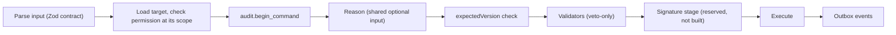

# Regulated readiness

The pilot customer is not in a regulated industry, but release 1 must not close the path to a regulated customer later. Regulation reaches NorthMES through its customers: a regulated manufacturer must validate the computerized systems that hold its required records and must assess the supplier of those systems. NorthMES is production software, not a medical device, so no notified body assesses it; the customer is inspected and the vendor is audited as a supplier. This document summarizes what regulated customers require, lists the 24 no-regret rules that release 1 follows and where each one lives, names the traps that release 1 avoids, and gives the work list per industry for the day a regulated customer signs. The rules are recorded in [ADR 0051](../adr/0051-regulated-readiness-no-regret-rules.md). This is engineering planning, not legal or regulatory advice; where a source was paywalled or not read, the text says so.

## Decisions

| Topic | ADR | Status |
|---|---|---|
| Regulated readiness: the 24 no-regret rules, the compliance profile, the signature stage, security answers for the pilot | [ADR 0051](../adr/0051-regulated-readiness-no-regret-rules.md) | accepted; needs confirmation on the signature path, the vendor's role under the Cyber Resilience Act and the regulated profile switch |
| Audit trail, export format, retention, personal data | [ADR 0013](../adr/0013-audit-trail-written-in-the-command-transaction.md) | accepted |
| Commands as the single write path, the shared reason input, the reserved signature stage | [ADR 0012](../adr/0012-commands-as-the-single-write-path.md) | proposed |
| Operators as full users, dated badges, retired usernames, temporary admin passwords | [ADR 0010](../adr/0010-identity-with-better-auth-roles-and-permissions-in-core-tables.md) | accepted |
| Reports are facts, corrections as new rows | [ADR 0033](../adr/0033-online-operator-station-in-the-production-start-module.md) | accepted |
| AI never commits and never evaluates people | [ADR 0035](../adr/0035-ai-provider-port-with-customer-configured-providers.md), [ADR 0036](../adr/0036-agent-proposals-as-planning-records-a-person-commits.md) | accepted |
| One installation per customer | [ADR 0044](../adr/0044-on-prem-deployment-with-docker-compose-and-mandatory-tls.md) | accepted |

## How regulation reaches NorthMES

| Party | Role | What it owns |
|---|---|---|
| Regulated customer | Manufacturer under ISO 13485 and the FDA QMSR, EU or US GMP, food law, or IATF 16949 | Intended use, user requirements, risk assessment, validation, procedures (audit trail review, signature policy, training), periodic review, the decision to release product. The "regulated user" in Annex 11. |
| NorthMES (the software) | A computerized system that holds records the customer must keep | Features that make compliance possible: audit trail, access control, signatures, record copies, retention, time stamps |
| Flexmatic (the vendor) | Supplier of a configurable product, sometimes also installer and support provider | A quality management system for development, test evidence, release and change information, vulnerability handling, documentation, support |
| Hosting partner, if any | Service provider | Operation, backups, access; needs a formal agreement with the customer (Annex 11 (2011) 3.1) |

What follows from this for the design:

- Part 11 applies through predicate rules. The FDA's Computer Software Assurance guidance says that when a manufacturer keeps a document required under Part 820 in electronic form, Part 11 generally applies. A device maker's production records in NorthMES are such documents.
- Annex 11 (2011) asks for formal agreements with third parties that install, configure, maintain or host the system (3.1), a supplier audit decided by risk (3.2), and a supplier assessed against an appropriate quality management system (4.5). The 2025 draft revision (section 7) lets the customer reuse a vendor's deliverables after assessing the vendor, rather than repeating the work.
- The FDA's guidance lets a manufacturer review a vendor's development and quality practices, cybersecurity practices including an SBOM, and data integrity capabilities (retention, archiving, complete copies, time-stamped audit trails, encryption, access controls, signature controls), and lean on vendor validation records.
- One installation per customer ([ADR 0044](../adr/0044-on-prem-deployment-with-docker-compose-and-mandatory-tls.md)) keeps each installation a separately validated system and a closed system in the Part 11 sense (access controlled by the people responsible for the records).
- Public source code under the AGPL helps supplier audits: an auditor can read the code, and source escrow is not a question.
- Under GAMP 5 (second edition, 2022), NorthMES core configured through settings, roles and master data is a category 4 configured product. Customer plugins and forked modules are category 5 custom code and need the customer's full life-cycle treatment. Core modules are therefore never distributed as examples to copy.
- Under the FDA's Computer Software Assurance guidance (3 February 2026), a planning and reporting MES is mostly not high process risk, so customers can test it with lighter, unscripted methods. A feature that accepts product without a person, or that sets machine parameters, moves to high process risk. Data collection that only records stays low.

## What regulated customers require

Section numbers of the Annex 11 and Chapter 4 drafts are those of the 2025 consultation texts and may change before adoption. ISO 13485, ISO 9001, ISO/IEC 27001, IATF 16949, GAMP 5, VDA Volume 1 and BRCGS are paywalled; their clause content comes from secondary sources and is marked so.

### 21 CFR Part 11 (FDA)

- 11.10(e): secure, computer-generated, time-stamped audit trails that record operator entries and actions that create, modify or delete records; changes must not obscure earlier information; the trail is kept as long as the records. The FDA's 2003 scope and application guidance exercises enforcement discretion on 11.10(e), but predicate rules on date, time and sequencing still apply.
- 11.10(a), (b), (d), (g): validation and the ability to discern altered records; accurate and complete copies in human-readable and electronic form; access limited to authorized people; authority checks before a record is altered or signed.
- 11.10(f), (h), (i), (k): permitted sequencing; checks of the source of data input; training of the people who develop, maintain or use the system; controlled system documentation with its own change history.
- 11.3(b)(4) and (9), 11.30: a closed system is one whose access the record owners control; an open system needs extra controls such as encryption and digital signature standards.
- 11.50 and 11.70: a signed record shows the signer's printed name, date and time, and the meaning; signatures are linked so they cannot be excised, copied or transferred.
- 11.100(a): a signature is unique to one person and never reused or reassigned.
- 11.200(a): at least two components, such as a user id and password; use of another person's signature must need two or more people to collaborate (so an administrator who sets a password must not be able to sign as that user).
- 11.300: unique id and password combinations, periodic checks, loss management for tokens and cards, detection and urgent reporting of unauthorized use, testing of tokens and cards.
- 21 CFR 211.188 (drug batch records) and 211.68(b): batch records name the people who perform and who check each significant step; changes to master records only by authorized people.

### EU GMP Annex 11 and its draft revision

- Annex 11 (2011), in force: risk-based audit trail of GMP-relevant changes and deletions with the reason documented and regular review (9); controlled change management (10); periodic evaluation (11); creation, change and cancellation of access rights recorded (12.3); operator identity, date and time recorded for data entry and changes (12.4); electronic signatures permanently linked to their record with time and date (14); batch release by a Qualified Person with an electronic signature (15).
- The 2025 consultation draft (consultation from 7 July to 7 October 2025; on 2026-10-04 the EudraLex Volume 4 page still listed the 2011 text): a token or smart card alone is not sufficient authentication if another user could use it (11.3); passwords from an administrator are changed at first login (11.4); password rules for critical systems (11.5); multi-factor authentication from outside controlled perimeters (11.6); lockout after failed attempts, unlocked only by an administrator (11.7); inactivity logout (11.8); an access log of logins and logouts (11.9).
- Draft audit trail (12.1 to 12.10): all manual interactions that create, modify or delete data, settings or access rights; who (with role), what (old and new value), when (with time zone), recorded at the time, with a prompt for the reason; enabled and locked, no user may edit audit data, and changes to audit settings or system time are themselves audited; sort, search and export, where flat and locked files are not acceptable; documented, risk-based review.
- Draft signatures (13.2 to 13.8): full re-authentication; a smart card, a PIN or reliance on the earlier sign-in is not acceptable; date, time and time zone; manifestation with full name, username, role, meaning, date and time; a later change shows the record as unsigned.
- EU GMP Chapter 4 (2011) 4.11, repeated in the 2025 draft as 4.77: batch documentation is kept one year after batch expiry or at least five years after Qualified Person certification, whichever is longer.
- Draft Annex 22 (2025) on AI: generative AI and large language models should not be used in critical GMP applications; in non-critical applications a human in the loop is responsible for the output. The NorthMES assistant proposes and a person commits, which fits non-critical use ([10-ai-and-agents.md](10-ai-and-agents.md)).
- PIC/S PI 041-1 (2021): ALCOA+ data integrity, shared logins do not allow traceability to a person (9.5), clocks synchronized and restricted (9.5), a time zone record where needed (9.8).

The sources disagree on passwords, so the password policy must be a setting of the compliance profile, not code:

| Topic | 21 CFR 11.300 | Draft Annex 11 (2025) | NIST SP 800-63B-4 (2025) |
|---|---|---|---|
| Periodic change | Periodically checked, recalled or revised (for example password aging) | Not required; new passwords significantly different; administrator-issued passwords changed at first login | Must not require periodic change; force a change on evidence of compromise |
| Composition | Not specified | Length and character classes for critical systems; no dictionary words, names or user ids | Must not impose composition rules |
| Lockout | Detect and report unauthorized attempts | Lock after a set number of failures; administrator unlocks after checking | Not compared |
| Inactivity | Not specified | Automatic logout the user cannot change, then re-authentication | Not compared |
| Remote access | Not specified | Multi-factor authentication from outside controlled perimeters | Not compared |

### ISO 13485 and the FDA QMSR (medical devices)

- The Quality Management System Regulation (21 CFR 820) took effect on 2 February 2026 and incorporates ISO 13485:2016 by reference. 820.10(b) adds UDI identification and traceability rules; 820.35(c) requires the UDI to be recorded for each device or batch.
- The QMSR dropped the terms DMR, DHF and DHR. Most of the former device history record content now sits in the medical device or batch record of ISO 13485 clause 7.5.1. Where ISO 13485 says "approved", the record carries a signature and date, and it may be electronic.
- ISO 13485:2016 (secondary sources): 4.1.6 and 7.5.6 require documented, risk-based validation of quality and production software before first use and after changes; 4.2.5 keeps records for the device lifetime and not less than two years from release, and changes to a record stay identifiable.
- Regulation (EU) 2017/745 (MDR): technical documentation kept at least 10 years after the last device is placed on the market, 15 for implantables (Article 10(8)); economic operators identify whom they supplied and who supplied them (Article 25(2)); the UDI is a device identifier plus a production identifier (lot, serial, software identification, manufacturing or expiry date) (Article 27, Annex VI Part C). 21 CFR 801.3 defines the US production identifier the same way.

What it asks of NorthMES: a production order must be able to produce the 7.5.1 record (what was made, how much was good and released, when, on which equipment, by whom, from which material lots, with which deviations, with which production identifier). Release 1 holds orders, operations, equipment and station reports; lots, serials and production identifiers belong to a later Traceability module. Batch release needs an electronic signature. Retention runs for 10 to 15 years or more, longer than any software version lives, so exports must stay readable without NorthMES (rule 17).

### IATF 16949 (automotive)

- IATF 16949:2016 (secondary sources): 8.5.2.1 asks for a traceability plan that identifies and segregates nonconforming or suspect product within customer response times, serializes products when a customer or regulation asks, and covers bought-in parts with safety or regulatory characteristics. 7.5.3.2.1 asks for a retention policy; listed record types (production part approvals, tooling, design, purchasing) are kept for the active production and service life plus one calendar year unless a customer or regulator says otherwise.
- Each vehicle maker publishes customer-specific requirements; their retention and traceability rules vary and were not compared. VDA Volume 1 (4th edition, August 2018) covers documented information and retention; its periods were not read. Supplier agreements found online often ask for 15 years after the last delivery for records of special characteristics.
- TISAX: the VDA published ISA2027 on 1 July 2026, and it applies to TISAX assessments ordered from 1 January 2027. A vendor with no access to the installation or the customer's data answers questions about secure development, vulnerability handling and update integrity. A vendor that provides remote support or receives database copies becomes a service provider inside the customer's supplier controls and may be asked for a label or an equivalent assessment. NorthMES support goes through the customer's VPN with named, logged accounts, and no database dump leaves the site ([12-operations-and-security.md](12-operations-and-security.md)).

### Food traceability

- Regulation (EC) 178/2002, Article 18: traceability at all stages; operators identify who supplied them and to which businesses they supplied, and give that to authorities on demand. The article names suppliers and business customers, not links inside the plant.
- US Food Traceability Rule (21 CFR Part 1 Subpart S, FSMA section 204): seven Critical Tracking Events (harvesting, cooling, initial packing, first land-based receiving, shipping, receiving, transformation). For a transformation, 1.1350 asks for the input lot codes, descriptions and quantities, and for the output's new lot code, location, date, description, quantity and the reference document type and number. 1.1455 asks for an electronic sortable spreadsheet within 24 hours of an FDA request in an outbreak or recall, and two years of retention. The FDA page (updated 2026-07-24) shows the original compliance date of 20 January 2026, a proposed extension to 20 July 2028, and a congressional direction not to enforce before that date. How the rule reaches an EU exporter was not checked.
- Certification schemes ask for more inside the plant: BRCGS Food Safety Issue 9 clause 3.9 (secondary sources) asks for an annual traceability test with full forward and backward traceability and a mass balance within 4 hours.

For the later Traceability module: a trace event is a Critical Tracking Event, a trace link with quantities is the transformation record, a lot code is the traceability lot code, the production order number is the reference document number, and the plant is the location. A recall report (one step back, internal genealogy, one step forward, mass balance) and a sortable spreadsheet export cover both laws. Release 1 needs only stable ids for this.

### NIS2 and the Swedish Cybersäkerhetslag

- Directive (EU) 2022/2555 (NIS2), Article 21(2), lists measures including supply chain security (d), security in acquisition, development and maintenance with vulnerability handling and disclosure (e), and multi-factor authentication (j). Article 21(3) asks entities to consider the quality of their suppliers' products and secure development practices.
- Annex II covers manufacturing of medical devices, computers and electronics (NACE C26), electrical equipment (C27), machinery (C28), motor vehicles (C29) and other transport equipment (C30), plus food production and chemicals.
- Sweden's Cybersäkerhetslag (2025:1506) has applied since 15 January 2026 and replaces lag (2018:1174). It covers operators in Annex I or II that are established in Sweden and are at least medium-sized under Commission Recommendation 2003/361/EC: 50 or more employees, or both annual turnover and balance sheet total above EUR 10 million, with partner and linked enterprises counted. Chapter 2, section 3 lists ten measure areas, including supply chain security and security in acquisition, development and maintenance. A significant incident is reported within 24 hours (chapter 2, section 5) and notified within 72 hours (section 6).
- Effect: customers in scope pass these duties to their suppliers through contracts and questionnaires (secure development, vulnerability handling, SBOM, update integrity, incident notification). Whether the pilot customer is in scope is an open question, and the multi-factor authentication choice for the pilot (Microsoft Entra as sign-in provider, or Better Auth two-factor after a review of its advisories) waits for that answer ([ADR 0051](../adr/0051-regulated-readiness-no-regret-rules.md)).

### Cyber Resilience Act (the vendor's own obligations)

- Regulation (EU) 2024/2847: reporting obligations (Article 14) apply from 11 September 2026, and the manufacturer obligations from 11 December 2027 (Article 71).
- Annex I Part II (1) (secondary sources) asks for an SBOM in a common machine-readable format that covers at least the top-level dependencies.
- Annex I Part I (2)(l) asks products to record and monitor relevant internal activity, with an opt-out for the user. That pulls against the locked audit trail of the Annex 11 draft. The compliance profile resolves it: the standard profile may allow opt-outs of optional categories, and a regulated profile does not.
- Release 1 answers: `SECURITY.md` with GitHub private vulnerability reporting, security@northmes.dev, a supported-versions table (latest minor only before 1.0) and a response target; an SBOM per package and per image ([ADR 0040](../adr/0040-dependency-license-policy-ci-gate-and-sbom.md)); artifact attestations on release images and bundles ([ADR 0050](../adr/0050-github-organization-rulesets-ci-runners-and-supply-chain.md)). The plan prepares for the manufacturer obligations; the vendor's role is recorded as needing confirmation in ADR 0051. Whether NorthMES falls into an important or critical product class was not checked.

### ISO 9001 and ISO/IEC 27001

- ISO 9001 is the most likely standard a customer without GxP obligations brings: its auditor asks how NorthMES records are protected, retained and changed. ISO 9001:2015 clause 7.5 covers documented information (secondary sources). ISO 9001:2026 was published on 16 September 2026; from 31 March 2028 new accredited certificates are issued only against it, and certified organizations transition by 30 September 2029. Its clause numbers were not checked.
- Customers with an ISO/IEC 27001 management system apply Annex A controls to software vendors (secondary sources): supplier relationships and agreements (5.19, 5.20), the ICT supply chain (5.21), monitoring of supplier services (5.22), technical vulnerabilities (8.8), clock synchronization (8.17), secure development (8.25, 8.28, 8.29) and outsourced development (8.30). Expect a questionnaire that maps to these.

### Retention periods compared

| Source | Period |
|---|---|
| 21 CFR 11.10(e) | Audit trail at least as long as the subject records |
| ISO 13485:2016 4.2.5 (secondary) | Device lifetime, not less than 2 years from release |
| Regulation (EU) 2017/745, Articles 10(8) and 25(2) | 10 years after the last device placed on the market; 15 for implantables |
| EU GMP Chapter 4 (2011) 4.11 | 1 year after batch expiry or 5 years after Qualified Person certification, whichever is longer |
| 21 CFR 1.1455(d) | 2 years |
| IATF 16949 7.5.3.2.1 (secondary) | Active production and service life plus 1 calendar year for listed record types |
| Automotive supplier agreements (secondary, varies) | Often 15 years after the last delivery for special characteristics |

NorthMES must therefore keep records for 15 years or more, across many software versions and schema changes. No audit deletion by default (rule 24) and a documented export format (rule 17) are the answer. A GDPR retention setting must never delete records inside a legal retention period.

### ALCOA+ mapped to NorthMES

PIC/S PI 041-1 defines ALCOA+ (attributable, legible, contemporaneous, original, accurate, plus complete, consistent, enduring and available); the 2025 draft of EU GMP Chapter 4 adds traceable (ALCOA++).

| Attribute | NorthMES mechanism |
|---|---|
| Attributable | Principal, acting-for user, credential, surface, scope and roles on every command row; no shared logins; support engineers are named users |
| Legible | History tab per record, admin audit list, exports in a documented format |
| Contemporaneous | Record time from the database clock; device time kept as data |
| Original | First capture kept; corrections are new records |
| Accurate | Zod contracts on every input, `numeric(18,6)` quantities, the unit catalog |
| Complete | Every module and plugin table audited by default; no hard deletes of business records; denied commands as security events |
| Consistent | One clock source per record type; calendar versions frozen once in effect |
| Enduring | pgBackRest with point-in-time recovery, offsite repository, restore drills ([ADR 0045](../adr/0045-backups-restore-drills-upgrades-and-rollback.md)); archive exports |
| Available | Search, filter and export of the trail; retention per category |
| Traceable | Correlation and causation ids, stable uuidv7 ids, software version and configuration revision per command |

## No-regret rules in release 1

Release 1 follows 24 rules ([ADR 0051](../adr/0051-regulated-readiness-no-regret-rules.md)). It builds rules 2, 4, 5, 8, 10, 11, 13, 14, 15 (the columns), 17, 18 and 19 (the ids) at about 8 to 10 developer days (an estimate, not a measurement). Rules 6, 7 and 12 are design decisions that cost nothing extra when made before the code exists. Rule 16 is reserved in the command pipeline and built later. The `northmes config export` command (rule 15), test evidence retention (rule 19) and the Supplier quality page (rule 21) come before the first regulated sale.

| # | Rule | Release 1 | Where it lives | Check |
|---|---|---|---|---|
| 1 | Every command can carry a reason; manifests declare where it is required | Built | One shared optional reason input on every mutation, so the contract stays fixed when a profile later requires reasons; stored in `audit.command.reason`. Required today for breaking a soft lock (3 to 500 characters) and for report corrections ([ADR 0012](../adr/0012-commands-as-the-single-write-path.md), [ADR 0029](../adr/0029-per-planner-drafts-soft-locks-and-the-plan-revision.md), [ADR 0033](../adr/0033-online-operator-station-in-the-production-start-module.md)) | A schema test asserts that every Mutation field accepts the shared reason input |
| 2 | The audit keeps old and new values; exports write instants with UTC offset and the plant's IANA zone | Built | Field diffs from the `audit.capture_row` trigger; the audit export ([ADR 0013](../adr/0013-audit-trail-written-in-the-command-transaction.md)) | An export test asserts offset and zone on every instant |
| 3 | Command rows record principal, acting-for user, credential, surface, scope and roles in effect | Built | `audit.command`, written by `audit.begin_command()` in the command transaction ([ADR 0013](../adr/0013-audit-trail-written-in-the-command-transaction.md)) | Pipeline integration tests per surface (web, mcp, assistant, station, connector, job, cli, sql) |
| 4 | Production facts are append-only; a correction is a new record that references the original and carries a reason; no update endpoint for reports | Built | Station reports in the production-start module: UPDATE and DELETE revoked from the runtime role; `productionStart.correctReport` inserts a correction row with `corrects_report_id` and a required reason; correcting a correction is refused ([ADR 0033](../adr/0033-online-operator-station-in-the-production-start-module.md), [09-operator-station.md](09-operator-station.md)) | An UPDATE on a report table as the runtime role fails; `CORRECTION_EXCEEDS_ORIGINAL` when the net would go below zero |
| 5 | No hard deletes of business records; a row with reports is frozen and autoplan never deletes or recreates it; reports reference the order operation and equipment | Built | `archived_at` on business records ([ADR 0006](../adr/0006-kysely-sql-first-migrations-and-the-northmes-migration-runner.md)); job orders are record class with DELETE and TRUNCATE revoked ([ADR 0013](../adr/0013-audit-trail-written-in-the-command-transaction.md)); machine or start changes apply only while the job order is `planned` ([ADR 0028](../adr/0028-autoplan-as-a-pure-deterministic-function.md)); reports store `job_order_id`, `production_order_operation_id` and `equipment_id` | A DELETE on `job_order` as the runtime role fails; autoplan over a row with reports leaves it unchanged |
| 6 | Behaviour-affecting configuration lives in audited database tables; environment variables hold only infrastructure settings and secrets | Design rule | Settings through `defineSettings` at company and plant scope; switches that look like infrastructure (a connector's shadow or live mode) are audited settings commands, and installation-wide ones (enabling `/mcp`) are audited `northmes installation set` commands on the host ([ADR 0066](../adr/0066-companies-created-by-the-cli-plant-slugs-unique-per-installation-company-settings-at-settings-and-an-onboarding-wizard-before-a-plant-opens.md)); `core.config_revision` bumps on every change ([ADR 0022](../adr/0022-shared-building-blocks-packages-the-master-data-kit-settings-and-generators.md)) | Review checklist: a new `NORTHMES_*` variable that changes behaviour is rejected |
| 7 | Plugin enablement, HTTP action endpoints and their fail-open choice are audited commands | Design rule | Validators are veto-only and fail closed on a throw or timeout ([ADR 0037](../adr/0037-plugins-drop-in-packages-command-validators-and-ui-slots.md)); installing a plugin is config, migrate and restart, and the installed catalog (module ids, versions, manifest hashes, supergraph hash) is folded into the configuration revision with one boot command when it changes ([ADR 0013](../adr/0013-audit-trail-written-in-the-command-transaction.md)). Per-organization enablement and HTTP actions do not exist in release 1 | A validator that throws rejects the command; a catalog change writes one boot command |
| 8 | An order's copy of the routing records the source operation id and its `version` at release | Built | Planning module, production order operations ([07-production-planning.md](07-production-planning.md)) | A release test asserts source id and version on each copied operation |
| 9 | Calendar and shift versions are immutable once in effect | Built | Calendar versions with `effective_from`, frozen once in effect by the plant's local date read from `core.clock_now()` ([ADR 0025](../adr/0025-plant-calendars-shift-patterns-and-the-production-day.md)) | Editing a version in effect fails |
| 10 | Every record time comes from the database clock; device time is stored as data; System health compares clocks and shows NTP status | Built | Audit `occurred_at = now()` ([ADR 0013](../adr/0013-audit-trail-written-in-the-command-transaction.md)); reports store `device_time`, `received_at` and a nullable `effective_at` ([ADR 0033](../adr/0033-online-operator-station-in-the-production-start-module.md)); clock skew measured per request from a client time header with a warning above 5 s, and NTP status on System health ([ADR 0043](../adr/0043-health-endpoints-graceful-shutdown-and-the-system-health-page.md)) | A report with a skewed device time keeps the database `received_at` |
| 11 | Ids are uuidv7 and never reused; a username is never reassigned; badge assignments are dated records | Built | uuidv7 primary keys ([ADR 0006](../adr/0006-kysely-sql-first-migrations-and-the-northmes-migration-runner.md)); `core.retired_username` holds an HMAC of each retired username and user creation checks it; `core.badge_assignment(user_id, badge_hmac, valid_from, valid_to)` ([ADR 0010](../adr/0010-identity-with-better-auth-roles-and-permissions-in-core-tables.md)) | Creating a user with a retired username fails |
| 12 | Every operator is a full user with a username, even when signing in by badge only | Design rule | Badge and PIN are sign-in methods on a full user; operators without an email get a placeholder address, working proposal under the reserved `.invalid` domain ([ADR 0010](../adr/0010-identity-with-better-auth-roles-and-permissions-in-core-tables.md)) | A badge sign-in resolves to a user id |
| 13 | A password set by an administrator is temporary and must be changed at the next sign-in | Built | User management commands ([ADR 0010](../adr/0010-identity-with-better-auth-roles-and-permissions-in-core-tables.md), [ADR 0011](../adr/0011-principals-credentials-and-same-origin-rules.md)) | After an admin reset, sign-in requires a new password before any other request succeeds |
| 14 | One installation policy object (the compliance profile) decides audit opt-outs, redaction, reason requirements, password, lockout and session rules, AI availability and signature requirements | Built, standard profile only | Core; installation-wide, not per company; switching to a regulated profile is one-way and CLI-only ([ADR 0051](../adr/0051-regulated-readiness-no-regret-rules.md)) | Every compliance-sensitive branch reads the policy object; a test lists them |
| 15 | Each audit command row records the NorthMES version, image digest and configuration revision; `northmes config export` writes enabled modules, plugins with versions, roles and settings | Columns built; export before the first regulated sale | `audit.command`; the build identity sits in OCI labels and `/app/build.json` ([ADR 0013](../adr/0013-audit-trail-written-in-the-command-transaction.md)) | A command row holds the running version and digest |
| 16 | The command pipeline reserves a signature stage between validation and execution; manifests may declare `signature` on a command; one transaction stays one audit command, so a signature binds to one command id and a record hash | Reserved, not built | Command pipeline ([ADR 0012](../adr/0012-commands-as-the-single-write-path.md)); `recordHash` and station signing wait for signatures ([ADR 0013](../adr/0013-audit-trail-written-in-the-command-transaction.md)) | The manifest schema accepts the `signature` key |
| 17 | Audit and record exports use a documented, versioned format readable without NorthMES | Built | JSON Lines plus a manifest with field labels, an id-to-label dictionary and plant zones; the export is itself a command whose detail holds filters, row count and format version; migrations that rename an audited column record the mapping ([ADR 0013](../adr/0013-audit-trail-written-in-the-command-transaction.md)) | An export round-trip test reads the file with a plain JSON parser |
| 18 | Every change carries a validation impact: none, UI only, records, security, calculation, data migration | Built | Every pull request ([ADR 0038](../adr/0038-versions-and-releases-lockstep-0-x-release-please-api-reports.md), [13-delivery-and-github.md](13-delivery-and-github.md)) | The pull request check fails without a validation impact |
| 19 | Tests carry requirement ids; CI keeps JUnit XML from Vitest and Playwright, coverage and e2e reports per release tag | Ids from the first test; evidence retention before the first regulated sale | Test strategy ([ADR 0041](../adr/0041-test-strategy-tdd-vitest-projects-testcontainers-and-playwright.md), [11-quality-and-testing.md](11-quality-and-testing.md)). The id format is not fixed yet | A traceability matrix can be generated from test ids |
| 20 | SBOM per package and image, `SECURITY.md`, signed images, license notices | Built | License gate and SBOM ([ADR 0040](../adr/0040-dependency-license-policy-ci-gate-and-sbom.md)); artifact attestations ([ADR 0050](../adr/0050-github-organization-rulesets-ci-runners-and-supply-chain.md)); `SECURITY.md` ([ADR 0051](../adr/0051-regulated-readiness-no-regret-rules.md)); `LICENSE`, `NOTICE` and SPDX headers ([ADR 0039](../adr/0039-license-agpl-3-0-or-later-core-and-a-contributor-license-agreement.md)) | CI license gate; release workflow attaches SBOMs and attestations |
| 21 | A Supplier quality page in the docs: development process, review, testing, release, vulnerability handling, support periods, data integrity features | Before the first regulated sale (about 1 day) | docs.northmes.dev ([ADR 0048](../adr/0048-documentation-on-docs7-at-docs-northmes-dev.md)) | Present before the first regulated sale |
| 22 | AI never commits; agent writes are proposals a person commits; AI features never score, rank or assign people | Built | [ADR 0035](../adr/0035-ai-provider-port-with-customer-configured-providers.md), [ADR 0036](../adr/0036-agent-proposals-as-planning-records-a-person-commits.md), [10-ai-and-agents.md](10-ai-and-agents.md) | `planning.commitProposal` does not exist; accept copies into a person's draft |
| 23 | One installation per customer | Decided | [ADR 0044](../adr/0044-on-prem-deployment-with-docker-compose-and-mandatory-tls.md) | None |
| 24 | No audit deletion by default; partition export then drop is the only delete path | Built | Audit command and change rows have no retention limit by default (a customer setting); security event partitions are dropped after a default period held in an audited settings row, through a definer drop function ([ADR 0013](../adr/0013-audit-trail-written-in-the-command-transaction.md)) | UPDATE, DELETE and TRUNCATE on audit tables fail for every runtime role |

The reserved signature stage sits here in the command pipeline:

Two more release 1 rules support the same goals. Support engineers are named NorthMES users with a support role, and a command with surface `sql` requires an active support user and a reason ([ADR 0051](../adr/0051-regulated-readiness-no-regret-rules.md)). A restore or rollback writes a security event, exports the audit and report rows written after the restore point for re-entry, and shows admins and planners a banner for 24 hours ([ADR 0045](../adr/0045-backups-restore-drills-upgrades-and-rollback.md)).

## Traps release 1 avoids

| # | Trap | Why it corners a regulated customer | What release 1 does |
|---|---|---|---|
| C1 | Operators exist only as badge holders | The Annex 11 draft rejects token-only authentication when another person could use the token and rejects a PIN or smart card for signatures; Part 11 signatures need two components. Adding credentials later is an identity migration | Every operator is a full user with a username (rule 12). Badge and optional PIN stay sign-in methods; a regulated profile can make the PIN mandatory |
| C2 | Autoplan or a planner deletes and recreates job orders that carry reports | Reports lose their link, and the device or batch record breaks | Rows with reports are frozen; reports reference the order operation and equipment (rule 5) |
| C3 | Free-text redaction and erasure inside the audit trail | The Annex 11 draft forbids editing audit data; Part 11 needs the signer's printed name for the retention period | Records and audit rows hold person ids, not names; erasure is pseudonymization of the user tables, and the auth schema has no capture trigger. Redaction is allowed with a reason in the standard profile and refused in a regulated one. Signature records will keep a name snapshot ([ADR 0013](../adr/0013-audit-trail-written-in-the-command-transaction.md)) |
| C4 | AI output becomes a record without a person's commit | The Annex 22 draft keeps large language models out of critical GMP use | Proposals plus a person's commit; `proposal_id` recorded on the accept command; the policy object can hide AI per module (rule 22) |
| C5 | Behaviour changes at runtime without change control (plugin toggles, fail-open actions) | Annex 11 (2011) section 10 asks for controlled changes; a fail-open action silently skips a validated check | Validators fail closed; plugin installs change the configuration revision; every record carries the running version and configuration (rules 7 and 15) |
| C6 | Reports edited in place | Part 11 11.10(e): changes must not obscure earlier information | Append-only reports with correction rows (rule 4) |
| C7 | Behaviour configured by environment variables | Not in the audit trail and not in the configuration export | Behaviour settings in audited tables only (rule 6) |
| C8 | Record time from a client or an unsynchronized host | Contemporaneous recording and sequencing break | Database clock for record times, skew check on System health (rule 10). The release 1 station is online only, so no offline replay exists |
| C9 | One installation holds several companies with different obligations | Validation is per installation; a per-company profile doubles the test matrix | The policy object is installation-wide; a regulated company in a mixed group gets its own installation |
| C10 | Partner hosting where the partner controls access | The system may count as open under Part 11, which brings 11.30 and the draft's trusted-services rule | Decide before offering partner hosting to a regulated customer; prefer customer-controlled access |
| C11 | Monthly minor releases, and after 1.0 twelve months of fixes for one minor a year | Each upgrade needs an impact assessment and regression evidence from the customer | The validation impact field makes the assessment cheap (rule 18); a longer support line and cumulative release notes are decided when a regulated customer signs ([ADR 0038](../adr/0038-versions-and-releases-lockstep-0-x-release-please-api-reports.md)) |
| C12 | Agent-written code without recorded human review | A supplier audit asks how code is reviewed and released; Part 11 11.10(i) asks for developer qualification | Pull requests keep their review record ([13-delivery-and-github.md](13-delivery-and-github.md)); the Supplier quality page describes the agent-assisted process |
| C13 | Admin-set passwords that stay valid | An administrator who knows a password could sign as the user (11.200(a)(3)) | Admin-set passwords are temporary (rule 13) |

Badge sign-in, AI, plugins and audit redaction are all fixable as policy settings later, provided rules 4 to 7 and 12 to 16 hold.

## When a regulated customer signs

All effort figures below are estimates in developer days, not measurements.

### First steps

1. Classify the customer: industry, markets (EU, US), which regulations apply, and whether Part 11 applies through predicate rules.
2. Agree the intended use and the GMP or quality-relevant functions; mark the high process risk features.
3. Turn on the regulated profile and agree the policy values: password, lockout, inactivity, reasons, signatures.
4. Deliver the validation package for the installed version and run the supplier audit.
5. Plan the industry work below against the customer's go-live date.

### Baseline for any regulated customer

| # | Work | Estimate |
|---|---|---|
| B1 | Regulated profile with a locked audit trail: no category opt-outs, no redaction, seals and `northmes audit verify`, a separate audit owner role, a DDL event trigger | 5 to 8 |
| B2 | Identity and access: password policy settings, lockout with administrator unlock, inactivity logout for planner sessions with re-authentication, a complete access log including inactivity logout, multi-factor authentication for remote access | 6 to 10 |
| B3 | Reason prompts for declared commands and fields, switched by the profile | 2 to 4 |
| B4 | Audit review support: filters for critical data, "changes since the last review", a recorded review | 3 to 5 |
| B5 | Accurate and complete copies: order history with its audit trail as PDF and in the documented export format | 4 to 6 |
| B6 | Vendor validation package: requirement catalogue, function risk assessment (high process risk or not), traceability matrix from test ids, CI evidence bundle, installation report from `northmes config export` and image digests, a Part 11 and Annex 11 compliance matrix | 10 to 15 the first time; 2 to 4 per release after |
| B7 | Supplier audit pack: QMS description, development and review process, change and release control, vulnerability handling, data integrity features, support terms; a rehearsal audit | 8 to 12 |
| | Total | about 38 to 60, or 8 to 12 weeks |

Notes for B2: planner sessions last 7 days by default, which the draft's inactivity logout would not accept in a GMP installation. A built-in failed-attempt lockout was not found in Better Auth (its absence is not verified); lockout can be built on the sign-in hooks and the admin plugin's ban fields.

### Medical devices (ISO 13485, QMSR, MDR)

| Work | Estimate | Outside help |
|---|---|---|
| Electronic signatures: release and approvals, re-authentication, meaning, manifestation, record hash, unsigned on change, signatures in exports | 10 to 15 | A validation consultant (CSA, GAMP) reviews the package; a regulatory consultant if NorthMES prints UDI labels |
| Traceability module core: lots, serials, trace events and links, lot status and hold, where-used and where-from queries, production identifier fields | 30 to 50 | |
| Device or batch record report (7.5.1); label and production identifier data to a printing plugin (printer integration not included); support for the customer's tests of its configuration | 15 to 28 | |

No notified body assesses NorthMES; the customer's notified body or the FDA inspects the customer's validation of it.

### Pharmaceuticals (Part 11, Annex 11, GMP)

| Work | Estimate | Outside help |
|---|---|---|
| Electronic signatures as above, second-person verification, Qualified Person release | 10 to 15, then EBR work | A computerized system validation consultant; a GMP specialist for the compliance matrix; the customer's QA audits the vendor |
| Electronic batch record: master batch records, weighing and dispensing, review by exception | Not estimated; several months | |

Pharma is not entered without a separate decision, because an electronic batch record is a product of its own.

### Food (178/2002, FSMA 204, BRCGS or IFS)

| Work | Estimate | Outside help |
|---|---|---|
| Traceability module core (shared with medical devices) | 30 to 50 | Certification bodies audit the customer, not NorthMES |
| Lots at goods receipt and dispatch, or the ERP integration that supplies them; recall report with mass balance; the 4-hour trace test as a performance test | 10 to 18 | |
| FSMA 204 sortable spreadsheet and Critical Tracking Event mapping, only for products on the US Food Traceability List | 5 to 10 | |

### Automotive (IATF 16949, customer-specific requirements, VDA, TISAX)

| Work | Estimate | Outside help |
|---|---|---|
| Serialization and suspect-product hold in the Traceability module | Included above | The IATF certification body audits the customer |
| Retention settings beyond 15 years and archive exports per customer requirement | 3 to 5 | |
| TISAX or an equivalent for the vendor, only if the vendor gets remote access or customer data | 20 to 40 days of ISMS work plus an assessment by an ENX-accredited audit provider | An ISMS consultant |

Genealogy response times become performance requirements on the trace queries.

### The vendor's own obligations

- A documented quality management system for development: scope, roles, requirements, design reviews, coding and review rules (including agent-assisted code), testing, release and change control, configuration management, vulnerability handling, developer training records (Part 11 11.10(i)), supplier control for dependencies (the license gate and SBOM), document control. It is aligned with ISO 9001 so certification stays possible; certification is optional until a customer asks. About 10 to 20 days to write.
- Supplier audit readiness: the audit pack (B7), a named contact, a questionnaire answer library mapped to ISO/IEC 27001 Annex A, NIS2 Article 21 and the FDA's vendor review list, and a policy for on-site and remote audits.
- A quality or supplier agreement template that states responsibilities, as Annex 11 (2011) 3.1 and the draft's section 7 ask.
- Cyber Resilience Act: the reporting process applies already; the full manufacturer obligations from 11 December 2027.
- A support period for regulated customers longer than the general one, and cumulative release notes across skipped versions.

## Open questions

Answers go into ADR 0051 and [16-open-questions.md](16-open-questions.md).

- Does the product owner confirm that the pilot customer is not regulated?
- Is the pilot customer in scope of the Cybersäkerhetslag (NACE code and size, group figures included)? Is it ISO 9001 certified, and do any of its own customers flow regulatory requirements down to it?
- Is a one-way, CLI-only switch to a regulated profile acceptable? (product owner)
- Which signature path, and do passkeys satisfy 21 CFR 11.200 for signing? Not verified.
- Which password policy is the regulated default: the Annex 11 draft (composition rules) or NIST SP 800-63B-4 (no composition, no periodic change)?
- Does Better Auth have a failed-attempt lockout, or does NorthMES build one on the ban fields? Not verified.
- Which archive format will a customer accept for 15 years or more of records?
- When will the revised Annex 11 and the new Annex 22 be adopted?
- Does NorthMES fall into an important or critical product class under the Cyber Resilience Act, and is the vendor's manufacturer role confirmed? (needs confirmation, ADR 0051)
- Retention periods per category, and erasure inside the append-only trail (needs confirmation, ADR 0013).
- Does FSMA 204 reach an EU food producer that exports listed foods to the US? Not checked.
- Which regulated industry is most likely for the second customer? That decides whether signatures or the Traceability module comes first.
- How long a support line can regulated customers get?
- Will partner hosting be offered to regulated customers, and who controls system access then?
- What format do requirement ids in tests take (rule 19)?

## References

- 21 CFR Part 11: https://www.law.cornell.edu/cfr/text/21/11.3, https://www.law.cornell.edu/cfr/text/21/11.10, https://www.law.cornell.edu/cfr/text/21/11.30, https://www.law.cornell.edu/cfr/text/21/11.50, https://www.law.cornell.edu/cfr/text/21/11.70, https://www.law.cornell.edu/cfr/text/21/11.100, https://www.law.cornell.edu/cfr/text/21/11.200, https://www.law.cornell.edu/cfr/text/21/11.300
- FDA, Part 11 scope and application (2003): https://www.fda.gov/regulatory-information/search-fda-guidance-documents/part-11-electronic-records-electronic-signatures-scope-and-application
- 21 CFR 211.68 and 211.188: https://www.law.cornell.edu/cfr/text/21/211.68, https://www.law.cornell.edu/cfr/text/21/211.188
- 21 CFR 801.3: https://www.law.cornell.edu/cfr/text/21/801.3
- 21 CFR 820 (QMSR): https://www.law.cornell.edu/cfr/text/21/part-820, https://www.law.cornell.edu/cfr/text/21/820.10, https://www.law.cornell.edu/cfr/text/21/820.35
- QMSR final rule, Federal Register of 2 February 2024: https://www.govinfo.gov/content/pkg/FR-2024-02-02/pdf/2024-01709.pdf
- FDA QMSR page: https://www.fda.gov/medical-devices/postmarket-requirements-devices/quality-management-system-regulation-qmsr
- FDA, Computer Software Assurance for Production and Quality Management System Software (3 February 2026): https://www.fda.gov/regulatory-information/search-fda-guidance-documents/computer-software-assurance-production-and-quality-management-system-software
- FDA Food Traceability Rule: https://www.fda.gov/food/food-safety-modernization-act-fsma/fsma-final-rule-requirements-additional-traceability-records-certain-foods; 21 CFR 1.1350 and 1.1455: https://www.law.cornell.edu/cfr/text/21/1.1350, https://www.law.cornell.edu/cfr/text/21/1.1455
- Regulation (EU) 2017/745: https://eur-lex.europa.eu/legal-content/EN/TXT/HTML/?uri=CELEX:32017R0745
- Regulation (EC) 178/2002, consolidated 2024-07-01: https://eur-lex.europa.eu/legal-content/EN/TXT/HTML/?uri=CELEX:02002R0178-20240701
- EudraLex Volume 4: https://health.ec.europa.eu/medicinal-products/eudralex/eudralex-volume-4_en; Annex 11 (2011): https://health.ec.europa.eu/system/files/2016-11/annex11_01-2011_en_0.pdf; Chapter 4 (2011): https://health.ec.europa.eu/system/files/2016-11/chapter4_01-2011_en_0.pdf; 2025 consultation on Chapter 4, Annex 11 and Annex 22: https://health.ec.europa.eu/consultations/stakeholders-consultation-eudralex-volume-4-good-manufacturing-practice-guidelines-chapter-4-annex_en
- PIC/S PI 041-1: https://picscheme.org/docview/4234
- ISPE GAMP 5 second edition: https://ispe.org/publications/guidance-documents/gamp-5-guide-2nd-edition
- NIST SP 800-63B-4: https://nvlpubs.nist.gov/nistpubs/SpecialPublications/NIST.SP.800-63B-4.pdf
- NIS2 Article 21 and Annex II (mirrors of the Official Journal text): https://www.nis-2-directive.com/NIS_2_Directive_Article_21.html, https://streamlex.eu/annexes/nis2-en-annex-ii/
- Cybersäkerhetslag (2025:1506): https://www.riksdagen.se/sv/dokument-och-lagar/dokument/svensk-forfattningssamling/cybersakerhetslag-20251506_sfs-2025-1506/
- Commission Recommendation 2003/361/EC: https://eur-lex.europa.eu/eli/reco/2003/361/oj/eng
- Cyber Resilience Act, Regulation (EU) 2024/2847: https://eur-lex.europa.eu/legal-content/EN/TXT/HTML/?uri=CELEX:32024R2847; application dates: https://digital-strategy.ec.europa.eu/en/policies/cra-summary
- TISAX and ISA2027: https://enx.com/en-US/TISAX/, https://enx.com/en-US/news/isa2027/
- VDA QMC Volume 1: https://webshop.vda.de/QMC/en/volume-1-docinfo-and-retention
- ISO 9001: https://www.iso.org/standard/9001; ISO/TC 176 news on the 2026 edition: https://committee.iso.org/sites/tc176/home/news/content-left-area/news-and-updates/news.html
